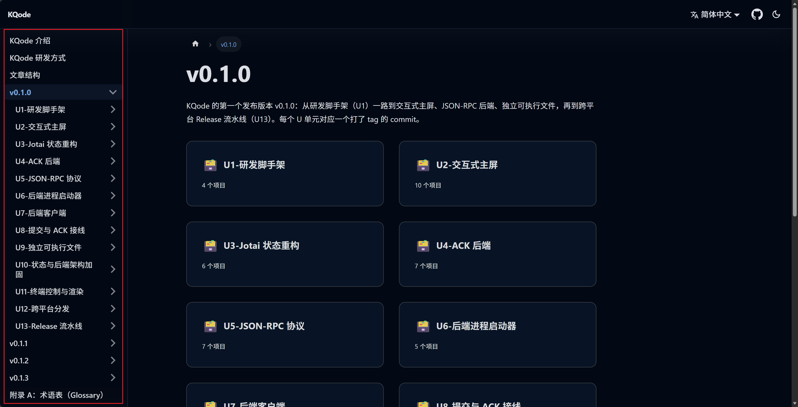

本篇说明本博客的组织方式，以及每篇文章大致遵循的结构，方便读者按需阅读。本篇写于 v0.1.3 发布之际，后续可能有所调整但此文章更新不及时，见谅。

## 整体组织

侧边栏从上到下大致分三段：

- **开头的说明性文章**：也就是《KQode 介绍》《KQode 研发方式》和本篇，交代项目目标、研发节奏和阅读方式。
- **按版本分组的研发日志**：`v0.1.0`、`v0.1.1`、`v0.1.2`…… 每个版本是一个分类，里面按时间顺序记录这个版本做了什么。
- **附录**：放在最末尾，例如 [附录 A：术语表（Glossary）](/category/glossary)，收录正文里直接使用的英文术语。

## 版本与 U 单元

研发日志按**发布版本**分组。首个版本 `v0.1.0` 的内容较多，又进一步拆成 U1–U13 共 13 个**里程碑（U 单元）**：每个 U 单元对应一个打了 tag 的 commit，只聚焦一件事，例如 U2 做交互式主界面、U5 做 JSON-RPC 协议。之后的 `v0.1.1`、`v0.1.2`、`v0.1.3` 是节奏更小的发布，直接以文章形式记录。

这样分组是为了让每一篇都对应一次「可运行的小步迭代」，而不是一份事后补写的大设计文档——这也呼应上一篇《KQode 研发方式》里说的研发节奏。

## 单篇文章的结构

大多数研发日志文章会包含下面几块（不强制，按需取用）：

- **总览**：这一步要做什么、为什么现在做。
- **关键决策与动机（why）**：为什么这么选、权衡了哪些方案。比起「怎么写」，本博客更看重「为什么这么写」。
- **代码引用**：贴出关键代码，并链接到当时的源码。
- **截图**：终端界面、运行效果等，帮助建立直观印象。
- **测试与验证**：这一步是怎么验证的（单元测试、构建、手动运行）。
- **总结**：这一步的产出、遗留问题和下一步。

## 代码引用指向固定的 commit

文章引用源码时，链接指向**写作时那个 commit 的永久链接（permalink）**，而不是随时会变的 `main` 分支。例如某个 U 单元的代码，会链接到它对应 tag 的 commit。这样即使后续代码重构，你点开链接看到的仍然是文章当时描述的版本，不会对不上。

## 命名与排序约定

- 文档文件用数字前缀排序（如 `010-`、`020-`），而**标题保持干净**、不带序号，这样调整顺序时不必改标题。
- 图片放在 `docs/images/<slug>/` 下，`<slug>` 是稳定的英文短横线命名（如 `article-structure`），不含序号或中文标题。
- 分类目录用 `_category_.json` 控制标签与顺序。

## 语言：中文为主，术语用英文

正文以中文为主，但 Coding Agent / Agent Harness 领域的很多术语没有精准的中文译法，会直接使用英文（如 TUI、JSON-RPC 等），以免翻译带来歧义。这些术语的简要解释集中放在 [附录 A：术语表（Glossary）](/category/glossary) 里，遇到不熟悉的词可以随时翻阅。

除了这些领域术语，正文里还会刻意保留一部分**常用英文词**（例如 review、helper、fixture 等）。它们本身不算专有名词，只是直译成中文要么别扭、要么不如英文精准（比如 review 译成「审核」/ 「审阅」就有点过于正式），所以也直接用英文。这类词同样收录在 [附录 A：术语表（Glossary）](/category/glossary) 里。

