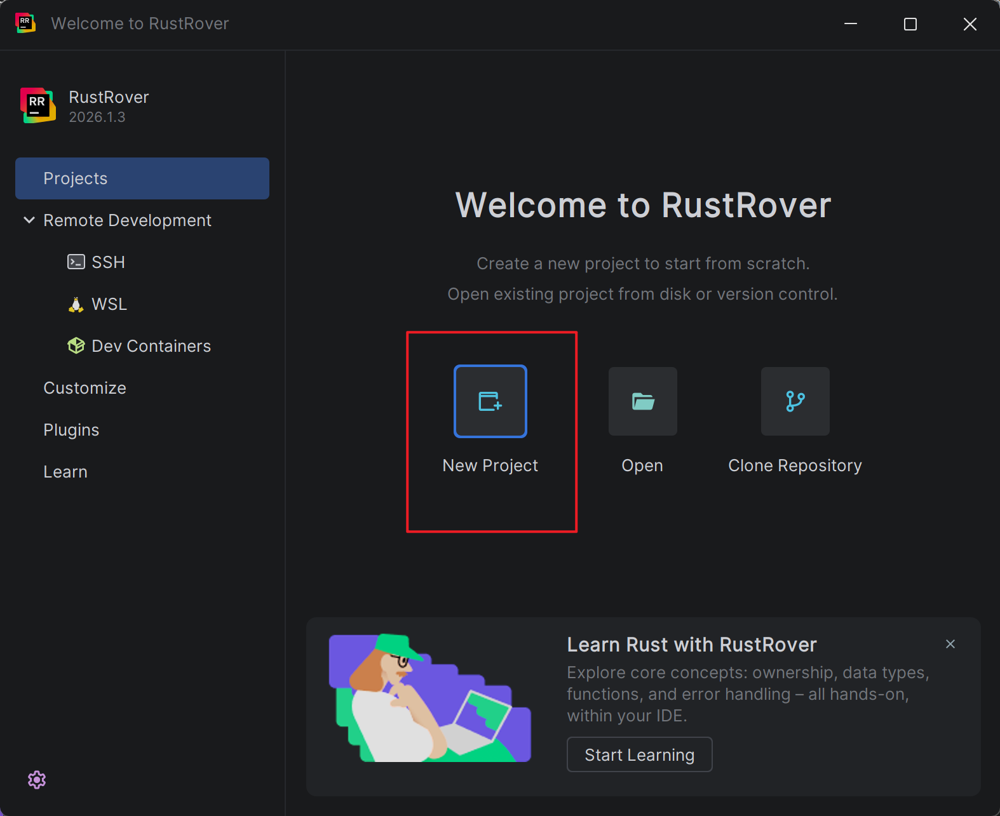
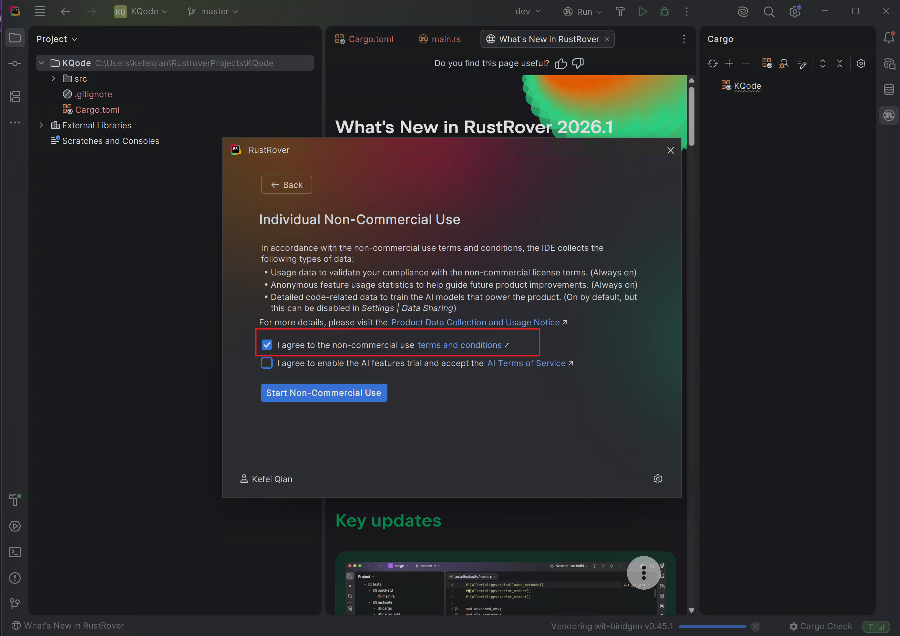
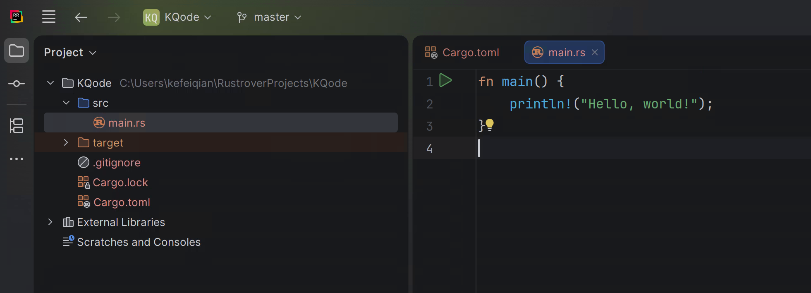
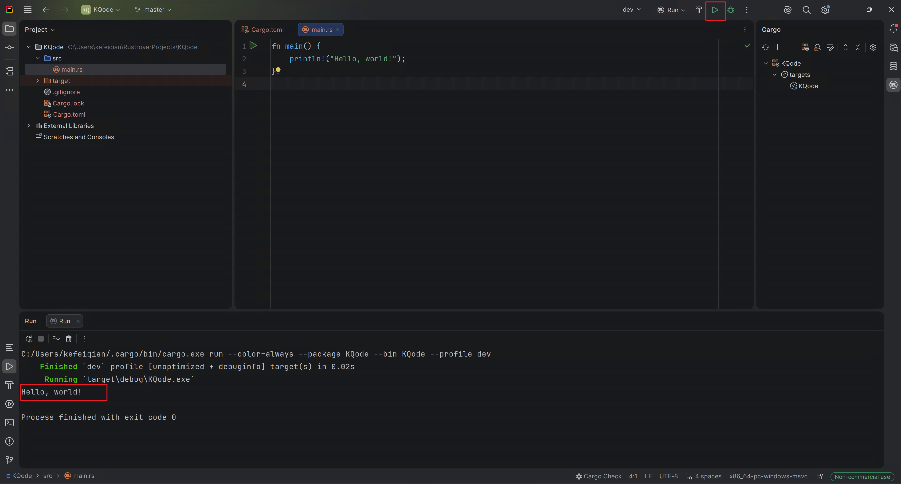
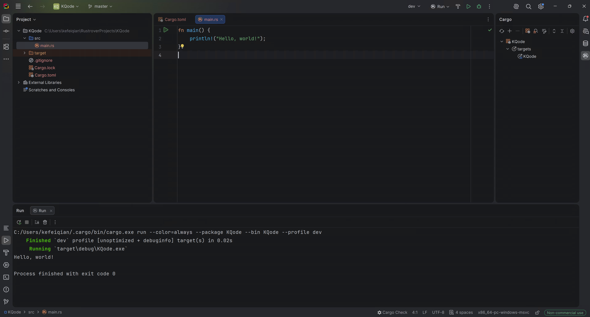

从这篇开始我们正式开始研发我们的 Coding Agent。这一篇先配置 RustRover IDE，并创建一个最小可运行的 Rust 项目，后面再在这个项目上逐步扩展 agent runtime 和 harness。

创建 Rust 项目有两种常见方式：

- 使用官方命令行工具：`cargo new KQode`
- 使用 JetBrains RustRover 的项目向导

这里我们使用 RustRover。后续代码编写、运行和调试也会主要在 RustRover 里完成。

## 1. 安装并打开 RustRover

先从 JetBrains 官网下载 RustRover：

https://www.jetbrains.com/rust/download/

安装完成后打开 RustRover。接受用户协议后，会进入欢迎页。点击中间的 **New Project** 创建新项目。



## 2. 创建 Rust 项目

在 New Project 页面左侧选择 **Rust**，然后设置项目保存位置，例如：

```text
C:\Users\kefeiqian\RustroverProjects\KQode
```

如果之前没有安装过 Rust 工具链，**Toolchain location** 会是空的，**Toolchain version** 会显示 `N/A`。这时点击 **Install Rustup**。


Rustup 是 Rust 官方推荐的工具链安装器，它会帮我们安装 `rustc`、`cargo`、标准库等运行 Rust 项目需要的组件。


安装完成后，RustRover 会自动识别工具链路径、工具链版本和标准库路径。确认项目模板选择 **Binary (application)**，然后点击 **Create**。


## 3. 选择 RustRover 许可证

项目创建完成后，RustRover 可能会弹出许可证选择窗口。


因为这里是学习和研究用途，可以选择 **Free for Learning and Hobby**。

接下来在 **Individual Non-Commercial Use** 页面里，选择符合自己用途的选项。截图中勾选的是：

- Learning and self-education
- Open-source contributions without earning commercial benefits
- Hobby development

然后点击 **Log In for Non-Commercial Use**。


浏览器完成 JetBrains 登录后，会显示授权成功。看到这个页面后，可以关闭浏览器并回到 RustRover。


回到 RustRover 后，还需要勾选同意非商业使用条款。第二个选项是 AI 功能试用；本系列不依赖 RustRover 的 AI 功能，所以可以不勾选。



点击 **Start Non-Commercial Use** 后，右下角的状态会从 Trial 变成 **Non-commercial use**，说明许可证已经生效。


## 4. 查看默认项目结构

RustRover 创建的 Binary 项目会包含一个 `src/main.rs`。默认代码是一个最小的 Hello World 程序：

```rust
fn main() {
    println!("Hello, world!");
}
```



## 5. 运行项目

点击顶部导航栏右侧的绿色运行按钮，RustRover 会调用 Cargo 编译并运行当前项目。



运行完成后，下方 Run 窗口会输出：

```text
Hello, world!
```

同时可以看到进程以 `exit code 0` 结束，说明 Rust 工具链、项目配置和运行配置都已经正常工作。

