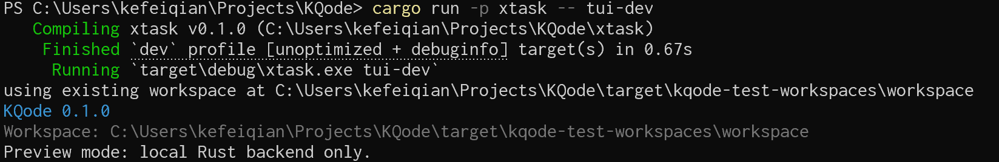

U1 阶段我们搭好了脚手架：Rust 项目、Ink TUI、`xtask` 自动化。

但现在的 [`tui/src/App.tsx`](https://github.com/kefeiqian/KQode/blob/99949b9fe7698a1f0b87acda232281cbaeb4d81d/tui/src/App.tsx) 只是一个静态空壳，只做了输出产品版本、当前 workspace 的目录和一行 backend-only 预览提示，用来验证 Ink 渲染链路是否打通。



U2 阶段的目标是把这个壳升级成一个**可交互的主界面**：有 KQode logo、可滚动的交互记录区域、带 Git 状态的工作目录、用户的输入框以及底部状态栏（包括当前状态还有使用的模型），并且整个布局会随终端尺寸变化而动态调整。

## commit

U2的commit在 [`dd15b678`（feat(tui): build interactive home screen）](https://github.com/kefeiqian/KQode/commit/dd15b678392eacc2ffcee88884eba18ae52c1236)

:::info tag 顺序不等于提交顺序
KQode 的里程碑 tag 是按“逻辑单元”打的，并不严格等于 git 提交顺序。`U2`（`dd15b678`）的父提交其实是 `U4`（`f86f87f3`，一个更早落地的 Rust ACK 后端实验），而不是 `U1`。也就是说 U4 在时间上比 U2 更早。
:::

## 对应的Plan Unit

这一个 commit 同时实现了两份文档的多个feature：

- 主界面计划 [`2026-06-25-003-feat-first-ink-tui-homepage-plan.md`](https://github.com/kefeiqian/KQode/blob/ad9670d1978ae2c6e738ea76bc52b58149463dbd/docs/plans/2026-06-25-003-feat-first-ink-tui-homepage-plan.md)
  - [`U2. Build the static home screen components`](https://github.com/kefeiqian/KQode/blob/ad9670d1978ae2c6e738ea76bc52b58149463dbd/docs/plans/2026-06-25-003-feat-first-ink-tui-homepage-plan.md#u2-build-the-static-home-screen-components)
  - [`U3. Implement composer input and wrapping behavior`](https://github.com/kefeiqian/KQode/blob/ad9670d1978ae2c6e738ea76bc52b58149463dbd/docs/plans/2026-06-25-003-feat-first-ink-tui-homepage-plan.md#u3-implement-composer-input-and-wrapping-behavior)
- 主题计划 [`2026-06-29-001-feat-gemini-style-tui-theming-plan.md`](https://github.com/kefeiqian/KQode/blob/ad9670d1978ae2c6e738ea76bc52b58149463dbd/docs/plans/2026-06-29-001-feat-gemini-style-tui-theming-plan.md)
  - `U2. Add an internal half-line background block primitive`（背景块组件）
  - `U3. Wire optional background blocks into existing transcript/input surfaces`（把背景块接入正文与输入框）


## 数据流：从启动到渲染

入口 [`tui/main.tsx`](https://github.com/kefeiqian/KQode/blob/dd15b678392eacc2ffcee88884eba18ae52c1236/tui/main.tsx) 负责采集运行时上下文，再把它作为 props 交给 `App`：

```tsx
const tuiPackageRoot = path.dirname(fileURLToPath(import.meta.url));
const repoRoot = resolveRepoRoot(tuiPackageRoot);
const workspaceCwd = resolveWorkspaceCwd();
const productVersion = readProductVersion(repoRoot);
const gitStatusLabel = readGitStatusLabel(workspaceCwd);

render(
  <App productVersion={productVersion} workspaceCwd={workspaceCwd} gitStatusLabel={gitStatusLabel} />
);
```

这里有三类输入：

- `productVersion`：从项目根目录 [`Cargo.toml`](https://github.com/kefeiqian/KQode/blob/dd15b678392eacc2ffcee88884eba18ae52c1236/Cargo.toml) 读取的 KQode 版本（不是 `tui/` 包版本）。
- `workspaceCwd`：`process.cwd()`，也就是用户运行 KQode 的项目目录。
- `gitStatusLabel`：对 `workspaceCwd` 跑一次 `git status --porcelain` 解析出的分支与改动标记（[第 5 篇](./05-工作目录与Git.md)细讲）。

---

App组件定义在 [`tui/src/App.tsx`](https://github.com/kefeiqian/KQode/blob/dd15b678392eacc2ffcee88884eba18ae52c1236/tui/src/App.tsx) 中，现在只做一件事：把外部 props 和终端实时尺寸合并，再传给 `HomeScreen`：

```tsx
export function App({ productVersion, workspaceCwd, gitStatusLabel, /* ... */ columns, rows, onPromptSubmit }: AppProps) {
  const windowSize = useWindowSize();
  const resolvedColumns = columns ?? windowSize.columns ?? DEFAULT_COLUMNS;
  const resolvedRows = Math.max(MIN_ROWS, rows ?? windowSize.rows ?? DEFAULT_ROWS);

  return (
    <HomeScreen
      productVersion={productVersion}
      workspaceCwd={workspaceCwd}
      gitStatusLabel={gitStatusLabel}
      columns={resolvedColumns}
      rows={resolvedRows}
      onPromptSubmit={onPromptSubmit}
      /* ...其余 props 透传... */
    />
  );
}
```

[`useWindowSize()`](https://github.com/vadimdemedes/ink#usewindowsize) 是 Ink 提供的 hook，终端 resize 时会触发重渲染，于是 `columns`/`rows` 跟着变，整套布局都会重新计算。

`Math.max(MIN_ROWS, ...)` 给行数设置了一个下限——[`layout.ts`](https://github.com/kefeiqian/KQode/blob/dd15b678392eacc2ffcee88884eba18ae52c1236/tui/src/components/layout.ts) 里 `MIN_ROWS = 10`，避免 `<10` 行的终端界面把布局搞崩。

注意这一版**没有引入状态管理方案**：所有数据都是从 `main` 一路 props 透传下去。这在只有一个屏、状态还不多的时候是最简单的方案；我们会在 [U3](/category/u3-jotai-state-refactor) 迁移到 [Jotai](https://github.com/pmndrs/jotai)。

## 组件树

[`HomeScreen`](https://github.com/kefeiqian/KQode/blob/dd15b678392eacc2ffcee88884eba18ae52c1236/tui/src/components/HomeScreen.tsx) 是一个“大组件”：它自己持有全部 UI 状态（滚动偏移、输入框行数、已提交消息），根据UI状态自行计算布局。整个HomeScreen分成了五个组件：

```text
App
└─ HomeScreen              （持有状态 + 布局 + 滚动按键，全部在一个文件里）
   ├─ Header               （logo + 版本，窄屏降级）
   ├─ BodyPane             （正文转录 + 滚动条）
   ├─ CwdLine              （cwd + Git 状态）
   ├─ PromptComposer       （输入框：输入、换行、光标、提交）
   └─ StatusBar            （提示 + 模型名）
```


## 文件地图

U2 涉及的模块，以及本系列对应的篇目：

| 模块 | 文件（相对 `tui/src`，链接指向 pin 的提交 `dd15b678`） | 篇目 |
| --- | --- | --- |
| 主题令牌 | [`theme/themeConfig.ts`](https://github.com/kefeiqian/KQode/blob/dd15b678392eacc2ffcee88884eba18ae52c1236/tui/src/theme/themeConfig.ts) | [02-TUI主题与背景块组件](./02-TUI主题与背景块组件.md) |
| 背景块组件 | [`components/BackgroundBlock.tsx`](https://github.com/kefeiqian/KQode/blob/dd15b678392eacc2ffcee88884eba18ae52c1236/tui/src/components/BackgroundBlock.tsx) | [02-TUI主题与背景块组件](./02-TUI主题与背景块组件.md) |
| 组件树与布局 | [`components/HomeScreen.tsx`](https://github.com/kefeiqian/KQode/blob/dd15b678392eacc2ffcee88884eba18ae52c1236/tui/src/components/HomeScreen.tsx)、[`components/layout.ts`](https://github.com/kefeiqian/KQode/blob/dd15b678392eacc2ffcee88884eba18ae52c1236/tui/src/components/layout.ts) | [03-组件树与布局](./03-组件树与布局.md) |
| 正文转录 | [`components/BodyPane.tsx`](https://github.com/kefeiqian/KQode/blob/dd15b678392eacc2ffcee88884eba18ae52c1236/tui/src/components/BodyPane.tsx)、[`components/bodyRows.ts`](https://github.com/kefeiqian/KQode/blob/dd15b678392eacc2ffcee88884eba18ae52c1236/tui/src/components/bodyRows.ts) | [04-正文转录区BodyPane](04-正文转录区BodyPane.md) |
| 工作目录与 Git | [`components/CwdLine.tsx`](https://github.com/kefeiqian/KQode/blob/dd15b678392eacc2ffcee88884eba18ae52c1236/tui/src/components/CwdLine.tsx)、[`libs/git/gitStatus.ts`](https://github.com/kefeiqian/KQode/blob/dd15b678392eacc2ffcee88884eba18ae52c1236/tui/src/libs/git/gitStatus.ts)、[`libs/text/clipText.ts`](https://github.com/kefeiqian/KQode/blob/dd15b678392eacc2ffcee88884eba18ae52c1236/tui/src/libs/text/clipText.ts) | [05-工作目录与Git](./05-工作目录与Git.md) |
| 输入框状态 | [`state/composerReducer.ts`](https://github.com/kefeiqian/KQode/blob/dd15b678392eacc2ffcee88884eba18ae52c1236/tui/src/state/composerReducer.ts) | [06-输入框状态composerReducer](./06-输入框状态composerReducer.md) |
| 输入框渲染与光标 | [`components/PromptComposer.tsx`](https://github.com/kefeiqian/KQode/blob/dd15b678392eacc2ffcee88884eba18ae52c1236/tui/src/components/PromptComposer.tsx) | [07-输入框渲染与输入](./07-输入框渲染与输入.md) |
| 顶部与状态栏 | [`components/Header.tsx`](https://github.com/kefeiqian/KQode/blob/dd15b678392eacc2ffcee88884eba18ae52c1236/tui/src/components/Header.tsx)、[`components/StatusBar.tsx`](https://github.com/kefeiqian/KQode/blob/dd15b678392eacc2ffcee88884eba18ae52c1236/tui/src/components/StatusBar.tsx) | [08-顶部与状态栏](./08-顶部与状态栏.md) |
| 鼠标与滚动 | [`libs/terminal/mouse.ts`](https://github.com/kefeiqian/KQode/blob/dd15b678392eacc2ffcee88884eba18ae52c1236/tui/src/libs/terminal/mouse.ts)、[`components/HomeScreen.tsx`](https://github.com/kefeiqian/KQode/blob/dd15b678392eacc2ffcee88884eba18ae52c1236/tui/src/components/HomeScreen.tsx) | [09-鼠标与滚动](./09-鼠标与滚动.md) |

下面是 U2 完成后主界面的样子：


