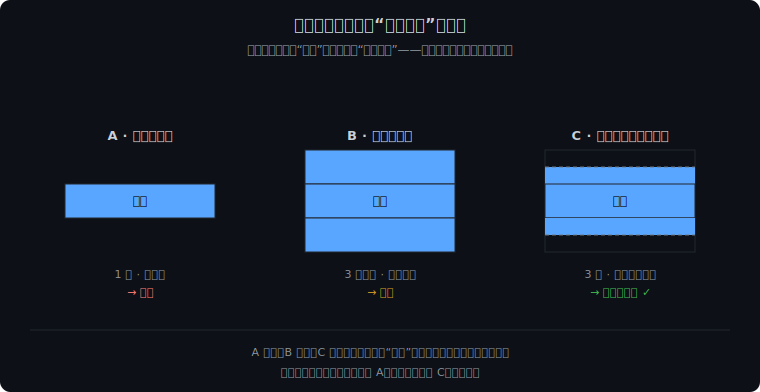
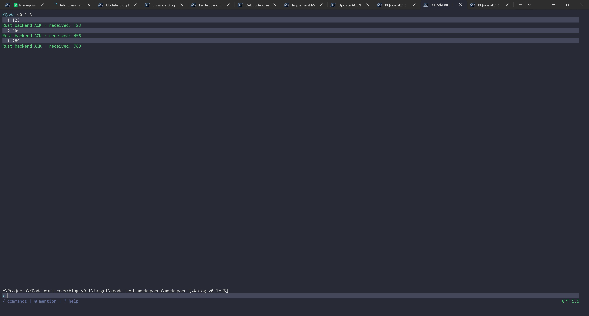
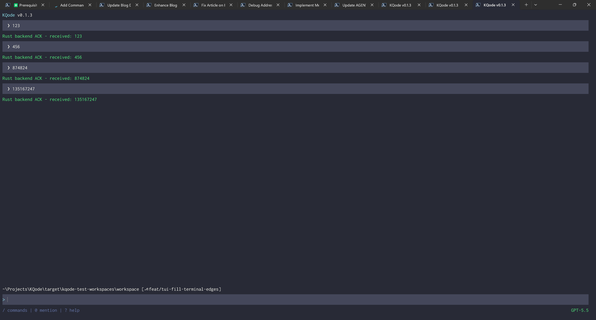
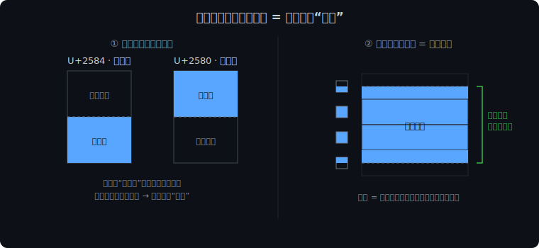
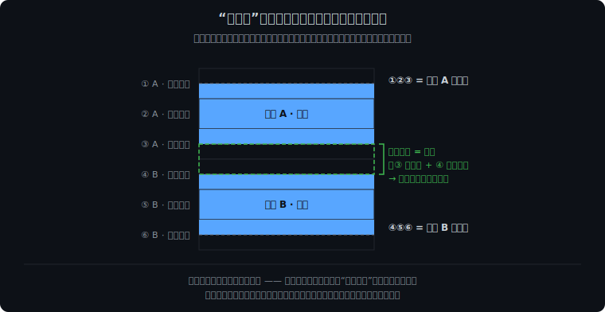

这一篇讲两个最底层、被几乎所有 UI 模块引用的东西：集中式的主题颜色 Scheme [`theme/themeConfig.ts`](https://github.com/kefeiqian/KQode/blob/dd15b678392eacc2ffcee88884eba18ae52c1236/tui/src/theme/themeConfig.ts)，以及给消息块做“半行留白”背景的 [`components/BackgroundBlock.tsx`](https://github.com/kefeiqian/KQode/blob/dd15b678392eacc2ffcee88884eba18ae52c1236/tui/src/components/BackgroundBlock.tsx) 组件。

## 主题颜色 Scheme：[`theme/themeConfig.ts`](https://github.com/kefeiqian/KQode/blob/dd15b678392eacc2ffcee88884eba18ae52c1236/tui/src/theme/themeConfig.ts)

U2 阶段的配色是一份 GitHub 深色风的颜色表：

```ts
export const githubDarkTheme = {
  colors: {
    foreground: '#c9d1d9',
    muted: '#8b949e',
    accentBlue: '#58a6ff',
    accentGreen: '#3fb950',
    warning: '#d29922',
    errorRed: '#ff7b72',
    border: '#30363d',
    messageBackground: '#141b22',
    inputBackground: '#141b22'
  }
} as const;
```

### 每个颜色的含义

| 色块                                                                                                                                                                    | 语义                                      | 色值        | 用途                                                     |
| --------------------------------------------------------------------------------------------------------------------------------------------------------------------- | --------------------------------------- | --------- | ------------------------------------------------------ |
| <span style={{display:'inline-block',width:'2.5rem',height:'1rem',borderRadius:'3px',border:'1px solid #30363d',backgroundColor:'#c9d1d9',verticalAlign:'middle'}} /> | `foreground`                            | `#c9d1d9` | 正文主文本、输入框文本、滚动条 thumb                                  |
| <span style={{display:'inline-block',width:'2.5rem',height:'1rem',borderRadius:'3px',border:'1px solid #30363d',backgroundColor:'#8b949e',verticalAlign:'middle'}} /> | `muted`                                 | `#8b949e` | 次要信息，比如底部 `/ commands`、`@ mention`、`? help` 提示、空行占位    |
| <span style={{display:'inline-block',width:'2.5rem',height:'1rem',borderRadius:'3px',border:'1px solid #30363d',backgroundColor:'#58a6ff',verticalAlign:'middle'}} /> | `accentBlue`                            | `#58a6ff` | 强调色：`KQode` logo、assistant 行的 `•` marker、输入框首行的 `>` 前缀 |
| <span style={{display:'inline-block',width:'2.5rem',height:'1rem',borderRadius:'3px',border:'1px solid #30363d',backgroundColor:'#3fb950',verticalAlign:'middle'}} /> | `accentGreen`                           | `#3fb950` | 成功态（`success` 类型正文）和右下角模型名                             |
| <span style={{display:'inline-block',width:'2.5rem',height:'1rem',borderRadius:'3px',border:'1px solid #30363d',backgroundColor:'#d29922',verticalAlign:'middle'}} /> | `warning`                               | `#d29922` | `pending` 态正文（如 `... (pending)`）                       |
| <span style={{display:'inline-block',width:'2.5rem',height:'1rem',borderRadius:'3px',border:'1px solid #30363d',backgroundColor:'#ff7b72',verticalAlign:'middle'}} /> | `errorRed`                              | `#ff7b72` | 前端校验失败与后端错误信息，配合 `ERROR:` 文本前缀                         |
| <span style={{display:'inline-block',width:'2.5rem',height:'1rem',borderRadius:'3px',border:'1px solid #8b949e',backgroundColor:'#30363d',verticalAlign:'middle'}} /> | `border`                                | `#30363d` | 滚动条 track（未被 thumb 覆盖的部分）                              |
| <span style={{display:'inline-block',width:'2.5rem',height:'1rem',borderRadius:'3px',border:'1px solid #8b949e',backgroundColor:'#141b22',verticalAlign:'middle'}} /> | `messageBackground` / `inputBackground` | `#141b22` | 用户消息块、输入框块的背景色；两者同值但分成两个令牌，方便以后单独调                     |

### 两个设计要点

第一，`as const` 让这张表变成只读字面量类型，每个颜色键都是精确的字符串字面量类型，引用处既能自动补全又能在拼错 key 时报错。

第二，**这张颜色表放在 `theme/` 文件夹里，作为全局公共配置**。所有组件都从这一个文件导入语义令牌，而不是各自散落地写死颜色；将来要统一调整配色，只改这一处即可。

## 背景块组件：[`components/BackgroundBlock.tsx`](https://github.com/kefeiqian/KQode/blob/dd15b678392eacc2ffcee88884eba18ae52c1236/tui/src/components/BackgroundBlock.tsx)

终端屏幕本质是一张**字符网格**（character grid），可以想象成 Excel：每个格子（cell）只放一个字符，各带一个前景色（画字符用）和一个背景色（格子底色）。这里有个关键限制：**背景色只能“整格”填充**，没有“半格背景”。

给用户消息刷背景时，若只给“文字那一行”设背景色，气泡就只有一行高、上下紧贴相邻内容，很局促。想让它像张舒展的卡片、上下有半行的内边距（padding），纯背景色最少也得加**一整行**实色——又太重、太抢眼。“半行”这种更轻的留白只靠背景色做不到，于是有了下面的半块字符方案。

`BackgroundBlock` 用 `▄`/`▀` 两个 Unicode 半块字符做出这“半行留白”，手法借鉴自 Gemini CLI 的 [`HalfLinePaddedBox`](https://github.com/google-gemini/gemini-cli/blob/2e12c3400992f77d33e04d0c2870d961b92a3f9c/packages/cli/src/ui/components/shared/HalfLinePaddedBox.tsx)（直译“半行内边距盒子”）：

```tsx
export type BackgroundBlockMode = 'auto' | 'enabled' | 'disabled';

const TRUECOLOR_DEPTH = 24;
export const LOWER_HALF_BLOCK = '▄';
export const UPPER_HALF_BLOCK = '▀';

export function BackgroundBlock({ backgroundColor, children, mode = 'auto', width }: BackgroundBlockProps) {
  const { stdout } = useStdout();
  const isScreenReaderEnabled = useIsScreenReaderEnabled();
  const shouldRenderBackground = shouldRenderBackgroundBlock({
    colorDepth: stdout.getColorDepth?.(),
    isNoColor: process.env.NO_COLOR !== undefined,
    isScreenReaderEnabled,
    mode
  });

  if (!shouldRenderBackground) {
    return <>{children}</>;
  }

  const safeWidth = Math.max(1, width);

  return (
    <Box flexDirection="column" width={safeWidth}>
      <Text color={backgroundColor}>{LOWER_HALF_BLOCK.repeat(safeWidth)}</Text>
      <Box backgroundColor={backgroundColor} width={safeWidth}>
        {children}
      </Box>
      <Text color={backgroundColor}>{UPPER_HALF_BLOCK.repeat(safeWidth)}</Text>
    </Box>
  );
}
```

返回值正好是**三行**：一行 `▄`、一个带 `backgroundColor` 的连续主体盒子、再一行 `▀`。把“只刷文字行 / 加整行实色 / 半块补半行”三种留白粒度摆在一起，就能看出半块为什么是“不多不少”的那一档：



光看示意图还不够，直接上真机对比更直观——同样几条消息，关掉半块（只刷文字行）和开启半块（默认）分别长这样：





对比很明显：朴素单行（上图）挤成一团；半块版（下图）每条消息都有了“半行”的上下呼吸感——这就是我们愿意为它多写几行渲染代码的原因。

### 半块字符是怎么“只涂半格”的

**一个半块字符用前景色画它实心的那一半，另一半留给终端底色**：`▄`（U+2584，下半块）设 `color = 气泡色`，画出“上半格底色、下半格气泡色”的过渡行；`▀`（U+2580，上半块）正好反过来。中间夹着整行 `backgroundColor` 的内容行，于是块的上下边缘各收在“半行”处。



这正是终端图像渲染常用的“半块像素”手法——靠 `▄`/`▀` 让一个格子上下承载两种颜色、把纵向分辨率翻倍；这里只是借它做半行留白。延伸阅读：[Unicode Block Elements](https://en.wikipedia.org/wiki/Block_Elements) 与 [`chafa`](https://hpjansson.org/chafa/)。

### 那“下一行”会不会和半块行重叠？

不会。终端里**一个格子只放一个字符**，所以这里的“三行”指整块占三**行**（`top` / `main` / `bottom`），而不是把一个格子切成三段；这三行也各自独立。下一条消息会另起一行、有自己的背景，不会挤进 `▀` 行。而 `▀` 行没上色的下半格是有意留出的分隔：两条消息相邻时，上一条 `▀` 的下半格加下一条 `▄` 的上半格，正好拼成一整行底色，把它们自然分开。



### 为什么要有一个 `shouldRenderBackgroundBlock` 的判断决定是否渲染背景？

```tsx
export function shouldRenderBackgroundBlock({ colorDepth, isNoColor, isScreenReaderEnabled, mode }): boolean {
  if (mode === 'disabled' || isNoColor || isScreenReaderEnabled) {
    return false;
  }

  if (mode === 'enabled') {
    return true;
  }

  return colorDepth !== undefined && colorDepth >= TRUECOLOR_DEPTH;
}
```

`mode` 有三个取值：`disabled` 强制关背景、`enabled` 强制开、`auto`（默认）交给运行环境判断。下面几条规则里，前两条无论 `mode` 是什么都会强制关掉背景，最后一条则是 `auto` 默认模式下的判断依据：

- **[`NO_COLOR`](https://crates.io/crates/no_color) 环境变量**：这是一条被众多命令行工具采纳的社区约定（见官网 no-color.org）——只要这个变量存在（无论取值是什么），程序就应关闭彩色输出。
- **屏幕阅读器开启时**：屏幕阅读器（screen reader）是给视障用户用的辅助技术，会把界面内容逐字念成语音或转成盲文；Ink 用 `useIsScreenReaderEnabled()` 探测它是否开启。满屏的半块字符 `▄▀` 对读屏软件是纯噪音，关掉背景反而更可读。
- **色深要够（24 位真彩色）**：终端色深——必须支持 **24 位真彩色**（truecolor，`colorDepth >= 24`）才开背景。所谓 24 位，是指 RGB 三个通道各占 8 位、合计 2^24 ≈ 1670 万种颜色，能精确还原 `#141b22` 这类十六进制色值；而只有 256 色或 16 色的终端，会把块色**量化**到自带调色板里最接近的一项，`#141b22` 可能被近似成另一个很难看的颜色——那不如不刷。

而且注意我们设计的时候，**所有“语义”都不仅仅是靠背景色承载的**。用户消息 vs assistant 消息靠 `❯`/`•` 前缀区分，错误靠 `ERROR:` 文本区分。就算背景整个关掉，界面依然可读。
