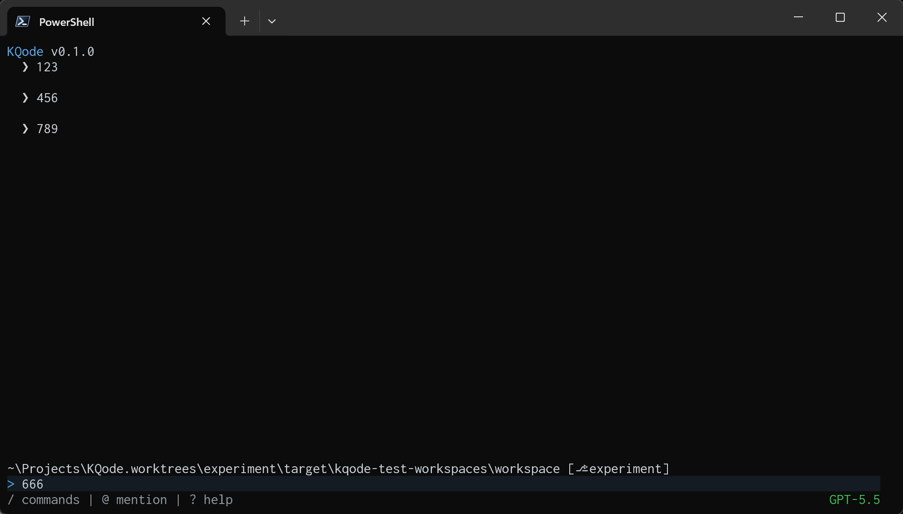

这一篇讲 U2 的“骨架”——[`components/HomeScreen.tsx`](https://github.com/kefeiqian/KQode/blob/dd15b678392eacc2ffcee88884eba18ae52c1236/tui/src/components/HomeScreen.tsx)。我们目前没有调用 LLM，没有历史数据，只做一个可以回显用户输入的终端界面：



## 组件一览

先看整体。上图这个主界面，[`components/HomeScreen.tsx`](https://github.com/kefeiqian/KQode/blob/dd15b678392eacc2ffcee88884eba18ae52c1236/tui/src/components/HomeScreen.tsx) 从上到下拆成五块，而且全部塞在同一个组件里渲染：

- [`components/Header.tsx`](https://github.com/kefeiqian/KQode/blob/dd15b678392eacc2ffcee88884eba18ae52c1236/tui/src/components/Header.tsx) —— 顶部的 KQode logo 与版本号，窄屏时会降级（[第 8 篇](./08-顶部与状态栏.md)）。
- [`components/BodyPane.tsx`](https://github.com/kefeiqian/KQode/blob/dd15b678392eacc2ffcee88884eba18ae52c1236/tui/src/components/BodyPane.tsx) —— 正文转录区：把已提交的消息编译成一行行文本，内容超出可视范围时可以往回滚（[第 4](04-正文转录区BodyPane.md)、[9 篇](./09-鼠标与滚动.md)）。
- [`components/CwdLine.tsx`](https://github.com/kefeiqian/KQode/blob/dd15b678392eacc2ffcee88884eba18ae52c1236/tui/src/components/CwdLine.tsx) —— 当前工作目录，外加 Git 分支与改动标记（[第 5 篇](./05-工作目录与Git.md)）。
- [`components/PromptComposer.tsx`](https://github.com/kefeiqian/KQode/blob/dd15b678392eacc2ffcee88884eba18ae52c1236/tui/src/components/PromptComposer.tsx) —— 输入框：负责输入、换行、光标与提交（[第 6](./06-输入框状态composerReducer.md)、[7 篇](./07-输入框渲染与输入.md)）。
- [`components/StatusBar.tsx`](https://github.com/kefeiqian/KQode/blob/dd15b678392eacc2ffcee88884eba18ae52c1236/tui/src/components/StatusBar.tsx) —— 底部状态栏：左侧命令提示、右侧当前模型名（[第 8 篇](./08-顶部与状态栏.md)）。

（完整组件树与文件地图见 [第 1 篇](./01-U2总览.md)。）这五块里，`Header`、`CwdLine`、`StatusBar` 只读 props、自己不持有状态；真正会随交互变化的只有正文和输入框——下一节的三个 state，就是 `HomeScreen` 替这两块托管的。

## 状态定义

我们在正文（`BodyPane`）上有两件需要动态改变的事情——**显示什么内容**、以及**从哪一行看起**；输入框（`PromptComposer`）则有一件——**当前的 Prompt 占了几行，当字符超过一行之后，输入框需要增加一行高度**。这三件事正好对应 `HomeScreen` 里的三个 `useState`，各自服务界面里一个不同的部分：

```tsx
const [bodyScrollOffsetRows, setBodyScrollOffsetRows] = useState(0);
const [composerRows, setComposerRows] = useState(DEFAULT_COMPOSER_ROWS);
const [submittedPromptEntries, setSubmittedPromptEntries] = useState<BodyEntry[]>([]);
```

### `bodyScrollOffsetRows`：正文往回翻了多少行

`0` 表示贴底、看最新内容；数字越大，表示从底部往上翻得越多。**读**它的只有一处——作为 `scrollOffsetRows` 传给正文 `BodyPane`（完整渲染见最后一节）。

**改**它的是滚动。先算一个上界 `maxBodyScrollOffsetRows`，也就是“最多能往上翻几行”：正文内容实际占的行数 `bodyRowsForScroll`，减去可见区的行数 `layout.bodyRows`，翻到头就不能再翻：

```tsx
// bodyRowsForScroll：正文全部内容渲染出来共占几行
// layout.bodyRows：正文可见区能显示几行（由布局算出，见下一节）
const maxBodyScrollOffsetRows = Math.max(0, bodyRowsForScroll - layout.bodyRows);

const scrollBodyByRows = (deltaRows: number) => {
  setBodyScrollOffsetRows((current) =>
    Math.min(maxBodyScrollOffsetRows, Math.max(0, current + deltaRows))
  );
};
```

`scrollBodyByRows` 就是把当前偏移加一个增量 `deltaRows`，再用 `Math.max(0, …)` 和 `Math.min(maxBodyScrollOffsetRows, …)` 夹进 `[0, maxBodyScrollOffsetRows]`：往下翻不会低于贴底（`0`），往上翻不会超过顶部。鼠标滚轮、`PageUp`/`PageDown` 都调用它，`End` 则直接 `setBodyScrollOffsetRows(0)` 一键回到贴底。这套按键监听放在 `HomeScreen` 而不是 `BodyPane` 里，所以滚动状态才被“上提”到父组件（完整的键位与鼠标处理在 [第 9 篇](./09-鼠标与滚动.md)）。

### `composerRows`：输入框现在几行高

初值是 `DEFAULT_COMPOSER_ROWS`（`1`）。输入内容换行、或冒出一行校验错误时，输入框的真实高度会变，当高度改变的时候，通过 `onVisibleRowsChange` 回调把行数写回 `HomeScreen`：

```tsx
<PromptComposer
  onVisibleRowsChange={setComposerRows}
  /* ...其余 props... */
/>
```

`HomeScreen` 为什么非要知道这个值？因为布局是自底向上算的：输入框多高，直接决定正文还剩多少空间。所以 `composerRows` 会被传进布局函数 `resolveHomeScreenLayout(columns, rows, bodyEntryRows, composerRows)`，算出正文可用高度；底部留白 `bottomSpacerRows` 与光标行 `composerTop` 也都要减掉它。

### `submittedPromptEntries`：已提交的消息

这是这一版唯一的“会话数据”，类型是 `BodyEntry[]`——用户每提交一条 prompt 就往里追加一条。它不会直接进 `BodyPane`，而是先和“基础 item”拼成 `displayedBodyEntries`，再交给正文渲染：

```tsx
// bodyEntries：外部可传入的初始 item；DEFAULT_BODY_ENTRIES：内置的演示 item
const baseBodyEntries = bodyEntries ?? DEFAULT_BODY_ENTRIES;
const displayedBodyEntries =
  submittedPromptEntries.length === 0
    ? bodyEntries
    : [...baseBodyEntries, ...submittedPromptEntries];
```

还没提交过（列表为空）时，正文直接显示传入的 `bodyEntries`；一旦有了提交，就把基础 item 和已提交 item 按顺序接在一起显示。U2 还没有后端，所以转录区里能看到的每一行，最终都来自这个列表（[第 4 篇](04-正文转录区BodyPane.md)细讲这些 item 怎么编译成一行行文本）。

而提交一条 prompt 的动作，就是往这个列表里追加、把滚动归零、再回调外部：

```tsx
const handlePromptSubmit = (prompt: string) => {
  setSubmittedPromptEntries((current) => [...current, { kind: 'prompt', text: prompt }]);
  setBodyScrollOffsetRows(0);
  onPromptSubmit(prompt);
};
```

滚动归零很关键：**提交后用户总是想看到自己刚发的消息**，所以强制贴回底部。`onPromptSubmit` 默认是空函数——U2 还没接后端，提交只是把 prompt 显示进正文而已。这条“提交 → 追加 → 回调”的回路，会在 [U8](/category/u8-submit-ack-wiring) 接上真正的后端 ACK。

## 布局核心：resolveHomeScreenLayout

在任意终端尺寸下，我们需要实现把 cwd、输入框、状态栏稳定吸附在底部，让正文占据剩下的空间

```tsx
export function resolveHomeScreenLayout(
  columns: number,
  rows: number,
  bodyEntryCount = Number.POSITIVE_INFINITY,
  composerRows = DEFAULT_COMPOSER_ROWS
): { bodyRows: number; composerVisibleRows: number } {
  const headerRows = headerRowCount(columns);
  const cwdRows = 1;
  const statusRows = 1;
  const composerErrorReserveRows = COMPOSER_ERROR_RESERVE_ROWS;
  const minBodyRows = 1;
  const fixedRows = headerRows + BODY_CWD_GAP_ROWS + cwdRows + statusRows;
  const maxComposerVisibleRows = Math.max(
    1,
    rows - fixedRows - composerErrorReserveRows - minBodyRows
  );
  const maxBodyRows = rows - fixedRows - composerRows;

  return {
    bodyRows: Math.max(1, Math.min(maxBodyRows, bodyEntryCount + 1)),
    composerVisibleRows: maxComposerVisibleRows
  };
}
```


**固定行 `fixedRows`** —— header、body/cwd 空行、cwd、状态栏四块行数之和，**不含输入框**（输入框会随换行/校验反馈伸缩，不能算进固定部分）：

$$
\text{fixedRows} = \text{headerRows} + \underbrace{1}_{\text{body/cwd 空行}} + \underbrace{1}_{\text{cwd 行}} + \underbrace{1}_{\text{状态栏行}}
$$

其中 `headerRows` 是 header 占的行数（`0` 或 `1`，见下一节）。

**正文实际行数 `bodyRows`** —— 先算“正文最多能占几行”的上限 `maxBodyRows`（总行减固定行再减输入框行），正文再取它与 `bodyEntryCount + 1` 的较小值，并兜底至少 1 行：

$$
\text{maxBodyRows} = \text{rows} - \text{fixedRows} - \text{composerRows}
$$

$$
\text{bodyRows} = \max(1,\ \min(\text{maxBodyRows},\ \text{bodyEntryCount} + 1))
$$

`+ 1` 给“贴底”留一行余量，内容不足时底部那几块（cwd、输入框、状态栏）不会被顶上去；`bodyEntryCount` 默认 `+∞`，所以不传内容时 `min` 直接取 `maxBodyRows`，按“尽量占满”算。

**输入框可见上限 `composerVisibleRows`** —— 从总行里扣掉固定行、预留的一行校验错误、以及至少一行正文，剩下就是输入框最多能涨到几行：

$$
\text{composerVisibleRows} = \max(1,\ \text{rows} - \text{fixedRows} - \underbrace{1}_{\text{校验错误预留}} - \underbrace{1}_{\text{至少一行正文}})
$$

这给超长 prompt 设了天花板，避免它把 cwd/状态栏顶出屏幕。

## Header 占几行：headerRowCount

布局只关心“header 占几行”，而不关心它长什么样，所以有一个独立的 [`headerRowCount`](https://github.com/kefeiqian/KQode/blob/dd15b678392eacc2ffcee88884eba18ae52c1236/tui/src/components/layout.ts)：

```ts
export function headerRowCount(columns: number): number {
  if (columns < HIDE_HEADER_BELOW_COLUMNS) {
    return 0;
  }
  if (columns < COMPACT_HEADER_BELOW_COLUMNS) {
    return 1;
  }
  return 1;
}
```

它把列宽分三档：`< 36` 列隐藏 header（0 行）、`36–52` 紧凑版（1 行）、更宽完整版（1 行）。后两档目前都返回 `1`，写成两个分支是**让“Compact”和“完整”这两个产品状态显式存在**——以后完整版若变成多行 logo，只改后一个分支即可。

## 底部吸附：bottomSpacerRows

光算出各块行数还不够——内容不足时，怎么让底部那几块“沉”下去？答案是在正文和 cwd 之间插一个可变高度的 spacer，把所有富余行都塞给它：

```tsx
const bottomSpacerRows = Math.max(
  0,
  rows - headerRowCount(columns) - layout.bodyRows - BODY_CWD_GAP_ROWS - 1 - composerRows - 1
);
```

它本质是“总行数减去所有已知块”剩下的余量。渲染时把它加在 cwd 行的 `marginTop` 上：

```tsx
<Box marginTop={bottomSpacerRows + BODY_CWD_GAP_ROWS}>
  <CwdLine workspaceCwd={workspaceCwd} gitStatusLabel={gitStatusLabel} columns={columns} />
</Box>
```

于是无论正文多短，cwd 及以下都被推到终端底部；正文一旦变多，spacer 缩到 0，布局自然回到“正文占满”。

## 光标顶部：composerTop

输入框的光标是用 Ink 的 cursor API 手动算的，需要知道输入框第一行在第几行（0 基）：

```tsx
const [composerRows, setComposerRows] = useState(DEFAULT_COMPOSER_ROWS);
// ...
const composerTop = rows - 1 - composerRows;
```

`rows` 是“行数”（从 1 数），光标坐标从 0 数，所以减 1 得最后一行索引，再减 `composerRows` 得输入框顶部行索引。

那 `composerRows` 从哪来、算出的 `composerTop` 又用到哪去？两者其实是同一个 `PromptComposer` 上的一条闭环：输入框自己测量占了几行，通过 `onVisibleRowsChange` 把 `composerRows` 报上来（初值就是上面的 `DEFAULT_COMPOSER_ROWS`，即 `1`）；`HomeScreen` 用它算出 `composerTop`，再作为 `cursorTop` 传回去定位光标：

```tsx
<PromptComposer
  cursorTop={composerTop}                // 用 composerTop 定位光标（输入框顶部行，0 基）
  maxVisibleLines={layout.composerVisibleRows}
  onSubmit={handlePromptSubmit}
  onVisibleRowsChange={setComposerRows}  // composerRows 的来源：输入框把实测行数回写
  /* ...columns / backgroundMode... */
/>
```

于是形成一个自洽的回路：输入框换行 / 冒出校验反馈 → 高度变 → `onVisibleRowsChange` 把新的 `composerRows` 写回 → `composerTop` 重新计算 → `cursorTop` 更新，光标始终落在输入框当前文本行上（第 7 篇细讲光标怎么用 `cursorTop` 定位）。

> `tui/AGENTS.md` 特别提醒：只要改了 body 高度、spacer、换行、校验行或 cwd/composer/status 的位置，就要重新验证光标仍落在输入框当前文本行上。`composerTop` 正是这条链路的关键一环。

## 整体渲染

最后 `HomeScreen` 把五块拼起来，用 `flexDirection="column"` 固定 `width`/`height`：

```tsx
<Box flexDirection="column" width={columns} height={rows}>
  <Header productVersion={productVersion} columns={columns} />
  <Box height={layout.bodyRows} flexDirection="column">
    <BodyPane entries={displayedBodyEntries} rows={layout.bodyRows} columns={columns}
      scrollOffsetRows={bodyScrollOffsetRows} backgroundMode={messageBackgroundMode} />
  </Box>
  <Box marginTop={bottomSpacerRows + BODY_CWD_GAP_ROWS}>
    <CwdLine workspaceCwd={workspaceCwd} gitStatusLabel={gitStatusLabel} columns={columns} />
  </Box>
  <PromptComposer columns={columns} cursorTop={composerTop} maxVisibleLines={layout.composerVisibleRows}
    onSubmit={handlePromptSubmit} onVisibleRowsChange={setComposerRows} />
  <StatusBar columns={columns} modelLabel={modelLabel} />
</Box>
```


