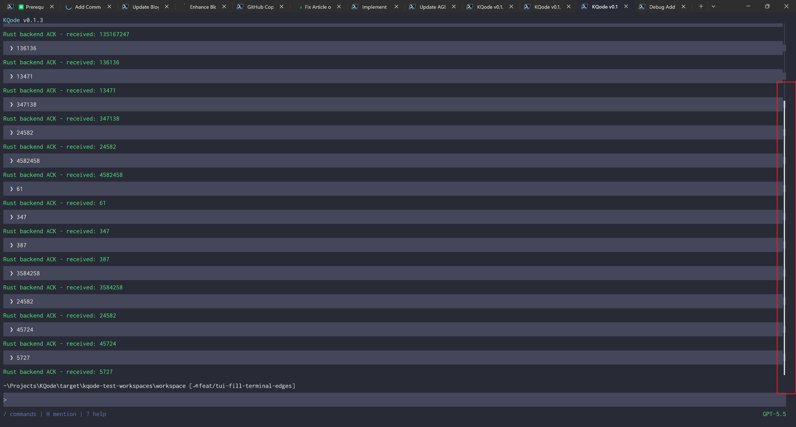

正文区是主界面最“像聊天记录”的部分。它把一串**类型化的 item** 编译成一行行可渲染文本，处理换行、消息块背景、滚动窗口和滚动条。逻辑分在两个文件：纯函数 [`components/bodyRows.ts`](https://github.com/kefeiqian/KQode/blob/dd15b678392eacc2ffcee88884eba18ae52c1236/tui/src/components/bodyRows.ts) 负责“item → 行”，组件 [`components/BodyPane.tsx`](https://github.com/kefeiqian/KQode/blob/dd15b678392eacc2ffcee88884eba18ae52c1236/tui/src/components/BodyPane.tsx) 负责“行 → 屏幕”。

## 正文内容type定义：BodyEntry

```ts
export type BodyEntry = {
  id?: string;
  kind: 'info' | 'prompt' | 'pending' | 'success' | 'error';
  text: string;
};
```

我们首先来定义BodyEntry，目前有三个属性， id, kind 和 text； 后续我们会有更多的类别。

## 把每个BodyEntry打包成行组件BodyRow：resolveBodyRows

`resolveBodyRows` 把BodyEntry列表编译成 `BodyRow[]`. 有一个点需要注意就是当 item 太多需要增加滚动条的时候，我们需要特殊处理一下：



```ts
export function resolveBodyRows(entries, columns, visibleRows, options = {}): BodyRow[] {
  const fullWidthRows = toBodyRowsWithEntryGaps(entries, columns, options);
  const contentColumns = fullWidthRows.length > visibleRows ? Math.max(1, columns - 1) : columns;

  return contentColumns === columns
    ? fullWidthRows
    : toBodyRowsWithEntryGaps(entries, contentColumns, options);
}
```

它先按满宽算一遍；如果发现总行数超过可见行（会出现滚动条），就把可用列宽减 1、**重新计算一遍**。这样滚动条永远不会盖住正文最后一列的字符。

`resolveBodyRows` 里真正把每一条摊平成行的是 `toBodyRowsWithEntryGaps`：它遍历每个 item，用 `toBodyRows` 把 item 变成若干行，并在相邻两个 item 之间插入一行空行（最后一个 item 后面不加），让转录区里每条消息之间都空出一行：

```ts
function toBodyRowsWithEntryGaps(entries, columns, options): BodyRow[] {
  return entries.flatMap((entry, index) => {
    const rows = toBodyRows(entry, columns, options);

    if (index === entries.length - 1) {
      return rows;
    }

    return [...rows, ...gapRows()];
  });
}
```

`gapRows()` 只是生成 `BODY_ROW_GAP_ROWS`（当前为 `1`）行空文本；`flatMap` 再把“每个 item 的行 + item 之间的空行”摊平成一整串 `BodyRow[]`。

而单个 item 具体怎么变成行，则由 `toBodyRows` 按 `kind` 分派——`prompt` 交给 `toPromptRows`、`info` 交给 `toAssistantRows`、其余状态类（`pending`/`success`/`error`）走默认分支：

```ts
function toBodyRows(entry, columns, options): BodyRow[] {
  if (entry.kind === 'prompt') {
    return toPromptRows(entry.text, columns, options);
  }

  if (entry.kind === 'info') {
    return toAssistantRows(entry.text, columns);
  }

  return wrapBodyText(labelForEntry(entry), columns).map((text) => ({
    color: colorForEntry(entry.kind),
    text
  }));
}
```

以最复杂的用户 prompt 为例：

```ts
function toPromptRows(text, columns, options): BodyRow[] {
  const promptIndent = USER_MESSAGE_HORIZONTAL_PADDING + USER_MESSAGE_PREFIX.length; // "  ❯ "
  const textColumns = Math.max(1, columns - promptIndent - USER_MESSAGE_HORIZONTAL_PADDING);
  const continuationPrefix = ' '.repeat(promptIndent);
  const wrappedText = wrapBodyText(text, textColumns);
  const textRows = wrappedText.map((line, index) => ({
    backgroundColor: options.backgroundMode === 'enabled' ? githubDarkTheme.colors.messageBackground : undefined,
    color: githubDarkTheme.colors.foreground,
    fillColumns: options.backgroundMode === 'enabled',
    text: `${index === 0 ? promptPrefix() : continuationPrefix}${line}`
  }));

  if (options.backgroundMode !== 'enabled') {
    return textRows;
  }

  return [halfLineRow(columns, LOWER_HALF_BLOCK), ...textRows, halfLineRow(columns, UPPER_HALF_BLOCK)];
}
```

逐行看它在做什么：

- `promptIndent` 是首行左侧的缩进宽度：`USER_MESSAGE_HORIZONTAL_PADDING`（2 列留白）加上 `❯ ` 前缀的长度（2 列），合计 4 列，也就是注释里的 `"  ❯ "`。
- `textColumns` 是每行留给正文的宽度：总列宽减去左侧的 `promptIndent`、再减去右侧同样宽的 `USER_MESSAGE_HORIZONTAL_PADDING` 留白，外层 `Math.max(1, ...)` 兜底保证至少留 1 列。
- `continuationPrefix` 是 `promptIndent` 个空格，用来对齐换行后的续行——让第二行起的文字正好落在首行 `❯ ` 之后的同一列。
- `wrapBodyText(text, textColumns)` 先把整段输入按 `textColumns` 的宽度折成多行。
- `map` 把每一行包成一个 `BodyRow`：`backgroundColor` 在开背景时取主题的 `messageBackground`、否则是 `undefined`；`color` 统一是前景色 `foreground`；`fillColumns` 跟随背景开关（为 `true` 时要求把这行背景刷满整宽，否则背景只铺到文字末尾、右边会缺一块）；`text` 则是首行用 `promptPrefix()`（即 `"  ❯ "`）、续行用 `continuationPrefix`，后面再接上折行后的该行文字。
- 若没开背景（`backgroundMode !== 'enabled'`），到这里就直接返回这些文字行。
- 开了背景时，返回值会在文字行的**上下各增加一行** `halfLineRow`：顶部是 `LOWER_HALF_BLOCK`（`▄`）、底部是 `UPPER_HALF_BLOCK`（`▀`）。这两个半块字形只填充半个字格（复用第 2 篇讲的技巧），于是消息块上下各多出半行背景留白，边缘柔和不突兀。

上面 `toPromptRows` 在开背景时置于在文字行上下的 `halfLineRow` 只有几行：

```ts
function halfLineRow(columns: number, glyph: string): BodyRow {
  return {
    color: githubDarkTheme.colors.messageBackground,
    text: glyph.repeat(columns)
  };
}
```

它用的正是 [第 2 篇](./02-TUI主题与背景块组件.md) 那套半块留白技巧——`color` 设成消息背景色、靠 `▄`/`▀` 只涂半格，原理那篇已经讲透，这里不再重复。唯一的区别是：第 2 篇的 `BackgroundBlock` 是个把 `children` 包进“`▄` 行 / 正文 / `▀` 行”三行的**组件**，而 `BodyPane` 渲染的是**摊平后的 `BodyRow[]`**，中间塞不进一个组件；所以这里把半块行写成一条普通的 `BodyRow`（整行重复的 `▄` 或 `▀`），再由 `toPromptRows` 手动在文字行前后各摆一条，拼出同样的上下半行留白。

## 将每一行渲染到屏幕上：BodyPane 与滚动

前面的 `resolveBodyRows` 已经把 item 列表编译成一整串 `BodyRow[]`，剩下的就交给 [`components/BodyPane.tsx`](https://github.com/kefeiqian/KQode/blob/dd15b678392eacc2ffcee88884eba18ae52c1236/tui/src/components/BodyPane.tsx) 组件：它接收这些行，按滚动偏移切出一个可见窗口，逐行画到屏幕上，并在内容溢出时补上一条滚动条。完整组件如下：

```tsx
type BodyPaneProps = {
  entries?: readonly BodyEntry[];
  rows: number;
  columns: number;
  scrollOffsetRows?: number;
  backgroundMode?: BodyBackgroundMode;
};

const SCROLLBAR_TRACK = '│';
const SCROLLBAR_THUMB = '┃';

export const DEFAULT_BODY_ENTRIES: readonly BodyEntry[] = [];

export function BodyPane({
  entries = DEFAULT_BODY_ENTRIES,
  rows,
  columns,
  scrollOffsetRows = 0,
  backgroundMode = 'disabled'
}: BodyPaneProps) {
  const visibleRows = Math.max(1, rows);
  const visibleColumns = Math.max(1, columns);
  const allRows = resolveBodyRows(entries, visibleColumns, visibleRows, { backgroundMode });
  const maxScrollOffset = Math.max(0, allRows.length - visibleRows);
  const scrollOffset = clamp(scrollOffsetRows, 0, maxScrollOffset);
  const end = allRows.length - scrollOffset;
  const start = Math.max(0, end - visibleRows);
  const isScrollable = maxScrollOffset > 0;
  const renderedRows = isScrollable ? visibleRows : Math.min(visibleRows, allRows.length + 1);
  const contentColumns = isScrollable ? Math.max(1, visibleColumns - 1) : visibleColumns;
  const visibleRowsForOffset = allRows.slice(start, end);
  const scrollbarCells = isScrollable
    ? renderScrollbar({
        rows: visibleRows,
        totalRows: allRows.length,
        startRow: start
      })
    : [];

  return (
    <Box flexDirection="column" height={renderedRows}>
      {Array.from({ length: renderedRows }, (_, index) => {
        const row = visibleRowsForOffset[index] ?? {
          color: githubDarkTheme.colors.muted,
          text: ''
        };
        const marker = row.marker ?? '';
        const paddedTextColumns = Math.max(1, contentColumns - marker.length);
        const shouldPadText = isScrollable || row.fillColumns === true;
        const displayText = shouldPadText
          ? padBodyText(row.text, paddedTextColumns)
          : row.text || ' ';

        return (
          <Box key={`${row.text}-${index}`} backgroundColor={row.backgroundColor} width={visibleColumns}>
            {marker.length > 0 ? (
              <Text backgroundColor={row.backgroundColor} color={row.markerColor ?? row.color}>
                {marker}
              </Text>
            ) : null}
            <Text backgroundColor={row.backgroundColor} color={row.color}>
              {displayText}
            </Text>
            {isScrollable ? (
              <Text color={scrollbarCells[index]?.color ?? githubDarkTheme.colors.border}>
                {scrollbarCells[index]?.text ?? SCROLLBAR_TRACK}
              </Text>
            ) : null}
          </Box>
        );
      })}
    </Box>
  );
}
```

组件体前半段先算出“这一帧要显示哪些行”：

- `visibleRows`/`visibleColumns` 把传入的行列数兜底到至少 `1`，避免 `0` 或负数让后面的切片、取比例出问题。
- `allRows` 就是上一节 `resolveBodyRows` 的结果——全部行。
- `maxScrollOffset` 是最多能往上翻多少行：总行数减可见行数（不足一屏时为 `0`）。
- `scrollOffset` 把外部传入的 `scrollOffsetRows` 用 `clamp` 夹在 `[0, maxScrollOffset]` 之间。它的语义是“从最新内容往回数多少行”：`0` 贴底，数值越大越往上翻。
- `end`/`start` 据此从 `allRows` 里切出可见窗口：`end` 从尾部往回退 `scrollOffset` 行，`start` 再往前推 `visibleRows` 行。
- `isScrollable` 只有真的溢出（`maxScrollOffset > 0`）时才为真，用来决定要不要渲染滚动条、以及正文要不要让出最右一列（`contentColumns`）。
- `visibleRowsForOffset` 就是 `allRows.slice(start, end)` 切出的这一屏行。

后半段的 JSX 才是“把每一行渲染到屏幕上”：外层 `Box` 竖排、固定高度 `renderedRows`；`Array.from` 按行号遍历这一屏，缺行时用一行空文本兜底。每一行内部最多三段：可选的 `marker`（如 assistant 的 `•`）、正文 `Text`、以及溢出时贴在最右侧的滚动条格子。`shouldPadText` 决定要不要把这行用空格补满到 `paddedTextColumns`——出现滚动条、或这行要求刷满背景（`fillColumns`）时都要补齐，否则背景色块和滚动条会对不齐。

滚动条本身是算出来的，`│` 是 track、`┃` 是 thumb，thumb 的长度和位置按“可见比例”计算：

```ts
function renderScrollbar({
  rows,
  totalRows,
  startRow
}: {
  rows: number;
  totalRows: number;
  startRow: number;
}): ScrollbarCell[] {
  const thumbRows = Math.max(1, Math.floor((rows / totalRows) * rows));
  const maxThumbStart = rows - thumbRows;
  const maxStartRow = totalRows - rows;
  const thumbStart =
    maxStartRow === 0 ? 0 : Math.round((startRow / maxStartRow) * maxThumbStart);

  return Array.from({ length: rows }, (_, index) => {
    const isThumb = index >= thumbStart && index < thumbStart + thumbRows;

    return {
      color: isThumb ? githubDarkTheme.colors.foreground : githubDarkTheme.colors.border,
      text: isThumb ? SCROLLBAR_THUMB : SCROLLBAR_TRACK
    };
  });
}
```

`thumbRows` 按“可见行 / 总行”的比例缩放：thumb 越短说明内容越多，`Math.max(1, ...)` 保证它至少 1 行可见，内容极多时也不会缩成 `0`。`thumbStart` 再把“当前首行 `startRow` 占可滚动范围的比例”映射到 track 上，于是滚动条位置随内容线性移动，翻到顶／底时正好贴着 track 的两端。

上面几段代码里还用到两个文件末尾的小工具，`BodyPane` 与 `renderScrollbar` 都会调用它们：

```ts
function padBodyText(text: string, contentColumns: number): string {
  return text.padEnd(contentColumns, ' ');
}

function clamp(value: number, min: number, max: number): number {
  return Math.min(max, Math.max(min, value));
}
```

`padBodyText` 把一行用空格补足到指定列宽（`String.prototype.padEnd`），让背景色块和滚动条能对齐到同一列。

`clamp` 则把一个数值“夹”进闭区间 `[min, max]`：

1. `Math.max(min, value)` 先卡下界：取 `min` 和 `value` 里更大的那个——只要 `value` 比 `min` 小就抬回 `min`，所以这步的结果一定不小于 `min`。
2. `Math.min(max, ...)` 再卡上界：取 `max` 和上一步结果里更小的那个——只要比 `max` 大就压回 `max`，所以最终结果一定不大于 `max`。

于是不管传进来的是什么，返回值都落在 `[min, max]` 里：比 `min` 小就返回 `min`、比 `max` 大就返回 `max`、落在区间内就原样返回（前提是 `min ≤ max`）。

回到 `BodyPane` 里的 `scrollOffset = clamp(scrollOffsetRows, 0, maxScrollOffset)`：`scrollOffsetRows` 是外部传入的滚动量，可能是负数（往下滚过了底），也可能大得离谱（往上滚过了顶）。`clamp` 把它钉在 `[0, maxScrollOffset]`——负数归 `0`（贴底），过大归 `maxScrollOffset`（停在第一行）。这样用它算出来的 `end`／`start` 永远不会越出 `allRows` 的下标范围，`allRows.slice(start, end)` 也就不会切出空窗口或读到越界的行。

