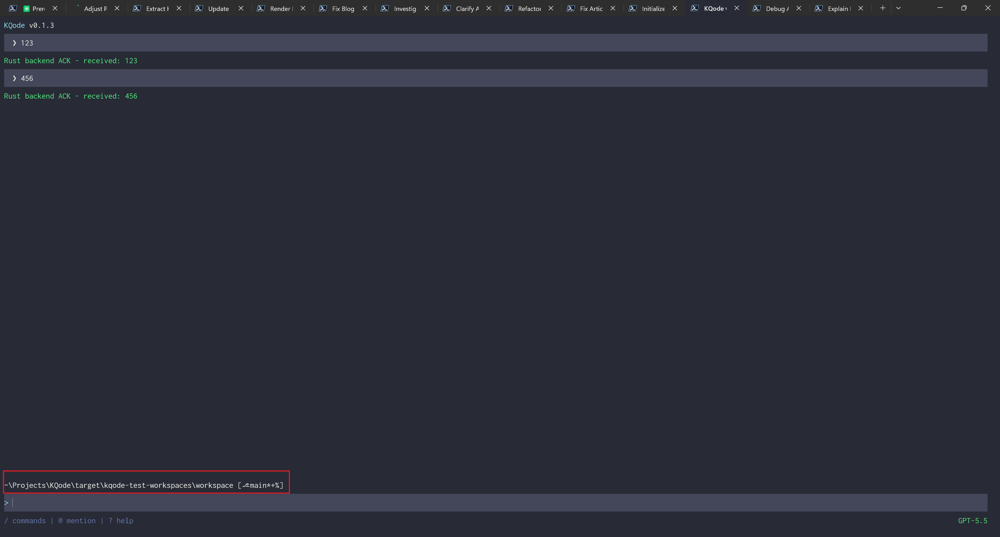

正文和输入框之间那一行，显示当前工作目录和 Git 状态，比如 `~\Projects\KQode [⎇ main *]`。



它由展示组件 [`components/CwdLine.tsx`](https://github.com/kefeiqian/KQode/blob/dd15b678392eacc2ffcee88884eba18ae52c1236/tui/src/components/CwdLine.tsx)、Git 解析 [`libs/git/gitStatus.ts`](https://github.com/kefeiqian/KQode/blob/dd15b678392eacc2ffcee88884eba18ae52c1236/tui/src/libs/git/gitStatus.ts)、以及文本裁剪 [`libs/text/clipText.ts`](https://github.com/kefeiqian/KQode/blob/dd15b678392eacc2ffcee88884eba18ae52c1236/tui/src/libs/text/clipText.ts) 三块组成。

## cwd 行：[`components/CwdLine.tsx`](https://github.com/kefeiqian/KQode/blob/dd15b678392eacc2ffcee88884eba18ae52c1236/tui/src/components/CwdLine.tsx)

`CwdLine` 把 cwd 和 Git 标签拼起来，再从左侧裁剪到列宽：

```tsx
export function CwdLine({ workspaceCwd, gitStatusLabel, columns }: CwdLineProps) {
  const cwdSegment = formatDisplayCwd(workspaceCwd);
  const gitSegment = gitStatusLabel === undefined ? '' : ` [${gitStatusLabel}]`;
  const visibleLine = clipTextLeft(`${cwdSegment}${gitSegment}`, Math.max(MIN_VISIBLE_COLUMNS, columns));

  return (
    <Box>
      <Text color={githubDarkTheme.colors.foreground}>{visibleLine}</Text>
    </Box>
  );
}
```

两个设计选择：

- **`~` 缩写 home 目录**：`formatDisplayCwd` 把 home 前缀替换成 `~`，并在 Windows 上做大小写无关比较（`normalizePathForComparison`）。这样长路径更短、也更符合终端用户的直觉。
- **从左裁剪（`clipTextLeft`）**：路径太长时，砍掉**左边**（用 `...` 开头），保留右边的叶子目录和 Git 标签。因为“我在哪个子目录、什么分支”比“完整前缀”更重要。

[`libs/text/clipText.ts`](https://github.com/kefeiqian/KQode/blob/dd15b678392eacc2ffcee88884eba18ae52c1236/tui/src/libs/text/clipText.ts) 提供左右两种裁剪，都用 `...` 省略号，并处理列宽小于省略号本身的边界：

```ts
export function clipTextLeft(text: string, maxColumns: number): string {
  if (maxColumns <= 0) return '';
  if (text.length <= maxColumns) return text;
  if (maxColumns <= ELLIPSIS.length) return text.slice(-maxColumns);
  return `${ELLIPSIS}${text.slice(-(maxColumns - ELLIPSIS.length))}`;
}
```

## Git 解析：[`libs/git/gitStatus.ts`](https://github.com/kefeiqian/KQode/blob/dd15b678392eacc2ffcee88884eba18ae52c1236/tui/src/libs/git/gitStatus.ts)

Git 标签来自对 workspace 跑一次 porcelain status。**最关键的设计是整段 `try/catch` + 超时**：

```ts
export function readGitStatusLabel(cwd: string): string | undefined {
  try {
    const porcelainStatus = execFileSync(
      'git',
      ['-C', cwd, 'status', '--porcelain=v1', '--branch'],
      { encoding: 'utf8', stdio: ['ignore', 'pipe', 'ignore'], timeout: GIT_STATUS_TIMEOUT_MS }
    );
    return formatGitStatusLabel(parseGitStatus(porcelainStatus));
  } catch {
    return undefined;
  }
}
```

为什么这么谨慎？因为 KQode 会在任意目录启动——那里可能**没装 git、不是 git 仓库、或者仓库大到 status 卡住**。任何一种情况都不能让主界面崩溃或卡死。所以：

- `timeout: 2000`：巨型仓库 status 慢，2 秒还没结果就放弃，不阻塞 UI。
- `stdio` 把 stderr 设为 `ignore`：不是仓库时 git 会往 stderr 写错误，我们不想让它污染终端。
- `catch` 返回 `undefined`：**失败就不显示 Git 标签，而不是报错**。cwd 行照常显示路径。

## 详解 `git status --porcelain=v1 --branch`

这条命令是整个 Git 标签的数据来源，它和平时在终端敲的 `git status` **不是同一种输出**——后者是给**人**看的，这个命令是给**程序**解析的。

普通 `git status` 带颜色、有整段自然语言（`Changes not staged for commit:`、`Untracked files:`），而且会**跟随系统语言本地化**（`LANG` 是中文时会变成“尚未暂存以备提交的变更：”）。它的排版还会随 Git 版本变化、依赖用户配置，脚本去解析非常脆弱。

`--porcelain` 就是为此而生：**输出一份稳定、不本地化、跨 Git 版本不变的机器可读格式**。（“porcelain / plumbing”是 Git 对“高层给人用的命令 / 底层给脚本拼装的命令”的叫法；`--porcelain` 这个开关则表示“给我一份适合脚本消费的稳定格式”。）加上我们传的 `--branch`，一次典型输出长这样：

```text
## main...origin/main [ahead 1, behind 2]
M  src/app.ts
 M README.md
MM config.json
A  src/new-file.ts
D  old-file.ts
R  old-name.ts -> new-name.ts
?? notes.txt
```

### 第一行：分支状态（来自 `--branch`）

只有传了 `--branch` 才会有第一行 `## main...origin/main [ahead 1, behind 2]`：`## ` 前缀 + 本地分支 + `...` + 上游分支 + 可选的 `[ahead N, behind M]`。它有几种边界形态：

- 有上游：`## main...origin/main`（后面可能再跟 `[ahead/behind]`）
- 无上游：`## main`
- 新仓库、还没有任何提交：`## No commits yet on main`
- 游离 HEAD（detached）：`## HEAD (no branch)`

下一节的 `parseGitStatus` 就是靠 `## ` 前缀找到这一行、再按这几种形态抠出分支名。

### 后续每行：两列状态码 `XY`

分支行之外，每一行都是**两列状态码 + 一个空格 + 路径**，形如 `XY <路径>`：

- **第 0 列 `X`**：**暂存区**（index / staged）相对 `HEAD` 的状态，也就是 `git add` 之后记录下来的改动。
- **第 1 列 `Y`**：**工作区**（working tree / unstaged）相对暂存区的状态，也就是改了但还没 `git add` 的改动。

同一个文件两列可以都有值。对照上面的样例：

| 行 | `X` | `Y` | 含义 |
| --- | --- | --- | --- |
| `M  src/app.ts` | `M` | 空格 | 改动已暂存，工作区无新改动 |
| ` M README.md` | 空格 | `M` | 改动只在工作区，尚未暂存 |
| `MM config.json` | `M` | `M` | 暂存了一版后，又在工作区改了 |
| `A  src/new-file.ts` | `A` | 空格 | 新增文件并已暂存 |
| `D  old-file.ts` | `D` | 空格 | 删除已暂存 |
| `R  old-name.ts -> new-name.ts` | `R` | 空格 | 重命名已暂存，箭头给出新旧路径 |
| `?? notes.txt` | `?` | `?` | 未跟踪文件 |

单个状态字符的含义如下：

| 代码 | 含义 |
| --- | --- |
| 空格 | 未改动 |
| `M` | 修改（modified） |
| `A` | 新增（added） |
| `D` | 删除（deleted） |
| `R` | 重命名（renamed） |
| `C` | 复制（copied） |
| `U` | 未合并 / 冲突（unmerged） |
| `?` | 未跟踪，成对出现为 `??` |
| `!` | 被忽略，成对出现为 `!!`，且只有加 `--ignored` 才会列出 |

一个容易踩的坑：**未跟踪 `??` 和被忽略 `!!` 会把 `?` / `!` 同时占在两列**，它们并不表示“暂存区/工作区有改动”。这正是下一节 `parseGitStatus` 在判断暂存/未暂存时要专门排除 `?` 和 `!`、而未跟踪单独用 `line.startsWith('??')` 判断的原因。

### 为什么显式写 `=v1`

`--porcelain` 有两个版本：

- **`=v1`**：上面这份经典短格式（布局等价于 `git status -s`），每行两列状态码，KQode 用的就是它。
- **`=v2`**：Git 2.11 起提供的更详细格式，每行以 `1` / `2` / `u` / `?` / `!` 开头，额外带对象哈希、文件模式等字段，解析更复杂。

裸写 `--porcelain` 默认就等于 `=v1`，但**显式钉死 `=v1` 更保险**：意图清晰，也避免将来 Git 万一改了默认值时把解析器带崩。

> 补充一个细节：含特殊字符的路径会被 Git 按 C 风格加引号（比如本仓库里的中文路径会显示成 `"blog/docs/..."`）。好在 KQode 的解析器只看每行第 0、1 两列、不碰路径本身，所以加不加引号都不影响判断。

## 解析 porcelain 输出

`parseGitStatus` 从 `--porcelain=v1 --branch` 的输出里提取分支名和三类改动：

```ts
return lines.reduce<GitStatus>(
  (status, line) => {
    if (line.startsWith(STATUS_BRANCH_PREFIX)) return status; // "## " 开头是分支行
    return {
      branch: status.branch,
      hasUnstagedChanges: status.hasUnstagedChanges || (line[1] !== ' ' && line[1] !== '?' && line[1] !== '!'),
      hasStagedChanges: status.hasStagedChanges || (line[0] !== ' ' && line[0] !== '?' && line[0] !== '!'),
      hasUntrackedChanges: status.hasUntrackedChanges || line.startsWith('??')
    };
  },
  { branch, hasUnstagedChanges: false, hasStagedChanges: false, hasUntrackedChanges: false }
);
```

porcelain 格式每行前两列是暂存区/工作区状态码：第 0 列是暂存（staged）、第 1 列是工作区（unstaged）、`??` 是未跟踪。这里用**命名常量**判断状态码，而不是散落的魔法字符，符合项目“避免硬编码状态字符串”的约定。分支名解析还处理了三种边界：正常分支、`No commits yet on ...`（新仓库无提交）、`HEAD (no branch)`（detached）。

最后格式化成带图标和 flag 的标签：`⎇ main` 加上 `*`（有未暂存改动）/`+`（有暂存改动）/`%`（有未跟踪文件）：

```ts
export function formatGitStatusLabel(status: GitStatus | undefined): string | undefined {
  if (status === undefined) return undefined;
  return `${GIT_BRANCH_ICON} ${status.branch}${formatGitStatusFlags(status)}`;
}
```

同样，`*`/`+`/`%` 是**文本符号**而非纯颜色，去色也能分辨。
