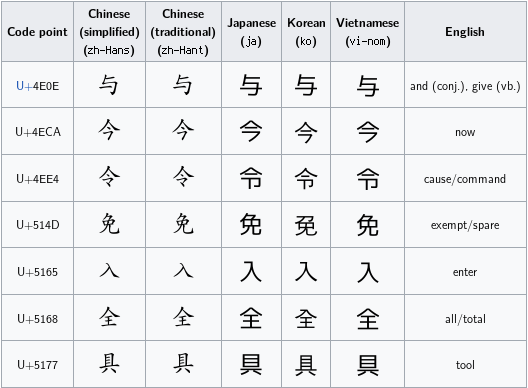

输入框的状态没有用全局容器，而是一个内聚的 reducer——[`state/composerReducer.ts`](https://github.com/kefeiqian/KQode/blob/dd15b678392eacc2ffcee88884eba18ae52c1236/tui/src/state/composerReducer.ts)。它负责三样东西：当前文本、光标位置、校验错误。状态定义如下：

```ts
export const PROMPT_MAX_BYTES = 64 * 1024;

type ComposerState = {
  text: string;
  cursorIndex: number;
  validationError: string | null;
};

type ComposerAction =
  | { type: 'insert'; text: string; maxBytes?: number }
  | { type: 'deleteBackward'; maxBytes?: number }
  | { type: 'moveCursorBackward' }
  | { type: 'moveCursorForward' }
  | { type: 'clear' }
  | { type: 'setValidationError'; message: string | null };
```

## 插入与删除：都要重算校验

`insert` 在光标处切开文本插入，并顺手更新“是否超限”的校验：

```ts
case 'insert': {
  if (action.text.length === 0) {
    return state;
  }
  const cursorIndex = clampCursorIndex(state.text, state.cursorIndex);
  const text = state.text.slice(0, cursorIndex) + action.text + state.text.slice(cursorIndex);
  return {
    text,
    cursorIndex: cursorIndex + action.text.length,
    validationError: overLimitMessage(text, action.maxBytes ?? PROMPT_MAX_BYTES)
  };
}
```

- 空插入直接原样返回 `state`（不触发重渲染）；
- 每次改文本都重算 `overLimitMessage`，让校验始终跟文本同步。

## Unicode 光标：按 code point 移动

先说清 Unicode 本身是什么。它是一张大表，给几乎每个字符都编了个唯一的号，这个号就叫**码点**。



但这张表只管“字符对应哪个号”，不管这个号在内存或硬盘里怎么摆成字节——那是**编码**要解决的事。同一个码点换种编码存出来，字节数和字节内容都不一样。常见的编码有三种：

- **UTF-8**（[8-bit Unicode Transformation Format](https://en.wikipedia.org/wiki/UTF-8)）：变长，一个码点占 1 到 4 字节。ASCII（[American Standard Code for Information Interchange](https://en.wikipedia.org/wiki/ASCII)）只占 1 字节（因此完全兼容 ASCII），常见汉字一般 3 字节，emoji 这类要 4 字节。文件、网络、终端 I/O 基本都认它。
- **UTF-16**（[16-bit Unicode Transformation Format](https://en.wikipedia.org/wiki/UTF-16)）：也是变长，一个码点占 2 或 4 字节，即 1 个或 2 个 16 位单元；JavaScript、Java 的字符串在内存里就是这么存的。
- **UTF-32**（[32-bit Unicode Transformation Format](https://en.wikipedia.org/wiki/UTF-32)）：定长，每个码点一律 4 字节，省心但费空间，很少直接拿来存文本。

先分清两个容易混淆的概念。**码点（code point）** 是 Unicode 给每个字符分配的唯一编号，写作 `U+XXXX`，范围从 `U+0000` 到 `U+10FFFF`，代表一个字符的逻辑身份。**码元（code unit）** 是字符串在内存里的存储单位；JS 字符串用 UTF-16 编码，每个码元 16 位，`text.length`、`text[i]`、`charCodeAt(i)` 数的都是码元，不是码点。

这篇里两种编码会同时出现：光标移动面对的是 JS 字符串，按 UTF-16 的单元走；而后面那个 64 KiB（[Kibibyte](https://en.wikipedia.org/wiki/Kibibyte)）的长度上限，数的是 UTF-8 的**字节数**（`TextEncoder` 只吐 UTF-8）。两套单位一旦混起来，长度就会数错、字符就会切坏。

`U+0000` 到 `U+FFFF` 这一段叫基本多文种平面（[Basic Multilingual Plane](https://en.wikipedia.org/wiki/Plane_%28Unicode%29), BMP），里面的字符一个码点正好一个码元，常用汉字也在其中。可大多数 emoji 和少数生僻扩展汉字落在 `U+10000` 以上的增补平面，一个码点要用两个码元才拼得出来，这一对码元就叫 **代理对（surrogate pair）**：前一个是高代理（`0xD800–0xDBFF`），后一个是低代理（`0xDC00–0xDFFF`）。

`😀`（`U+1F600`）在 JS 里是这样：

```text
'😀'.length          // 2      两个码元
'😀'.charCodeAt(0)   // 0xD83D 高代理
'😀'.charCodeAt(1)   // 0xDE00 低代理
```

`cursorIndex` 是按码元算的下标（`slice`、`charCodeAt` 都按码元走）。光标要是每次只挪一个码元，碰到代理对就会停在两个码元当中，而那里不是任何字符的边界；这时候退格只删掉半个代理对，剩下一个落单的代理码元，终端把它画成 `�`。

所以移动和删除都认准码点边界：动手之前先看一眼相邻的码元是不是代理对的一半。往左看光标前一个码元，是低代理（`0xDC00–0xDFFF`）就跨 2，否则跨 1；往右看光标当前码元，是高代理（`0xD800–0xDBFF`）就跨 2，否则跨 1。

```ts
function previousCodePointStart(text: string, cursorIndex: number): number {
  const previousIndex = cursorIndex - 1;
  const previousCodeUnit = text.charCodeAt(previousIndex);
  const offset = previousCodeUnit >= 0xdc00 && previousCodeUnit <= 0xdfff ? 2 : 1; // 低代理 → 跨 2
  return Math.max(0, cursorIndex - offset);
}

function nextCodePointEnd(text: string, cursorIndex: number): number {
  const currentCodeUnit = text.charCodeAt(cursorIndex);
  const offset = currentCodeUnit >= 0xd800 && currentCodeUnit <= 0xdbff ? 2 : 1; // 高代理 → 跨 2
  return Math.min(text.length, cursorIndex + offset);
}
```

拿 `a😀b` 走一遍。它一共 4 个码元，`😀` 占了中间的下标 1 和 2：

| 下标 | 码元 | 属于哪个字符 |
| --- | --- | --- |
| 0 | `0x0061` | `a`（`U+0061`） |
| 1 | `0xD83D` | `😀` 的高代理（`U+1F600`） |
| 2 | `0xDE00` | `😀` 的低代理（`U+1F600`） |
| 3 | `0x0062` | `b`（`U+0062`） |

光标真正能停的是码元之间的边界，也就是 `0` 到 `4`：

```text
code unit:  | a | HI| LO| b |
boundary:   0   1   2   3   4
valid stop: ^   ^   x   ^   ^
```

`HI` 是 `0xD83D`、`LO` 是 `0xDE00`，两个码元合起来才是 `😀`（`U+1F600`）；边界 `2` 正好夹在它俩中间，是唯一停不得的落点。

从末尾按 ← 一路往回走，起点 `cursorIndex = 4`：

```text
看下标 3 'b'（非低代理）   → 退 1 → 3
看下标 2 0xDE00（低代理）  → 退 2 → 1     一步跨过整个 😀
看下标 0 'a'（非低代理）   → 退 1 → 0

光标轨迹：  4 → 3 → 1 → 0          从不落在下标 2
若按码元退 1：4 → 3 → 2 → 1 → 0     下标 2 在 😀 半途，退格删一半 → �
```

退格（`deleteBackward`）走的也是 `previousCodePointStart`，所以在 `😀` 后面按一下退格会整个表情一起删掉。

这套判断只做到码点这一层。带肤色的 emoji、ZWJ（[Zero Width Joiner](https://en.wikipedia.org/wiki/Zero-width_joiner)）组合序列（比如 👨‍👩‍👧）、字母加组合附加符号，本质都是几个码点拼成的一个视觉字符（字素簇，grapheme cluster），按码点走还是会拆开它们。真要按字素移动，得引入专门的字素分割逻辑，代价大得多；眼下先保证最常见的代理对不被切碎。

## 提交校验：空值与超限

提交时先跑 `validateComposerSubmit`，分成三种结果：

```ts
export function validateComposerSubmit(text: string, maxBytes = PROMPT_MAX_BYTES): SubmitValidation {
  if (text.trim().length === 0) {
    return { ok: false, reason: 'empty', message: '' };
  }
  const limitMessage = overLimitMessage(text, maxBytes);
  if (limitMessage !== null) {
    return { ok: false, reason: 'over-limit', message: limitMessage };
  }
  return { ok: true, text };
}
```

- **空（只有空白）**：静默拒绝，不报错也不提交——回车一个空行不该有任何反馈。
- **超限**：`64 KiB` 是按 **UTF-8 字节数**算的（`TextEncoder`），不是字符数，因为下游后端和存储关心的是字节。超限时给出明确的字节数错误。
- **通过**：返回 trim 前的原文（保留用户输入的首尾空格由后续决定）。

为什么限制 64 KiB？既要允许粘贴一大段代码/日志，又要防止有人把一个几 MB 的文件粘进来把 UI 和后端撑爆。64 KiB 是个宽松但有上限的折中。后续会用 @ 语法直接引用大文件，而不建议整段粘进来。

## 净化输入：printableInput

从终端读到的原始输入，除了你敲进去的字，还可能夹着**控制字符**。想弄明白它们，得回到 ASCII：字符表最前面的 `U+0000`–`U+001F` 这 32 个码点，再加上单独的 DEL（`U+007F`），都不是给人看的字形，而是发给终端、打印机这类设备的“指令”。它们统称 **C0 控制字符**（[C0 and C1 control codes](https://en.wikipedia.org/wiki/C0_and_C1_control_codes)），常打交道的有这么几个：

| 码点 | 字符 | 作用 |
| --- | --- | --- |
| `U+0000` | NUL（`\0`） | 空字符，C 语言里用作字符串的结束标记 |
| `U+0008` | BS（`\b`） | 退格，光标左移一格 |
| `U+0009` | HT（`\t`） | 水平制表，也就是 Tab |
| `U+000A` | LF（`\n`） | 换行，跳到下一行 |
| `U+000D` | CR（`\r`） | 回车，回到行首 |
| `U+001B` | ESC | 转义，ANSI 转义序列的引导符（方向键、颜色码都从它开始） |
| `U+007F` | DEL | 删除 |

（`U+0080`–`U+009F` 还有一组 C1 控制字符，这里用不上，日常终端输入也基本碰不到。）

这些字节为什么会混进输入？因为按方向键、功能键，或者粘贴文本时，终端送来的不是“上箭头”这几个字，而是一串以 ESC 打头的转义序列，比如上箭头就是 `ESC [ A`。这些原始字节一旦直接进了文本缓冲区，轻则显示成乱码，重则把光标控制、颜色转义一起塞进你的 prompt。`printableInput` 在插入前先把它们过滤掉：

```ts
export function printableInput(input: string): string {
  return input.replace(/[\u0000-\u001f\u007f]/g, '');
}
```

正则 `[\u0000-\u001f\u007f]` 匹配的正是这 32 个 C0 控制字符，外加紧跟在可打印区后面的 DEL（`U+007F`），`replace` 再把它们全换成空串。范围里连 Tab、换行、回车都一并算上，任何原始控制字节都别想溜进缓冲区。除 DEL 外，空格（`U+0020`）以上的可打印内容（字母、数字、中文、emoji）都原样保留。真正的功能键（回车、退格、方向键）在 [`components/PromptComposer.tsx`](https://github.com/kefeiqian/KQode/blob/dd15b678392eacc2ffcee88884eba18ae52c1236/tui/src/components/PromptComposer.tsx) 的 `useInput` 里已经被单独处理。

## 延伸阅读

- [谈谈 Unicode 编码，简要解释 UCS、UTF、BMP、BOM 等名词](https://zhuanlan.zhihu.com/p/461741666)
