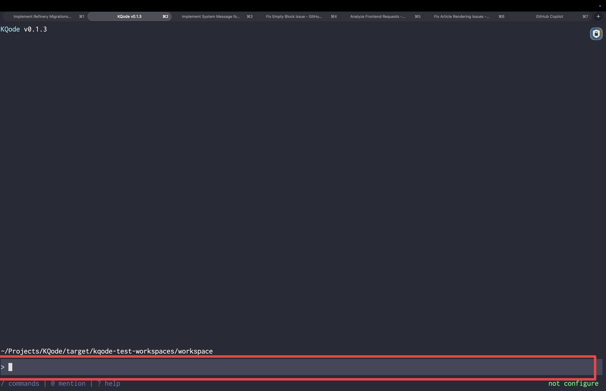

[`tui/src/components/PromptComposer.tsx`](https://github.com/kefeiqian/KQode/blob/dd15b678392eacc2ffcee88884eba18ae52c1236/tui/src/components/PromptComposer.tsx) 是 U2 里最复杂的单文件组件（约 300 行）。它把 [第 6 篇](./06-输入框状态composerReducer.md)中的 [`tui/src/state/composerReducer.ts`](https://github.com/kefeiqian/KQode/blob/dd15b678392eacc2ffcee88884eba18ae52c1236/tui/src/state/composerReducer.ts) 接上键盘，把文本换行成可见窗口，手动定位光标，再渲染成带背景的输入框。



## 键盘输入：useInput

`useInput` 把每一次按键翻译成一个 reducer 动作：

```tsx
useInput(
  (input, key) => {
    if (isMouseInput(input)) return;                       // 鼠标转义序列，交给 HomeScreen 处理
    if (key.return && key.shift) { dispatch({ type: 'insert', text: '\n', maxBytes }); return; }
    if (key.leftArrow) { dispatch({ type: 'moveCursorBackward' }); return; }
    if (key.rightArrow) { dispatch({ type: 'moveCursorForward' }); return; }
    if (key.return) {
      const validation = validateComposerSubmit(state.text, maxBytes);
      if (!validation.ok) {
        if (validation.reason === 'over-limit') dispatch({ type: 'setValidationError', message: validation.message });
        return;
      }
      onSubmit(validation.text);
      dispatch({ type: 'clear' });
      return;
    }
    if (key.backspace || key.delete) { dispatch({ type: 'deleteBackward', maxBytes }); return; }
    if (key.tab) return;
    const printable = printableInput(input);
    if (printable.length > 0) dispatch({ type: 'insert', text: printable, maxBytes });
  },
  { isActive }
);
```

几个关键决策：

- **Shift+Enter 换行，Enter 提交**：多行输入靠 Shift+Enter，回车直接提交。这是聊天式输入框的通用心智模型。
- **提交前校验**：空输入静默吞掉；超限则把错误写进状态（红色错误行）而不提交；通过才 `onSubmit` 并 `clear`。
- **鼠标序列直接 return**：SGR（[Select Graphic Rendition](https://en.wikipedia.org/wiki/ANSI_escape_code#SGR_%28Select_Graphic_Rendition%29_parameters)）鼠标上报也走标准输入 `stdin`。输入框并不负责滚动，只要靠 `isMouseInput` 认出这类转义序列并让出处理权；真正的滚动交给 [`tui/src/components/HomeScreen.tsx`](https://github.com/kefeiqian/KQode/blob/dd15b678392eacc2ffcee88884eba18ae52c1236/tui/src/components/HomeScreen.tsx)（[第 9 篇](./09-鼠标与滚动.md)）。
- **Tab 显式忽略**：先占位，避免 Tab 插入奇怪字符；未来可能用于补全。

## 可见窗口：只渲染光标附近的几行

输入框高度有限（`maxVisibleLines`），但文本可能很长。`formatVisiblePromptView` 负责：把文本按列宽换行 → 找到光标所在行 → 切出一个“包含光标”的可见窗口 → 同时把光标索引换算到窗口内坐标：

```ts
function formatVisiblePromptView(text, columns, maxVisibleLines, cursorIndex) {
  const rows = wrapText(text, safeColumns);
  const cursorRowIndex = resolveCursorRowIndex(rows, safeCursorIndex);
  const lastVisibleStart = Math.max(0, rows.length - safeMaxVisibleLines);
  const visibleStart = Math.min(Math.max(0, cursorRowIndex - safeMaxVisibleLines + 1), lastVisibleStart);
  const visibleRows = rows.slice(visibleStart, visibleStart + safeMaxVisibleLines);
  return { text: visibleRows.map((row) => row.text).join('\n'), cursorIndex: resolveVisibleCursorIndex(visibleRows, safeCursorIndex) };
}
```

`visibleStart` 的计算保证**光标始终在可见窗口内**：光标往下走到底部时窗口跟着往下滑，但不会滑过最后一屏（`lastVisibleStart`）。`wrapText` 同时处理显式换行（`\n`、`\r\n`）和按列宽的自动折行，每个 `WrappedPromptRow` 都记着它在原文里的 `start`/`end`，这样才能把“原文光标索引”映射到“可见窗口里的第几行第几列”。

## 手动光标定位

Ink 的普通渲染不会帮我们把终端光标放到输入框里，得用 `useCursor` 手动设置。我们先从 Ink 拿到 `setCursorPosition`：

```tsx
import { Box, Text, useBoxMetrics, useCursor, useInput, useIsScreenReaderEnabled, useStdout } from 'ink';

const composerRef = useRef<DOMElement | null>(null);
const composerMetrics = useBoxMetrics(composerRef);
const { setCursorPosition } = useCursor();
```

`useCursor()` 自己不算位置，只暴露 `setCursorPosition`。输入框每次渲染都重新声明一次光标位置：组件位置已经测出来、`isActive` 也为真时，传 `{ x, y }`；否则传 `undefined`，让 Ink 不显示这个光标。

```tsx
if (isActive && composerMetrics.hasMeasured) {
  setCursorPosition(
    resolveComposerCursorPosition(
      visibleText,
      inputColumns,
      cursorTop ?? composerMetrics.top,
      visiblePrompt.cursorIndex
    )
  );
} else {
  setCursorPosition(undefined);
}
```

坐标计算拆到 `resolveComposerCursorPosition`：

```tsx
const PROMPT_PREFIX = '> ';
const INK_CURSOR_ROW_ORIGIN_OFFSET = 1;

export function resolveComposerCursorPosition(visibleText, columns, composerTop, cursorIndex = visibleText.length) {
  const cursorPosition = cursorPositionForVisibleText(visibleText, columns, cursorIndex);
  return {
    x: PROMPT_PREFIX.length + cursorPosition.x,
    y: composerTop + cursorPosition.y + INK_CURSOR_ROW_ORIGIN_OFFSET
  };
}
```

`x` 要加上 `> ` 前缀的宽度；`y` 要在 `composerTop`（[第 3 篇](./03-组件树与布局.md)算出的输入框顶部行）基础上加光标所在的可见行号，再加一个 `INK_CURSOR_ROW_ORIGIN_OFFSET`（Ink 的行原点偏移）。

这个常量不是输入框自己的 padding，也不是业务层的“多留一行”。它只是一个坐标校准值：`useBoxMetrics` 拿到的是组件盒子的顶部行，`useCursor().setCursorPosition` 要的是终端光标应该落下的行。U2 这个版本里，测得的 `composerTop` 需要再往下挪 1 行，才会对到真正可编辑的文本行，所以常量值是 `1`。把这个偏移单独命名，比在公式里直接写 `+ 1` 更好排查：以后如果 Ink 渲染基线、全屏换行策略或输入框背景结构变了，只需要重新验证这个偏移，而不是猜公式里的魔法数字。

> 这也是后来“改布局要重验光标”这条 TUI 规则的来源：`y` 是 `composerTop`、可见行号、Ink 原点偏移三者叠加，任何一个环节（body 高度、spacer、换行、校验行）变了，光标都可能落到错误的行。

## 回写高度：onVisibleRowsChange

输入框变高会挤压正文，所以它得把自己的实际行数告诉 [`tui/src/components/HomeScreen.tsx`](https://github.com/kefeiqian/KQode/blob/dd15b678392eacc2ffcee88884eba18ae52c1236/tui/src/components/HomeScreen.tsx)：

```tsx
const visibleRows = countVisibleComposerRows(visibleText, state.validationError !== null);
useEffect(() => { onVisibleRowsChange?.(visibleRows); }, [onVisibleRowsChange, visibleRows]);
```

行数 = 可见文本行数 +（有校验错误则再 +1）。[`tui/src/components/HomeScreen.tsx`](https://github.com/kefeiqian/KQode/blob/dd15b678392eacc2ffcee88884eba18ae52c1236/tui/src/components/HomeScreen.tsx) 收到后回写 `composerRows`，布局重算。

## 渲染：前缀、背景与校验行

最后把可见文本逐行渲染，首行带蓝色 `> ` 前缀，开背景时把每行 `padEnd` 到整宽刷满底色：

```tsx
{visibleTextRows.map((row, index) => {
  const prefix = index === 0 ? PROMPT_PREFIX : '';
  const rowColumns = Math.max(0, columns - prefix.length);
  return (
    <Box key={`${index}-${row}`} backgroundColor={backgroundColor(shouldRenderBackground)}>
      {prefix.length > 0 ? <Text color={githubDarkTheme.colors.accentBlue}>{prefix}</Text> : null}
      <Text color={githubDarkTheme.colors.foreground}>
        {shouldRenderBackground ? row.padEnd(rowColumns, ' ') : row}
      </Text>
    </Box>
  );
})}
```

这里的 `padEnd` 用的是 JavaScript 字符串方法：`row.padEnd(rowColumns, ' ')` 会在 `row` 右侧补空格，直到这一段文本达到 `rowColumns` 指定的宽度；如果文本已经够长，它不会再截断。前面的换行逻辑已经保证 `row` 不会超过可用列宽，所以这里补的主要是“看不见的空白列”。

这一步和背景色直接相关。Ink 给 `<Text>` 上背景色时，背景只覆盖这段文本实际占用的字符；不补满的话，短行右侧没有字符，背景色也就停在文字末尾。首行还要扣掉 `> ` 前缀，所以它补到 `columns - prefix.length`；后续行没有前缀，就补到整行 `columns`。校验错误行也是同一个道理，只是它渲染成单独一行红色 `ERROR: ...`，再按整行宽度补空格。
