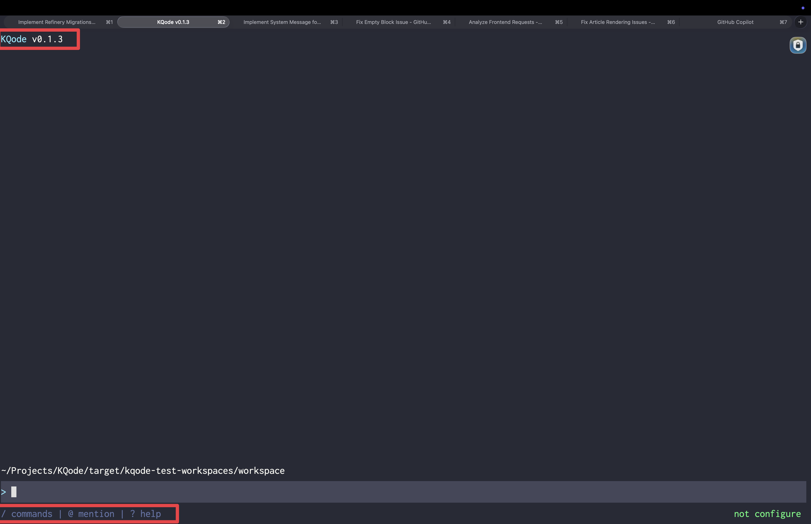

这篇看主界面最上面的 [`tui/src/components/Header.tsx`](https://github.com/kefeiqian/KQode/blob/dd15b678392eacc2ffcee88884eba18ae52c1236/tui/src/components/Header.tsx) 和最下面的 [`tui/src/components/StatusBar.tsx`](https://github.com/kefeiqian/KQode/blob/dd15b678392eacc2ffcee88884eba18ae52c1236/tui/src/components/StatusBar.tsx)。这两块代码不复杂，但它们决定了窄窗口下哪些信息先保留、哪些信息先让位。



## [`tui/src/components/Header.tsx`](https://github.com/kefeiqian/KQode/blob/dd15b678392eacc2ffcee88884eba18ae52c1236/tui/src/components/Header.tsx)：三档 logo

```tsx
export function Header({ productVersion, columns }: HeaderProps) {
  if (columns < HIDE_HEADER_BELOW_COLUMNS) {
    return null; // < 36 列：完全隐藏
  }
  if (columns < COMPACT_HEADER_BELOW_COLUMNS) {
    return <Text color={githubDarkTheme.colors.accentBlue}>KQode</Text>; // 36–52 列：只有 logo
  }
  const versionLabel = ` v${productVersion}`;
  return (
    <Box>
      <Text color={githubDarkTheme.colors.accentBlue}>KQode</Text>
      <Text color={githubDarkTheme.colors.foreground}>{versionLabel}</Text>
    </Box>
  );
}
```

这里的宽度阈值和 [第 3 篇](./03-组件树与布局.md)的 `headerRowCount` 用的是同一组常量：`HIDE_HEADER_BELOW_COLUMNS = 36`、`COMPACT_HEADER_BELOW_COLUMNS = 52`。组件怎么降级，布局就按同一套规则预留行数。

窄到 36 列以下时，这个组件直接 `return null`。

## [`tui/src/components/StatusBar.tsx`](https://github.com/kefeiqian/KQode/blob/dd15b678392eacc2ffcee88884eba18ae52c1236/tui/src/components/StatusBar.tsx)：提示与模型名

底部状态栏左边是操作提示，右边是当前模型名：

```tsx
export function StatusBar({ columns, modelLabel }: StatusBarProps) {
  const leftHints = columns >= 60 ? '/ commands | @ mention | ? help' : '/ | @ | ?';
  const showModel = columns >= 60;
  return (
    <Box width={columns}>
      <Text color={githubDarkTheme.colors.muted}>{leftHints}</Text>
      {showModel ? (
        <Box flexGrow={1} justifyContent="flex-end">
          <Text color={githubDarkTheme.colors.accentGreen}>{modelLabel}</Text>
        </Box>
      ) : null}
    </Box>
  );
}
```

StatusBar 也按宽度降级，只是阈值放在 `60` 列：

- 宽度够（`>= 60`）时显示完整提示 `/ commands | @ mention | ? help`，右侧用 `flexGrow={1}` + `justifyContent="flex-end"` 把模型名推到最右。
- 窄了就把提示压缩成符号 `/ | @ | ?`，并且隐藏模型名。宽度不够时，保留“有哪些命令入口”比“用的哪个模型”更重要。

提示里的 `/`、`@`、`?` 对应未来的 slash 命令、@ 提及和帮助。这里先放占位文案，功能要到后续单元才接。模型名默认 `GPT-5.5`，通过 props 传入，为后面接入真实 provider 留好了位置。
