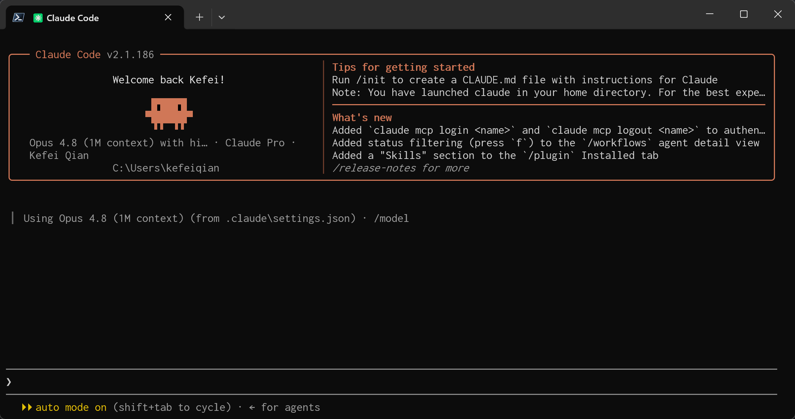
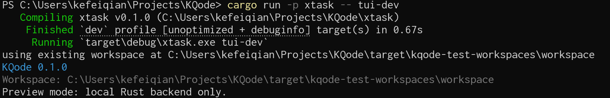

After creating the Rust backend project, we create the frontend project. Most Coding Agents today are command-line CLIs, and the most well-known TUI (Terminal UI) solution in this space is Ink.

## Ink Introduction

<p align="center">
  
</p>

[Ink](https://github.com/vadimdemedes/ink) is a framework for building command-line interfaces with React. It abstracts terminal input boxes, lists, status bars, streaming output, and similar UI pieces into components, so we can organize the TUI with familiar React state and hooks instead of manually concatenating ANSI strings.

Many Coding Agents use a similar direction, including Claude Code, OpenAI Codex CLI, and Google Gemini CLI. They all need to display conversations, tool calls, diffs, approvals, and execution progress in the terminal. Ink is well suited for quickly building this kind of interaction-heavy CLI interface.

In KQode, Ink is only responsible for the frontend TUI. The real Agent Loop, tool execution, session records, and policy control stay in the Rust core, so the UI can be replaced later.

Claude Code UI screenshot:



## Create the Ink Project

KQode's frontend TUI lives in the repository under [`tui/`](https://github.com/kefeiqian/KQode/tree/99949b9fe7698a1f0b87acda232281cbaeb4d81d/tui), separate from the Rust backend.

This TUI is not yet a complete Coding Agent. It first creates a minimal frontend shell that can run, be tested, and be extended. It includes:

1. An Ink + React terminal application entry point.
2. A simple `App` component that shows the product version, current working directory, and preview copy.
3. Runtime helpers for reading the repository version and current working directory.
4. TypeScript, Vitest, and Ink component testing configuration.

### Initialize the TUI Package

The frontend dependencies and scripts are defined in [`tui/package.json`](https://github.com/kefeiqian/KQode/blob/99949b9fe7698a1f0b87acda232281cbaeb4d81d/tui/package.json):

```json
{
  "name": "@kqode/tui",
  "version": "0.1.0",
  "private": true,
  "type": "module",
  "packageManager": "bun@1.3.12",
  "engines": {
    "node": ">=24.0.0",
    "bun": ">=1.3.0"
  },
  "scripts": {
    "dev": "tsx main.tsx",
    "typecheck": "tsc --noEmit",
    "test": "vitest run"
  },
  "dependencies": {
    "ink": "^7.1.0",
    "react": "^19.2.7"
  }
}
```

Here we use [Bun](https://github.com/oven-sh/bun) to manage dependencies and use `tsx` to run the TypeScript entry point directly. The key dependencies are:

- `ink`: renders React components into the terminal.
- `react`: keeps the familiar component model and hooks.
- `vitest` and `ink-testing-library`: test terminal component output.

After creating the project, install dependencies:

```bash
cd tui
bun install
```

In the KQode repository, we prefer running this through the [`xtask` entry point](./03-创建Rust-xtask自动化.md):

```bash
cargo xtask tui-install
```

This lets docs, IDEs, and CI reuse the same command path.

### Configure TypeScript

The TUI uses strict TypeScript configuration. [`tui/tsconfig.json`](https://github.com/kefeiqian/KQode/blob/99949b9fe7698a1f0b87acda232281cbaeb4d81d/tui/tsconfig.json) enables `strict`, `isolatedModules`, and `verbatimModuleSyntax`:

```json
{
  "compilerOptions": {
    "target": "ES2022",
    "module": "NodeNext",
    "moduleResolution": "NodeNext",
    "jsx": "react-jsx",
    "strict": true,
    "isolatedModules": true,
    "verbatimModuleSyntax": true,
    "noEmit": true,
    "esModuleInterop": true,
    "forceConsistentCasingInFileNames": true,
    "skipLibCheck": true,
    "types": ["node", "vitest/globals"]
  }
}
```

The Vitest configuration is also lightweight. [`tui/vitest.config.ts`](https://github.com/kefeiqian/KQode/blob/99949b9fe7698a1f0b87acda232281cbaeb4d81d/tui/vitest.config.ts) only specifies the Node test environment:

```ts
import { defineConfig } from 'vitest/config';

export default defineConfig({
  test: {
    environment: 'node'
  }
});
```

### Create the Ink Entry Point

The TUI runtime entry point is [`tui/main.tsx`](https://github.com/kefeiqian/KQode/blob/99949b9fe7698a1f0b87acda232281cbaeb4d81d/tui/main.tsx). It reads runtime information and passes it to the React app:

```tsx
import path from 'node:path';
import { fileURLToPath } from 'node:url';
import { render } from 'ink';
import { App } from './src/App.js';
import { resolveRepoRoot, resolveWorkspaceCwd } from './src/libs/path/runtimePaths.js';
import { readProductVersion } from './src/libs/product/productMetadata.js';

const tuiPackageRoot = path.dirname(fileURLToPath(import.meta.url));
const repoRoot = resolveRepoRoot(tuiPackageRoot);
const workspaceCwd = resolveWorkspaceCwd();
const productVersion = readProductVersion(repoRoot);

render(<App productVersion={productVersion} workspaceCwd={workspaceCwd} />);
```

There is an important boundary here: `main.tsx` only collects runtime metadata and starts Ink. It does not own the concrete UI layout. The real UI starts from [`tui/src/App.tsx`](https://github.com/kefeiqian/KQode/blob/99949b9fe7698a1f0b87acda232281cbaeb4d81d/tui/src/App.tsx):

```tsx
import { Box, Text } from 'ink';

export type AppProps = {
  productVersion: string;
  workspaceCwd: string;
};

export function App({ productVersion, workspaceCwd }: AppProps) {
  return (
    <Box flexDirection="column">
      <Text color="cyan">KQode {productVersion}</Text>
      <Text color="gray">Workspace: {workspaceCwd}</Text>
      <Text>Preview mode: local Rust backend only.</Text>
    </Box>
  );
}
```

The UI is intentionally simple at this point: prove that Ink can render KQode's basic information and leave room to expand into a real Coding Agent TUI.

### Read Runtime Information

To avoid hard-coded paths in the TUI, the project first adds two small runtime helpers. [`tui/src/libs/path/runtimePaths.ts`](https://github.com/kefeiqian/KQode/blob/99949b9fe7698a1f0b87acda232281cbaeb4d81d/tui/src/libs/path/runtimePaths.ts) resolves the repository root and current working directory:

```ts
import path from 'node:path';

export function resolveRepoRoot(tuiPackageRoot: string): string {
  return path.normalize(path.resolve(tuiPackageRoot, '..'));
}

export function resolveWorkspaceCwd(cwd = process.cwd()): string {
  return path.normalize(cwd);
}
```

[`tui/src/libs/product/productMetadata.ts`](https://github.com/kefeiqian/KQode/blob/99949b9fe7698a1f0b87acda232281cbaeb4d81d/tui/src/libs/product/productMetadata.ts) reads the KQode version from the root `Cargo.toml`. This means the version shown by the TUI comes from the Rust project itself, rather than being maintained separately by the frontend.

### Run and Verify

During development, you can run commands directly inside `tui/`:

```bash
bun run dev
bun run typecheck
bun run test
```

But in the KQode repository, we prefer the Cargo-facing xtask commands:

```bash
cargo xtask tui-dev
cargo xtask tui-typecheck
cargo xtask tui-test
```

The Rust-side entry point for `tui-dev` is [`xtask/src/commands/tui/dev.rs`](https://github.com/kefeiqian/KQode/blob/99949b9fe7698a1f0b87acda232281cbaeb4d81d/xtask/src/commands/tui/dev.rs). It first ensures a runnable workspace exists, then ensures TUI dependencies exist, and finally starts `tui/main.tsx` through `tsx`.

For tests, the TUI uses [`ink-testing-library`](https://github.com/vadimdemedes/ink-testing-library) to render components and assert terminal output. For example, [`tui/src/__tests__/App.test.tsx`](https://github.com/kefeiqian/KQode/blob/99949b9fe7698a1f0b87acda232281cbaeb4d81d/tui/src/__tests__/App.test.tsx) checks the product name, version, workspace directory, and backend-only preview copy:

```tsx
expect(output).toContain('KQode 0.1.0');
expect(output).toContain(`Workspace: ${workspaceCwd}`);
expect(output).toContain('Preview mode: local Rust backend only.');
```

### Prepare a Dummy Workspace

A Coding Agent TUI should not only run inside its own `tui/` package directory. In real use, KQode operates on the user's currently opened project, so `workspaceCwd` needs to mean "the project being worked on" from the beginning.

To verify this semantics, U1 adds a small dummy React project: [`tests/fixtures/dummy-react-app/`](https://github.com/kefeiqian/KQode/tree/99949b9fe7698a1f0b87acda232281cbaeb4d81d/tests/fixtures/dummy-react-app). Its [`package.json`](https://github.com/kefeiqian/KQode/blob/99949b9fe7698a1f0b87acda232281cbaeb4d81d/tests/fixtures/dummy-react-app/package.json) looks like a normal Vite React app:

```json
{
  "name": "dummy-react-app",
  "version": "0.0.0",
  "private": true,
  "type": "module",
  "packageManager": "bun@1.3.12",
  "scripts": {
    "dev": "vite",
    "build": "vite build",
    "preview": "vite preview"
  }
}
```

This fixture is not a working directory to edit directly. It is a read-only seed. `xtask` copies it under `target/kqode-test-workspaces/workspace/`, then starts the TUI from that copied workspace. This lets the UI see a realistic project path without polluting the checked-in fixture.

The corresponding preparation command is registered in [`xtask/src/commands/fixture/mod.rs`](https://github.com/kefeiqian/KQode/blob/99949b9fe7698a1f0b87acda232281cbaeb4d81d/xtask/src/commands/fixture/mod.rs):

```rust
pub const PREPARE_REACT_SIMPLE: CommandSpec = CommandSpec {
    name: "fixture-prepare-react-simple",
    description: "Reset workspace from the committed simple React fixture",
    run: prepare_react_simple::run,
};
```

When the workspace is missing, `tui-dev` prompts the user to choose a fixture. After the selection, it starts `tsx` from the workspace directory, so the TUI's `workspaceCwd` points to the copied project directory rather than `tui/` itself.

### Build the Frontend Testing Framework

The TUI test framework consists of Vitest and `ink-testing-library`. [`tui/package.json`](https://github.com/kefeiqian/KQode/blob/99949b9fe7698a1f0b87acda232281cbaeb4d81d/tui/package.json) defines two key scripts:

```json
{
  "scripts": {
    "typecheck": "tsc --noEmit",
    "test": "vitest run"
  }
}
```

[`tui/vitest.config.ts`](https://github.com/kefeiqian/KQode/blob/99949b9fe7698a1f0b87acda232281cbaeb4d81d/tui/vitest.config.ts) starts with the minimum configuration and only sets the Node test environment:

```ts
import { defineConfig } from 'vitest/config';

export default defineConfig({
  test: {
    environment: 'node'
  }
});
```

The core idea of component testing is to render Ink components into a terminal frame and then assert the output text. The smoke test in `App.test.tsx` is written like this:

```tsx
const { lastFrame } = render(<App productVersion="0.1.0" workspaceCwd={workspaceCwd} />);

const output = lastFrame();

expect(output).toContain('KQode 0.1.0');
expect(output).toContain(`Workspace: ${workspaceCwd}`);
expect(output).toContain('Preview mode: local Rust backend only.');
```

Besides component output, U1 also tests path helpers. [`tui/src/__tests__/runtimePaths.test.ts`](https://github.com/kefeiqian/KQode/blob/99949b9fe7698a1f0b87acda232281cbaeb4d81d/tui/src/__tests__/runtimePaths.test.ts) verifies that `repoRoot` can be derived from `tuiPackageRoot`, and that `workspaceCwd` is normalized:

```ts
expect(resolveRepoRoot(tuiRoot)).toBe(path.normalize(repoRoot));
expect(resolveWorkspaceCwd(workspace)).toBe(path.normalize(workspace));
```

These tests cover the two earliest boundaries that need to stay stable: the terminal output the user sees, and the repository/workspace paths the TUI understands at startup.

Finally, `xtask` exposes these test entry points from the repository root. [`xtask/src/commands/tui/typecheck.rs`](https://github.com/kefeiqian/KQode/blob/99949b9fe7698a1f0b87acda232281cbaeb4d81d/xtask/src/commands/tui/typecheck.rs) calls `bun run typecheck`, and [`xtask/src/commands/tui/test.rs`](https://github.com/kefeiqian/KQode/blob/99949b9fe7698a1f0b87acda232281cbaeb4d81d/xtask/src/commands/tui/test.rs) calls `bun run test`. When writing future TUI features, we can run the checks from the repository root:

```bash
cargo xtask tui-typecheck
cargo xtask tui-test
```

### Run Screenshot

After everything is ready, the run screenshot looks like this:


