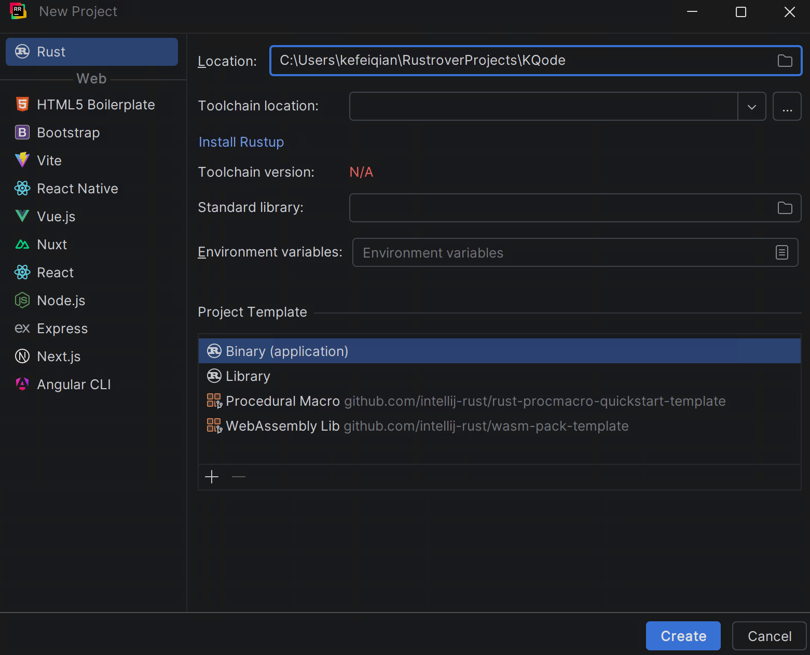
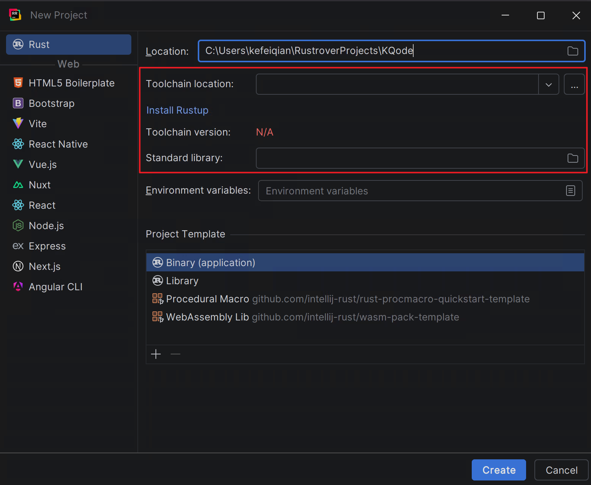
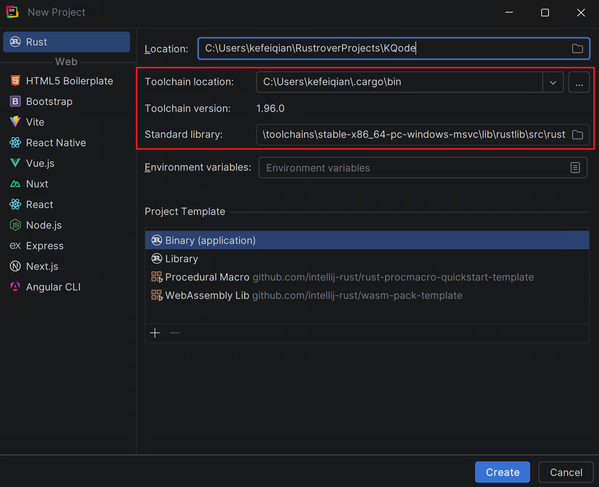
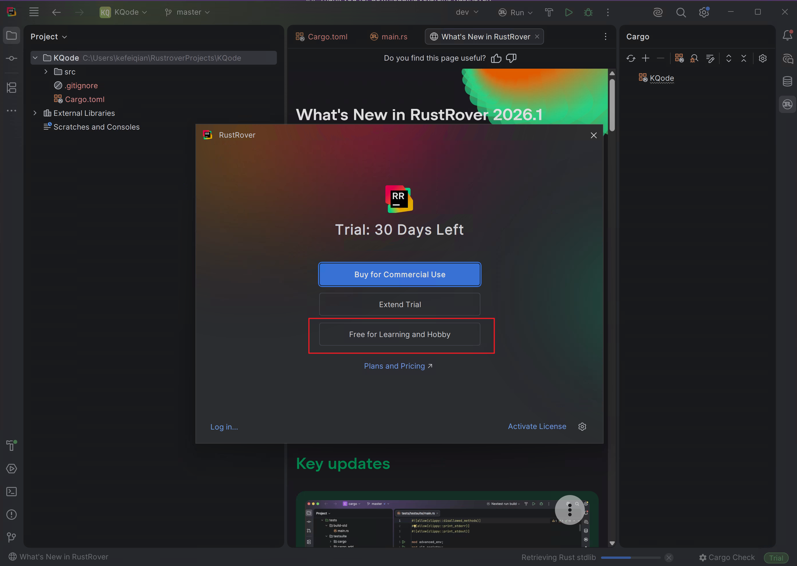
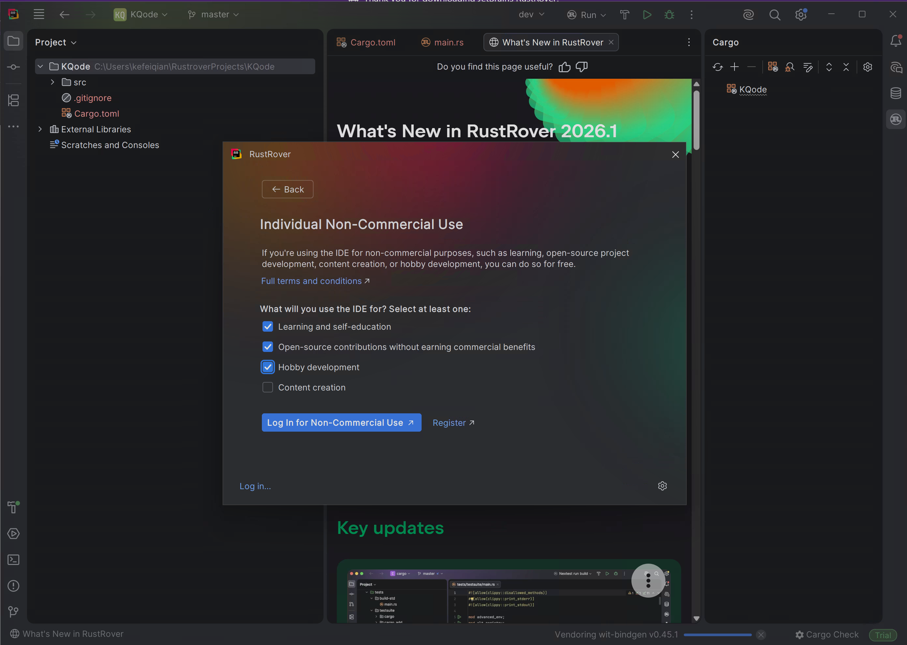
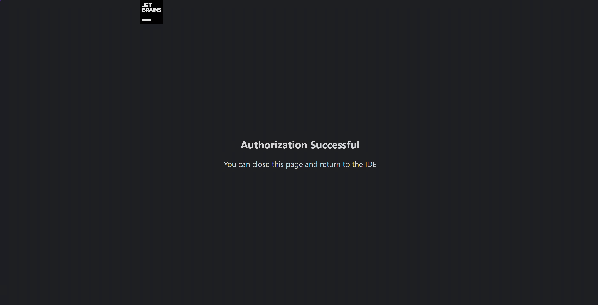
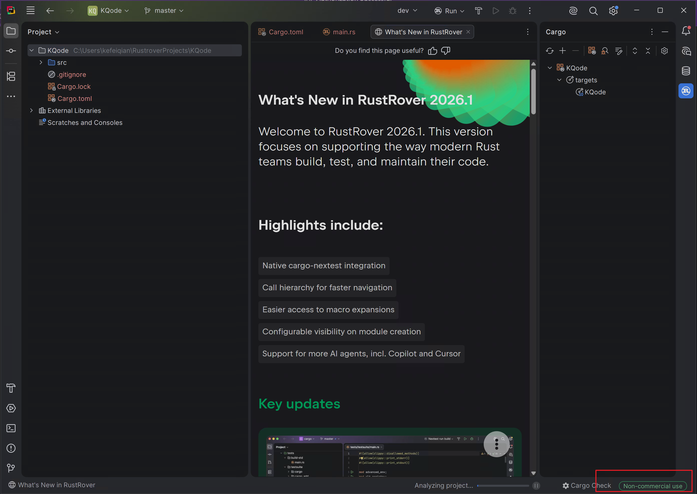

From this article onward, we officially begin developing our Coding Agent. This article first configures the RustRover IDE and creates a minimal runnable Rust project. Later, we will gradually expand this project into an agent runtime and harness.

There are two common ways to create a Rust project:

- Use the official command-line tool: `cargo new KQode`
- Use the JetBrains RustRover project wizard

Here we use RustRover. Later code writing, running, and debugging will also mainly happen in RustRover.

## 1. Install and Open RustRover

First download RustRover from the JetBrains website:

https://www.jetbrains.com/rust/download/

After installation, open RustRover. After accepting the user agreement, you will enter the welcome page. Click **New Project** in the center to create a new project.


## 2. Create the Rust Project

On the New Project page, select **Rust** on the left, then set the project location, for example:

```text
C:\Users\kefeiqian\RustroverProjects\KQode
```

If the Rust toolchain has not been installed before, **Toolchain location** will be empty and **Toolchain version** will show `N/A`. Click **Install Rustup**.



Rustup is the official recommended Rust toolchain installer. It installs `rustc`, `cargo`, the standard library, and other components required to run Rust projects.



After installation, RustRover automatically detects the toolchain path, toolchain version, and standard library path. Confirm the project template is **Binary (application)**, then click **Create**.



## 3. Choose a RustRover License

After the project is created, RustRover may show a license selection window.



Because this is for learning and research, choose **Free for Learning and Hobby**.

On the **Individual Non-Commercial Use** page, select the options that match your usage. In the screenshot, the selected options are:

- Learning and self-education
- Open-source contributions without earning commercial benefits
- Hobby development

Then click **Log In for Non-Commercial Use**.



After completing JetBrains login in the browser, the authorization success page appears. You can close the browser and return to RustRover.



Back in RustRover, you also need to agree to the non-commercial use terms. The second option is an AI feature trial; this series does not depend on RustRover AI features, so it can remain unchecked.


After clicking **Start Non-Commercial Use**, the status in the lower-right corner changes from Trial to **Non-commercial use**, which means the license is active.



## 4. Inspect the Default Project Structure

A Binary project created by RustRover contains `src/main.rs`. The default code is a minimal Hello World program:

```rust
fn main() {
    println!("Hello, world!");
}
```


## 5. Run the Project

Click the green run button on the right side of the top navigation bar. RustRover will call Cargo to compile and run the current project.


After the run completes, the Run window prints:

```text
Hello, world!
```

You can also see that the process exits with `exit code 0`, which means the Rust toolchain, project configuration, and run configuration are working correctly.


