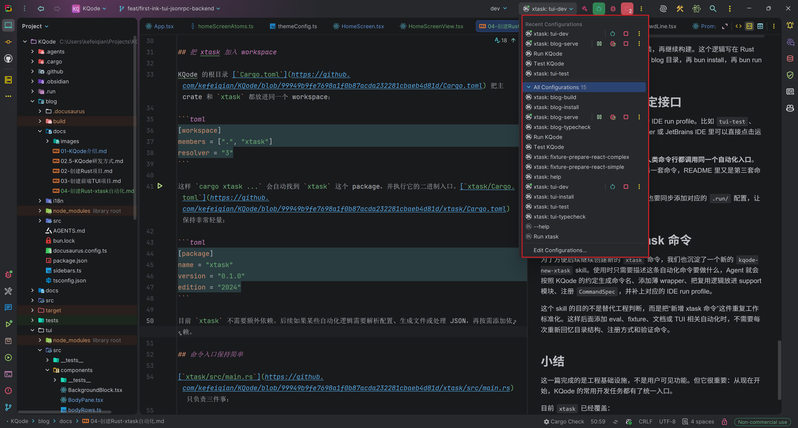

In the previous article, we created the frontend TUI project. As KQode continues to evolve, more common commands will appear during development, such as running Rust builds, installing TUI dependencies, running frontend typecheck, starting the Docusaurus Blog, and preparing test fixtures.

If these commands are scattered across README files, package scripts, IDE configurations, and CI scripts, they quickly become hard to maintain. This article creates a Rust `xtask` automation entry point to bring common engineering tasks into one place.

## What Is xtask

`xtask` is a common project automation pattern in the Rust community. It is not a fixed official Cargo command, but a convention: put a separate `xtask` crate in the workspace, then run project-specific tasks like this:

```bash
cargo xtask help
cargo xtask tui-test
cargo xtask blog-build
```

KQode follows the idea described in [matklad/cargo-xtask](https://github.com/matklad/cargo-xtask): write project maintenance scripts as a normal Rust crate, so automation logic can be modularized, tested, and refactored just like application code.

It solves the question of where project scripts should live. Compared with shell scripts, PowerShell scripts, or npm scripts, `xtask` has several benefits:

1. Rust can express cross-platform logic and reduce differences between Windows, macOS, and Linux scripts.
2. It can reuse Rust types, modules, and tests instead of hiding complex logic in one-line commands.
3. It can share the Cargo workspace with the main project, so developers only need a Rust toolchain to run it.
4. It keeps command entry points stable while allowing the underlying implementation to evolve.

For a Rust-first project like KQode, `xtask` is a good engineering automation entry point. The Rust core, TypeScript TUI, Docusaurus docs site, and future fixture/eval flows can all be coordinated through it.

## Add xtask to the Workspace

KQode's root [`Cargo.toml`](https://github.com/kefeiqian/KQode/blob/99949b9fe7698a1f0b87acda232281cbaeb4d81d/Cargo.toml) puts the main crate and `xtask` into the same workspace:

```toml
[workspace]
members = [".", "xtask"]
resolver = "3"
```

This lets `cargo xtask ...` find the `xtask` package and run its binary entry point. [`xtask/Cargo.toml`](https://github.com/kefeiqian/KQode/blob/99949b9fe7698a1f0b87acda232281cbaeb4d81d/xtask/Cargo.toml) stays very lightweight:

```toml
[package]
name = "xtask"
version = "0.1.0"
edition = "2024"
```

At this point, `xtask` does not need extra dependencies. If later automation needs to parse configuration, generate files, or handle JSON, dependencies can be added when needed.

## Keep the Command Entry Point Simple

[`xtask/src/main.rs`](https://github.com/kefeiqian/KQode/blob/99949b9fe7698a1f0b87acda232281cbaeb4d81d/xtask/src/main.rs) only does three things:

1. Find the repository root.
2. Read the command name passed by the user.
3. Dispatch the command to the `commands` module.

The simplified structure looks like this:

```rust
mod commands;
mod support;

use std::{env, process::ExitCode};

fn main() -> ExitCode {
    match run() {
        Ok(()) => ExitCode::SUCCESS,
        Err(error) => {
            eprintln!("xtask failed: {error}");
            ExitCode::FAILURE
        }
    }
}

fn run() -> Result<(), String> {
    let repo_root = support::paths::repo_root();
    let command = env::args().nth(1);

    commands::run(command.as_deref(), &repo_root)
}
```

Concrete task logic is intentionally not placed in `main.rs`. `main.rs` should remain a thin entry point, while real automation behavior lives in reusable modules. This prevents the entry file from becoming a huge `match` as more commands are added.

## Register Commands with CommandSpec

KQode's `xtask` describes each command with `CommandSpec`:

```rust
pub struct CommandSpec {
    pub name: &'static str,
    pub description: &'static str,
    pub run: fn(&Path) -> Result<(), String>,
}
```

Each command contains:

- `name`: the command name, such as `tui-test`.
- `description`: the help text shown by `cargo xtask help`.
- `run`: the function that executes the command.

Commands are then registered by group:

```rust
const COMMAND_GROUPS: &[&[CommandSpec]] = &[
    fixture::COMMANDS,
    tui::COMMANDS,
    blog::COMMANDS,
    HELP_COMMANDS,
];
```

This is easier to maintain than one long handwritten `match`. To add a command, define a `CommandSpec` in the relevant group and add it to that group's `COMMANDS` list.

To avoid duplicate command names, the `commands` module includes a small test:

```rust
#[test]
fn command_names_are_unique() {
    let mut names = HashSet::new();

    for command in all_commands() {
        assert!(
            names.insert(command.name),
            "duplicate xtask command: {}",
            command.name
        );
    }
}
```

This test is small but useful. Because `xtask` is a common team entry point, a command-name collision would immediately affect local command-line usage.

## Unify TUI and Blog Commands

KQode has two TypeScript subprojects:

- `tui/`: the Ink frontend TUI.
- `blog/`: the Docusaurus docs site.

Each directory has its own package configuration, but contributors do not need to remember the commands inside each subdirectory. The preferred entry point is `cargo xtask`:

```bash
cargo xtask tui-install
cargo xtask tui-typecheck
cargo xtask tui-test
cargo xtask tui-dev
```

```bash
cargo xtask blog-install
cargo xtask blog-typecheck
cargo xtask blog-build
cargo xtask blog-serve
cargo xtask blog-preview
```

The goal is not to hide Bun or Docusaurus, but to provide one stable entry point for the whole repository. If the underlying tool changes later, callers can keep using the same `cargo xtask ...` commands.

[`support::bun`](https://github.com/kefeiqian/KQode/blob/99949b9fe7698a1f0b87acda232281cbaeb4d81d/xtask/src/support/bun.rs) wraps Bun invocation and chooses `bun` or `bun.exe` based on the operating system:

```rust
pub fn command() -> &'static str {
    if cfg!(windows) { "bun.exe" } else { "bun" }
}
```

This is another value of `xtask`: cross-platform details live in Rust helpers instead of being scattered across docs and scripts.

## Install Dependencies Automatically

For the docs site and TUI, `xtask` can also check whether dependencies exist before running a command. For example, [`xtask/src/support/blog.rs`](https://github.com/kefeiqian/KQode/blob/99949b9fe7698a1f0b87acda232281cbaeb4d81d/xtask/src/support/blog.rs) checks whether the Docusaurus executable exists before building the blog:

```rust
fn ensure_dependencies(repo_root: &Path) -> Result<(), String> {
    let docusaurus = paths::blog_bin(repo_root, "docusaurus");

    if docusaurus.is_file() {
        Ok(())
    } else {
        println!("Blog dependencies are missing; running bun install.");
        install(repo_root)
    }
}
```

This lets a fresh checkout run:

```bash
cargo xtask blog-build
```

If dependencies are missing, `xtask` installs them first, then continues the build. Putting this logic in Rust is more reliable than asking every developer to remember "go into the blog directory, run bun install, then bun run build."

## Give IDE and CI a Stable Interface

KQode also keeps IDE run profiles for `xtask` commands. Commands such as `tui-test` and `blog-build` can be clicked directly in RustRover or JetBrains IDEs.

The principle is: **IDE, CI, docs, and human command lines should call the same automation entry point**. Avoid one command in the IDE, another command in CI, and a third command in the README.

These run profiles live in the repository root [`.run/`](https://github.com/kefeiqian/KQode/tree/99949b9fe7698a1f0b87acda232281cbaeb4d81d/.run) directory and are checked in with the code. For example, [`xtask_tui_dev.run.xml`](https://github.com/kefeiqian/KQode/blob/99949b9fe7698a1f0b87acda232281cbaeb4d81d/.run/xtask_tui_dev.run.xml) appears in RustRover as **xtask: tui-dev** and runs the same Cargo command:

```xml
<configuration default="false" name="xtask: tui-dev" type="CargoCommandRunConfiguration" factoryName="Cargo Command">
  <option name="command" value="run -p xtask -- tui-dev" />
  <option name="workingDirectory" value="file://$PROJECT_DIR$" />
  <option name="emulateTerminal" value="true" />
</configuration>
```

When starting the TUI, you can choose **xtask: tui-dev** in the IDE toolbar and click run. CI or the command line still runs `cargo xtask tui-dev`. Both paths share the same `xtask` automation.

When adding or renaming an `xtask` command, add the corresponding `.run/` configuration as well so local development remains consistent.



## Use a Skill to Create New xtask Commands

To make it easier to create new `xtask` commands later, we also created a new `kqode-new-xtask` skill. When using it, we only need to describe what the automation command should do. The Agent then follows KQode conventions to generate the command name, add a thin wrapper, put reusable logic in a support module, register the `CommandSpec`, and add the matching IDE run profile.

The purpose of this skill is not to replace engineering judgment. It standardizes the repeated work of adding an `xtask` command. Later, when adding eval, fixture, docs, or TUI automation, we do not need to rediscover the directory structure, registration pattern, and verification commands each time.

## Summary

This article completes engineering infrastructure rather than a user-visible feature. But it is important: from now on, common KQode development tasks have a unified entry point.

Currently, `xtask` covers:

- TUI dependency installation, typecheck, tests, and local development.
- Blog dependency installation, typecheck, build, dev server, and production preview.
- Fixture workspace preparation.
- Help command and command-name uniqueness tests.

As KQode continues, repeated development workflows can be accumulated into `xtask` instead of being scattered across different tools. For a Coding Agent Harness, this automation entry point will also become the foundation for future eval, replay, fixture, and CI verification.
