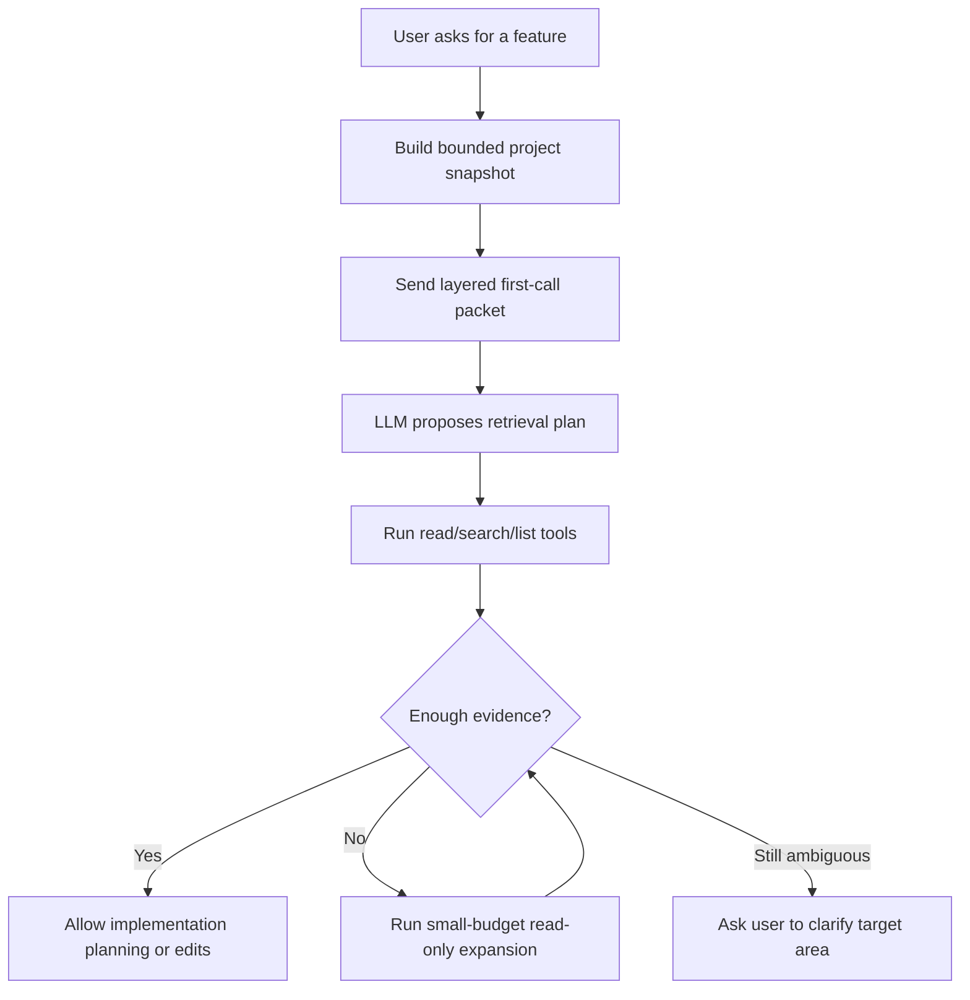

# Context-Intent Retrieval Planning

## Summary

KQode should handle code-change prompts by sending the LLM a layered first-call packet: trusted instructions, the user prompt, mode/policy/budget state, tool descriptions, and a bounded project snapshot. Full source content should enter context through read/search tool results or explicit user attachments, not through an upfront repo dump.

---

## Problem Frame

When a user asks a coding agent to add a feature to an existing repository, the agent has to decide where to look before it can safely edit. Sending the whole repository is wasteful and often impossible under context limits, but sending only tool descriptions leaves the model with too little project shape to choose useful first reads.

Reference-agent research in `docs/research/2026-06-25-prompt-intent-file-selection.md` points away from a hard intent-to-files classifier. Follow-up research in `docs/research/2026-06-25-first-prompt-payload.md` shows the first model call is usually user prompt plus instructions, tool descriptions, and bounded or explicit context, not a full repo dump. The stronger pattern is bounded context plus iterative, tool-backed discovery: infer likely areas, read/search with evidence, expand when confidence is low, and only then edit.

---

## Actors

- A1. User: asks KQode to add or modify a feature in an existing repository.
- A2. KQode context builder: assembles bounded project context before the model turn.
- A3. LLM planner: interprets the prompt, project snapshot, and tool descriptions to propose what to inspect.
- A4. KQode tool executor: performs read-only file, list, and search actions and records evidence.

---

## Key Flows

- F1. Feature-add context discovery
  - **Trigger:** A user asks KQode to add a feature to an existing repo without specifying every relevant file.
  - **Actors:** A1, A2, A3, A4
  - **Steps:** KQode builds a bounded project snapshot, sends it inside a layered first-call packet with the user prompt and tool descriptions, receives or asks for a retrieval plan or tool proposal, executes only allowed discovery, expands once within a small budget when confidence is low, and only proceeds when the relevant-file choice is evidence-backed or clarified.
  - **Outcome:** The agent can explain why the first files were read before implementation begins.
  - **Covered by:** R1, R2, R3, R4, R8, R12, R15, R16, R20

---

## Requirements

**First LLM call packet**
- R1. The first LLM call for a write-capable code-change task must be a layered packet, not a raw concatenation of repo text.
- R2. The packet must include trusted system/developer instructions, the user prompt, task mode, approval/policy posture, relevant budgets, available tool descriptions and schemas, and the bounded project snapshot.
- R3. Side-effect tool descriptions may be visible in the first call, but they must be clearly marked as gated. KQode decides whether to execute a proposed tool call.
- R4. The model may propose any action in response to the first call, but KQode must execute only actions allowed by policy, permissions, and retrieval evidence.
- R5. Project instruction files may appear as bounded summaries or excerpts with explicit precedence and trust labels. Repo-local instruction text must not override system, user, policy, or tool-safety rules.
- R6. Explicit user attachments may contribute content to the first call when allowed by policy and budget. Plain path mentions should become high-priority read hints, not automatic first-call file contents.
- R7. The first-call packet must include a response contract that asks for retrieval planning or read-only discovery before implementation side effects.

**Initial project snapshot**
- R8. When the user asks for a feature change in an existing repo, KQode must send a bounded project snapshot instead of arbitrary full-repo content.
- R9. The snapshot must include enough structure for first-pass orientation: repo metadata, detected languages or package managers, a shallow directory tree, manifest/script summaries, project instruction summaries, explicitly mentioned files or folders, active working set signals, git working-set signals, and remaining context budget.
- R10. The snapshot must not include arbitrary full source files by default. Normal code content enters the model context through explicit read/search tool results, except for explicit attachments and small instruction or manifest fragments allowed by the first-call packet rules.
- R11. Snapshot fragments must be bounded, source-cited, prioritized, token-estimated, and trust-labeled so traces can explain what context was provided and why.

**Retrieval planning**
- R12. Before implementation, the LLM must produce or enact a retrieval plan from the user prompt, project snapshot, and tool descriptions.
- R13. The retrieval plan must identify task kind, explicit path or symbol hints, likely domains, search queries, candidate files or areas, confidence, and evidence.
- R14. Candidate files or areas must be justified by at least one observable signal: prompt clues, explicit mentions, project structure, manifest/instruction hints, active working set, git state, or read/search results.
- R15. KQode must execute read-only discovery through tools and attach the resulting bounded fragments back to the model with source citations.

**Confidence and edit gating**
- R16. KQode must block implementation side effects until the retrieval plan has read or searched enough relevant context to support the first side-effect target.
- R17. When the retrieval plan is low-confidence or ambiguous, KQode must run a small-budget read-only expansion before asking the user to choose among areas.
- R18. If ambiguity remains after the expansion budget, KQode must ask the user for clarification instead of guessing silently.
- R19. Intent recognition and file selection must not directly decide edit contents; edit application remains separate behind the VFS, patch, tool, and policy loop.

**Trace and evaluation**
- R20. KQode must trace the first-call packet contents, omitted context, proposed tool calls, refused or gated executions, initial snapshot, retrieval plan, candidate-file evidence, read/search results, confidence changes, and the gate before first edit.
- R21. KQode should support deterministic golden tasks that check first-file behavior for explicit path mentions, unique basename mentions, symbol-only prompts, domain-only feature prompts, ambiguous feature prompts, misleading filename prompts, explicit attachments, and premature side-effect tool proposals.

---

## Acceptance Examples

- AE1. **Covers R1, R2, R8, R9, R10.** Given a large repo, when the user asks for a feature without naming files, KQode sends a layered first-call packet with a shallow project snapshot and tool descriptions, not a dump of arbitrary source files.
- AE2. **Covers R3, R4, R16, R19.** Given a model response that proposes an edit before any relevant file has been read or searched, KQode refuses to execute the side effect and requires evidence-backed discovery first.
- AE3. **Covers R6, R10.** Given the user explicitly attaches a file, KQode may include allowed bounded content from that attachment in the first call; given the user merely mentions a path, KQode records it as a high-priority read hint instead.
- AE4. **Covers R12, R13, R14, R15.** Given a prompt that names a symbol but not a file, when the model plans retrieval, it proposes symbol-oriented search/read steps and cites the signal that made those files plausible.
- AE5. **Covers R17, R18.** Given a prompt that could map to multiple areas, when the first retrieval plan is low-confidence, KQode runs bounded read-only expansion; if confidence is still low, it asks the user to choose or clarify.
- AE6. **Covers R5, R11, R20.** Given repo-local instruction text or manifest content, KQode marks it with source/trust metadata and traces that it was included as bounded project data, not as higher-priority policy.
- AE7. **Covers R20, R21.** Given a context-targeting golden task, when the run finishes, the trace shows why each pre-edit file was read, which proposed side effects were refused, and how the evaluator can compare that evidence against expected first-file behavior.

---

## Success Criteria

- Users can understand why KQode read the first files before editing, without trusting a black-box classifier.
- Downstream planning can implement the feature without inventing the first-call packet, retrieval-plan shape, low-confidence behavior, or edit gate.
- Golden context-targeting tasks can verify relevant first-file selection before provider-dependent behavior is optimized.
- The design stays aligned with KQode's local-first milestone path and keeps full repo maps, vector RAG, and subagents optional later capabilities.

---

## Scope Boundaries

- No whole-repo indexing, vector RAG, GraphRAG, or large upfront repo map in the first slice.
- No read-only investigator subagent or swarm behavior in the first slice.
- No automatic edit selection based solely on intent recognition.
- No arbitrary source-file contents in the first call unless explicitly attached by the user and allowed by policy.
- No TUI-specific design beyond ensuring the discovery phase can be surfaced later.
- No provider-specific prompt format as a product requirement; provider adapters can translate the same conceptual packet downstream.

---

## Key Decisions

- Use a bounded project snapshot plus tool-driven discovery rather than sending full project contents.
- Use a layered first-call packet rather than a single prompt blob.
- Show all relevant tools in the first call, including side-effect tools, but mark side-effect tools as gated and let KQode decide execution.
- Treat explicit attachments differently from path mentions: attachments may contribute content immediately, while path mentions become read hints.
- Include bounded project-instruction summaries or excerpts with precedence and trust labels.
- Let the LLM propose the retrieval plan from the snapshot and tool descriptions, while KQode executes and validates the plan through read-only tools.
- Automatically perform a small read-only expansion when confidence is low before interrupting the user.
- Treat "I can explain why these files are worth reading first" as the first product behavior, not "I already know the correct files."

---

## Dependencies / Assumptions

- KQode's first usable loop will have read, list, and search tools available before this feature is fully useful.
- Context fragments can carry source, priority, token estimate, and trace citation, consistent with the existing context-engineering requirements.
- Context fragments can also carry trust labels and precedence metadata so repo-derived text is distinguishable from trusted instructions.
- Edit gating can initially be conceptual or test-level until the VFS/patch/policy loop is implemented.
- Shallow directory trees, manifest summaries, instruction summaries, and working-set signals are cheap enough to compute deterministically for local repos.
- The first-call packet can be represented conceptually across providers even if each provider's native request shape differs.

---

## Outstanding Questions

### Deferred to Planning

- [Affects R2, R3, R7][Technical] What exact provider-neutral structure should represent the first-call packet before provider adapters translate it?
- [Affects R9][Technical] What exact shallow-tree depth, manifest fields, and token budget should the first project snapshot use?
- [Affects R13, R14][Technical] What confidence rubric should distinguish "enough evidence to read/edit" from "needs expansion"?
- [Affects R17][Technical] What is the default expansion budget: number of searches, files read, bytes, tokens, or elapsed time?
- [Affects R20, R21][Technical] What trace event names and golden-task assertions best prove first-file packet and first-file selection behavior?
