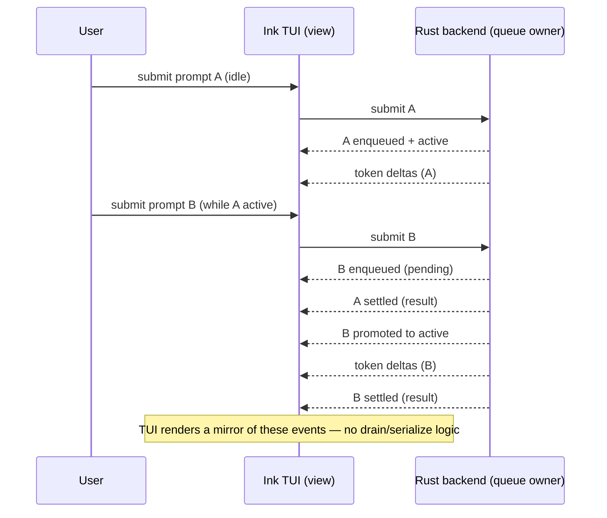

# Backend-Owned Conversation Queue & Transcript, with TUI Prompt Recall

## Summary

Move the prompt queue and conversation transcript out of the Ink TUI and into the Rust backend, so the backend serializes turns, owns the transcript, and streams queue-lifecycle + token events, while the TUI drops its `drainQueue` state machine and becomes a thin mirror that renders those events. This first pass keeps the transcript in memory (shaped to the planned `turns` records); durable persistence and `/resume` are a later additive follow-on. It also adds a TUI-owned up/down prompt-history recall so any submitted line — real prompts and unknown `/commands` — can be recalled, fixed, and resubmitted.

---

## Problem Frame

The prompt queue currently lives entirely in the TUI. `tui/src/state/promptQueue/atoms.ts` holds the queue array, assigns `active`/`queued`/`settled` states, and `drainQueue` serializes turns by awaiting each `submitStreaming` before starting the next — so the backend only ever receives one submit at a time and never sees a queue (`src/backend.rs` spawns a streaming turn per request with no serialization of its own). The TUI also owns the transcript itself (`promptQueueAtom`), result classification (`outcomeToResult` in `tui/src/libs/promptQueue/promptQueue.ts`), and injects synthetic unknown-command rows (`appendUnknownCommandAtom`).

This puts core state transitions in the view layer, which contradicts the project's own architecture direction — `AGENTS.md`: *"Core state transitions, protocol events, approvals, diffs, and trace data still belong in Rust-side services and protocols so the headless CLI and terminal UI stay consistent."* A headless or non-TUI client would today have to re-implement queueing and transcript management. Separately, unknown `/command` submissions render as transcript entries but are not recoverable — a mistyped `/hepl` cannot be recalled and fixed, because there is no prompt-history recall yet (up/down currently only move the composer caret; `tui/src/libs/composer/composerWindow.ts` leaves an explicit seam for future history traversal).

---

## Architecture

Ownership shift this milestone introduces (conceptual responsibilities, not code layout):

| Responsibility | Before (today) | After (this milestone) |
|---|---|---|
| Queue + serialization (one turn at a time) | TUI (`drainQueue`, `promptQueue` atoms) | Rust backend |
| Conversation transcript (prompts + results) | TUI (`promptQueueAtom`) | Rust backend (in-memory, `turns`-shaped) |
| Turn result classification (kind + canonical text) | TUI (`outcomeToResult`) | Rust backend |
| Streaming token deltas / terminal outcome | Rust backend → TUI | Rust backend → TUI (unchanged) |
| Transcript → rendered body rows | TUI (`queueToBodyEntries`) | TUI (unchanged; now over the mirror) |
| Unknown-command feedback | TUI transcript entry (`appendUnknownCommandAtom`) | TUI client-only notice row |
| Prompt-history recall (up/down) | — (not built) | TUI (in-memory ring) |
| Scroll / cursor / layout / theme / sanitization | TUI | TUI (unchanged) |

---

## Actors

- A1. User: Submits prompts and slash commands in the composer; recalls, edits, and resubmits prior submissions.
- A2. Ink TUI: Pure view + input layer. Submits lines, renders a read-model reconstructed from backend transcript events, renders client-only notices (unknown commands), and owns composer input ergonomics (recall ring, draft, caret).
- A3. Rust backend: Authoritative owner of the conversation queue and transcript. Serializes turns, classifies results, and streams lifecycle + token events correlated by turn id.

---

## Key Flows

- F1. Submit and stream a prompt (idle)
  - **Trigger:** User submits a prompt while no turn is active.
  - **Actors:** A1, A2, A3
  - **Steps:** TUI sends the submit → backend appends the turn, marks it active, and returns immediately → backend streams token deltas → backend settles the turn with a classified result → TUI mirrors each event into the rendered transcript.
  - **Outcome:** The prompt and its streamed result appear exactly as today; the TUI held no queue logic.
  - **Covered by:** R1, R2, R3, R4, R5, R6, R7

- F2. Submit while a turn is active (queueing)
  - **Trigger:** User submits a second prompt while one is streaming.
  - **Actors:** A1, A2, A3
  - **Steps:** TUI sends the submit → backend enqueues it as pending (renders pending) → when the active turn settles, backend promotes the pending turn to active and streams it → TUI mirrors the promotion and stream.
  - **Outcome:** Turns run strictly one at a time, ordered; the promotion is driven by the backend.
  - **Covered by:** R2, R3, R6

- F3. Unknown command
  - **Trigger:** User submits a `/command` with no registry match.
  - **Actors:** A1, A2
  - **Steps:** TUI matches the client command registry → no match → TUI renders a client-only "unknown command" notice row and appends the raw submitted text to the recall ring → nothing is sent to the backend.
  - **Outcome:** The backend transcript stays pure conversation; the mistyped command is visible and recallable.
  - **Covered by:** R10, R12, R13

- F4. Recall and fix a submission
  - **Trigger:** Caret on the composer's first line; user presses up.
  - **Actors:** A1, A2
  - **Steps:** TUI saves the current draft → replaces composer content with the previous recall entry, caret at end → user edits → resubmits (routed as a normal prompt or command).
  - **Outcome:** Any prior submission (including unknown commands) can be corrected and resubmitted.
  - **Covered by:** R13, R14, R15, R16

- F5. Clear the conversation (`/clear`)
  - **Trigger:** User runs `/clear`.
  - **Actors:** A1, A2, A3
  - **Steps:** TUI dispatches the client command → backend clears the session's conversation transcript → TUI resets local scroll. The recall ring is untouched.
  - **Outcome:** The visible conversation is cleared, but up/down still recalls previously submitted lines.
  - **Covered by:** R10, R11

---

## Requirements

**Backend-owned conversation queue and transcript**
- R1. The backend owns an ordered conversation transcript of turns for the session; each turn has a stable id, a sequence position, the submitted prompt, a lifecycle state (active / queued / settled), and, when settled, a result.
- R2. The backend serializes execution: at most one active turn at a time; additional submits are queued and promoted in submission order as the active turn settles. This is the serialization that `drainQueue` performs in the TUI today.
- R3. On submit, the backend appends the turn and returns immediately without blocking on completion; it emits lifecycle events as the turn is enqueued, becomes active, and settles.
- R4. The backend streams per-turn token deltas and a terminal outcome (completed / needs-configuration / error), correlated by turn id, as part of the transcript it owns.
- R5. The backend classifies each turn's terminal result — the result kind and any canonical user-facing message (e.g., the "needs configuration" text) — so the TUI does not compute result classification. The no-backend-available message remains a TUI concern (it is not a turn outcome).

**TUI as a thin mirror (view layer)**
- R6. The TUI holds no queue or serialization logic; it submits lines and renders a read-model reconstructed from backend transcript events.
- R7. The TUI maps the mirrored transcript to rendered body rows (its existing rendering responsibility, `queueToBodyEntries`), including live streaming text for the active turn.
- R8. The rendered body composes the mirrored backend conversation with TUI-only notice rows (see R12), ordered by time.
- R9. View-only concerns remain in the TUI: scroll offset, caret placement, layout, theme, and sanitization of displayed text.

**Slash commands and unknown-command handling**
- R10. Slash-command matching and dispatch stay client-side (the existing command registry); valid commands (`/help`, `/clear`, `/exit`) run their client effects and are not sent to the backend as prompts.
- R11. `/clear` clears the backend-owned conversation transcript for the session and resets local scroll; it does not clear the recall ring.
- R12. An unknown `/command` is not sent to the backend; the TUI renders a client-only notice and preserves the raw submitted text for recall.

**Prompt-history recall (composer)**
- R13. The TUI maintains an in-memory recall ring capturing every line submitted from the composer in order — real prompts, valid slash commands, and unknown commands — for the session.
- R14. When the caret is within the composer text, up/down move the caret as they do today; when the caret is on the composer's first line, up recalls the previous entry; when on the last line, down recalls the next entry.
- R15. Recall clamps at the oldest entry (up stops). A half-typed draft is captured when recall begins; pressing down past the newest entry restores that draft, and pressing down again stops.
- R16. A recalled entry replaces the composer content with the caret at the end of the recalled text; it can be edited and resubmitted through the normal submit path.

**Persistence-readiness (phasing)**
- R17. The backend transcript is modeled in memory shaped to the planned provisional `sessions`/`turns` records (per `docs/plans/2026-07-05-002-feat-provider-login-and-model-selection-plan.md`), so that durable writes are a purely additive follow-on rather than a reshape. This requirement is structural, not user-observable.

---

## Acceptance Examples

- AE1. Covers R2, R3. Given an idle backend, when the user submits a prompt, the turn becomes active immediately and streams; the TUI shows it as the active turn without having run any serialization logic.
- AE2. Covers R2. Given an active streaming turn, when the user submits a second prompt, it renders as pending and does not start until the first settles, after which the backend promotes it to active automatically.
- AE3. Covers R12, R13. Given the composer, when the user submits `/hepl` (no registry match), the backend receives nothing, a client-only "unknown command" notice appears, and `/hepl` is added to the recall ring.
- AE4. Covers R11. Given a transcript with settled turns, when the user runs `/clear`, the conversation transcript is cleared and scroll resets, but up-arrow still recalls previously submitted lines.
- AE5. Covers R14. Given a multi-line draft with the caret on a middle line, when the user presses up, the caret moves up one line (no recall); given the caret on the first line, pressing up recalls the previous entry.
- AE6. Covers R15. Given a half-typed draft, when the user presses up to recall and then presses down past the newest entry, the half-typed draft is restored; pressing down again does nothing.
- AE7. Covers R4, R5. Given no provider key configured, when the user submits, the backend returns a needs-configuration outcome it classified, and the TUI renders it as a themed notice without computing the message text itself.

---

## Success Criteria

- Submitting, queueing, streaming, and clearing behave exactly as they do today (no user-visible regression) while the TUI no longer contains queue or serialization logic.
- A mistyped or unknown `/command` is recoverable: the user can press up to recall it, fix it, and resubmit.
- Downstream-agent handoff: the backend runs the queue and transcript headlessly, so a non-TUI client would get identical queueing/serialization; the TUI's transcript is fully reconstructable from backend events; the in-memory transcript matches the provisional `turns` shape so durable persistence is additive.
- Maintainability signal: the TUI's `drainQueue`/active-queued-settled state machine is gone (moved to Rust) and the `promptQueue` domain atoms shrink to a mirror/read-model.

---

## Scope Boundaries

- Durable persistence — writing turns to the JSONL truth log and populating the SQLite index — is deferred to the additive follow-on (the session milestone). This pass is in-memory.
- `/resume` (loading a prior session's transcript) is out.
- Cross-session persisted prompt history and history search are out; recall is session-local this pass (future R067).
- Turn cancellation / Esc-interrupt of an in-flight turn is out.
- Reordering or editing already-queued (pending) prompts is out.
- Concurrent or parallel turns are out — execution stays strictly one-at-a-time.
- Reshaping the provisional `sessions`/`turns` schema beyond the minimal fields this migration needs is out; the later session milestone owns the final shape.
- Git status migration is already backend-owned (`kqode.git.status` → `src/git.rs`) and is not part of this work.
- Provider `/login`, `/model`, and the real status bar are a separate plan (`docs/plans/2026-07-05-002-feat-provider-login-and-model-selection-plan.md`).

---

## Key Decisions

- Backend owns the conversation queue and transcript; the TUI becomes a thin mirror. Rationale: aligns with `AGENTS.md` (core state transitions belong in Rust so the headless CLI and TUI stay consistent); the stated primary driver is maintainability.
- Phased delivery: the ownership + protocol move lands first (in-memory), with durable writes and `/resume` as an additive follow-on. Rationale: delivers the view-layer win first, hard-depends only on the session id, and decouples the protocol refactor from persistence wiring.
- Unknown commands stay fully TUI-side (client notice row + recall entry); the backend never sees them. Rationale: they are not conversation, so this keeps the backend transcript pure while still making them recoverable.
- Prompt-history recall is TUI-owned and in-memory. Rationale: only the TUI sees the full submission stream (valid and unknown commands never reach the backend), recall must be synchronous/instant (a per-keypress RPC would inject async and latency into a synchronous key handler), and recall is input ergonomics. When cross-session persistence lands later, the clean shape is backend-persists + TUI hydrates once at startup and maintains locally — never a per-keypress call.
- Result classification (result kind + canonical needs-configuration text) moves to the backend; the no-backend-available message stays TUI-side because it is a client condition, not a turn outcome.
- `/clear` clears the backend conversation transcript and local scroll, but not the recall ring — mirroring shell semantics where clearing the screen does not wipe input history.
- The client-generated turn id is retained as the turn's identity (the backend adopts it), preserving the existing before-send notification-handler correlation in `tui/src/backend/client/messageConnectionClient.ts`.

---

## Dependencies / Assumptions

- Depends on the backend-minted session id from `docs/plans/2026-07-05-001-feat-per-session-tui-and-backend-logs-plan.md` landing first — the transcript is scoped to a session. Verified not yet in code: `announce_ready` in `src/backend.rs` still sends no params.
- Reads cleanest after the SQLite foundation and provisional `sessions`/`turns` tables from `docs/plans/2026-07-05-002-feat-provider-login-and-model-selection-plan.md` land, so the in-memory transcript can be shaped to the persisted schema. Not a hard runtime dependency for this in-memory pass (verified: no `src/store/` yet).
- Assumes execution remains one-turn-at-a-time (current behavior); the migration is behavior-preserving for the conversation flow.
- Assumes the JSONL-as-truth / SQLite-as-index model (`AGENTS.md`) for the later durable follow-on.
- Accepted trade-off: because the transcript is in-memory this pass, a backend respawn (a new session per the per-session-logs plan) drops the visible transcript until durable persistence lands. Today's TUI-held queue survives a respawn.

---

## Outstanding Questions

### Resolve Before Planning

- None — the product and scope decisions were resolved in dialogue.

### Deferred to Planning

- [Affects R3, R4][Technical] The exact queue-lifecycle event set and payloads (enqueued / activated / settled / cleared) and how they extend or coexist with the current `kqode/tokenDelta`, `kqode/turnEnd`, `kqode/turnError` notifications — kept in Rust/TS lockstep (`src/protocol.rs` ↔ `tui/src/contracts/backend/messages.ts`).
- [Affects R6][Technical] Whether the TUI client models a turn as an awaitable promise (today's `submitStreaming`) or as an event subscription; removing the drain loop changes the client contract.
- [Affects R1][Technical] The minimal per-turn content fields to add on top of the provisional `turns` spine (prompt text, state, result kind, assistant text, finish reason) without over-fitting the deferred final schema.
- [Affects R13, R14][Technical] Recall ring de-duplication (consecutive duplicates), maximum size, and interaction with bracketed-paste multi-line entries (see the copy-paste plan).
- [Affects R8][Technical] How TUI-only notice rows are interleaved and ordered against mirrored backend turns in the read-model.
- [Affects R12][Needs research] Which existing tests assert unknown-command entries appear in the transcript (`appendUnknownCommandAtom`, `tui/src/state/promptQueue/__tests__`) and must move to the notice-row model.
