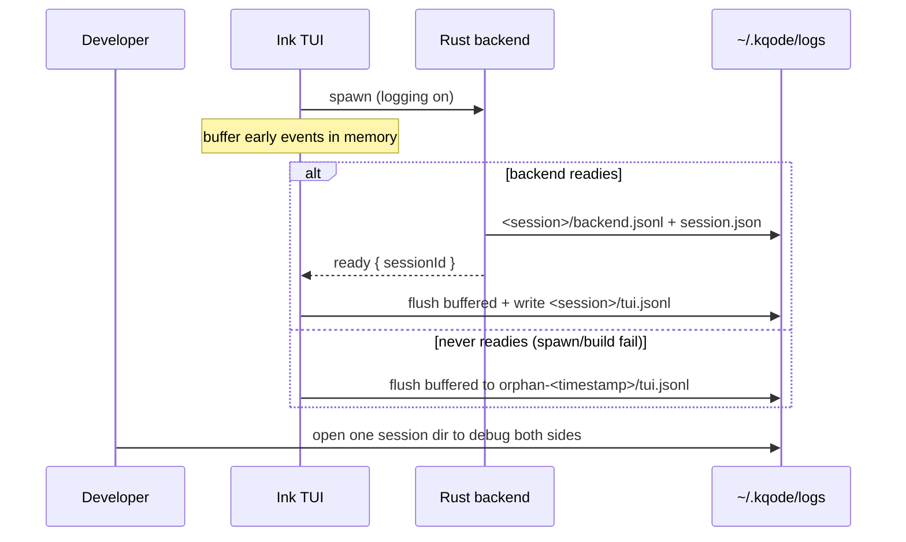

# Per-Session TUI and Backend Debug Logs

## Summary

Add TUI-side debug logging that sits alongside the existing backend transcript logging, grouped per session. On spawn the Rust backend mints a short session id, writes `backend.jsonl` under a per-session directory, and announces the id to the TUI on the readiness notification; the TUI adopts the id and writes `tui.jsonl` into the same directory. Both are gated by `KQODE_DEBUG`, ephemeral, and meant purely for debugging KQode itself.

---

## Problem Frame

KQode now logs the LLM request/response transcript on the Rust side, but the TypeScript Ink TUI logs nothing. When a failure lives on the frontend — a backend that never spawns or builds, a prompt that never starts streaming, a notification that doesn't render, queued prompts, or a crash on exit — the backend transcript alone can't explain it, and there is no record of what the TUI did or observed. Today the developer is left reproducing the issue live with no artifact to inspect afterward, and even when both sides misbehave there is no way to line up "what the UI did" against "what the server did" for the same run.

---

## Actors

- A1. Developer: launches KQode while dogfooding; reads (or zips/shares) a session directory after the fact to debug an issue.
- A2. TUI (Ink frontend): adopts the backend-announced session id and writes `tui.jsonl`.
- A3. Rust backend: owns session-id generation; writes `backend.jsonl` and the session manifest.

---

## Key Flows

- F1. Normal per-session logging
  - **Trigger:** the TUI launches (and thereby spawns) the backend with logging enabled.
  - **Actors:** A3, A2
  - **Steps:** backend spawns → generates a short session id → opens `~/.kqode/logs/<session>/backend.jsonl` and writes `session.json` → emits the readiness notification carrying the id → TUI adopts the id, flushes any buffered startup events, and writes `<session>/tui.jsonl`.
  - **Outcome:** one directory holds both sides' logs for the run, time-ordered and correlated.
  - **Covered by:** R1, R2, R4, R6, R11

- F2. Backend never readies (spawn/build failure)
  - **Trigger:** the backend fails to spawn/build or times out before sending readiness.
  - **Actors:** A2
  - **Steps:** the TUI buffers its early events in memory → no session id ever arrives → the TUI creates `~/.kqode/logs/orphan-<timestamp>/` and flushes the buffered events (including the failure) there.
  - **Outcome:** the spawn/build failure is captured even though the backend produced no id.
  - **Covered by:** R11

---

## Requirements

**Session identity & correlation**
- R1. The backend generates a short, unique, filesystem-safe session id when it spawns.
- R2. The backend communicates the session id to the TUI as part of its readiness signal (`kqode.backend.ready`), and the TUI adopts that id.
- R3. A session corresponds to one backend spawn; if the backend dies and is respawned, a new session id (and directory) begins and the TUI switches to it for subsequent events.

**Log location & format**
- R4. Both logs live in a per-session directory `~/.kqode/logs/<session>/` containing append-only `backend.jsonl` and `tui.jsonl`, each line carrying a timestamp and an event kind.
- R5. The backend log moves from today's daily-rolling file to the per-session `backend.jsonl`; a standalone/headless backend run (no TUI) self-generates a session id so it still logs.
- R6. A `session.json` manifest is written in the session directory with start time, KQode version, working directory, git repo/branch (when in a repo), OS, and active model.

**TUI capture scope**
- R7. The TUI logs backend-process lifecycle events: spawn, source-mode build, readiness, dead/crash, respawn, and dispose.
- R8. The TUI logs user actions (prompt submissions, slash commands, cancel/Esc) and prompt-queue transitions (queued → active → settled).
- R9. The TUI logs the streaming notifications it receives (`turnStart`, `tokenDelta`, `turnEnd`, `turnError`); token deltas may be coalesced or summarized to avoid noise.
- R10. The TUI logs UI-surfaced errors/warnings (backend-client errors, themed error entries) and session lifecycle (startup, terminal size, exit, exit-summary metrics).
- R11. Pre-readiness TUI events are buffered in memory and flushed to `<session>/tui.jsonl` once the id arrives; if the backend never readies, they are flushed to `orphan-<timestamp>/tui.jsonl`.

**Enablement & safety**
- R12. Both logs are gated by `KQODE_DEBUG`: on by default in dev builds, off in packaged builds, opt-in via `--debug`/`KQODE_DEBUG`; an explicit `KQODE_DEBUG=0` disables. Test harnesses set `KQODE_DEBUG=0` so tests never write to the real `~/.kqode/logs`.
- R13. Logging is file-only; nothing is written to stdout or stderr, because the TUI owns stdout for Ink rendering and the backend owns stdout for JSON-RPC framing.
- R14. Secrets are never written to either log (no API key or bearer token), consistent with the existing backend transcript logging.

---

## Acceptance Examples

- AE1. **Covers R2, R11.** Given debug logging is on, when the backend sends readiness with a session id, the TUI flushes its buffered startup events into `<session>/tui.jsonl` and continues writing there.
- AE2. **Covers R11.** Given the backend crashes before sending readiness, when the TUI stops waiting, the buffered events (including the failure) are written to `orphan-<timestamp>/tui.jsonl`.
- AE3. **Covers R3.** Given an active session, when the backend dies and is respawned, a new session id and directory begin and subsequent TUI events are written there.
- AE4. **Covers R12.** Given `KQODE_DEBUG=0`, when a full session runs, no files are created under `~/.kqode/logs`.

---

## Success Criteria

- A developer hitting a TUI-side issue (spawn/build failure, a prompt that never streamed, a notification that didn't render, a crash on exit) can open a single session directory and see both the TUI's actions and the backend's transcript, correlated and time-ordered.
- A session directory is self-describing (via `session.json`) enough to understand the run's context without parsing the logs.
- Planning can implement from this doc without inventing product behavior: the session-identity mechanism (backend-owned, announced on readiness), the file layout, the capture scope, and the gating are all decided here.

---

## Scope Boundaries

- Not wired to the planned SQLite session store, `/resume`, or replay — these are ephemeral dev logs, not the durable transcript of record.
- No in-app log viewer or TUI surface for browsing logs; reading is via the filesystem.
- No remote logging, telemetry, or upload.
- No redaction/retention/compliance controls beyond "never log secrets" (retention cleanup is a deferred planning detail, below).
- Not a replacement for the backend transcript already logged; the TUI log adds the frontend's perspective, it does not duplicate the transcript.

---

## Key Decisions

- Backend owns session-id generation and announces it on `kqode.backend.ready`: the backend is the core runtime and can open its own log immediately, avoiding env-var plumbing; this changes the currently parameterless readiness notification to carry a `sessionId` (Rust and TS in lockstep).
- Session = one backend spawn (not one TUI launch): keeps id ownership with the backend and makes respawns explicit as new sessions.
- Per-session directory over flat, session-tagged filenames: a whole session (both sides + manifest) can be read, zipped, and shared as one unit.
- Mirror the existing `KQODE_DEBUG` gating rather than adding a separate TUI toggle: one mental model for all KQode logging.
- Buffer-then-flush for pre-readiness TUI events, with an `orphan-<timestamp>` fallback: preserves the spawn/build-failure debugging that is a primary reason the logs exist.

---

## Dependencies / Assumptions

- Builds on the existing `tracing`-based backend logging and the `KQODE_DEBUG` gate / `--debug` flag already in place.
- Assumes the TUI can determine its build environment (dev vs packaged) to set the default gate, as it already does via `__DEV__`/`__PROD__`.
- Assumes the readiness notification is the agreed carrier for the session id; extending it is a small protocol change kept in lockstep across Rust and TypeScript.

---

## Outstanding Questions

### Deferred to Planning

- [Affects R4][Technical] Retention/cleanup of accumulated session directories — default to pruning to the last N sessions on startup; confirm N and the trigger during planning.
- [Affects R1][Technical] Session-id format (short UUID vs timestamp + random suffix) and filesystem-safe naming.
- [Affects R5][Technical] Backend per-session file mechanism (e.g., `tracing-appender` non-rolling vs a custom writer) and the standalone-run fallback id.
- [Affects R9][Technical] Whether to coalesce/summarize `tokenDelta` events in `tui.jsonl`, and at what granularity, to keep the log readable.
- [Affects R7, R8, R10][Technical] TUI logger mechanism (a small hand-rolled JSONL appender vs a library such as `pino`), given the file-only, Ink-owns-stdout constraint.
