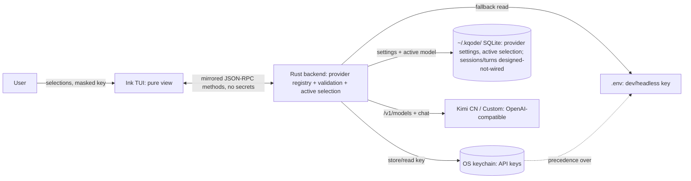

# Provider `/login`, `/model` Selection, and a Real Status Bar

## Summary

Add two backend-driven slash commands — `/login` (manage providers and their API keys) and `/model` (pick the active model from each connected provider's live model list) — and replace the hardcoded `GPT-5.5` status-bar label with the real active provider/model. All provider, credential, validation, and model-list logic lives in the Rust backend; the TUI only renders menus and forwards input. This iteration also stands up KQode's SQLite persistence foundation under `~/.kqode/`.

---

## Problem Frame

KQode can already hold a streamed Kimi conversation, but everything about *which* model and *how it is authenticated* is invisible and unmanageable from inside the TUI. The status bar always shows a hardcoded `GPT-5.5` (`tui/src/state/global/model.ts`) regardless of the real model, so it lies. The only way to supply a key is to hand-edit a workspace `.env` and restart, and when no key is present the backend returns a `needsConfiguration` outcome (`src/backend.rs`) that the TUI has no way to act on — a discoverable-looking dead end.

There is also no persistence at all in the backend beyond reading `.env`: no SQLite, no `~/.kqode/` store (`Cargo.toml` has no SQLite dependency). So even once a user could choose a provider or model, there is nowhere to remember it. An earlier provider plan (`docs/plans/2026-06-30-001-feat-llm-provider-streaming-chat-plan.md`) specced a unified `/model` wizard with SQLite-ciphertext envelope encryption, but that credential/model-selection machinery was never built — leaving the model hardcoded, credentials `.env`-only, and configuration unreachable from the UI.

---

## Actors

- A1. User: Runs `/login` and `/model`, enters/updates keys, selects a model, and submits prompts.
- A2. Ink TUI: Renders the provider/model surfaces and masked key entry, forwards input and selections, and shows the active model in the status bar. Holds no provider/model/credential logic.
- A3. Rust backend: Owns the provider registry, key storage and validation, model-list fetch, active-selection resolution, and status; resolves the active model on submit.
- A4. OS keychain: Per-machine secret store holding API keys (Windows Credential Manager / macOS Keychain / Linux Secret Service).
- A5. SQLite store (`~/.kqode/`): Indexes non-secret provider settings and the global active selection; foundation for later sessions/turns.
- A6. Provider APIs (Kimi CN / Custom): OpenAI-compatible endpoints serving `/v1/models` (validation + catalog) and chat completions (turns).

---

## Key Flows

- F1. Configure / connect a provider (`/login`)
  - **Trigger:** User runs `/login`.
  - **Actors:** A1, A2, A3, A4, A6
  - **Steps:** Backend returns the provider list with per-provider status and displayed URL → user selects a provider → enters a masked key (Custom also enters base URL + optional label) → backend stores the key in the keychain and validates it by fetching `/v1/models` → on success marks the provider connected, records non-secret settings in SQLite, and auto-selects a default model → on failure shows a themed error and does not accept the key.
  - **Outcome:** The provider is connected and immediately usable; the status bar reflects the active model.
  - **Escape path:** 401/validation failure → re-enter; network error surfaced distinctly; Esc returns to the composer.
  - **Covered by:** R1, R2, R3, R4, R5, R6, R7, R11

- F2. Select the active model (`/model`)
  - **Trigger:** User runs `/model`.
  - **Actors:** A1, A2, A3, A6
  - **Steps:** Backend fetches live models from every connected provider (grouped by provider) → TUI lists them with the active one marked → user selects one → backend sets the single global active (provider, model) and persists it in SQLite → status bar updates.
  - **Outcome:** The chosen (provider, model) is active and survives restart.
  - **Escape path:** No provider connected → route to `/login`; Esc cancels.
  - **Covered by:** R8, R9, R10, R12, R17

- F3. Submit a prompt with active-model resolution
  - **Trigger:** User submits composer text.
  - **Actors:** A1, A2, A3
  - **Steps:** Backend resolves the active (provider, model) and its key (keychain, else `.env`) → if connected, runs the streaming turn against that provider/model → if none connected, returns the needs-configuration outcome and the TUI opens `/login`.
  - **Outcome:** Turns run against the real active model; the unconfigured state routes to setup instead of a raw provider error.
  - **Covered by:** R13, R14

---

## Requirements

**Provider management (`/login`)**
- R1. Add a `/login` command that opens a backend-driven surface listing available providers, each with a backend-computed status: not-configured (no usable key) or connected (validated key present). This iteration ships two providers: Kimi CN and a single Custom provider.
- R2. Kimi CN is a preset provider with a fixed base URL (Moonshot CN); the user supplies only an API key, and the surface displays the base URL read-only.
- R3. The Custom provider requires the user to supply both a base URL and an API key, plus an optional display label; it is assumed OpenAI-compatible.
- R4. Key entry uses masked input (no plaintext echo). When a provider already has a stored key, the surface offers to replace/update it; when it has none, it prompts to add one.
- R5. On key entry, the backend validates the key by fetching the provider's OpenAI-compatible `/v1/models`; the provider is marked connected only on success. An auth failure surfaces a themed error and lets the user re-enter without marking the provider connected.
- R6. API keys are stored in the OS keychain, one entry per provider. The raw key is never written to SQLite, logs, the trace, or any protocol payload.
- R7. When a provider has no keychain key, the backend falls back to the existing `.env` source; a provider satisfied via `.env` shows as connected. Precedence is explicit: a key set via `/login` (keychain) wins over `.env`.

**Model selection (`/model`)**
- R8. Add a `/model` command that opens a backend-driven surface listing the live models from every connected provider, grouped by provider, fetched from each provider's `/v1/models`.
- R9. Selecting a model sets the single global active (provider, model) pair. No model is hardcoded anywhere.
- R10. When no provider is connected as `/model` is opened, the surface routes the user to `/login` instead of showing an empty list.
- R11. When a provider becomes connected (via `/login` or `.env`), the backend auto-selects a sensible default model for it so the user can submit immediately; `/model` lets the user change the active model later.

**Status bar and submit routing**
- R12. The status bar shows the real active (provider, model) resolved from the backend, replacing the hardcoded `GPT-5.5` label (`tui/src/state/global/model.ts`, `tui/src/components/StatusBar.tsx`). With nothing configured it shows a "not configured" state rather than a fake model.
- R13. On prompt submit, the backend resolves the active (provider, model) and its key (keychain, else `.env`); with no connected provider it returns the needs-configuration outcome and the TUI routes the user to `/login`, extending today's `needsConfiguration` path (`src/backend.rs`, `src/protocol.rs`).

**Backend ownership and protocol**
- R14. All provider, credential, validation, model-list, and active-selection logic lives in the Rust backend. The TUI is a pure view: it renders menus and forwards input/selections and holds no provider/model business logic.
- R15. Extend the TUI↔Rust JSON-RPC boundary with the request/response methods needed to list providers (status + displayed URL), set/replace a provider key (triggering validation), list aggregated models, set the active model, and read the active selection/status. Method names and payload shapes are shared constants mirrored in Rust and TypeScript per the wire-protocol and constants/enums conventions, and no secret material appears in any payload.

**Persistence foundation**
- R16. Introduce SQLite under `~/.kqode/` as KQode's persistence foundation, bootstrapped on first run, with a forward-compatible schema-migration mechanism.
- R17. Wire the tables this feature needs: non-secret provider settings (provider id, base/displayed URL, connection metadata) and the global active (provider, model) selection, so the active model survives restart.
- R18. Create the sessions and turns tables as designed-not-wired schema foundation (present in the migration, ready for a later milestone); this feature writes no session/turn rows and implements no `/resume`.

---

## Acceptance Examples

- AE1. **Covers R5.** Given the user enters a Kimi CN key in `/login`, when the backend's `/v1/models` fetch returns success, then Kimi CN is marked connected and its models appear in `/model`; when it returns an auth failure, then a themed error shows, the key is not accepted, and the provider stays not-configured.
- AE2. **Covers R6.** Given a key has been stored, when inspecting SQLite, logs, the trace, or any protocol payload, then the raw key never appears — only the OS keychain holds it.
- AE3. **Covers R7.** Given no keychain key for Kimi but a usable `KIMI_API_KEY` in `.env`, when `/login` is opened, then Kimi CN shows as connected via the `.env` fallback.
- AE4. **Covers R10.** Given no provider is connected, when the user runs `/model`, then the surface routes to `/login` rather than showing an empty model list.
- AE5. **Covers R11, R12.** Given the user has just connected a provider in `/login`, when they return to the composer, then a default model is already active and shown in the status bar, and they can submit without opening `/model`.
- AE6. **Covers R13.** Given no connected provider, when the user submits a prompt, then the backend returns the needs-configuration outcome and the TUI opens `/login` instead of showing a raw provider error.
- AE7. **Covers R9, R17.** Given the user selected a non-default model in `/model`, when KQode is restarted, then the same active (provider, model) is restored from SQLite.
- AE8. **Covers R3, R5.** Given the user configures a Custom provider whose endpoint does not expose `/v1/models`, when validation runs, then entry fails with a clear message and the provider is not connected.

---

## Success Criteria

- From a fresh install with no `.env`, a user can run `/login`, connect Kimi CN with a masked key, see a real active model in the status bar, run `/model` to switch models, and hold a conversation — with no hardcoded model anywhere.
- The API key is never observable in SQLite, logs, the trace, or protocol payloads; only the OS keychain holds it.
- The active (provider, model) selection persists across restart via SQLite.
- The TUI holds no provider/model/credential business logic — adding, removing, or swapping a provider requires backend changes only.
- `ce-plan` can implement this without inventing the provider set, the `/login`/`/model` surface behavior, the storage split (keychain vs SQLite vs `.env`), the validation rule, or the persistence-foundation boundary.

---

## Component and storage split

---

## Scope Boundaries

- Full session/turn persistence — JSONL truth log, turn writes, and `/resume` — is deferred; only the SQLite tables are created as foundation.
- OAuth/subscription sign-in (e.g., the Copilot device flow) is out; authentication is API-key only this iteration.
- Multiple custom providers are out — a single Custom slot now; a repeatable "add custom provider" is deferred.
- Providers must be OpenAI-compatible with `/v1/models`; manual model-id entry for endpoints without it is deferred.
- Editing Kimi CN's base URL is out (fixed CN endpoint); use the Custom provider to reach `moonshot.ai` international or any other endpoint.
- The earlier plan's SQLite-ciphertext envelope encryption is dropped in favor of keychain-only secret storage.
- Cost/token-usage display and richer model metadata beyond what `/v1/models` returns are out.
- Compaction, tools, diffs, approvals, and sandbox execution remain out (unchanged from prior slices).

---

## Key Decisions

- **OS keychain for API keys, `.env` as dev/headless fallback (keychain precedence):** strong at-rest security without blocking keychain-less CI, and it preserves today's `.env` behavior.
- **Validate on entry via `/v1/models`:** gives immediate connect/fail feedback and reuses the same call that populates the `/model` catalog.
- **Single global active (provider, model) over an aggregated list:** matches "select one default model," keeps the status bar unambiguous, and scales past Kimi without a per-provider-default UI.
- **Two providers — preset Kimi CN (key only) + one Custom (URL + key):** cleanly covers the CN default and any other OpenAI-compatible endpoint (including `moonshot.ai`) without an editable-URL field on Kimi.
- **Introduce SQLite now but wire only provider/settings + active selection; sessions/turns designed-not-wired:** seeds the planned index store so the later session/turn milestone extends it, without ballooning this feature into full session persistence.
- **TUI stays a pure view behind mirrored JSON-RPC methods:** keeps the headless CLI and terminal UI consistent per the architecture boundary, and makes provider changes backend-only.

---

## Dependencies / Assumptions

- Assumes Kimi/Moonshot and any Custom endpoint expose an OpenAI-compatible `GET /v1/models` reachable from the Rust backend; Kimi CN base URL is `https://api.moonshot.cn/v1` (latest URL/model ids to confirm at planning).
- Assumes a cross-platform Rust keychain integration (e.g., the `keyring` crate) for Windows Credential Manager / macOS Keychain / Linux Secret Service; environments without a secret store rely on the `.env` fallback.
- Extends the existing JSON-RPC boundary (`src/protocol.rs` ↔ `tui/src/contracts/backend/messages.ts`) and the current submit / `needsConfiguration` path (`src/backend.rs`); method names/shapes stay mirrored with serde `deny_unknown_fields` + camelCase, and payloads carry no secret material.
- The TUI spawns the backend with a hardened env allowlist that excludes provider secrets, so the `.env` fallback is read by the backend from its working directory (unchanged behavior).
- `~/.kqode/` is the established per-user home dir (already used for the packaged-backend cache); the SQLite DB lives there.
- New source files should honor the ~200-line focused-module guideline and the constants/enums-over-literals convention; new/renamed slash commands extend the existing registry (`tui/src/libs/commands/registry.ts`).

---

## Outstanding Questions

### Resolve Before Planning

- (none — product shape is resolved; the items below are technical and better answered during planning.)

### Deferred to Planning

- [Affects R6][Technical] Keychain crate choice and the typed behavior when no OS secret store is available (headless Linux/CI) beyond the `.env` fallback.
- [Affects R11][Technical] The "sensible default model" rule per provider (e.g., Kimi's recommended coding model vs the first `/v1/models` entry).
- [Affects R15][Technical] Exact JSON-RPC method names and payload shapes for the provider/model methods (mirrored Rust/TS constants).
- [Affects R16, R18][Technical] SQLite crate choice (e.g., rusqlite bundled vs sqlx), the migration/`user_version` mechanism, and the concrete sessions/turns foundation schema.
- [Affects R8][Needs research] Confirm Kimi's `/v1/models` returns usable model ids/metadata for the `/model` list, and confirm the latest CN base URL and model identifiers.
- [Affects R5][Technical] Whether validation uses `/v1/models` alone or a lighter probe, and how transient network errors are distinguished from auth failures in the surface.
