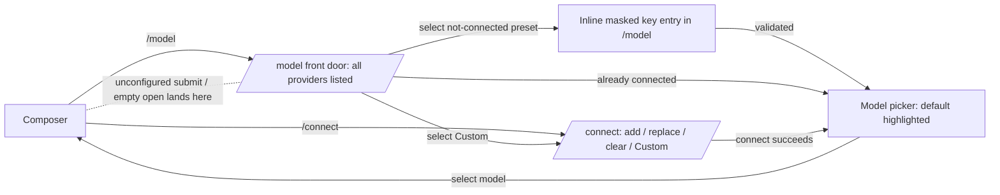

# Fuse `/login` and `/model` into One Connect→Model Loop

## Summary

Make `/model` the single front door for choosing a model: it lists every provider (connected or not), and picking a not-yet-connected one drops the user into inline key entry, then chains straight into that provider's live model list to select. Rename `/login` to `/connect` and keep it as the standalone add / replace / clear / Custom credential surface, but have it also land the user in the model picker after a successful connect. The two commands stay separate but fuse into one loop, following opencode's design.

---

## Problem Frame

KQode ships two backend-driven slash commands that a user must mentally stitch together. `/login` (`tui/src/components/LoginSurface/`) manages provider credentials; `/model` (`tui/src/components/ModelSurface/`) picks the active model. In practice they already lean on each other — `/model` auto-bounces to `/login` when nothing is connected (`openModelSurfaceAtom`, `useModelBackend.refreshModels`), and it even renders a muted `(not connected — /login to add)` row (`ModelRow.tsx`) — yet that row is inert, and after adding a key in `/login` the user is dropped back at the composer and must re-open `/model` to actually pick a model.

The result is a round-trip the user feels every time: two commands to know, and a manual hop between "add a key" and "choose a model" for what is really one intent. A new user has to discover that `/login` exists at all before `/model` becomes useful. The earlier 2026-06-30 provider plan originally envisioned a single unified `/model` wizard; the 2026-07-05 iteration split it into `/login` + `/model`, and that split is the seam this work closes.

---

## Actors

- A1. User: Runs `/model` (and `/connect`), connects a provider, and selects a model — ideally in one continuous flow.
- A2. Ink TUI: Renders the provider/model surfaces and masked key entry, owns surface navigation and the connect→model chaining, holds no credential/model business logic.
- A3. Rust backend: Owns the provider registry, key storage/validation, model-list fetch, and active-selection resolution (unchanged by this work).

---

## Key Flows

- F1. Connect-and-pick from the `/model` front door (preset provider)
  - **Trigger:** User runs `/model` with the target preset (Kimi) not connected.
  - **Actors:** A1, A2, A3
  - **Steps:** `/model` shows all providers, including the not-connected ones as selectable rows → user selects the not-connected preset → inline masked key entry appears within `/model` → backend validates the key and auto-selects a default model → that provider's models load in place and the default is highlighted → user picks a model (or accepts the default).
  - **Outcome:** Provider connected and a model selected without ever leaving `/model` or knowing `/connect` exists.
  - **Escape path:** Invalid key → themed error, provider stays not-connected, user re-enters or escapes back to the list.
  - **Covered by:** R1, R2, R3, R4, R9

- F2. Connect-and-pick for the Custom provider (deep-link)
  - **Trigger:** User selects the not-connected Custom provider from `/model`.
  - **Actors:** A1, A2, A3
  - **Steps:** `/model` deep-links into the standalone `/connect` surface → user enters base URL + optional label + masked key → on validation success `/connect` chains into the model picker.
  - **Outcome:** Custom connected and its model list shown, without embedding the multi-field secret form inside `/model`.
  - **Covered by:** R5, R7

- F3. Standalone credential management (`/connect`)
  - **Trigger:** User runs `/connect` directly.
  - **Actors:** A1, A2, A3
  - **Steps:** `/connect` lists providers with status → user adds, replaces, or clears a key, or reconfigures Custom → on a successful connect, chains into the model picker.
  - **Outcome:** Full credential management remains available; a successful add/replace flows straight into selecting a model.
  - **Covered by:** R6, R7, R11

---

## Requirements

**Front-door `/model`**
- R1. `/model` lists all providers (connected and not-connected) and no longer redirects away to the credential surface when nothing is connected; the not-connected providers appear inline as the connect entry points.
- R2. Not-connected provider rows in `/model` are keyboard-focusable and selectable (today `isFocusableModelStatus` excludes the not-connected status).
- R3. Selecting a not-connected preset provider (Kimi) starts inline masked key entry within `/model`, validated through the existing backend set-key path; an auth failure shows a themed error and leaves the provider not-connected without dropping the user out of the flow.
- R4. On a successful inline connect, the newly connected provider's models load in place and the picker highlights the auto-selected default, so the user can pick a model (or accept the default) without leaving `/model`.
- R5. Selecting the not-connected Custom provider from `/model` deep-links into the standalone `/connect` surface for base URL + optional label + key; the multi-field Custom secret form is not embedded inside `/model`.

**`/connect` surface (renamed from `/login`)**
- R6. Rename the `/login` command and its surface to `/connect`; it remains the standalone credential-management surface for add, replace, clear, and Custom base-URL/label configuration. Drop the `/login` name with no alias.
- R7. After a successful connect from the standalone `/connect` surface (or the F2 deep-link), land the user in the model picker rather than returning to the composer.
- R8. Update all user-facing wording that references `/login`: the slash-command menu, help output, and the not-connected hint (`(not connected — /login to add)` → the `/connect` equivalent).

**Routing for empty / unconfigured states**
- R9. Opening `/model` with no provider connected shows the front-door provider list with connectable rows, not a redirect to `/connect`.
- R10. On prompt submit with no connected provider, route the user to `/model`'s front door, extending today's needs-configuration path that currently opens `/login`.

**Ownership and boundaries**
- R11. Inline connect in `/model` handles only adding a key to a not-connected provider. Replace, clear, and Custom reconfiguration remain in `/connect`; connected providers in `/model` show only their models.
- R12. This is a TUI surface/routing change that reuses the existing JSON-RPC provider/model/selection methods (`kqode.provider.setKey`, `kqode.provider.models`, `kqode.selection.set`, `kqode.provider.list`); no wire-protocol methods are renamed and no new secret material appears in any payload.

---

## Acceptance Examples

- AE1. **Covers R1, R9.** Given no provider is connected, when the user opens `/model`, then it shows the provider list with the not-connected providers as selectable rows, rather than redirecting to `/connect`.
- AE2. **Covers R3, R4.** Given Kimi is not connected, when the user selects Kimi in `/model` and enters a valid key, then Kimi's models load in place with the auto-selected default highlighted, and the user can pick a model without leaving `/model`.
- AE3. **Covers R3.** Given Kimi is not connected, when the user enters an invalid key inline in `/model`, then a themed error shows, Kimi stays not-connected, and the user can re-enter or escape without the surface closing.
- AE4. **Covers R5, R7.** Given Custom is not connected, when the user selects Custom in `/model`, then they are taken to `/connect` to enter base URL + label + key, and on success they land in the model picker.
- AE5. **Covers R7.** Given the user connects a provider directly from the standalone `/connect` surface, when validation succeeds, then they land in the model picker rather than back at the composer.
- AE6. **Covers R10.** Given no connected provider, when the user submits a prompt, then the TUI opens `/model`'s front door rather than a raw provider error or the `/connect` surface.

---

## Success Criteria

- From a fresh install, a user can type `/model`, see the providers, connect one (inline for presets, or via the chained `/connect` for Custom), and pick a model — without ever needing to know a separate connect command exists.
- The manual re-open hop between "added a key" and "picked a model" is gone in both directions (inline in `/model`, and chained from `/connect`).
- `/connect` still offers full credential management (replace, clear, Custom reconfiguration) for users who go there directly.
- No secret material appears in any protocol payload, log, or the SQLite index, and no wire-protocol method is renamed (TUI-only change).
- `ce-plan` can implement this without inventing which surface owns which action, where empty/unconfigured states route, or how Custom is handled (deep-link vs inline).

---

## Loop shape

---

## Scope Boundaries

- No new providers, OAuth/device-flow sign-in, or multiple custom providers — unchanged deferrals from the 2026-07-05 iteration.
- Inline replace/clear for already-connected providers is out; it stays in `/connect`. Connected providers in `/model` show only models.
- Custom is not run inline in `/model`; it deep-links to `/connect`. Embedding the base-URL + label + key form into the model surface is out.
- No `/login` alias is retained after the rename.
- Renaming the internal Rust `crate::login` module/files is optional cosmetic cleanup and not required this iteration (the wire protocol already has no "login" concept).
- Backend protocol methods, keychain/`.env` storage, the validate-on-entry rule, default-model auto-selection, and status-bar model resolution are unchanged.

---

## Key Decisions

- **Front door is `/model`, following opencode's "picker doubles as connect entry point."** Kills the round-trip and the discoverability gap without collapsing to a single command.
- **Keep two commands: light `/model`, heavy `/connect`.** `/connect` (renamed from `/login`) retains replace/clear/Custom so the model picker stays simple; each command is an entry point into the same loop.
- **Custom deep-links to `/connect` instead of running inline.** Avoids embedding a three-step secret form (base URL + label + key) into the model surface; presets, which are key-only, connect fully inline.
- **Empty/unconfigured states land on `/model`'s front door, not `/connect`.** One consistent entry point, reinforcing the front-door model.
- **Clean rename with no `/login` alias.** Matches opencode and avoids two names for one surface.

---

## Dependencies / Assumptions

- This is a TUI-only change reusing existing backend methods. Primary anchors: `tui/src/libs/commands/registry.ts` (command rename), `tui/src/state/ui/surface/atoms.ts` (`Surface`, `openModelSurfaceAtom`, `openLoginSurfaceAtom` → connect), `tui/src/state/ui/model/providerLoads.ts` (`isFocusableModelStatus`), `tui/src/components/ModelSurface/` (front-door list, inline connect, chaining), `tui/src/components/ModelSurface/ModelRow.tsx` (not-connected hint wording), `tui/src/components/LoginSurface/` and `tui/src/state/ui/login/` (rename to connect), and the submit needs-configuration path (`tui/src/App.tsx`).
- The backend already auto-selects a default model on a successful connect, so the chained picker always opens with a working default active.
- Assumes the not-connected row can be made focusable and inline preset key entry can reuse the existing `MaskedInput` + set-key path without leaking key material into atoms (the current `useLoginBackend.submitKey` already keeps keys out of atoms).
- New/renamed TUI modules honor the ~200-line focused-module guideline and the constants/enums-over-literals convention; surface names stay mirrored across the command registry, `Surface` enum, and help content.

---

## Outstanding Questions

### Resolve Before Planning

- (none — product shape is resolved; the items below are technical and better answered during planning.)

### Deferred to Planning

- [Affects R3, R4][Technical] How inline key entry is composed within `/model` — reuse the `/connect` key step as a shared component vs a dedicated inline sub-mode — while keeping both surfaces within the ~200-line guideline.
- [Affects R5, R7][Technical] The exact deep-link + return mechanism for Custom (`/model` → `/connect` → back to picker): a surface stack vs re-opening `/model` with a "return to picker" flag, and how the existing `surfaceNavigationVersion` guard handles the chain.
- [Affects R7, R10][Technical] Whether chaining into the picker is driven by the backend outcome or purely by TUI navigation, and how the unconfigured-submit path is redirected from `/login` to the `/model` front door.
- [Affects R6][Technical] Whether to also rename the internal Rust `crate::login` module and files for consistency, or leave them as backend-internal naming.
