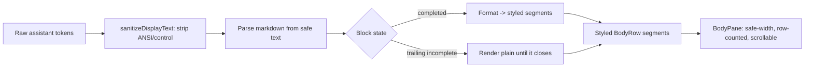

# TUI Markdown Rendering

## Summary

Render assistant transcript output as formatted terminal text instead of raw markdown — headings, emphasis, inline code, lists, blockquotes, horizontal rules, syntax-highlighted code blocks, GFM tables, and clickable links. Formatting happens live as each block finishes streaming, and the existing sanitization, safe-width, scroll, and resume guarantees are preserved. The full Rich set ships in v1 (tables and links included, not deferred).

---

## Problem Frame

Today the assistant transcript prints raw markdown source. In the attached Bayes'-theorem example the reply shows literal `**Formula**`, backtick fences wrapping `P(H|E) = P(E|H) * P(H) / P(E)`, and `- ` list markers — instead of a set-off formula block, bolded section labels, and clean bullets. Agent replies are markdown-heavy (code, tables, step lists), so this noise makes output harder to scan and undercuts the tool's polish while dogfooding KQode on itself.

The render path (`tui/src/libs/tui/bodyRows.ts` → `toAssistantRows` → `wrapBodyText`) character-wraps the raw string and paints it a single foreground color per row, with zero markdown awareness. The transcript also carries hard constraints that make naive fixes risky: a display sanitizer that rewrites ANSI/control bytes to visible `\xNN` (`tui/src/libs/text/sanitizeDisplayText.ts`), a one-color-per-row body model (`BodyRow`), a fixed-width scrollable viewport that reserves the physical final column, and token-by-token assistant streaming.

---

## Actors

- A1. TUI user: reads the assistant transcript, scrolls, copies the last response, and clicks links.
- A2. Backend agent stream: emits assistant text token-by-token and a final settled turn result.
- A3. TUI markdown renderer: sanitizes, parses, and maps assistant text to styled terminal output within the body pane.

---

## Key Flows

- F1. Live streaming render
  - **Trigger:** A2 activates a turn and streams token deltas.
  - **Actors:** A2, A3, A1
  - **Steps:** (1) A3 appends each delta to the active buffer. (2) A3 sanitizes, then parses the buffer into markdown blocks. (3) Completed blocks render formatted; the trailing incomplete block renders as plain text. (4) On each new token only the active entry re-renders — earlier committed blocks/entries are untouched. (5) On settle, A3 renders the final full markdown for the turn.
  - **Outcome:** A1 sees output that grows and formats block-by-block, with no flicker of earlier content and no jarring full-message reflow.
  - **Covered by:** R1, R12, R13, R14, R16

- F2. Resume render
  - **Trigger:** A1 resumes a prior session and historical assistant turns are hydrated.
  - **Actors:** A3, A1
  - **Steps:** (1) Hydrated assistant entries carry their stored text. (2) A3 renders each as full markdown (no streaming path).
  - **Outcome:** A resumed transcript looks identical to a freshly-rendered one.
  - **Covered by:** R1

### Rendering pipeline



---

## Requirements

**Rendering scope**
- R1. Assistant transcript output renders markdown as formatted terminal text instead of literal markdown source, for streaming (in-progress), settled (final), and resume-hydrated assistant entries.
- R2. Only assistant-authored output is markdown-rendered. User prompts, error entries, and system/status/muted entries keep their current plain rendering and styling.

**Block & inline elements**
- R3. Render block elements: headings (each level visually distinct), unordered lists, ordered lists (correct numbering), blockquotes, horizontal rules, and paragraphs (author-intended hard line breaks preserved).
- R4. Render inline elements within any block: bold, italic, bold-italic, and inline code, with the markdown markers themselves hidden. Inline styles compose (e.g., inline code inside a heading, bold inside a list item).
- R5. Nested lists render with indentation reflecting depth.

**Code blocks & syntax highlighting**
- R6. Fenced and indented code blocks render as a visually distinct block (offset background or border), preserving exact whitespace and content, without the fence markers shown and without prose-style word-wrapping of code.
- R7. Code blocks are syntax-highlighted by language: the fence language hint selects the grammar, and highlight token classes map to theme colors.
- R8. Inline code renders visually distinct from surrounding prose (distinct color and/or background), without backticks shown.

**Tables**
- R9. GFM tables render as aligned columns with visible separators/borders, respecting per-column alignment markers (left / center / right).
- R10. When a table's natural width exceeds the available safe content width, columns scale down and cells word-wrap (rows grow taller) rather than horizontally truncating or spilling into the reserved final column.

**Links**
- R11. Link text renders styled (distinct color and/or underline); on terminals that support OSC 8 hyperlinks the link is clickable, and on terminals without support it degrades to a readable `text (url)` form. Bare-URL autolinks render styled likewise.

**Streaming behavior**
- R12. During streaming, each markdown block formats as soon as it completes; the current in-progress trailing block renders as plain text until it closes, then reflows into its formatted form.
- R13. If a code fence is still open at the current end-of-stream, its content renders as code-in-progress and finalizes when the closing fence arrives or the turn settles.
- R14. Streaming rendering re-renders only the active assistant entry per token; already-committed blocks and earlier entries do not flicker or re-render.

**Layout, safety & integration**
- R15. Markdown is parsed from the already-sanitized safe text, and the renderer emits structured styled text; it never re-injects raw ANSI into the sanitized content path. Existing terminal-control safety guarantees are preserved.
- R16. Rendered markdown respects the shared safe content width and the body's row-count model, so scroll offset, the scrollbar, resize re-wrapping, and the reserved final column continue to work.
- R17. Copy-last-response yields the raw markdown source, not the rendered text.

---

## Acceptance Examples

- AE1. **Covers R12, R14.** Given a stream has emitted `## Steps` and `1. First` and more tokens are arriving for the second item, when the second item's line completes, the heading and first item show formatted while the still-arriving item stays plain until its line closes — and no earlier formatted block flickers.
- AE2. **Covers R13.** Given the active buffer contains an opened ` ```rust ` fence with code but no closing fence, when it renders it shows as code-in-progress, then becomes a finalized highlighted block once the closing ` ``` ` arrives or the turn settles.
- AE3. **Covers R9, R10.** Given a GFM table whose natural width exceeds the safe content width, when it renders, columns scale down and long cells wrap onto multiple lines within the border, and nothing spills into the reserved final column.
- AE4. **Covers R11.** Given a link `[docs](https://kqode.dev)`, when it renders on a terminal without OSC 8 support it shows as styled `docs (https://kqode.dev)`; on a supporting terminal it shows as clickable `docs`.
- AE5. **Covers R2.** Given an assistant turn fails with an error message containing `**bold**`, when the error row renders it stays in the plain error style with the markers shown literally — markdown rendering does not apply.

---

## Success Criteria

- The screenshot scenario renders cleanly: the Bayes example shows a set-off formula/code block, bolded section labels, and real bullet/numbered lists — no literal `**`, backticks, or fence markers visible anywhere.
- A code block shows language-appropriate syntax colors; a GFM table shows aligned bordered columns that fit the terminal; a link is clickable (or shows its URL) — all inside the existing scrollable body.
- Streaming a long reply formats block-by-block with no flicker of earlier content and no jarring full-message reflow when it settles.
- Existing transcript behavior (scroll, resize, resume, copy, non-assistant entries, safe-width gutter) is unchanged except for the added formatting.
- `ce-plan` can implement without inventing which elements are in scope, how streaming partials behave, how the sanitizer boundary is honored, or how rich content fits the row/width/scroll model.

---

## Scope Boundaries

- Non-assistant entries (user prompts, error, system, status, muted) are not markdown-rendered.
- Non-transcript surfaces (composer/input, login, model, memory, resume picker, help, slash menu) are out of scope.
- Render-only: no markdown authoring/editing, no re-serialization of edited content.
- Out for v1: GFM task-list checkboxes, footnotes, definition lists, raw-HTML passthrough, and math/LaTeX rendering (the Bayes formula is treated as a code/text block, not typeset math).
- Raster images / image markdown are not rendered (terminals can't display them); at most show alt text or the link.
- Runtime theme switching and per-language highlight *themes* beyond mapping to the active theme are out of scope for v1.

---

## Key Decisions

- **Structured token → styled text, not ANSI embedding.** `sanitizeDisplayText` rewrites ANSI to visible `\xNN`, so ANSI-emitting markdown libraries (marked-terminal, cli-highlight, glamour) would be neutralized. Parse to tokens and map to the TUI's native text-style props. Mirrors Gemini CLI's structured code path.
- **Sanitize-before-parse boundary.** Parse markdown from the already-sanitized text (markdown syntax chars are printable ASCII and survive sanitization). Only the trusted renderer may emit controlled escapes (e.g., OSC 8), so the untrusted-text safety guarantee is preserved.
- **Custom parser + renderer, not a drop-in.** No maintained Ink markdown component exists (`ink-markdown` is gone, `ink-table` is flaky); comparable agents write their own line/block parser. KQode follows suit.
- **Code highlighting via a structured (hast/token) highlighter** (e.g., lowlight + highlight.js) mapped to theme colors — not an ANSI highlighter.
- **Own table renderer with scale-then-wrap column fitting** (mirrors Gemini CLI's `TableRenderer`), honoring the safe content width — not `ink-table`.
- **OSC 8 links with `text (url)` fallback + capability detection** (the `terminal-link` pattern).
- **Evolve `BodyRow` from a single-color string to styled segments** so one row can carry multiple styles; `BodyPane` renders each segment as its own `Text`. The row-count model (`countBodyRows`) and per-entry width memoization are preserved for scroll/layout and streaming performance.

---

## Dependencies / Assumptions

- New TS dependencies are expected: a markdown parser/tokenizer, a structured syntax highlighter (e.g., lowlight + highlight.js), and OSC 8 link support (terminal-link / ink-link). Exact selection is a planning decision.
- Assumes the theme palette (~11 semantic colors in `ThemeColors`) is extended with, or mapped onto, syntax-highlight token classes. Runtime theming is static today (per the `bodyRows.ts` memo note).
- Assumes assistant output stays the only markdown-bearing entry kind; if error/system output later needs markdown, R2 is revisited.
- Body text is character-wrapped today; rich rendering likely needs word-aware wrapping and styled-segment width measurement (planning decision).

---

## Outstanding Questions

### Deferred to Planning

- [Affects R5][User decision] Max nested-list depth to support, and whether GFM task-list checkboxes render as glyphs. Default: render nested lists to natural depth; task-list checkboxes stay out for v1 (see Scope Boundaries).
- [Affects R7][Technical] Language-hint handling when the fence tag is missing or unknown: auto-detect vs. render plain; grammar/language set to bundle.
- [Affects R7, R8][Technical] Syntax-highlight palette: extend the theme with dedicated code-token colors vs. map token classes onto the existing semantic colors.
- [Affects R10][Technical] Table column-fit specifics (min column width, proportional scaling) and behavior at very narrow terminal widths.
- [Affects R11][Technical][Needs research] Emitting OSC 8 through Ink `Text` and measuring its width correctly (Ink/Yoga may miscount hyperlink escapes); source of terminal capability detection.
- [Affects R16][Technical] Word-aware wrapping and styled-segment width measurement to replace today's character-wrap in `bodyRows.ts`.
