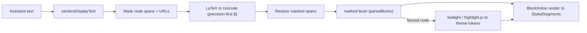

# TUI Math (LaTeX → Unicode) and Code-Block Rendering

## Summary

Add a renderer-side pass that converts LaTeX math in assistant replies into readable terminal Unicode (∇, xᵀ, α, unwrapped `\boxed`/`\frac`), and broaden the existing highlight.js/lowlight code path beyond its current seven languages. Math is approximated as text, not typeset; the stored transcript keeps the original LaTeX untouched.

---

## Problem Frame

KQode's markdown renderer (built in `docs/brainstorms/2026-07-10-tui-markdown-rendering-requirements.md`) formats headings, lists, tables, links, inline code, and syntax-highlighted code blocks — but that brainstorm explicitly deferred math: "Out for v1: … math/LaTeX rendering (the Bayes formula is treated as a code/text block)." So when a reply contains math, the raw LaTeX leaks through: a matrix-calculus derivation shows literal `$\nabla_x(x^\top Ax)$`, `\begin{aligned}`, `\boxed{...}`, `\mathrm{d}`, and bare `[` / `]` where `\[` `\]` were stripped. For a user who asks math-adjacent questions (ML, algorithms, graphics), the most visible output-quality defect is this raw LaTeX.

Two adjacent gaps compound it. The code path registers only seven languages (bash, diff, javascript, json, markdown, rust, typescript), so a `python`, `go`, or `c` block renders plain. And the same 2026-07-10 brainstorm left "grammar/language set to bundle" as an open planning question. This work resolves both.

The pipeline ordering matters and is easy to get wrong:



---

## Requirements

**Math rendering (LaTeX → Unicode)**

- R1. Convert LaTeX math embedded in assistant markdown into readable Unicode for terminal display. The conversion is display-only: the stored JSONL transcript, and any future headless/CLI surface, keep the original LaTeX untouched.
- R2. Cover the constructs common in model math output: Greek letters; operators, relations, arrows, and set/logic symbols (e.g. ∇, ⊤, ×, ·, ≤, ≥, ≈, →, ∑, ∫, ∂, √, ∞); sub/superscripts where a Unicode form exists; and structural unwrapping — `\boxed{X}`→`X`, `\mathrm{}`/`\text{}`→inner, `\frac{a}{b}`→`a/b`, and flattening `\begin{aligned}…\end{aligned}` (drop alignment `&`, honor `\\` breaks). A symbol library supplies the bulk symbol table; a thin KQode-owned layer handles structural constructs and delimiters.
- R3. Precision-first `$` detection. Display math (`$$…$$`, `\[…\]`) is always converted. Inline `$…$` is converted only when the inner text contains a LaTeX marker (`\command`, `_`, `^`) or is a single variable; otherwise it stays literal. Currency (`$5.99`, `$5 to $10`), prose, and shell variables (`$USER`, `$HOME`, `$PATH`) are never mangled.
- R4. The math conversion runs after display-text sanitization but before markdown tokenization, and masks inline-code spans and bare URLs so their contents (including `$` and backslashes) pass through verbatim.
- R5. Lossy-but-safe fallback: LaTeX the converter does not recognize is left exactly as-is — never dropped, never partially rewritten. Non-math backslash content (Windows paths, regex, unknown `\foo`) survives unchanged.
- R6. Conversion is bounded: structural regexes avoid catastrophic backtracking (e.g. single-level brace handling), and oversized inputs are capped consistently with the existing code-highlight cap (`MAX_HIGHLIGHT_CODE_UNITS`).

**Code-block highlighting (extend existing)**

- R7. Broaden the registered lowlight/highlight.js language set beyond the current seven toward highlight.js's `common` bundle (~37 languages), keeping the existing aliases, result cache, and size cap in `tui/src/libs/markdown/highlightCode.ts`.
- R8. Extend the `hljs-*` class → theme-token map in `tui/src/libs/markdown/highlightTheme.ts` so more token kinds receive color than the current ~11 classes, staying within the theme contrast gates and the existing "map onto semantic theme colors" approach.

---

## Acceptance Examples

- AE1. **Covers R2, R3.** Given assistant text `$\nabla_x (x^\top A x) = (A + A^\top)x$`, when rendered, it shows readable Unicode (∇, superscript ⊤) with no visible `$` or backslash commands.
- AE2. **Covers R2.** Given `\[ \boxed{\nabla_x (x^\top A x) = 2Ax} \]`, when rendered, the boxed content shows as unwrapped Unicode (e.g. `∇_x (x⊤ A x) = 2Ax`), not literal `\boxed{...}` or bare `[` / `]`.
- AE3. **Covers R3.** Given `It costs $5.99 total`, when rendered, the text is unchanged.
- AE4. **Covers R3.** Given `echo $USER $HOME`, when rendered, both variables stay literal.
- AE5. **Covers R3.** Given `prices range $5 to $10`, when rendered, the text is unchanged.
- AE6. **Covers R3.** Given `see $\alpha$ here`, when rendered, it shows `see α here`.
- AE7. **Covers R4.** Given an inline code span `` `$\to$` ``, when rendered, the code span shows literally `$\to$` (masked from conversion).
- AE8. **Covers R5.** Given `\alphabet` or a Windows path `C:\Users\name\docs`, when rendered, the text is unchanged (unknown-command / word-boundary safe).
- AE9. **Covers R7.** Given a ` ```python ` fenced block, when rendered, it shows language-appropriate syntax colors, whereas today it falls back to plain.

---

## Success Criteria

- The matrix-calculus screenshot scenario renders cleanly: `∇`, superscript transpose, and boxed results read as text, with no literal `$`, `\begin{aligned}`, `\boxed{}`, `\mathrm`, or bare `[` / `]` remaining.
- A normal coding transcript is untouched: `$5.99`, `$USER`/`$PATH`, and regex/backslash content never false-positive into math conversion.
- A `python`, `go`, or `c` fenced block shows syntax colors instead of plain text.
- Downstream handoff: `ce-plan` can implement without inventing the `$`-detection rule, the construct-coverage list, the pipeline ordering, the output-format constraint, or the target language set — all specified here — and deterministic golden tests mirroring the Acceptance Examples exist.

---

## Scope Boundaries

- No typeset/image math (Kitty, iTerm2, or Sixel graphics) — readable Unicode approximation only.
- No rewrite of the existing markdown renderer; headings, lists, blockquotes, tables, inline, and links stay as built in the 2026-07-10 markdown brainstorm.
- Not the full ~190 highlight.js language set (bundle bloat) — target the `common` bundle.
- Renderer-side only: no system-prompt / upstream nudge asking the model to emit Unicode math (possible later complement).
- Display-only: the headless CLI surface and the stored JSONL transcript keep raw LaTeX; no re-serialization of converted text.
- No copying or porting of Gemini CLI's `latexToUnicode` source — behavior/design reference only, independent implementation.
- Dedicated per-language code palettes and runtime highlight-theme switching remain out (inherited from the 2026-07-10 doc).

---

## Key Decisions

- **Unicode approximation over typeset images:** a terminal is a monospace cell grid and inline images are fragile in the Ink app; readable-as-text is the bar.
- **Precision-first `$` detection:** validated by Gemini CLI's shipped behavior and unit tests (`$5.99` / `$USER` preserved, `$\alpha$` / `$$…$$` converted, `\alphabet` literal); matches the coding-agent reality where `$` is usually not math.
- **Symbol library + thin owned structural/`$`-detection layer:** no JS library renders full LaTeX to terminal Unicode at this bar, so a library covers the symbol table while KQode owns structure and detection.
- **Convert after sanitization, before markdown tokenization, masking code spans + URLs:** the Gemini-proven ordering; it stops `_`/`^`/`$` inside math or code from being mis-parsed and preserves KQode's sanitize-before-parse safety boundary.
- **Structured Unicode output, never ANSI:** `sanitizeDisplayText` rewrites ANSI to visible `\xNN`, so the converter emits Unicode text mapped to theme tokens — the same constraint that made lowlight (not an ANSI highlighter) the code path.
- **Extend the existing lowlight/highlight.js path, not add a new highlighter:** KQode already uses lowlight in `highlightCode.ts`; the code work is coverage, not adoption.
- **Study, don't copy, reference implementations:** per the project's no-fork/no-vendor rule; the Gemini approach informs design only.

---

## Dependencies / Assumptions

- Integration points: the marked-based pipeline in `tui/src/libs/markdown/` (`parseBlocks.ts` → `renderBlocks.ts` / `renderInline.ts` → `StyledSegment`s) and `highlightCode.ts` (lowlight). The math pass hooks in at the sanitized-text → pre-lex boundary.
- A symbol-level LaTeX→Unicode npm library exists and outputs Unicode strings (not ANSI) — `unicodeit` (v0.7.5) is the leading candidate; `latex-to-unicode` and `unified-latex` + an owned printer are alternatives. Exact selection is a planning decision.
- Assumption: Unicode sub/superscript coverage is inherently partial; scripts with no Unicode form fall back to caret/underscore notation (validate in planning).
- Evidence base: `docs/research/2026-07-12-terminal-code-block-and-math-rendering.md`. This doc extends the deferred math item and the R7 language-set question from `docs/brainstorms/2026-07-10-tui-markdown-rendering-requirements.md`.
- Assumes assistant output remains the only markdown/math-bearing entry kind (consistent with the 2026-07-10 doc).

---

## Outstanding Questions

### Deferred to Planning

- [Affects R2][Technical] Which symbol library fits Bun/Ink with acceptable bundle size and Unicode-only output: `unicodeit`, `latex-to-unicode`, or `unified-latex` + an owned printer.
- [Affects R2][Technical] Exact structural coverage and fallbacks for `\frac`, `\boxed`, `\begin{aligned}`, matrices, and sub/superscripts beyond Unicode availability.
- [Affects R4][Technical] Exact insertion point in the pipeline and how streaming (`splitStreamingMarkdown` in `parseBlocks.ts`) interacts with a math span split across chunks, so a half-arrived `$…` is not converted prematurely.
- [Affects R7][Technical] The precise `common`-bundle language list and its bundle-size / startup impact under the packaged `kqode` binary.
- [Affects R8][Technical][Needs research] Whether to extend the theme with dedicated code-token colors or map more `hljs-*` classes onto existing semantic tokens (carried from the 2026-07-10 doc), keeping WCAG contrast gates.
