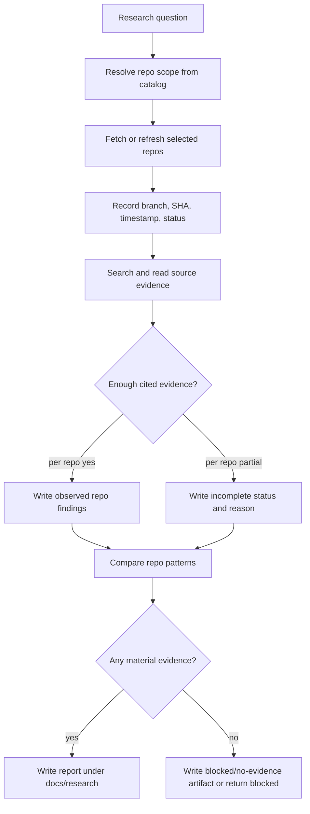

# feat: Add KQode Research Skill

## Summary

Build a local-first KQode skill package that researches coding-agent reference repositories and writes one cited Markdown report under `docs/research`. The plan covers the full origin scope while deferring deeper Rust runtime and plugin-loader integration to the broader M7/M8 platform work.

---

## Problem Frame

KQode has a reference catalog but no repeatable way to answer source-grounded research questions against those repositories. The first research question should trace what happens after a user submits a prompt, but the skill must remain reusable for other questions without becoming an ad hoc manual repo crawl.

---

## Requirements

**Skill contract**

- R1. The repository contains a local `kqode-research` skill package with a `SKILL.md` entrypoint that can be loaded once KQode's skill runtime exists (origin R1, R9).
- R2. The skill accepts a research question and optional repo scope instead of hardcoding the prompt-lifecycle investigation (origin R1, R3).
- R3. The skill defaults to the first-scope reference set from the reference catalog: Codex CLI, Aider, OpenCode, Kimi Code, Gemini CLI, and SWE-agent (origin R2).

**Research safety and evidence**

- R4. The workflow treats reference repositories as untrusted read-only evidence and does not run their code or load their project instruction files as KQode instructions (origin R5, R14).
- R5. Each analyzed repo records requested URL, resolved URL, branch, commit SHA, fetch timestamp, and status (origin R4, R7).
- R6. Material observed-behavior claims carry commit-pinned citations in the report (origin R7, R10).
- R7. Fetch, search, timeout, policy, and no-evidence failures are represented as explicit incomplete statuses rather than hidden or silently skipped (origin R8, R12).

**Report output**

- R8. The workflow writes one combined Markdown report under `docs/research` with a stable template (origin R9, R10).
- R9. Reports separate observed reference behavior, cross-repo comparison, evidence gaps, and KQode design lessons (origin R11, R13).
- R10. The prompt-lifecycle default question traces prompt ingestion, context assembly, model call, tool loop, edit/apply path, approvals or safety gates, and session or trace output when evidence exists (origin R6).

**Validation**

- R11. The implementation includes deterministic fixture scenarios for default repo selection, custom repo scoping, incomplete repo handling, citation validation, and instruction-injection safety (origin AE1-AE5).
- R12. The plan preserves KQode's no-source-copying boundary by citing and paraphrasing reference behavior rather than embedding copied source excerpts (origin R14).

---

## Key Technical Decisions

- **Skill artifact first:** Implement a local `SKILL.md` package and reference docs now, because the product runtime is still a starter Rust crate and M7 skill loading is planned but not implemented.
- **Catalog-driven defaults:** Use `docs/kqode_reference_implementations.md` as the source of truth for default and optional repo choices so the skill does not maintain a drifting duplicate list.
- **Commit-pinned evidence:** Resolve each upstream repo to a detached SHA before analysis and cite observed behavior as `repo@sha:path:Lx-Ly` so reports stay reproducible after branches move.
- **Read-only untrusted repos:** Fetch, list, search, and read reference repos only; never execute their code, install dependencies, or treat their instruction files as trusted project guidance.
- **Partial is a first-class result:** Continue when some repos fail, but block recommendations when no repo yields material evidence.
- **Report schema before automation:** Define the report structure and validation rules before adding deeper runtime integration so research outputs stay consistent across manual, skill-driven, and future eval-driven runs.

---

## High-Level Technical Design



The workflow is evidence-first. KQode lessons derive from cited observations, not from uncited impressions or copied implementation details.

---

## Output Structure

```text
.agents/
  skills/
    kqode-research/
      SKILL.md
      references/
        repo-catalog.md
        research-workflow.md
        report-template.md
        safety-and-citations.md
      tests/
        kqode-research-contract.md
        fixtures/
          catalog-first-scope.md
          report-complete.md
          report-partial.md
          report-blocked.md
docs/
  research/
    README.md
```

The tree is the expected first implementation shape. If KQode later standardizes a different skill directory, preserve the same contract and move the package rather than changing behavior.

---

## Implementation Units

### U1. Define the local skill entrypoint

- **Goal:** Add the `SKILL.md` entrypoint for the `kqode-research` workflow.
- **Requirements:** R1, R2, R3, R8, R9; supports origin F1 and F2.
- **Dependencies:** None.
- **Files:** `.agents/skills/kqode-research/SKILL.md`, `.agents/skills/kqode-research/tests/kqode-research-contract.md`.
- **Approach:** Define the skill as a reusable research workflow with inputs for research question, optional repo scope, output slug, and freshness mode. The entrypoint should route default prompt-lifecycle research through the same general workflow used by custom questions.
- **Patterns to follow:** Installed skill frontmatter shape from `ce-brainstorm` and `ce-plan`; local-first skill guidance in `docs/features/r089_skills_style_reusable_workflows.md`.
- **Test scenarios:**
  - Covers AE1. Given no custom question, the contract describes the prompt-lifecycle investigation as the default use case.
  - Covers AE2. Given a custom question and narrowed repo list, the contract keeps the narrowed scope instead of silently adding default repos.
  - Given an ambiguous research question, the contract requires one clarification question before source crawling.
  - Given an unknown repo alias, the contract requires a surfaced error with known catalog options.
- **Verification:** A reader can invoke the skill contract manually and understand what inputs it accepts, what output it writes, and when it asks for clarification.

### U2. Add catalog resolution and upstream-source policy

- **Goal:** Define how the skill maps catalog names to upstream repos and how it fetches source safely.
- **Requirements:** R3, R4, R5, R7, R12; supports origin F1, F2, and F3.
- **Dependencies:** U1.
- **Files:** `.agents/skills/kqode-research/references/repo-catalog.md`, `.agents/skills/kqode-research/references/safety-and-citations.md`, `.gitignore`, `.agents/skills/kqode-research/tests/kqode-research-contract.md`, `.agents/skills/kqode-research/tests/fixtures/catalog-first-scope.md`.
- **Approach:** Keep canonical repo IDs and URLs derived from `docs/kqode_reference_implementations.md`, with the first-scope set as the default. Specify a cache/scratch policy outside committed report artifacts, and add an ignore rule only if a repository-local cache fallback is introduced.
- **Patterns to follow:** Reference catalog scope boundaries in `docs/kqode_reference_implementations.md`; sandbox and policy posture in `.github/copilot-instructions.md`.
- **Test scenarios:**
  - Given the default repo scope, the resolver returns the first-scope repos in catalog order.
  - Given a secondary open-source repo requested by name, the resolver accepts it only when explicitly requested.
  - Given a public but non-open-source product, the resolver rejects it as a source-repo target.
  - Given a fetched repo with an agent instruction file, the workflow treats that file as evidence only and does not load it as instructions.
  - Given network permission is denied, the workflow produces a policy-blocked status instead of retrying through another channel.
- **Verification:** The catalog policy makes repo scope, cache behavior, safety constraints, and unsupported targets explicit enough for an implementer to build without inventing them.

### U3. Specify citation, confidence, and incomplete-status rules

- **Goal:** Make source evidence and partial outcomes testable.
- **Requirements:** R5, R6, R7, R9, R12; supports origin F3.
- **Dependencies:** U1, U2.
- **Files:** `.agents/skills/kqode-research/references/safety-and-citations.md`, `.agents/skills/kqode-research/tests/kqode-research-contract.md`, `.agents/skills/kqode-research/tests/fixtures/report-partial.md`, `.agents/skills/kqode-research/tests/fixtures/report-blocked.md`.
- **Approach:** Define commit-pinned citation format, material-claim citation requirements, minimal excerpt rules, and an incomplete-status taxonomy covering fetch failure, search failure, policy denial, timeout, no match, partial trace, and citation gap.
- **Patterns to follow:** Tool-result separation in `docs/kqode_architecture_spec.md`; recoverable partial outcomes in `docs/kqode_core_implementation_details.md`.
- **Test scenarios:**
  - Covers AE3. Given an observed behavior claim, the report fixture includes a commit-pinned citation.
  - Covers AE4. Given one repo fails to fetch, the report fixture includes that repo with an incomplete status and reason.
  - Given every repo fails or yields no evidence, the workflow returns blocked and avoids KQode design recommendations.
  - Given a material observed-behavior paragraph has no citation, validation fails.
  - Given a useful implementation detail appears in source, the report paraphrases the behavior and cites it without copying code.
- **Verification:** The contract defines which report states are complete, partial, blocked, and invalid.

### U4. Create the report template and research docs home

- **Goal:** Establish the durable report shape under `docs/research`.
- **Requirements:** R8, R9, R10, R11, R12; supports origin AE1, AE3, AE4, and AE5.
- **Dependencies:** U2, U3.
- **Files:** `docs/research/README.md`, `.agents/skills/kqode-research/references/report-template.md`, `.agents/skills/kqode-research/tests/fixtures/report-complete.md`, `.agents/skills/kqode-research/tests/fixtures/report-partial.md`, `.agents/skills/kqode-research/tests/fixtures/report-blocked.md`.
- **Approach:** Define a single combined Markdown report template with run metadata, selected repos, status table, per-repo observed findings, cross-repo comparison, evidence gaps, KQode lessons, and blocked/partial behavior. Include filename guidance that avoids overwriting prior reports.
- **Patterns to follow:** Durable local artifact guidance in `docs/kqode_architecture_spec.md`; Markdown rendering conventions in `.github/copilot-instructions.md` and existing docs.
- **Test scenarios:**
  - Covers AE1. Given a complete prompt-lifecycle run, the fixture includes per-repo traces and a separate KQode lessons section.
  - Covers AE3. Given current upstream analysis, the fixture records analyzed SHAs in run metadata.
  - Covers AE4. Given a partial run, the comparison labels conclusions affected by incomplete evidence.
  - Covers AE5. Given a source-cited observation, KQode lessons describe transferable behavior rather than source-copying instructions.
- **Verification:** A report author can fill the template consistently for complete, partial, and blocked runs.

### U5. Add default prompt-lifecycle research guidance

- **Goal:** Make the first use case concrete without making the skill single-purpose.
- **Requirements:** R2, R6, R9, R10, R11; supports origin F1.
- **Dependencies:** U1, U2, U3, U4.
- **Files:** `.agents/skills/kqode-research/references/research-workflow.md`, `.agents/skills/kqode-research/references/report-template.md`, `.agents/skills/kqode-research/tests/kqode-research-contract.md`.
- **Approach:** Define the prompt-lifecycle evidence checklist as the default question path while keeping the custom-question path generic. The checklist should describe what to seek, how to label not-found or not-applicable areas, and how to connect observations to KQode lessons.
- **Patterns to follow:** Agent-loop shape in `docs/kqode_architecture_spec.md`; default first-scope references in `docs/kqode_reference_implementations.md`.
- **Test scenarios:**
  - Covers AE1. Given the default prompt-lifecycle question, the checklist covers prompt ingestion, context assembly, model call, tool loop, edit/apply path, approvals or safety gates, and session or trace output.
  - Given a repo has no edit/apply path, the report marks that category not applicable rather than inventing a trace.
  - Given a repo has partial evidence for a lifecycle stage, the report records the evidence gap and confidence.
- **Verification:** The default use case can be executed from the skill docs without changing the custom-question workflow.

### U6. Link the skill into KQode's documentation surface

- **Goal:** Make the new skill discoverable without overstating runtime support.
- **Requirements:** R1, R8; supports origin R13 and R15.
- **Dependencies:** U1, U4.
- **Files:** `docs/kqode_reference_implementations.md`, `docs/research/README.md`.
- **Approach:** Add a short pointer from the reference catalog to the research workflow and explain that `docs/research` contains durable reports produced by the skill. Avoid claiming KQode can load the skill until the runtime exists.
- **Patterns to follow:** Existing docs separate first-scope implementation from later platform surfaces in `docs/kqode_build_path.md`.
- **Test scenarios:**
  - Given a reader starts at the reference catalog, they can find the research workflow and the report location.
  - Given a reader opens `docs/research/README.md`, they understand reports are durable artifacts and cloned source caches do not belong there.
  - Test expectation: no executable behavior changes; verify by documentation review and link correctness.
- **Verification:** Documentation points to the skill and report area without implying completed M7 runtime support.

---

## Scope Boundaries

### In scope

- Local skill package and supporting reference docs.
- Default first-scope repo selection.
- Combined Markdown report contract under `docs/research`.
- Deterministic contract fixtures and scenario documentation.
- Safety, citation, partial-result, and no-source-copying rules.

### Deferred to Follow-Up Work

- Rust runtime support for loading and executing local skills.
- Automated Git fetch/cache implementation inside KQode core.
- JSONL session trace emission for research runs.
- Integration with future MCP, plugin manifests, and subagent orchestration.
- Live end-to-end research against all default upstream repos.

### Out of scope

- Researching public products without open-source repositories.
- Copying, vendoring, or porting reference source code.
- Replacing KQode's evaluation runner or benchmark harness.
- Running, building, installing, or testing external reference repositories.

---

## Risks & Dependencies

- **Runtime gap:** KQode cannot yet load local skills, so the first implementation is a contract and artifact package rather than a fully integrated product runtime feature.
- **Citation drift:** Upstream branches move, so the workflow must pin SHAs before line citations are trusted.
- **Prompt-injection risk:** Reference repositories may contain agent instruction files; the safety policy must treat them as untrusted source evidence.
- **Overbroad research runs:** Six large repos can exceed context and time budgets; the workflow needs per-repo budgets and partial-status behavior.
- **Originality risk:** Research reports can accidentally overfit to reference internals; report rules must favor paraphrased observations and KQode-specific lessons.

---

## Documentation / Operational Notes

- Keep `docs/research` for durable reports only.
- Keep upstream clones, caches, and scratch files out of committed source.
- If a future implementation adds machine-readable run metadata, mirror the report metadata rather than creating a separate source of truth.

---

## Sources / Research

- Origin requirements: `docs/brainstorms/2026-06-25-kqode-research-skill-requirements.md`.
- Reference catalog: `docs/kqode_reference_implementations.md`.
- Skill roadmap: `docs/kqode_build_path.md`, `docs/kqode_platform_implementation_details.md`, `docs/features/r089_skills_style_reusable_workflows.md`.
- Safety and trace conventions: `docs/kqode_architecture_spec.md`, `docs/kqode_core_implementation_details.md`, `docs/features/r137_traces_for_prompts_model_outputs_tool_calls_approvals_context_costs_late.md`.
- Repository instructions: `.github/copilot-instructions.md`.
