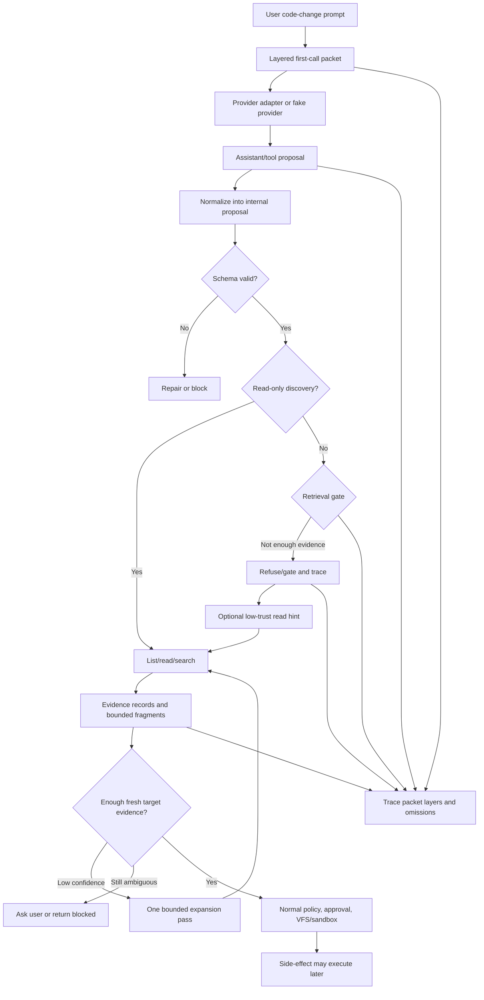

# feat: Add Context-Intent Retrieval Planning

## Summary

Build the first Rust-core slice that turns a write-capable code-change prompt into a layered first LLM call packet, bounded project snapshot, evidence-backed retrieval plan, read-only discovery loop, and side-effect gate. The implementation should establish provider-neutral contracts, traceable context fragments, visible-but-gated tool descriptions, and deterministic context-targeting evals before real-provider tuning.

---

## Problem Frame

KQode is still a starter Rust package, while the product direction calls for a Rust-first coding-agent harness. This feature is foundational because it defines what the model sees on the first turn, how KQode decides which files to read first, and how it prevents premature edits without hiding the real action space from the model.

---

## Requirements

**First LLM call packet**
- R1. For write-capable code-change tasks, KQode builds a layered first-call packet rather than concatenating repo text.
- R2. The packet contains trusted system/developer instructions, user prompt, task mode, approval/policy posture, relevant budgets, available tool descriptions/schemas, and a bounded project snapshot.
- R3. Side-effect tool descriptions are visible in the first call but clearly marked gated; KQode, not the model, decides execution.
- R4. The model may propose any action, but KQode executes only actions allowed by policy, permissions, and retrieval evidence.
- R5. Project instruction files enter as bounded summaries or excerpts with precedence and trust labels; repo-local instruction text cannot override system, user, policy, or tool-safety rules.
- R6. Explicit user attachments may contribute bounded content when policy and budget allow; plain path mentions become high-priority read hints, not automatic first-call contents.
- R7. The packet includes a response contract that asks for retrieval planning or read-only discovery before implementation side effects.

**Initial project snapshot**
- R8. KQode sends a bounded project snapshot instead of arbitrary full-repo content. For write-capable existing-repo tasks, the snapshot layer itself is mandatory even when individual fragments are omitted.
- R9. The snapshot includes repo metadata, detected languages/package managers, a shallow directory tree, manifest/script summaries, project instruction summaries, explicitly mentioned files/folders, active working-set signals, git working-set signals, and remaining context budget.
- R10. Normal source content enters model context through read/search tool results, except for explicit attachments and small instruction/manifest fragments allowed by first-call packet rules.
- R11. Snapshot fragments are bounded, source-cited, prioritized, token-estimated, trust-labeled, and traceable.

**Retrieval planning**
- R12. Before implementation, the LLM produces or enacts a retrieval plan from the user prompt, first-call packet, project snapshot, and tool descriptions.
- R13. The retrieval plan identifies task kind, explicit path or symbol hints, likely domains, search queries, candidate files/areas, confidence, and evidence.
- R14. Candidate files/areas are justified by observable signals such as prompt clues, explicit mentions, project structure, manifest or instruction hints, active working set, git state, read/search results, or refused side-effect target hints.
- R15. KQode executes read-only discovery through tools and attaches resulting bounded fragments back to the model with source citations.

**Confidence and edit gating**
- R16. KQode blocks implementation side effects until the retrieval plan has enough relevant context for the first side-effect target. Existing-file side effects require fresh read evidence or policy-approved workspace attachment evidence; search-only evidence can select candidates but cannot open the edit gate.
- R17. Low-confidence or ambiguous plans trigger one bounded read-only expansion before user clarification.
- R18. If ambiguity remains after the expansion budget, interactive runs ask the user for clarification and headless runs return a structured blocked state.
- R19. Intent recognition and file selection never decide edit contents directly; edit application remains separate behind the VFS, patch, tool, and policy loop.

**Trace and evaluation**
- R20. KQode traces first-call packet contents, omitted context, proposed tool calls, refused/gated executions, initial snapshot, retrieval plan, candidate-file evidence, read/search results, confidence changes, and the gate before first edit.
- R21. Deterministic golden tasks cover explicit path mentions, unique basename mentions, symbol-only prompts, domain-only prompts, ambiguous prompts, misleading filename prompts, explicit attachments, repo instruction trust labels, and premature side-effect proposals.

**Origin trace:** A1-A4 actors, F1 feature-add context discovery flow, and AE1-AE7 acceptance examples from the origin requirements remain authoritative for behavior and verification.

---

## Scope Boundaries

### In scope

- Minimal Rust workspace scaffolding for the protocol/contracts, core, tools, policy, session, VFS, eval, and CLI seams needed by this feature.
- Provider-neutral first-call packet contract with layer ordering, budget priority, trust labels, tool catalog, response contract, and a mandatory minimum project-snapshot orientation floor.
- Bounded project snapshot construction for local repositories.
- Explicit attachment content handling and plain path-mention read hints.
- Tool descriptions for all relevant tools, with side-effect tools visible but gated.
- Typed retrieval-plan state, confidence evaluation, expansion, clarification, and blocked states.
- Retrieval gate for all side-effect tools, not just write/patch calls.
- Trace events and deterministic fake-provider/context-targeting tests.

### Deferred to Follow-Up Work

- Full real-provider integration and provider-specific prompt formatting beyond provider-adapter conformance fixtures.
- Rich TUI panels for the "investigating relevant files" phase.
- Full repo-map, AST map, vector RAG, GraphRAG, or read-only investigator subagents.
- Full VFS patch application and approval UX beyond the retrieval gate seam.
- Persistent SQLite indexing beyond the trace/event shapes needed for this slice.
- Runtime model quality tuning after deterministic tests pass.

### Out of scope

- Copying, vendoring, or porting source from reference coding-agent projects.
- Letting retrieval planning generate or apply edit contents.
- Treating ignored, excluded, secret-looking, or untrusted files as normal prompt context.
- Requiring daemon mode or TypeScript TUI support for this first implementation.
- Including arbitrary source-file contents in the first call unless explicitly attached by the user and allowed by policy.

---

## Context & Research

### Relevant Code and Patterns

- Current implementation is a single Rust package with `Cargo.toml` and `src/main.rs`; long-lived runtime behavior should move into planned crates instead of the starter binary.
- Planned repository boundaries place protocol/event contracts in `kqode-protocol`, agent loop and state in `kqode-core`, built-in tools in `kqode-tools`, workspace access in `kqode-vfs`, policy decisions in `kqode-policy`, trace/replay in `kqode-session`, evals in `kqode-eval`, and CLI entry in `kqode-cli`. This plan keeps those crates skeletal until the vertical headless slice proves the behavior.
- The architecture spec defines the loop as context build, provider call, tool-call parse, schema validation, policy decision, VFS/sandbox execution, tool-result recording, and continuation. The model proposes actions; KQode decides what is safe to execute.
- Context must be built from bounded fragments with source, token estimate, priority, expiry or persistence, and trace citation. This plan extends that fragment contract with trust label, precedence, redaction state, and omission reason.
- Tool results must separate execution success from loop continuation with success, should-continue, summary, content, typed error, and optional display data.
- Evaluation docs reserve `context-targeting` for relevant file selection and classify failures such as `wrong_context`, `wrong_plan`, `policy_blocked`, and budget failures.

### Institutional Learnings

- `docs/research/2026-06-25-prompt-intent-file-selection.md` recommends a typed ContextIntent/retrieval-plan stage rather than a hard intent-to-files classifier.
- `docs/research/2026-06-25-first-prompt-payload.md` shows reference agents commonly send user prompt, trusted instructions, tool schemas, and bounded or explicit context on the first call, not a full repo dump.
- No `docs/solutions/` directory exists, so there are no additional institutional learning docs to carry forward.

### External References

- No new external research is needed. Local architecture docs and the two source-cited KQode research reports are sufficient for this plan's implementation shape.

---

## Key Technical Decisions

- **Minimal workspace seam first:** Convert the starter package into a small Rust workspace for the protocol, context, tools, policy, session, VFS, eval, and CLI surfaces this feature needs.
- **Provider-neutral packet contract:** Represent the first call internally before provider adapters translate it, so first-call behavior is testable without a real LLM.
- **Layered prompt over prompt blob:** Keep trusted instructions, user prompt, policy/budgets, tool catalog, snapshot fragments, attachments, and response contract as distinct layers with traceable omissions.
- **Mandatory orientation floor:** The snapshot layer cannot disappear entirely for write-capable existing-repo tasks; tight budgets preserve minimal repo metadata, detected stack, shallow structure, explicit hints, and omission metadata.
- **Trust-labeled repo data:** Repo instructions, manifests, source snippets, and tool results are data fragments with explicit precedence below trusted system/user/policy layers.
- **Attachments are not path mentions:** Explicit attachments may provide bounded content; plain path mentions are high-priority read hints until a read/search tool supplies content.
- **Visible tools, gated execution:** The first call can show side-effect tools, but every tool has capability metadata and KQode returns only retrieval eligibility, never execution authorization, before normal policy/VFS/sandbox handling.
- **Evidence opens the gate, not model confidence alone:** Existing-file side effects require fresh target-file evidence from a read or trusted workspace attachment capture; search-only evidence can select candidates but cannot open an edit gate.
- **Fail-closed sensitive content policy:** Secret-looking files, credentials, private keys, high-entropy tokens, ignored paths, binary/large uncertain content, and unsafe traces are omitted or redacted before provider, persistence, or display.
- **Trace and eval before provider quality:** Packet contents, omissions, proposed actions, refusals, evidence, and gate decisions must be traceable and covered by deterministic fake-provider tests before real-model tuning.

---

## Open Questions

### Resolved During Planning

- Which packet layers are mandatory under tight budget? Trusted instructions, user prompt, mode/policy/budget posture, minimal tool catalog, response contract, and a minimum project-snapshot orientation floor are mandatory. Extra snapshot and attachment fragments are bounded, prioritized, and droppable with trace.
- What counts as an explicit attachment? API/file-upload/explicit attach surfaces may include bounded content; plain text path mentions and `@path`-style hints do not include content by default.
- How should repo instructions be trusted? Repo-local instructions are project data with scope and precedence labels, never higher-priority policy.
- What happens when the model proposes a side effect before discovery? KQode refuses execution, traces the proposal and reason, returns recoverable context, and may convert named targets into low-trust read hints.
- Which tools are executable before the gate opens? Only read-only discovery tools needed for retrieval. Shell, git, write, patch, network, plugin, and unknown-capability tools fail closed or require later policy approval.
- Can attachment content open the gate? Only when it is a workspace-derived attachment captured through the same workspace access policy with canonical identity and freshness metadata; pasted or external attachment content is orientation only.
- How does headless ambiguity behave? It returns a structured `user_clarification_needed` blocked result instead of waiting for input.
- What fixture budgets anchor the first slice? Use an explicit test budget profile, such as shallow tree depth 2, attachment/read fragment cap around 64 KiB per item, search hit cap around 50, read range cap around 200 lines, one expansion phase with a small fixed search/read/token/time budget, and deterministic token estimates. Production tuning can change later without weakening fixture assertions.

### Deferred to Implementation

- Production token-estimation heuristics for each packet layer and fragment type beyond the deterministic fixture profile.
- Exact manifest fields for each detected language or package manager.
- Production generated-file, binary-file, large-file, and secret-redaction thresholds beyond the minimum fail-closed defaults.
- Exact provider prompt wording for the retrieval-plan response contract.
- Exact trace event names, as long as they preserve the required semantics.
- Exact syntax for user attachment references in future TUI/API surfaces.

---

## Boundary Contracts and Dependency Direction

The first slice should avoid crate cycles by making `kqode-protocol` the shared contract layer and following a concrete dependency direction:

```text
kqode-protocol
  -> kqode-vfs
  -> kqode-tools
  -> kqode-policy
  -> kqode-session
  -> kqode-core
  -> kqode-cli
  -> kqode-eval
```

The arrows describe "may depend on earlier layers" rather than strict runtime call order. Domain crates should not import each other mutually.

- `kqode-protocol`: provider-neutral first-call packet, context fragment, tool catalog metadata, tool proposal, evidence record, gate decision, and trace payload shapes.
- `kqode-core`: orchestration/state machine; owns packet assembly, retrieval state, working set, and fake-provider loop tests.
- `kqode-tools`: concrete read/list/search tool implementations and all relevant tool descriptions/capability metadata.
- `kqode-vfs`: workspace identity, canonical path handling, ignore/trust checks, file freshness, and safe reads.
- `kqode-policy`: retrieval-gate decisions and side-effect capability enforcement.
- `kqode-session`: append-only trace event recording and replayable event payload storage.
- `kqode-eval`: deterministic context-targeting fixtures and assertions.
- `kqode-cli`: thin headless/demo wrapper that wires crates together.

`kqode-core` may define temporary fake-provider traits/fixtures for deterministic tests. `kqode-eval` may depend on the harness pieces it needs for fixture execution, but it should not become a runtime dependency of the CLI/core loop. Real provider adapters remain deferred, but provider-adapter conformance fixtures should prove that packet layers, trust labels, gated metadata, response contracts, and omissions survive serialization and parsing.

---

## Dependencies / Prerequisites

- **Workspace metadata:** root `Cargo.toml` should become a workspace with `crates/kqode-cli` as a default member and a `kqode` binary target so existing root `cargo build`, `cargo run`, and `cargo test` workflows remain intuitive.
- **Serialization and errors:** choose minimal Rust dependencies for schema-like protocol types, JSON trace fixtures, and typed errors instead of hand-rolled ad hoc payloads.
- **Fixture support:** use small test helpers for temporary workspaces, fixture repositories, and assertion ergonomics so context-targeting tests stay deterministic.
- **Workspace scanning:** prefer simple, bounded standard-library traversal first; introduce walking/search/ignore crates only when they reduce risk versus custom logic.
- **Git metadata:** use controlled, no-alias/no-hook git metadata collection or make git signals optional with traced omission when git is unavailable.

---

## Output Structure

```text
crates/
  kqode-cli/
    Cargo.toml
    src/main.rs
    tests/context_intent_cli.rs
  kqode-protocol/
    Cargo.toml
    src/lib.rs
    src/context.rs
    src/first_call.rs
    src/tools.rs
    src/trace.rs
  kqode-core/
    Cargo.toml
    src/lib.rs
    src/agent_loop.rs
    src/fake_provider.rs
    src/first_call_packet.rs
    src/project_snapshot.rs
    src/retrieval.rs
    src/working_set.rs
    tests/first_call_packet.rs
    tests/project_snapshot.rs
    tests/retrieval_planning.rs
    tests/retrieval_loop.rs
  kqode-tools/
    Cargo.toml
    src/lib.rs
    src/registry.rs
    src/fs_tools.rs
    tests/tool_catalog.rs
    tests/read_search_tools.rs
  kqode-vfs/
    Cargo.toml
    src/lib.rs
    src/workspace.rs
    tests/workspace_access.rs
  kqode-policy/
    Cargo.toml
    src/lib.rs
    src/retrieval_gate.rs
    tests/retrieval_gate.rs
  kqode-session/
    Cargo.toml
    src/lib.rs
    src/trace.rs
    tests/retrieval_trace.rs
  kqode-eval/
    Cargo.toml
    src/lib.rs
    src/context_targeting.rs
    tests/context_targeting.rs
    tests/fixtures/context_targeting/
```

This tree is the expected first implementation shape. The implementing agent may adjust exact module names if Rust ergonomics demand it, but should preserve the dependency direction and crate responsibilities.

---

## High-Level Technical Design

> *This illustrates the intended approach and is directional guidance for review, not implementation specification. The implementing agent should treat it as context, not code to reproduce.*



The state machine should remain explicit: packet built, packet budget exhausted, proposal received, proposal malformed, proposal gated/refused, proposal converted to read hint, discovering, evidence evaluated, expanding, clarification needed, gate open, blocked, or cancelled.

---

## Implementation Units

### U1. Establish the minimal Rust workspace seams

**Goal:** Convert the starter package into a workspace with the minimum crates needed for context-intent retrieval planning.

**Requirements:** R1, R2, R3, R4, R19; supports the origin success criterion that planning can implement without inventing runtime boundaries.

**Dependencies:** None.

**Files:**
- Modify: `Cargo.toml`
- Move/replace: `src/main.rs`
- Create: `crates/kqode-cli/Cargo.toml`
- Create: `crates/kqode-cli/src/main.rs`
- Create: `crates/kqode-protocol/Cargo.toml`
- Create: `crates/kqode-protocol/src/lib.rs`
- Create: `crates/kqode-core/Cargo.toml`
- Create: `crates/kqode-core/src/lib.rs`
- Create: `crates/kqode-tools/Cargo.toml`
- Create: `crates/kqode-tools/src/lib.rs`
- Create: `crates/kqode-vfs/Cargo.toml`
- Create: `crates/kqode-vfs/src/lib.rs`
- Create: `crates/kqode-policy/Cargo.toml`
- Create: `crates/kqode-policy/src/lib.rs`
- Create: `crates/kqode-session/Cargo.toml`
- Create: `crates/kqode-session/src/lib.rs`
- Create: `crates/kqode-eval/Cargo.toml`
- Create: `crates/kqode-eval/src/lib.rs`

**Approach:**
- Keep the workspace minimal and buildable with empty or small library surfaces.
- Make `kqode-cli` the binary crate and keep runtime logic in library crates.
- Add `kqode-protocol` as the shared type contract layer to avoid cycles between core, tools, policy, session, and eval.
- Preserve root `cargo build`, `cargo run`, and `cargo test` workflows by setting default workspace members and the CLI binary name deliberately.
- Add only skeletal non-core crates at this stage; concrete behavior should land through the vertical packet/discovery/gate path rather than standalone abstractions.
- Avoid introducing real provider, TUI, MCP, or daemon scaffolding in this unit.

**Patterns to follow:**
- Planned repository shape in `docs/kqode_architecture_spec.md`.
- Milestone order in `docs/kqode_build_path.md`.

**Test scenarios:**
- Test expectation: none -- this unit is structural scaffolding. Verification is that the workspace builds and later units add behavior-bearing tests.

**Verification:**
- The workspace compiles with the new crate boundaries and the CLI binary remains the only entrypoint.

### U9. Define the provider-neutral first-call packet

**Goal:** Represent the layered first LLM call packet as a provider-neutral contract before provider adapters translate it.

**Requirements:** R1, R2, R3, R4, R5, R6, R7, R20; covers origin AE1, AE3, and AE6; supports the AE2 prerequisite that side-effect tools are visible but gated.

**Dependencies:** U1.

**Files:**
- Create: `crates/kqode-protocol/src/first_call.rs`
- Create: `crates/kqode-protocol/src/context.rs`
- Create: `crates/kqode-protocol/src/tools.rs`
- Create: `crates/kqode-core/src/first_call_packet.rs`
- Create: `crates/kqode-core/tests/first_call_packet.rs`
- Modify: `crates/kqode-protocol/src/lib.rs`
- Modify: `crates/kqode-core/src/lib.rs`

**Approach:**
- Model the first-call packet contract as ordered layers: trusted instructions, user prompt, runtime state, tool catalog, bounded project snapshot, explicit attachments, path mention hints, and response contract.
- Keep U9 contract-focused. Packet integration with real snapshot/workspace/redaction behavior happens after U2 and U3 wire the supporting surfaces.
- Preserve mandatory layers under tight budget: trusted instructions, user prompt, mode/policy/budget posture, minimal tool catalog, response contract, and a minimum project-snapshot orientation floor.
- Mark side-effect tools as visible but gated in the packet metadata; execution decisions remain internal.
- Treat explicit attachment content and path mentions as separate packet inputs. Attachments may include bounded content; path mentions become hints.
- Define attachment provenance as part of the protocol. Only VFS-captured same-session workspace attachments with canonical path, workspace-root identity, freshness metadata, and policy decision IDs can later count as gate evidence.
- Include trust label, precedence, redaction state, fragment kind, and omission reason in packet fragments.
- Trace packet layer summaries, omissions, and budget decisions without recording raw sensitive content.

**Patterns to follow:**
- First-prompt payload research in `docs/research/2026-06-25-first-prompt-payload.md`.
- Context fragment rules in `docs/kqode_architecture_spec.md`.

**Test scenarios:**
- Covers AE1. Given a large repo and a feature prompt, the first-call packet contains required layers and a bounded snapshot but no arbitrary source dump.
- Supports AE2 prerequisite. Given side-effect tool descriptions are included, the packet marks them gated and does not imply execution permission.
- Covers AE3. Given an explicit attachment, allowed bounded content appears as attachment data; given a plain path mention, only a read hint appears.
- Covers AE6. Given repo instruction content, the packet includes it as lower-precedence project data with trust labels, not as system/developer instructions.
- Edge case: given a tight budget, optional snapshot or attachment fragments are omitted with omission metadata while the snapshot orientation floor remains.
- Error path: given secret-looking attachment metadata, the packet records omission/redaction state and traces the policy reason without exposing the secret.

**Verification:**
- A fake provider can inspect the first-call packet contract and assert layer presence, trust labels, gated tool metadata, attachment provenance, and omissions without a real LLM.

### U2. Define bounded context fragments and project snapshot building

**Goal:** Build the deterministic project snapshot packet that orients the LLM without sending arbitrary source files.

**Requirements:** R5, R6, R8, R9, R10, R11, R20; covers origin AE1, AE3, and AE6.

**Dependencies:** U1, U9.

**Files:**
- Create: `crates/kqode-core/src/project_snapshot.rs`
- Create: `crates/kqode-core/src/working_set.rs`
- Create: `crates/kqode-core/tests/project_snapshot.rs`
- Create: `crates/kqode-vfs/src/workspace.rs`
- Create: `crates/kqode-vfs/tests/workspace_access.rs`
- Modify: `crates/kqode-protocol/src/context.rs`
- Modify: `crates/kqode-core/src/lib.rs`
- Modify: `crates/kqode-vfs/src/lib.rs`

**Approach:**
- Define bounded context fragments with source, priority, token estimate, expiry/persistence, trace citation, trust label, precedence, fragment kind, redaction state, and omission reason.
- Build snapshots from deterministic local signals: repo metadata, language/package-manager detection, shallow tree, manifests/scripts, project instruction summaries, explicit path/folder hints, active working set, git working set, and remaining context budget.
- Provide a minimal working-set contract here so snapshots can include empty or known mentioned/attached/read hints before U6 wires full tracking.
- Summarize or excerpt project instruction files as repo-derived project data with scope and precedence below trusted/system/user/policy layers.
- Apply a stable priority order when snapshot budget is tight while preserving the snapshot orientation floor: repo identity, detected stack, shallow structure, explicit hints, and omission metadata.
- Route path handling through workspace access so snapshot, read, search, and attachment capture share path normalization, canonical identity, safe-open/verify-after-open behavior, symlink/reparse handling, ignore/trust checks, Windows special-path rejection, and redaction.
- Apply minimum fail-closed redaction defaults for dotenv files, private keys, cloud/SSH/npm/pypi credentials, high-entropy tokens, ignored paths, and uncertain binary/large content before provider, trace, or display inclusion.

**Patterns to follow:**
- Context system in `docs/kqode_architecture_spec.md`.
- Context-engineering requirements in `docs/features/r028_project_instructions_through_agents_md_gemini_md_clinerules_and_similar.md`, `docs/features/r030_file_folder_error_screenshot_url_issue_and_inline_comment_context_attach.md`, `docs/features/r031_targeted_file_reads_and_workspace_search_instead_of_whole_repo_indexing.md`, and `docs/features/r033_context_engineering_with_active_working_set_tracking.md`.

**Test scenarios:**
- Covers AE1. Given a repository with many source files, snapshot building includes structure and summaries but not arbitrary source contents.
- Covers AE3. Given a plain path mention, snapshot building records it as a high-priority hint without file content.
- Covers AE6. Given repo-local instruction text, snapshot building marks it as project data with trust and precedence metadata.
- Happy path: given a very tight budget, snapshot building still emits the minimum orientation floor.
- Happy path: given a Rust repository with `Cargo.toml`, snapshot detection includes Rust/package-manager metadata and manifest/script summary fragments.
- Edge case: given a tight context budget, lower-priority tree entries are omitted with traceable omission metadata.
- Error path: given a path outside the workspace root, snapshot path normalization rejects it before it can become a fragment.
- Error path: given ignored, secret-looking, binary, or untrusted paths, snapshot generation excludes or redacts them and records the omission.
- Integration: symlink, junction/reparse, case-variant, alternate data stream/device/UNC, hardlink/alias, and traversal paths resolve or reject through canonical workspace identities before evidence or packet fragments are created.

**Verification:**
- A snapshot is deterministic for the same repo state and contains only bounded, source-cited, trust-labeled fragments.

### U3. Add the tool catalog and read-only discovery tools

**Goal:** Provide the first-call tool catalog plus the read/list/search tools that retrieval planning can execute before side effects.

**Requirements:** R2, R3, R4, R7, R12, R15, R16, R19, R20; covers origin AE4 and supports the AE2 prerequisite that side-effect tools are visible but gated.

**Dependencies:** U1, U9, U2.

**Files:**
- Create: `crates/kqode-tools/src/registry.rs`
- Create: `crates/kqode-tools/src/fs_tools.rs`
- Create: `crates/kqode-tools/tests/tool_catalog.rs`
- Create: `crates/kqode-tools/tests/read_search_tools.rs`
- Modify: `crates/kqode-protocol/src/tools.rs`
- Modify: `crates/kqode-tools/src/lib.rs`
- Modify: `crates/kqode-vfs/src/workspace.rs`

**Approach:**
- Define tool metadata with name, description, input schema summary, result shape summary, capability class, gated flag, gate reason, approval requirement, and current availability.
- Include all relevant tools in the first-call catalog, but allow only read-only discovery tools to execute before the retrieval gate opens.
- Implement read-only discovery tools for list, read, and search that return bounded fragments plus recoverable tool-result errors.
- Keep search/read outputs bounded by query length, traversal depth, file count, byte count, line length, result count, elapsed time, and token estimates.
- Default search behavior should avoid runaway regex/glob behavior; exact search-mode tuning can happen during implementation.
- Reuse workspace access for traversal protection, ignore handling, binary/large-file handling, redaction, and trace-friendly source paths.

**Patterns to follow:**
- Tool result contract in `docs/kqode_architecture_spec.md`.
- Core tool requirements in `docs/kqode_core_implementation_details.md`.

**Test scenarios:**
- Supports AE2 prerequisite. Given the first-call catalog, side-effect tools are visible and marked gated but cannot execute before retrieval evidence.
- Covers AE4. Given a symbol-only prompt and a fake retrieval-plan search query, the search tool returns bounded hits that can justify candidate selection.
- Happy path: given a read request for an allowed text file, the result includes content, source, range, token estimate, trust label, and trace citation.
- Edge case: given too many search hits, the tool returns a bounded result set with truncation metadata.
- Error path: given ignored, binary, too-large, secret-looking, or out-of-workspace paths, the tool returns a typed recoverable error and no unsafe content fragment.
- Error path: given unknown, plugin, shell, git, network, or mixed-capability tools before the gate opens, the tool catalog/gate path fails closed.
- Error path: given tool output or error text containing prompt-injection instructions, terminal escapes, or fake trace syntax, the result is delimited as untrusted data and sanitized before display/trace.
- Integration: list, read, search, and attachment capture all use the same workspace normalization rules as snapshot building.

**Verification:**
- Tool descriptions are available to the first-call packet, and discovery results are reusable context fragments rather than ad hoc strings.

### U4. Implement typed retrieval planning and confidence evaluation

**Goal:** Turn the model's first response into a typed retrieval plan, read-only discovery request, or gated proposal that KQode can validate, repair, expand, or block.

**Requirements:** R4, R7, R12, R13, R14, R15, R17, R18, R20; covers origin AE4 and AE5.

**Dependencies:** U1, U9, U2, U3.

**Files:**
- Create: `crates/kqode-core/src/fake_provider.rs`
- Create: `crates/kqode-core/src/retrieval.rs`
- Create: `crates/kqode-core/tests/retrieval_planning.rs`
- Modify: `crates/kqode-protocol/src/first_call.rs`
- Modify: `crates/kqode-protocol/src/tools.rs`
- Modify: `crates/kqode-core/src/lib.rs`

**Approach:**
- Define retrieval state around task kind, explicit path hints, symbol hints, domain terms, search queries, candidate files/areas, confidence, evidence references, and assistant/tool proposals.
- Define a temporary fake-provider seam for deterministic tests, backed by protocol-level assistant proposal and tool-call shapes. Real provider adapters remain deferred.
- Normalize provider or fake-provider outputs into internal proposal records before policy/gate evaluation.
- Validate retrieval plans and proposals before execution. Invalid or underspecified outputs get one repair/redirect opportunity before becoming blocked or clarification-needed.
- Evaluate confidence from evidence type, target tie, freshness, ambiguity, policy state, and expansion budget, not model assertion alone.
- Convert refused side-effect target paths into low-trust candidate hints when safe, then continue through read-only discovery.
- Treat the origin's single expansion as one bounded expansion phase, not necessarily one tool call. The phase may contain multiple read-only hops within fixed tool-call, token, and time budgets, then stops on convergence or ambiguity.
- Represent terminal states explicitly: gate open, needs clarification, blocked by budget, blocked by policy, cancelled, malformed response, and unrecoverable error.

**Patterns to follow:**
- ContextIntent lesson in `docs/research/2026-06-25-prompt-intent-file-selection.md`.
- Agent-loop state transition guidance in `docs/kqode_architecture_spec.md`.

**Test scenarios:**
- Happy path: given an explicit existing path hint, the plan selects that path, reads it, and reaches enough evidence for that target.
- Happy path: given a unique basename mention, the plan resolves the unique file and records the basename clue as evidence.
- Happy path: given a symbol-only prompt, the plan searches the symbol and reads a matching file before confidence increases.
- Edge case: given duplicate basenames, the plan does not guess; it expands with search/list evidence and then asks for clarification if still ambiguous.
- Edge case: given a domain-only prompt, the plan uses manifests, tree structure, and search results to identify likely areas.
- Edge case: given a two-hop symbol/domain prompt, the expansion phase can follow a search hit to one related read without requiring user clarification too early.
- Edge case: given a text-only final answer or direct edit proposal instead of a retrieval plan, KQode redirects once toward retrieval or blocks with a typed state.
- Error path: given malformed retrieval-plan output, KQode attempts one repair cycle and then blocks with a typed error if still invalid.
- Error path: given budget exhaustion during expansion, KQode returns a partial blocked state with evidence gathered so far.
- Integration: all executed read/search steps become evidence records that can be cited by the gate and trace.

**Verification:**
- Retrieval state transitions are deterministic under fake-provider tests and do not require a real LLM to prove behavior.

### U5. Enforce the retrieval gate before side-effect tools

**Goal:** Prevent edits, mutating shell commands, git operations, network calls, plugins, and other side effects until discovery has produced relevant evidence.

**Requirements:** R3, R4, R16, R17, R18, R19, R20; covers origin AE2 and AE5.

**Dependencies:** U1, U9, U3, U4.

**Files:**
- Create: `crates/kqode-policy/src/retrieval_gate.rs`
- Create: `crates/kqode-policy/tests/retrieval_gate.rs`
- Create: `crates/kqode-core/src/agent_loop.rs`
- Create: `crates/kqode-core/tests/retrieval_loop.rs`
- Modify: `crates/kqode-protocol/src/tools.rs`
- Modify: `crates/kqode-policy/src/lib.rs`
- Modify: `crates/kqode-tools/src/registry.rs`
- Modify: `crates/kqode-vfs/src/workspace.rs`

**Approach:**
- Add a tool capability and effect-target model that distinguishes read-only discovery from side-effecting or unknown-capability operations.
- Evaluate each proposed side-effect against retrieval evidence before normal policy, approval, VFS, or sandbox execution. The gate returns `eligible_for_policy` or a refusal reason; it never returns execution authorization.
- Define a single side-effect execution boundary: mutating tool/VFS/sandbox paths require a retrieval-gate decision token carrying canonical targets, evidence IDs, freshness metadata, and decision reason before downstream policy can proceed.
- For existing-file targets, require fresh target-file evidence from a read tool or a policy-allowed workspace attachment captured with canonical identity and freshness metadata. Search-only evidence selects candidates but does not open an edit gate.
- For new-file targets, require a canonical proposed path, parent-directory evidence, package/manifest ownership evidence, at least one analogous neighboring file or integration-point read, and ambiguity checks for duplicate domains.
- Keep shell, git, network, plugin, MCP, and unknown/mixed-capability tools blocked until they have enforceable target extraction plus normal policy/sandbox/diff validation. The first slice proves this with fail-closed behavior rather than full tool-specific modeling.
- Close or re-evaluate the gate when evidence becomes stale through file hash/mtime mismatch, workspace-root changes, attachment changes, session resume uncertainty, or a materially different user message.

**Patterns to follow:**
- Policy and VFS safety boundary in `docs/kqode_architecture_spec.md`.
- VFS stale-edit posture in `docs/kqode_build_path.md`.

**Test scenarios:**
- Covers AE2. Given a model proposes an edit before relevant read/search evidence, the gate refuses execution and returns recoverable context.
- Happy path: given target-file evidence matches the intended edit target, the gate allows the proposal to continue to normal policy/VFS handling.
- Happy path: given a new-file task with neighboring-file and manifest evidence, the gate opens for the new file location.
- Edge case: given a multi-file side effect where only one target has evidence, the gate blocks targets that lack evidence.
- Edge case: given a premature side-effect proposal that names a plausible target, the target becomes a low-trust read hint but no mutation occurs.
- Edge case: given a new-file target in a repeated domain/package name, the gate requires package ownership and analogous-neighbor evidence before becoming eligible for policy.
- Error path: given a mutating shell, git, network, plugin, or unknown tool before evidence, the gate blocks it even when the model labels it harmless.
- Error path: given shell/git/network/plugin proposals after evidence but without enforceable target extraction or downstream policy approval, the gate/policy path still fails closed.
- Error path: given direct VFS mutation, unregistered side-effect tools, or missing tool-registry capability metadata, execution fails without a gate decision token.
- Error path: given stale file or attachment metadata after evidence capture, the gate closes and requires fresh evidence.
- Error path: given headless ambiguity after expansion, the loop returns `user_clarification_needed` instead of waiting for input.

**Verification:**
- Side-effect tools cannot bypass context discovery through an alternate tool path, and refused proposals are recoverable and traceable.

### U6. Add working-set tracking and retrieval trace events

**Goal:** Make first-call packet construction, first-file selection, refused proposals, and gate decisions explainable in session traces.

**Requirements:** R11, R14, R15, R16, R20; covers origin AE6 and AE7.

**Dependencies:** U1, U9, U2, U3, U4, U5.

**Files:**
- Create: `crates/kqode-session/src/trace.rs`
- Create: `crates/kqode-session/tests/retrieval_trace.rs`
- Create: `crates/kqode-protocol/src/trace.rs`
- Modify: `crates/kqode-core/src/lib.rs`
- Modify: `crates/kqode-session/src/lib.rs`
- Modify: `crates/kqode-core/src/working_set.rs`
- Modify: `crates/kqode-core/src/first_call_packet.rs`
- Modify: `crates/kqode-core/src/retrieval.rs`
- Modify: `crates/kqode-core/src/agent_loop.rs`

**Approach:**
- Track files and areas that were attached, mentioned, read, searched, selected as candidates, proposed as side-effect targets, edited, or tested.
- Emit trace payloads for first-call packet construction, packet layer summaries, included/omitted fragments, tool schemas presented, project snapshot creation, retrieval-plan proposal, model-proposed tool calls, refused/gated executions, read/search execution, evidence evaluation, expansion, clarification, gate open/block, and stale evidence.
- Keep trace payloads replayable and bounded; store fragment IDs, hashes, source labels, trust labels, redaction state, omission reasons, and decision reasons rather than unbounded raw contents.
- Sanitize trace/display fields derived from repo content, file paths, tool outputs, or model text to prevent terminal, Markdown, or JSONL/log spoofing.
- Persist traces with restrictive local permissions/ACLs where supported, keep trace directories ignored by default, avoid raw prompts/snippets/attachments unless an explicit debug mode requests them, and provide retention/delete controls before broader trace export.
- Add a user-facing explanation record alongside detailed trace events so headless output can say why a file or area was read before first edits.
- Include enough display metadata for a future "investigating relevant files" UI without depending on the TUI now.

**Patterns to follow:**
- Session trace and event protocol in `docs/kqode_architecture_spec.md`.
- Structured-log and working-set requirements in `docs/kqode_core_implementation_details.md`.

**Test scenarios:**
- Covers AE6. Given repo-local instruction content, the trace records it as bounded project data with trust metadata and no policy override.
- Covers AE7. Given a successful retrieval run, the trace shows packet layers, omissions, plan, evidence, refused proposals if any, confidence transition, and gate result before any side effect.
- Happy path: given an explicit attachment and a path mention, the working set distinguishes attached content from read hints.
- Happy path: given a file read before the gate opens, the user-facing output includes a concise reason for that read while detailed trace retains structured evidence.
- Edge case: given packet budget omissions, the trace records omissions without exposing excluded content.
- Error path: given a blocked side effect, the trace records attempted capability, target metadata when safe, gate reason, and recovery hint.
- Error path: given malicious ANSI/Markdown/newline content in paths or snippets, trace/display output is sanitized.
- Error path: given trace persistence, raw secrets, raw attachment bodies, and raw prompt snippets are absent unless explicit debug mode is enabled and redaction has run first.
- Integration: trace records can reconstruct why each pre-edit file was read and why each premature side-effect proposal was refused without replaying provider text.

**Verification:**
- A reviewer can inspect trace output and explain what was sent in the first call, what was omitted, why files were read, and why side effects were refused.

### U7. Add deterministic context-targeting evaluation fixtures

**Goal:** Prove first-call packet shape, first-file behavior, refused side effects, and trust boundaries through fake-provider and fixture-backed evals before real provider tuning.

**Requirements:** R1-R21; covers origin AE1-AE7.

**Dependencies:** U1, U9, U2, U3, U4, U5, U6.

**Files:**
- Create: `crates/kqode-eval/src/context_targeting.rs`
- Create: `crates/kqode-eval/tests/context_targeting.rs`
- Create: `crates/kqode-eval/tests/fixtures/context_targeting/layered_packet/`
- Create: `crates/kqode-eval/tests/fixtures/context_targeting/explicit_attachment/`
- Create: `crates/kqode-eval/tests/fixtures/context_targeting/path_mention_hint/`
- Create: `crates/kqode-eval/tests/fixtures/context_targeting/repo_instruction_trust/`
- Create: `crates/kqode-eval/tests/fixtures/context_targeting/untrusted_fragment_injection/`
- Create: `crates/kqode-eval/tests/fixtures/context_targeting/secret_redaction/`
- Create: `crates/kqode-eval/tests/fixtures/context_targeting/premature_side_effect/`
- Create: `crates/kqode-eval/tests/fixtures/context_targeting/new_file_wrong_package/`
- Create: `crates/kqode-eval/tests/fixtures/context_targeting/explicit_path/`
- Create: `crates/kqode-eval/tests/fixtures/context_targeting/unique_basename/`
- Create: `crates/kqode-eval/tests/fixtures/context_targeting/symbol_only/`
- Create: `crates/kqode-eval/tests/fixtures/context_targeting/domain_only/`
- Create: `crates/kqode-eval/tests/fixtures/context_targeting/ambiguous/`
- Create: `crates/kqode-eval/tests/fixtures/context_targeting/misleading_filename/`
- Modify: `crates/kqode-eval/src/lib.rs`

**Approach:**
- Build tiny fixture repositories that isolate packet shape, attachment handling, trust-label behavior, side-effect refusal, and context-targeting behavior.
- Use fake-provider scripts or deterministic provider fixtures to produce retrieval plans, malformed outputs, final-answer attempts, and premature side-effect proposals.
- Assert expected packet layers, absent arbitrary source dumps, expected first reads, wrong-context failures, clarification-needed states, gate blocks, refused-proposal traces, and trust-label metadata.
- Add provider-adapter conformance fixtures for serialization/parsing, proving trust labels, gated metadata, response contracts, and omission metadata survive provider translation even before live model integration.
- Keep evals local and deterministic; real provider evals can consume the same fixture shape later.

**Patterns to follow:**
- Local golden task shape and context-targeting category in `docs/kqode_evaluation_spec.md`.
- Evaluation-first recommendations in `docs/research/2026-06-25-prompt-intent-file-selection.md` and `docs/research/2026-06-25-first-prompt-payload.md`.

**Test scenarios:**
- Covers AE1. Given a large fixture repo, the packet includes required layers and excludes arbitrary source dumps.
- Covers AE2. Given a fake provider proposes a side-effect first, the eval expects a gate refusal before any mutation and a trace entry explaining why.
- Covers AE3. Given an explicit attachment, allowed content appears in bounded packet context; given a path mention, content does not appear until read/search.
- Covers AE4. Given a symbol-only prompt, expected files are searched/read before confidence increases.
- Covers AE5. Given ambiguous areas, the eval expects bounded expansion and then clarification-needed if unresolved.
- Covers AE6. Given malicious repo instruction text, the eval expects trust labeling and no policy override.
- Covers AE7. Given each fixture run, trace assertions explain packet contents, omissions, reads, refused side effects, and gate decisions.
- Edge case: given prompt injection in a source snippet, search result, manifest script, attachment text, path name, or tool error, the eval expects it to be delimited as untrusted data and ignored as instructions.
- Edge case: given a misleading filename with stronger contrary evidence elsewhere, the eval detects wrong-context if the misleading file is selected without support.
- Edge case: given a new-file prompt in a duplicated package/domain, the eval requires analogous-neighbor and package ownership evidence before gate eligibility.
- Error path: given stale read or attachment evidence in a fixture, the eval expects the gate to close or require fresh evidence.
- Error path: given secret-looking files or content, the eval asserts provider packets, traces, and CLI output omit or redact raw secrets.

**Verification:**
- The eval suite can fail specifically on wrong packet shape, wrong context, wrong plan, missing trust label, missing clarification, missing trace evidence, or gate bypass.

### U8. Wire the headless CLI demo path and documentation

**Goal:** Expose the retrieval-planning slice through a minimal headless path and document how it fits the roadmap.

**Requirements:** R1, R2, R3, R4, R7, R12, R15, R16, R18, R20, R21; supports origin F1 and success criteria.

**Dependencies:** U1, U9, U2, U3, U4, U5, U6.

**Files:**
- Modify: `crates/kqode-cli/src/main.rs`
- Create: `crates/kqode-cli/tests/context_intent_cli.rs`
- Modify: `README.md`
- Modify: `docs/kqode_build_path.md`
- Modify: `docs/kqode_evaluation_spec.md`

**Approach:**
- Add the thinnest CLI path needed to exercise first-call packet assembly, snapshot, fake-provider retrieval planning, read-only discovery, refused side-effect proposals, gate decisions, user-facing explanation output, and trace output.
- Keep the CLI behavior local-first and headless; do not add TUI, daemon, or real provider requirements in this unit.
- Implement this vertical path before the full eval fixture suite is complete; U7 expands coverage after the local demo proves the core loop.
- Document the feature as a milestone-aligned retrieval-planning slice and mark repo maps, RAG, subagents, rich UI, and real-provider quality tuning as later work.

**Patterns to follow:**
- Single-process CLI path in `docs/kqode_architecture_spec.md`.
- M1/M6/M9 milestone order in `docs/kqode_build_path.md`.

**Test scenarios:**
- Happy path: given a fixture repo and a fake-provider retrieval plan, the CLI path emits packet and retrieval trace output before allowing a simulated side effect.
- Happy path: given read-only discovery before side effects, the CLI prints concise reasons for the first files/areas read.
- Edge case: given ambiguity in headless mode, the CLI path exits with a structured clarification-needed result rather than hanging.
- Error path: given a fake provider proposes a side effect before discovery, the CLI path reports the retrieval-gate refusal.
- Integration: documentation examples do not claim real-provider or TUI support before those milestones exist.

**Verification:**
- A local demo can show first-call packet construction and "investigating relevant files" behavior through headless output and trace data.

---

## System-Wide Impact

- **Interaction graph:** User prompt, packet builder, context builder, provider adapter/fake provider, tool catalog, workspace access, retrieval state, policy gate, session trace, and eval fixtures all participate in one pre-edit flow.
- **Error propagation:** Packet budget omissions, invalid proposals, read/search failures, policy denials, gate refusals, expansion budget exhaustion, and clarification-needed states return typed recoverable outcomes instead of silent fallbacks.
- **State lifecycle risks:** Retrieval evidence can go stale when files change, when attachments change, when a session resumes, or when a user changes the task. Gate state must re-evaluate or fail closed.
- **Security/trust boundary:** Repo-derived instructions, manifests, snippets, paths, and tool outputs are untrusted data unless promoted by explicit trusted policy; traces and displays must avoid leaking or spoofing sensitive content.
- **API surface parity:** Headless CLI behavior should use the same provider-neutral packet and retrieval state that future TUI or daemon modes will surface.
- **Integration coverage:** Unit tests alone are not enough; fake-provider loop and context-targeting fixture tests must prove packet-to-proposal-to-discovery-to-gate handoff.
- **Unchanged invariants:** Retrieval planning does not own edit contents, patch application, approval UX, provider-specific formatting, or long-term repo indexing.

---

## Risks & Dependencies

| Risk | Mitigation |
|------|------------|
| Workspace scaffolding expands beyond the feature | Create only crates and modules needed by this slice; leave daemon/TUI/MCP/real-provider work deferred. |
| First-call packet becomes an opaque prompt blob | Keep packet layers typed, provider-neutral, and traceable before provider translation. |
| Repo instructions become prompt-injection vectors | Trust-label repo instructions as project data and enforce precedence below system/user/policy/tool-safety layers. |
| Attachment content leaks secrets | Apply policy, budget, redaction, and trace omission rules before packet inclusion. |
| Path mentions accidentally include source content | Treat path mentions as read hints only; require read/search for content unless explicitly attached. |
| Retrieval gate becomes too strict and blocks useful work | Use explicit evidence rules for existing files, new files, attachments, and multi-file targets, plus recoverable clarification states. |
| Retrieval gate becomes too loose and allows wrong-context edits | Require fresh target evidence and add misleading-filename, search-only, stale-evidence, and refused-proposal evals. |
| Tool bypass through shell, git, network, or plugins | Mark all relevant tools with capability metadata and fail closed for side-effect/unknown tools before the retrieval gate opens. |
| Provider output shape is unreliable | Normalize outputs into internal proposal records, validate typed retrieval plans, allow one repair/redirect cycle, and prove behavior with fake providers. |
| Trace volume or content leakage grows quickly | Store bounded metadata, fragment IDs, hashes, redaction states, omission reasons, and sanitized displays rather than raw unbounded contents. |

---

## Alternative Approaches Considered

- **Hard prompt-intent classifier:** Rejected because reference-agent research shows file discovery works better as iterative, tool-backed evidence gathering than as a single up-front classifier.
- **LLM-only discovery with no execution gate:** Rejected because it cannot prove why files were read and cannot prevent premature or wrong-context side effects.
- **Hide side-effect tools until evidence exists:** Rejected for this product shape because the user confirmed the model may propose anything while KQode decides what executes.
- **Docs-only planning until the full runtime exists:** Rejected because this should become a minimal Rust-core feature slice, not only a requirements artifact.
- **Full repo map or RAG first:** Deferred because it adds carrying cost before the local terminal agent has deterministic packet, read/search, trace, and gate behavior.

---

## Documentation / Operational Notes

- Update milestone docs to show this as an early context-engineering slice that depends on M1-style headless loop primitives and feeds M6/M9.
- Keep generated fixture repositories small and committed only when they are deterministic and useful for evals.
- Do not document real-provider quality claims until provider-backed evals exist.
- Document the distinction between explicit attachments and path mentions because it is a user-visible safety and context-budget rule.
- If future implementation renames crates or modules, keep docs and eval fixture paths synchronized in the same change.

---

## Sources & References

- Origin requirements: `docs/brainstorms/2026-06-25-context-intent-retrieval-planning-requirements.md`.
- First-prompt payload research: `docs/research/2026-06-25-first-prompt-payload.md`.
- Prompt-intent/file-selection research: `docs/research/2026-06-25-prompt-intent-file-selection.md`.
- Architecture and context system: `docs/kqode_architecture_spec.md`.
- Core implementation details: `docs/kqode_core_implementation_details.md`.
- Build path and milestone ordering: `docs/kqode_build_path.md`.
- Evaluation strategy: `docs/kqode_evaluation_spec.md`.
- Context feature docs: `docs/features/r028_project_instructions_through_agents_md_gemini_md_clinerules_and_similar.md`, `docs/features/r030_file_folder_error_screenshot_url_issue_and_inline_comment_context_attach.md`, `docs/features/r031_targeted_file_reads_and_workspace_search_instead_of_whole_repo_indexing.md`, `docs/features/r032_token_budget_aware_repo_map_and_symbol_dependency_ranked_summaries_as_la.md`, `docs/features/r033_context_engineering_with_active_working_set_tracking.md`.
