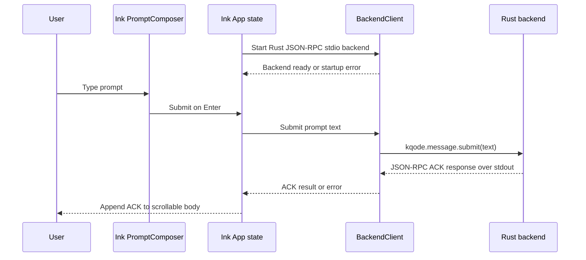

# feat: Add First Ink TUI Homepage

## Summary
Add a small TypeScript Ink package under `tui/`, a minimal Rust JSON-RPC stdio backend process, and a true cross-platform standalone native executable named `kqode`. The packaged artifact should run without Cargo, Rustup, Node, or npm as runtime prerequisites, while npm global install, direct download, Homebrew, and winget all distribute the same standalone executable shape.

---

## Problem Frame
KQode currently has a starter Rust binary and a checked-in starter TypeScript TUI scaffold. The architecture commits to Ink as the terminal UI over a Rust core, so this plan turns that scaffold into the first visual shell and text-submission path without making the UI responsible for core agent behavior.

---

## Requirements

**Origin-derived requirements**

- [x] R1. Render a top identity area with a simple KQode logo, product name, and current application version at normal supported widths, with decorative details allowed to compact or hide under the responsive contract.
- [x] R2. Reserve a main body area that is static on initial render, then displays local backend ACK/status/error content for this slice.
- [x] R3. Display the workspace current working directory where the `kqode` command was invoked directly above the input composer.
- [x] R4. Render the input composer above the bottom status bar as the active prompt area.
- [x] R5. Render `/ commands`, `@ mention`, `? help`, and right-side `GPT-5.5` status affordances at normal supported widths, with lower-priority details allowed to compact or hide under the responsive contract.
- [x] R6. Accept typed text in the composer.
- [x] R7. Support visual multiline wrapping when input exceeds the available width.
- [x] R8. Submit the current non-empty, non-whitespace composer text when Enter is pressed; block empty/all-whitespace submits.
- [x] R9. Have the Rust backend receive submitted text and return an ACK-style response plus the exact received text.
- [x] R10. Display every submitted user prompt and every backend response in the visible scrollable body area.
- [x] R11. Avoid model provider calls, agent loop execution, and tool execution.
- [x] R12. Organize the Ink TUI as components rather than a monolithic render function.
- [x] R13. Place TUI source under `tui/`.
- [x] R14. Use centralized coding-agent CLI theme tokens for the first screen; the active direction is GitHub/Gemini-inspired foreground colors with background rendering kept internal and fallback-aware.

**Distribution, release, and fixture requirements**

- [x] R15. Packaged users can run `kqode` without having Cargo, Rustup, Node, or npm installed, except when npm itself is used as an installer.
- [x] R16. Distribution channels target the same standalone executable artifact: direct release download, `npm install -g`, Homebrew, and winget.
- [x] R17. After the echo/ACK implementation and release staging are complete, provide a registration guide for manually publishing the generated artifacts through GitHub Releases direct download, npm, Homebrew, and winget.
- [x] R18. Provide a small committed dummy React frontend project fixture so cwd display and backend launch behavior can be tested from a realistic non-KQode workspace without a separate regeneration script.
- [x] R28. Provide a GitHub Actions release pipeline that builds the supported standalone executables, packages archives/checksums, and uploads them as GitHub Release assets.

**Interaction, error, and loading requirements**

- [x] R19. Queue consecutive non-empty submits in order: the active request is sent to the backend, later submits appear immediately as user prompts marked `(pending)`, and the queue drains one request at a time as ACKs arrive.
- [x] R20. Render frontend validation failures and backend failure messages in the centralized theme error red.
- [x] R30. Prevent terminal text injection by sanitizing all user prompt, backend ACK, and backend error text before rendering. Persist exact raw text when needed, but never render control sequences as executable terminal control.
- [x] R29. Show a small terminal-safe loading animation for user-visible loading states such as backend startup.

**Plan-added technical constraints**

- [x] T1. Transmit submitted prompts and backend ACK responses through a real JSON-RPC request/response connection between TypeScript and Rust, using third-party JSON-RPC transport libraries rather than a hand-rolled codec.
- [x] T2. Produce a true standalone native executable named `kqode`, packaging the bundled Ink frontend together with a prebuilt Rust backend binary.
- [x] T3. Treat source-mode Cargo launch as a developer path only; packaged mode must never require Cargo, Rustup, or target-dir probing.
- [x] T4. Build platform-specific executable artifacts for macOS, Linux, and Windows, at minimum covering x64 and arm64 where the toolchain supports them.

- [x] **Origin actors:** A1 user, A2 Ink TUI, A3 Rust backend.

- [x] **Origin flows:** F1 first screen render, F2 prompt submit and backend response.

- [x] **Origin acceptance examples:** AE1 first render, AE2 composer wrapping, AE3 submit-to-backend response.

---

## Scope Boundaries
- [x] Real slash command execution remains deferred; `/` commands, `@` file mentions, help overlays, and Tab navigation remain inert visual affordances.
- [x] Model selection, provider calls, streaming assistant output, prompt-history navigation/editing, and full editor behavior are deferred.
- [x] Full session accounting, durable session persistence, trace replay, cost display, approvals, diff panels, rename/delete/export, `/resume`, and checkpoint/rewind/fork remain deferred.
- [x] Daemon mode is explicitly out of scope for this milestone and is not a planned future direction: do not introduce `kqoded`, local sockets, listening ports, background services, or backend processes that survive the TUI. This product shape uses only a TUI-owned child Rust process over JSON-RPC stdio. Any in-flight work terminates if the TUI or child backend terminates.
- [x] Full theme configuration is deferred; centralized GitHub/Gemini-inspired theme tokens remain internal to this slice.
- [x] The TUI lives under `tui/` for this slice, even though the architecture example mentions `apps/kqode-tui/`; the origin requirement takes precedence for now.
- [x] Registry publishing, signed/notarized releases, auto-update, and daemon service installation are deferred; GitHub Release asset creation and channel-ready package artifacts for direct download, npm global install, Homebrew, and winget are in scope around the standalone executable.

### Deferred to Follow-Up Work
- [x] Expand the first local ACK JSON-RPC boundary into the eventual full agent session protocol when KQode adds real model/tool/session events.
- [x] Promote the `tui/` package into any future workspace layout if the repository later adopts the full proposed `apps/` and `packages/` structure.

### No-Daemon Product Decision
- [x] User promise: KQode does not keep hidden background services running after the TUI exits. Work is owned by the visible `kqode` session and stops when the TUI or child backend terminates.
- [x] Tradeoff accepted: KQode gains simpler local security, lifecycle, and install behavior, but users do not get background continuation after closing the terminal, multi-client attachment to one live backend, or a process owner for unattended long-running jobs.
- [x] Recovery model: This slice does not persist session state, so interrupted in-flight work is not automatically continued and completed transcripts are not restored on a later launch.
- [x] Reconsideration threshold: Reopen the no-daemon decision only with an explicit product decision document if KQode later commits to background execution while no TUI is open, multi-client live attachment, IDE/TUI/headless sharing of one live runtime, or unattended job ownership.

---

## Context & Research
### Relevant Code and Patterns

- [x] `Cargo.toml` defines a single Rust package named `KQode`, version `0.1.0`, edition `2024`, with no dependencies yet.
- [x] `src/main.rs` is the only Rust runtime source today and currently prints a starter message; this plan moves the binary entrypoint to root `main.rs` and keeps implementation modules under `src/`.
- [x] `docs/kqode_architecture_spec.md` assigns the Rust core runtime to Rust and the Ink TUI/protocol client to TypeScript. Its older daemon-mode direction is superseded for this product slice by the explicit no-daemon decision in this plan.
- [x] `docs/kqode_build_path.md` requires the Rust core to run headless while Ink remains the committed TUI.
- [x] `.cargo/config.toml` exposes `cargo xtask ...` as the contributor-facing command shape for nested TUI and fixture workflows.
- [x] `.gitignore` covers Rust artifacts, TUI dependency/build artifacts, generated fixture workspaces, and local/editor files.
- [x] `tui/package.json` records the Bun-managed package baseline (`bun@1.3.12`, Bun `>=1.3.0`, Node `>=24.0.0`) and keeps package-local `dev`, `typecheck`, and `test` scripts available behind Cargo-facing xtask commands.
- [x] `tui/src/productMetadata.ts` reads the displayed KQode version from root `Cargo.toml`, while `tui/src/runtimePaths.ts` keeps `repoRoot` and `workspaceCwd` resolution separate.
- [x] `xtask/src/commands/` registers TUI commands and simple/complex React fixture preparation commands; `xtask/src/support/` owns shared Bun, Git, path, and workspace reset helpers.
- [x] `docs/research/2026-06-25-tui-backend-spawn-architecture.md` found that reference agents centralize process launch behind manager/service abstractions with explicit cwd roles, timeout/output caps, environment hardening, cleanup, and permission/sandbox gates.

### Institutional Learnings
- [x] No `docs/solutions/` learnings exist yet.
- [x] `docs/plans/2026-06-25-002-feat-context-intent-retrieval-planning-plan.md` is adjacent future context work but explicitly not a TUI implementation source; do not pull retrieval or agent behavior into this slice.

### External References
- [x] Ink documentation: use React-style `Box`, `Text`, and hooks for terminal rendering, with component tests through Ink testing utilities.
- [x] Node `child_process.spawn` documentation: use argument arrays and `shell: false` for the Rust backend process rather than shelling through `exec`.
- [x] Bun's `bun build --compile` produces the single native executable that bundles the Ink entrypoint and its dependency closure; Node SEA and `postject` were evaluated during planning but not used.
- [x] npm, Homebrew, and winget are distribution channels for prebuilt artifacts in this slice, not source-build mechanisms.
- [x] JSON-RPC reference: use a library-backed request/response connection now for local ACK backend messages, while deferring the broader agent session protocol.
- [x] NO_COLOR guidance: keep a later path for color-disabled terminals even though full theme configuration is out of scope.

---

## Key Technical Decisions

- [x] Use a nested Bun-managed TypeScript package in `tui/`: This satisfies the origin path requirement without forcing a root JavaScript workspace before the broader M0 structure exists.
- [x] Use Bun 1.3.x plus Node 24+ as the TUI source baseline: Record both the Bun package manager and Node runtime expectation in package metadata so Ink/ESM/Vitest behavior is reproducible.
- [x] Expose source workflows through Cargo-facing xtask commands: contributors should reach TUI install/typecheck/test/dev and fixture preparation from the repository root, while Bun/package scripts remain the nested implementation detail.
- [x] Keep Ink components prop-driven and backend-agnostic: Layout components should not import process-spawning code, preserving the Rust core / Ink TUI boundary.
- [x] Use a small library-backed JSON-RPC message seam: The TUI calls a backend client now, and that seam can later expand into a real protocol client without rewriting the UI tree.
- [x] Use a TUI-owned Rust JSON-RPC stdio server for the first backend: This is not a daemon, exposes no socket/port, and exits with the TUI, but it is closer to KQode's intended Rust-core/TypeScript-surface boundary than one process per submit.
- [x] Make the backend launch path clean-checkout-safe: The documented demo path must build or run the Rust backend from source rather than assuming an ignored `target/` artifact already exists.
- [x] Use Cargo as the default first-slice backend build path: build from the trusted `repoRoot` manifest/config, then launch the compiled backend with process cwd set to `workspaceCwd`, so untrusted workspace Cargo config/PATH cannot influence the build step.
- [x] Ship a standalone `kqode` executable as the core release artifact: Bundle the TypeScript Ink entrypoint into a Bun-compiled native executable and embed/carry the compiled Rust backend binary so one user-invoked executable starts both frontend and backend.
- [x] Use install channels as distribution wrappers, not alternate runtimes: npm global install, Homebrew, winget, and direct download should all select or install the same platform-specific `kqode` executable rather than rebuilding from source.
- [x] Name path roles explicitly: `repoRoot` is the KQode repository root for Cargo/product metadata, `workspaceCwd` is the user's launch directory from `process.cwd()` when `kqode` starts and is displayed above the composer/used for backend execution, and `tuiPackageRoot` is the nested package directory.
- [x] Keep a committed dummy React frontend project fixture under `tests/fixtures/dummy-react-app/` as read-only seed data and provide an optional cached complex Vite fixture through xtask: Automated tests and manual development runs must copy a selected fixture into ignored workspaces under `target/kqode-test-workspaces/` before running `kqode`, so edits do not dirty the repository.
- [x] Use a guarded backend process launcher: Source-mode Cargo launch and dist-mode bundled-backend launch must share timeout, output caps, stdin-close, environment hardening, cleanup, and typed-error behavior.
- [x] Fail closed on backend launch policy: The first slice may launch only the internal JSON-RPC ACK backend through the two planned modes; user-supplied executables, arbitrary shell strings, and backend path overrides are deferred.
- [x] Treat multiline as visual wrapping only: Enter submits, while true newline editing, history, slash commands, and full editor behavior remain deferred.
- [x] Preserve exact non-empty prompt text: All-whitespace submits are blocked in the composer, but non-empty prompts keep leading/trailing spaces and Unicode through `receivedText`.
- [x] Serialize backend submits through an in-memory FIFO queue: the TUI appends each user prompt immediately, sends only one request at a time over JSON-RPC, marks only queued prompts as `(pending)` in the scrollview, and clears a queued prompt's pending marker when that prompt becomes the active request.
- [x] Bound first-slice text separately from JSON-RPC framing: cap submitted composer prompt text at 64 KiB decoded UTF-8 and cap displayed backend/error output at 128 KiB decoded UTF-8. Future tool output should use preview-plus-saved-full-output behavior instead of giant terminal dumps.
- [x] Use root Rust metadata as the displayed product version: The TUI package may have its own package version for tooling, but the visible KQode version should come from root product metadata.
- [x] Preserve the user's workspace cwd explicitly: Running package scripts from `tui/` must not accidentally display or use `tui/` as the KQode workspace.
- [x] Keep the composer available while a backend request is pending: Enter snapshots and clears the current prompt, appends it to the transcript, and enqueues it behind any active request instead of dropping duplicate submits.
- [x] Define a first-slice responsive contract: Prioritize composer, `workspaceCwd`, and left status hints; hide or compact lower-priority identity/model details before letting the prompt area disappear.
- [x] Make backend failure visible and recoverable by new submit: A failed backend request must not look like a successful empty response or leave the user with no feedback.
- [x] Style all frontend validation errors and backend failure messages with the centralized theme error red so failures are visually distinct from prompts, pending text, and ACK output.
- [x] Separate raw persisted text from rendered display text: Persist exact user/backend text where fidelity matters, but render a sanitized form that escapes or neutralizes terminal control characters, ANSI CSI sequences, OSC sequences, carriage returns, backspaces, and other control bytes so backend/user text cannot manipulate the terminal UI.

### Local Data Handling

- [x] Store KQode local data (such as the packaged backend cache) under the current user's profile directory at `~/.kqode/`, not inside the workspace repository.
- [x] Create `~/.kqode/` with per-user permissions where the platform supports it (for example `0700` for directories and `0600` for files on Unix-like systems).
- [x] Do not persist environment variables, provider keys, tokens, or raw process environments to local KQode data.
- [x] Provide a documented local path for clearing KQode local data; this slice may document manual deletion of `~/.kqode/` before a first-class delete command exists.

---

## Open Questions
### Resolved During Planning

- [x] Smallest reliable Ink-to-Rust boundary: Start a TUI-owned Rust JSON-RPC stdio backend process and exchange library-framed JSON-RPC request/response messages for this slice.
- [x] Daemon-mode decision: Do not build daemon mode now or later. The backend is a child process owned by the TUI, has no local socket or listening port, and must not continue running after the TUI exits. Long-running jobs are owned by the live child backend only and terminate with it.
- [x] TypeScript package tooling: Use a nested `tui/` package with TypeScript, Ink, React, Vitest, Ink testing utilities, and a dev runner.
- [x] JavaScript toolchain baseline: Use Bun 1.3.x as the nested package manager/script runner with Node 24+ as the source-mode runtime baseline, and record both in package metadata/documentation.
- [x] Backend bootstrap: The TUI/demo path must build or run the Rust JSON-RPC stdio backend from repo source instead of depending on a pre-existing compiled binary.
- [x] Backend launch rule: The default process client builds via Cargo from `repoRoot`, then launches the resulting backend binary with process cwd set to `workspaceCwd`; target-dir binary probing and backend path overrides are deferred until packaging work needs them.
- [x] Standalone launch rule: The packaged executable uses its embedded Rust backend asset instead of Cargo; source-mode development always uses Cargo, regardless of whether generated artifacts exist.
- [x] Distribution rule: Package managers are installers only. They must not require users to build the Rust backend, install Cargo, or keep the TUI as an npm-driven runtime.
- [x] Project file-size rule: Keep source files across Rust and TypeScript at or below roughly 200 lines by splitting modules/components/helpers before they grow too large. Root `main.rs` is the small CLI entrypoint only; all other Rust implementation code should live in focused modules under `src/`. The first integration test file is `tests/main.rs`.
- [x] Implementation-unit boundary: Each U-ID is intended to map to one atomic commit-sized change.
- [x] Cwd semantics: Keep `repoRoot`, `workspaceCwd`, and `tuiPackageRoot` separate; display and backend execution use the `workspaceCwd` captured from the directory where `kqode` was invoked, while product metadata and Cargo launch use `repoRoot`.
- [x] Test workspace fixture: Commit a minimal React app fixture under `tests/fixtures/dummy-react-app/` as a read-only template; do not add a regeneration script unless the fixture later becomes generated or large. Add ignore rules when the fixture is implemented so generated installs/build outputs and transient copied workspaces are not committed.
- [x] Interactive development workspace: Provide Cargo-facing fixture commands that reset `target/kqode-test-workspaces/workspace/` from either the committed simple React fixture or a cached pinned Vite React template. Developers should run `kqode` from the copied workspace, never mutate the committed fixture directly.
- [x] Multiline behavior: Implement visual wrapping only; do not add semantic newline entry in this slice.
- [x] Post-submit display: Append each user prompt to the scrollable body immediately, show `(pending)` only for prompts waiting behind the active request, clear that marker when the prompt starts sending, then append or attach the backend ACK response for that prompt when it completes. Do not add real model/assistant conversation history yet.
- [x] Empty submit behavior: Block empty or all-whitespace composer submits; still allow the backend message-submit method to ACK an empty string for contract completeness.
- [x] Version source: Display the root Rust package version as the KQode product version, not the nested TUI package version.
- [x] Prompt/output bounds: Enforce a 64 KiB decoded UTF-8 composer prompt cap before submit and a 128 KiB decoded UTF-8 display cap for backend/error output. These are application/UX limits, not JSON-RPC constraints. Transport framing remains library-owned; malformed frames are fatal transport errors, not normal method-level JSON-RPC errors.

### Deferred to Implementation

- [x] Final remaining dependency versions: The first Ink/React/TypeScript/Vitest baseline is locked by `tui/bun.lock`; resolve remaining compatible JSON-RPC, bundling, and process-cleanup dependencies when their units land.
- [x] Final internal backend argument name: Use a hidden/internal JSON-RPC backend mode and keep it non-public; the exact argument spelling can follow the smallest Rust CLI implementation.
- [x] Exact string-width handling: Start with Ink wrapping and add a width helper only if tests expose a narrow-terminal or wide-character issue.

---

## Planned Libraries and Tooling

- [x] **TUI rendering** (`ink`, `react`): Render the terminal interface with React-style components.
- [x] **TypeScript package/runtime/dev** (`bun`, Node 24+, `typescript`, `tsx`): Install nested TUI dependencies, run package-local scripts, and execute the source-mode Ink entrypoint from the selected workspace cwd.
- [x] **Root automation** (Rust `xtask` helper crate): Provide Cargo-facing commands for fixture preparation, TUI build/test orchestration, release packaging, and CI parity.
- [x] **Frontend bundling and native compile** (`bun build --compile`): Bundle the TypeScript/Ink/React/JSON-RPC dependency closure and emit the native `kqode` executable in a single step (as delivered in U9), orchestrated through the Cargo/Bun tooling seam.
- [x] **TUI tests** (`vitest`, `ink-testing-library`): Deterministic component/input tests.
- [x] **TypeScript JSON-RPC** (`vscode-jsonrpc`): Manage JSON-RPC request IDs, response routing, errors, and stream framing over the Rust child process stdio pipes.
- [x] **Rust JSON-RPC** (`lsp-server`, `serde`, `serde_json`): Use proven JSON-RPC stdio message handling on the Rust side while defining only KQode's ACK method and params/result types.
- [x] **Process boundary** (Node built-ins `node:child_process`, `node:path`, `node:fs`; `tree-kill`): Spawn Cargo or the bundled Rust backend without shelling out through `exec`, with timeout and cross-platform process-tree cleanup guards.
- [x] **Standalone executable packaging** (originally planned Node SEA + `postject`, superseded): Replaced by the Bun `--compile` path above, which builds the native `kqode` executable and launches the packaged Rust backend asset; Node SEA and `postject` are no longer used.
- [x] **Distribution packaging** (release archives and checksums; registration guide for npm/Homebrew/winget): Produce GitHub Release-ready artifacts and document how package-manager manifests point at those release URLs.
- [x] **GitHub release automation** (GitHub Actions, `gh` CLI or `actions/upload-artifact`/release upload actions): Build cross-platform standalone archives, produce checksums, and upload them to GitHub Releases.
- [x] **JSON-RPC protocol scope** (KQode-owned method names and typed params/results): Use libraries for transport/protocol mechanics, but keep the first method surface intentionally small until the real session protocol exists.

---

## Output Structure

**Review items:**
- [x] Output tree reflects the landed Bun/xtask scaffold, including `.cargo/`, `.run/`, `tui/bun.lock`, runtime helpers, xtask command/support directories, and fixture cache paths.

```text
.cargo/
  config.toml
.run/
  xtask_*.run.xml
tui/
  package.json
  bun.lock
  tsconfig.json
  vitest.config.ts
  main.tsx                       # source-mode Ink entrypoint
  packaged/                      # packaged-mode entrypoint + staged backend asset
    entry.packaged.tsx
    embeddedBackendAsset.ts
    assets/
      kqode-backend[.exe]        # staged Rust backend (packaging input)
  scripts/                       # Bun build/release scripts (buildPackaged.ts, packageRelease.ts)
  src/
    App.tsx
    bootstrap.ts
    backend/                     # protocol/ process/ client/ packaged/ runtime/ + backendConstants.ts
    contracts/backend/           # backend client + message-type seam
    components/                  # Header, CwdLine, BodyPane, StatusBar, HomeScreen/, PromptComposer/
    state/                       # shared Jotai store: global/ backend/ composer/ homeScreen/
    libs/                        # terminal/ git/ exitSummary/ text/ tui/ path/ product/ runtime/
    theme/
      themeConfig.ts
    __tests__/                   # App tests; component tests under __tests__/components/
main.rs                          # Rust binary entrypoint (argument dispatch only)
src/
  lib.rs
  backend.rs
  protocol.rs
tests/
  main.rs
  fixtures/
    dummy-react-app/
      bun.lock
      package.json
      index.html
      src/
        App.jsx
        main.jsx
xtask/
  Cargo.toml
  src/
    main.rs
    commands/
      fixture/
      tui/
    support/
```

Generated by tests and manual fixture-copy commands after fixture implementation:

```text
target/
  kqode-test-workspaces/
    workspace/  # ignored active development/test workspace copy
    .fixture-sources/
      vite-react-template/  # ignored cached source for the complex fixture
```

Generated by the dist build:

```text
tui/
  dist/
    kqode[.exe]            # standalone executable (Bun --compile output)
    release/
      kqode-<target>.tar.gz | kqode-<target>.zip
      kqode-<target>.sha256
      checksums.txt
```

The final reviewable runtime artifact is the standalone `tui/dist/kqode[.exe]` executable for the current platform, plus GitHub Release-ready archives and checksums. The staged backend asset under `tui/packaged/assets/` is a packaging input, not an extra file the user must invoke. Running from source uses Cargo-facing xtask commands that delegate to Bun/package scripts and Cargo as needed, but packaged users never need Cargo and direct/brew/winget users never need Node or npm. npm, Homebrew, and winget do not read local `dist` subdirectories directly; their package/manifest files should point at published GitHub Release asset URLs.

---

## High-Level Technical Design
> *This illustrates the intended approach and is directional guidance for review, not implementation specification. The implementing agent should treat it as context, not code to reproduce.*



Source mode and packaged mode share the same JSON-RPC contract. Source mode launches Rust through Cargo for developer convenience; packaged mode materializes the embedded prebuilt Rust backend from the Bun-compiled executable and launches that binary directly.

---

## First-Slice JSON-RPC Contract
> *This contract defines the first local ACK protocol shape. It is intentionally not the mature agent session protocol, generated schema system, streaming assistant protocol, or cross-process daemon.*

- [x] Process lifecycle: The TUI starts one Rust child backend when the TUI starts, keeps it for the TUI session, and terminates it on TUI exit. If the child backend crashes or the JSON-RPC transport dies, the TUI immediately marks the backend `dead`, shows a red backend-crashed state, marks any in-flight prompt failed, and pauses queued prompts. It must not silently restart in the background. A fresh child backend may be spawned only when the user types and submits a new non-empty prompt. Respawn does not retry or auto-resubmit interrupted work.
- [x] Transport framing: JSON-RPC 2.0 messages use the selected libraries' stdio stream framing. TypeScript uses `vscode-jsonrpc` stream readers/writers over child stdout/stdin; Rust uses `lsp-server` over stdio. Rust stdout must contain only JSON-RPC protocol frames; diagnostics go to stderr.
- [x] Message submit: method `kqode.message.submit`, params containing a single `text` string, and an ID that Rust mirrors back in the response.
- [x] Success response: same ID and result `{ "message": "ACK: message received", "receivedText": string }` for message submits; the TUI displays both the ACK and `receivedText` in the body.
- [x] Error response: JSON-RPC 2.0 error response for valid requests with unsupported methods, invalid params, over-limit payloads, or internal backend failures. Malformed transport frames are fatal transport errors handled by the backend client lifecycle.
- [x] Size limits: decoded request text is capped at 64 KiB UTF-8 before submit, and displayed backend/error output is capped at 128 KiB UTF-8. Transport frame parsing/framing stays owned by `vscode-jsonrpc` and `lsp-server`.
- [x] Scope guard: no streaming deltas, tool events, assistant messages, generated protocol package, local socket, listening port, background service, checkpoint/rewind/fork, or cross-process daemon are introduced in this slice.

---

## UI State and Responsive Contract
| State | Body/composer behavior |
|-------|------------------------|
| Initial | Body scrollview shows product-facing preview copy such as "Preview mode: local Rust backend only. No model calls or tools will run." |
| Submitted active | Body scrollview appends the exact active user prompt with no pending marker and clears the composer for the next prompt. |
| Queued pending | Later prompts show `(pending)` until they become the active request; no `(sending...)` marker is shown for the active request. |
| Success | The matching prompt is followed by a product-facing proof entry, e.g. "Rust backend ACK - received: <submitted text>". |
| Backend error | The matching prompt is followed by a red "Rust backend failed" message; later queued prompts remain queued unless the backend lifecycle is fatal. |
| Backend crashed | Body scrollview shows a red crash message such as "Rust backend crashed. Current request failed. Type a new prompt to restart the backend."; queued prompts remain visible but paused. |
| Over limit | Composer/body feedback says the prompt exceeds the 64 KiB limit and must be shortened before submit, rendered in theme error red. |
| Loading animation | While backend startup is in progress, show a compact spinner/pulsing ellipsis in the affected area. The animation must be cosmetic only, stop on success/error/cancel, and degrade to static text when animation is unavailable. |

| Viewport | Responsive behavior |
|----------|---------------------|
| 80+ columns | Show full logo/title/version, full cwd, full left hints, and right-side model label. |
| 60-79 columns | Preserve composer, cwd, `/ commands`, `@ mention`, and `? help`; hide the model label before hiding input affordances. |
| 40-59 columns | Preserve composer and cwd; compact status hints to `/ · @ · ?`; hide model/version/logo detail as needed. |
| Below 40 columns or below 12 rows | Degrade gracefully without crashing; composer and cwd remain highest priority, while decorative/status details and status hints may disappear. |

| BodyPane overflow | Behavior |
|-------------------|----------|
| Height | BodyPane owns the rows left after header, cwd, composer, and status bar render. |
| Append behavior | Appends initial, user prompt, success, and error entries; auto-scrolls to the newest entry after every append. |
| Queue behavior | User prompts are ordered by submit sequence; one item is active with no marker, later items show `(pending)`, and the queue drains FIFO as ACK/error results arrive. |
| Pending behavior | A queued prompt's `(pending)` marker is removed when that prompt becomes the active request. |
| Overflow marker | If older entries are clipped, show a compact marker such as `... earlier output hidden ...` at the top of the visible body. |
| Manual scroll | Manual scroll controls are out of scope for this slice. |

| Loading input state | Behavior |
|---------------------|----------|
| Backend startup | Composer may accept typed draft text, but Enter is disabled until the backend is ready; the draft is preserved on startup success or failure. |
| Loading failure | Stop the animation, show a red error in the affected area, keep the current session/draft unchanged, and return focus to the composer unless the backend is dead. |

| Non-color state markers | Behavior |
|-------------------------|----------|
| Errors | Every red error also includes a non-color marker such as `ERROR:` or `!` so the state remains clear with colors disabled. |
| Loading | Animated loading has a static text fallback such as `Loading...`; this text remains visible when animation/color is unavailable. |
| Pending | Queued prompts keep the literal `(pending)` marker independent of color. |

---

## Implementation Units
Each implementation unit is intended to be landed as one atomic commit-sized change. If implementation reveals a unit is too large to review as one commit, split the unit without renumbering existing U-IDs.

After each commit-sized unit lands, run code review on the completed unit, then continue with the next unit without pausing for user review or consent.

> Reconciliation note (2026-07-01): Units were re-aligned with delivered work. The standalone executable moved from U11 to **U9**; new as-built units **U10** (TUI state/backend architecture hardening) and **U11** (terminal control and rendering robustness) capture added features; the deferred SQLite session store and `/resume` picker were moved into the LLM provider/streaming-chat plan (`2026-06-30-001-feat-llm-provider-streaming-chat-plan.md`) as units **U9** and **U10**. This was a deliberate, user-directed reconciliation rather than a routine split. The exit-summary card, Gemini-style theming, and LLM provider streaming chat are tracked in their own plans and are intentionally out of scope here.
>
> Reconciliation note (2026-07-02): Marked the plan **completed** after verifying every unit (U1–U13) is delivered and green — full Rust workspace + xtask tests, the TUI vitest suite (163 passing), and `tsc` typecheck. Removed superseded packaging references (Node SEA/`postject`/Rollup → Bun `--compile`; npm root + optional-dependency packages → a single `@kqode/kqode-cli` that downloads and verifies its binary), refreshed the Output Structure tree and the U12 target matrix to the as-built layout/runners, and fixed drifted test paths. `README.md` gained standalone-executable and distribution sections.

- [x] Review batching: after U2 and U3 land the static home screen and composer behavior, U4-U8 can be reviewed as one source-mode ACK integration batch because those units add the Rust backend mode, protocol wiring, guarded launcher, backend client, and submit/ACK UI integration.

### Implementation Gates

| Gate | Goal | Required units | Explicitly excluded from the gate |
|------|------|----------------|-----------------------------------|
| G1. Source-mode homepage ACK (done) | Prove AE1-AE3 with a local source-mode Ink UI and Rust ACK backend. This is the origin validation gate and must be runnable before persistence, standalone packaging, or release automation lands. | U1, U2, U3, U4, U5, U6, U7, U8 | standalone executable, release archives, GitHub Release workflow |
| G2. Local standalone executable (done) | Package the working TUI + Rust backend into a local standalone executable after G1 behavior is stable. | U9 | GitHub Release upload and package-manager registration |
| G3. TUI architecture and terminal robustness (done) | Harden shared TUI state/backend module seams and terminal integration/rendering after the standalone executable works. | U10, U11 | release automation |
| G4. Release assets | Produce GitHub Release-ready archives/checksums and CI upload after the local standalone executable works. | U12, U13 | npm publish, Homebrew tap submission, winget submission, signing/notarization, auto-update |

### U1. Verify the Bun-powered nested Ink package scaffold

**Goal:** Verify and adjust the existing TypeScript package infrastructure under `tui/` so the Bun-managed Ink TUI can be developed, launched, and tested through Cargo-facing commands without becoming a root JavaScript workspace.

**Requirements:** R12, R13, R18.

**Origin trace:** Supports F1/F2 scaffolding; no direct acceptance example.

**Dependencies:** None.

**Implementation commit:** `99949b9fe7698a1f0b87acda232281cbaeb4d81d` (`feat(tui): scaffold Bun-powered Ink workspace`).

**Approach:**
- [x] Keep the nested Bun-managed package rather than introducing a root JS workspace.
- [x] Convert the root Cargo manifest into a package-plus-workspace manifest with members `[".", "xtask"]` and a resolver compatible with edition 2024, while keeping runtime code in the existing root package.
- [x] Preserve strict TypeScript ESM and React JSX configuration with `tsx` as the source-mode entrypoint runner.
- [x] Preserve package-local scripts for TUI internals, but expose contributor-facing workflows through `cargo xtask tui-install`, `cargo xtask tui-typecheck`, `cargo xtask tui-test`, and `cargo xtask tui-dev` from the repository root.
- [x] Add `.cargo/config.toml` so `cargo xtask ...` resolves to `cargo run -p xtask -- ...` without requiring contributors to remember the longer form.
- [x] Preserve dependency/build artifact ignores for package-local dependencies, TUI build output, fixture-local outputs, and generated workspaces.
- [x] Add a tiny committed dummy React app fixture for cwd/workspace tests; treat the committed fixture as read-only seed data and reset ignored working copies under `target/kqode-test-workspaces/`.
- [x] Add fixture preparation commands for both the committed simple React fixture and a cached pinned Vite React template, with the complex fixture cache kept under `target/kqode-test-workspaces/.fixture-sources/`.
- [x] Make `tui-dev` ensure an ignored workspace exists, prompt for a fixture when missing, then run the TUI entrypoint from `target/kqode-test-workspaces/workspace/` so `workspaceCwd` displays the fixture cwd rather than `tui/`.
- [x] Add lightweight runtime helpers for root product metadata and path roles: read the displayed version from root `Cargo.toml`, resolve `repoRoot` from `tuiPackageRoot`, and normalize `workspaceCwd` from `process.cwd()`.
- [x] Remove the duplicate `.github/copilot-instructions.md` path and keep repository instructions in `AGENTS.md`.
- [x] Keep README changes for the final submit/backend-response unit after the demo path exists.

**Patterns to follow:**
- [x] Keep the runtime Rust code in the current root package; adding minimal `xtask` automation wiring is allowed, but do not split the runtime into the future planned crate workspace in this slice.
- [x] `cargo xtask ...` must work from the repository root after U1; do not document xtask commands before the workspace membership and Cargo alias are wired.
- [x] Existing docs describe TypeScript as a surface layer, not the core runtime owner.
- [x] Do not run mutation tests or interactive `kqode` sessions directly in `tests/fixtures/dummy-react-app/`; always copy to `target/kqode-test-workspaces/` first.
- [x] Root-level docs should prefer Cargo-facing commands such as `cargo xtask tui-dev` and `cargo xtask fixture-prepare-react-simple` over asking contributors to remember package-manager commands directly.

**Test scenarios:**
- [x] Happy path: `tui/src/__tests__/runtimePaths.test.ts` verifies `repoRoot` is derived from `tuiPackageRoot` and `workspaceCwd` is normalized from the selected launch cwd.
- [x] Happy path: add an App smoke render test for the existing TUI implementation that verifies the product version, workspace cwd, and preview backend-only copy render from props.
- [x] Happy path: xtask command registration tests reject duplicate command names so newly added fixture/TUI commands remain addressable through one registry.
- [x] Happy path: fixture selection accepts the 1-based menu number, short label such as `react-simple`, and full command name such as `fixture-prepare-react-simple`.
- [x] Error path: workspace reset preserves an existing target workspace when the requested source fixture directory is missing.
- [x] Integration path: the Cargo-facing TUI typecheck and test commands run the nested package through Bun without requiring direct package-manager commands in normal contributor docs.

**Verification:**
- [x] The TUI package can be installed, typechecked, tested, and launched from an ignored fixture workspace without requiring a root JavaScript workspace.
- [x] `cargo xtask help` shows the registered fixture and TUI commands, and each command resolves from the repository root.
- [x] Rust build artifacts, Bun/Node package artifacts, fixture outputs, and generated workspaces remain ignored appropriately.

---

### U2. Build the static home screen components
**Goal:** Implement the Copilot CLI-style KQode home screen as composable Ink components with centralized theme tokens.

**Requirements:** R1, R2, R3, R4, R5, R12, R13, R14, R18.

**Origin trace:** Covers F1 and AE1.

**Dependencies:** U1.

**Approach:**
- [x] Centralize GitHub/Gemini-inspired foreground colors plus message/input background tokens in `themeConfig`.
- [x] Include an error red token and use it for frontend validation failures and backend failure messages.
- [x] Use a `HomeScreenConfig` prop at the screen boundary, then move shared screen state through Jotai atoms so nested display components do not receive long prop chains.
- [x] Render a visual composer slot/shell so the first-screen layout can be validated before interactive composer behavior lands.
- [x] Render the bottom hints as inert muted affordances; they must not open command/help/mention behavior.
- [x] Right-align or degrade the model label based on terminal width while keeping core prompt affordances visible.
- [x] Support a practical minimum viewport of roughly 40 columns by 12 rows; below that, preserve the composer, cwd, and left hints first, then compact or hide model/version/logo detail.
- [x] Treat the logo as KQode-inspired terminal art, not copied product source.
- [x] Display the KQode product version from `repoRoot` metadata rather than the nested TUI package version.
- [x] Display `workspaceCwd` as the command invocation directory, including when tests run the TUI from the dummy React app fixture, with home-relative formatting and an optional bracketed Git branch/status label.
- [x] Keep message background rendering internal and Gemini-inspired: body prompt blocks use half-line `▄`/`▀` rows, while the composer uses row background without changing vertical row accounting.
- [x] Render body entries as typed transcript rows (`info`, `prompt`, `pending`, `success`, `error`) with assistant/user markers, prompt message backgrounds, error coloring, and no synthetic gap rows between entries.
- [x] Keep the body-to-cwd separator as exactly one blank row while assigning spare rows to the body spacer so cwd, composer, and status remain bottom-sticky with short or overflowing body content.
- [x] Add bounded body scrolling state with newest output visible by default, a visual scrollbar only when content overflows, and PageUp/PageDown/mouse-wheel navigation while keeping bottom chrome pinned.

**Patterns to follow:**
- [x] `docs/kqode_architecture_spec.md` commits to Ink for the TUI; layout components should remain display-only.
- [x] Keep `src/components` focused on `.tsx` component modules and move reusable layout/body/cwd/background helpers under `src/libs/tui`.
- [x] Use Jotai for shared home-screen layout, scroll, composer-row, and submitted-prompt state while keeping leaf components focused on rendering and input wiring.
- [x] `docs/brainstorms/2026-06-25-first-ink-tui-homepage-requirements.md` provides the visual wireframe and status labels.
- [x] Gemini CLI background rendering is product-behavior reference only: copy the half-line block idea, not source.

**Test scenarios:**
- [x] Covers AE1. Happy path: initial render includes the logo, `KQode`, root product version, cwd line, prompt region, bottom hints (`/ commands`, `@ mention`, `? help`), and `GPT-5.5`.
- [x] Covers AE1. Happy path: when launched from a copied dummy React workspace under `target/kqode-test-workspaces/`, the cwd line displays that copied workspace rather than `tui/`, the KQode repo root, or the committed fixture template.
- [x] Covers AE1. Happy path: the first screen uses centralized GitHub/Gemini-inspired foreground tokens for foreground, muted text, accents, errors, and scrollbars.
- [x] Happy path: the theme exposes an error red token for frontend/backend failure rendering.
- [x] Happy path: body prompt background rendering uses full-width half-line block rows for submitted user messages.
- [x] Happy path: composer row background renders without adding extra rows, so body height, cwd, composer, and status layout stay stable.
- [x] Happy path: submitted user prompts are appended to the body as Gemini-style user message blocks and the composer remains available for the next prompt.
- [x] Happy path: `workspaceCwd` is formatted relative to the user's home directory and can show a bracketed Git status label with branch and change flags.
- [x] Happy path: body entries wrap without ellipses or gap rows, and multiline assistant/info entries are normalized before row budgeting.
- [x] Happy path: body output can be scrolled with PageUp/PageDown and mouse wheel events, shows a scrollbar when overflowed, and keeps the status row pinned.
- [x] Edge case: a long `workspaceCwd` soft-wraps without ellipses while the composer and status bar remain visible.
- [x] Edge case: around 40 columns by 12 rows, the composer, `workspaceCwd`, and left-side status hints remain visible while lower-priority details compact or disappear.
- [x] Edge case: short body content leaves cwd, composer, and status pinned to the terminal bottom rather than floating below the body.
- [x] Edge case: a one-row body budget prioritizes actual content over hidden-output marker text.
- [x] Edge case: rendered output remains readable when color styling is stripped by the test renderer.

**Verification:**
- [x] The first rendered frame feels like the intended KQode home screen and keeps future output space available.
- [x] U2 is delivered by commit `dd15b678392eacc2ffcee88884eba18ae52c1236` and refined by commit `5432e018cb496e5f7359e69d47a2a7d1691c0794`, covering the home screen component split, shared Jotai state, body transcript rendering, bottom-sticky layout, git-aware cwd display, and scroll controls.

---

### U3. Implement composer input and wrapping behavior
**Goal:** Add focused prompt entry that accepts typed text, visually wraps long input, and treats Enter as submit.

**Requirements:** R4, R6, R7, R8, R12.

**Origin trace:** Covers the input leg of F2 and AE2.

**Dependencies:** U1, U2.

**Approach:**
- [x] Keep printable input, backspace/delete, cursor movement, Enter submit, modified-Enter newline insertion, and empty-submit behavior explicit in composer state.
- [x] Use Ink wrapping for the first slice; only add a separate width utility if the component tests prove it is needed.
- [x] Treat typed/pasted printable text as composer content, strip control characters from pasted input, and support authored newlines through modified Enter plus a backslash-then-Enter fallback.
- [x] Block only empty or all-whitespace submits; preserve leading/trailing spaces for non-empty prompts.
- [x] Enforce the 64 KiB prompt-size ceiling before submit with visible feedback instead of sending an over-limit JSON-RPC request.
- [x] Keep slash, mention, help, and Tab behavior inert: `/`, `@`, and `?` are normal typed characters, and Tab should not trigger navigation.
- [x] On submit, emit an exact prompt snapshot through the home-screen submit atom, append it to the body, and clear the composer so further typing can continue while App owns later backend queue state.
- [x] Cap the composer to a small visible height and scroll/clip to the latest prompt lines so long prompts do not push the cwd and status bar off screen.
- [x] Render composer rows with the internal input background when color/background rendering is enabled, but do not add extra top/bottom padding rows to the composer.
- [x] Keep composer cursor placement tied to the active text row; single-line, authored multiline, and soft-wrapped prompts must not place the cursor on the cwd row or one row above the text.
- [x] Ignore SGR mouse tracking input in the composer so body scroll events are not inserted as prompt text.

**Patterns to follow:**
- [x] External Ink guidance favors `useInput` for keyboard handling and component/reducer tests for deterministic behavior.
- [x] The origin requirement defines base Enter as submit; authored newline support is limited to modified Enter sequences and the backslash fallback.
- [x] Keep shared composer state in Jotai atoms and colocate composer-specific rendering, cursor, input, constants, and visible-text helpers under `PromptComposer/`.

**Test scenarios:**
- [x] Covers AE2. Happy path: typing a long prompt preserves all content and wraps within constrained width.
- [x] Happy path: authored newlines remain visible, continuation lines align under the prompt text, and modified Enter variants insert `\n` without submitting.
- [x] Happy path: printable characters append to the composer and backspace removes the last character.
- [x] Happy path: left and right arrows move the input cursor for middle insertion and deletion.
- [x] Edge case: pressing Enter with empty or whitespace-only content does not submit.
- [x] Edge case: non-empty text with leading/trailing spaces submits the exact composer snapshot.
- [x] Edge case: `/`, `@`, and `?` remain typed content rather than opening UI modes.
- [x] Edge case: Tab does not navigate or mutate the prompt in this slice.
- [x] Edge case: typed/pasted printable text is retained as composer content while control characters and mouse tracking sequences are ignored.
- [x] Edge case: a trailing backslash followed by Enter becomes an authored newline fallback without submitting.
- [x] Edge case: after submit, the composer clears and accepts new input while the previous prompt is being handled by App queue state.
- [x] Edge case: content beyond the composer height cap remains in state and submits exactly, while the visible composer keeps the latest lines in view.
- [x] Error path: over-limit input is blocked before backend submit with visible composer/body feedback.
- [x] Edge case: cursor placement is verified for single-line, authored multiline, soft-wrapped composer text, and authored middle positions.
- [x] Edge case: composer background color preserves existing visible row counts and bottom-sticky layout.

**Verification:**
- [x] The composer remains focused and usable as a prompt bar, with Enter reserved for submission.
- [x] U3 is delivered by commit `dd15b678392eacc2ffcee88884eba18ae52c1236` and refined by commit `5432e018cb496e5f7359e69d47a2a7d1691c0794`, covering Jotai composer atoms, focused component modules, prompt wrapping, authored newline support, cursor movement, mouse-input filtering, validation feedback, and exact submit snapshots.

---

### U4. Add the Rust JSON-RPC stdio backend mode
**Goal:** Replace the starter-only Rust binary behavior with a minimal hidden backend mode that runs a JSON-RPC stdio loop, handles message submit requests, returns ACK responses, and stays separate from future agent behavior.

**Requirements:** R9, R11. **Technical constraints:** T1.

**Origin trace:** Supports the backend leg of F2 and is a prerequisite for AE3.

**Dependencies:** None.

**Implementation commit:** `f86f87f31e74ef3f27cd7ff22b70665e02b66b2e` (`feat(backend): add JSON-RPC ACK backend`).

**Approach:**
- [x] Add a small internal JSON-RPC stdio backend mode selected by a command-line argument, with no model/provider/tool logic.
- [x] Use `lsp-server` to read JSON-RPC requests from stdin and write JSON-RPC responses to stdout.
- [x] Support only the message-submit method in this unit; do not add a daemon, tool dispatcher, or streaming assistant loop.
- [x] Define JSON-RPC method/event names, response status strings, error kinds, and non-obvious numeric limits as enums or named constants in `src/protocol.rs`; do not scatter hard-coded strings like `kqode.message.submit` or magic numbers through handlers/tests.
- [x] Treat malformed transport/framing input as a fatal transport error handled by the backend client lifecycle; return JSON-RPC errors through the library response path for valid requests with unsupported methods or invalid params.
- [x] Preserve a harmless default path for running the binary without the backend mode.
- [x] Keep error behavior explicit rather than silently treating read/write failures as success.
- [x] Configure `Cargo.toml` so the binary target uses root `main.rs`; keep that file as argument dispatch only. Put backend loop and protocol types in modules under `src/` when implementation would otherwise push a file above roughly 200 lines.
- [x] Use the hidden backend argument `--__kqode-json-rpc-backend`; reject extra backend-mode arguments and unsupported non-backend arguments with visible stderr.
- [x] Expose `kqode` as both the library crate and binary target so tests can import protocol constants and spawn the compiled `CARGO_BIN_EXE_kqode` binary.
- [x] Keep U4 message-submit params intentionally text-only (`{ "text": string }`) with unknown fields denied; session-bound params are deferred and out of scope for this slice.
- [x] Handle only JSON-RPC request frames in the backend loop: ignore notifications, return method/params errors for request-level failures, and treat unexpected JSON-RPC responses as fatal transport errors.

**Patterns to follow:**
- [x] Keep dependencies minimal; JSON serialization/parsing dependencies are acceptable because JSON-RPC is now the transport requirement.
- [x] Keep this in the current single package; do not create the future crate workspace as part of this slice.
- [x] Prefer focused modules/components/helpers over monolithic files; no source file in this slice should exceed roughly 200 lines unless there is a clear reason documented in review.
- [x] Follow the project constants/enums rule: protocol names and magic values belong in enums/constants that tests import, not in repeated string/number literals.
- [x] Keep U4 dependency additions limited to `lsp-server`, `serde`, and `serde_json`, with `Cargo.lock` updated by the same unit.

**Test scenarios:**
- [x] Happy path: a JSON-RPC `kqode.message.submit` request containing `hello from tui` returns a success response with `message: "ACK: message received"` and `receivedText: "hello from tui"`.
- [x] Happy path: tests build requests through the protocol enum/constant rather than duplicating method-name string literals.
- [x] Edge case: Unicode text and newline characters inside JSON-RPC params are preserved exactly in `receivedText`.
- [x] Edge case: an empty string request returns a valid ACK response for backend contract completeness, even though the TUI blocks empty submits.
- [x] Error path: malformed transport/framing input exits non-successfully with visible stderr and is handled as a fatal transport error by the client lifecycle.
- [x] Error path: unsupported method or invalid params returns a JSON-RPC error response.
- [x] Error path: invalid backend invocation or unexpected input failure exits non-successfully with visible stderr.
- [x] Integration: the Rust test exercises the compiled binary path rather than only a helper function.
- [x] Error path: backend mode rejects extra arguments, unsupported top-level arguments fail visibly, and default no-argument invocation remains harmless.
- [x] Error path: an unexpected JSON-RPC response received on stdin exits non-successfully with visible stderr instead of being ignored.
- [x] Integration path: the Rust RPC test helper writes `Content-Length` framed requests, parses framed stdout responses, and can exercise multiple requests against one backend process.

**Verification:**
- [x] The backend mode provides a deterministic local JSON-RPC ACK proof and does not invoke provider, agent, or tool behavior.
- [x] U4 is delivered by commit `f86f87f31e74ef3f27cd7ff22b70665e02b66b2e`, covering `main.rs`, `src/backend.rs`, `src/protocol.rs`, `src/lib.rs`, JSON-RPC dependencies, and compiled-binary integration tests.

---

### U5. Define the JSON-RPC message protocol

**Goal:** Define the TypeScript message protocol types and `vscode-jsonrpc` request wiring for `kqode.message.submit`.

**Requirements:** R8, R9, R11, R12. **Technical constraints:** T1.

**Origin trace:** Supports the protocol leg of F2 and is a prerequisite for AE3.

**Dependencies:** U1, U4.

**Implementation commit:** `70bea3eed05e75b1292e54ae8d594475515d086a` (`feat(tui): define JSON-RPC message protocol seam`).

**Approach:**
- [x] Add `vscode-jsonrpc` to the TUI package dependencies.
- [x] Define a narrow backend client interface that returns either an ACK result or an explicit error.
- [x] Define minimal shared TypeScript request/response types for the `kqode.message.submit` method.
- [x] Use `vscode-jsonrpc` to send the message-submit request, route responses by request ID, surface JSON-RPC errors, and avoid hand-rolled parsing/framing.

**Patterns to follow:**
- [x] Keep method names KQode-owned even though transport mechanics come from `vscode-jsonrpc`.
- [x] Do not introduce generated protocol packages or full agent session event types in this slice.

**Test scenarios:**
- [x] Happy path: the TypeScript protocol helper sends `kqode.message.submit` through `vscode-jsonrpc` and receives an ACK success response.
- [x] Edge case: Unicode, leading/trailing spaces, and JSON string newline characters are preserved in `receivedText` at the protocol layer.
- [x] Error path: JSON-RPC method errors surface as typed backend client errors.

**Verification:**
- [x] The message protocol unit proves request/response typing and library-backed response routing without launching a Rust child process.
- [x] Delivered by commit `70bea3eed05e75b1292e54ae8d594475515d086a`, adding `vscode-jsonrpc`, the narrow backend-client interface, and shared `kqode.message.submit` request/response types under `tui/src/backend/protocol/` and `tui/src/contracts/backend/`.

---

### U6. Implement the guarded source backend process launcher

**Goal:** Add the source-mode backend process launcher with cwd/root handling, environment hardening, timeout, and process-tree cleanup.

**Requirements:** R8, R9, R11, R12. **Technical constraints:** T1.

**Origin trace:** Supports the backend process leg of F2 and is a prerequisite for AE3.

**Dependencies:** U1, U4, U5.

**Implementation commit:** `1d88f438afadda42785ed78c02d7c59288a5d8b8` (`feat(tui): add guarded source backend process launcher`).

**Approach:**
- [x] Add `tree-kill` and related typings if needed.
- [x] Add the source-mode Cargo backend build/launch path.
- [x] Resolve the Rust backend from `repoRoot` rather than assuming the current process cwd is `tuiPackageRoot`.
- [x] Account for platform executable naming, including Windows.
- [x] Do not assume `target/debug` already exists on a fresh checkout; the default client/test harness should invoke Cargo from canonical `repoRoot` using trusted repo Cargo configuration before launching the compiled backend in `workspaceCwd`.
- [x] Spawn the Rust backend with `shell: false`, keep stdin/stdout open for library-framed JSON-RPC during the TUI session, and keep stderr separate for diagnostics.
- [x] Preserve `workspaceCwd` for backend process execution.
- [x] Use a strict environment allowlist for both build and backend launch and do not pass user-provided command strings into the launcher.
- [x] Preserve only platform-required variables. On Windows include `PATH`, `PATHEXT`, `SystemRoot`/`WINDIR`, `TEMP`/`TMP`, and `USERPROFILE`/`HOME`. On Unix include `PATH`, `HOME`, `TMPDIR`, plus intentional terminal/color variables. Add Cargo/Rustup variables only when required for source-mode build, never log the environment, and strip secret-looking variables such as `*_TOKEN`, `*_SECRET`, `*_KEY`, provider keys, registry tokens, and SSH agent variables.
- [x] In source mode, buffer and cap Cargo stderr for diagnostics but do not treat stderr presence alone as failure.
- [x] Enforce a startup timeout and per-request timeout, terminate the process tree on TUI exit/fatal backend failure, and surface timeout separately from malformed JSON-RPC and non-zero exit.
- [x] Convert missing executable, non-zero exit before/while serving, malformed protocol output, backend JSON-RPC error response, and timeout into explicit client errors.

**Patterns to follow:**
- [x] Node child-process guidance recommends `spawn` with argument arrays for local process execution.
- [x] KQode's architecture keeps process execution details out of display components.

**Test scenarios:**
- [x] Integration: the client works when invoked from inside `tui/` while preserving the original workspace cwd captured before package-script execution.
- [x] Integration: the client works when `workspaceCwd` is the dummy React app fixture, proving backend execution and visible cwd are tied to the user's launch directory rather than the TUI package.
- [x] Integration: the documented fresh-checkout path builds or runs the Rust backend before the first submit instead of failing with a missing executable.
- [x] Integration: source-mode uses Cargo regardless of whether generated package artifacts exist.
- [x] Error path: malicious workspace `.cargo/config.toml` or PATH entries do not influence the trusted repo-root Cargo build step.
- [x] Error path: timeout terminates the backend process and returns a visible timeout error without leaving an orphaned child.
- [x] Error path: missing backend executable returns a typed client error.
- [x] Error path: Cargo stderr without non-zero exit is retained as diagnostics and does not fail startup by itself.

**Verification:**
- [x] The launcher starts and stops the source-mode backend through one guarded path without exposing process details to display components.
- [x] Delivered by commit `1d88f438afadda42785ed78c02d7c59288a5d8b8`, adding the guarded source-mode Cargo build/launch path with a strict environment allowlist, startup/per-request timeouts, and process-tree cleanup under `tui/src/backend/process/`.

---

### U7. Implement the process JSON-RPC backend client
**Goal:** Connect the backend process launcher to `vscode-jsonrpc`, send message-submit requests, parse ACK responses, and own backend connection lifecycle.

**Requirements:** R8, R9, R11, R12. **Technical constraints:** T1.

**Origin trace:** Covers the client-side backend leg of F2 and is a prerequisite for AE3.

**Dependencies:** U5, U6.

**Implementation commit:** `8d81c9d8e1bc6502ba1cd9fb2c548a469370d8cc` (`feat(tui): add process JSON-RPC backend client lifecycle`), with lifecycle fix `e0a48e9217f4198223040d2f6eeaafccc61068a0` (`fix(tui): reclaim backend launched after startup disposal`).

**Approach:**
- [x] Start one backend process for the TUI session and create a `vscode-jsonrpc` connection over its stdio pipes.
- [x] Expose `message.submit` through the narrow backend-client interface for G1.
- [x] Model backend lifecycle states as `starting`, `ready`, `closing`, and `dead`.
- [x] Recoverable JSON-RPC method errors keep the process alive; fatal process/transport errors dispose the connection and mark it `dead`.
- [x] On the next non-empty submit after `dead`, respawn the backend and continue. Do not restart silently, do not provide a separate retry action, and do not automatically replay interrupted in-flight requests.
- [x] Enforce per-request timeout separately from startup timeout.

**Patterns to follow:**
- [x] Keep the process client independent from display components; App receives a narrow backend-client interface.

**Test scenarios:**
- [x] Integration: the process client starts the Rust stdio backend, sends a JSON-RPC message-submit request, and receives the ACK message plus exact `receivedText`.
- [x] Edge case: max-size allowed prompt returns exact `receivedText`, while over-limit prompt is rejected before spawn by the composer/App path; oversized display output is capped at 128 KiB without changing persisted exact text.
- [x] Error path: malformed backend protocol output or JSON-RPC error response returns a typed client error.
- [x] Error path: timeout kills the child, marks the client dead, shows a red backend-crashed error for the in-flight prompt, pauses queued prompts, and only a new non-empty submit respawns the backend.

**Verification:**
- [x] The TUI has a deterministic JSON-RPC backend client seam that proves local Rust communication without exposing process details to display components.
- [x] Delivered by commit `8d81c9d8e1bc6502ba1cd9fb2c548a469370d8cc` with lifecycle fix `e0a48e9217f4198223040d2f6eeaafccc61068a0`, adding the `vscode-jsonrpc` process client, `starting`/`ready`/`closing`/`dead` lifecycle, per-request timeout, and respawn-on-next-submit behavior under `tui/src/backend/client/` and `tui/src/backend/runtime/`.

---

### U8. Wire App submit state and ACK output
**Goal:** Connect the composer, backend client, and scrollable body pane so Enter appends user prompts immediately, queues consecutive submits, and displays the matching Rust ACK/error for each prompt.

**Requirements:** R8, R9, R10, R11, R12, R19, R20. **Technical constraints:** T1.

**Origin trace:** Covers F2 and AE3 end-to-end.

**Dependencies:** U2, U3, U5, U7.

**Implementation commit:** `acb8863cb0c922d38f41e75697c716a0bc2e19d2` (`feat(tui): wire backend submit queue and ACK output`).

**Approach:**
- [x] Inject the backend client into App state so tests can use a mock and production can use the process client.
- [x] For G1, accept prompt submissions without durable session state.
- [x] Use a submitted prompt snapshot so the backend receives exactly what the composer submitted.
- [x] Append every submitted user prompt to the body immediately and clear/refocus the composer so the next prompt can be typed while the backend is busy.
- [x] Maintain an in-memory FIFO queue of submitted prompt snapshots; send only one backend request at a time and start the next queued request after the current request returns ACK or error.
- [x] Define body states explicitly: initial backend explanation/tip, active user prompt without a marker, queued user prompt with `(pending)`, success output labeled as a Rust backend ACK, and red error output.
- [x] Render the main body as a scrollview-like transcript that appends user prompt, ACK/status/error entries for this slice.
- [x] Render only sanitized display text for user prompts, backend ACK payloads, backend errors, validation errors, and restored transcript entries. Persisted raw text must not be passed directly to Ink `Text`.
- [x] On success, append or attach the matching ACK message for the active prompt.
- [x] On failure or timeout, show a visible red body error for the active prompt and keep later queued prompts in order unless the backend lifecycle is fatal.
- [x] Keep G1 transcript state in memory.
- [x] Keep R11 concrete: App submit must use only the backend client seam, and display components must not import backend/process logic.
- [x] Leave README terminal-run documentation for the standalone executable unit after the directly-callable artifact exists.

**Patterns to follow:**
- [x] Layout components stay display-only; App owns cross-component state and backend calls.
- [x] Scope boundaries keep slash commands, model selection, tools, and provider calls unavailable.

**Test scenarios:**
- [x] Covers AE3. Happy path: typing `hello from tui` and pressing Enter appends the user prompt immediately, sends it through the backend client, and appends `ACK: message received` in the body scrollview.
- [x] Covers AE3. Integration: Unicode and leading/trailing spaces are preserved in the backend result's `receivedText`.
- [x] Happy path: submitting three prompts quickly displays all three user prompts immediately, marks only the second and third as `(pending)`, sends requests to the backend one at a time, and removes each `(pending)` marker when that prompt becomes active.
- [x] Happy path: successful output is visibly labeled as a Rust JSON-RPC ACK / no-model-call proof.
- [x] Edge case: empty or all-whitespace Enter does not call the backend client and does not change body output.
- [x] Edge case: pressing Enter while a request is active queues the new prompt rather than dropping it or sending concurrently.
- [x] Edge case: successful submit clears the composer for the next prompt and leaves the matching prompt/ACK pair visible in the scrollview.
- [x] Error path: backend failure displays a visible red error for the matching prompt and does not silently mark queued prompts as successful.
- [x] Error path: frontend validation failures such as over-limit prompt input render in the same theme error red.
- [x] Error path: prompts or backend errors containing ESC, ANSI CSI, OSC, carriage returns, backspaces, or other terminal-control characters render as safe escaped text and do not clear the screen, move the cursor, set clipboard content, overwrite lines, or change styling unexpectedly.
- [x] Error path: display components have no imports or props that expose provider, tool, session, or model-call behavior.

**Verification:**
- [x] The first interaction proves "Ink sends text, Rust acknowledges receipt, TUI displays the ACK" without invoking any provider, agent loop, or tool.
- [x] Delivered by commit `acb8863cb0c922d38f41e75697c716a0bc2e19d2`, wiring the App submit FIFO queue, immediate user-prompt append with `(pending)` markers, one-at-a-time backend requests, and sanitized ACK/error transcript output through the backend-client seam.

---

### U9. Create the standalone `kqode` executable
**Goal:** Add a local executable build that packages the Ink frontend and a prebuilt Rust backend into a true standalone native executable named `kqode`.

**Requirements:** R11, R12, R15. **Technical constraints:** T1, T2, T3.

**Origin trace:** Supports AE3 by making the end-to-end ACK proof runnable from the generated standalone executable.

**Dependencies:** U4, U6, U7, U8.

**Implementation commits:** `43e06a2697577e9f60207247222454c72ff76c6e` (source/packaged distribution seam), `1bdf75b404004efb9a4bad9bd134fa87758029be` (Bun-compiled standalone executable), `dc7d26b1485ab43af8a38fa6d682a11602ed668e` (materialize + verify embedded backend), `e5760cfe8316145a6138b96fc3cbea38658eff02` (content-addressed backend cache), `b5126b07a92431b185eba546d5c22a46a2d7c9b4` (post-write re-verify race fallback), `50725985260718932359d1d30eb5675549b8f8d8` (`cargo xtask package`), `0296368b96a06c5509aa1c4aeb19b62b72d02268` (`cargo xtask tui-prod`), and `38cdb9c45adb692dc921e1d538ba54b431ee9f7f` (parallel-safe xtask launcher).

**As-built note:** The delivered packaging uses Bun's `bun build --compile` (`Bun.build({ compile })`) over `tui/packaged/entry.packaged.tsx` rather than the originally planned Rollup + Node SEA + `postject` toolchain. Bun bundles the TypeScript/Ink/React/JSON-RPC dependency closure and emits the native executable directly, so no separate Rollup dependency-closure or `postject` injection step is required.

**Approach (as delivered):**
- [x] Add a source/packaged distribution seam (`tui/src/libs/runtime/distributionMode.ts`) selected by the `KQODE_DISTRIBUTION` build-time constant so source mode always uses Cargo and packaged mode uses only the embedded backend asset.
- [x] Bundle and compile the packaged Ink entry `tui/packaged/entry.packaged.tsx` with `Bun.build({ compile })` in `tui/scripts/buildPackaged.ts`, injecting `KQODE_DISTRIBUTION`, `KQODE_VERSION`, and `KQODE_BACKEND_SHA256` as build-time defines and stubbing the optional `react-devtools-core` import.
- [x] Produce the native executable at `tui/dist/kqode[.exe]` with no sibling `node_modules` tree required at runtime.
- [x] Compile the Rust backend in release mode and stage it as an embeddable asset (`tui/packaged/assets/kqode-backend`, surfaced through `tui/packaged/embeddedBackendAsset.ts`), recording its SHA-256 for runtime verification.
- [x] At runtime, materialize the embedded backend into a content-addressed per-user cache at `~/.kqode/backends/<version>/<sha256>/kqode-backend[.exe]` before launching it (`tui/src/backend/packaged/`).
- [x] Harden backend materialization: user-only permissions where supported, create-new/atomic replacement semantics, never follow symlinks, avoid shared world-writable temp paths, verify the materialized backend SHA-256 against the embedded digest before every packaged-mode spawn, and re-materialize with a race fallback on mismatch; if verification still fails, show a red backend materialization error and do not spawn.
- [x] Packaged executable mode must use only the packaged backend asset; source mode must always use Cargo, even if generated artifacts exist.
- [x] Keep generated artifacts under `tui/dist/` ignored unless the repository later decides to commit release artifacts.
- [x] Expose Cargo-facing packaging via `cargo xtask package` (release backend + Bun compile) and `cargo xtask tui-prod` to build and run the standalone executable; run long-lived or parallel xtask commands through the `scripts/xtask.ps1`/`scripts/xtask.sh` launcher.
- [x] Document the direct terminal invocation path for `tui/dist/kqode[.exe]` and clarify that it still only runs local JSON-RPC ACK behavior.

**Patterns to follow:**
- [x] Keep executable packaging local and first-slice focused; channel staging is handled separately in U12, while registry publishing, signing/notarization, auto-update, and daemon service work remain deferred.
- [x] Preserve the Rust-core/TypeScript-surface boundary: the standalone executable packages both artifacts but does not move core behavior into TypeScript.

**Test scenarios:**
- [x] Happy path: the executable build produces `tui/dist/kqode[.exe]`.
- [x] Integration: invoking `tui/dist/kqode[.exe]` starts the Ink UI and can submit a prompt through the packaged Rust JSON-RPC backend.
- [x] Integration: copy `tui/dist/kqode[.exe]` to a temporary directory with no `node_modules` tree and verify it still starts the TUI and reaches the local ACK path.
- [x] Error path: the Bun compile fails to resolve an unexpected runtime dependency, causing the standalone smoke test to fail before release packaging.
- [x] Edge case: source-mode development still uses the Cargo-backed launch path even when generated executable artifacts exist.
- [x] Edge case: pre-existing files, symlinks, wrong permissions, or backend asset hash mismatch fail with a visible backend materialization error instead of executing the asset.
- [x] Error path: missing or unmaterializable packaged backend asset shows a visible retryable backend error instead of silently falling back to model/tool behavior.

**Verification:**
- [x] A developer can build `tui/dist/kqode[.exe]`, run it directly from the terminal, submit text, and see the Rust JSON-RPC ACK without running a separate backend command.
- [x] Delivered by the implementation commits above: `cargo xtask package` builds the release backend and Bun-compiles `tui/dist/kqode[.exe]`, which materializes and hash-verifies the embedded backend from `~/.kqode/backends/<version>/<sha256>/` before reaching the local ACK path.

---

### U10. Harden TUI shared state and backend module architecture
**Goal:** Restructure TUI shared state onto a single Jotai store and split the backend into focused modules behind a contracts seam, keeping display components atom/prop-driven and backend/transport logic isolated.

**Requirements:** R12, R13. Supports the maintainability of the R8/R9/R19/R20 submit-and-ACK flows.

**Origin trace:** Structural hardening of the F2 wiring delivered in U5-U9; no direct acceptance example.

**Dependencies:** U2, U3, U7, U8.

**Implementation commits:** `7f2842999535be729b018a2f1045bd280e4c128b` (shared Jotai store, atom reorg, and backend module restructure), `bd90e037146612e723a6e8a56b5e5da794aeaf58` (extract backend contracts seam and collapse bootstrap), and `2e509a91ee92bbffbe5a31402eef9749248f02a1` (author imports with `.ts`/`.tsx` extensions). Pattern documented in `docs/solutions/` backend lifecycle ownership (`1e531799`, refreshed by `03617a51`).

**Approach (as delivered):**
- [x] Migrate shared home-screen/composer/body/backend state off the monolithic `homeScreenAtoms.ts` onto a single shared Jotai store with domain atom folders under `tui/src/state/` (`global/`, `backend/`, `composer/`, `homeScreen/`).
- [x] Restructure the backend into focused modules under `tui/src/backend/` (`protocol/`, `process/`, `client/`, `packaged/`, `runtime/`) with shared `backendConstants` and typed client errors, keeping each file within the ~200-line guideline.
- [x] Extract a backend contracts seam under `tui/src/contracts/backend/` (message types, client interface) so App and display code depend on contracts rather than process/transport details, and collapse startup wiring into `createAppRuntime`.
- [x] Author intra-repo imports with path aliases plus explicit `.ts`/`.tsx` extensions.
- [x] Name test-only DI/override atoms with the `TestOverride` marker so production seams stay obvious.

**Patterns to follow:**
- [x] Prefer Jotai atoms/selectors over drilling shared TUI state through component layers; read shared state near the leaf.
- [x] Keep component-local reducers for isolated editing state (prompt text/cursor) unless shared access is needed.
- [x] Keep source files at or below ~200 lines; split modules/components/helpers before that size.

**Test scenarios:**
- [x] Happy path: `npm run typecheck` and `npm run test` (vitest) pass after the store and module restructure.
- [x] Happy path: atom tests read/write through the shared Jotai store via `renderWithJotai` rather than module-level singletons.
- [x] Happy path: backend `protocol`/`process`/`client`/`packaged`/`runtime` units keep their tests colocated under module `__tests__` folders.

**Verification:**
- [x] Shared TUI state flows through one Jotai store and backend/transport logic sits behind the contracts seam, with display components free of process/transport imports.

---

### U11. Integrate terminal control and rendering robustness
**Goal:** Add TTY-guarded terminal integration (window title, themed background, alternate-screen buffer) and fix Windows/WezTerm rendering artifacts so the TUI renders stably without wiping scrollback.

**Requirements:** R1, R2, R14. Plan-added rendering-robustness constraint.

**Origin trace:** Hardens F1 first-render stability; no direct acceptance example.

**Dependencies:** U2, U8.

**Implementation commits:** `d6487771815dda6fc3adcdb2aaa643291f0a8423` (set terminal window title at startup), `5350e9f0dd4725be7a89d3c5d6a26b8061303cd6` (align terminal background with theme via OSC 11), `ae7670b8b952fe7b3486463bdd48c6799ce49922` (use the alternate-screen buffer to block terminal scrollback), and `354deacbdbdd8bd67469f673ca85672760e5ec49` (stop WezTerm blink, cursor drift, and clipped model label).

**Approach (as delivered):**
- [x] Add TTY-guarded terminal escape-sequence helpers under `tui/src/libs/terminal/` (`windowTitle` OSC 2, `terminalBackground` OSC 11/111, `alternateScreen` DEC 1049, `ansiColor`, `mouse`), each a no-op when the stream is not a TTY.
- [x] Set the terminal window title at startup and align the terminal background with the active theme via OSC 11, restoring both on exit.
- [x] Enter the alternate-screen buffer at boot and leave it on teardown so exit restores the user's real scrollback.
- [x] Wire on-exit restoration in `createAppRuntime` (a `process.once('exit')` safety net plus removal on clean dispose) and mirror the lifecycle wiring in the packaged entry.
- [x] Reserve one guard row (`FULLSCREEN_GUARD_ROWS` in `tui/src/state/global/dimensions.ts`) and keep `render()` on `incrementalRendering: true` so Ink never treats a frame as fullscreen, preventing the clear+repaint blink and scrollback wipe on Windows/WezTerm.
- [x] Keep meaningful glyphs out of the terminal's final column (status bar `paddingRight={1}`) so the right-aligned model label is not clipped.
- [x] After the vertical layout changes, verify the Ink cursor still lands on the active composer text row.

**Patterns to follow:**
- [x] Terminal helpers are TTY-guarded pure sequence builders with unit tests.
- [x] Keep the cwd/composer/status rows bottom-sticky and keep exactly one blank separator row between the body area and the cwd row.

**Test scenarios:**
- [x] Happy path: terminal helper tests assert the exact escape sequences for window title, terminal background, and alternate screen, and confirm each helper is a no-op when `!stream.isTTY`.
- [x] Happy path: restore-on-exit removes/leaves sequences on clean dispose and via the process-exit safety net.
- [x] Edge case: rendering at reserved height avoids fullscreen clear+repaint and the model label renders unclipped.

**Verification:**
- [x] The TUI sets its window title and themed background, renders in the alternate-screen buffer, and no longer blinks or wipes scrollback on Windows/WezTerm, with the model label unclipped and the composer cursor correctly placed.

---

### U12. Prepare cross-platform distribution artifacts

**Goal:** Add channel-ready packaging around the standalone executable so the same runtime artifact can be distributed by direct download, npm global install, Homebrew, and winget.

**Requirements:** R15, R16. **Technical constraints:** T2, T3, T4.

**Origin trace:** Extends AE3 by proving the packaged ACK demo has a user-installable artifact shape, not only a developer-local build.

**Dependencies:** U9.

**Delivered:** npm distribution changed from the initially scaffolded root + platform-specific optional-dependency packages (the removed `tui/scripts/stageNpm.ts`) to a single `@kqode/kqode-cli` package under `packaging/npm/kqode/` that downloads and verifies its binary. Release archives, per-target and aggregate checksums, the `cargo xtask package-release` command, the CI matrix (`.github/workflows/release.yml`), and the registration guide (`docs/release/kqode_distribution_registration.md`) are all delivered.

**Approach:**
- [ ] Define the first supported target matrix for the standalone executable: macOS arm64, Linux arm64/x64, and Windows arm64/x64. (Intel macOS/`darwin-x64` was dropped after launch — see `.github/workflows/release.yml`.) The Linux libc split can be refined later if Bun or Rust backend constraints require separate GNU/musl artifacts.

| Target artifact | CI runner | Rust backend target | Archive | Smoke test |
|-----------------|-----------|---------------------|---------|------------|
| `kqode-darwin-arm64` | `macos-14` | `aarch64-apple-darwin` | `.tar.gz` | Runs on the native arm64 runner. |
| `kqode-linux-x64` | `ubuntu-22.04` | `x86_64-unknown-linux-gnu` | `.tar.gz` | Runs on CI. |
| `kqode-linux-arm64` | `ubuntu-22.04-arm` | `aarch64-unknown-linux-gnu` | `.tar.gz` | Runs on the native arm64 runner (free on public repos). |
| `kqode-windows-x64` | `windows-2022` | `x86_64-pc-windows-msvc` | `.zip` | Runs on CI. |
| `kqode-windows-arm64` | `windows-11-arm` | `aarch64-pc-windows-msvc` | `.zip` | Best-effort/optional: no native Bun for Windows arm64 yet, so the release may ship without this asset. |

- [x] Package direct-download artifacts as `kqode-<target>.tar.gz` for Unix-like targets and `kqode-<target>.zip` for Windows, each containing the standalone executable.
- [x] Generate per-archive `.sha256` files and an aggregate `checksums.txt` for GitHub Release upload.
- [x] Expose release packaging through the `cargo xtask package-release` command, which delegates to the Bun/package-local `packageRelease.ts` script internally.
- [x] Do not generate npm/Homebrew/winget directories under `tui/dist/release/`. Those ecosystems consume published artifact URLs, not local staging folders.
- [x] Write `docs/release/kqode_distribution_registration.md` after the echo/ACK executable works and release archives exist. The guide should walk a maintainer through GitHub Release asset upload/direct download, npm package registration/publish flow, Homebrew formula/tap registration, and winget manifest submission, each pointing at the GitHub Release asset URLs and checksums.
- [x] Distribute npm as a single `@kqode/kqode-cli` package that ships no binary: on postinstall (with a first-run fallback) it downloads the matching `kqode-<os>-<arch>` release archive, verifies its SHA-256 against the published checksum, and extracts the standalone executable locally; the `bin` launcher then execs it. (The originally planned root + platform-specific optional-dependency layout was evaluated but not used.)
- [x] Keep publishing credentials, registry upload, tap submission, winget submission, signing, notarization, and auto-update out of this implementation unit.

**Patterns to follow:**
- [x] Treat package managers as distribution channels around `kqode`, not as separate application runtimes.
- [x] Keep release archive/checksum staging deterministic and generated under `tui/dist/release/`.
- [x] Prefer Cargo-facing release commands in docs and CI; Bun/package-local scripts remain implementation details inside the nested TUI package, while npm remains only a distribution channel.
- [x] Keep the source-mode developer path separate from packaged-user install paths.

**Test scenarios:**
- [x] Happy path: release packaging creates a direct-download archive and checksum for the current host target.
- [x] Happy path: every supported target has a declared runner, Rust target, archive format, and smoke-test status.
- [x] Happy path: `cargo xtask package-release` produces the same archive/checksum layout as the lower-level package script.
- [x] Happy path: release packaging creates an aggregate `checksums.txt` covering all generated archives.
- [x] Happy path: the registration guide names the generated artifact paths, the expected GitHub Release asset URL shape, and the manual publish/registration steps for GitHub direct download, npm, Homebrew, and winget.
- [x] Happy path: the registration guide explains the single `@kqode/kqode-cli` package's postinstall/first-run download-and-verify flow and how its `bin` locates the extracted executable.
- [x] Edge case: missing standalone executable fails packaging with an explicit error instead of falling back to source-mode or package-manager runtime execution.
- [x] Edge case: unsupported platform/arch reports a clear unsupported-target error.

**Verification:**
- [x] The generated release archives/checksums and registration guide show how each install channel would deliver the same standalone executable from GitHub Release assets without requiring packaged users to install Cargo or run a backend separately.

---

### U13. Add the GitHub Release asset pipeline

**Goal:** Add a GitHub Actions workflow that builds the cross-platform standalone executable artifacts, creates release archives and checksums, and uploads them to a GitHub Release.

**Requirements:** R15, R16, R28. **Technical constraints:** T2, T3, T4.

**Origin trace:** Turns U12's local release artifacts into direct-download GitHub Release assets for downstream npm/Homebrew/winget registration.

**Dependencies:** U9, U12.

**Approach:**
- [x] Trigger on version tags such as `v*` and allow manual `workflow_dispatch` for release candidates.
- [ ] Build the standalone executable matrix for macOS arm64, Linux arm64/x64, and Windows arm64/x64 using the same `cargo xtask package-release` path as local U12.
- [x] Use a two-stage workflow: matrix jobs build and upload workflow artifacts only; one final release job downloads all matrix artifacts, verifies the complete manifest/checksums, creates or updates the GitHub Release idempotently, and uploads per-target archives, per-target `.sha256` files, and aggregate `checksums.txt`.
- [x] Keep this unsigned/not-notarized for the first slice unless implementation discovers platform requirements that block execution entirely.
- [x] Add minimum release authenticity controls: protected release tags/environments where available, explicit least-privilege workflow permissions, pinned third-party actions by version or SHA, GitHub artifact attestations or signed checksums when available, and verification instructions in the registration guide.
- [x] Do not publish npm packages, Homebrew taps, winget submissions, or auto-update metadata from this workflow. Those remain manual steps documented in the registration guide.
- [x] Fail closed if any target archive or checksum is missing.

**Patterns to follow:**
- [x] The workflow should use the same deterministic xtask command used locally so CI and local artifact shapes match.
- [x] The final release job should be the only job with release-write permission; matrix build jobs should not have `contents: write`.
- [x] Package managers consume the uploaded GitHub Release URLs; the workflow should not create package-manager-specific staging directories under `tui/dist/release/`.
- [x] The workflow should make provenance/auditability visible in the release notes or registration guide so downstream package-manager registrations know which checksum/signature/attestation to verify.

**Test scenarios:**
- [x] Happy path: a manual dry-run/release-candidate workflow produces all matrix artifacts as workflow artifacts without publishing package registries.
- [x] Happy path: a tag-triggered run uploads the expected archive/checksum assets to the GitHub Release.
- [x] Happy path: rerunning the workflow for the same tag is idempotent: it replaces or skips identical release assets deliberately instead of producing duplicates or partial releases.
- [x] Happy path: release assets include checksums plus an attestation/signature path, or the workflow fails with a documented reason if the platform feature is unavailable.
- [x] Edge case: missing archive/checksum fails the workflow before release upload completes.
- [x] Edge case: final release job refuses to publish when any matrix artifact is missing, has a checksum mismatch, or has an unexpected target name.
- [x] Edge case: unsupported platform/arch is reported as a matrix/configuration error, not silently skipped.

**Verification:**
- [x] A maintainer can create a tag, run the workflow, and see GitHub Release assets whose URLs match the registration guide's npm/Homebrew/winget examples.

---

## Acceptance Coverage Matrix
| Origin acceptance | Planned coverage |
|-------------------|------------------|
| AE1 first render | `tui/src/__tests__/components/HomeScreen.test.tsx` verifies identity, version, cwd, prompt region, hints, model label, centralized GitHub/Gemini-inspired theme token usage, and resilient layout. |
| AE2 composer wrapping | `tui/src/__tests__/components/PromptComposer.test.tsx` and `tui/src/state/__tests__/composerAtoms.test.ts` verify typing, wrapping preservation, inert hints, exact submit snapshots, empty-submit blocking, and post-submit composer clearing. |
| AE3 submit-to-ACK | `tests/main.rs`, `tui/src/backend/process/__tests__/backendProcess.test.ts`, `tui/src/backend/protocol/__tests__/messageProtocol.test.ts`, `tui/src/backend/client/__tests__/backendClient.test.ts`, `tui/src/__tests__/App.submit.test.tsx`, the standalone-executable smoke path, and U12 release-staging checks verify Rust JSON-RPC ACK, guarded launcher behavior, library-backed message protocol helpers, process client behavior, App queue state, exact prompt preservation in `receivedText`, user-prompt transcript display, queued/pending markers, red failure display, direct `kqode` invocation, and channel-ready packaging around the same executable. T1/T2/T3/T4 are covered by the Rust, TypeScript, standalone-executable, and distribution-staging tests. |
| GitHub release assets | `.github/workflows/release.yml` and release-script checks verify matrix artifact generation, checksums, and GitHub Release upload without npm/Homebrew/winget publishing. |

---

## System-Wide Impact
- [x] **Interaction graph:** The new surface is a nested TypeScript package plus one Rust binary JSON-RPC backend mode and a standalone executable packaging the runtime artifacts together; no providers, tools, session persistence, full session protocol, session replay, or VFS are involved.
- [x] **Error propagation:** Rust JSON-RPC errors, malformed responses, backend-process failures, and request timeouts should become visible TUI errors, not swallowed output or silent no-ops.
- [x] **State lifecycle risks:** This slice keeps transcript and queue state in memory only; durable session persistence, full trace/replay state, and provider state remain out of scope, and dist output remains generated for this slice.
- [x] **API surface parity:** The backend mode is an internal integration proof, not a public CLI contract. Headless agent functionality remains unchanged.
- [x] **Integration coverage:** Cross-layer coverage is required for the process backend client and the App submit flow because component tests alone cannot prove Rust/Ink wiring.
- [x] **Unchanged invariants:** Slash/status hints remain inert, model label remains static, and KQode still does not run a model/provider/tool from the TUI.

---

## Risks & Dependencies
| Risk | Mitigation |
|------|------------|
| The TUI package accidentally becomes the owner of agent/session behavior. | Keep components prop-driven and restrict backend logic to the backend client seam. |
| The hidden JSON-RPC backend argument is mistaken for a stable public CLI API. | Document it as an internal first-slice bridge and route future behavior through the planned session protocol. |
| The local ACK contract grows into a premature full agent session protocol. | Support only the message-submit request in this slice and defer streaming deltas, tool events, assistant messages, checkpoints, replay, and provider state. |
| Running from `tui/` shows the package directory instead of the user's workspace. | Capture and pass the original workspace cwd explicitly in the TUI entrypoint/backend client. |
| Long prompts or narrow terminals push the status bar off screen. | Cap composer height and prioritize cwd/composer/status visibility in layout tests. |
| Backend failures hang the TUI or look successful. | Add timeout, non-zero-exit handling, immediate red backend-crashed output, paused queued prompts, and new-submit-only respawn behavior. |
| Source/packaged launch paths diverge. | Route both through the same backend process launcher abstraction and test both modes against the same guard contract. |
| Backend launch becomes arbitrary command execution. | Fail closed: support only the internal Cargo launch and bundled backend binary; defer user-provided backend paths and shell commands. |
| The child backend accidentally turns into daemon mode. | Keep the backend TUI-owned, stdio-only, socket-free, and short-lived; terminate it on TUI exit. Crash recovery is respawn on the next submit, not background continuation. |
| Dependency versions shift before implementation. | Resolve current compatible versions during implementation and keep the lockfile committed. |
| Distribution staging accidentally becomes full release infrastructure. | Generate GitHub Release-ready archives/checksums and a registration guide, but defer registry publishing, tap submission, winget submission, signing/notarization, auto-update, and daemon installation. |
| Release workflow accidentally publishes package registries. | Limit the workflow to GitHub Release asset creation; keep npm publish, Homebrew tap submission, and winget submission as manual documented steps. |
| Packaged backend materialization differs by platform or is tampered locally. | Package the platform-specific Rust binary as an executable asset, materialize it only into a per-user hardened cache path, verify hashes before execution, reject symlinks/pre-existing unsafe files, and test materialization/launch per target. |
| npm, Homebrew, or winget package paths drift from the direct executable path. | Treat each package manager artifact as a wrapper around the same standalone executable and add staging checks that reject source-build or alternate-runtime commands. |

---

## Documentation / Operational Notes

- [x] Update `README.md` with the TUI run path and standalone-executable build, noting that the current TUI only ACKs submitted text (the real model turn lands in the streaming-chat plan).
- [x] Document both source-mode and standalone-executable terminal testing paths.
- [x] Document Cargo-facing xtask commands for contributor workflows, including fixture preparation, TUI build/test orchestration, and release packaging; Bun/package-local scripts remain package-internal implementation details.
- [x] Document the intended install channels as artifact consumers: direct download, `npm install -g`, Homebrew, and winget.
- [x] Add `docs/release/kqode_distribution_registration.md` as the maintainer guide for registering/publishing generated artifacts after the echo executable is working.
- [x] Document the GitHub Release workflow trigger, expected release assets, and the relationship between uploaded asset URLs and downstream npm/Homebrew/winget registration.
- [x] Clarify that Cargo is required only for source-mode development, not for packaged-user execution.
- [x] Do not document slash commands, model selection, or real agent behavior as available from this TUI slice.
- [x] Keep any backend ACK wording framed as a development/demo seam, not as the final session protocol.

---

## Sources & References
- [x] **Origin document:** [docs/brainstorms/2026-06-25-first-ink-tui-homepage-requirements.md](../brainstorms/2026-06-25-first-ink-tui-homepage-requirements.md)
- [x] Product architecture: [docs/kqode_architecture_spec.md](../kqode_architecture_spec.md)
- [x] Build path: [docs/kqode_build_path.md](../kqode_build_path.md)
- [x] Adjacent context plan: [docs/plans/2026-06-25-002-feat-context-intent-retrieval-planning-plan.md](2026-06-25-002-feat-context-intent-retrieval-planning-plan.md)
- [x] Reference spawn architecture research: [docs/research/2026-06-25-tui-backend-spawn-architecture.md](../research/2026-06-25-tui-backend-spawn-architecture.md)
- [x] Ink documentation: [github.com/vadimdemedes/ink](https://github.com/vadimdemedes/ink)
- [x] Ink testing utilities: [github.com/vadimdemedes/ink-testing-library](https://github.com/vadimdemedes/ink-testing-library)
- [x] Node child processes: [nodejs.org/api/child_process.html](https://nodejs.org/api/child_process.html)
- [x] Bun single-file executables (`bun build --compile`): [bun.sh/docs/bundler/executables](https://bun.sh/docs/bundler/executables)
- [x] npm `package.json` `bin`: [docs.npmjs.com/cli/v11/configuring-npm/package-json#bin](https://docs.npmjs.com/cli/v11/configuring-npm/package-json#bin)
- [x] Homebrew formula cookbook: [docs.brew.sh/Formula-Cookbook](https://docs.brew.sh/Formula-Cookbook)
- [x] winget manifests: [learn.microsoft.com/windows/package-manager/package/manifest](https://learn.microsoft.com/windows/package-manager/package/manifest)
- [x] JSON-RPC reference: [jsonrpc.org/specification](https://www.jsonrpc.org/specification)
- [x] NO_COLOR guidance: [no-color.org](https://no-color.org/)
