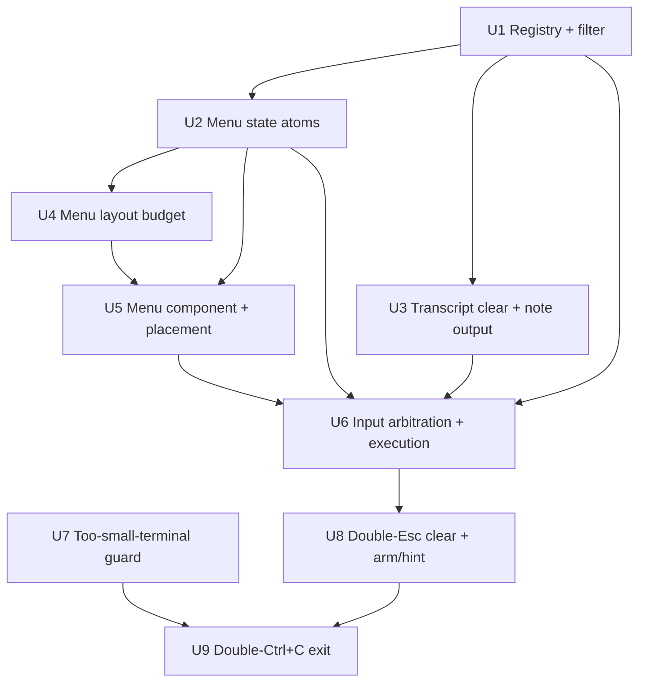

# feat: TUI slash-command system with autocomplete

## Summary

Add an extensible slash-command system to the Ink TUI. A command menu opens when the composer text starts with `/`, filters as the user types, and supports ↑/↓ navigation, Tab to complete, Enter to run, and Esc to dismiss. The implementation reuses the existing exit path (`/exit`), transcript rendering (`/clear`, `/help`), and the composer's inline hint row (unknown-command feedback), and fits the menu into the existing bottom-anchored layout budget — the body reflows to make room and the text cursor keeps landing on the input row.

---

## Problem Frame

The composer sends every submitted line straight to the backend; there is no way to run in-session meta-actions, and `/exit`/`/clear` are advertised in the status bar but unwired (see origin: `docs/brainstorms/2026-07-03-tui-slash-command-system-requirements.md`). This is the first keyboard-navigable menu in the TUI — no prior art exists to extend.

---

## Requirements

**Command registry**
- R1. Commands are defined in an extensible registry (name + description); adding a command is a single registry entry with no changes to input plumbing or menu rendering.
- R2. The v1 registry contains exactly `/exit`, `/clear`, and `/help`.

**Autocomplete menu**
- R3. When the composer starts with `/`, a menu appears directly above the composer showing each matching command's name and description; the body area reflows to make room so no content is overlapped or pushed off-screen.
- R4. Typing after `/` filters the list; one item is always highlighted.
- R5. ↑/↓ move the highlight; Tab completes the highlighted command into the composer without executing; Enter executes the highlighted command; Esc dismisses the menu without discarding the typed text.
- R6. The menu closes when the composer no longer starts with `/`, or when dismissed with Esc until the text is edited again.

**Command execution**
- R7. `/exit` quits KQode via the same teardown + exit-summary card as Ctrl+C.
- R8. `/clear` clears all transcript/body content and resets the in-memory prompt history and scroll position.
- R9. `/help` lists the available commands and descriptions in the transcript body.
- R10. Commands execute client-side and are never sent to the backend.

**Unknown / fallback handling**
- R11. Submitting a `/`-prefixed string that matches no command shows an inline hint and is not sent to the backend.
- R12. Submitting text that does not start with `/` behaves exactly as today.

**Small-terminal handling** *(added post-brainstorm at user request; not from origin)*
- R13. When the terminal height is below the minimum usable rows (`MIN_ROWS`), the TUI shows a centered notice asking the user to enlarge or maximize the terminal instead of the cramped home screen, and recovers automatically when the terminal is enlarged.

**Two-step key confirmations** *(added post-brainstorm at user request; not from origin)*
- R14. Pressing Esc twice clears the composer input. When the composer has text and the menu is **not** open, the first Esc arms the action and the status bar shows `esc again to clear input`; the second Esc clears the input. (When the menu is open, the first Esc dismisses the menu per R5.)
- R15. Pressing Ctrl+C twice exits KQode via the existing teardown / exit-summary path. The first Ctrl+C arms the action and the status bar shows `ctrl+c again to exit`; the second Ctrl+C exits. This replaces Ink's single-press `exitOnCtrlC` and works in every state (including the too-small notice and while the backend is loading).

**Origin acceptance examples:** AE1 (covers R3, R4), AE2 (covers R5, R8), AE3 (covers R5), AE4 (covers R7), AE5 (covers R11).

---

## Scope Boundaries

- No `@` mention or `?` help affordances (separate features).
- No command arguments in v1 (the `/clear [prompt]`-style hint); commands are argument-free.
- No backend-routed commands or backend session-reset RPC — the backend is a stateless ACK with no session/history.
- No escape hatch to send literal `/`-leading text to the backend (accepted tradeoff of the reference UX).
- No fuzzy ranking beyond prefix matching.
- The Ctrl+C exit path is unchanged.
- Too-narrow (low-column) terminals are out of scope for the notice — the header already degrades via `HIDE_HEADER_BELOW_COLUMNS` / `COMPACT_HEADER_BELOW_COLUMNS`; the U7 guard is height-only per the request.

### Deferred to Follow-Up Work

- Loading commands from markdown/config (see `docs/features/r071_custom_slash_commands_from_markdown_or_config.md`): the registry is shaped to allow it, but v1 hard-codes the three commands.

---

## Context & Research

### Relevant Code and Patterns

- **Input hook (the one place existing behavior changes):** `tui/src/components/PromptComposer/usePromptComposerInput.ts`. Single `useInput` with strict branch order (mouse → newline → ←/→ → Enter-submit → backspace/delete → Tab → printable). Tab is currently a no-op; ↑/↓ and Esc are unclaimed. Newline is produced by `MODIFIED_ENTER_INPUTS` (`tui/src/components/PromptComposer/constants.ts`), `key.shift/ctrl/meta`, and a trailing `\` + bare Enter — all load-bearing.
- **Composer state:** `tui/src/state/composer/atoms.ts` (`composerStateAtom`, `insertComposerTextAtom`, `clearComposerAtom`, `setComposerValidationErrorAtom`). `insertComposerTextAtom`/`deleteComposerBackwardAtom` recompute `validationError` on every edit, so a message set into that slot auto-clears on the next keystroke.
- **Transcript:** `tui/src/state/backend/atoms.ts` (`promptQueueAtom`, `enqueuePromptAtom`, scroll reset via `bodyScrollOffsetRowsAtom`) and `tui/src/state/backend/bodyEntries.ts` (`QueueItem`, `queueToBodyEntries`; `BodyEntry.kind: 'info'` renders as an assistant-style line). `queueToBodyEntries` already routes text through `sanitizeDisplayText`.
- **Layout / cursor:** `tui/src/state/homeScreen/layout.ts` (`resolveHomeScreenLayout`), `tui/src/state/homeScreen/atoms.ts` (`layoutAtom`, `bottomSpacerRowsAtom`, `composerTopAtom = rows - 1 - composerRows`), `tui/src/components/PromptComposer/cursorPosition.ts`. The validation-error row (`COMPOSER_ERROR_RESERVE_ROWS`) is the precedent for a composer-tied extra row.
- **Exit:** `tui/src/components/exitSummary/finishSession.ts`, resolved via `useApp().exit()` → `waitUntilExit().finally(...)` in `tui/src/cli/kqodeCli.tsx`.
- **Constants/enums:** `as const` object + companion type (e.g. `BackendLifecycleState` in `tui/src/backend/client/backendClient.ts`); numeric UX knobs in `tui/src/constants/ui.ts`.
- **Component folder + tests:** `tui/src/components/PromptComposer/` (index re-exports pure helpers); tests via `tui/src/test/renderWithJotai.tsx` + `tui/src/test/flushInput.ts`; keystrokes written as raw escape sequences (arrows `\u001B[A/B`, Esc `\u001B`, Tab `\t`, Enter `\r`), `await flushInput()` after each write; viewport pinned with `columnsTestOverrideAtom`/`rowsTestOverrideAtom`.
- **Theme:** `tui/src/theme/themeConfig.ts` (`foreground`, `muted`, `accentBlue` [unused], `messageBackground`/`inputBackground`, `errorRed`).

### Institutional Learnings

- `docs/solutions/architecture-patterns/backend-process-lifecycle-ownership-in-the-ink-tui.md` — layering guardrail (`tui/src/__tests__/backendIsolation.test.ts`): `state/**` and `components/**` must not import backend process/launch code. Commands are client-side, so this holds.
- `tui/AGENTS.md` — bottom-stuck layout, `FULLSCREEN_GUARD_ROWS`, `incrementalRendering: true`, keep glyphs out of the final column, and re-verify cursor placement after any vertical-layout change. This is greenfield; capture with `/ce-compound` afterward.

### External References

- None. Internal TUI feature with strong local patterns (Ink `useInput`, Jotai atoms); external research not warranted.

---

## Key Technical Decisions

- **Menu-open is derived, not a stored flag:** open ⟺ composer text starts with `/` AND input not locked AND not Esc-dismissed. It does **not** require ≥1 match — at zero matches the menu stays open showing a non-actionable "No matching commands" row, so the keyboard mode never switches invisibly (review: design-lens).
- **Default highlight is the first menu item — non-destructive-default SUPERSEDED (2026-07-05):** originally the registry was ordered `/help`, `/clear`, `/exit` so a reflexive Enter on a just-typed `/` ran `/help` (harmless), never a destructive command (review: design-lens P1). Superseded during implementation: `COMMAND_REGISTRY` (`tui/src/libs/commands/registry.ts`) sorts alphabetically for a predictable display order as more commands are added, so index 0 is `/clear` and a reflexive `/`+Enter clears the transcript — an accepted tradeoff (the menu always highlights the first item; the non-destructive-default guarantee no longer holds).
- **Menu rows budgeted above the composer, clamped to fit:** the menu renders as a sibling directly above the composer; its rows come from `bottomSpacerRowsAtom` first, then the body (which reflows/shrinks), and are **clamped to the rows actually free above a one-row-minimum body** so the total never exceeds the canvas even at `MIN_ROWS` (review: feasibility). `composerTopAtom` stays `rows - 1 - composerRows`, so the cursor stays on the input row; the body scroll offset is re-clamped when the panel opens or closes.
- **Esc dismisses the menu but keeps the typed text:** via a `commandMenuDismissedAtom` reset on the next edit — reconciles R5 and avoids destroying a half-typed command (review: design-lens). This also makes the menu-closed submit branch reachable (dismissed + Enter), resolving the "dead branch" concern (review: coherence).
- **Unknown-command hint reuses `validationError`:** set via `setComposerValidationErrorAtom`; gets row reservation and auto-clear-on-edit for free. Softer, non-`ERROR:` styling is deferred (review: design-lens, FYI).
- **`/help` renders one transcript row per command:** a non-backend `QueueItem` with `kind: 'note'` (state `'settled'`, skipped by the drain loop) whose text `queueToBodyEntries` maps to **one `info` `BodyEntry` per line** — `info` rows flow through `toAssistantRows`→`wrapBodyText` without `preserveHardLines`, so a single multi-line entry would flatten to one run-on line (review: feasibility). Ordering is automatic and `/clear` clears it; text still routes through `sanitizeDisplayText`.
- **Every command clears the composer after executing** (not just `/clear`), so `/help` closes the menu and empties the input per origin flow F1 (review: coherence).
- **`/exit` calls `useApp().exit()`** — no new teardown; `finishSession` runs via the existing `waitUntilExit().finally(...)`.
- **Command IDs as `as const` + companion type**; registry declarative (R1). Menu arbitration lives in the composer's single `useInput`, branching on menu state (no second `useInput`, avoiding double-handled keys).
- **Filtering:** the query is trimmed and case-folded, then prefix-matched on the command name, so `/clear ` (trailing space) still matches; the menu-closed submit path reuses the same matcher. The highlight resets to the top whenever the match set changes — including on backspace — and is clamped to range.
- **Two-step confirmations use a dedicated `armedActionAtom`, not `statusHintAtom`:** arming shows a status-bar hint but must **not** lock input (`inputLockedAtom` stays derived from `statusHintAtom` only), so the user can press the key again or type to cancel. The atom disarms on any other key; a timeout-based auto-disarm is deferred.
- **Esc is layered:** menu-open → dismiss the menu; otherwise double-press → clear the composer input (R14).
- **Ctrl+C handled globally with `exitOnCtrlC: false`:** in raw mode Ink delivers Ctrl+C as the `\x03` byte (not SIGINT), so a top-level `useGlobalKeys` in `App` catches it and drives the double-press — staying active in the too-small state and during backend loading. The second press calls `useApp().exit()` (same teardown as `/exit`).

---

## Open Questions

### Resolved During Planning

- Menu placement / cursor math: sibling above the composer, rows taken from spacer→body; `composerTop` unchanged (see Key Technical Decisions).
- Filtering algorithm / highlight reset: trimmed, case-insensitive prefix; highlight resets-to-top + clamps when the match set changes (typing or backspace).
- Enter disambiguation: when the menu is open, a clean bare Enter executes the highlighted command inside the input hook *before* the submit branch; modified/CSI-u/backslash Enters still insert newlines.
- Zero-match behavior: the menu stays open with a "No matching commands" row (no invisible mode switch). (Non-destructive-default superseded — the default highlight is now the first item, `/clear`; see Key Technical Decisions.)
- Esc: dismisses the menu via a reset-on-edit flag while keeping the typed text.

### Deferred to Implementation

- Highlight styling (accent color vs. inverted row) and whether to add a compact key-hint row (`↑↓ navigate · Tab complete · Enter run · Esc cancel`) for discoverability (review: design-lens, FYI).
- Whether ↑/↓ wrap at the ends or clamp (v1: clamp).
- Exact `/help` text layout (column alignment of name vs. description).
- Paste handling: how a pasted `/clear\n` or multi-line paste is treated by the printable-input branch (review: design-lens).
- Whether Tab-complete earns its place in argument-free v1, where Tab-then-Enter is two keystrokes to Enter's one — revisit when command arguments exist (review: design-lens).
- Reach of Success Criterion 2: whether "only a registry entry" covers command *behavior* (a new side effect still edits `executeCommand`) or only registration/menu/filtering (review: scope-guardian).

---

## Output Structure

    tui/src/state/commands/
      index.ts             # barrel
      registry.ts          # CommandId (as const) + CommandDefinition + COMMAND_REGISTRY
      filterCommands.ts    # pure prefix filter
      atoms.ts             # menu state (query/matches/highlight/open/rows) + actions
      executeCommand.ts    # pure dispatch: CommandId + injected actions -> side effect
      __tests__/
        filterCommands.test.ts
        atoms.test.ts
        executeCommand.test.ts
    tui/src/components/SlashCommandMenu/
      index.tsx            # menu view (renders filtered list w/ highlight)
      __tests__/
        SlashCommandMenu.test.tsx
    tui/src/components/
      TerminalTooSmall.tsx # too-small-terminal notice (U7)
    tui/src/state/global/
      keyArm.ts            # armedActionAtom (null | 'clear-input' | 'exit') for two-step confirmations (U8)
    tui/src/
      useGlobalKeys.ts     # always-active Ctrl+C double-press → exit (U9)

---

## High-Level Technical Design

> *This illustrates the intended approach and is directional guidance for review, not implementation specification. The implementing agent should treat it as context, not code to reproduce.*

**Key arbitration in the composer's single `useInput`** (`menu open` = text starts with `/` AND not locked AND not Esc-dismissed; at zero matches the menu shows a "No matching commands" row):

| Key | Menu open | Menu closed |
|-----|-----------|-------------|
| ↑ / ↓ | Move highlight (clamp) | No-op (unhandled today) |
| Tab | Complete highlighted command into composer (stays open) | No-op (current behavior) |
| Enter — clean bare | Execute highlighted command (if any), then clear composer | Resolve submit → command / unknown hint / send to backend |
| Enter — shift·ctrl·meta·CSI-u·trailing `\` | Insert newline (unchanged) | Insert newline (unchanged) |
| Esc | Dismiss menu, keep typed text | No-op |
| Printable / Backspace | Edit text → menu re-filters, highlight resets to top, clears dismissed flag | Edit text |

**Row budget (menu open):** rendered top-to-bottom as `Header · Body · spacer · Cwd · CommandMenu · Composer · Status`. `commandMenuRows` is taken from the spacer first, then the body (which reflows/shrinks), and is clamped so the body never drops below one row — guaranteeing total rendered rows ≤ canvas even at `MIN_ROWS`, with no fullscreen re-entry. `composerTop = rows − 1 − composerRows` is unaffected, so the cursor stays on the input row; the body scroll offset re-clamps to the smaller body.

**Submit resolution (menu-closed Enter, e.g. after Esc-dismiss):** normalize the token (trim + case-fold) and match via the same `filterCommands` matcher → execute on a name match (then clear the composer), else set the unknown-command hint (not sent to backend); non-`/` text enqueues to the backend as today.

**Unit dependency graph:**

---

## Implementation Units

### U1. Command registry and filtering (pure core)

**Goal:** Define the extensible command registry and the pure prefix filter used by the menu, help output, and execution.

**Requirements:** R1, R2, R4

**Dependencies:** None

**Files:**
- Create: `tui/src/state/commands/registry.ts`
- Create: `tui/src/state/commands/filterCommands.ts`
- Create: `tui/src/state/commands/index.ts`
- Modify: `tui/src/constants/ui.ts` (add `MAX_COMMAND_MENU_ROWS` — a forward-looking cap; inert with three commands today, exercised once the deferred markdown/config feature adds more)
- Test: `tui/src/state/commands/__tests__/filterCommands.test.ts`

**Approach:**
- `CommandId` as an `as const` object + companion type (mirror `BackendLifecycleState`). `CommandDefinition = { id, name (e.g. '/help'), description }`. `COMMAND_REGISTRY` contains exactly the three commands, sorted alphabetically (`/clear`, `/exit`, `/help`) for a stable display order as commands are added — so the default-highlighted (index 0) entry is `/clear`. (Superseded: the original plan ordered `/help` first for a non-destructive default; see Key Technical Decisions.)
- `filterCommands(query)`: trim and case-fold the query, strip a single leading `/` if present, prefix-match on the name-without-slash; empty query returns all in registry order. (Trimming lets `/clear ` still match.)

**Patterns to follow:** `as const`+type enum (`tui/src/backend/client/backendClient.ts`); scalar constants in `tui/src/constants/ui.ts`.

**Test scenarios:**
- Happy: `filterCommands('')` returns all three sorted alphabetically `/clear`, `/exit`, `/help`. (Covers AE1)
- Happy: `filterCommands('cl')` → `[clear]`. (Covers AE1)
- Edge: `filterCommands('CL')` case-insensitive → `[clear]`.
- Edge: `filterCommands('clear ')` (trailing space) and `filterCommands('/clear')` (leading slash) → `[clear]`.
- Edge: `filterCommands('zzz')` → `[]`.
- Happy: registry has exactly ids `exit`/`clear`/`help`, each with a non-empty description. (Covers R1, R2)

**Verification:** Filter and registry importable from `@state/commands/index.ts`; all filter tests pass.

---

### U2. Command-menu state atoms

**Goal:** Derive menu open/matches/highlight/height from composer text so the view and input hook share one source of truth.

**Requirements:** R3, R4, R5 (nav state), R6

**Dependencies:** U1

**Files:**
- Create: `tui/src/state/commands/atoms.ts`
- Modify: `tui/src/state/commands/index.ts` (extend barrel)
- Test: `tui/src/state/commands/__tests__/atoms.test.ts`

**Approach:**
- Derived: `commandMenuQueryAtom` (text after `/`, else null), `commandMenuMatchesAtom` (`filterCommands`), `commandMenuOpenAtom` (starts-with-`/` AND `!inputLockedAtom` AND `!commandMenuDismissedAtom` — **not** gated on matches), `highlightedCommandAtom` (`matches[clampedIndex]`, or `undefined` at zero matches), `commandMenuDesiredRowsAtom` (0 when closed; `min(matches.length, MAX_COMMAND_MENU_ROWS)` when matches>0; `1` for the "No matching commands" row when open with zero matches). The final rendered height is clamped in U4.
- State + actions: `commandMenuHighlightIndexAtom`; `commandMenuDismissedAtom` (boolean; Esc sets it, any composer edit clears it); `moveCommandHighlightAtom(delta)` (clamp to `[0, matches-1]`); `resetCommandHighlightAtom` (to 0). Return same reference on no-op (repo convention).

**Patterns to follow:** derived read-only atoms (`inputLockedAtom`, `layoutAtom`); write-only actions returning same-state on no-op (`clearComposerAtom`); `createStore` tests (`tui/src/state/backend/__tests__/atoms.test.ts`).

**Test scenarios:**
- Happy: text `/` → open true, matches = all (alphabetical `/clear`, `/exit`, `/help`), highlight 0 = `/clear`.
- Happy: text `/cl` → matches `[clear]`, highlighted = clear.
- Edge: text `hello` → open false; text `/zzz` → open **true** with zero matches, `highlightedCommand` undefined, `commandMenuDesiredRows` = 1. (Covers R6)
- Edge: `commandMenuOpenAtom` false when `inputLockedAtom` true, or when `commandMenuDismissedAtom` true, even if text starts with `/`.
- Edge: setting `commandMenuDismissedAtom` then editing the text clears it (menu reopens).
- Happy: `moveCommandHighlight(+1)` past end clamps at last; `(-1)` past start clamps at 0.
- Edge: highlight resets to 0 when the match set changes (typing or backspace).
- Happy: `commandMenuDesiredRowsAtom` = matches count (matches>0), `1` at zero matches, `0` when closed.

**Verification:** Menu state fully derivable from composer text + lock state in `createStore` tests.

---

### U3. Transcript clear and command-output data layer

**Goal:** Provide `/clear` (reset transcript) and `/help` (append a client-side note entry) at the state layer.

**Requirements:** R8, R9

**Dependencies:** U1

**Files:**
- Modify: `tui/src/state/backend/bodyEntries.ts` (`QueueItem.kind?: 'prompt' | 'note'`; `queueToBodyEntries` maps a note to **one `info` `BodyEntry` per line**, splitting on `\n`)
- Modify: `tui/src/state/backend/atoms.ts` (`clearTranscriptAtom`, `appendHelpAtom`)
- Test: `tui/src/state/backend/__tests__/atoms.test.ts`

**Approach:**
- `clearTranscriptAtom`: set `promptQueueAtom = []`, `submittedPromptEntriesAtom = []`, `bodyScrollOffsetRowsAtom = 0`.
- `appendHelpAtom`: push a `{ state: 'settled', kind: 'note', text }` item whose `text` is one `name — description` line per command (joined with `\n`, built from `COMMAND_REGISTRY`), then re-sync body entries + reset scroll. `queueToBodyEntries` splits it into one `info` row per command — a single multi-line `info` entry would flatten because `toAssistantRows`→`wrapBodyText` runs without `preserveHardLines`. The drain loop's `findActive` only matches `'active'`, so notes are never sent to the backend.

**Patterns to follow:** write-only action atoms + `syncBodyEntries` (`tui/src/state/backend/atoms.ts`); reset pattern from `enqueuePromptAtom` (`bodyScrollOffsetRowsAtom → 0`).

**Test scenarios:**
- Happy: `clearTranscriptAtom` empties queue + submitted entries + resets scroll to 0. (Covers R8, AE2)
- Happy: `appendHelpAtom` yields **one `info` body entry per command** (row count == command count), each with the name + description. (Covers R9)
- Edge: a note item is not returned by the active-finder and triggers no backend submit.
- Integration: prompt then `appendHelp` preserves order (prompt entry precedes help note); `clearTranscript` afterward removes both.

**Verification:** Atom tests confirm reset and help-note behavior with no backend interaction.

---

### U4. Menu layout-row budgeting

**Goal:** Reserve the menu's rows from the layout budget so it renders above the composer, the body reflows to make room, the cursor stays put, and the canvas is never exceeded.

**Requirements:** R3

**Dependencies:** U2

**Files:**
- Modify: `tui/src/state/homeScreen/layout.ts` (`resolveHomeScreenLayout` accepts `commandMenuRows`, reflows/reduces the body budget)
- Modify: `tui/src/state/homeScreen/atoms.ts` (add `commandMenuRowsAtom` = `min(commandMenuDesiredRows, free rows above a one-row-minimum body)`; `layoutAtom` passes it; `bottomSpacerRowsAtom` subtracts it; re-clamp `bodyScrollOffsetRowsAtom` against the reflowed body)
- Test: `tui/src/state/homeScreen/__tests__/layout.test.ts`

**Approach:**
- `commandMenuRowsAtom` clamps the desired height (U2) to the rows actually free above a one-row-minimum body, so the menu is truncated/suppressed rather than overflowing at small sizes. Thread it into `resolveHomeScreenLayout` so the body reflows (shrinks) once the spacer is exhausted; subtract it in `bottomSpacerRowsAtom` so the spacer absorbs the menu first. When the panel opens/closes, re-clamp the body scroll offset to the new max so the visible window stays valid. Do **not** touch `composerTopAtom`.

**Patterns to follow:** existing `resolveHomeScreenLayout` fixed-row math and `bottomSpacerRowsAtom` clamping (`tui/src/state/homeScreen/atoms.ts`).

**Test scenarios:**
- Happy: short transcript → menu comes from the spacer; `bodyRows` unchanged, `bottomSpacerRows` drops by the menu height.
- Edge: tall transcript (no spare) → body reflows: `bodyRows` shrinks by the menu rows; `bodyRows ≥ 1`, spacer ≥ 0.
- Edge (canvas guard): at `MIN_ROWS` with the menu open, `header + body + spacer + gap + cwd + menu + composer + status ≤ rows` — the menu height is clamped so total never exceeds the canvas (not merely "no value is negative").
- Edge: when the body reflows smaller, an out-of-range `bodyScrollOffsetRows` re-clamps to the new max.
- Invariant: `composerTop` equals `rows − 1 − composerRows` regardless of `commandMenuRows`. (Covers R3; cursor invariant)

**Verification:** Layout tests confirm total rendered rows ≤ canvas (including `MIN_ROWS` with the menu open), the body reflows to make room, and the `composerTop` invariant holds across sizes.

---

### U5. SlashCommandMenu component and placement

**Goal:** Render the filtered command list with a highlighted row, directly above the composer, only when the menu is open.

**Requirements:** R3, R5 (visual), R6

**Dependencies:** U2, U4

**Files:**
- Create: `tui/src/components/SlashCommandMenu/index.tsx`
- Modify: `tui/src/components/HomeScreen/HomeScreenView.tsx` (render `<SlashCommandMenu />` between the cwd line and the composer)
- Test: `tui/src/components/SlashCommandMenu/__tests__/SlashCommandMenu.test.tsx`

**Approach:**
- Read `commandMenuOpenAtom` / `commandMenuMatchesAtom` / `commandMenuHighlightIndexAtom` / `commandMenuRowsAtom`; render nothing when closed. One row per command (`name` + description); at zero matches render a single non-actionable "No matching commands" row. **Truncate** each row's text to `columns − 1` (not just `padEnd`) so a long name+description never wraps to a second row and blows the row budget; keep the final column clear (per `tui/AGENTS.md`). Highlighted row styled with `accentBlue` (or inverted against `messageBackground`).

**Patterns to follow:** presentational component reading atoms (`StatusBar.tsx`, `ComposerFrame.tsx`); theme tokens via `theme.colors.*`.

**Test scenarios:**
- Happy: open with all matches renders one row per command with name + description. (Covers R3)
- Happy: highlighted index renders with the distinct style; others plain. (Covers R5 visual)
- Edge: zero matches renders exactly one "No matching commands" row (menu stays visible).
- Edge: renders nothing when text is empty or does not start with `/`. (Covers R6)
- Edge: a name+description wider than the terminal is truncated to one row (no wrap) and no glyph lands in the final column.
- Integration (pinned viewport via override atoms): typing `/` shows the menu ordered directly above the composer. (Covers AE1)

**Verification:** Menu renders/hides correctly and appears above the composer at a pinned viewport.

---

### U6. Input arbitration and command execution

**Goal:** Wire menu keys and command execution into the composer's input hook, add the unknown-command hint, and preserve all existing input behavior.

**Requirements:** R5, R7, R8, R9, R10, R11, R12

**Dependencies:** U1, U2, U3, U5

**Files:**
- Modify: `tui/src/components/PromptComposer/usePromptComposerInput.ts` (menu-open branch before the Enter-submit/Tab branches; submit resolution)
- Create: `tui/src/state/commands/executeCommand.ts` (pure dispatch: `CommandId` + `{ exit, clearTranscript, showHelp }` → side effect)
- Modify: `tui/src/components/PromptComposer/index.tsx` (wire `useApp().exit`, `clearTranscriptAtom`, `appendHelpAtom` into execution)
- Test: `tui/src/state/commands/__tests__/executeCommand.test.ts`
- Test: `tui/src/__tests__/components/PromptComposer.test.tsx` (extend)

**Approach:**
- When the menu is open: ↑/↓ → `moveCommandHighlight`; Tab → complete the highlighted command into the composer (stay open); clean bare Enter → `executeCommand(highlighted)` **then `clearComposer`** (so `/help` closes the menu and empties the input per F1); Esc → set `commandMenuDismissedAtom` (keep the text). Printable input **and backspace** re-filter, reset the highlight to the top, and clear the dismissed flag. All newline paths (`MODIFIED_ENTER_INPUTS`, `key.shift/ctrl/meta`, trailing `\`) remain intact and take precedence. When the menu is open with zero matches, Enter falls through to the unknown-command hint.
- Menu-closed submit (e.g. after Esc-dismiss): normalize the token and match via `filterCommands` → `executeCommand` on a name match (then `clearComposer`), else `setComposerValidationErrorAtom('Unknown command: <token>')` and do not enqueue; non-`/` text enqueues as today.
- `executeCommand({ exit, clearTranscript, showHelp })`: `Exit` → `exit`; `Clear` → `clearTranscript`; `Help` → `showHelp`. The composer clear is applied by the caller for every command (not inside the switch). Keep the hook under ~200 lines by extracting the menu-key mapping into a helper.

**Execution note:** Add a failing keystroke-simulation test for "Enter executes the highlighted command" first, then wire the branch.

**Patterns to follow:** existing branch order + `isMouseInput` early return (`usePromptComposerInput.ts`); `useApp` teardown via `finishSession` (`kqodeCli.tsx`); keystroke tests with `renderWithJotai` + `flushInput` (`PromptComposer.test.tsx`).

**Test scenarios:**
- Happy: typing `/` does not submit; `↓` then Enter executes the second command (`/clear`). (Covers R5)
- Happy: Tab completes the highlighted command into the composer without executing; menu stays open. (Covers AE3, R5)
- Happy: Enter on highlighted `/clear` invokes `clearTranscript` and clears the composer. (Covers AE2, R8)
- Happy: Enter on highlighted `/exit` invokes the injected exit callback. (Covers AE4 — finishSession teardown covered by existing exitSummary tests)
- Happy: Enter on highlighted `/help` invokes `appendHelp` **and clears the composer so the menu closes**. (Covers R9; origin F1)
- Safety (SUPERSEDED 2026-07-05): the original design highlighted `/help` by default so a reflexive Enter could not run a destructive command (review: design-lens P1). The registry now sorts alphabetically, so the default highlight is `/clear` and a reflexive `/`+Enter clears the transcript; the `PromptComposer.test.tsx` case `runs the default-highlighted /clear on Enter and clears the transcript` encodes this accepted behavior. (see Key Technical Decisions)
- Happy: Esc dismisses the menu but **leaves the typed text intact**; typing again reopens it. (Covers R5)
- Edge: submitting `/clear ` (trailing space) executes `/clear` — the normalized matcher accepts what the menu accepted. (review: design-lens)
- Error path: submitting `/zzz` sets the unknown-command hint and does not enqueue to the backend. (Covers AE5, R11)
- Happy: submitting `hello` enqueues to the backend as today. (Covers R12)
- Regression: Shift+Enter / CSI-u modified Enter / trailing-`\`+Enter insert a newline even when text starts with `/`.
- Edge: typing **or backspacing** while the menu is open re-filters and resets the highlight to the top.

**Verification:** Command keys behave per the arbitration table; unknown/non-slash paths behave per R11/R12; existing newline/submit/mouse behavior unchanged; cursor still lands on the composer text row with the menu open (verify at a pinned viewport).

---

### U7. Too-small-terminal guard

**Goal:** When the terminal is too short to render the home screen usably, show a centered notice asking the user to enlarge/maximize the window instead of a cramped, overflowing UI; recover automatically on resize.

**Requirements:** R13

**Dependencies:** None (App-level branch, independent of the command units; complements U4's `MIN_ROWS` clamp, which handles the tight-but-usable boundary)

**Files:**
- Modify: `tui/src/state/global/dimensions.ts` (add `terminalTooSmallAtom` derived from `windowRowsAtom` vs the minimum usable height)
- Create: `tui/src/components/TerminalTooSmall.tsx` (centered notice)
- Modify: `tui/src/App.tsx` (render `<TerminalTooSmall />` instead of `<HomeScreen />` when too small)
- Test: `tui/src/state/global/__tests__/dimensions.test.ts` (create or extend), `tui/src/__tests__/App.test.tsx` (extend)

**Approach:**
- `terminalTooSmallAtom`: true when `windowRowsAtom` is defined and below the minimum usable height (`MIN_ROWS`, accounting for `FULLSCREEN_GUARD_ROWS`); false while the size is still unmeasured (`undefined`) so the app does not flash the notice at startup. Reuse the `rowsTestOverrideAtom` path for deterministic tests.
- `App` reads the atom and renders `<TerminalTooSmall />` — a centered `Box`/`Text` (e.g. "Terminal too small — please enlarge or maximize the window (needs at least N rows).") — instead of `<HomeScreen />`. No input hooks mount in this state; `useWindowSize` keeps updating the size atoms, so enlarging the terminal flips back to the home screen automatically.
- Keep the notice minimal and static; height-only per the request (narrow width already degrades via the header breakpoints).

**Patterns to follow:** derived atoms + `__TEST__` override (`tui/src/state/global/dimensions.ts`); atom-driven conditional render (`App.tsx`); theme tokens (`theme.colors.muted` / `warning`).

**Test scenarios:**
- Happy: `windowRows` comfortably ≥ the threshold → `App` renders the home screen, not the notice.
- Happy: `windowRows` below the threshold → `App` renders the notice with enlarge/maximize guidance; the home-screen composer/body do not render. (Covers R13)
- Edge: `windowRows` undefined (pre-measure) → not flagged too-small (no startup flash).
- Edge: resizing from below-threshold to above flips the notice off and restores the home screen (atom re-derives on `windowRows` change).

**Verification:** Below the threshold the notice shows and no home-screen chrome/input renders; enlarging the terminal restores the normal UI without a restart.

---

### U8. Two-step Esc to clear the composer (+ arm state + status hint)

**Goal:** Add the shared "press-again" arm state and status-bar hint, and make a second Esc clear the composer input (first Esc arms it with an `esc again to clear input` hint) — without regressing menu-dismiss or newline behavior, and without locking input.

**Requirements:** R14

**Dependencies:** U6 (owns the composer Esc branch)

**Files:**
- Create: `tui/src/state/global/keyArm.ts` (`armedActionAtom`: `null | 'clear-input' | 'exit'`; write-only `disarmAtom`); extend `tui/src/state/global/index.ts` barrel
- Modify: `tui/src/constants/ui.ts` (add `PRESS_AGAIN_TO_CLEAR_HINT`, `PRESS_AGAIN_TO_EXIT_HINT`)
- Modify: `tui/src/components/StatusBar.tsx` (show the armed-action hint with priority over `statusHint`/default; must not touch `inputLockedAtom`)
- Modify: `tui/src/components/PromptComposer/usePromptComposerInput.ts` (Esc branch + disarm-on-other-key)
- Test: `tui/src/__tests__/components/StatusBar.test.tsx` (or extend), `tui/src/__tests__/components/PromptComposer.test.tsx` (extend)

**Approach:**
- `armedActionAtom` is separate from `statusHintAtom` so arming does **not** lock input (`inputLockedAtom` stays derived from `statusHintAtom`). StatusBar priority: armed hint > `statusHint` > default `/ commands …`.
- Esc in `usePromptComposerInput`: menu open → dismiss it (existing) and disarm; else composer has text and not armed → set `armedActionAtom='clear-input'`; else armed `'clear-input'` → `clearComposerAtom` + disarm; empty composer → no-op.
- Any other handled key (printable, backspace, arrows, Enter, Tab) disarms first (also clears the U9 `'exit'` arm). Ctrl+C (`key.ctrl && input==='c'`) is ignored here — U9's global hook owns it.

**Patterns to follow:** write-only action atoms (`clearComposerAtom`); StatusBar hint rendering (`tui/src/components/StatusBar.tsx`); keystroke tests (`PromptComposer.test.tsx`).

**Test scenarios:**
- Happy: with text and menu closed, Esc shows `esc again to clear input`; a second Esc clears the composer. (Covers R14)
- Edge: menu open → first Esc dismisses the menu (does not arm clear); text preserved.
- Edge: after arming, typing any character disarms (hint disappears) and inserts normally.
- Edge: empty composer + Esc → no-op, no hint.
- Invariant: arming does not set `inputLockedAtom` (composer stays interactive).

**Verification:** Double-Esc clears input with the interim hint; single Esc never clears; menu-dismiss and newline paths unchanged; input never locks from arming.

---

### U9. Two-step Ctrl+C to exit (global)

**Goal:** Replace Ink's single-press `exitOnCtrlC` with a double-press: first Ctrl+C arms with a `ctrl+c again to exit` hint, the second exits via the existing teardown — working in every state, including the too-small notice and while the backend is loading.

**Requirements:** R15

**Dependencies:** U8 (reuses `armedActionAtom` + the status-bar hint), U7 (must stay active in the too-small state)

**Files:**
- Modify: `tui/src/cli/kqodeCli.tsx` (`render(..., { incrementalRendering: true, exitOnCtrlC: false })`)
- Create: `tui/src/useGlobalKeys.ts` (always-active `useInput`: Ctrl+C arms `'exit'`, or exits on the second press via `useApp().exit`)
- Modify: `tui/src/App.tsx` (call `useGlobalKeys()` above the too-small branch so it runs in both states)
- Test: `tui/src/__tests__/App.test.tsx` (extend) / a `useGlobalKeys` test
- Verify: `tui/main.tsx` and `tui/packaged/entry.packaged.tsx` route through this single `render()` (or mirror `exitOnCtrlC:false` if either configures its own); `tui/src/bootstrap.ts` still restores the terminal on exit with `exitOnCtrlC:false`

**Approach:**
- In raw mode Ink delivers Ctrl+C as the `\x03` byte (not SIGINT), so with `exitOnCtrlC:false` a `useInput` handler receives it. `useGlobalKeys` (called in `App`, always mounted) handles it: if `armedActionAtom==='exit'` → `useApp().exit()` (→ `waitUntilExit().finally(finishSession)`, same teardown as `/exit`); else set `armedActionAtom='exit'`.
- Placing the hook in `App` (not the composer) keeps Ctrl+C working in the too-small state (U7) and while input is locked — it is not gated on `inputLockedAtom`.

**Patterns to follow:** `useApp` teardown via `finishSession` (`kqodeCli.tsx`); atom-driven hint (U8); `renderWithJotai` keystroke tests (Ctrl+C = `\u0003`).

**Test scenarios:**
- Happy: first Ctrl+C shows `ctrl+c again to exit` (no exit); second Ctrl+C invokes the exit callback. (Covers R15)
- Edge: Ctrl+C once, then a printable key → exit arm cleared (next Ctrl+C only re-arms, does not exit).
- Edge: Ctrl+C works in the too-small state (U7) and while input is locked.
- Regression: a single Ctrl+C no longer exits (`exitOnCtrlC:false`).

**Verification:** Double-Ctrl+C exits via the existing summary path from any state; single Ctrl+C only arms; the terminal is restored on exit.

---

## System-Wide Impact

- **Interaction graph:** one new branch in `usePromptComposerInput` (menu keys + Esc-clear), one new sibling render in `HomeScreenView`, one App-level branch (`App.tsx`) for the too-small notice, and a top-level `useGlobalKeys` (`App.tsx`) that handles Ctrl+C globally with `exitOnCtrlC:false`; layout atoms gain a `commandMenuRows` input that reflows the body, and the status bar gains an `armedActionAtom`-driven hint. No second composer `useInput` (avoids double-handled keys).
- **State lifecycle risks:** `/clear` during an in-flight drain is safe — `settleActive` maps over the now-empty queue (no-op). Opening/closing the panel re-clamps `bodyScrollOffsetRows` to the reflowed body. `armedActionAtom` disarms on the next key so a stale "press again" prompt can't linger into an unintended action.
- **API surface parity:** headless CLI and the backend contract are unaffected; commands are TUI-only and client-side (R10).
- **Composition-root sync:** the `exitOnCtrlC:false` render option lives where `render()` is configured (`kqodeCli.tsx`); keep `tui/main.tsx` and `tui/packaged/entry.packaged.tsx` in sync (the packaged entry is excluded from tsc/vitest, so drift is silent).
- **Unchanged invariants:** `composerTopAtom`/cursor math, `FULLSCREEN_GUARD_ROWS`, `incrementalRendering: true`, final-column reservation, and existing newline/submit/mouse behavior. The menu height is clamped to preserve these even at `MIN_ROWS`; below `MIN_ROWS` the too-small notice replaces the home screen (U7). The only exit-path change is single-press → double-press Ctrl+C; the teardown itself is unchanged.

---

## Risks & Dependencies

| Risk | Mitigation |
|------|------------|
| Cursor drifts off the composer row when menu rows are added | Budget menu rows above the composer only; `composerTop` untouched; explicit cursor-invariant test (U4) + pinned-viewport check (U6) |
| Fullscreen re-entry (Windows/WezTerm repaint) if rows exceed the canvas | Clamp menu height to the rows free above a one-row-minimum body (verified at `MIN_ROWS`); take rows from spacer→body; below `MIN_ROWS` show the too-small notice (U7); keep `FULLSCREEN_GUARD_ROWS` + `incrementalRendering` |
| A command name+description wider than the terminal wraps to 2 rows, exceeding the budget | Truncate menu row text to `columns − 1` so rendered rows == budgeted rows (U5) |
| Regressing the load-bearing Enter newline paths | Preserve `MODIFIED_ENTER_INPUTS` / modifier / trailing-`\` branches ahead of command Enter; regression tests (U6) |
| Double-handled keys | Single composer `useInput` branching on menu state; Ctrl+C owned solely by the global hook (composer ignores `\x03`) |
| Single Ctrl+C no longer exits (muscle memory) | First press shows `ctrl+c again to exit`; matches common tools (fish, Claude Code); documented in R15 |
| Packaged binary entry drifts from source on the `exitOnCtrlC` change | Mirror the render option across `tui/main.tsx` and `tui/packaged/entry.packaged.tsx` (U9) |
| "Press again" arm lingers or locks input | `armedActionAtom` is separate from `statusHintAtom` (no input lock) and disarms on the next key (U8) |

---

## Sources & References

- **Origin document:** `docs/brainstorms/2026-07-03-tui-slash-command-system-requirements.md`
- Related code: `tui/src/components/PromptComposer/usePromptComposerInput.ts`, `tui/src/state/backend/atoms.ts`, `tui/src/state/homeScreen/atoms.ts`, `tui/src/components/exitSummary/finishSession.ts`
- Related learning: `docs/solutions/architecture-patterns/backend-process-lifecycle-ownership-in-the-ink-tui.md`
- Forward-looking specs: `docs/features/r071_custom_slash_commands_from_markdown_or_config.md`
