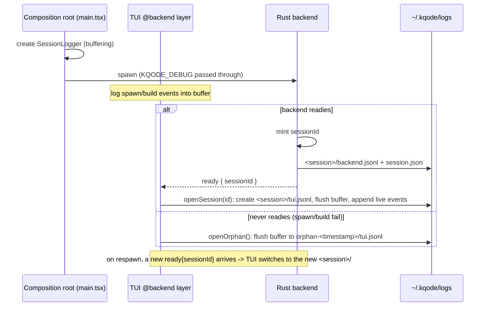

# feat: Per-Session TUI and Backend Debug Logs

## Summary

Give KQode a per-session, dual-sided debug log. On spawn the Rust backend mints a short session id, writes its transcript to `~/.kqode/logs/<session>/backend.jsonl` plus a `session.json` manifest, and announces the id on the existing `kqode.backend.ready` notification. The TUI — via a small hand-rolled JSONL appender owned by the composition root — buffers its early events, adopts the announced id, and writes `<session>/tui.jsonl` into the same directory. Both sides are gated by `KQODE_DEBUG` (on in dev, opt-in when packaged) and file-only. The TUI never sends logs to the backend; only the ~30-byte session id crosses the process boundary, once, backend → TUI.

---

## Problem Frame

The Rust side now logs the LLM transcript, but the TypeScript Ink TUI logs nothing, so frontend failures — a backend that never spawns or builds, a prompt that never streams, a notification that doesn't render, a crash on exit — leave no artifact and can't be lined up against the server's transcript for the same run (see origin: `docs/brainstorms/2026-07-05-per-session-tui-and-backend-debug-logs-requirements.md`).

---

## Requirements

Traced from the origin requirements doc.

**Session identity & correlation**
- R1. The backend generates a short, unique, filesystem-safe session id when it spawns.
- R2. The backend communicates the id to the TUI on the readiness signal (`kqode.backend.ready`); the TUI adopts it.
- R3. Session = one backend spawn; a respawn begins a new id/directory and the TUI switches to it.

**Log location & format**
- R4. Per-session directory `~/.kqode/logs/<session>/` with append-only `backend.jsonl` and `tui.jsonl` (each line timestamped with an event kind).
- R5. The backend log moves from daily-rolling to the per-session file; a standalone/headless backend run still logs (it owns its id regardless of a TUI).
- R6. A `session.json` manifest per directory (start time, KQode version, cwd, git repo/branch when available, OS, active model).

**TUI capture scope**
- R7. TUI logs backend-process lifecycle (spawn, source-mode build, readiness, dead/crash, respawn, dispose).
- R8. TUI logs user-initiated submits (captured at the backend seam) and their outcomes; pure-state events (queue transitions, slash commands, Esc-cancel) are deferred (see Scope Boundaries).
- R9. TUI logs streaming notifications it receives (`turnStart`/`turnEnd`/`turnError`), coalesced rather than per-token.
- R10. TUI logs UI-surfaced errors/warnings and session lifecycle (startup, terminal size, exit, exit-summary metrics).
- R11. Pre-readiness TUI events buffer in memory and flush to `<session>/tui.jsonl` once the id arrives; if the backend never readies, they flush to `orphan-<timestamp>/tui.jsonl`.

**Enablement & safety**
- R12. Both logs gated by `KQODE_DEBUG` (dev default on, packaged opt-in via `--debug`, `KQODE_DEBUG=0` disables); test harnesses set `KQODE_DEBUG=0` so tests never write to the real `~/.kqode/logs`.
- R13. File-only; nothing to stdout/stderr (the TUI owns stdout for Ink, the backend for JSON-RPC).
- R14. Secrets never written to either log, consistent with the existing transcript logging.

**Origin actors:** A1 developer (reads/zips a session dir), A2 Ink TUI (adopts id, writes `tui.jsonl`), A3 Rust backend (owns id, writes `backend.jsonl` + manifest).
**Origin flows:** F1 normal per-session logging, F2 backend never readies (orphan).
**Origin acceptance examples:** AE1 (ready → flush; covers R2, R11), AE2 (never-ready → orphan; covers R11), AE3 (respawn → new session; covers R3), AE4 (`KQODE_DEBUG=0` → no files; covers R12).

---

## Key Technical Decisions

- **Backend owns and announces the session id.** The backend generates the id on spawn and can open its own log immediately with no env plumbing; it is delivered by extending the currently parameterless `kqode.backend.ready` notification to carry `{ sessionId }`, kept in lockstep across `src/protocol.rs` and the TS contract. Rationale: the backend is the core runtime and the natural session owner (see origin Key Decisions).
- **Session = one backend spawn.** A respawn produces a new id and directory; the TUI switches its `tui.jsonl` target on each new readiness. Keeps id ownership with the backend and makes respawns explicit.
- **Backend log moves daily-rolling → per-session.** `debug_log::init` takes the session id and writes `<session>/backend.jsonl` (non-rolling appender) instead of `kqode.log.<date>`; the transcript line shape is unchanged. Because tests run with `KQODE_DEBUG=0`, the session directory may be created eagerly at enabled startup without polluting test runs.
- **TUI logger is a hand-rolled JSONL appender, owned by the composition root.** Created once in `tui/main.tsx` / the packaged entry and used directly by the `@backend` infrastructure layer and the exit path — no state-layer indirection and no new `@state` seam. This keeps the logger out of `src/state/**` and `src/components/**`, honoring the `backendIsolation.test.ts` guardrail (see `docs/solutions/architecture-patterns/backend-process-lifecycle-ownership-in-the-ink-tui.md`), and matches the file-only custom-writer choice already made on the Rust side. No third-party logger (`pino`/`winston`): Ink owns stdout and volume is tiny.
- **Buffer-then-flush with an orphan fallback.** The TUI buffers events until the id arrives, then flushes to `<session>/tui.jsonl`; if the backend never readies, it flushes to `orphan-<timestamp>/tui.jsonl` so spawn/build failures are still captured.
- **Coalesced streaming detail (default).** `tui.jsonl` logs `turnStart`, `turnEnd` (finish reason + delta count/length), and `turnError`, not every `tokenDelta`. An every-delta fidelity mode is a documented easy flip (Deferred to Follow-Up Work) if render-level debugging needs it.
- **Retention.** The backend prunes to the last ~20 session directories on startup (best-effort); exact N and mechanism are a tunable (Deferred to Implementation).
- **Gating mirrors the existing `KQODE_DEBUG` logic** on both sides (truthy wins; empty/unset → dev-default on, packaged off), so the two logs are enabled/disabled together. `--debug` already sets `KQODE_DEBUG=1` for the child and the allowlist already passes it through.

---

## High-Level Technical Design

> *This illustrates the intended approach and is directional guidance for review, not implementation specification. The implementing agent should treat it as context, not code to reproduce.*

---

## Implementation Units

Two phases: **Phase A** changes the Rust backend (U1–U2); **Phase B** builds the TUI logger and wiring (U3–U5).

### U1. Backend session identity, per-session log, and manifest

**Goal:** Mint a session id on spawn, write the transcript to `<session>/backend.jsonl`, write a `session.json` manifest, and prune old sessions.

**Requirements:** R1, R4, R5, R6, R14

**Dependencies:** None

**Files:**
- Modify: `src/debug_log.rs` (`init` takes a session id; write `<session>/backend.jsonl` non-rolling; create dir + manifest; prune), `src/backend.rs` (generate the id in `run_stdio`, pass it to `debug_log::init`)
- Create: `src/debug_log/session.rs` (session-id generation, `session.json` manifest, retention prune) — keep files ≤ ~200 lines
- Modify: `src/debug_log/tests.rs` (session-dir, manifest, prune, disabled)

**Approach:**
- Generate a short filesystem-safe id (format deferred to implementation) once at backend startup.
- `init(session_id)` resolves `~/.kqode/logs/<session>/` (honoring `KQODE_LOG_DIR`), opens `backend.jsonl` with a non-rolling appender, and writes `session.json` (start time, `CARGO_PKG_VERSION`, cwd, OS; git repo/branch and active model best-effort — deferred). The `TranscriptLayer` shape is unchanged.
- On startup, prune older session directories to the last ~20 (best-effort; never fatal).
- The backend always owns an id, so standalone/headless runs log normally; no `KQODE_SESSION_ID` env input is needed.

**Patterns to follow:** existing `src/debug_log.rs` `init`/`resolve_log_dir`/`MkdirWriter` and `src/debug_log/layer.rs`.

**Test scenarios:**
- Happy path: with logging enabled, a run creates `<session>/backend.jsonl` and `session.json`; the manifest contains start time, version, cwd, and OS.
- Happy path: two runs produce two distinct session directories.
- Edge case: retention keeps only the most recent N session directories.
- Covers AE4. Error path: with `KQODE_DEBUG=0`, no directory or file is created under the logs root.
- Integration: the transcript still contains request/response/error lines with no secret material.

**Verification:** A dev run writes a self-describing session directory with the transcript; disabled runs and tests write nothing.

---

### U2. Announce the session id on readiness (protocol change)

**Goal:** Extend `kqode.backend.ready` from parameterless to carry `{ sessionId }`, in lockstep across Rust and TypeScript.

**Requirements:** R2

**Dependencies:** U1

**Files:**
- Modify: `src/protocol.rs` (add `BackendReadyParams { session_id }`; keep the method-name constant), `src/backend.rs` (`announce_ready` sends the id)
- Modify: `tui/src/contracts/backend/messages.ts` (add the ready-params type + doc note), `tui/src/backend/protocol/messageProtocol.ts` (`backendReadyNotification`: `NotificationType0` → `NotificationType<BackendReadyParams>`)
- Modify: `tests/message_submit.rs` (ready frame now carries params), `tui/src/backend/client/__tests__/backendClient.test.ts` (fake backend sends `{ sessionId }`)

**Approach:** Define the shared `{ sessionId }` shape on both sides (camelCase on the wire, `serde(rename_all="camelCase")` in Rust). `announce_ready` takes the id minted in U1. This is a contract change to a currently-parameterless notification, so both halves land together.

**Patterns to follow:** existing typed params/results in `src/protocol.rs` and the `@contracts` seam + `messageProtocol.ts` descriptors.

**Test scenarios:**
- Happy path: the startup readiness frame includes a non-empty `sessionId`.
- Happy path: the TS readiness descriptor parses `{ sessionId }`.
- Integration: the existing "announces ready before handling requests" test is updated to assert the params shape rather than a bare notification.

**Verification:** A client observes the session id on the readiness notification.

---

### U3. Hand-rolled TUI session logger (buffer → flush → file)

**Goal:** A file-only JSONL logger that buffers events, opens a per-session (or orphan) `tui.jsonl` on demand, and appends live events — gated by `KQODE_DEBUG` and build env.

**Requirements:** R4, R11, R12, R13

**Dependencies:** None

**Files:**
- Create: `tui/src/backend/log/sessionLogger.ts` (buffer, `openSession(id)`, `openOrphan()`, `log(event)`, `close()`), `tui/src/backend/log/logGating.ts` (enabled check mirroring `KQODE_DEBUG` + `__DEV__`/`__PROD__`), `tui/src/backend/log/logPaths.ts` (resolve `~/.kqode/logs/<session>` and `orphan-<ts>`, honoring `KQODE_LOG_DIR`) — keep each file ≤ ~200 lines
- Create: `tui/src/backend/log/__tests__/sessionLogger.test.ts`

**Approach:** Before a session is opened, `log()` appends to an in-memory buffer. `openSession(id)` creates `<session>/tui.jsonl`, flushes the buffer in order, and switches to append mode; `openOrphan()` does the same into `orphan-<timestamp>/`. Writes go only to the file (never stdout/stderr). When disabled, the logger is a no-op that opens no files. Reuse `KQODE_HOME_DIRNAME` / logs-dir conventions consistent with the Rust side and `tui/src/backend/packaged/backendCacheDir.ts`.

**Execution note:** Start test-first for the buffer → flush → orphan behavior; the acceptance examples pin the contract crisply.

**Patterns to follow:** file-only, gating-mirrors-Rust design from `src/debug_log.rs`; `KQODE_DEBUG_ENV_VAR`/`KQODE_LOG_DIR_ENV_VAR` constants in `tui/src/constants/backend.ts`.

**Test scenarios:**
- Covers AE1. Happy path: events logged before `openSession` are flushed in order into `<session>/tui.jsonl`, followed by live events.
- Covers AE2. Edge case: `openOrphan()` writes buffered events to `orphan-<timestamp>/tui.jsonl`.
- Covers AE4. Error path: when disabled (`KQODE_DEBUG=0`), no files are created.
- Edge case: logging is file-only — nothing is written to stdout/stderr.

**Verification:** The logger unit-tests pass without spawning a process or writing to the real home directory.

---

### U4. Adopt the session id from readiness and wire the logger lifecycle

**Goal:** Thread the announced `sessionId` from readiness through to the logger: open the session on ready, orphan on never-ready, switch on respawn; create and dispose the logger at the composition root.

**Requirements:** R2, R3, R11

**Dependencies:** U2, U3

**Files:**
- Modify: `tui/src/backend/client/backendReadiness.ts` (`waitForBackendReady`/`openReadyConnection` surface the `sessionId`), `tui/src/backend/client/backendClient.ts` (deliver the id to a runtime callback on ready), `tui/src/backend/runtime/backendRuntime.ts` (hold the injected logger; on ready → `openSession`, on start-failure/never-ready → `openOrphan`)
- Modify: `tui/main.tsx` and `tui/packaged/entry.packaged.tsx` (create the `SessionLogger`, pass it into `startBackendRuntime`, and `close()` it on exit via `waitUntilExit().finally`)
- Modify: `tui/src/backend/runtime/__tests__/backendRuntime.test.ts`

**Approach:** The composition root owns the logger (same lifetime as the backend process; see the lifecycle learning). `startBackendRuntime` receives it, subscribes to readiness (with `sessionId`) and to the start-failure path, and drives `openSession(id)` / `openOrphan()`. On respawn, a new readiness with a new id triggers a new `openSession`, starting a fresh `tui.jsonl` in the new directory. Keep the `packaged` entry in lockstep with `main.tsx` (composition-root parity).

**Patterns to follow:** composition-root ownership + narrow injection from `docs/solutions/architecture-patterns/backend-process-lifecycle-ownership-in-the-ink-tui.md`; the existing `startBackendRuntime` disposer pattern.

**Test scenarios:**
- Covers AE1. Happy path: on readiness the runtime opens the announced session and the logger flushes buffered startup events there.
- Covers AE2. Error path: when startup fails without readiness, the runtime opens an orphan session and flushes.
- Covers AE3. Edge case: a second readiness with a new id (respawn) switches the logger to a new session directory.

**Verification:** A simulated ready / never-ready / respawn drives the correct `tui.jsonl` target in each case.

---

### U5. Emit TUI events into the logger

**Goal:** Instrument the `@backend` layer and composition root to log backend lifecycle, submits + outcomes, coalesced streaming notifications, errors, and session lifecycle.

**Requirements:** R7, R8, R9, R10, R14

**Dependencies:** U3, U4

**Files:**
- Modify: `tui/src/backend/process/backendProcess.ts` and `tui/src/backend/process/backendBuild.ts` (spawn; source-build start/finish/failure), `tui/src/backend/client/backendClient.ts` (lifecycle transitions: ready, dead, dispose, respawn), `tui/src/backend/client/messageConnectionClient.ts` (submit start + outcome; received notifications, coalesced), `tui/src/bootstrap.ts` (session start, terminal size), `tui/src/components/AppExitSummary/finishSession.ts` (exit + exit-summary metrics)
- Modify/add: `__tests__` under `tui/src/backend` for the emitted-event sequence

**Approach:** Each infra module calls `logger.log({ event, ... })`. Submits are captured at the `submitStreaming` seam (text length + `turnId` + outcome), so no state-layer logging is needed. Streaming is coalesced: log `turnStart`, `turnError`, and `turnEnd` (finish reason + delta count/length) — not each `tokenDelta`. Backend lifecycle comes from `backendClient` state transitions; session start/exit and terminal size from the composition root and `finishSession`. `finishSession` should `close()`/flush the logger as part of teardown.

**Patterns to follow:** the lifecycle states in `tui/src/backend/client/backendClient.ts`; the notification handlers in `tui/src/backend/client/messageConnectionClient.ts`.

**Test scenarios:**
- Happy path: a full mock session yields an ordered `tui.jsonl` — session start, spawn, ready, submit start, `turnStart`, `turnEnd`, exit.
- Error path: a provider failure logs a single `turnError` line and the session stays interactive.
- Edge case: coalescing — a multi-delta stream produces no per-delta lines, only `turnStart`/`turnEnd` with a delta count.
- Integration: no secret material (API key/bearer) appears in `tui.jsonl`.

**Verification:** An end-to-end mock run produces a readable, correlated `tui.jsonl` alongside the backend's `backend.jsonl` in one session directory.

---

## System-Wide Impact

- **Protocol contract:** `kqode.backend.ready` gains a `sessionId` field — Rust (`src/protocol.rs`) and TS (`messages.ts` + `messageProtocol.ts`) must change together, and the readiness/startup tests update accordingly.
- **Backend log location:** moving from daily-rolling `kqode.log.<date>` to `<session>/backend.jsonl` changes where existing dev logs land; anyone relying on the old path should be aware.
- **New lifecycle at the composition root:** `main.tsx` and the packaged entry now own a logger with the same lifetime as the backend process, disposed on exit — the two entries must stay in parity.
- **Cross-boundary data:** only the session id crosses the process boundary (backend → TUI, once); logs never traverse JSON-RPC.

---

## Scope Boundaries

- Not wired to the planned SQLite session store, `/resume`, or replay — ephemeral dev logs only (see origin).
- No in-app log viewer; reading is via the filesystem.
- No remote logging, telemetry, or upload.
- No redaction/retention/compliance controls beyond "never log secrets."
- The TUI log adds the frontend's perspective; it does not duplicate or replace the backend transcript.

### Deferred to Follow-Up Work

- Pure-state-originated TUI events (prompt-queue `(pending)` transitions, slash-command logging, Esc-cancel) — these originate in `src/state/**` / `src/components/**`, so capturing them cleanly needs a narrow injected logging seam; deferred as low-value for v1.
- Every-`tokenDelta` fidelity mode (a flip from the coalesced default) for render-level debugging.

---

## Dependencies / Assumptions

- Builds on the existing `tracing`-based backend logging, the `KQODE_DEBUG` gate, the `--debug` flag, and the `KQODE_DEBUG`/`KQODE_LOG_DIR` allowlisting in `tui/src/backend/process/processEnv.ts`.
- Assumes the TUI can read its build env (`__DEV__`/`__PROD__`) to set the default gate, as it already does.
- Assumes `backendIsolation.test.ts` stays green because the logger lives under `@backend` and is never imported by `src/state/**` or `src/components/**`.

---

## Outstanding Questions

### Deferred to Implementation

- [Affects U1][Technical] Session-id format/length (short hex vs timestamp+random) and filesystem-safe naming.
- [Affects U1][Technical] Retention: exact session cap (~20), prune trigger, and best-effort failure handling.
- [Affects U1][Technical] Manifest field sourcing for git repo/branch and active model (both may be unknown at session start).
- [Affects U5][Technical] Coalescing granularity for streaming (delta count vs total length vs sampled markers).
- [Affects U1][Technical] Whether the backend per-session file uses `tracing-appender` non-rolling or a plain file writer.
- [Affects U3][Technical] Whether the TUI logger needs any shared type in `@contracts` (likely not, given no state seam).

---

## Sources & References

- Origin requirements: `docs/brainstorms/2026-07-05-per-session-tui-and-backend-debug-logs-requirements.md`
- Institutional learning: `docs/solutions/architecture-patterns/backend-process-lifecycle-ownership-in-the-ink-tui.md`
- Existing backend logging: `src/debug_log.rs`, `src/debug_log/layer.rs`
- Readiness + lifecycle: `tui/src/backend/client/backendReadiness.ts`, `tui/src/backend/client/backendClient.ts`, `tui/src/backend/runtime/backendRuntime.ts`
- Protocol contract: `src/protocol.rs`, `tui/src/contracts/backend/messages.ts`, `tui/src/backend/protocol/messageProtocol.ts`
- Composition root + exit: `tui/main.tsx`, `tui/packaged/entry.packaged.tsx`, `tui/src/bootstrap.ts`, `tui/src/components/AppExitSummary/finishSession.ts`
- Env allowlist: `tui/src/backend/process/processEnv.ts`; gating constants: `tui/src/constants/backend.ts`
