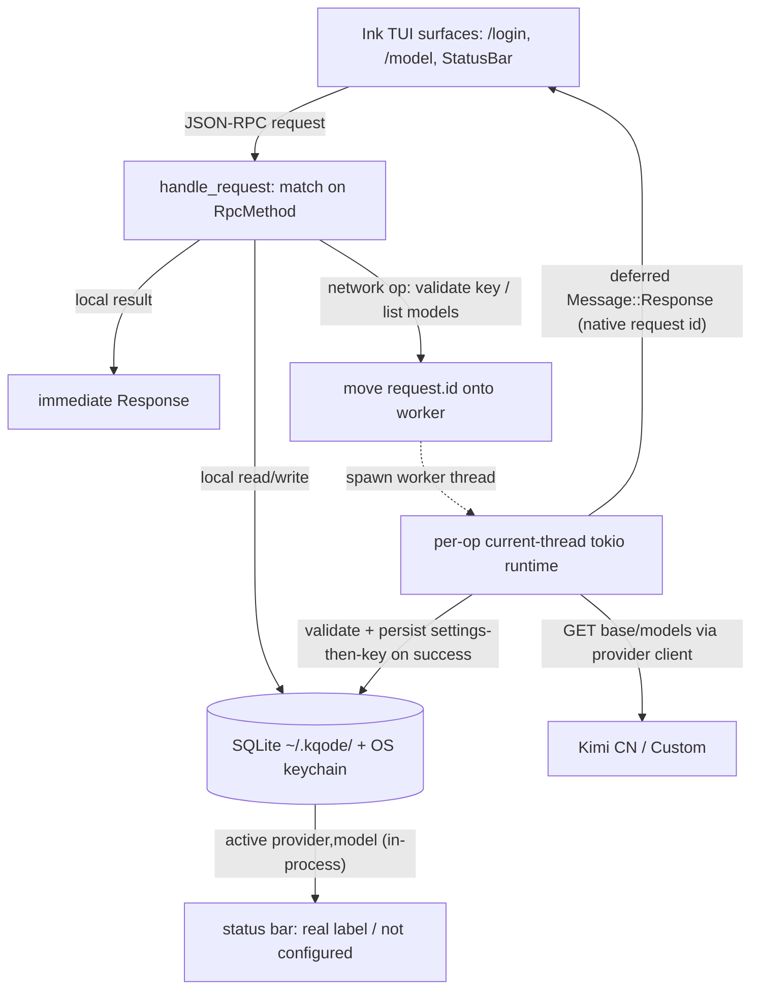
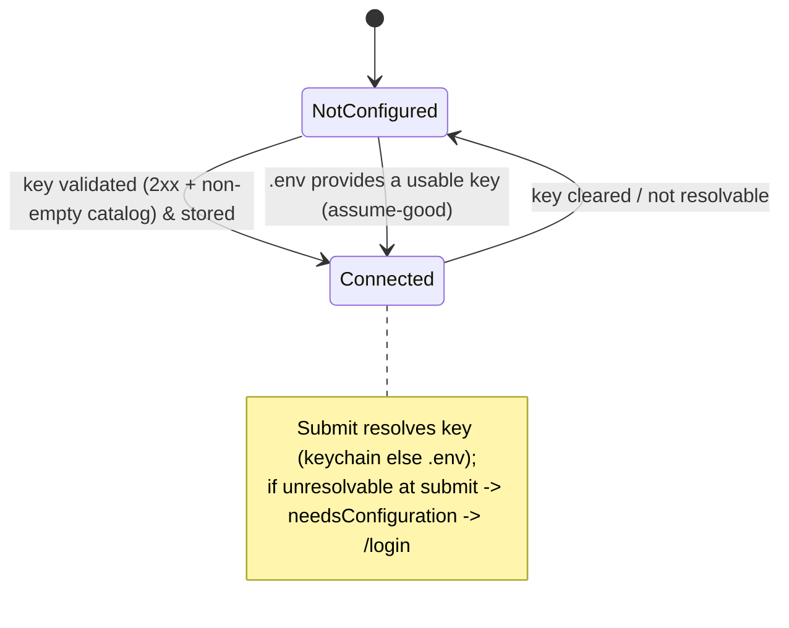

# feat: Provider `/login`, `/model` Selection, and a Real Status Bar

## Summary

Add two backend-driven slash commands — `/login` (manage providers + API keys) and `/model` (pick the active model from each connected provider's live model list) — and replace the hardcoded `GPT-5.5` status-bar label with the real active `(provider, model)`. All provider, credential, validation, model-list, and active-selection logic lands in the Rust backend behind new mirrored JSON-RPC methods; the Ink TUI stays a pure view. Network operations (key validation, model-list fetch) run off the sequential request loop on worker threads and report back via a deferred `Message::Response` correlated by the native request id, so a slow endpoint never freezes the backend. This work also stands up KQode's SQLite persistence foundation under `~/.kqode/`.

---

## Problem Frame

Which model KQode uses and how it authenticates are invisible and unmanageable from the TUI: the status bar always shows a hardcoded `GPT-5.5` (`tui/src/state/global/model.ts`), the only way to set a key is hand-editing `.env` and restarting, and the `needsConfiguration` outcome settles a dead-end red transcript entry (`tui/src/libs/promptQueue/promptQueue.ts`) with nothing to act on. There is no backend persistence at all beyond `.env` (no SQLite dependency in `Cargo.toml`), so there is nowhere to remember a provider or model choice. (See origin: `docs/brainstorms/2026-07-05-provider-login-and-model-selection-requirements.md`.)

---

## Requirements

**Provider management (`/login`)**
- R1. `/login` opens a backend-driven surface listing providers with a backend-computed status (not-configured / connected). Ships Kimi CN + one Custom provider.
- R2. Kimi CN is preset with a fixed Moonshot CN base URL shown read-only; user supplies only an API key.
- R3. Custom provider requires base URL + API key + optional label; assumed OpenAI-compatible.
- R4. Masked key entry (no plaintext echo); replace/update when a key exists, add when none; a clear/disconnect affordance is included.
- R5. On key entry, the backend validates by fetching OpenAI-compatible `/v1/models`; the provider is marked connected only when the response is 2xx **and** a parseable model list with ≥1 id. Any other outcome surfaces a themed error and leaves the provider not-connected.
- R6. API keys are stored in the OS keychain (one entry per provider). The raw key never appears in SQLite, logs, the trace, or any protocol payload.
- R7. With no keychain key, the backend falls back to `.env`; a `.env`-satisfied provider shows connected. Keychain (set via `/login`) wins over `.env`. The `.env` fallback is Kimi-scoped only (`KIMI_API_KEY`); the Custom provider is keychain-only (no `.env` fallback).

**Model selection (`/model`)**
- R8. `/model` opens a backend-driven surface listing live models from every connected provider, grouped by provider, from each provider's `/v1/models`.
- R9. Selecting a model sets the single global active `(provider, model)`. No model is hardcoded anywhere.
- R10. When no provider is connected as `/model` opens, it routes the user to `/login`.
- R11. When a provider becomes connected, the backend auto-selects a default model so the user can submit immediately; `/model` changes it later.

**Status bar and submit routing**
- R12. The status bar shows the real active `(provider, model)`, replacing `GPT-5.5`; shows a "not configured" state when nothing is connected.
- R13. On submit, the backend resolves the active `(provider, model)` + key (keychain else `.env`); with no resolvable connected provider it returns the needs-configuration outcome and the TUI routes to `/login`.

**Backend ownership and protocol**
- R14. All provider/credential/validation/model-list/active-selection logic lives in the Rust backend; the TUI renders menus + input and holds no such logic.
- R15. Extend the JSON-RPC boundary with methods to list providers (status + displayed URL), set/replace/clear a key (triggering validation), list aggregated models, set the active model, and read the active selection/status — as mirrored Rust/TS constants, secret-free payloads.

**Persistence foundation**
- R16. Introduce SQLite under `~/.kqode/`, bootstrapped on first run, with a forward-compatible migration mechanism.
- R17. Wire provider-settings (id, base/displayed URL, connection metadata) + the global active `(provider, model)` so the selection survives restart.
- R18. Create sessions + turns tables as designed-not-wired foundation (present in the migration, not written this iteration; no `/resume`).

**Origin actors:** A1 User, A2 Ink TUI (pure view), A3 Rust backend, A4 OS keychain, A5 SQLite store, A6 Provider APIs (Kimi CN / Custom).
**Origin flows:** F1 (configure/connect a provider via `/login`), F2 (select the active model via `/model`), F3 (submit with active-model resolution).
**Origin acceptance examples:** AE1 (validate on entry), AE2 (key never leaks), AE3 (`.env` fallback shows connected), AE4 (`/model` with none connected routes to `/login`), AE5 (auto-selected default model + status bar after connect), AE6 (submit with none connected routes to `/login`), AE7 (active selection persists across restart), AE8 (Custom endpoint without `/v1/models` fails).

---

## Scope Boundaries

- Full session/turn persistence — JSONL truth log, turn writes, `/resume` — is deferred; only the SQLite tables are created (R18).
- OAuth/subscription sign-in is out; API-key auth only.
- Multiple custom providers are out — a single Custom slot; a repeatable "add custom provider" is deferred.
- Providers must be OpenAI-compatible with `/v1/models`; manual model-id entry for endpoints lacking it is deferred.
- Editing Kimi CN's base URL is out (fixed CN endpoint); use the Custom provider for `moonshot.ai` or other endpoints.
- The earlier plan's SQLite-ciphertext envelope encryption is dropped in favor of keychain-only secret storage.
- Cost/token-usage display and richer model metadata beyond `/v1/models` are out.
- Compaction, tools, diffs, approvals, and sandbox execution remain out.
- A richer provider status machine (needs-reauth / ephemeral / stored-key-unrecoverable) is deferred; this iteration uses not-configured / connected plus submit-time reroute to `/login` on a key that no longer resolves (see Key Technical Decisions).

### Deferred to Follow-Up Work

- Live push-updates of provider status to an open `/model` surface while a validation runs in another flow: this iteration reads status/models when a surface opens and after a mutation, not via continuous subscription.

---

## Context & Research

### Relevant Code and Patterns

- **Backend loop + two off-loop precedents:** `src/backend.rs` (`run_stdio`, `run_loop`, `handle_request`) processes one JSON-RPC message at a time; `handle_request` is **already** a `match RpcMethod::from_method(&request.method)` returning `Option<Response>` (`Some` = answer synchronously, `None` = the handler owns/defers its own response). Two off-loop precedents already exist: (1) `handle_message_submit` + `spawn_streaming_turn` (`src/chat/turn.rs`) — ack + streamed **notifications** via a cloned `connection.sender`, per-turn current-thread tokio runtime; (2) **`spawn_git_status`** (`src/backend.rs`, computing `git::status_label` in `src/git.rs`) — a detached thread that sends a **deferred `Message::Response`** correlated by the native `request.id`, no notification. The deferred-response precedent is the template for single-result network ops (validation, per-provider model-list).
- **Provider seam:** `src/provider/mod.rs` (`ProviderRequest`, `StreamEvent`, `Role`, `ChatMessage`), `src/provider/kimi.rs` (`KimiProvider::new` rejects non-`https://`, builds `reqwest::Client` with connect/read timeouts; `stream` uses `.bearer_auth`; `parse_chunk`/`classify_status` are pure, unit-tested), `src/provider/error.rs` (`ProviderError` with a `pub mod kind` of stable string tags + `kind()`).
- **Config / secret redaction:** `src/config.rs` (`KimiConfig` with a custom `Debug` that redacts `api_key`; `from_env` + `non_empty_var`; `KIMI_*` var constants, `DEFAULT_KIMI_MODEL`, `DEFAULT_KIMI_BASE_URL`).
- **Protocol mirror:** `src/protocol.rs` (method-name constants, `RpcMethod` enum + `as_str`, params with `#[serde(deny_unknown_fields, rename_all = "camelCase")]`, results/notifications with `camelCase`) ↔ `tui/src/contracts/backend/messages.ts` (dependency-free seam, each constant carries a "Must match …" note) ↔ `tui/src/backend/protocol/messageProtocol.ts` (`RequestType`/`NotificationType` descriptors) ↔ `tui/src/backend/client/messageConnectionClient.ts` (registers notification handlers before sending; correlates by client-generated id) + the `BackendClient` contract in `tui/src/contracts/backend/client.ts`.
- **Home dir:** `KQODE_HOME_DIRNAME = '.kqode'` in `tui/src/backend/packaged/backendCacheDir.ts`; on the Rust side, `home_dir()` + `KQODE_HOME_DIRNAME` + a `KQODE_LOG_DIR`-style env override are **private** in `src/debug_log.rs` (to be promoted to a shared path module).
- **Slash commands + surface precedent:** `tui/src/libs/commands/registry.ts` (single-source registry), `executeCommand.ts` (sync `CommandActions`), `tui/src/components/SlashCommandMenu/handleMenuKey.ts`; the full-screen surface precedent is `helpVisibleAtom` (`tui/src/state/ui/help/`) → `App.tsx` swaps `HelpScreen`/`HomeScreen`, surface owns its own `useInput`.
- **Status bar:** `tui/src/components/StatusBar.tsx` renders `modelLabelAtom` right-aligned inside `<Box width={columns}>`; `HomeScreen.test.tsx` asserts `GPT-5.5` in three places.
- **needsConfiguration today:** `tui/src/libs/promptQueue/promptQueue.ts` (`outcomeToResult` → `NEEDS_CONFIGURATION_MESSAGE`); drain loop in `tui/src/state/promptQueue/atoms.ts`.

### Institutional Learnings

- `docs/solutions/architecture-patterns/backend-process-lifecycle-ownership-in-the-ink-tui.md`: reach the backend **only** through the narrow injected `BackendClient` seam; a guardrail test forbids `state/**` and `components/**` from importing process/launch modules. New `/login`/`/model` methods must extend that seam, not bypass it.
- `docs/solutions/architecture-patterns/state-libs-layering-and-cycle-verification-in-the-ink-tui.md`: `state/` is atoms-only; pure logic + shared constants live in `libs/`; `libs` must never import `@state`; verify with the doc's custom Tarjan cycle detector (madge gives a false pass). The `DEFAULT_MODEL_LABEL` constant currently misplaced in `state/global/model.ts` should move to `libs/`.
- `docs/solutions/architecture-patterns/terminal-edge-rendering-tradeoffs-in-the-ink-tui.md`: render the dynamic label inside `<Box width={columns}>`, not a bare `<Text>`; if WezTerm clips it, restore `paddingRight={1}` (`tui/AGENTS.md`); do not touch the `FULLSCREEN_GUARD_ROWS`/`INK_CURSOR_ROW_ORIGIN_OFFSET` knobs.
- `docs/solutions/workflow-issues/recovering-from-concurrent-agent-session-edits.md`: change both sides of each mirrored RPC method in lockstep; re-read shared protocol/contract files immediately before editing (the branch may have concurrent committers); gate on typecheck + tests.
- Greenfield for the team (zero prior learnings): OS keychain, SQLite/migrations, tokio-HTTP request/response, and HTTP mocking. Capture with `/ce-compound` after landing.

### External References

- Moonshot/Kimi exposes `GET /v1/models` in OpenAI-compatible form (`{ "object": "list", "data": [{ "id": "kimi-…", … }] }`) — confirmed; this is the dependency the `/model` feature and validation rely on. Base URLs: `https://api.moonshot.cn/v1` (CN) and `https://api.moonshot.ai/v1` (international).
- Earlier provider plan `docs/plans/2026-06-30-001-feat-llm-provider-streaming-chat-plan.md` researched `keyring` 4.1.x (Windows Credential Manager / macOS Keychain / Linux Secret Service; no built-in fallback on headless Linux without Secret Service) — reused here for keychain-only storage (its envelope-encryption/SQLite-ciphertext approach is dropped).

---

## Key Technical Decisions

**Backend concurrency**
- **Network ops run off the request loop; local ops stay synchronous.** Key validation and `/v1/models` fetches are single-result operations, so they use the **deferred-response** precedent already in the codebase (`spawn_git_status` in `src/backend.rs`): the handler returns `None` from `handle_request`, having moved the native `request.id` onto a detached worker thread (per-op current-thread runtime) that does the HTTP and sends `Message::Response` via a clone of `connection.sender`. This is simpler than the streaming ack+notification pattern — native request-id correlation, no notification type, no param-carried correlation id, no before-send handler registration. `handle_request` is already a `match RpcMethod::from_method(...) -> Option<Response>` (with `MessageSubmit` + `GitStatus` arms today), so new methods add arms + handler fns; local reads/writes return `Some(response)`. (An earlier draft mirrored `spawn_streaming_turn`'s ack+notification; the deferred-response pattern is preferred for these single-result calls, per architecture review.)
- **Deferred-response methods get a dedicated client timeout sized to validation work (≥15s), distinct from the 15s default — and the timeout must be non-fatal.** Validation uses a short backend-side HTTP timeout (≤8s connect+overall); the TS client ceiling for these methods (`VALIDATION_REQUEST_TIMEOUT_MS`, ≥15s) must comfortably exceed backend work (thread spawn + runtime creation + DNS/TLS + serialization eat into a thin margin). **Critically, a validation/model-list timeout must NOT be treated as a fatal backend error.** In the current client a request timeout → `isFatalBackendError` → `markDead()` → `killProcessTree(SIGKILL)` → `failAllTurns`, so a slow validation would tear down the whole backend and abort a concurrent streaming turn. These deferred-response methods must map a client timeout to a **recoverable per-provider error** (matching U9's "failed to load ↻" model), not a session teardown. Do not reuse the chat client's 30s/120s timeouts.
- **Per-call current-thread tokio runtimes (not a shared runtime).** Matches the `spawn_streaming_turn` precedent; a shared process-lifetime runtime would require `rt-multi-thread` (not compiled — tokio is `["rt","net","time","process"]`) or a bespoke driver thread (over-engineering at this scale). Accepted tradeoff: per-op runtime-creation cost + low-frequency detached threads. The `/login` and `/model` surfaces disable their submit/refresh affordance while a call is in flight (cheaper than backend bookkeeping); a backend per-provider in-flight dedup guard is deferred unless a concrete rapid-repeat problem appears (settings-before-secret + last-writer-wins already make a racing second write harmless).
- **Model listing is per-provider, not a single aggregate call.** `/model` fetches each connected provider's `/v1/models` as an independent bounded request (in parallel), so the surface can render per-provider loading / "failed to load ↻" / "(no models)" states against a real per-provider wire contract. Aggregation/grouping happens TUI-side from the per-provider results.

**Credentials and validation**
- **Validate-before-store.** The key is validated first and persisted to the keychain only on a `connected` outcome, so a rejected key never lingers or reads as connected (AE1/AE2). This iteration does not persist a separate "unvalidated"/"needs-reauth" state; a key that later fails to resolve at submit reroutes to `/login` (R13).
- **"Connected" = 2xx AND a parseable non-empty model list.** Reconciles R5 with AE8 (a 2xx non-OpenAI endpoint or an empty catalog is not "connected"). Validation outcomes are a typed enum: `connected(models)` / `authFailed` (401/403) / `rateLimited` (429) / `unreachable` (network/DNS/TLS/timeout) / `notCompatible` (non-2xx or 2xx-unparseable/missing `data`) / `emptyCatalog` (2xx, `data: []`) — each maps to a themed message; only `connected` marks the provider connected. **Caveat (Custom provider):** `/v1/models` is served *unauthenticated* by many OpenAI-compatible endpoints (vLLM, LM Studio, LiteLLM, Ollama's shim, gateways), so a 2xx catalog proves the endpoint lists models, not that the key authenticates chat. For Custom, "connected" therefore means "endpoint lists models"; a first chat turn that returns 401 must surface a distinct "key rejected at chat" state rather than the generic needs-configuration reroute this feature exists to remove. Kimi CN's `/v1/models` is assumed key-gated (confirm at implementation). See Open Questions for the validate-with-a-key-gated-probe alternative.
- **Secrets flow through a redacting + zeroizing secret newtype end-to-end, not just a struct `Debug`.** A per-struct `Debug` protects `{:?}` but not `Display`, direct field logging, or accidental `Serialize`. Wrap the key in a secret type (e.g., `secrecy::SecretString`) from the RPC params through the worker and generalized provider config, exposed only at the `.bearer_auth` call site; it redacts `Debug`+`Display`, carries no leaking `Serialize`, and zeroizes on drop. Apply it to the generalized provider config's key field too. On the TS side, the in-progress key lives in **component-local state (`useState`/`useRef`), never a Jotai atom** (atoms can be snapshotted/logged). `vscode-jsonrpc` frame tracing is **connection-level, not per-method**, so it must stay off entirely on the backend connection — the secret rides one payload, but tracing cannot be scoped to exclude only the set-key method, and enabling it for any debugging would expose the key.
- **The set-key request is the one secret-bearing payload; no generic RPC-frame logging is added.** The `handle_request`→`match` refactor must not introduce a `tracing::debug!("{request:?}")`-style frame logger. A leak-detection test injects a unique sentinel key and asserts its absence across five sinks: (1) transcript JSONL under a temp log dir, (2) captured JSON-RPC frames both directions, (3) `kqode.db` plus `-wal`/`-shm` bytes, (4) every response/notification payload, (5) the login surface's component state after close.
- **Key resolution is per-operation, never cached across operations**, so clearing a key takes effect immediately; a non-secret `keyPresent` bit cached in `provider_settings` (below) keeps status derivation off the keychain hot path.
- **`KeyResolver` seam decouples status derivation from the keychain module.** Status derivation (built in U4) depends on an abstract `Fn(provider_id) -> KeySource` resolver, tested with a fake; the real keychain-then-`.env` resolver is supplied by U5 and wired at U6/U11. This inverts the dependency so U4 does not depend on the not-yet-built keychain.
- **Preset providers use a compiled-constant base URL; `KIMI_BASE_URL`/`.env` cannot override it, and a key + its base URL must resolve from the same source.** Prevents a malicious workspace `.env` from redirecting a keychain key to an attacker endpoint. Status exposes the credential **source** ("connected via keychain" vs "connected via .env (`<cwd>`)") so an `.env`-supplied key/URL is never indistinguishable from a user-configured one. The `.env` fallback is Kimi-scoped only (`KIMI_API_KEY`); the Custom provider is keychain-only (no `.env` fallback).
- **Custom base URL is validated by parsing, not a string prefix.** Scheme must equal `https`; embedded userinfo (`user:pass@`) is rejected (spoofs the displayed host and would land a secret in the stored URL); malformed forms rejected before any network call. The provider HTTP client uses a no-cross-origin-auth redirect policy (do not implicitly rely on reqwest's default), and TLS certificate verification is always on — KQode exposes no skip-verify toggle. SSRF-to-internal is an accepted, documented risk for a single-user local CLI (revisit with an egress allowlist if KQode ever runs server-side). Changing a Custom provider's base URL re-binds its stored key to a new destination, so a base-URL change forces re-validation and shows the new destination host.
- **Keychain-unavailable → `/login` refuses to store with a `.env` hint** (fail-closed), not a session-only ephemeral key; `.env`-satisfied providers still show connected. Keychain entries use a stable namespaced service constant with the account derived from the enum provider id, so providers can't collide. Clearing a key does not delete the `provider_settings` row (keeps base URL/label for re-add) and does not remove a workspace `.env` key — status must show "connected via .env" after a clear rather than "not configured," so clear ≠ silent logout.

**Persistence**
- **SQLite via `rusqlite` (bundled) with a `user_version` migration runner; opened/migrated at backend init, not lazily.** Bundled SQLite avoids a system-lib dependency on Windows (note: `bundled` compiles SQLite via the `cc` crate, adding a C-toolchain build requirement new to this pure-Rust/rustls graph — benign on MSVC/dev, confirm for CI). Opening around `announce_ready` (rather than on the first request handler) keeps migration I/O off the request path. **Connections are opened per-operation from a path factory** (WAL + `busy_timeout` support this), not a single shared `Connection`: `rusqlite::Connection` is `Send` but `!Sync`, so the sync loop's reads (U6) and the deferred workers' writes (U14) cannot share one handle without a mutex — per-operation connections avoid that contention and the `!Sync` wall. Persistence-degraded state is surfaced through the U6 status method (which the `/login` surface already reads), not the parameterless `kqode.backend.ready` notification.
- **Migration steps are transactional with double-checked locking.** Each step and its `user_version` bump run inside one `BEGIN IMMEDIATE … COMMIT` (any error → `ROLLBACK`, schema+version untouched), using plain `CREATE TABLE` (not `IF NOT EXISTS`) so genuine inconsistency surfaces. The runner reads `user_version` on a cheap fast path, and if behind, re-reads it **inside** the transaction before applying (another instance may have migrated while we waited on the lock) — this serializes concurrent first-boot across workspaces. `PRAGMA journal_mode=WAL` is set before `BEGIN`; `busy_timeout` is modest (hundreds of ms, well under the 15s client ceiling); a `SQLITE_BUSY` after timeout during bootstrap retries-then-degrades, never crashes.
- **Migration evolution is forward-only and additive-only; a newer `user_version` degrades to full session-only (no reads or writes); a DB that fails to open is never auto-deleted.** Because SQLite is a rebuildable index over JSONL truth (AGENTS.md), recovery from a bad migration is a new forward-fix migration, not a down-migration; additive-only keeps a shared multi-version DB non-corrupting; and a transient lock or WAL-on-network-FS failure can look like corruption, so auto-nuking would be data destruction.
- **Cross-store write order is base-URL → key → `keyPresent`-flag-last.** On connect, write the non-secret provider row's URL/label first, then the keychain key, and set the `keyPresent` bit **last, only after the keychain write succeeds**. Rationale: status derives from `keyPresent`, so if the flag were set before the key (or the key write failed after), a crash or a keychain failure (`Unavailable`, D-Bus drop, locked keychain) would leave `keyPresent=true` with no resolvable key — a false "connected" whose every submit reroutes to `/login`, the exact orphan this ordering must prevent. A keychain-write failure returns a typed `storeFailed` outcome and does not set (or rolls back) `keyPresent`. Status derives from the SQLite index (a keychain key with no settings row is treated as orphaned, not surfaced). In DB-degraded mode, Kimi CN may connect session-only (constant URL), but Custom must refuse-to-store or warn-non-persistent (its URL can't persist).
- **`active_selection` is a single-row invariant with defined empty/dangling behavior.** Enforced as a singleton at the schema level (fixed key / `CHECK`). When no row exists (e.g., `.env`-only, first run, R11 auto-select never fired), resolution derives an effective default = (first/only connected provider, its registry default model) so submit works immediately; this same rule makes degraded mode usable. When the active provider's row is missing or not-connected (e.g., key cleared), resolution yields `needsConfiguration` → `/login` (no auto-switch, no crash). Foreign keys are off by default and per-connection in SQLite, so the dangling case is handled in resolution code rather than a decorative FK; if any FK is declared, `PRAGMA foreign_keys=ON` is set on every connection.
- **`sessions`/`turns` are created now as provisional foundation with a stable spine.** Minimal columns: `sessions(id TEXT PK /* UUID/ULID, stable across rebuilds */, created_at, workspace_cwd, jsonl_path)`, `turns(id TEXT PK, session_id, seq, created_at)`. `workspace_cwd` is the column not to omit — the DB is user-global but sessions are per-workspace, so `/resume` scoping needs it. Marked provisional in `migrations.rs` (reshaped by the session milestone; safe because the index is rebuildable from JSONL), kept permissive (no hard FKs) so the milestone extends rather than fights them.
- **DB path resolves under `~/.kqode/` with a `KQODE_DB_PATH` (file-path) env override** (mirrors `KQODE_LOG_DIR`, but a file not a dir — the resolver/tests must ensure the parent exists). The store `create_dir_all`s the DB's parent before opening (rusqlite won't). The whole bootstrap (open + pragmas + migrate + one sanity read) is wrapped in the fallible/degrade path, since corruption can surface after `open()`.
- **Private-by-default at-rest permissions.** `~/.kqode/` is created `0700` and the DB + `-wal`/`-shm` sidecars `0600` on Unix (Windows inherits the per-user profile ACL). This is set now, before the session milestone lands PII, and retroactively protects the existing plaintext transcript logs under `~/.kqode/logs/`.

**TUI structure**
- **Single "active surface" selector in `App.tsx`.** Replace the boolean help swap with one enum (home / help / login / model) so surfaces are mutually exclusive (which is exactly what prevents a second `useInput`) and the `/model`→`/login` handoff (R10) is a clean swap; Ctrl+C two-step (`useGlobalKeys`) still wins over a surface's Esc.
- **`/model`'s connected-check reads cached status synchronously; `executeCommand` stays synchronous.** Provider status already lives in a cached atom (read at startup, refreshed after `/login` mutations) for the status bar (U10) and `/login` list (U8), so `/model` decides `/model`-vs-`/login` (R10) without an async command action; the live per-provider model-list fetch happens inside the `/model` surface where U9 designs loading/failure states, with U9's self-redirect as the R10 safety net. (Whether `/model` needs *fresh-at-invocation* status vs *cached-since-last-mutation* is a product/UX call — see Open Questions.)
- **`needsConfiguration` reroutes to `/login` and preserves the prompt.** The pending prompt is restored to the composer for explicit resubmit (no auto-send); a queue of unconfigured prompts opens `/login` once, not per item. This changes the existing `StreamOutcome { kind: 'needsConfiguration' }` consumer path (previously a dead-end error entry).
- **`provider_id` is a stable, migration-versioned cross-boundary key** spanning keychain service/account names, SQLite rows, wire payloads, and TUI — renaming it orphans stored secrets and settings simultaneously, so it is treated like a versioned constant, not a free-to-refactor string. Config is user-global (SQLite + keychain) while `.env` stays workspace-scoped (backend cwd); precedence is keychain > `.env`, documented as intentional.
- **Provider client generalization** keeps Kimi CN as a preset descriptor and Custom as a second descriptor in a static enum/const registry (`provider/registry.rs`, the future `kqode-provider` home) — crate-split readiness comes from module placement, not a runtime plugin registry. Custom provider config lives with the descriptors in the registry module, not split into `src/config.rs`. `ProviderError`'s hardcoded "Kimi" `Display` strings are genericized.

---

## Open Questions

### Resolved During Planning

- Off-loop pattern for network ops: **deferred-response** (`spawn_git_status` precedent), native request-id correlation, dedicated non-fatal `VALIDATION_REQUEST_TIMEOUT_MS` (≥15s, mapped to a recoverable per-provider error not a backend teardown); per-call current-thread runtimes.
- "Connected" definition: **2xx + non-empty parseable catalog** (reconciles R5/AE8).
- Rejected-key status: **validate-before-store**; secret newtype (redacting + zeroizing) end-to-end; five-sink leak test (AE1/AE2).
- Model listing: **per-provider** parallel fetch (not a single aggregate), so U9 partial/empty/loading states have a wire contract.
- U4→U5 ordering: resolved via a **`KeyResolver` seam** (dependency inversion) so U4 status derivation doesn't depend on the not-yet-built keychain.
- Keychain reads off the sync hot path: **cache a non-secret `keyPresent` bit** in `provider_settings` at set/clear time.
- Migration safety: **transactional steps + double-checked locking**; forward-only/additive-only; newer-version = full session-only; never auto-delete a failed-to-open DB.
- Cross-store atomicity: **settings-before-secret** write order; status derives from the SQLite index.
- Empty/dangling `active_selection`: derive first-connected + registry default when no row; missing/not-connected active provider → `needsConfiguration`; single-row invariant.
- `.env` malicious-cwd hardening: preset base URL is a compiled constant (not env-overridable); key + base URL share one source; status shows credential source.
- Custom base-URL: **parsed** validation (scheme==https, reject userinfo) before any network call; no-cross-origin-auth redirect policy; TLS verify always on; full base incl. `/v1`, validation GETs `{base}/models`.
- `/model` connected-check: **cached-status synchronous**; `executeCommand` stays synchronous; live per-provider fetch inside the surface.
- Empty catalog / auto-select fallback: **≥1 model required to be connected**; auto-select the provider's recommended default when present, else the first returned id (R11).
- Stale active selection at submit: **reroute to `/login`** when the active provider's key no longer resolves; submit optimistically with the stored id (a bad id surfaces as a normal `turnError`); reconcile stale ids only inside `/model`.
- At-rest posture: private-by-default perms (`0700`/`0600` on Unix); DB opened/migrated at backend init.

### Deferred to Implementation

- Exact `keyring` service/account naming per provider (must guarantee no cross-provider or cross-application collision); the Linux secret-service variant that fits the current-thread-only tokio build (prefer sync); the secret-newtype crate choice (`secrecy`/`zeroize`).
- Confirm `reqwest`'s `bearer_auth` marks the `Authorization` header value sensitive (redacted in `{:?}`); if not, the `.bearer_auth` unwrap site is the one remaining leak point to guard.
- Whether `.env`-connected providers are lazily validated on first `/model` open or assumed-good until a call fails (default: assumed-good; a failing call surfaces normally).
- Final JSON-RPC method names and payload field names (follow the `kqode.<area>.<verb>` pattern; settle exact strings when wiring each unit in lockstep).
- The `sessions`/`turns` foundation column set beyond the stable spine (kept minimal + provisional; refined when the session milestone wires them).
- Whether `emptyCatalog` deserves distinct copy from `notCompatible` in the surface (default: distinct message, same not-connected effect).
- Response-body byte ceiling for the `/v1/models` fetch (a few hundred KiB is ample) and the exact set of "chat-capable" model-id heuristics for auto-select filtering.

### Product-Level Decisions to Confirm

*(Flagged by deepening review; each has a sensible default and does not block planning, but the user may want to redirect.)*

- **Multi-workspace active-selection read-authority:** DB-authoritative-per-submit (workspace B's `/model` change bleeds into workspace A's next prompt) vs in-memory-per-process (each workspace keeps its session model; the DB row is the shared default for *new* processes). Mechanically both are safe (WAL + last-writer-wins yields a valid row; submit re-resolves the key each time as the correctness net). **Default: in-memory-per-process** ("single global" reframed as "shared default for new processes"); U10/U11 read the in-process value.
- **Custom-provider key validation depth:** validate with `/v1/models` alone (fast, but many OpenAI-compatible endpoints serve it unauthenticated, so a wrong key still validates as "connected" and fails at first chat turn) vs an additional key-gated probe at connect time. **Default: `/v1/models` alone + a distinct "key rejected at chat" state on the first-turn 401** (U11); revisit a key-gated probe if the first-turn-401 UX proves confusing.
- **Esc during in-flight validation:** cancel the connect and its side effects vs allow it to complete in the background. **Default: guard the side effects on a not-cancelled token so Esc effectively cancels the visible connect** (the worker may still finish, but must not change active state after the surface closed).
- **`/model` status freshness:** fresh-at-invocation (async round-trip before opening) vs cached-since-last-mutation. **Default: cached** (keeps `executeCommand` synchronous; U9's in-surface fetch provides live model data anyway).
- **Custom provider in DB-degraded mode:** refuse-to-store vs warn-non-persistent. **Default: refuse-to-store** (consistent with keychain-unavailable), since Custom's base URL can't persist.
- **May an older binary read (not write) a newer-`user_version` DB?** **Default: no — full session-only** (an old binary can't be trusted to interpret a newer schema's rows).

---

## High-Level Technical Design

> *This illustrates the intended approach and is directional guidance for review, not implementation specification. The implementing agent should treat it as context, not code to reproduce.*

Backend request handling splits into two lanes — synchronous local ops and off-loop network ops (single-result, deferred-response):

Provider status derivation (pure, from stored settings + key resolution):

---

## Output Structure

New Rust modules (structured so a later `kqode-session` / `kqode-provider` crate split is clean):

    src/
      paths.rs               # promoted home-dir + KQODE_HOME_DIRNAME + env-override helper (from debug_log)
      store/
        mod.rs               # SQLite open/bootstrap + migration runner (user_version)
        migrations.rs        # ordered migration steps; provider_settings, active_selection, sessions, turns
        providers.rs         # provider-settings + active-selection read/write (non-secret)
        tests.rs
      secrets/
        mod.rs               # OS keychain get/set/clear per provider; typed unavailable error
        tests.rs
      provider/
        models.rs            # list_models + pure parse_models_response
        registry.rs          # provider descriptors (Kimi CN preset, Custom), status derivation
      login.rs               # off-loop validation + settings-then-key persistence orchestration (U14 worker)

New TUI modules:

    tui/src/
      libs/
        commands/registry.ts            # + /login, /model entries
        providers/                      # pure helpers: model-list grouping, URL/label validation, status labels
      state/
        global/activeModel.ts           # real active (provider, model) + "not configured"
        ui/surface/atoms.ts             # single active-surface selector (home/help/login/model)
        ui/login/atoms.ts               # /login surface state
        ui/model/atoms.ts               # /model surface state
      components/
        LoginSurface/                   # provider list + Custom form + masked key entry
        ModelSurface/                   # grouped, windowed model picker
        MaskedInput/                    # reusable no-echo text input
      backend/protocol/providerProtocol.ts   # new RequestType/NotificationType descriptors
      contracts/backend/providerMessages.ts  # mirrored method-name constants + wire types

---

## Implementation Units

Phased delivery: **Phase A (U1–U5)** backend foundation is exercisable via `cargo test` before any TUI work (over-the-wire headless exercisability begins at U6/U14); **Phase B (U6, U14, U7, U15, U8, U9)** protocol + TUI surfaces; **Phase C (U10–U13)** status bar, submit routing, graceful degradation, docs.

### U1. Promote the shared home-dir/path helper

**Goal:** Extract home-dir resolution into a reusable module so `debug_log` and the new store share one implementation, with a DB-path env override for tests.

**Requirements:** R16

**Dependencies:** None

**Files:**
- Create: `src/paths.rs`, `src/paths/tests.rs`
- Modify: `src/debug_log.rs` (consume the promoted helper), `src/lib.rs` (module decl)

**Approach:**
- Move `home_dir()` + `KQODE_HOME_DIRNAME` out of `src/debug_log.rs` into `src/paths.rs`; keep the `USERPROFILE`/`HOME` resolution and empty-filtering behavior identical.
- Add a `kqode_home()` accessor and a DB-path resolver honoring a `KQODE_DB_PATH`-style env override (mirror the `KQODE_LOG_DIR` pattern already in `debug_log`).
- Keep the module free of a `dirs`/`directories` crate (hand-rolled, as today).

**Patterns to follow:** `src/debug_log.rs` `resolve_log_dir` env-override; rustdoc `///` + `# Errors` where fallible.

**Test scenarios:**
- Happy path: `kqode_home()` joins `USERPROFILE`/`HOME` with `.kqode`.
- Edge case: empty/unset home env → `None` (no panic).
- Edge case: `KQODE_DB_PATH` override returns the override path verbatim, bypassing home resolution.
- Integration: `debug_log` log-dir resolution still returns the same path after the extraction (no behavior change).

**Verification:** `cargo test -p kqode paths` and existing `debug_log` tests pass; no duplicated home-dir literal remains.

---

### U2. SQLite store bootstrap + migration runner

**Goal:** Open (creating if absent) `~/.kqode/kqode.db`, run ordered migrations via `user_version`, and expose a connection to callers; establish the schema foundation.

**Requirements:** R16, R18

**Dependencies:** U1

**Files:**
- Create: `src/store/mod.rs`, `src/store/migrations.rs`, `src/store/tests.rs`
- Modify: `Cargo.toml` (add `rusqlite` with the `bundled` feature; add `[dev-dependencies]` `tempfile`), `src/lib.rs`

**Approach:**
- `open_or_bootstrap()` resolves the DB path (U1), `create_dir_all`s the DB's **parent** first (rusqlite won't create it), opens the connection, sets pragmas (`journal_mode=WAL` **before** any transaction; modest `busy_timeout` in the hundreds-of-ms range), and runs migrations to the latest known `user_version`. Called at **backend init** (around `announce_ready`), not lazily on a request handler.
- **Transactional migration runner with double-checked locking:** each step and its `user_version` bump run inside one `BEGIN IMMEDIATE … COMMIT` (error → `ROLLBACK`, schema+version untouched); use plain `CREATE TABLE` (not `IF NOT EXISTS`). Read `user_version` cheaply first, and if behind, re-read it **inside** the transaction before applying (a concurrent instance may have migrated while we waited on the lock). On `SQLITE_BUSY` after `busy_timeout` during bootstrap, retry-with-backoff then degrade — never crash.
- `migrations.rs` holds an ordered, forward-only, additive-only list of steps; step 1 creates `provider_settings`, `active_selection`, and the provisional `sessions`/`turns` foundation (spine columns per Key Technical Decisions; marked provisional). Sessions/turns are not written this iteration (R18).
- On a `user_version` greater than known, return a typed "newer schema" error and degrade to **full session-only** (no reads or writes); a DB that fails to open/migrate is **never auto-deleted** (a lock or WAL-on-network-FS failure can look like corruption). Wrap the whole bootstrap (open + pragmas + migrate + one sanity read) in the fallible/degrade path, since corruption can surface after `open()`.
- Create `~/.kqode/` `0700` and the DB + `-wal`/`-shm` sidecars `0600` on Unix (Windows inherits the profile ACL).
- Keep each file ≤ ~200 lines; structure so a later `kqode-session` crate split is clean.

**Execution note:** Add a failing migration round-trip test first (fresh temp DB → correct `user_version` + tables present).

**Patterns to follow:** sibling-file tests (`src/config/tests.rs`); env-override seam for the DB path (U1, a *file* path — tests use a `tempfile` dir and account for the `-wal`/`-shm` sidecars).

**Test scenarios:**
- Happy path: fresh temp path bootstraps, `user_version` = latest, all four tables exist.
- Happy path: re-opening an already-migrated DB is a no-op (idempotent).
- Edge case: DB at an older `user_version` migrates forward to latest.
- Edge case: a failed step mid-migration rolls back — `user_version` unchanged, no partial tables — and a subsequent open recovers cleanly.
- Edge case: two in-process connections racing `open_or_bootstrap` on one fresh path → exactly one migrates, both end healthy, no "table already exists" error.
- Error path: `user_version` newer than known → typed error, no reads/writes attempted, degrade (not crash), DB not deleted.
- Error path: unwritable/corrupt path, and a simulated WAL-set failure → typed error surfaced, degrade, no panic.

**Verification:** `cargo test -p kqode store` passes against temp DBs; no writes land in the real `~/.kqode`; forcing DB failure never panics.

---

### U3. Provider-settings + active-selection persistence

**Goal:** Read/write non-secret provider settings and the single global active `(provider, model)`.

**Requirements:** R17, R9

**Dependencies:** U2

**Files:**
- Create: `src/store/providers.rs`
- Modify: `src/store/mod.rs` (re-export), `src/store/tests.rs`

**Approach:**
- Persist per-provider non-secret rows: provider id (enum-backed constant), base/displayed URL, optional label, a non-secret **`keyPresent` bit** (set on connect, cleared on clear — keeps status derivation off the keychain hot path), and connection metadata (e.g., last-connected marker) — never any key material, and **no key hash/prefix/fingerprint**.
- Persist a single active-selection row: `(provider_id, model_id)`, enforced as a **singleton** at the schema level (fixed key / `CHECK`) so a buggy insert can't create two "active" rows; get/set with last-writer-wins.
- **Write order on connect is settings-first** (this row, incl. `keyPresent` and base URL) then the keychain key (U5), so a crash leaves "provider known, key not resolvable" (not-connected) rather than an orphaned key with an unknown endpoint.
- **Dangling/empty resolution rules:** clearing a key does **not** delete the provider row (keep base URL/label for re-add); when `active_selection` has no row, derive an effective default = (first/only connected provider, its registry default model); when the active provider's row is missing or not-connected, resolution yields `needsConfiguration` (handled in U11). Foreign keys are off-by-default and per-connection in SQLite, so handle the dangling case in resolution code; if any FK is declared, set `PRAGMA foreign_keys=ON` on every connection.
- The provisional `sessions`/`turns` spine columns (Key Technical Decisions) — stable TEXT ids, `workspace_cwd`, `jsonl_path` — are created in U2's migration; this unit does not write them.
- Model provider ids as named constants/enum shared with the registry (U4), not string literals.

**Patterns to follow:** const-first identifiers (`src/provider/error.rs` `pub mod kind`); redacting posture from `src/config.rs` (no secret fields here at all).

**Test scenarios:**
- Happy path: set then get active selection round-trips.
- Happy path: upsert provider settings updates the row without duplicating.
- Edge case: get active selection with no row set → `None`.
- Integration: `Covers AE7.` write active selection, re-open the DB (new connection), the same `(provider, model)` is returned.

**Verification:** `cargo test -p kqode store::providers` passes; no key/secret column exists in the schema.

---

### U4. Provider client generalization + `list_models` (pure parse) + status derivation

**Goal:** Generalize the OpenAI-compatible client to any `(base_url, api_key, model)`, add a `list_models` call with a pure response parser, and derive provider status from stored settings + key resolution.

**Requirements:** R1, R2, R3, R5, R8, R14

**Dependencies:** U3

**Files:**
- Create: `src/provider/models.rs`, `src/provider/registry.rs`
- Modify: `src/provider/mod.rs`, `src/provider/kimi.rs` (generalize to a provider-neutral client; keep Kimi as a preset descriptor), `src/provider/kimi/tests.rs` → provider tests, `src/provider/error.rs` (genericize the hardcoded "Kimi" `Display` strings)

**Approach:**
- **Preserve a compatible `KimiProvider::new(KimiConfig)`-shaped entry point** so `src/chat/turn.rs` (which calls it on the live streaming path) keeps compiling at the end of Phase A — the full turn.rs rewire to resolved provider/model config is U11 (Phase C), two phases later. Without the shim, U4 breaks the streaming turn before its declared fix.
- Refactor `KimiProvider` into a provider-neutral OpenAI-compatible client parameterized by base URL / key / model; Kimi CN and Custom become descriptors in a static enum/const `registry.rs` (Kimi CN: fixed CN URL constant, key-only; Custom: user URL + key + label). **Custom provider config lives with the descriptors in `registry.rs`, not split into `src/config.rs`** (keeps the future `kqode-provider` seam self-contained).
- `list_models`: `GET {base}/models` with `.bearer_auth`, reusing `classify_status`; decode via **pure `parse_models_response(&str) -> Result<Vec<ModelInfo>, ProviderError>`** (mirrors `parse_chunk`; unit-testable without a live server — real-network coverage needs the repo's first `[dev-dependencies]`).
- Define the typed validation outcome enum (`connected` / `authFailed` / `rateLimited` / `unreachable` / `notCompatible` / `emptyCatalog`) as the shared result of a validate call.
- **Status derivation depends on an abstract `KeyResolver` seam** (`Fn(provider_id) -> KeySource`), not the keychain module directly — so U4 does not depend on the not-yet-built U5. It reads the cached `keyPresent` bit from `provider_settings` (U3) for the hot path; the real keychain-then-`.env` resolver is injected by U5 and wired at U6/U11. Keychain precedence over `.env`; status exposes the credential **source**.
- **Validate the Custom base URL by parsing** (scheme must equal `https`; reject embedded userinfo; reject malformed) before any network call — replace the existing `starts_with("https://")` prefix check. Configure the HTTP client with a no-cross-origin-auth redirect policy; TLS verification always on (no skip-verify toggle).

**Patterns to follow:** `src/provider/kimi.rs` `stream`/`classify_status`/`parse_chunk`; `ProviderError` kind tags; provider abstraction rule in `AGENTS.md`; dependency-inversion for the `KeyResolver` seam.

**Test scenarios:**
- Happy path: `parse_models_response` on a real OpenAI-shaped body returns ids in order.
- `Covers AE8.` Edge case: 2xx body without a `data` array / non-JSON → `notCompatible` (not connected).
- Edge case: 2xx with `data: []` → `emptyCatalog` (not connected).
- Error path: `classify_status` maps 401/403 → `authFailed`, 429 → `rateLimited`, other non-2xx → `unreachable`/network.
- Edge case: base-URL parse rejects non-https, embedded userinfo (`user:pass@host`), and malformed URLs before any request.
- Edge case: status derivation via a **fake `KeyResolver`** (no keychain needed) — key present → connected; only `.env` → connected (source shown as `.env`); neither → not-configured; keychain alongside `.env` → keychain wins.

**Verification:** `cargo test -p kqode provider` passes with no live network; `cargo clippy -- -D warnings` clean.

---

### U5. OS keychain secret storage + `KeyResolver` (validate-before-store, clear, secret newtype)

**Goal:** Store/read/clear a provider's API key in the OS keychain behind a secret newtype, supply the real `KeyResolver`, with a typed unavailable error and a strict no-leak posture.

**Requirements:** R6, R4, R7

**Dependencies:** U4

**Files:**
- Create: `src/secrets/mod.rs`, `src/secrets/tests.rs`
- Modify: `Cargo.toml` (add `keyring` with the **per-platform real backend features** — `windows-native`, `apple-native`, and a chosen Linux secret-service variant — plus its mock backend under `[dev-dependencies]`/test cfg; add the secret-newtype crate, e.g. `secrecy`/`zeroize`), `src/lib.rs`

**Approach:**
- Enable `keyring`'s real platform backends for the production build — the crate stores nothing without them, so naming only the mock feature would ship a keychain that silently no-ops in production while mock-backed tests pass green (a false-green hiding broken R6/R4/R7). Pick the Linux secret-service variant that fits the current-thread-only tokio build (`["rt","net","time","process"]`, no `rt-multi-thread`); prefer a sync backend so it doesn't pull an incompatible async runtime (confirm at implementation — see Open Questions).
- `get_key`/`set_key`/`clear_key` per provider, keyed by a **stable namespaced service constant** with the account derived from the enum provider id (providers can't collide; clearing A leaves B intact).
- Keys flow through a **redacting + zeroizing secret newtype** (e.g., `secrecy::SecretString`): safe `Debug`/`Display`, no `Serialize`, zeroized on drop — exposed only at the `.bearer_auth` call site. Applied to the generalized provider config's key field too. (Confirm `reqwest`'s `bearer_auth` marks the `Authorization` header value sensitive so a stray request-`Debug` at that unwrap point can't leak it.)
- Supply the real `KeyResolver` (U4 seam): keychain first, then `.env` (`src/config.rs`), matching R7 precedence; resolution is **per-operation, never cached across operations**, so clear takes effect immediately.
- On a keychain-unavailable environment, return a typed `Unavailable` error so callers refuse-with-`.env`-hint (U8) rather than crash.
- Clearing a key does not delete the `provider_settings` row and does not remove a workspace `.env` key (status shows "connected via .env" after clear — clear ≠ silent logout).

**Execution note:** Use `keyring`'s mock backend for tests (no real OS keychain in CI).

**Test scenarios:**
- Happy path: set then get returns the same key (mock backend); resolver returns keychain over `.env` when both present.
- Happy path: clear removes the key; subsequent get → `None`; clearing provider A leaves provider B's key intact.
- Edge case: keychain-unavailable → typed `Unavailable` error (not a panic).
- `Covers AE2.` Integration: the secret newtype's `Debug`/`Display` never renders the raw key, and it carries no `Serialize`.

**Verification:** `cargo test -p kqode secrets` passes with the mock backend; grep of any produced log/trace shows no key material.

---

### U6. Synchronous local provider/model JSON-RPC methods

**Goal:** Add the mirrored **synchronous** request/response methods — list providers+status, read active selection, set active model, clear key — as new arms on the existing `handle_request` match.

**Requirements:** R15, R14, R9, R13

**Dependencies:** U3, U4, U5 (clear-key calls the keychain); consumed by U7/U8/U9/U10/U11

**Files:**
- Modify: `src/protocol.rs` (new `RpcMethod` variants + `from_method`/`as_str`, params/result structs, method-name + status constants), `src/backend.rs` (new arms on the existing `match` + small handler fns returning `Some(response)` — **no `{request:?}` frame logger introduced**)
- Create: `tui/src/contracts/backend/providerMessages.ts` (mirrored constants + wire types, "Must match …" notes, secret-free), `tui/src/backend/protocol/providerProtocol.ts` (`RequestType` descriptors)
- Modify: `tui/src/contracts/backend/index.ts` (barrel), `tui/src/contracts/backend/client.ts` (extend `BackendClient`), `tui/src/backend/client/messageConnectionClient.ts` (implement the synchronous methods)
- Test: `src/backend` inline tests (dispatch), `tui/src/backend/protocol/__tests__/providerProtocol.test.ts`, `tui/src/backend/client/__tests__/` (in-memory connection)

**Approach:**
- Method names follow `kqode.<area>.<verb>` (finalize exact strings in lockstep). These are all fast local reads/writes (SQLite + a keychain clear), so they return `Some(response)` synchronously. Status derivation reads the cached `keyPresent` bit (U3), not the keychain, on this hot path.
- The `handle_request` match and the `spawn_git_status` deferred-response precedent already exist, so this unit adds arms + simple handler fns; the novel async machinery lands in U14. Each stays an atomic commit.

**Execution note:** Change Rust and TS sides of each method together; re-read `src/protocol.rs` and `messages.ts` immediately before editing (shared branch).

**Patterns to follow:** `src/protocol.rs` constants + `RpcMethod`; `tui/src/contracts/backend/messages.ts` "Must match" seam; `AGENTS.md` constants/enums + no-secrets-in-payloads.

**Test scenarios:**
- Happy path: each method deserializes valid params and returns the expected result shape (Rust) / round-trips over an in-memory `MessageConnection` (TS).
- Edge case: unknown method still returns `JSON_RPC_METHOD_NOT_FOUND`; bad params → `JSON_RPC_INVALID_PARAMS`.
- Happy path: list-providers returns each provider's status + displayed URL + credential source, derived from the cached `keyPresent` bit (no keychain read on this path).
- Integration: read/set active selection round-trips via the client.

**Verification:** `cargo test -p kqode`, `cargo xtask tui-typecheck`, `cargo xtask tui-test` pass; the backend-isolation guardrail test stays green.

---

### U14. Off-loop key validation + per-provider model-list (deferred-response worker)

**Goal:** Add the network-bearing methods — set-key (validate + store) and per-provider model-list — as off-loop deferred-response operations that never block the sequential request loop.

**Requirements:** R5, R6, R8, R11

**Dependencies:** U5, U6

**Files:**
- Create: `src/login.rs` (off-loop validation + settings-then-key persistence orchestration)
- Modify: `src/protocol.rs` (set-key + model-list method names, params/result structs; set-key params carry the key behind the secret newtype), `src/backend.rs` (`handle_request` arms move `request.id` onto a worker thread that sends a deferred `Message::Response` via a cloned `connection.sender`, mirroring `spawn_git_status`), `tui/src/contracts/backend/providerMessages.ts` + `tui/src/backend/protocol/providerProtocol.ts` (descriptors), `tui/src/contracts/backend/client.ts` + `tui/src/backend/client/messageConnectionClient.ts` (client methods with the `VALIDATION_REQUEST_TIMEOUT_MS` ceiling), `tui/src/constants/backend.ts` (add `VALIDATION_REQUEST_TIMEOUT_MS`)
- Test: `src/login`/`src/backend` inline tests; `tui/src/backend/client/__tests__/` (in-memory connection); leak-detection test

**Approach:**
- **Deferred-response pattern** (`spawn_git_status`): the handler validates params synchronously (pre-network failures — malformed/non-https URL — return an error `Response` immediately), then moves `request.id` onto a detached worker with a per-op current-thread runtime that does the HTTP and sends `Message::Response` via a cloned sender. Native JSON-RPC request-id correlation — no notification type, no param-carried correlation id. Opens its SQLite connection per-operation (`!Sync`; see Key Technical Decisions).
- **Client timeout is non-fatal.** These methods must map a client-side `VALIDATION_REQUEST_TIMEOUT_MS` (≥15s) timeout to a **recoverable per-provider error**, not a fatal `markDead()`/`SIGKILL` teardown (which would abort a concurrent streaming turn). Backend HTTP timeout ≤8s to keep margin. Do not route these through the default fatal-timeout path.
- **Bound the response body.** Cap the `/v1/models` response bytes (a model list is tiny; a few hundred KiB is ample) via `Content-Length` check + capped streaming read, returning `notCompatible`/`unreachable` if exceeded — a hostile Custom endpoint must not exhaust memory before `parse_models_response` buffers it.
- set-key: validate via `list_models` (U4); on `connected`, persist **base URL/label → keychain key → `keyPresent` flag last** (U3/U5), and auto-select a default model (R11) **filtered to chat-capable models** (skip embeddings/moderation/TTS ids so the first turn doesn't fail on a non-chat default). A keychain-write failure returns a typed `storeFailed` outcome and never sets `keyPresent`.
- **Cancellation/side-effect guard:** the connected side effects (keychain write, auto-select, status change) are guarded on a still-open/not-cancelled token for the originating surface, so pressing Esc during a multi-second validation does not silently connect the provider and change the active model behind the user. Document whether Esc cancels or is allowed to complete.
- **`/v1/models` auth-gating caveat:** for Custom, a `connected` outcome means "endpoint lists models," not "key authenticates chat" (many OpenAI-compatible servers serve `/v1/models` unauthenticated). A first chat turn returning 401 must surface a distinct "key rejected at chat" state (handled in U11), not the generic needs-configuration reroute.
- model-list: **one request/result per connected provider**, fetched in parallel, so U9 can render per-provider loading/failure/empty states. Strip/escape C0/C1 control chars and ANSI/OSC escapes from provider-supplied model ids before they can reach an Ink `<Text>` (U9/U15).
- The set-key key is wrapped in the secret newtype end-to-end; no frame logging.

**Execution note:** Change Rust and TS sides together. Add a failing leak-detection test first (sentinel key absent from all five sinks).

**Patterns to follow:** `spawn_git_status` deferred-response; `spawn_streaming_turn` detached-thread + per-op runtime; `withRequestTimeout` for the client ceiling.

**Test scenarios:**
- Integration `Covers AE1.` set-key with a valid key → deferred `connected` response, provider persisted + default model auto-selected; a 401 key → `authFailed`, provider not connected, nothing persisted.
- `Covers AE8.` Edge case: Custom endpoint without `/v1/models` → `notCompatible`, not connected.
- Edge case: pre-network URL rejection returns an immediate error response (no worker spawned).
- Edge case: `rateLimited` / `unreachable` / `emptyCatalog` each return distinct typed outcomes leaving the provider not-connected.
- Integration (concurrency): a set-key validation in flight does not block a concurrent list-providers request (loop stays responsive).
- Integration `Covers AE2.` a unique sentinel key is absent from all five sinks (transcript JSONL, both-direction JSON-RPC frames, `kqode.db`+`-wal`+`-shm` bytes, every response/notification payload, TUI component state).
- Integration: two connected providers → two parallel model-list results; one provider failing yields a per-provider failure without failing the other.
- Edge case (non-fatal timeout): a validation/model-list that exceeds `VALIDATION_REQUEST_TIMEOUT_MS` surfaces a recoverable per-provider error and does **not** tear down the backend or abort a concurrent streaming turn.
- Edge case (orphan guard): a keychain-write failure after the URL/label write returns `storeFailed` and leaves `keyPresent` false, so status stays not-connected (no false "connected").
- Edge case (response cap): a `/v1/models` body exceeding the byte ceiling returns `notCompatible`/`unreachable` without buffering the whole body.
- Edge case (cancel): Esc during an in-flight validation does not connect the provider or change the active model (side effects guarded on the not-cancelled token).

**Verification:** `cargo test -p kqode`, `cargo xtask tui-typecheck`, `cargo xtask tui-test` pass; the leak test is green; the guardrail test stays green.

---

### U7. Single active-surface selector + `/login`/`/model` command wiring

**Goal:** Replace the boolean help swap with one active-surface selector and register `/login` and `/model`, reading cached provider status synchronously to route `/model`→`/login` when nothing is connected.

**Requirements:** R1, R8, R10, R14

**Dependencies:** U6

**Files:**
- Create: `tui/src/state/ui/surface/atoms.ts` (+ `index.ts`, `__tests__/atoms.test.ts`)
- Modify: `tui/src/App.tsx` (render by active surface), `tui/src/state/ui/help/atoms.ts` (fold help into the selector), `tui/src/libs/commands/registry.ts` (add `/login`, `/model`), `tui/src/libs/commands/executeCommand.ts` (+ `CommandActions` for openLogin/openModel), `tui/src/components/PromptComposer/index.tsx` (provide the new actions)
- Test: `tui/src/libs/commands/__tests__/executeCommand.test.ts`, surface atom tests

**Approach:**
- Introduce an active-surface enum (home / help / login / model); `App.tsx` swaps by it; keep Ctrl+C two-step (`useGlobalKeys`) winning over surface Esc.
- **`executeCommand` stays synchronous.** `/model` reads the **cached provider-status atom** (populated at startup, refreshed after `/login` mutations) to decide `/model` vs `/login` (R10); the live per-provider model-list fetch happens inside the `/model` surface (U9), whose self-redirect is the R10 safety net. (No async command-action path unless the product decision selects fresh-at-invocation status — see Open Questions.)
- `/model` action reads provider status via the client (U6); if none connected, it opens `/login` instead (R10) — the async read is the reason `CommandActions` gains an async path.
- Keep pure command identity in the registry; keep new UI state in `state/ui/**` atoms; keep helpers pure in `libs/**` (layering rule).

**Patterns to follow:** `helpVisibleAtom`→`App.tsx` precedent; `state/ui/commands` + `help` slice structure; `executeCommand` switch.

**Test scenarios:**
- Happy path: `/login` sets the active surface to login; `/model` with a connected provider sets it to model.
- `Covers AE4.` Edge case: `/model` with no connected provider opens `/login`, not an empty model surface.
- Edge case: exactly one surface is active at a time; opening one closes the others.
- Edge case: Esc closes the active surface back to home; Ctrl+C two-step still exits.

**Verification:** `cargo xtask tui-test` passes; custom Tarjan cycle detector reports no cycles; backend-isolation guardrail green.

---

### U15. Reusable masked key-input primitive + pure provider helpers

**Goal:** Build the security-sensitive `MaskedInput` primitive and the pure provider helpers (URL/label validation, status labels, model grouping) as independently-tested units the surfaces consume.

**Requirements:** R4, R3

**Dependencies:** U7 (surface scaffolding for integration tests only; the primitive + pure helpers otherwise stand alone). Consumed by U8/U9.

**Files:**
- Create: `tui/src/components/MaskedInput/` (+ `__tests__/`), `tui/src/libs/providers/` (pure URL/label validation, status labels; `modelGrouping.ts`)
- Test: colocated `__tests__/` for the masked input and the pure helpers

**Approach:**
- `MaskedInput` guarantees no echo, code-point-aware backspace, bracketed-paste handling, and trailing-whitespace/newline trim (match `non_empty_var` in `src/config.rs`). Its on-screen representation is a caret plus a bounded run of mask glyphs (capped so exact key length isn't revealed) — enough that the user sees input registered (including after a paste), without echoing the key.
- **The in-progress key lives in component-local state (`useState`/`useRef`), never a Jotai atom** — atoms can be snapshotted/logged, so keeping the secret out of the global store is a stronger guarantee than "don't log the atom" (extends AE2 to the TUI). The key flows only: local state → `setKey(...)` arg → request params.
- `libs/providers/` holds pure functions (never importing `@state`): base-URL/label validation mirroring the Rust parse rules (scheme, userinfo, malformed), status-label formatting, and per-provider model grouping/windowing, and control-char/ANSI sanitization of provider-supplied model ids.

**Patterns to follow:** `PromptComposer` code-point cursor logic for `MaskedInput`; `libs/**` pure-logic + no-`@state`-import layering rule.

**Test scenarios:**
- Edge case: masked input renders no plaintext; backspace deletes one code point; paste inserts without echo; leading/trailing whitespace trimmed.
- `Covers AE2.` Edge case: the key is never written to any atom (component-local only); a store snapshot after entry contains no key material.
- Edge case: URL validation rejects non-https, embedded userinfo, and malformed URLs (parity with the U4 Rust rules).
- Happy path: model grouping produces per-provider groups with the active model marked.

**Verification:** `cargo xtask tui-test` passes; custom Tarjan cycle detector clean; no key value appears in any atom snapshot.

---

### U8. `/login` surface: provider list, Custom form, outcome handling

**Goal:** Build the interactive `/login` surface — provider list with status + credential source, Custom URL/label form, masked key entry (via U15) — wired to the backend set/clear/validate methods with themed outcome handling.

**Requirements:** R1, R2, R3, R4, R5, R6, R7, R11

**Dependencies:** U6, U14, U15

**Files:**
- Create: `tui/src/components/LoginSurface/` (index + rows + form pieces, each ≤200 lines), `tui/src/state/ui/login/atoms.ts` (+ `index.ts`, `__tests__/`)
- Modify: `tui/src/contracts/backend/client.ts` consumers as needed
- Test: colocated `__tests__/` for the surface and login atoms

**Approach:**
- Provider list shows each provider + backend-computed status **and its credential source** ("connected via keychain" / "connected via .env (`<cwd>`)"); selecting Kimi CN prompts key-only (URL shown read-only); selecting Custom shows a URL + optional-label form then masked key entry (U15). The exact destination host is shown before the first Custom validation.
- **Custom form focus model:** Enter advances URL → label → key (Enter on an empty label skips it); Up/Down (or Shift+Tab) moves focus back to edit a prior field before submit; Esc backs out one field, then exits the surface; validation fires only on final key submit; the focused field is visually indicated.
- **Connected-provider action model:** selecting an already-connected provider shows explicit actions (Replace key / Clear) with named keybindings; Clear requires a one-key confirm (it is destructive); the not-configured path continues straight to key entry.
- On submit, call the set-key method (U14); render the typed validation outcome (connected / authFailed / rateLimited / unreachable / notCompatible / emptyCatalog) with themed messages that distinguish transient outcomes (rateLimited/unreachable → wait & retry) from terminal ones (authFailed/notCompatible/emptyCatalog → fix key or URL); only `connected` closes the surface, persists (base URL/label → key → `keyPresent` last, U3/U5), and triggers auto-select of a default model (R11).
- Provide a clear/disconnect action (R4); after clear, status shows "connected via .env" when a workspace `.env` key remains (clear ≠ silent logout). Changing a Custom base URL forces re-validation and shows the new destination.
- Keychain-unavailable outcome renders a "set `KIMI_API_KEY` in `.env`" hint (U5) rather than storing; in DB-degraded mode, Custom refuses-to-store or warns non-persistent (U12).

**Patterns to follow:** `HelpScreen` surface + own `useInput`; `MaskedInput` (U15); `state/ui/**` atoms-only; `<Box width={columns}>` edge rule.

**Test scenarios:**
- `Covers AE1.` Happy path: entering a valid Kimi key shows connected and closes; a 401 shows a themed auth error and stays not-connected.
- `Covers AE8.` Edge case: a Custom endpoint without `/v1/models` shows a "not compatible" error, not connected.
- Edge case: rate-limited / unreachable / empty-catalog each render distinct themed messages and leave the provider not-connected.
- Edge case: clear action removes the key and updates status; when a `.env` key remains, status shows "connected via .env," not "not configured."
- Edge case: changing a Custom base URL re-validates and shows the new destination host.
- Integration `Covers AE5.` a successful connect auto-selects a default model.

**Patterns to follow (secret):** the key is passed from `MaskedInput`'s local state straight to the set-key call — never through a login atom.

---

### U9. `/model` surface: aggregated, grouped, windowed model picker

**Goal:** Build the `/model` surface listing live models across connected providers, grouped, with partial/empty/in-flight handling, and set the global active model on selection.

**Requirements:** R8, R9, R10, R14

**Dependencies:** U6 (set-active), U7, U14 (per-provider model-list), U15 (grouping helper + surface primitives)

**Files:**
- Create: `tui/src/components/ModelSurface/` (index + grouped rows, ≤200 lines each), `tui/src/state/ui/model/atoms.ts` (+ `index.ts`, `__tests__/`)
- Modify: `tui/src/contracts/backend/client.ts` consumers as needed
- Test: colocated `__tests__/`

**Approach:**
- On open, invoke the **per-provider** model-list method (U14) for each connected provider (each bounded, in parallel); render grouped-by-provider (via the U15 `modelGrouping` helper) with the active one marked; show per-provider loading, "failed to load ↻", and explicit "(no models)" states rather than omitting a provider. Model ids are rendered only after control-char/ANSI sanitization (U14/U15).
- **Open focused on the active model:** the initial highlight and window scroll to the currently-active model, falling back to the first provider group when nothing is active, so the user sees their current selection without scrolling.
- **Async-load selection anchoring:** the highlight is anchored to model identity (provider id + model id), not list index; late-arriving groups are appended without moving the highlighted row or window under the user — so a group that resolves above the cursor cannot shift the selection (respects the `tui/AGENTS.md` cursor/window math).
- **Retry trigger:** the "failed to load ↻" row is focusable/selectable and re-invokes that provider's model-list fetch on Enter; navigation can land on a failed or "(no models)" group.
- Selecting a model calls set-active (U6) → persists (U3) → status bar updates (U10).
- Long lists use a windowed pager (reuse the `SlashCommandMenu`/`HelpScreen` scroll pattern); a transient fetch failure does not downgrade a provider's connected status (sticky), it shows the retry affordance.
- If opened with none connected (belt-and-suspenders with U7), self-redirect to `/login`.

**Patterns to follow:** `SlashCommandMenu` windowing + highlight; `HelpScreen` scroll; `libs/**` pure grouping.

**Test scenarios:**
- Happy path: two connected providers render grouped models; the active model is marked and the surface opens scrolled to it.
- Edge case: one provider returns `[]` → shown as an explicit "(no models)" group.
- Edge case: one provider's fetch fails → partial results render with a retry affordance reachable by navigation; Enter on it re-fetches; the failed provider stays connected (not downgraded).
- Edge case: a late-arriving group above the cursor does not move the highlighted row (identity-anchored selection).
- Edge case: model ids containing control/ANSI sequences render inert (sanitized).
- Edge case: long list windows/pages without breaking layout.
- Happy path `Covers AE7.` selecting a model persists it (verified via the store round-trip in U3) and updates the active selection.

**Verification:** `cargo xtask tui-test` passes; cycle detector clean.

---

### U10. Real status-bar label + relocate the model constant

**Goal:** Replace the hardcoded `GPT-5.5` with the backend-resolved active `(provider, model)` and a "not configured" state; move the misplaced constant to `libs/`.

**Requirements:** R12, R9

**Dependencies:** U6 (read active selection), U9 (set path)

**Files:**
- Create: `tui/src/state/global/activeModel.ts` (real active-selection atom + not-configured state), `tui/src/libs/model/` (relocated label constant/formatting)
- Modify: `tui/src/components/StatusBar.tsx` (consume the real label), `tui/src/state/global/model.ts` (remove/redirect `DEFAULT_MODEL_LABEL`/`modelLabelAtom`), `tui/src/state/global/index.ts`
- Test: `tui/src/__tests__/components/StatusBar.test.tsx`, `tui/src/__tests__/components/HomeScreen.test.tsx` (replace the three `GPT-5.5` assertions), `activeModel` atom tests

**Approach:**
- The active label is read from the backend active-selection (after `/login`/`/model` and on startup); render inside the existing `<Box width={columns}>` (no bare `<Text>`); first paint shows "not configured"/loading, never the stale literal.
- **Reflect current-workspace connectivity, not just the global selection.** The active `(provider, model)` is a global singleton, but a `.env`-connected provider is workspace-scoped (backend reads `.env` from its cwd). When the globally-selected provider does not resolve in the current workspace, the status bar shows a "not configured here" state rather than a model that submit will reject — so the label never advertises a locally-unusable model.
- Update via pull-after-mutation (after `/login`/`/model`) plus an initial read on startup.

**Patterns to follow:** `StatusBar.tsx` `<Box width={columns}>` edge rule; `tui/AGENTS.md` clip/`paddingRight` note; layering rule (constant → `libs/`).

**Test scenarios:**
- Happy path: with an active selection resolvable in the cwd, the status bar shows the real `(provider, model)` label.
- Edge case: with nothing configured, it shows "not configured", not `GPT-5.5`.
- Edge case: a global selection whose provider is `.env`-connected in another workspace but unresolvable in the current cwd shows "not configured here", not the stale model.
- Edge case: long provider/model labels render within `columns` (final-column rule honored).
- Integration `Covers AE5.` after a successful `/login` connect, the status bar reflects the auto-selected model.

**Verification:** `cargo xtask tui-test` passes; no `GPT-5.5` literal remains outside historical docs/blog; `HomeScreen`/`StatusBar` tests updated and green.

---

### U11. Submit-time active-model resolution + `/login` reroute with prompt preservation

**Goal:** Resolve the active `(provider, model)` + key on submit; route unconfigured/unresolvable submits to `/login` while preserving the pending prompt.

**Requirements:** R13, R7, R9

**Dependencies:** U4, U5 (resolution), U6 (needsConfiguration path), U7 (open `/login`)

**Files:**
- Modify: `src/backend.rs` (replace the `KimiConfig::from_env`-only gate with active-selection resolution: keychain else `.env`; unresolvable → `SUBMIT_STATUS_NEEDS_CONFIGURATION`), `src/chat/turn.rs` (accept the resolved provider/model config instead of `KimiConfig::from_env`), `tui/src/state/promptQueue/atoms.ts` (drain loop opens `/login` once on needsConfiguration and restores the prompt), `tui/src/libs/promptQueue/promptQueue.ts` (`outcomeToResult`: needsConfiguration no longer settles a dead-end error)
- Test: `src/backend`/`src/chat` inline tests; `tui/src/state/promptQueue/__tests__/atoms.test.ts`; `tui/src/libs/promptQueue/__tests__`

**Approach:**
- Submit resolves the persisted active selection; the provider's key resolves keychain-first then `.env`. If the active provider's key is unresolvable (even if another provider is connected), return needsConfiguration (do not auto-switch).
- Do not re-fetch `/v1/models` on submit; submit optimistically with the stored model id. A bad/unknown model id surfaces as a normal `turnError`; a **401 on the first turn** (the Custom `/v1/models`-unauthenticated case, where "connected" only proved the endpoint lists models) surfaces a distinct "key rejected at chat" state that routes to `/login` to re-enter the key — not the generic bad-id `turnError`.
- On needsConfiguration, restore the pending prompt to the composer for explicit resubmit (no auto-send); a queue of unconfigured prompts opens `/login` exactly once.

**Patterns to follow:** existing `handle_request` submit branch + `spawn_streaming_turn` config passing; drain loop in `state/promptQueue/atoms.ts`.

**Test scenarios:**
- Happy path: with a connected active provider, submit resolves the key and streams as today.
- `Covers AE6.` Edge case: no connected provider → needsConfiguration → `/login` opens and the typed prompt is restored to the composer (not auto-sent).
- Edge case (C5): active provider's key no longer resolves though a different provider is connected → needsConfiguration → `/login`.
- Edge case (I1): multiple queued prompts each unconfigured open `/login` once, not once per item.
- Edge case: `.env`-only active provider resolves and streams (keychain precedence respected when both present).
- Edge case (auth-gating): a Custom provider that validated as "connected" (unauthenticated `/v1/models`) but whose key is wrong → first turn returns 401 → distinct "key rejected at chat" state → `/login`, not a silent bad-id error.
- Edge case (security): with a keychain Kimi key and `KIMI_BASE_URL` set in the cwd `.env`, submit resolves against the **fixed** CN URL (preset URL is a constant, not env-overridable), never sending the keychain key to the `.env`-supplied host.

**Verification:** `cargo test -p kqode` + `cargo xtask tui-test` pass; the old `NEEDS_CONFIGURATION_MESSAGE` dead-end is gone.

---

### U12. Graceful degradation when persistence/keychain is unavailable

**Goal:** Keep `.env`-based chat working and `/login` usable in a non-persisting mode when the DB or keychain is unavailable, with clear themed messaging — never crash the backend.

**Requirements:** R16, R6, R7

**Dependencies:** U2, U5, U6, U14

**Files:**
- Modify: `src/store/mod.rs` (surface a typed open/migrate failure), `src/backend.rs` (degrade path: continue serving submit/`.env`), `src/login.rs` (keychain-unavailable → refuse-store-with-hint; degraded-mode Custom → refuse or warn), `tui/src/components/LoginSurface/` (render degraded/warning states)
- Test: `src/store/tests.rs`, `src/backend` inline tests, `tui` LoginSurface tests

**Approach:**
- DB open/migrate failure (corrupt, unwritable, newer `user_version`, or WAL unavailable on a network FS) → backend logs it, keeps `.env`-based chat working, and reports a "settings won't persist" state **through the U6 status method** (not the parameterless `kqode.backend.ready` notification, which has no data path for a flag); `/login` runs session-only (no writes). A failed-to-open DB is never auto-deleted.
- Keychain-unavailable → `/login` refuses to store and shows the `.env` hint (U5); `.env`-connected providers still show connected.
- **Degraded-mode Custom:** because a Custom base URL can't persist without the DB, Custom refuses-to-store (default) or warns non-persistent; Kimi CN (constant URL) may still connect session-only.
- Fail-closed on persistence, fail-open on chat.

**Test scenarios:**
- Edge case (C7): corrupt/unwritable DB → backend still answers submit via `.env`; status reports degraded; DB not deleted.
- Edge case: newer `user_version` → typed error → degrade (no reads or writes), not crash.
- Edge case: WAL-set failure (simulated network-FS) → degrade (fallback journal or session-only), not crash.
- Edge case (I6): keychain-unavailable → `/login` refuses store with a `.env` hint; a `.env` key still yields a connected provider and a working submit.
- Edge case: DB-down + keychain-up Custom connect → base URL refused-or-warned, no orphaned key on restart.

**Verification:** `cargo test -p kqode` + `cargo xtask tui-test` pass; forcing DB/keychain/WAL failure in tests never panics the backend.

---

### U13. Documentation and operational notes

**Goal:** Document the new `~/.kqode/` SQLite store + migrations, keychain usage + precedence, the global-config vs workspace-`.env` split, and the new commands.

**Requirements:** R6, R7, R16, R17

**Dependencies:** U1–U15

**Files:**
- Modify: `AGENTS.md` (or the appropriate operational doc) — note the `~/.kqode/kqode.db` store, `user_version` migrations, `KQODE_DB_PATH` override, keychain service naming + precedence, and the config-scope split; `.env.example` if base-URL/provider guidance changes

**Approach:**
- Record that provider/model config is user-global (SQLite + keychain) while `.env` stays workspace-scoped, with keychain > `.env` precedence and the "clearing a key can re-expose a `.env` key" surprise.
- Document the migration mechanism and the DB-path env override for tests.
- Note that keychain crate, SQLite, and HTTP-mock/temp-dir dev-deps are new for the repo (candidate for `/ce-compound` capture).

**Test scenarios:** Test expectation: none — documentation only.

**Verification:** Docs reviewed; no code behavior change.

---

## System-Wide Impact

- **Interaction graph:** New JSON-RPC methods flow through `handle_request` (now a `match`); network methods (U14) move `request.id` onto a worker thread that sends a deferred `Message::Response` via a cloned `connection.sender`; all reach the render tree only through the `BackendClient` seam and new `state/ui/**` surfaces via `App.tsx`. The backend-isolation guardrail (`state/**`/`components/**` must not import process/launch modules) must stay green.
- **New blocking edge on the "fast" sync loop:** status derivation must read the cached `keyPresent` bit from SQLite, **not** call keychain `get_key` per provider on the loop (Secret Service over D-Bus / macOS ACL prompts can block); keychain is touched only on set/clear/submit.
- **`provider_id` is a stable, migration-versioned cross-boundary key** spanning keychain service/account names, SQLite rows, wire payloads, and TUI — renaming it orphans stored secrets and settings simultaneously; treat like a versioned constant, not a free-to-refactor string.
- **`.env` fallback is Kimi-scoped only** (`KIMI_API_KEY`); the Custom provider is keychain-only. R7's generic "keychain else `.env`" and status derivation special-case this; AE3 is already Kimi-specific.
- **`needsConfiguration` consumer path changes:** the existing `StreamOutcome { kind: 'needsConfiguration' }` handling moves from a dead-end error entry to a `/login` reroute + prompt-preserve (U11) — an intentional change to existing behavior.
- **Error propagation:** Provider errors → typed validation outcomes / `turnError` → themed TUI messages; keychain/DB failures → typed errors → degrade paths, never a crash. No secret material in any error payload (error constructors never take the key as an argument).
- **Secret sinks:** the raw key must be absent from the transcript JSONL, both-direction JSON-RPC frames, `kqode.db`+`-wal`+`-shm`, all response/notification payloads, and TUI component state — enforced by the secret newtype (Rust) + component-local-only key (TS) + the five-sink leak test (U14/U15). Note `vscode-jsonrpc` frame tracing is connection-level, so it must stay off entirely on the backend connection (it can't be scoped to exclude only set-key).
- **Module size:** `src/backend.rs` will grow past the ~200-line guideline once U6 adds local-method arms and U14 adds deferred-response workers; extract the provider/model handlers into a submodule (e.g., `src/backend/provider_methods.rs`) rather than letting the dispatch file balloon.
- **State lifecycle risks:** Validate-before-store + the base-URL→key→`keyPresent`-last write order prevent a rejected/orphaned key; single active-surface selector prevents overlapping surfaces; a queue of unconfigured prompts opens `/login` once; sticky connected status avoids transient-blip downgrades. Cross-workspace active-selection is last-writer-wins with submit-time key re-resolution as the correctness net.
- **API surface parity:** The headless CLI path (JSON-RPC backend) gains all provider/model behavior without the TUI — over-the-wire exercisability begins at U6/U14 (Phase A modules are exercised via `cargo test`). New method names/shapes are mirrored Rust↔TS in lockstep.
- **Integration coverage:** Deferred-response validation not blocking the loop and not fatally tearing it down (C1); key absence across the five sinks (AE2); persistence round-trip across restart (AE7); needsConfiguration reroute + prompt preservation (AE6); degrade paths (C7/I6); concurrent bootstrap race (F1-data).
- **Unchanged invariants:** The streaming-turn notification protocol (`kqode/tokenDelta|turnEnd|turnError`), the parameterless one-shot `kqode.backend.ready` (unchanged — persistence-degraded state is surfaced via the U6 status method, not this notification), the child-process-over-stdio model, and the composer/cursor layout are unchanged; `.env` remains readable as a fallback.

---

## Risks & Dependencies

| Risk | Mitigation |
|------|------------|
| Blocking HTTP freezes the sequential backend loop (C1) | Validation/model-fetch use the deferred-response worker pattern (`spawn_git_status`); ≤8s backend HTTP timeout under a dedicated `VALIDATION_REQUEST_TIMEOUT_MS` (≥15s) client ceiling |
| A validation/model-list timeout fatally tears down the backend mid-turn (adversarial) | Map deferred-response client timeouts to a recoverable per-provider error, NOT `markDead()`/`SIGKILL`; widen the margin (backend ≤8s, client ≥15s) so a slow endpoint can't abort a concurrent streaming turn |
| Esc during in-flight validation still connects the provider + changes the active model (adversarial) | Guard the connected side effects (keychain write, auto-select, status change) on a still-open/not-cancelled token for the originating surface |
| `/v1/models` served unauthenticated by many OpenAI-compatible endpoints → wrong Custom key validates as "connected" (adversarial) | For Custom, "connected" means "endpoint lists models"; a first-turn 401 surfaces a distinct "key rejected at chat" state → `/login`, not a generic error; consider a key-gated probe (Open Questions) |
| Hostile Custom endpoint exhausts memory via an unbounded `/v1/models` body (security) | Cap the response bytes (Content-Length check + capped streaming read); return `notCompatible`/`unreachable` if exceeded, before buffering |
| Provider-supplied model ids inject terminal escapes when rendered in Ink (security) | Strip/escape C0/C1 control chars and ANSI/OSC sequences from model ids in the `libs/providers` helper before they reach `<Text>` |
| Global active selection points to a `.env`-connected provider unusable in another workspace (adversarial) | Status bar reflects current-workspace connectivity ("not configured here"); submit-time key re-resolution is the correctness net |
| Keychain reads block the "fast" sync loop (D-Bus/ACL) | Cache a non-secret `keyPresent` bit in `provider_settings`; touch keychain only on set/clear/submit |
| Rejected/rotated key reads as "connected" (C3) | Validate-before-store; `keyPresent` flag written last (after the keychain write succeeds); a `storeFailed` outcome never sets it; submit-time reroute to `/login` when a key no longer resolves |
| 2xx-but-not-OpenAI endpoint falsely connects (C2/AE8) | "Connected" requires 2xx AND a parseable non-empty catalog; typed `notCompatible`/`emptyCatalog` outcomes |
| Raw API key leaks into logs/trace/protocol/DB (C6/AE2) | Redacting + zeroizing secret newtype end-to-end; no RPC-frame logger added; TS key is component-local only + `vscode-jsonrpc` tracing kept off entirely (connection-level, can't scope to one method); five-sink sentinel leak test |
| `keyring` ships without real platform backends → prod keychain silently no-ops while mock tests pass (feasibility) | Enable `windows-native`/`apple-native`/secret-service features for the real build; mock only under `[dev-dependencies]`; pick a Linux secret-service variant fitting the current-thread tokio build |
| `rusqlite::Connection` is `!Sync` → shared connection can't serve sync-loop reads + worker writes (feasibility) | Open connections per-operation from a path factory (WAL + `busy_timeout` support this), not a single shared handle |
| `rusqlite` bundled adds a C-toolchain build requirement new to the pure-Rust/rustls graph | Benign on MSVC/dev; confirm the CI image has a C compiler before enabling `bundled` |
| Malicious `.env` in an untrusted cwd substitutes the key or redirects the base URL (a coding CLI runs in cloned repos) | Preset base URL is a compiled constant (not env-overridable); a key and its base URL resolve from the same source; `/login` shows the credential source & host so an `.env`-supplied key/URL is visible, not silent |
| Custom base URL exfiltrates the bearer key (typosquat, redirect, MITM) | Parse-validate the URL (scheme==https, reject userinfo) before any call; no-cross-origin-auth redirect policy; TLS verification always on with no skip-verify toggle; show the destination host; re-validate on URL change |
| Clearing a keychain key silently re-activates a workspace `.env` key (user thinks they logged out) | After clear, status shows "connected via .env (`<cwd>`)" not "not configured"; credential source is always visible |
| Half-migrated or concurrently-raced first-boot bricks startup (F1-data) | Transactional migration steps (`BEGIN IMMEDIATE` + `user_version` bump, plain `CREATE TABLE`); double-checked locking (re-read `user_version` inside the txn); WAL before `BEGIN`; `SQLITE_BUSY` → retry-then-degrade |
| DB corrupt/unwritable/newer/WAL-on-network-FS (C7) | Typed open/migrate errors; degrade to `.env` chat + non-persisting `/login`; newer-version = full session-only; a failed-to-open DB is never auto-deleted |
| Orphaned Custom key (keychain write succeeds, settings write fails) | base-URL→key→`keyPresent`-last write order; status derives from the SQLite index (keychain key with no settings row = orphaned, not surfaced); degraded-mode Custom refuses/warns |
| Auto-selected default model is a non-chat entry (embeddings/moderation/TTS) → first-turn failure (adversarial) | Filter the auto-select to chat-capable model ids |
| Cross-workspace active-selection overwrite | By-design last-writer-wins; displayed status may be stale across instances; submit-time key re-resolution is the correctness net; no cross-process subscription this iteration (read-authority is a flagged product decision) |
| World/group-readable store or transcript logs on a shared host | Create `~/.kqode/` `0700`, DB + `-wal`/`-shm` `0600` on Unix at bootstrap (retroactively protects the plaintext transcript logs) |
| Keychain unavailable on headless Linux/CI (I6) | Typed `Unavailable`; `/login` refuses store with `.env` hint; `.env` providers still connect; `keyring` mock backend in tests |
| No HTTP-mock / temp-dir / keychain-mock crates exist (repo's first dev-deps) | Add `tempfile`, an HTTP mock (e.g., `wiremock`), and `keyring`'s mock feature under `[dev-dependencies]`; keep parsing pure so most tests need no server |
| Mirrored-protocol drift on a shared branch | Change Rust+TS together; re-read `protocol.rs`/`messages.ts` before edits; gate on `cargo xtask tui-typecheck && tui-test` + `cargo test` |
| New TUI surfaces break bottom-stuck layout / cursor math | Reuse `HelpScreen`/`SlashCommandMenu` patterns; honor `tui/AGENTS.md` cursor + final-column rules; verify the composer cursor still lands correctly |

---

## Phased Delivery

Units are numbered by concept, not strict document order; U14 (off-loop worker) sequences after U6, and U15 (masked input + pure helpers) after U7.

### Phase A — Backend foundation (U1–U5)
Path helper, SQLite store + transactional migrations, provider-settings + active-selection persistence, provider client generalization + `list_models` + `KeyResolver`-based status derivation, keychain storage + secret newtype. Exercisable via `cargo test` (unit/integration); over-the-wire headless exercisability begins at U6/U14.

### Phase B — Protocol + surfaces (U6, U14, U7, U15, U8, U9)
`handle_request` dispatch + synchronous local methods (U6), off-loop validation + per-provider model-list (U14), active-surface selector + command wiring (U7), masked input + pure helpers (U15), `/login` surface (U8), `/model` surface (U9). Over-the-wire headless behavior lands at U6/U14.

### Phase C — Integration, resilience, docs (U10–U13)
Real status bar + constant relocation, submit-time resolution + `/login` reroute with prompt preservation, graceful degradation, documentation.

---

## Documentation Plan

- Update `AGENTS.md`/operational docs: `~/.kqode/kqode.db`, `user_version` migrations, `KQODE_DB_PATH` override, keychain service naming + precedence, global-config vs workspace-`.env` split.
- Update `.env.example` if base-URL/provider guidance changes.
- After landing, capture keychain + SQLite + tokio-HTTP + HTTP-mock conventions via `/ce-compound` (greenfield for the team).

---

## Sources & References

- **Origin document:** `docs/brainstorms/2026-07-05-provider-login-and-model-selection-requirements.md`
- Related plan (superseded credential approach): `docs/plans/2026-06-30-001-feat-llm-provider-streaming-chat-plan.md`
- Institutional learnings: `docs/solutions/architecture-patterns/backend-process-lifecycle-ownership-in-the-ink-tui.md`, `docs/solutions/architecture-patterns/state-libs-layering-and-cycle-verification-in-the-ink-tui.md`, `docs/solutions/architecture-patterns/terminal-edge-rendering-tradeoffs-in-the-ink-tui.md`, `docs/solutions/workflow-issues/recovering-from-concurrent-agent-session-edits.md`
- Key code: `src/backend.rs` (`handle_request` match returning `Option<Response>`; `spawn_git_status` deferred-response + `spawn_streaming_turn` ack+notification precedents), `src/git.rs`, `src/chat/turn.rs`, `src/provider/kimi.rs`, `src/provider/error.rs`, `src/config.rs`, `src/protocol.rs` (`RpcMethod::from_method`, `GitStatusResult`), `src/debug_log.rs`, `tui/src/contracts/backend/`, `tui/src/backend/protocol/messageProtocol.ts`, `tui/src/backend/client/messageConnectionClient.ts`, `tui/src/libs/commands/`, `tui/src/state/ui/help/`, `tui/src/components/StatusBar.tsx`, `tui/src/state/global/model.ts`
- External: Moonshot/Kimi OpenAI-compatible `GET /v1/models`; base URLs `https://api.moonshot.cn/v1` (CN), `https://api.moonshot.ai/v1` (international); `keyring` 4.1.x, `rusqlite` (bundled), a secret newtype crate (`secrecy`/`zeroize`), and dev-deps `tempfile` + an HTTP mock (e.g. `wiremock`)
