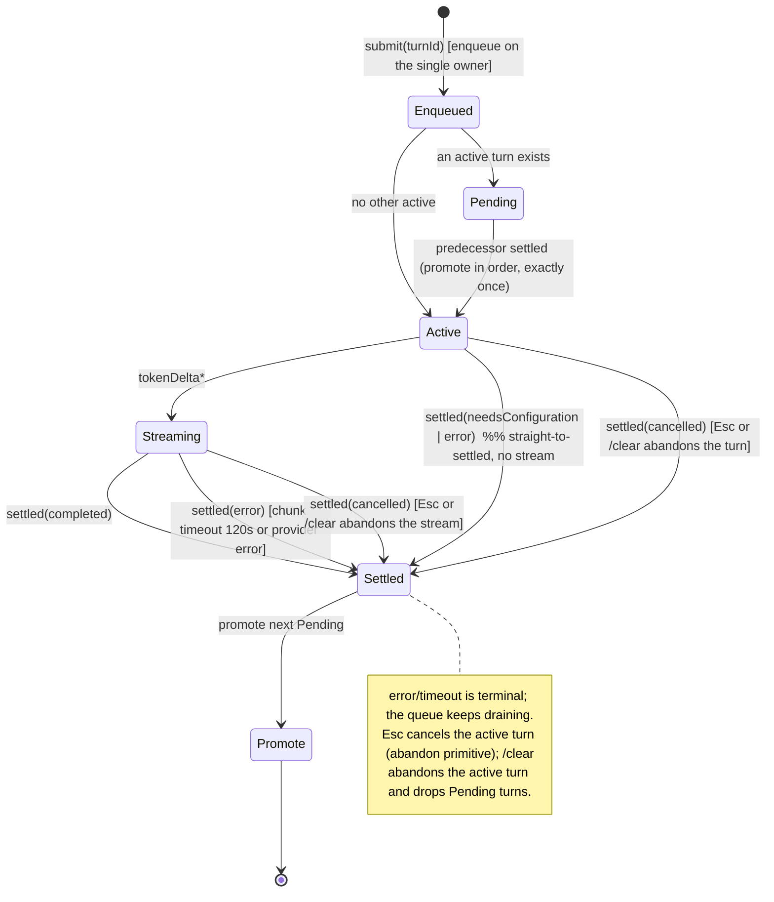
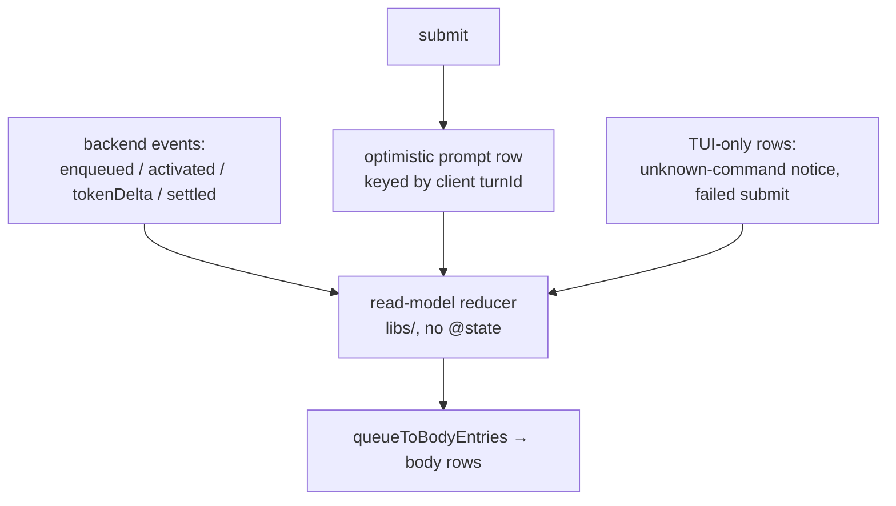
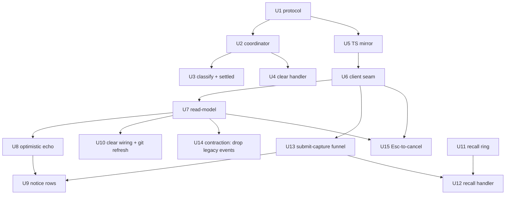

# feat: Backend-Owned Conversation Queue & Transcript, with TUI Prompt Recall

## Summary

Move the prompt queue and conversation transcript out of the Ink TUI and into the Rust backend: the backend appends turns, serializes execution one at a time behind a single-owner coordinator with an exactly-once promotion signal, classifies each turn's terminal result, and streams queue-lifecycle + token events over JSON-RPC. The TUI drops its `drainQueue` serialization and becomes an event-fed mirror — with an optimistic local echo of the just-submitted prompt (so nothing lags or vanishes on a dead backend) and client-only rows for non-conversation items. A new TUI-owned, in-memory prompt-history recall (up/down) captures every submitted line, including unknown commands, for fix-and-resubmit. Transcript state is in-memory this pass, shaped for the deferred durable/`resume` follow-on.

---

## Problem Frame

The queue lives entirely in the TUI today (`tui/src/state/promptQueue/atoms.ts`): `drainQueue` serializes turns by awaiting each `submitStreaming`, so the backend (`src/backend.rs`) only ever sees one submit at a time and has no queue or transcript of its own — it fire-and-forgets a detached streaming thread per submit with **no completion signal back to the receive loop**. This puts core state transitions in the view layer, against the project's own architecture mandate (`AGENTS.md`: core state transitions belong in Rust so the headless CLI and TUI stay consistent), and leaves unknown `/command` submissions visible but unrecoverable — a mistyped `/hepl` cannot be recalled and fixed. Full framing in the origin requirements doc (see Sources & References).

---

## Requirements

Traced from the origin requirements doc.

**Backend owns the queue + transcript**
- R1. The backend owns an ordered transcript of turns (stable id, sequence, submitted prompt, lifecycle state, settled result).
- R2. The backend serializes execution: at most one active turn; additional submits queued and promoted in order as the active turn settles.
- R3. On submit, the backend appends the turn and returns an immediate ack; it emits lifecycle events (enqueued, activated, settled).
- R4. The backend streams per-turn token deltas and a terminal outcome (completed / needs-configuration / error), correlated by turn id.
- R5. The backend classifies each turn's terminal result (kind + canonical user-facing message); the TUI does not. The no-backend-available message stays TUI-side.

**TUI as an event-fed mirror**
- R6. The TUI holds no queue/serialization logic; it renders a read-model reconstructed from backend events, with an optimistic echo of the in-flight submit.
- R7. The TUI maps the transcript to body rows (existing `queueToBodyEntries` responsibility retained), with live streaming text for the active turn.
- R8. The rendered body composes mirrored backend turns with TUI-only rows (unknown-command notices, failed submits), ordered by submission.
- R9. View-only concerns stay in the TUI: scroll, caret placement, layout, theme, display-text sanitization.

**Slash commands & unknown-command handling**
- R10. Slash-command matching/dispatch stays client-side; valid commands run client effects and are not sent to the backend as prompts.
- R11. `/clear` clears the backend transcript and resets local scroll; it does not clear the recall ring.
- R12. An unknown `/command` is not sent to the backend; the TUI renders a client-only notice and preserves the raw text for recall.

**Prompt-history recall**
- R13. The TUI maintains an in-memory recall ring capturing every submitted line (prompts, valid commands, unknown commands) for the session.
- R14. Caret within text → up/down move the caret; caret on the first line → up recalls previous; on the last line → down recalls next.
- R15. Recall clamps at the oldest entry; the half-typed draft is captured on first recall and restored by paging down past the newest, then stops.
- R16. A recalled entry replaces the composer content with the caret at the end; it can be edited and resubmitted.

**Persistence-readiness**
- R17. The backend transcript is modeled in memory shaped to the planned provisional `sessions`/`turns` records so durable writes are additive later (structural, not user-observable).

**Cancellation (plan-time addition, user-confirmed)**
- R18. The user can cancel the active turn (Esc): the backend abandons its provider stream, settles it `cancelled`, and promotes the next; `/clear` reuses the same abandon primitive. This extends beyond the origin brainstorm — which deferred cancellation — at the user's explicit request during planning.

**Origin actors:** A1 User, A2 Ink TUI (view + input mirror), A3 Rust backend (queue/transcript owner).
**Origin flows:** F1 submit-and-stream, F2 submit-while-active (queueing), F3 unknown command, F4 recall-and-fix, F5 clear.
**Origin acceptance examples:** AE1 (R2,R3), AE2 (R2), AE3 (R12,R13), AE4 (R11), AE5 (R14), AE6 (R15), AE7 (R4,R5).

*R9 (view-only concerns) and R10 (client-side slash-command dispatch) are preserved-existing-behavior invariants, not assigned to a delivery unit; they are verified via the "Unchanged invariants" list in System-Wide Impact (R9 is also exercised by U7's rendering, R10 by U13's dispatch routing).*

---

## Scope Boundaries

- Durable persistence (JSONL truth log + SQLite index population) and `/resume` — the additive follow-on, not this pass. In-memory only.
- Cancelling a specific *queued* (not-yet-active) turn, and automatic mid-turn cancellation — out; only Esc-cancel of the single active turn is in scope this pass (R18).
- Reordering or editing already-queued (pending) prompts — out.
- Concurrent/parallel turns — out; strictly one-at-a-time.
- Cross-session persisted prompt history / history search — out; recall is session-local (future R067).
- Sending a prompt whose text legitimately begins with `/` — out; the existing `startsWith('/')` routing treats it as a command (documented limitation this pass).
- Reshaping the provisional `sessions`/`turns` schema beyond the minimal fields this migration needs — the later session milestone owns final shape.
- Git-status migration is already backend-owned (`kqode.git.status`) — not part of this work.

### Deferred to Follow-Up Work

- Durable turn-writes + `/resume`: separate milestone once the SQLite `sessions`/`turns` foundation (`docs/plans/2026-07-05-002-feat-provider-login-and-model-selection-plan.md`) lands.
- Capturing the net-new institutional learnings (JSON-RPC mirror discipline, server-initiated streaming notifications, backend-owned transcript phasing) via `/ce-compound` after this lands — `docs/solutions/` has zero coverage of these today.

---

## Context & Research

### Relevant Code and Patterns

- **Protocol mirror (four-file lockstep):** `src/protocol.rs` (method/notification consts, `RpcMethod` enum for **requests only** + `from_method`/`as_str`, serde `deny_unknown_fields` on inbound params, `camelCase` on results/notifications) ↔ `tui/src/contracts/backend/messages.ts` (dep-free seam) ↔ `tui/src/backend/protocol/messageProtocol.ts` (`RequestType`/`NotificationType` descriptors) ↔ `tui/src/backend/client/messageConnectionClient.ts` (handlers registered before send, correlated by client `turnId`) + `tui/src/contracts/backend/client.ts` (`BackendClient` contract).
- **Backend streaming + deferred-response templates:** `src/backend.rs` (`run_loop`, `handle_request -> Option<Response>`, `handle_message_submit` ack-then-stream, `spawn_git_status` deferred response, `io_threads.join()`/sender-clone shutdown coupling) and `src/chat/turn.rs` (`spawn_streaming_turn`, the `emit` sink, per-turn current-thread tokio runtime, `NEXT_CHUNK_TIMEOUT = 120s`, `token_delta`/`turn_end`/`turn_error`). Provider error classification already exists: `src/provider/error.rs` (`ProviderError::kind()` → stable tags).
- **Current TUI queue/transcript:** `tui/src/state/promptQueue/atoms.ts` (`enqueuePromptAtom`, `drainQueue`, `streamActive`, `settleActive`, `appendUnknownCommandAtom`, `clearTranscriptAtom`, and the post-settle `refreshGitStatusAtom` trigger), `store.ts` (`promptQueueAtom`, `streamingTextByIdAtom` — O(1) hot-path map), `tui/src/libs/promptQueue/promptQueue.ts` (`QueueItem`, `queueToBodyEntries` WeakMap-memoized, `buildItemEntries`, `outcomeToResult` — the classification that moves to the backend, `BACKEND_UNAVAILABLE_MESSAGE` stays / `NEEDS_CONFIGURATION_MESSAGE` moves), `streamCoalescer.ts` (`createDeltaCoalescer`). Read-model bridge: `submittedPromptEntriesAtom` in `tui/src/state/ui/atoms.ts`.
- **Composer input:** `tui/src/components/PromptComposer/usePromptComposerInput.ts` (ordered `COMPOSER_KEY_HANDLERS`, first-true-wins), `input/handleSubmit.ts` (the submit funnel: prompt vs `exactCommandMatch` vs `appendUnknownCommandAtom`), `input/handleCursorMove.ts` (up/down = cursor move), `tui/src/libs/composer/composerWindow.ts` (`resolveVerticalCursorIndex` returns `null` at first/last row — the documented "seam for future history traversal"), `@components/SlashCommandMenu/handleMenuKey.ts` (runs before cursor move; owns up/down when the menu is open). Composer text/cursor state is atom-backed in `tui/src/state/ui/composer/`.
- **Backend client seam:** `backendClientAtom` (`tui/src/state/global/backend.ts`), injected at the composition root (`tui/src/bootstrap.ts` → `startBackendRuntime`), lifecycle machine + respawn-on-dead in `tui/src/backend/client/backendClient.ts`.
- **Input is NOT locked during streaming** (`tui/src/state/ui/inputLock.ts` derives only from startup), so `/clear`, recall, and further submits are reachable mid-stream — the `/clear`-during-stream cases are real, not theoretical.

### Institutional Learnings

- `docs/solutions/architecture-patterns/backend-process-lifecycle-ownership-in-the-ink-tui.md` — display/state reach the backend **only** through the injected `BackendClient` seam; the guardrail test `tui/src/__tests__/backendIsolation.test.ts` forbids `state/**` and `components/**` from importing process/transport internals. The new server-initiated lifecycle events are not tied to a single call, so the seam gains an **event/subscription surface** (transport in `@backend`, payload types in `contracts/`). The doc's "submitMessage only" line is stale (today it is `submitStreaming` + `gitStatus`).
- `docs/solutions/architecture-patterns/state-libs-layering-and-cycle-verification-in-the-ink-tui.md` — `state/` is atoms-only; pure logic (event→read-model reduction, recall-ring math, notice interleaving) lives in `libs/<domain>/` and must **never** import `@state`. Verify with the doc's embedded Tarjan detector — **`madge` gives a false pass** here.
- `docs/solutions/architecture-patterns/terminal-edge-rendering-tradeoffs-in-the-ink-tui.md` — recall replaces composer contents with taller/shorter text, changing frame height and the `FULLSCREEN_GUARD_ROWS`↔`INK_CURSOR_ROW_ORIGIN_OFFSET` interaction. **No test covers cursor-row drift** — manually verify the caret lands on the composer row for single- and multi-line recalled prompts.
- `docs/solutions/workflow-issues/recovering-from-concurrent-agent-session-edits.md` — this branch has concurrent committers and this is a multi-file Rust↔TS lockstep change (largest blast radius). Probe `git status`/mtimes before each batch, re-read fresh, never revert over an active session, and gate with `cargo xtask tui-typecheck && cargo xtask tui-test` plus a protocol-residue grep.

### External References

None — the work reuses established local patterns (streaming notifications, deferred responses, protocol mirror, jotai atoms, the delta coalescer, the composer key-handler dispatch).

---

## Key Technical Decisions

- **Backend serialization = a single-owner coordinator that owns both enqueue and promotion.** One owner (the receive loop reacting over the existing client receiver plus a turn-completion channel, or a dedicated coordinator that owns both) appends turns and promotes the next, so `never-two-active` and `promote-exactly-once` are **structural** (one serial thread), not lock-discipline-dependent. Turn execution stays on per-turn threads; each turn sends exactly one completion back. This replaces the current fire-and-forget detached-thread model (no completion signal — the core mechanism gap). Burst order is preserved because enqueue and promotion share one owner; a split "enqueue-on-loop + promote-on-worker" writes the transcript from two threads and is the root of the `/clear`-vs-settle race — rejected. The coordinator ignores a completion whose turn id is not the current active turn (idempotent promotion) and spawns only on activation.
- **The queue/transcript core is transport-agnostic.** `conversation` emits a domain event enum (enqueued / activated / token-delta / settled); `src/backend.rs` translates those to JSON-RPC notifications. The turn runner takes an **injected completion sink** (mirroring today's injected `emit`), so `src/chat/turn.rs` never imports `conversation` (no dependency cycle) and the multi-turn state machine stays headless-testable without `lsp-server`.
- **Lifecycle event set:** `enqueued` (id, seq, initial state active|pending), `activated` (a **distinct** event — a needs-config/error turn settles straight from activation with no `tokenDelta`, so the mirror needs an explicit activation signal to clear the pending marker), reused `tokenDelta`, and a unified `settled` carrying the backend-classified result (completed → assistant text + finishReason; needs-configuration; error → kind + message). Resolves the origin's deferred event-set question.
- **Migrate the terminal events by expand/contract (parallel-change), not a hard swap.** The protocol is a strict Rust↔TS lockstep mirror and the repo builds the TUI against the same-tree backend, so a commit where the backend stops emitting `turnEnd`/`turnError` but the client hasn't yet learned `settled` hangs every turn. During Phases A–C the backend **dual-emits** legacy `turnEnd`/`turnError` alongside the new events; a final contraction unit removes the legacy events (and runs the residue grep) only after the client consumes `settled`. Because needs-configuration was never a terminal event but the submit-ack status `SUBMIT_STATUS_NEEDS_CONFIGURATION`, the ack **keeps that status through Phases A–C too** (the ack simplification defers to the contraction unit) — otherwise a keyless submit at an intermediate commit hangs with no ack status and no legacy terminal event.
- **`needsConfiguration` becomes a settled turn outcome, evaluated at activation, and promotes the next normally** — a behavior change from today's ack-only path (no transcript entry). Follows R4/R5.
- **Error/timeout is terminal; the queue keeps draining. The active turn is cancellable (Esc).** There is no *automatic* mid-turn cancellation, but the user can abandon a stalled or unwanted active turn with Esc: the backend drops its provider stream, settles it as `cancelled`, and promotes the next. This is built as a single **abandon-active-turn primitive** (a per-turn cancellation signal the coordinator triggers) that `/clear` reuses. Reordering queued prompts and concurrent turns remain out; execution stays one-at-a-time.
- **`/clear` clears the backend transcript, drops pending turns, and abandons the active turn** via the shared abandon primitive (drops its provider stream immediately — no orphaned stream, no silent 120s drain). A `tokenDelta` already flushed to the wire before the clear is still handled client-side by the generation guard (next bullet). Local scroll resets regardless of RPC outcome; the recall ring is untouched. Reproduces today's "a cleared turn never resurrects" baseline.
- **The TUI mirror carries a client `conversationGeneration`, bumped on `/clear` and on respawn; the reducer drops every event — including lazy-create — for a turn id not in the current generation.** A turn's generation is stamped **lazily on its first backend event** (not at optimistic-echo time), so a submit made under generation N whose backend runs under N+1 — the very prompt that triggers a respawn — inherits N+1 and is not dropped by its own guard. This single guard makes `/clear`-during-stream and respawn correct on the client (client-minted turn ids never collide across generations), and is why the backend emit guard can stay best-effort.
- **Result classification moves to the backend** (`outcomeToResult` logic + the needs-configuration text), reusing `ProviderError::kind()`; `BACKEND_UNAVAILABLE_MESSAGE` stays TUI-side (a no-backend condition, not a turn outcome).
- **Optimistic echo, not strict pure-mirror:** the submitted prompt renders immediately keyed on the client `turnId`, reconciled by the `enqueued`/`activated` events; a submit that never lands (dead backend / transport error) renders a client-only failure row. Preserves no-regression and keeps the dead-backend prompt visible. The optimistic prompt row and the client-only failure row are intentional, plan-introduced no-regression mechanisms (grounded in origin R5 + the no-user-visible-regression success criterion) that deliberately relax the origin's "fully reconstructable from backend events" wording, reconciled by client `turnId`.
- **The client `turnId` is the turn identity, minted caller-side (state/composer) via an injected factory** — not inside `messageConnectionClient` as today — so optimistic echo has the id synchronously at submit time. Inject a `newTurnId()` factory at the composition root so `state/**` need not import `node:crypto`. (Note: `backendIsolation.test.ts` does not currently forbid `node:crypto`/`randomUUID`, so this isolation rests on the injected-factory convention — add those tokens to the guardrail if it should be test-enforced.) The backend adopts the id, preserving before-send correlation.
- **`BackendClient` grows a single transcript-event subscription (keyed by `turnId`) + a `clearConversation` method; submit becomes an accepted-ack (no `Promise<StreamOutcome>`).** All deltas and outcomes flow through the one subscription — the per-call `StreamCallbacks.onDelta` is **removed** so deltas never arrive twice. On a **fatal/closing** transport state (gated by `isFatalBackendError`, so a non-fatal `onError` cannot prematurely settle a turn the backend is still streaming) the subscription delivers a **synthetic terminal** so the reducer settles any in-flight turns (preserving today's `failAllTurns` no-regression; otherwise active rows dangle until respawn). The reducer drops all further events for a `turnId` once it is settled — including via a synthetic terminal — so a late real `settled`/`tokenDelta` cannot resurrect or double-settle it. Transport stays in `@backend`; payload types in `contracts/` (backend-isolation guardrail stays green).
- **TUI-only rows (optimistic prompts, failed submits, unknown-command notices) interleave with mirrored turns by a monotonic client submission sequence.**
- **The mirror resets on a fresh `backendReady`** (respawn = new session); the recall ring survives, client-only notice rows are dropped. Because `createBackendClient.ensureSession()` swaps the inner connection on respawn, the client must **re-attach** the transcript-event subscription to each new connection and expose an `onReady`/`onReconnect` callback that fires after every successful start; the runtime re-wires the subscription and bumps `conversationGeneration` on that callback (today `backendReady` is consumed inside `waitForBackendReady` and never re-emitted upward). The backend session id (`docs/plans/2026-07-05-001-feat-per-session-tui-and-backend-logs-plan.md`) is a **soft** dependency — the in-memory transcript is per-backend-process and the reset keys off this ready callback, so this pass does not hard-block on Plan 1 (verified: `announce_ready` sends no params today).
- **Recall ring is TUI-owned, in-memory, session-local:** captured via a single centralized submit funnel covering every submit path (including menu-run commands and Tab-then-Enter), collapses consecutive duplicates, bounded to a fixed max, stores text verbatim, discards edits to recalled entries on navigation, preserves the draft.
- **Recall fires only at the first-line-up / last-line-down boundary** (the existing `resolveVerticalCursorIndex === null` seam), via a handler placed before `handleCursorMove`; the slash menu keeps up/down precedence when open (recalling a `/command` re-opens the menu — fix inline or Esc to page). User-confirmed.
- **Reuse `createDeltaCoalescer` for high-frequency token deltas;** low-frequency lifecycle events are not coalesced.

---

## Open Questions

### Resolved During Planning

- Hard vs soft dependency on the backend session id → **soft**; the in-memory transcript is per-process and the mirror resets on `backendReady`.
- Lifecycle event set / promise-vs-subscription client contract → **one transcript-event subscription + accepted-ack submit**, events `enqueued`/`activated`/`tokenDelta`/`settled`.
- Backend serialization ownership → **single-owner coordinator** (one owner does enqueue *and* promote); the mutex-drained-by-turn-thread option is **rejected** (reintroduces the shared-transcript race).
- Is `activated` a distinct event → **yes** (straight-to-settled turns emit no `tokenDelta`, so the mirror needs an explicit activation signal).
- Clear-vs-stream / respawn correctness → **client `conversationGeneration` guard** in the reducer; the backend emit guard is best-effort only.
- Terminal-event migration → **expand/contract dual-emit**, with a dedicated contraction unit removing `turnEnd`/`turnError`.
- Is `needsConfiguration` a queued+settled turn now → **yes**, evaluated at activation.
- `turnId` minting → **caller-side via an injected factory** (synchronous for optimistic echo; no `node:crypto` in `state/**`).
- Recall vs slash-menu up/down precedence → **menu keeps precedence when open**.
- Optimistic vs pure-mirror rendering → **optimistic echo + client-only failure row + synthetic terminal on transport death**.

### Deferred to Implementation

- Exact new method/notification names and payload field names (finalized in U1, mirrored in U5).
- Whether the single owner is the receive loop itself (via `select!` over the client receiver + a completion channel) or a dedicated coordinator thread that both enqueue and promotion forward to — both preserve the single-owner invariant. **Dependency cost:** the `select!` route needs `crossbeam-channel` (~0.5, matched to lsp-server 0.7.9's 0.5.15) declared directly in `Cargo.toml` (it is transitive-only today); the dedicated-coordinator-thread route needs no new dependency (one `std::sync::mpsc` channel carrying a Submit/Clear/TurnComplete enum).
- Esc-key precedence in the composer when a turn is active: menu-dismiss (if the slash menu is open) vs cancel-active-turn vs armed-clear — the handler order must be defined so Esc cancels the active turn without breaking menu-dismiss or armed-clear.
- Recall ring maximum size `N` and the exact notice-row/optimistic-row interleave key precision.
- The domain-event enum shape emitted by `conversation` and its translation to JSON-RPC notifications in `src/backend.rs`.

---

## High-Level Technical Design

> *This illustrates the intended approach and is directional guidance for review, not implementation specification. The implementing agent should treat it as context, not code to reproduce.*

Backend-owned queue state machine (per turn), with events the TUI mirror consumes:

TUI mirror (event-fed read-model) composes three row sources by submission sequence:

---

## Implementation Units

Phased: **Phase A (U1–U4)** Rust backend, exercisable headlessly over JSON-RPC before any TUI work; **Phase B (U5–U6)** TS protocol mirror + seam; **Phase B/C boundary (U13)** submit-capture funnel; **Phase C (U7–U10, U15)** TUI mirror + Esc-cancel; **Phase D (U11–U12)** prompt-history recall (parallel with Phase C once U13 lands); **Contraction (U14)** remove legacy `turnEnd`/`turnError` after U7 consumes `settled`.

### U1. Backend protocol contract for the queue

**Goal:** Define the wire contract (Rust source of truth) for the queue-lifecycle notifications, the unified settled event, and the clear-conversation + turn-cancel requests.

**Requirements:** R1, R3, R4, R5, R11, R18

**Dependencies:** None (coordinate lockstep with U5)

**Files:**
- Modify: `src/protocol.rs`
- Test: `src/protocol.rs` inline/`tests.rs` (serde round-trip); wire assertions land in U2/U4 integration tests

**Approach:**
- Add notification consts + `camelCase` param structs: `enqueued` (turnId, seq, initial state), `activated` (turnId — a **distinct** event, not inferred from the first `tokenDelta`), unified `settled` (turnId, result: kind + optional text + optional finishReason/errorKind). Reuse existing `tokenDelta`.
- **Expand/contract:** keep `turnEnd`/`turnError` on the wire *alongside* the new events for now (the backend dual-emits in U2/U3); they are removed later in the contraction unit (U14), not here — so every intermediate commit stays runnable.
- Add a `RpcMethod` variant for `kqode.conversation.clear` (wire both `as_str()` and `from_method`) with param/result structs. **Keep the `message.submit` ack shape unchanged (including `SUBMIT_STATUS_NEEDS_CONFIGURATION`)** — the accepted-ack simplification is part of the U14 contraction, so the same-tree client keeps a working needs-config path during expand/contract.
- Add a `RpcMethod` variant for `kqode.turn.cancel` (params: `turnId`) and a `cancelled` kind to the `settled` result (completed | needsConfiguration | error | cancelled).
- Follow conventions: enum for requests only; plain consts + structs for notifications; `deny_unknown_fields` on inbound params only.

**Patterns to follow:** existing consts/structs in `src/protocol.rs`; `RpcMethod` `as_str`/`from_method`.

**Test scenarios:**
- Edge case: serde round-trips each new param/result struct (camelCase field names) without loss.
- Edge case: `from_method` maps the new clear method string to its variant and returns `None` for unknown methods.

**Verification:** `cargo test -p kqode` covers the protocol structs; the contract compiles and is ready to mirror in U5.

### U2. In-memory transcript + single-owner coordinator

**Goal:** Give the backend an ordered in-memory transcript and a single sequential executor that runs one turn at a time and promotes the next exactly once on settle.

**Requirements:** R1, R2, R3, R17, R18

**Dependencies:** U1

**Files:**
- Create: `src/conversation/mod.rs`, `src/conversation/transcript.rs`, `src/conversation/coordinator.rs`, `src/conversation/tests.rs` (standalone module — do **not** nest under `src/chat/`; it is multi-turn orchestration/state, mapping to the `kqode-core`/`kqode-session` crate target; keep each ≤ ~200 lines)
- Modify: `src/backend.rs` (enqueue on the single owner; `handle_request` arm for `kqode.turn.cancel`; translate `conversation` domain events → JSON-RPC notifications), `src/chat/turn.rs` (accept an **injected completion sink** + a **per-turn cancellation signal** checked in the stream loop, so it signals completion and can be abandoned without importing `conversation`)
- Test: `src/conversation/tests.rs`, `tests/conversation_queue.rs`

**Approach:**
- Transcript = ordered turns (id, seq, state, prompt, optional result) shaped to the provisional `sessions`/`turns` records (R17). One transcript per backend process (= one session). Do **not** import Plan 002's unlanded schema types — keep the in-memory model self-contained and map to persistence later.
- **Single-owner coordinator:** one owner performs both enqueue *and* promotion — either the receive loop reacting over the client receiver + a turn-completion channel, or a dedicated coordinator thread both forward to. Because one serial owner mutates the transcript, `never-two-active` and `promote-exactly-once` are structural. It activates the head, drives one turn on a per-turn thread, and on completion promotes the next; a completion whose turn id is not the current active turn is ignored (idempotent). The `select!`-over-the-receive-loop option needs `crossbeam-channel` (~0.5) added directly to `Cargo.toml` (transitive-only today); the coordinator-thread option needs no new dependency (`std::sync::mpsc`). Prefer per-turn oneshot completion channels (or `catch_unwind`) so a panicking turn still signals completion.
- `conversation` emits **domain events** (enqueued / activated / token-delta / settled); `src/backend.rs` translates them to JSON-RPC notifications — `conversation` never references `lsp-server`. The turn runner takes an injected completion sink (mirroring today's injected `emit`), so `chat` has no edge to `conversation`.
- **Shutdown contract:** on input-channel close the coordinator **stops promoting pending turns** (drops them) and finishes only the in-flight turn (bounded ≤120s, matching today); `run_stdio` joins the coordinator before `io_threads.join()` so all `connection.sender` clones drop. Wrap the turn body in `catch_unwind` (or treat a dropped completion sender as an error-settle) so a panicking turn still settles and the queue cannot stall.
- **Abandon-active-turn primitive:** the coordinator holds the active turn's cancellation handle; `abandon_active(turnId)` triggers it, the turn's stream loop observes it (via `select!` alongside the chunk-timeout / `stream.next()`), drops the provider stream, and settles the turn as `cancelled`; the coordinator then promotes the next. Both `kqode.turn.cancel` (Esc, U15) and `/clear` (U4) call this one path. Dropping the per-turn stream/runtime aborts the in-flight request.

**Execution note:** Start with failing tests for the serialization invariants (they define the mechanism).

**Technical design:** see the queue state machine above.

**Patterns to follow:** `src/backend.rs` `handle_message_submit` ack-then-stream; `src/chat/turn.rs` injected `emit` sink + per-turn runtime; the `spawn_git_status` sender-clone/shutdown discipline.

**Test scenarios:**
- Covers AE1. Happy path: idle submit A → A `enqueued` active → `tokenDelta*` → `settled(completed)`.
- Covers AE2. Happy path: submit A then B while A active → B `enqueued` pending; A `settled` → B `activated` exactly once.
- Edge case: burst submit A, B, C → transcript order A,B,C; exactly one active at any time; two rapid completions never leave two active.
- Error path: A errors mid-stream with B pending → A `settled(error)`, B still promotes and runs.
- Error path: a panicking turn thread still settles (via `catch_unwind`/dropped-sender) so the next turn promotes — the queue does not stall.
- Integration: stdin closes with pending turns → clean, prompt shutdown (only the in-flight turn finishes, pending never run); all `sender` clones drop so `io_threads.join()` returns (no hang).
- Edge case: `abandon_active` on the streaming turn settles it `cancelled`, stops its stream, and promotes the next pending turn; no second stream ran.

**Verification:** headless JSON-RPC exercise shows one-at-a-time execution, ordered promotion, no orphaned/double-active turns, and clean bounded shutdown.

### U3. Backend result classification + unified settled event

**Goal:** Move result classification into the backend and emit it on `settled`.

**Requirements:** R4, R5

**Dependencies:** U1, U2

**Files:**
- Modify: `src/chat/turn.rs` (produce a classified result on the injected completion sink — no `lsp-server` types), `src/conversation/coordinator.rs` (emit the `settled` domain event from the classified result), `src/conversation/transcript.rs` (result type), `src/config.rs` or `src/conversation/` (owns the needs-configuration message text)
- Test: `src/conversation/tests.rs`, `tests/message_submit.rs`

**Approach:**
- Map provider outcomes to a classified **domain** result at settle time: completed → assistant text + finishReason; provider error → error kind + message (reuse `ProviderError::kind()`); missing key → needs-configuration with the backend-owned message; an abandoned turn (Esc / `/clear`) → `cancelled`. `src/backend.rs` translates the `settled` domain event to the JSON-RPC notification (and, during expand/contract, also to legacy `turnEnd`/`turnError` — a `cancelled` outcome maps to a legacy `turnError` during the window so the old client still settles it). `needsConfiguration` is evaluated at activation and settles immediately (no stream), then promotes the next.
- The TUI's `outcomeToResult` + `NEEDS_CONFIGURATION_MESSAGE` are removed in U7/U9; `BACKEND_UNAVAILABLE_MESSAGE` stays TUI-side.

**Patterns to follow:** `src/provider/error.rs` `kind()` classification; existing `turn_error`/`turn_end` construction.

**Test scenarios:**
- Covers AE7. Error path: no API key → the activated turn settles with a needs-configuration result carrying the backend message; the next queued turn promotes.
- Error path: provider error → `settled(error)` with a stable error kind + sanitized message; no secret material.
- Happy path: completed turn → `settled(completed)` with assembled assistant text + finishReason.
- Edge case: a straight-to-settled turn (needs-config / immediate error) emits no `tokenDelta` and produces no empty assistant row downstream.
- Edge case: an abandoned turn settles `settled(cancelled)` (dual-emitted as a legacy `turnError` during expand/contract).

**Verification:** integration frames show a single classified `settled` per turn; no classification remains TUI-side.

### U4. Clear-conversation request handler

**Goal:** Implement `kqode.conversation.clear` — clear the transcript, drop pending turns, suppress the active turn's remaining events.

**Requirements:** R11

**Dependencies:** U1, U2

**Files:**
- Modify: `src/backend.rs` (`handle_request` arm), `src/conversation/coordinator.rs` / `transcript.rs` (clear on the single owner; drop pending; call `abandon_active` from U2)
- Test: `src/conversation/tests.rs`, `tests/conversation_clear.rs`

**Approach:**
- Clear runs on the single owner: it empties the transcript, drops pending turns, and **abandons the active turn via the U2 abandon primitive** (drops its provider stream immediately — no orphaned stream). The client-side `conversationGeneration` guard (U7) still covers a `tokenDelta` already on the wire. Returns an ack.

**Test scenarios:**
- Covers AE4. Happy path: clear with settled turns → transcript empty; a subsequent submit starts fresh.
- Edge case: clear while turns are pending → pending dropped; no `activated` events fire for them afterward.
- Edge case: clear while a turn is actively streaming → the active turn is abandoned (stream dropped, settled `cancelled`); because clear and settle serialize on one owner there is no torn state. (The client guarantee that a wire-race delta cannot resurrect the row is tested in U7.)

**Verification:** headless exercise confirms cleared/dequeued turns never emit rows after clear.

### U5. Mirror the protocol in the TS contract + descriptors

**Goal:** Mirror U1's contract on the TypeScript side in lockstep.

**Requirements:** R3, R4, R5, R11, R18

**Dependencies:** U1

**Files:**
- Modify: `tui/src/contracts/backend/messages.ts` (consts + camelCase types, each with a "Must match `src/protocol.rs`" doc comment), `tui/src/backend/protocol/messageProtocol.ts` (`NotificationType`/`RequestType` descriptors)
- Test: `tui/src/backend/protocol/__tests__/messageProtocol.test.ts`

**Approach:** Add the `enqueued`/`activated`/`settled` notification types (including the `cancelled` settled kind), the clear + turn-cancel request descriptors, and the adjusted (accepted-ack) submit result, mirroring names/shapes exactly. Keep the existing `turnEnd`/`turnError` descriptors in place (expand/contract) — they are removed later in U14, not here.

**Execution note:** Re-read both files fresh immediately before editing (concurrent-committer risk on the lockstep).

**Patterns to follow:** existing mirrored consts/types and the doc-comment cross-references in `messages.ts`.

**Test scenarios:**
- Integration: paired in-memory JSON-RPC streams round-trip each new notification and the clear request (params/results decode to the mirrored types).
- Edge case: the legacy `turnEnd`/`turnError` descriptors still type-check and round-trip (they remain during expand/contract).

**Verification:** `cargo xtask tui-typecheck` passes; protocol test green.

### U6. Extend the BackendClient seam (subscription surface + clear)

**Goal:** Grow the client seam to deliver server-initiated lifecycle events and `clearConversation` + `cancelTurn` calls, with submit as an accepted-ack.

**Requirements:** R3, R4, R6, R11, R18

**Dependencies:** U5

**Files:**
- Modify: `tui/src/contracts/backend/client.ts` (replace `submitStreaming`'s `StreamCallbacks`/`Promise<StreamOutcome>` with an accepted-ack submit + a single `onTranscriptEvent` subscription + `clearConversation` + `cancelTurn(turnId)`), `tui/src/backend/client/messageConnectionClient.ts` (register the one lifecycle subscription at connection setup; dispatch by `turnId`; synthesize a terminal on fatal close), `tui/src/backend/client/backendClient.ts` (lifecycle wrapper, `markDead` on fatal; **own the transcript-event subscription registry, re-attach it to each new inner connection on respawn, and expose an `onReady`/`onReconnect` callback that fires after every successful start**), `tui/src/bootstrap.ts` (inject a `newTurnId()` factory)
- Test: `tui/src/backend/client/__tests__/backendClient.test.ts`, `tui/src/backend/protocol/__tests__/messageProtocol.test.ts`

**Approach:**
- One event path: a single `onTranscriptEvent(handler)` subscription delivers `enqueued`/`activated`/`tokenDelta`/`settled` (the per-call `StreamCallbacks.onDelta` is **removed** so deltas never arrive twice), plus `clearConversation()` and `cancelTurn(turnId)`. Submit returns an accepted-ack (no `Promise<StreamOutcome>`); the outcome arrives via `settled`. `turnId` is minted caller-side via the injected factory (so optimistic echo has it synchronously) and passed into submit. On a **fatal/closing** transport state (gated by `isFatalBackendError`, so a non-fatal `onError` does not prematurely settle a still-streaming turn) the subscription emits a **synthetic terminal** for each in-flight `turnId` so the reducer settles those turns (replacing today's `failAllTurns`). Across an internal respawn (`ensureSession()` swaps the inner connection) the wrapper **re-attaches** `onTranscriptEvent` to the new connection and fires `onReady` so the runtime can reset the mirror and bump the generation. All transport stays in `@backend`; only payload types cross into `contracts/`.

**Patterns to follow:** the existing before-send handler registration + `activeTurns` correlation in `messageConnectionClient.ts`; `withRequestTimeout` + `toBackendClientError`.

**Test scenarios:**
- Happy path: a fake server emitting `enqueued`→`tokenDelta*`→`settled` drives the subscription handlers in order.
- Edge case: a `tokenDelta` delivered before `activated` for a turn is still dispatched (subscription registered at connection setup).
- Edge case: a single delta is delivered exactly once (no double-delivery now that per-call `onDelta` is gone).
- Error path: a fatal transport close mid-stream delivers a synthetic terminal for each in-flight `turnId` (so no row dangles) and marks the backend dead; a non-fatal `onError` does not settle a still-streaming turn.
- Integration: after an internal respawn, `onTranscriptEvent` is re-attached to the new connection and `onReady` fires — post-respawn turns stream/settle in the mirror rather than going silent.
- Happy path: `cancelTurn(turnId)` sends the cancel request; the fake server settles that turn `cancelled` and the subscription delivers it.
- Integration: `backendIsolation.test.ts` stays green (no process/transport internals leaked into state/components).

**Verification:** `cargo xtask tui-typecheck && cargo xtask tui-test`; isolation guardrail green.

### U7. Event-fed transcript read-model (replace `drainQueue`)

**Goal:** Turn the TUI queue state into a mirror reduced from backend events; remove the serialization loop.

**Requirements:** R6, R7, R8

**Dependencies:** U6

**Files:**
- Modify: `tui/src/state/promptQueue/atoms.ts` (remove `drainQueue`/`streamActive`/`settleActive`; subscribe + reduce), `tui/src/state/promptQueue/store.ts` (add the `conversationGeneration` atom), `tui/src/backend/runtime/backendRuntime.ts` (wire the subscription; bump `conversationGeneration` on the client's `onReady` callback from U6)
- Create: `tui/src/libs/promptQueue/transcriptReducer.ts` (pure event→read-model reduction; no `@state` import)
- Test: `tui/src/state/promptQueue/__tests__/atoms.test.ts` (rewrite), `tui/src/libs/promptQueue/__tests__/transcriptReducer.test.ts`

**Approach:**
- Reduce `enqueued`/`activated`/`tokenDelta`/`settled` into the transcript read-model; keep `queueToBodyEntries` and the O(1) `streamingTextByIdAtom` hot path (reuse `createDeltaCoalescer` for token deltas). Handle out-of-order (lazy-create a turn on an early `tokenDelta`) and idempotent duplicates (no double row, never two active). The `settled` result kind includes `cancelled`, rendered as a distinct muted row via `queueToBodyEntries`.
- Carry a client `conversationGeneration` (bumped on `/clear` and on the client's `onReady` callback). Stamp a turn's generation **lazily on its first backend event** (not at optimistic-echo time), so the respawn-triggering submit — born under generation N, backend runs under N+1 — inherits N+1 and is not dropped by its own guard. The reducer drops every event (including lazy-create) for a `turnId` not in the current generation, and drops all further events for a `turnId` once it is settled (including via a synthetic terminal) so a late real `settled`/`tokenDelta` cannot resurrect or double-settle it.

**Patterns to follow:** existing `queueToBodyEntries`/`streamingTextByIdAtom` memoization; `state/`-atoms-only + `libs/`-pure split (verify no cycles with the Tarjan detector, not `madge`).

**Test scenarios:**
- Happy path: `enqueued(active)`→`tokenDelta`×N→`settled(completed)` yields a user row + streamed assistant row → final assistant row.
- Edge case: `tokenDelta` before `activated` lazily creates the turn; no dropped tokens, no crash.
- Edge case: duplicate/replayed `settled` or `activated` is idempotent (no double assistant row, never two active).
- Edge case: a `tokenDelta` for a prior-generation `turnId` (arriving after `/clear` or after a respawn) is dropped — no resurrected row.
- Edge case: the respawn-triggering submit (born under generation N, backend runs under N+1) is stamped on its first backend event and is NOT dropped — it streams and settles.
- Edge case: a `settled`/`tokenDelta` arriving after the turn was already settled (including via a synthetic terminal) is dropped — no double-settle, no resurrection.
- Edge case: a `settled(cancelled)` renders the turn as a cancelled (muted) row, not an error.
- Integration: thousands of deltas rebuild only the active turn's row (O(1) hot path preserved).

**Verification:** existing transcript behavior renders identically from events; `cargo xtask tui-test` green.

### U8. Optimistic echo + failed-submit client rows

**Goal:** Render the submitted prompt immediately and reconcile with backend events; show a client-only row when a submit never lands.

**Requirements:** R6, R8

**Dependencies:** U7

**Files:**
- Modify: `tui/src/state/promptQueue/atoms.ts` (optimistic entry on submit, reconcile on `enqueued`), `tui/src/backend/client/backendClient.ts` (surface submit-never-acked)
- Create: `tui/src/libs/promptQueue/rowComposition.ts` (compose optimistic + mirrored + client rows by a monotonic client submission sequence)
- Test: `tui/src/state/promptQueue/__tests__/atoms.test.ts`, `tui/src/libs/promptQueue/__tests__/rowComposition.test.ts`, `tui/src/__tests__/App.submit.test.tsx`

**Approach:**
- On submit, mint the `turnId` caller-side (via the injected factory from U6), add an optimistic prompt row keyed by it, and pass it into submit; when `enqueued`/`activated` arrive, reconcile onto the mirrored turn. If the submit ack rejects or a synthetic terminal fires (dead backend / transport), emit a client-only failure row carrying `BACKEND_UNAVAILABLE_MESSAGE`.

**Test scenarios:**
- Happy path: submit shows the prompt instantly; the mirrored turn reconciles without a duplicate row.
- Error path: with no backend client wired, submit renders the prompt + a client-only "backend unavailable" row (preserves today's `enqueuePromptAtom` no-backend behavior).
- Edge case: submission ordering is preserved when the ack lags the optimistic render.

**Verification:** no perceptible latency before the prompt appears; dead-backend submit still shows prompt + error.

### U9. Unknown-command notice rows

**Goal:** Replace the transcript-injecting `appendUnknownCommandAtom` with a client-only notice row.

**Requirements:** R12, R8

**Dependencies:** U8, U13

**Files:**
- Modify: `tui/src/components/PromptComposer/input/handleSubmit.ts` (unknown → notice row, no backend call; capture via the U13 funnel), `tui/src/state/promptQueue/atoms.ts` (client notice-row source), `tui/src/libs/promptQueue/promptQueue.ts` (notice-row model; remove `NEEDS_CONFIGURATION_MESSAGE`)
- Test: `tui/src/state/promptQueue/__tests__/atoms.test.ts` (migrate the `appendUnknownCommandAtom` cases), `tui/src/components/PromptComposer/__tests__/` (if present)

**Approach:** Unknown `/command` → a client-only notice row composed via U8's interleave mechanism (by submission sequence), never a backend turn or a fake settled `QueueItem`.

**Test scenarios:**
- Covers AE3. Happy path: submit `/hepl` → no `message.submit` call; a client-only notice row appears; works even when the backend is dead.
- Edge case: a notice submitted while a real turn streams orders after that turn's prompt/stream, not before.
- Migration: the former `appendUnknownCommandAtom` "user + error transcript pair, all settled" assertions are replaced with notice-row assertions.

**Verification:** unknown commands never reach the backend and render as notices; migrated tests green.

### U10. `/clear` wiring + re-own git-status refresh

**Goal:** Route `/clear` to the backend clear call and restore the post-settle git-status refresh lost with `drainQueue`.

**Requirements:** R11

**Dependencies:** U7

**Files:**
- Modify: `tui/src/libs/commands/executeCommand.ts` / its `CommandActions` wiring in `tui/src/components/PromptComposer/index.tsx` (`/clear` → backend `clearConversation` + reset scroll), `tui/src/state/promptQueue/atoms.ts` (settled handler fires `refreshGitStatusAtom`)
- Test: `tui/src/state/promptQueue/__tests__/atoms.test.ts`, command/composer tests

**Approach:** `/clear` calls `clearConversation()` and resets local scroll regardless of RPC outcome; the recall ring is untouched. The read-model's `settled` handler re-owns `refreshGitStatusAtom` (previously fired by `drainQueue`).

**Test scenarios:**
- Covers AE4. Happy path: `/clear` clears the mirrored transcript and resets scroll; up-arrow still recalls prior submissions (ring survives).
- Error path: `/clear` with a dead backend still resets local scroll/mirror.
- Integration: a completed turn triggers a git-status refresh (parity with the old `drainQueue` behavior).

**Verification:** clearing works with/without a live backend; git label refreshes after a turn settles.

### U11. Recall ring (pure lib + state)

**Goal:** Session-local recall ring with navigation, draft preservation, dedup, and bounds.

**Requirements:** R13, R15

**Dependencies:** None

**Files:**
- Create: `tui/src/libs/composer/recallRing.ts` (pure; no `@state` import), `tui/src/libs/composer/__tests__/recallRing.test.ts`, `tui/src/state/ui/composer/recall.ts` (atoms)
- Test: as above + `tui/src/state/ui/composer/__tests__/`

**Approach:** Append every submitted line; navigate previous/next; collapse consecutive duplicates; bound to a fixed max; store text verbatim; on first recall capture the current draft; restore the draft when paging down past the newest; discard edits to recalled entries on navigation.

**Test scenarios:**
- Happy path: append `foo`, `bar`; up recalls `bar` then `foo`; down returns toward newest then the draft.
- Covers AE6. Edge case: type `half`, up (draft saved), down past newest → `half` restored; down again → no-op; at oldest, up → no-op.
- Edge case: consecutive duplicate submissions collapse; ring never exceeds the max size.
- Edge case: editing a recalled entry then navigating discards the edit (original draft still restorable).

**Verification:** ring math is fully unit-covered independent of the composer.

### U12. Centralized submit capture + recall composer handler

**Goal:** Capture every submitted line into the ring from one funnel, and add the boundary-triggered recall key handler.

**Requirements:** R13, R14, R16

**Dependencies:** U11, U13

**Files:**
- Create: `tui/src/components/PromptComposer/input/handleHistoryRecall.ts`
- Modify: `tui/src/components/PromptComposer/usePromptComposerInput.ts` (insert the recall handler before `handleCursorMove`); the submit-capture funnel it draws from is created in U13
- Test: `tui/src/components/PromptComposer/input/__tests__/`, `tui/src/components/PromptComposer/__tests__/`

**Approach:** Recall reads from the U13 capture funnel (which already covers prompts, valid commands including menu-run/Tab-then-Enter, and unknown commands). The recall handler fires only when `resolveVerticalCursorIndex` would return `null` (caret on first line + up / last line + down), else returns `false` to fall through to `handleCursorMove`; the menu keeps up/down precedence when open. A recalled entry replaces the composer with the caret at the end. On recall, set the slash menu **dismissed** so up/down keep paging history; it reappears the moment the user edits the recalled text (correcting a recalled `/command` still gets menu guidance). This assumes the dismiss flag resets on edit — verify in implementation.

**Execution note:** After wiring, **manually verify** the caret lands on the composer row for single- and multi-line recalled prompts (no automated test covers cursor-row drift; do not touch `FULLSCREEN_GUARD_ROWS`/`INK_CURSOR_ROW_ORIGIN_OFFSET`).

**Test scenarios:**
- Covers AE5. Happy path: caret on a middle line + up → caret moves up (no recall); caret on the first line + up → recalls previous.
- Edge case: single-line / empty composer → up recalls previous, down recalls next/draft.
- Edge case: every submit path is captured — real prompt, `/clear` (valid), `/hepl` (unknown), and a command run via the slash menu's Enter are all recallable in order.
- Edge case: recalled multi-line (pasted) entry — up moves the caret up within it until the first line, then recalls older; newlines preserved on resubmit.
- Error path: whitespace-only / over-limit submit adds nothing to the ring and preserves composer text.

**Verification:** recall + fix + resubmit works from every submit path; caret placement verified manually.

### U13. Extract the shared submit-capture funnel

**Goal:** Route every composer submit through one funnel before U9 and U12 build on it, so the two do not collide on `handleSubmit.ts`/`handleMenuKey.ts`.

**Requirements:** R12, R13

**Dependencies:** U6

**Files:**
- Create: `tui/src/libs/composer/submitCapture.ts` (the single funnel both submit paths invoke) + `__tests__/`
- Modify: `tui/src/components/PromptComposer/input/handleSubmit.ts` and `@components/SlashCommandMenu/handleMenuKey.ts` (route prompt / valid-command / menu-run / unknown submits through the funnel)
- Test: `tui/src/libs/composer/__tests__/submitCapture.test.ts`, composer input tests

**Approach:** A single capture funnel that every submit exit calls, so a later ring append (U12) and the notice-row path (U9) attach to one seam rather than editing both handlers in parallel. Sequenced at the Phase B/C boundary; U9 and U12 depend on it, not on each other. This directly reduces the concurrent-committer blast radius on the composer.

**Test scenarios:**
- Happy path: a real prompt, a valid `/clear`, a menu-run command, and an unknown `/hepl` all pass through the funnel exactly once each, in submission order.
- Error path: whitespace-only / over-limit submit does not invoke the funnel (nothing to capture).

**Verification:** all four submit paths funnel through one call site; U9 and U12 attach without editing each other's files.

### U14. Contraction: remove legacy `turnEnd`/`turnError`

**Goal:** Complete the expand/contract migration by removing the dual-emitted legacy terminal events and simplifying the submit ack once the client consumes `settled`.

**Requirements:** R3, R4

**Dependencies:** U7

**Files:**
- Modify: `src/protocol.rs`, `src/chat/turn.rs` / `src/backend.rs` (stop dual-emitting `turnEnd`/`turnError`; collapse the submit ack), `tui/src/contracts/backend/messages.ts`, `tui/src/backend/protocol/messageProtocol.ts`, `tui/src/backend/client/messageConnectionClient.ts` (drop the legacy descriptors/handlers and the ack-status branch)
- Test: `tests/message_submit.rs`, `tui/src/backend/protocol/__tests__/messageProtocol.test.ts`

**Approach:** Land only after U7 settles turns from `settled`. Remove the legacy events on both sides in lockstep, **collapse the `message.submit` ack to a plain accepted-ack (removing `SUBMIT_STATUS_NEEDS_CONFIGURATION`, deferred here from U1)** so needs-config now resolves purely via a `settled` event, and run the residue grep (moved here from U5) to prove no `turnEnd`/`turnError` shape survives.

**Execution note:** Re-read the protocol files fresh immediately before editing (lockstep concurrent-committer risk).

**Test scenarios:**
- Edge case: a residue grep finds no `turnEnd`/`turnError` on either side of the wire.
- Edge case: a keyless submit resolves via a `settled(needsConfiguration)` event only — the ack no longer carries `SUBMIT_STATUS_NEEDS_CONFIGURATION`.
- Integration: a full turn still completes end-to-end via `settled` only (no legacy events emitted or awaited).

**Verification:** `cargo xtask tui-typecheck && cargo xtask tui-test` and `cargo test -p kqode` green with the legacy events gone.

### U15. Esc-to-cancel the active turn (TUI)

**Goal:** Let the user interrupt the active turn with Esc; the TUI sends the cancel request and the mirror settles the turn `cancelled`.

**Requirements:** R18

**Dependencies:** U6, U7

**Files:**
- Create: `tui/src/components/PromptComposer/input/handleEscCancelTurn.ts`
- Modify: `tui/src/components/PromptComposer/usePromptComposerInput.ts` (insert the Esc-cancel handler in the dispatch order), `tui/src/state/promptQueue/` (expose the current active `turnId` for the handler)
- Test: `tui/src/components/PromptComposer/input/__tests__/`, `tui/src/state/promptQueue/__tests__/`

**Approach:**
- A composer Esc handler fires only when a turn is active (the mirror has an active `turnId`): it calls `backendClient.cancelTurn(activeTurnId)`. Esc precedence in the dispatcher: slash-menu dismiss (if the menu is open) wins first, then cancel-active-turn, then the existing armed-clear — so Esc never breaks menu-dismiss or armed-clear (see the Open Questions Esc-precedence item). The backend abandons the turn (U2 primitive) and the mirror renders `settled(cancelled)`. No new binding beyond Esc; `Ctrl+C` stays the two-step exit.

**Test scenarios:**
- Covers R18. Happy path: with a turn active, Esc sends `cancelTurn(activeTurnId)`; the mirror settles it `cancelled` and promotes the next.
- Edge case: Esc with the slash menu open dismisses the menu (does not cancel a turn); Esc with no active turn falls through to armed-clear.
- Edge case: Esc with a turn active while the composer holds text — the defined precedence (cancel vs armed-clear) is honored so a stalled turn is interruptible.

**Verification:** a stalled/streaming turn can be interrupted with Esc; menu-dismiss and armed-clear still behave as before.

---

## System-Wide Impact

- **Interaction graph:** the composer submit funnel (`handleSubmit`, `handleMenuKey`), the `BackendClient` seam + its runtime subscription, the post-settle git-status refresh, and the composer key precedence (slash-menu vs recall vs Esc-cancel).
- **Error propagation:** transport/timeout → client-only failure row (TUI); provider/config failures → backend-classified `settled` event.
- **State lifecycle risks:** clear and settle serialize on the single-owner coordinator (no shared-transcript race); a client `conversationGeneration` guard drops stray wire-race deltas after `/clear`/respawn; a synthetic terminal settles in-flight turns on transport death; shutdown is bounded (pending turns dropped); optimistic-echo reconciliation dedupes by `turnId`; the O(1) streaming hot path is preserved.
- **API surface parity:** the JSON-RPC contract must stay in Rust↔TS lockstep (`src/protocol.rs` ↔ `tui/src/contracts/backend/messages.ts`).
- **Unchanged invariants:** `queueToBodyEntries` rendering + `sanitizeDisplayText`, terminal layout/cursor rules, one-turn-at-a-time execution, and the injected-seam boundary enforced by `backendIsolation.test.ts`.

---

## Risks & Dependencies

| Risk | Mitigation |
|------|------------|
| Concurrent-committer collision on the multi-file Rust↔TS lockstep | Probe `git status`/mtimes before each batch, re-read fresh, never revert over an active session, gate on `tui-typecheck` + `tui-test`; run the residue grep at the U14 contraction |
| Retiring `turnEnd`/`turnError` mid-migration hangs the runnable TUI at intermediate commits | Expand/contract: backend dual-emits legacy events through Phases A–C; remove them only in U14 after the client consumes `settled` |
| needs-config path hangs at intermediate commits (it was the submit-ack status, not a terminal event) | Keep `SUBMIT_STATUS_NEEDS_CONFIGURATION` on the ack through Phases A–C; collapse the ack only in U14 |
| Post-respawn mirror goes silent (a single connection-setup subscription never re-attaches to the swapped inner connection) | `createBackendClient` re-attaches `onTranscriptEvent` on respawn and fires `onReady`; the runtime re-wires + bumps generation; test post-respawn streaming |
| A stalled or unwanted active turn blocks the queue with no interrupt | Esc cancels the active turn via the abandon primitive (settles `cancelled`, promotes next); `/clear` uses the same primitive to drop the abandoned stream — no silent 120s drain |
| Wire-race delta resurrects a cleared/pre-respawn turn | Client `conversationGeneration` guard drops events for turn ids outside the current generation (backend emit guard is best-effort); single-owner coordinator removes the backend-side race; test both |
| Long-lived coordinator holds a `connection.sender` clone → shutdown hazards (unbounded pending-drain, no deterministic join, panic-stall) | On input close, drop pending turns and finish only the in-flight one (≤120s); `run_stdio` joins the coordinator before `io_threads.join()`; `catch_unwind` so a panicking turn still settles; test stdin-close-with-pending |
| Cursor-row drift when recall changes composer height (no test covers it) | Manual verification for single- and multi-line recalls; do not touch `FULLSCREEN_GUARD_ROWS`/`INK_CURSOR_ROW_ORIGIN_OFFSET` |
| Never-two-active / promote-exactly-once broken by split ownership | Single-owner coordinator makes both invariants structural; idempotent promotion ignores completions for non-active turn ids; explicit invariant tests |
| Optimistic-echo reconciliation double-renders | Idempotent reducer keyed by `turnId`; explicit duplicate-event tests |
| Recall unreachable when recalled text starts with `/` (menu owns up/down) | Accepted this pass (user-confirmed); documented; fix inline or Esc to page |
| Soft dependency: backend session id (Plan 1) not yet in code | In-memory transcript is per-process; mirror resets on `backendReady`; no hard block |

---

## Phased Delivery

- **Phase A (U1–U4) — Rust backend.** Coordinator, transcript, classification, clear (backend dual-emits legacy `turnEnd`/`turnError` throughout, per expand/contract). Exercisable headlessly over JSON-RPC before any TUI work.
- **Phase B (U5–U6) — TS protocol mirror + seam.** Lockstep mirror + the single-subscription/clear seam.
- **Phase B/C boundary (U13) — submit-capture funnel.** Extract the one funnel before U9 and U12 fork.
- **Phase C (U7–U10, U15) — TUI mirror + Esc-cancel.** Read-model + generation guard, optimistic echo, notice rows, `/clear` + git-refresh wiring, and Esc-to-cancel the active turn.
- **Phase D (U11–U12) — Prompt recall.** Ring + recall handler; largely independent, can proceed in parallel with Phase C once U13 lands.
- **Contraction (U14) — remove legacy events.** Lands after U7 consumes `settled`; completes expand/contract.

Per the repo commit workflow: land one unit-sized commit at a time, run code review on the completed unit, then pause for consent before the next.

---

## Sources & References

- **Origin document:** `docs/brainstorms/2026-07-05-backend-owned-transcript-queue-and-prompt-recall-requirements.md`
- Soft dependency (session id): `docs/plans/2026-07-05-001-feat-per-session-tui-and-backend-logs-plan.md`
- Foundation (SQLite `sessions`/`turns`): `docs/plans/2026-07-05-002-feat-provider-login-and-model-selection-plan.md`
- Key code: `src/backend.rs`, `src/chat/turn.rs`, `src/protocol.rs`, `tui/src/state/promptQueue/`, `tui/src/libs/promptQueue/`, `tui/src/backend/client/`, `tui/src/contracts/backend/`, `tui/src/components/PromptComposer/`, `tui/src/libs/composer/composerWindow.ts`
- Learnings: `docs/solutions/architecture-patterns/{backend-process-lifecycle-ownership,state-libs-layering-and-cycle-verification,terminal-edge-rendering-tradeoffs}-in-the-ink-tui.md`, `docs/solutions/workflow-issues/recovering-from-concurrent-agent-session-edits.md`
