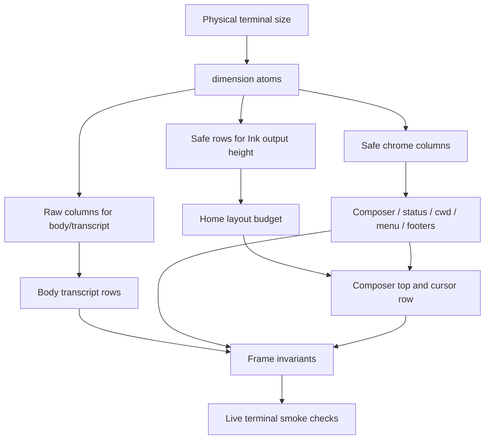

# fix: Stabilize TUI Ink Edge Rendering

## Summary

Implement the brainstorm's Gemini-style stability posture by making KQode render inside a safe Ink height and a safe bottom-chrome content width. The plan keeps the current Ink TUI and framed composer, reserves a physical guard row, and routes composer/status/cwd/menu/footer rows through one shared safe-edge policy while leaving transcript/body rows on their current width unless the artifact reproduces there.

---

## Problem Frame

KQode currently prioritizes an exact edge-to-edge terminal canvas. That decision combines `FULLSCREEN_GUARD_ROWS = 0`, a cursor origin offset for Ink fullscreen frames, composer rows padded to full width, and status rows that intentionally reach the final column.

The reported bug is a stale empty block at the composer's right edge after the first typed character. Opening Help and returning Home appears to repaint enough terminal state to clear it, which means startup/Home rendering is not stable on its own. The origin requirements document supersedes the prior edge-to-edge preference and chooses stability first.

---

## Requirements

**Startup and surface stability**
- R1. The first typed character after TUI startup does not leave a stale, empty, clipped, or differently colored cell at the composer's right edge.
- R2. Composer rendering after startup matches composer rendering after opening Help and returning Home; surface switching must not be required to clean up the first Home frame.
- R3. Help, Login, Model, and Home surface transitions do not leave stale terminal cells in the bottom chrome when returning to the composer.

**Safe terminal edges**
- R4. The TUI has a single safe-edge policy for terminal rows and columns whose final cells are risky across terminals.
- R5. Full-width visual frames may still span the terminal when safe, but editable text rows must not depend on painting or padding through the final terminal column to look correct.
- R6. The status bar and right-aligned model/config label follow the same safe-edge policy as the composer.
- R7. If guard space is introduced, the cwd row, composer, and command/status row remain bottom-sticky with no gap between composer and status.

**Composer look and cursor behavior**
- R8. The composer keeps its current framed, half-line background look unless a narrower frame is required to eliminate terminal-edge artifacts.
- R9. The composer still starts as one row and grows only when wrapping or validation feedback requires more rows.
- R10. The terminal cursor remains on the active composer text row across startup, typing, resize, surface switching, and copy-mode transitions.
- R11. Cursor visibility remains gated by input lock and copy mode; loading, scrolling, and selection behavior do not regress.

**Verification coverage**
- R12. The cleanup includes a reproducible check for the first typed character after startup.
- R13. The cleanup includes checks for Help round-trip rendering, terminal resize, and final-column/status-label behavior.
- R14. The fix is validated against the target terminal behavior called out in existing TUI guidance, especially terminals that differ on fullscreen repaint and final-column glyph handling.

---

## Scope Boundaries

- No custom renderer, terminal diff engine, or Kimi-style synchronized-output rewrite.
- No redesign of composer editing, scrolling, paste, copy mode, provider login, or model selection.
- No Unicode display-width rewrite; current `.length`/`slice` limitations for wide glyphs are documented as a follow-up risk.
- Body transcript rows stay out of active scope unless the artifact is reproduced there; they should not be shrunk implicitly by the safe bottom-chrome content width.

### Deferred to Follow-Up Work

- Replace remaining `.length`/`slice` row-width calculations with display-width-aware helpers for wide glyph correctness across cwd, model labels, prompts, and git labels.
- Re-evaluate body transcript edge policy if live testing shows stale cells outside bottom chrome.

---

## Key Technical Decisions

- **Safe height plus safe bottom-chrome width:** reserve one physical guard row globally, but keep raw terminal columns separate from the safe bottom-chrome content width so body transcript wrapping is not pulled into scope by accident.
- **Guard strip ownership:** the reserved physical row is outside the Ink app's rendered height; the reserved content column is a row-specific chrome gutter that may show the body/default background, but prompt/status/footer content must not depend on drawing glyphs or row-specific backgrounds there.
- **Safe width as a shared primitive:** centralize physical-to-safe row/column math in a pure TUI helper and expose derived atoms for consumers that opt into the safe content width.
- **Cursor offset coupled to guard row:** when the row guard restores Ink's non-fullscreen path, the cursor origin offset returns to the non-fullscreen value; tests and comments change in the same unit.
- **Bottom chrome first, transcript deferred:** apply the policy to composer, status, cwd, slash menu, and fullscreen footer rows because they are the artifact and bottom-chrome surfaces named in the origin; defer transcript rows unless reproduced.
- **Safe-canvas input semantics:** scrolling and click behavior remain unchanged inside the safe canvas; newly reserved guard-space clicks must not move the composer cursor into guard space, and any wheel routing changes outside the safe canvas must be justified as guard-space handling rather than a scrolling redesign.
- **Automated plus live verification:** `ink-testing-library` proves frame strings, row counts, and cursor calls, but cannot prove a terminal did not leave a stale physical cell.

---

## High-Level Technical Design

The physical terminal still supplies raw rows and columns. Production row atoms derive a safe height by excluding the guard row. Column atoms keep raw width available for body/transcript consumers, while bottom chrome and fullscreen footer rows opt into a safe content width derived from the same raw columns.

---

## Implementation Units

### U1. Safe canvas constants and dimension atoms

- **Goal:** Define the row/column guard contract, derive safe rows for Ink output, and expose safe bottom-chrome columns without changing transcript width by accident.
- **Requirements:** R4, R7, R10, R12, R14
- **Dependencies:** None
- **Files:**
  - Create: `tui/src/libs/tui/safeCanvas.ts`
  - Modify: `tui/src/constants/ui.ts`
  - Modify: `tui/src/state/ui/dimensions.ts`
  - Test: `tui/src/libs/tui/__tests__/safeCanvas.test.ts`
  - Test: `tui/src/state/ui/__tests__/dimensions.test.ts`
  - Test: `tui/src/__tests__/App.test.tsx`
- **Approach:** Add named guard constants and a pure helper that derives safe rows plus safe chrome columns from raw terminal dimensions. Change `FULLSCREEN_GUARD_ROWS` to reserve the bottom row, update `INK_CURSOR_ROW_ORIGIN_OFFSET` in lockstep, and update minimum usable dimensions so too-small behavior reflects physical guard space. Keep test override semantics explicit: component tests may pin safe canvas dimensions with override atoms, while App-level production-size tests use `windowRowsAtom` and `windowColumnsAtom` to exercise physical guard subtraction.
- **Patterns to follow:** `tui/src/state/ui/dimensions.ts` already separates live window atoms from test override atoms; keep test-only seams marked with `TestOverride`. Put reusable math in `tui/src/libs/` rather than `@state`.
- **Test scenarios:**
  - Given production `windowRowsAtom` and `windowColumnsAtom`, safe rows subtract the guard row and safe chrome columns subtract the guard column.
  - Given test override atoms, component tests can still pin deterministic safe canvas dimensions without depending on a real terminal.
  - Given App-level tests use raw window atoms, a terminal at the old physical minimum now shows the too-small state instead of overflowing the safe canvas.
  - Given the guard row changes, `resolveComposerCursorPosition` expectations update so the cursor remains on the composer text row.
- **Verification:** Dimension tests prove row/column guards, minimum-size behavior, test override semantics, and cursor-origin coupling are internally consistent.

### U2. Composer frame and cursor safe-width wiring

- **Goal:** Make the composer render, wrap, scroll, click, and position the cursor using one safe input width.
- **Requirements:** R1, R2, R5, R8, R9, R10, R11, R12
- **Dependencies:** U1
- **Files:**
  - Modify: `tui/src/components/PromptComposer/ComposerFrame.tsx`
  - Modify: `tui/src/components/PromptComposer/index.tsx`
  - Modify: `tui/src/components/PromptComposer/cursorPosition.ts`
  - Modify: `tui/src/components/HomeScreen/HomeScreenView.tsx`
  - Test: `tui/src/__tests__/components/PromptComposer.test.tsx`
  - Test: `tui/src/components/PromptComposer/__tests__/caretDuringLoad.test.tsx`
  - Test: `tui/src/libs/composer/__tests__/composerWindow.test.ts`
- **Approach:** Pass safe composer columns to frame rendering, input wrapping, click mapping, composer scrolling, and cursor placement. Ensure half-line caps, editable text padding, and validation rows do not paint through the physical final column. Keep the existing framed half-line look inside the safe width.
- **Patterns to follow:** `PromptComposer` already computes `inputColumns` once and feeds `resolveComposerWindow`; extend that single-source pattern rather than adding separate width calculations per row.
- **Test scenarios:**
  - Covers AE1. Given a fresh composer and a first typed character, rendered composer rows stay within the safe width and contain no extra right-edge cell in the frame string.
  - Given a prompt exactly at the safe-width boundary, soft wrapping happens at the same width used by rendering and cursor placement.
  - Given a validation error at the boundary, the validation row stays within the safe width.
  - Given copy mode or input lock is active, the composer still suppresses or releases the cursor without changing row count.
  - Given a mouse click at or beyond the guard column, the click does not move the composer cursor into guard space.
- **Verification:** Composer tests prove safe-width consistency across render, wrap, click, scroll, and cursor math.

### U3. Bottom chrome and fullscreen footer safe-edge policy

- **Goal:** Apply the shared safe-edge policy to status, cwd, slash menu, Help footer, Model footer/list rows, and Login bottom rows without double-reserving columns.
- **Requirements:** R3, R4, R6, R7, R10, R13, R14
- **Dependencies:** U1
- **Files:**
  - Modify: `tui/src/components/StatusBar.tsx`
  - Modify: `tui/src/components/CwdLine.tsx`
  - Modify: `tui/src/libs/tui/cwdLine.ts`
  - Modify: `tui/src/components/SlashCommandMenu/index.tsx`
  - Modify: `tui/src/components/HelpScreen/index.tsx`
  - Modify: `tui/src/components/ModelSurface/index.tsx`
  - Modify: `tui/src/components/ModelSurface/ModelRow.tsx`
  - Review/modify if needed: `tui/src/components/LoginSurface/index.tsx`
  - Test: `tui/src/__tests__/components/StatusBar.test.tsx`
  - Test: `tui/src/components/SlashCommandMenu/__tests__/SlashCommandMenu.test.tsx`
  - Test: `tui/src/__tests__/App.test.tsx`
- **Approach:** Treat the safe chrome width as the normal render width for chrome and footer rows. Remove old one-off final-column truncation where it would double-shrink under the new policy. Make cwd row counting and rendering use the same safe width so layout and output stay aligned.
- **Patterns to follow:** The slash command menu already has final-column-aware tests; adapt those to assert the shared policy instead of a component-local `columns - 1` rule.
- **Test scenarios:**
  - Covers AE3. Given a long model label, the status bar truncates within the safe width and does not reach the physical guard column.
  - Given a long cwd and git label, `countCwdRows` and `CwdLine` agree on wrapping under the safe width.
  - Given slash command rows with long descriptions, rows do not double-shrink after consuming safe columns.
  - Given Help or Model footer position text appears, it right-aligns inside the safe content width.
  - Given Model list rows use existing truncation, they consume the already-safe width without subtracting an extra local gutter.
- **Verification:** Bottom-chrome tests prove every included row follows one safe-edge rule and no component keeps its own conflicting edge reservation.

### U4. Surface-return, resize, and guard-space interaction tests

- **Goal:** Add integration-style coverage for the flows that exposed the bug: fresh startup typing, surface round trips, resize while away, and guard-space input.
- **Requirements:** R1, R2, R3, R10, R11, R12, R13, R14
- **Dependencies:** U1, U2, U3
- **Files:**
  - Modify: `tui/src/components/HomeScreen/HomeScreenView.tsx`
  - Modify: `tui/src/components/HomeScreen/wheelRouting.ts`
  - Modify: `tui/src/__tests__/App.test.tsx`
  - Modify: `tui/src/__tests__/components/HomeScreenMouseTracking.test.tsx`
  - Modify: `tui/src/state/ui/__tests__/layout.test.ts`
  - Modify: `tui/src/components/HomeScreen/__tests__/wheelRouting.test.ts`
- **Approach:** Use `renderWithJotai`, `flushInput`, and production `windowRowsAtom`/`windowColumnsAtom` resize paths for at least one test so guard subtraction is exercised. Keep scroll behavior unchanged inside the safe canvas; guard-space mouse input must not place the composer cursor outside the safe width, and any wheel events outside safe rows/columns should be handled as guard-space no-ops rather than body/composer scrolling.
- **Test scenarios:**
  - Covers AE1. Fresh startup at common, minimum, and wide sizes accepts the first printable character with bottom chrome within the safe canvas.
  - Covers AE2. Empty composer and long/validated/scrolled composer states survive Help round trips and the first Home frame after return is correct.
  - Given Login and Model surfaces close back to Home, the first Home frame uses the safe canvas before the user types.
  - Given terminal resize happens while Help or Model is open, returning Home recomputes composer top, rows, and cursor placement before the user types.
  - Covers AE5. Given the user types, resizes, opens Help, returns Home, and types again, the cursor lands on the active composer text row whenever input is unlocked.
  - Given Copy Mode is entered and exited with a printable key, the guard policy does not insert that key or move the cursor.
  - Given mouse input lands in guard space, it does not move the composer cursor into guard space or unexpectedly scroll a pane.
- **Verification:** App-level tests cover the lifecycle flows that component snapshots cannot cover alone.

### U5. Documentation, comments, and live-terminal verification checklist

- **Goal:** Update repository guidance and prior learning so the new stability-first decision replaces the old edge-to-edge preference.
- **Requirements:** R12, R14
- **Dependencies:** U1, U2, U3, U4
- **Files:**
  - Modify: `tui/AGENTS.md`
  - Modify: `tui/src/cli/kqodeCli.tsx`
  - Modify: `tui/src/state/ui/dimensions.ts`
  - Modify: `tui/src/constants/ui.ts`
  - Modify: `docs/solutions/architecture-patterns/terminal-edge-rendering-tradeoffs-in-the-ink-tui.md`
  - Test expectation: none -- documentation/comment updates only, covered by U1-U4 tests and review.
- **Approach:** Replace comments that describe edge-to-edge as the current desired trade-off with the new stability-first safe-canvas policy. Preserve the historical explanation so future agents understand why the decision changed. Add a concise live-terminal checklist for WezTerm, Windows Terminal, the reporter's terminal, minimum size, wide size, startup typing, Help round trip, Login/Model return, resize, long prompt wrapping, long status label, and Copy Mode return.
- **Patterns to follow:** `docs/solutions/architecture-patterns/terminal-edge-rendering-tradeoffs-in-the-ink-tui.md` already captures symptoms, mechanism, guidance, examples, and related artifacts.
- **Verification:** Documentation points implementers and reviewers at the new guard-row/guard-column policy and no longer contradicts the code comments.

---

## System-Wide Impact

- The visible Home layout becomes one row shorter in production, while body/transcript columns remain on raw terminal width unless later evidence pulls them into scope.
- Bottom chrome and fullscreen footer content become one column narrower through the safe chrome width, with the reserved content column outside row-specific chrome ownership.
- The minimum physical terminal size increases by the row guard and any minimum-width rule tied to the safe chrome column.
- Terminal behavior shifts from the prior Windows Terminal edge-to-edge preference to a stability-first policy that also targets artifact-prone terminals.

---

## Risks & Dependencies

- **Live-terminal uncertainty:** automated tests cannot prove stale physical cells are gone. Mitigation: keep the live smoke checklist as a completion gate.
- **Cursor drift:** changing the fullscreen guard without the cursor-origin offset will move the hardware cursor. Mitigation: couple the constants and update cursor tests in U1.
- **Double-shrink regressions:** slash menu and Model rows already reserve a column locally. Mitigation: U3 audits old local reservations against the shared policy.
- **Width-model drift:** raw transcript columns and safe chrome columns can diverge if consumers pick the wrong atom. Mitigation: U1 names raw vs. safe consumers and U3/U4 add representative tests.
- **Wide glyph overflow:** current string-length helpers can still mismeasure double-width glyphs. Mitigation: keep out of active scope and document as follow-up.

---

## Acceptance Examples

- AE1. Given a fresh TUI startup with an empty composer, when the user types `1`, then the composer contains `1` and no extra empty block appears at the right edge.
- AE2. Given the artifact-prone startup path, when the user opens Help and returns Home, then the composer rendering is unchanged from the clean startup rendering rather than becoming clean only after Help.
- AE3. Given a long model/config label in the status bar, when it reaches the right side of the terminal, then it follows the same guard or clipping rule as composer rows.
- AE4. Given a short prompt, when guard space is active, then cwd, composer, and status remain bottom-sticky and the composer remains one row.
- AE5. Given the user types, resizes the terminal, opens Help, returns Home, and types again, then the cursor lands on the active composer text row whenever input is unlocked.

---

## Sources & Research

- Origin requirements: `docs/brainstorms/2026-07-07-tui-ink-safe-rendering-requirements.md`.
- Reference research: `docs/research/2026-07-07-ink-composer-rendering.md`.
- Prior learning: `docs/solutions/architecture-patterns/terminal-edge-rendering-tradeoffs-in-the-ink-tui.md`.
- Layering guidance: `docs/solutions/architecture-patterns/state-libs-layering-and-cycle-verification-in-the-ink-tui.md`.
- TUI guidance: `tui/AGENTS.md`.
- Relevant implementation seams: `tui/src/state/ui/dimensions.ts`, `tui/src/constants/ui.ts`, `tui/src/libs/tui/layout.ts`, `tui/src/state/ui/atoms.ts`, `tui/src/components/PromptComposer/ComposerFrame.tsx`, `tui/src/components/PromptComposer/index.tsx`, `tui/src/components/PromptComposer/cursorPosition.ts`, `tui/src/components/StatusBar.tsx`, `tui/src/components/CwdLine.tsx`, `tui/src/libs/tui/cwdLine.ts`, `tui/src/components/HomeScreen/HomeScreenView.tsx`, `tui/src/App.tsx`, `tui/src/components/HelpScreen/index.tsx`, `tui/src/components/ModelSurface/index.tsx`, and `tui/src/components/LoginSurface/index.tsx`.
