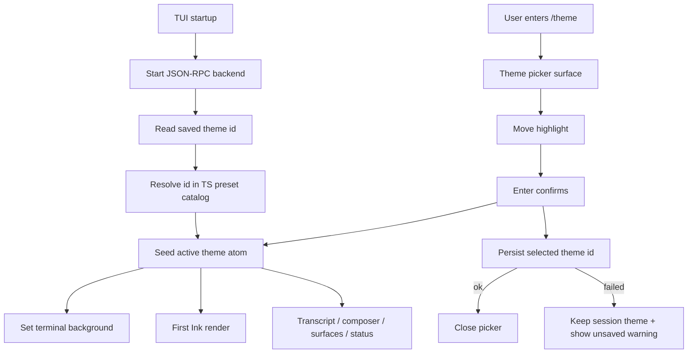

# feat: Add Theme Command

## Summary

Implement the `/theme` feature as a TUI-owned built-in dark theme catalog with reactive semantic tokens, a fullscreen picker, and Rust-backed user-global theme-id persistence. The plan covers the full brainstorm scope: immediate in-session apply, saved startup theme before the first frame, terminal background updates, and explicit exclusion of light/custom/plugin theme support.

---

## Problem Frame

KQode's TUI currently imports a static Dracula-style theme object from `tui/src/theme/themeConfig.ts`. That was sufficient for the first visual slice, but it prevents users from choosing another familiar dark terminal theme and prevents the TUI from applying a theme change without restart.

The earlier Gemini-style theming work intentionally kept theming internal and excluded `/theme`, persistence, and custom theme infrastructure. This plan reopens only the user-facing preset picker and persisted preference path while preserving the existing Rust/TypeScript boundary and TUI rendering constraints.

---

## Requirements

**Theme catalog and readability**
- R1. Ship a built-in dark-only preset catalog that includes the current Dracula-style default plus One Dark, Nord, Gruvbox Dark, Tokyo Night, and Catppuccin Mocha.
- R2. Every preset defines the full semantic color token set used by the current TUI, including a terminal background token.
- R3. Presets pass automated token-completeness and contrast/readability checks before they can appear in the picker.
- R4. Palette source URLs and license notices are traceable in the repository.

**Selection and persistence**
- R5. `/theme` opens a picker without requiring provider credentials or chat readiness beyond the normal backend seam.
- R6. The picker shows the active theme, lets users move highlight without applying, and applies the highlighted theme only on confirmation.
- R7. A confirmed selection updates the current TUI theme and terminal background immediately.
- R8. A successful selection persists only the selected theme id as a user-global SQLite preference.
- R9. A saved theme loads before the first Ink frame and before terminal background setup.
- R10. Unknown, removed, or unreadable saved theme ids fall back to the default theme without crashing.
- R11. A theme-save failure leaves the selected theme active for the current session and shows an unsaved warning.

**TUI and scope preservation**
- R12. Theme changes update transcript text, composer text, command surfaces, status rows, errors, borders, and backgrounds through centralized semantic tokens.
- R13. Theme changes preserve bottom-sticky layout, composer growth behavior, scroll behavior, and manual cursor placement.
- R14. Color is never the only signal for errors, selected rows, loading states, or other semantic states.
- R15. V1 does not add light themes, custom theme files, project theme directories, plugin-contributed themes, theme editing, import, or export.

**Origin actors:** A1 (User), A2 (TUI), A3 (Settings store), A4 (Terminal environment)
**Origin flows:** F1 (choose a theme), F2 (start with a saved theme), F3 (continue when persistence is unavailable)
**Origin acceptance examples:** AE1 (select and persist Nord), AE2 (startup uses saved Gruvbox Dark), AE3 (all presets remain readable), AE4 (save failure stays usable), AE5 (no layout regression or out-of-scope theme infrastructure)

---

## Scope Boundaries

- Light themes remain deferred until KQode has a stronger light-background contrast and terminal-background story.
- Custom theme files, user/project theme directories, plugin-contributed themes, theme editing, and theme import/export are not part of this plan.
- Theme selection does not affect model/provider settings, transcript data, agent behavior, or workspace state.
- Live cross-process theme synchronization is out of scope; concurrent sessions are last-writer-wins for future starts.
- This plan does not reverse the backend's broader store-startup policy. Theme read/write failures after startup are handled as theme-specific nonfatal failures.

### Deferred to Follow-Up Work

- Add light theme support with explicit light-background terminal handling.
- Add user/project theme directories and plugin theme contributions when the broader R65 plugin/theme infrastructure is ready.
- Revisit live preview on highlight movement if users want exploratory theme browsing after v1.

---

## Context & Research

### Relevant Code and Patterns

- `tui/src/libs/commands/registry.ts` is the command identity source used by the command menu, filtering, help output, and execution.
- `tui/src/libs/commands/executeCommand.ts` dispatches client-side slash commands through injected actions; `/theme` should follow `/login` and `/model`.
- `tui/src/state/ui/surface/atoms.ts` owns mutually exclusive fullscreen surfaces, and `tui/src/App.tsx` renders Home, Help, Login, and Model from that atom.
- `tui/src/components/ModelSurface/` is the closest picker pattern: fullscreen header/body/footer, safe chrome width, keyboard navigation, selected row, backend persistence, and close on success.
- `tui/src/theme/themeConfig.ts` is a static theme object. Many components and pure row builders import it directly, so runtime switching requires a reactive active-theme seam.
- `tui/src/libs/tui/bodyRows.ts` caches rendered body rows and currently assumes static theme tokens; active theme identity must be part of any retained cache key.
- `tui/src/bootstrap.ts` sets the terminal background before starting the backend runtime; saved theme startup needs a pre-render preference load before this visual setup.
- `tui/src/libs/terminal/terminalBackground.ts` provides the existing TTY-gated OSC 11/111 helpers; theme changes should reuse them.
- `src/protocol/mod.rs`, `src/protocol/providers.rs`, `tui/src/contracts/backend/providerMessages.ts`, and `tui/src/backend/protocol/providerProtocol.ts` show the lockstep Rust/TypeScript JSON-RPC contract pattern.
- `src/store/providers.rs`, `src/store/tests.rs`, `src/store/migrations.rs`, and `migrations/V1__initial_schema.sql` show the SQLite access, singleton-setting, and forward-only `refinery` migration patterns.

### Institutional Learnings

- `docs/solutions/architecture-patterns/state-libs-layering-and-cycle-verification-in-the-ink-tui.md` requires pure registries/helpers to live outside `state/`; theme catalog and contrast helpers should stay in `tui/src/theme/` or `tui/src/libs/`, while Jotai files contain atoms only.
- `docs/solutions/architecture-patterns/terminal-edge-rendering-tradeoffs-in-the-ink-tui.md` and `tui/AGENTS.md` require preserving safe chrome widths, bottom-sticky layout, terminal background setup/reset, and manual cursor placement.
- `docs/plans/2026-06-29-001-feat-gemini-style-tui-theming-plan.md` established semantic theme tokens and non-color markers as the visual contract; `/theme` should vary token values rather than add ad hoc component colors.
- `docs/plans/2026-07-03-001-feat-tui-slash-command-system-plan.md` established client-side slash commands; valid commands run local effects and are not submitted as chat turns.

### External Preset License Check

The named presets have permissive upstream sources, but they require source traceability and license notices:

| Preset | Preferred source | License note |
|---|---|---|
| Dracula | `github.com/dracula/dracula-theme` | MIT; current palette comment already cites Dracula. |
| One Dark | `github.com/atom/one-dark-syntax` | MIT; prefer Atom One Dark over One Dark Pro unless product naming changes. |
| Nord | `github.com/nordtheme/nord` | MIT. |
| Gruvbox Dark | `github.com/morhetz/gruvbox` | README states MIT/X11; include attribution to Pavel Pertsev / morhetz. |
| Tokyo Night | `github.com/tokyo-night/tokyo-night-vscode-theme` | MIT; avoid copying from Apache-2.0 ports unless their notices are included. |
| Catppuccin Mocha | `github.com/catppuccin/catppuccin` | MIT. |

---

## Key Technical Decisions

- **TUI owns theme semantics and catalog.** Rust persists an opaque theme id; TypeScript owns built-in presets, display names, token values, license metadata, and unknown-id fallback.
- **Persist only the theme id.** The database stores the selected id, not copied palette values, so palette improvements ship with the binary and stale ids can fall back safely.
- **Use explicit theme preference JSON-RPC methods.** Mirrored Rust and TypeScript get/set requests follow the provider/model protocol pattern, keeping TUI code out of SQLite internals.
- **Use a dedicated UI preferences singleton.** Store the theme id in a `ui_preferences`-style singleton row rather than an untyped key/value bag, so duplicate rows and ambiguous reads are impossible.
- **Validate shape, not catalog membership, in Rust.** Rust rejects empty, oversized, or control-character theme ids, but returns unknown well-formed ids unchanged so TypeScript can resolve catalog fallback.
- **Seed the active theme before visual setup.** `createAppRuntime` should resolve the saved id, set the active theme atom, and set the terminal background from that theme before the first render.
- **Attach backend ready listeners before pre-render theme reads.** Startup theme loading must not consume backend readiness before session logging and transcript reset hooks are registered.
- **Bound pre-render theme waiting.** The initial preference read gets a short theme-specific deadline; on timeout or failure, the TUI renders with the default theme and lets normal backend startup continue.
- **Apply on Enter, not on highlight movement.** Arrow navigation changes only picker focus; Enter applies and persists, avoiding rollback complexity for theme tokens and terminal background.
- **Save failure keeps the session theme.** After Enter, the theme stays active in memory even if persistence fails; the user gets an inline unsaved warning and future starts use the last saved theme.
- **Centralize active-theme side effects.** One state/runtime action applies a theme by updating active theme state and terminal background together; picker components do not call terminal helpers directly.
- **Reactive tokens replace static imports.** Components read the active theme from Jotai or receive it as an argument; pure helpers stay pure by accepting a theme parameter rather than importing state.
- **Contrast checks are a catalog gate.** Normal, selected, warning, and error text should meet a WCAG-inspired contrast threshold against the preset background; muted text must remain readable and never be the sole signal.
- **No environment-variable test injection.** Tests use store/bootstrap seams and Jotai test override atoms, matching the repository's no-new-env-var convention.

---

## High-Level Technical Design

The startup path must seed theme state before entering the visible Ink frame. The selection path updates the same active-theme atom used by render consumers, then calls the backend to persist the selected id. Terminal background follows the in-memory active theme, not the persisted state, so failed saves still look consistent for the current session.

---

## Implementation Units

### U1. Built-in theme catalog and readability gates

- **Goal:** Replace the single static palette with a built-in dark preset catalog and a complete semantic theme type.
- **Requirements:** R1, R2, R3, R4, R14, R15; origin AE3 and AE5
- **Dependencies:** None
- **Files:**
  - Modify: `tui/src/theme/themeConfig.ts`
  - Create: `tui/src/theme/themeCatalog.ts`
  - Create: `tui/src/theme/themeTypes.ts`
  - Create: `tui/src/theme/themeContrast.ts`
  - Create: `tui/src/theme/__tests__/themeCatalog.test.ts`
  - Create: `THIRD_PARTY_NOTICES.md`
- **Approach:** Define stable theme ids, display names, complete semantic color tokens, and source/license metadata for each built-in preset. Keep the current Dracula-style palette as the default preset. Add pure helpers for id lookup, default fallback, token completeness, and contrast/readability checks.
- **Execution note:** Start with catalog tests so every later UI unit depends on a verified complete token set.
- **Patterns to follow:** Keep pure data and helpers in `tui/src/theme/`; do not import Jotai state from catalog files. Use named constants instead of duplicated status strings or magic ids.
- **Test scenarios:**
  - Covers AE3. Each shipped preset has every semantic token required by current TUI consumers, including terminal background.
  - Covers AE3. Each preset passes contrast checks for foreground, selected/accent, warning, and error colors against its background.
  - Covers AE5. The catalog contains only dark built-in presets and exposes no custom file, directory, plugin, editing, import, or export hooks.
  - Unknown ids resolve to the default preset without throwing.
  - Third-party notices list every non-original palette source selected for the catalog.
- **Verification:** Catalog tests fail if a preset is incomplete, unreadable, unlicensed, or outside dark-only v1 scope.

### U2. Store migration and theme preference accessors

- **Goal:** Persist the selected theme id in the user-global SQLite store without storing palette data.
- **Requirements:** R8, R10, R11; origin F2 and F3
- **Dependencies:** U1 for stable theme id vocabulary
- **Files:**
  - Create: `migrations/V2__theme_preferences.sql`
  - Create: `src/store/theme.rs`
  - Modify: `src/store/mod.rs`
  - Modify: `src/store/migrations.rs`
  - Modify: `src/store/tests.rs`
- **Approach:** Add a forward-only migration for a dedicated UI preferences singleton with `id = 1`, a nullable theme id, and an update timestamp. Add store methods to read, set, and clear the theme id. Treat no row or a null theme id as default and preserve unknown well-formed strings for the TUI to resolve, so Rust does not duplicate the catalog. Add the new table to dirty-schema detection so partial/pre-refinery databases are classified safely.
- **Execution note:** Add migration/accessor tests before wiring protocol handlers.
- **Patterns to follow:** Follow `src/store/providers.rs` singleton/upsert style and `migrations/V1__initial_schema.sql` forward-only schema conventions. Do not edit V1 or rely on SQLite `user_version`.
- **Test scenarios:**
  - New databases include the theme preference schema after migrations.
  - Existing V1 databases with provider settings and active model selection migrate forward with those rows preserved.
  - Setting a theme id is last-writer-wins, creates no duplicate preference rows, and survives reopening the database.
  - An absent theme preference reads as unset, not as an error.
  - Unknown-but-well-formed theme ids round-trip from the store; empty, whitespace, oversized, or control-character ids are not persisted.
  - A dirty database containing the new preference table but no migration history is classified safely.
  - V1 and V2 checksum tests remain pinned, proving shipped migrations were not edited.
  - Concurrent writes through two store handles leave one final stored theme id and no duplicate rows.
- **Verification:** Store tests prove additive migration behavior and theme-id round-trip persistence.

### U3. Mirrored theme preference protocol

- **Goal:** Expose theme preference get/set through the existing Rust backend and TypeScript backend client seam.
- **Requirements:** R5, R8, R9, R10, R11; origin F2 and F3
- **Dependencies:** U2
- **Files:**
  - Create: `src/protocol/themes.rs`
  - Modify: `src/protocol/mod.rs`
  - Create: `src/backend/themes.rs`
  - Modify: `src/backend/mod.rs`
  - Modify: `src/protocol/tests.rs`
  - Modify: `src/backend/tests.rs`
  - Create: `tui/src/contracts/backend/themeMessages.ts`
  - Modify: `tui/src/contracts/backend/client.ts`
  - Modify: `tui/src/contracts/backend/index.ts`
  - Create: `tui/src/backend/protocol/themeProtocol.ts`
  - Modify: `tui/src/backend/client/backendClient.ts`
  - Modify: `tui/src/backend/client/messageConnectionClient.ts`
  - Create: `tui/src/backend/protocol/__tests__/themeProtocol.test.ts`
  - Modify: `tui/src/backend/client/__tests__/backendClient.test.ts`
- **Approach:** Add request/result types for reading the saved theme id and storing a selected theme id. The get path returns unset when no preference exists. The set path rejects malformed ids before persistence and returns an explicit failure result when the store write fails, instead of throwing into the picker as an opaque transport error.
- **Patterns to follow:** Mirror provider/model request constants and camelCase, `deny_unknown_fields` structs in `src/protocol/providers.rs` and `tui/src/contracts/backend/providerMessages.ts`. Keep execution success separate from "preference saved" outcome.
- **Test scenarios:**
  - Rust and TypeScript protocol tests serialize theme get/set params and results with camelCase keys.
  - Unknown JSON-RPC method handling remains unchanged.
  - A valid theme id request reaches the store accessor and returns ok.
  - Malformed theme ids are rejected and do not alter the previously persisted value.
  - A store write failure returns a save-failed result that the TUI can render.
  - The TypeScript backend client exposes get/set theme methods through the same timeout/error mapping as provider requests.
- **Verification:** Protocol tests prove Rust/TS lockstep, and backend tests prove store outcomes map to user-facing preference results.

### U4. Startup theme bootstrap and terminal background ownership

- **Goal:** Load the saved theme before the first Ink frame and keep terminal background synchronized with the active in-memory theme.
- **Requirements:** R7, R9, R10, R11, R12; origin AE2 and AE4
- **Dependencies:** U1, U3
- **Files:**
  - Modify: `tui/src/bootstrap.ts`
  - Create: `tui/src/theme/resolveInitialTheme.ts`
  - Create: `tui/src/state/global/theme.ts`
  - Modify: `tui/src/state/global/index.ts`
  - Modify: `tui/src/backend/runtime/backendRuntime.ts`
  - Create: `tui/src/theme/__tests__/resolveInitialTheme.test.ts`
  - Create: `tui/src/state/global/__tests__/theme.test.ts`
  - Modify: `tui/src/backend/runtime/__tests__/backendRuntime.test.ts`
- **Approach:** Add an `activeThemeAtom` and a single apply-theme action that updates active state and terminal background together. Register backend runtime readiness listeners before any pre-render theme request can start the backend, then read the saved theme id before `enterAlternateScreen`, `setTerminalWindowTitle`, `setTerminalBackground`, and the first render. Use a short preference-read deadline; on timeout, read failure, unset preference, or unknown id, seed the default preset and let normal backend startup continue. Keep existing terminal reset behavior on dispose.
- **Patterns to follow:** `createAppRuntime` already owns startup side effects and seeds global atoms before render; keep theme bootstrap there rather than in a component effect. Reuse `setTerminalBackground` and `resetTerminalBackground`.
- **Test scenarios:**
  - Covers AE2. Given a saved known theme id, runtime creation seeds `activeThemeAtom` and sets terminal background from that theme before render.
  - Given no saved theme, startup uses the default preset.
  - Given an unknown saved theme id, startup uses the default preset without rewriting the stored value.
  - Given theme preference read failure, startup falls back to default and the backend runtime still proceeds through its normal startup path.
  - Given the theme read starts the backend, backend-ready side effects such as session logging and transcript reset still fire.
  - Given theme preference read exceeds the short startup deadline, first render uses the default theme and backend startup continues.
  - Dispose still resets terminal background exactly once on the clean path.
- **Verification:** Runtime tests prove saved-theme startup order and fallback behavior without requiring a real terminal.

### U5. Reactive theme adoption across TUI render consumers

- **Goal:** Refactor static theme imports so active theme changes update all visible TUI surfaces and pure row builders.
- **Requirements:** R7, R12, R13, R14; origin AE3 and AE5
- **Dependencies:** U1, U4
- **Files:**
  - Modify: `tui/src/components/HomeScreen/HomeScreenView.tsx`
  - Modify: `tui/src/components/Header.tsx`
  - Modify: `tui/src/components/BodyPane.tsx`
  - Modify: `tui/src/components/CwdLine.tsx`
  - Modify: `tui/src/components/StatusBar.tsx`
  - Modify: `tui/src/components/PromptComposer/ComposerFrame.tsx`
  - Modify: `tui/src/components/TerminalTooSmall.tsx`
  - Modify: `tui/src/components/HelpScreen/index.tsx`
  - Modify: `tui/src/components/LoginSurface/index.tsx`
  - Modify: `tui/src/components/LoginSurface/*.tsx`
  - Modify: `tui/src/components/ModelSurface/*.tsx`
  - Modify: `tui/src/components/SlashCommandMenu/index.tsx`
  - Modify: `tui/src/libs/tui/bodyRows.ts`
  - Modify: `tui/src/components/AppExitSummary/formatExitSummaryCard.ts`
  - Modify: `tui/src/__tests__/components/HomeScreen.test.tsx`
  - Modify: `tui/src/libs/tui/__tests__/bodyRows.test.ts`
  - Modify: `tui/src/components/PromptComposer/__tests__/caretDuringLoad.test.tsx`
- **Approach:** Components read `activeThemeAtom` near their rendering leaves or receive a theme from parent render code. Pure helpers accept a theme argument and include theme identity in any memo/cache key. Preserve non-color markers, selected-row glyphs, error labels, and loading text. Keep picker-local atoms separate from global active-theme state so the current theme has one source of truth.
- **Patterns to follow:** Follow `tui/AGENTS.md`: use Jotai for shared TUI state, avoid prop drilling through unrelated intermediate components, and explicitly verify cursor placement when changing composer/layout-adjacent rendering.
- **Test scenarios:**
  - Covers AE3. Switching `activeThemeAtom` changes foreground/background colors used by Home, Help, Login, Model, StatusBar, BodyPane, and PromptComposer.
  - Covers AE3. Error, warning, selected, loading, and active markers remain visible through non-color text or glyphs.
  - Covers AE5. Composer row count, bottom-sticky cwd/composer/status placement, and cursor placement are unchanged after theme refactor.
  - `bodyRows` recomputes when the active theme changes and does not return stale cached colors.
  - Exit summary colors either use active theme intentionally or keep the existing restored-terminal-safe behavior with documented rationale.
- **Verification:** Component and pure-helper tests prove theme changes are reactive and do not regress layout/cursor invariants.

### U6. Theme picker surface and slash-command wiring

- **Goal:** Add `/theme` as a client-side command and implement the fullscreen theme picker.
- **Requirements:** R5, R6, R7, R8, R11, R13, R14, R15; origin AE1, AE4, and AE5
- **Dependencies:** U1, U3, U4, U5
- **Files:**
  - Modify: `tui/src/libs/commands/registry.ts`
  - Modify: `tui/src/libs/commands/executeCommand.ts`
  - Modify: `tui/src/components/PromptComposer/index.tsx`
  - Modify: `tui/src/state/ui/surface/atoms.ts`
  - Modify: `tui/src/App.tsx`
  - Create: `tui/src/state/ui/theme/atoms.ts`
  - Create: `tui/src/state/ui/theme/index.ts`
  - Create: `tui/src/components/ThemeSurface/index.tsx`
  - Create: `tui/src/components/ThemeSurface/ThemeRows.tsx`
  - Create: `tui/src/components/ThemeSurface/ThemeRow.tsx`
  - Create: `tui/src/components/ThemeSurface/useThemeBackend.ts`
  - Create: `tui/src/components/ThemeSurface/useThemeInput.ts`
  - Create: `tui/src/components/ThemeSurface/__tests__/ThemeSurface.test.tsx`
  - Create: `tui/src/components/ThemeSurface/__tests__/testUtils.tsx`
  - Modify: `tui/src/libs/commands/__tests__/filterCommands.test.ts`
  - Modify: `tui/src/libs/commands/__tests__/executeCommand.test.ts`
  - Modify: `tui/src/components/SlashCommandMenu/__tests__/SlashCommandMenu.test.tsx`
  - Modify: `tui/src/components/HelpScreen/__tests__/helpContent.test.ts`
  - Modify: `tui/src/state/ui/surface/__tests__/atoms.test.ts`
- **Approach:** Add `Theme` to the command registry and surface enum. The picker mirrors `/model`: header, explanatory line, windowed rows, safe-width footer, arrow navigation, Enter confirm, and Esc close. Highlight movement mutates only picker-local focus state. Enter calls the centralized apply-theme action, tries to save the id, then closes on success or keeps the surface open with an unsaved warning on failure. Only the latest save request may close the picker or update the warning state.
- **Patterns to follow:** Reuse `/model`'s atom-owned highlight/windowing style and request-version guard where async backend results can race with navigation. Keep command execution client-side and avoid submitting `/theme` as a backend prompt.
- **Test scenarios:**
  - Covers AE1. `/theme` appears in command registry, slash menu filtering, and Help command output.
  - `/theme` opens even when no provider is connected.
  - The picker marks the current theme as active and highlights the first sensible focus row.
  - Arrow navigation changes highlight without changing `activeThemeAtom` or terminal background.
  - Covers AE1. Enter on a different theme updates active theme, calls terminal background setup, persists the id, and closes.
  - Covers AE4. Save failure keeps the selected theme active for the session, keeps terminal background on that theme, and shows an unsaved warning.
  - Out-of-order save results cannot close the picker or show a warning for a stale selection.
  - Esc closes without applying or saving the highlighted theme.
  - Covers AE5. The surface exposes no light/custom/plugin/import/export affordance.
- **Verification:** Theme surface tests prove command availability, picker behavior, persistence outcomes, and no provider dependency.

### U7. End-to-end startup, packaging, and scope guards

- **Goal:** Add cross-layer tests and docs checks that prove the feature behaves as a cohesive user preference across process boundaries.
- **Requirements:** R1 through R15; origin AE1 through AE5
- **Dependencies:** U1, U2, U3, U4, U5, U6
- **Files:**
  - Modify: `tui/src/__tests__/App.test.tsx`
  - Modify: `tui/src/backend/client/__tests__/backendClient.test.ts`
  - Modify: `src/backend/tests.rs`
  - Modify: `src/store/tests.rs`
  - Review/modify if needed: `tui/packaged/entry.packaged.tsx`
  - Review/modify if needed: `tui/scripts/buildPackaged.ts`
  - Modify: `README.md`
- **Approach:** Add integration-style tests for saved theme load, unknown id fallback, command non-submission, and scope exclusions. Review packaged entry/build wiring only if startup composition changes require packaged-mode parity. Update user-facing docs enough to mention `/theme` and record the preference/preset pattern if implementation produces a reusable learning.
- **Patterns to follow:** Keep `tui/packaged/entry.packaged.tsx` in sync with composition-root wiring when startup behavior changes. Use `cargo xtask` TUI checks and Rust store/backend targeted tests during implementation, but keep exact command choreography out of the plan body.
- **Test scenarios:**
  - Covers AE2. A fake backend with a saved theme id produces an opening App frame using that theme.
  - Covers AE2. An unknown stored id produces a default-theme opening frame.
  - Covers AE1 and AE4. A full picker selection updates UI state and persistence result paths through the backend client seam.
  - A failed save leaves the previously persisted theme id unchanged while the current session remains on the newly applied theme.
  - Covers AE5. Searches or snapshot tests confirm no light/custom/plugin/import/export UI text appears in `/theme`.
  - Rust backend tests prove theme get/set requests work with a real temp SQLite store.
  - Store tests prove migration history advances and V1 remains unchanged.
  - Packaged-mode smoke coverage proves the same bootstrap path runs when the backend asset is materialized.
- **Verification:** Cross-layer tests show the theme preference works from startup through selection, save, restart, and fallback without violating v1 scope.

---

## System-Wide Impact

- **TUI rendering:** The active theme becomes shared state, so many visible components will re-render from Jotai instead of static module imports.
- **Backend protocol:** New JSON-RPC request contracts must be mirrored in Rust and TypeScript and changed in lockstep.
- **SQLite schema:** A new forward migration adds user preference persistence to the global KQode database.
- **Terminal integration:** Theme selection changes OSC 11 background at runtime and still relies on existing OSC 111 reset on exit.
- **Packaging:** Startup composition changes may affect both source-mode and packaged-mode TUI entries.

---

## Risks & Dependencies

- **First-frame flash risk:** Loading the saved theme after render would violate the origin requirement. U4 must keep theme resolution in the composition root before visual setup.
- **Broad static-import refactor risk:** Replacing static theme imports touches many components. U5 should be implemented in one focused unit with targeted visual/layout tests.
- **Store-policy tension:** If the entire backend store fails to open, current backend startup may fail before `/theme` can degrade. This plan treats request-level theme read/write failures as nonfatal and leaves broader store-startup policy to the existing store plan.
- **Startup side-effect risk:** A pre-render theme request could start the backend before runtime listeners are attached. U4 must attach ready handlers first or provide an equivalent replay-safe readiness contract.
- **Startup latency risk:** Waiting for theme preference could delay the first frame. U4 uses a short preference-read deadline and defaults rather than waiting for the full backend startup ceiling.
- **Preference data integrity risk:** A malformed or duplicate preference row could produce permanent default fallback. U2 uses a singleton constraint, id-shape validation, dirty-schema detection, checksum pins, and concurrent-write tests.
- **Palette license drift:** Preset source projects can move or change notices. U1 records sources and notices in repository files so future reviewers can audit them.
- **Terminal compatibility:** Automated tests cannot prove every terminal handles OSC 11 identically. U6 and U7 should include live smoke checks in implementation notes when visual behavior is reviewed.

---

## Documentation / Operational Notes

- Update `README.md` only enough to document `/theme` alongside other user-facing slash commands if the README has a command section at implementation time.
- Add third-party palette notices because the preset catalog redistributes values derived from external theme projects.
- After implementation, consider a separate `ce-compound` pass if the work establishes a reusable pattern for user-global UI preferences or reactive TUI themes.

---

## Sources & Research

- Origin requirements: `docs/brainstorms/2026-07-07-theme-command-requirements.md`
- Prior internal-only theming requirements: `docs/brainstorms/2026-06-29-gemini-style-tui-theming-requirements.md`
- Theme feature stub: `docs/features/r065_themes_terminal_background_aware_themes_and_project_user_theme_directori.md`
- Current static theme: `tui/src/theme/themeConfig.ts`
- Slash-command registry and dispatch: `tui/src/libs/commands/registry.ts`, `tui/src/libs/commands/executeCommand.ts`
- Fullscreen picker pattern: `tui/src/components/ModelSurface/`
- TUI surface state: `tui/src/state/ui/surface/atoms.ts`, `tui/src/App.tsx`
- Terminal background helpers: `tui/src/libs/terminal/terminalBackground.ts`
- JSON-RPC protocol pattern: `src/protocol/providers.rs`, `tui/src/contracts/backend/providerMessages.ts`, `tui/src/backend/protocol/providerProtocol.ts`
- Store and migration pattern: `src/store/providers.rs`, `src/store/migrations.rs`, `migrations/V1__initial_schema.sql`
- TUI layering learning: `docs/solutions/architecture-patterns/state-libs-layering-and-cycle-verification-in-the-ink-tui.md`
- Terminal rendering learning: `docs/solutions/architecture-patterns/terminal-edge-rendering-tradeoffs-in-the-ink-tui.md`
- External preset sources: Dracula, Atom One Dark, Nord, Gruvbox, Tokyo Night VS Code theme, and Catppuccin upstream repositories.
