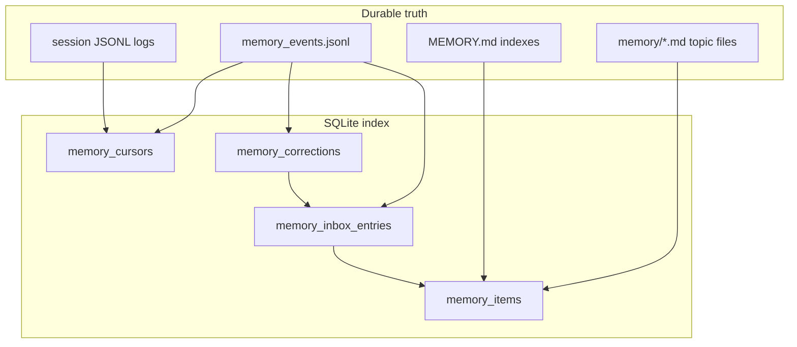
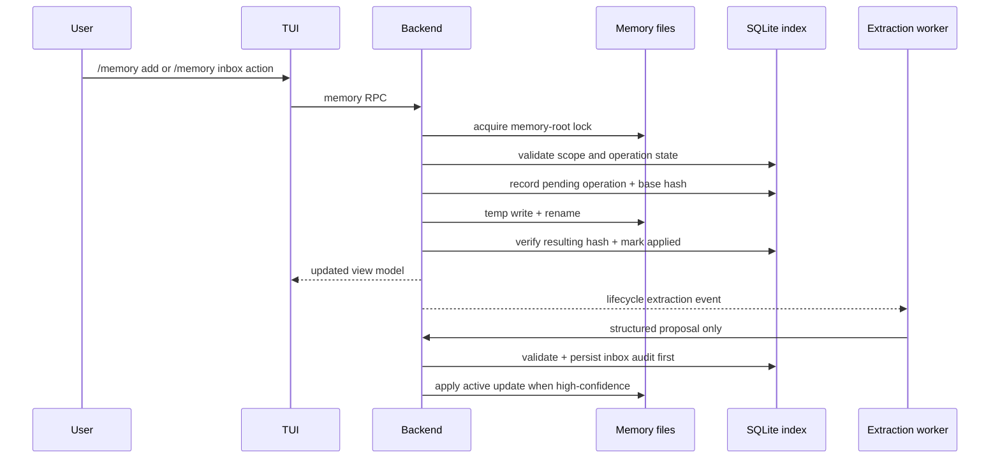
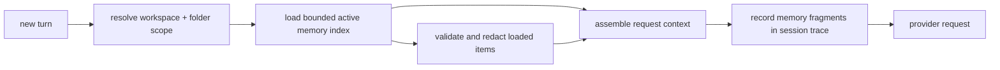

# feat: Local memory system

## Summary

Build KQode's local memory foundation as a file-truth system with a SQLite index, backend-owned `/memory` APIs, a TUI memory surface, bounded prompt loading, and an auditable extraction inbox. The plan intentionally avoids a hardcoded remember/forget keyword detector; immediate memory writes are explicit command/tool-loop behavior, while lifecycle auto-extraction runs in the background after durable session history is available.

---

## Problem Frame

Local session resume and auto-compaction preserve the current conversation, but they do not make KQode better in future sessions. KQode needs durable memory for user preferences, repo and folder context, project decisions, recurring badcases, and external references without turning `AGENTS.md` into a catch-all memory file.

The implementation must fit the current architecture: Rust owns durable state, policy, scheduling, and prompt context, while the Ink TUI renders surfaces through the `BackendClient` JSON-RPC seam. Memory file contents must remain inspectable and correctable; SQLite can accelerate listing, inbox, and scheduling, but must stay rebuildable from file and JSONL truth.

---

## Requirements

**Memory storage and scope**

- R1. Store long-term memory as inspectable files outside `AGENTS.md`, with SQLite indexing metadata and inbox state only. (origin R1, R4)
- R2. Support user-global, repo/project, folder/subtree, and session-only scopes, while reserving team/shared as future scope. (origin R2, R5, R6, R7)
- R3. Classify memory items by type: user, feedback, project, decision, badcase, and reference. (origin R3)
- R4. Persist provenance for every item and every automatic change, including source session, source turn range, authoring path, and timestamps. (origin R4, R28, R31)

**Manual memory management**

- R5. Add backend-owned `/memory` list, show, add, edit, forget, reload, and inbox operations surfaced through the TUI. (origin R8-R14)
- R6. Make `/memory add` and `/memory forget` the v1 guaranteed immediate memory-write paths. (origin R14, F1, AE1)
- R7. Do not add a hardcoded remember/forget keyword detector; future plain-language memory intent routes through model instructions or a memory tool loop. (origin R15)

**Automatic extraction and inbox**

- R8. Add lifecycle extraction scheduling that runs outside the live prompt path and considers only settled eligible transcript ranges after a per-session cursor. (origin R16-R22, AE5)
- R9. Let extraction produce no-op, inactive candidate, or active high-confidence update with inbox audit. (origin R23-R29, F2)
- R10. Implement `/memory inbox` review actions for candidates and automatic active updates, including approve, edit, reject, stale, and undo. (origin R30-R35, F3, AE3, AE4)
- R11. Prevent recreated bad memories through correction records and normalized suppression keys. (origin R29, R33)

**Prompt loading and safety**

- R12. Load only bounded active memory context into prompt assembly and trace the loaded fragments. (origin R36, R37, R40, R41)
- R13. Treat memory references to files, functions, commands, and flags as stale-prone claims that require verification before recommendations depend on them. (origin R38, AE6)
- R14. Reject or redact secrets and sensitive content in both manual and automatic memory paths. (origin R26, R42, R43)
- R15. Keep query-time semantic relevant-memory selection as a follow-up after memory files, inbox, and bounded loading are reliable. (origin R39)
- R16. Treat transcripts, repo content, model output, extraction output, and memory files as untrusted data until validated for scope, sensitivity, and prompt-safety.
- R17. Make every memory mutation crash-recoverable through a durable operation record, content hashes, atomic file replacement, and startup reconciliation.
- R18. Keep raw sensitive content out of inbox payloads, rollback data, trace records, diagnostics, and correction suppression keys.

---

## Key Technical Decisions

- **KTD1. Topic files are memory item truth:** Store remembered facts as markdown topic files under KQode-controlled memory roots. Topic file frontmatter owns item metadata; `MEMORY.md` is a generated or user-readable index that can be rebuilt.
- **KTD2. Memory lifecycle audit is file truth too:** Store inbox entries, mutation operations, review actions, correction suppression, rollback references, and cursor advances in an append-only memory event log under each memory root. SQLite projects topic files and event logs instead of owning review and undo state.
- **KTD3. Private local roots first:** v1 stores user, repo, and folder memory under the user's KQode home rather than committed repo files. Team/shared and committed memory can be added later without leaking private memory into source control.
- **KTD4. Opaque scope identity and fail-closed ambiguity:** Storage paths and trace records use opaque scope ids derived from normalized workspace identity, not raw local paths. Ambiguous repo/folder identity disables repo/folder memory loading and writes until resolved.
- **KTD5. Scope precedence is deterministic:** Prompt loading resolves memory in session, folder, repo, then user order, with more specific scopes winning when items conflict. Folder scope uses longest-prefix matching within the resolved workspace identity.
- **KTD6. Backend owns memory lifecycle:** Rust owns memory roots, validation, file writes, indexing, scheduling, extraction, prompt loading, and protocol responses. The TUI renders and invokes backend APIs only through `BackendClient`.
- **KTD7. Surface-first slash command:** `/memory` opens one fullscreen TUI surface with internal modes. Multi-word slash parsing can be added later, but v1 does not need to stretch the existing exact-name slash registry.
- **KTD8. No hardcoded natural-language detector:** Immediate memory writes require explicit `/memory` operations or a future model-invoked memory tool. This avoids brittle keyword matching such as treating "don't forget to run tests" as a memory write.
- **KTD9. Audit before visibility for automatic active writes:** Automatic high-confidence updates persist a durable operation/audit record and rollback reference before the active memory content becomes visible to prompt loading.
- **KTD10. Extraction is lifecycle scheduled:** Extraction is triggered by idle, clean-exit, resume-scan, or explicit `/memory extract` events, never by every prompt request. The main turn path does not wait on extraction.
- **KTD11. Bounded prompt loading ships before semantic recall:** v1 can load a capped, scope-filtered active memory index/summary so memory influences future turns. Side-model or semantic relevant-memory selection is deferred.
- **KTD12. Extraction workers are proposal-only:** Workers never mutate memory truth directly. They return structured proposals that the backend validates, redacts, scopes, audits, locks, and commits.
- **KTD13. Memory is prompt data, not instruction authority:** Loaded memory is rendered as untrusted facts with source citations. Memory cannot override system instructions, policy, permissions, tool authorization, or approval requirements.
- **KTD14. Sensitive validation fails closed:** If validation, redaction, lock acquisition, scope resolution, or rollback verification fails, KQode does not write, load, or trace raw memory content.

---

## Scope Boundaries

- No remote or team memory sync in this plan; metadata reserves team scope for later.
- No committed repo memory files in v1; project and folder memory are private local memory rooted by canonical workspace identity.
- No hardcoded plain-language remember/forget detector.
- No semantic/vector retrieval or side-model memory selection in v1.
- No promotion from session summaries or compaction summaries into long-term memory without the memory extraction pipeline or an explicit memory command.
- No broad filesystem access for extraction workers; writes are limited to memory roots.

### Deferred to Follow-Up Work

- Model-invoked `memory.write` / `memory.forget` tool integration once KQode's tool loop exists.
- Query-time relevant-memory selection over the file corpus.
- Team/shared memory sync and committed project memory.
- Rich editor integration for memory file editing beyond terminal surfaces and external editor handoff.

---

## Threat Model

Memory is a durable privacy and prompt-context boundary. KQode treats all candidate memory sources as untrusted until validated: user transcript text, repo files, model output, extraction-worker output, externally edited memory files, and prior memory content.

The primary abuse cases are malicious repo text becoming durable memory, prompt-injection content being promoted into future prompts, secrets being copied into memory/audit/trace data, cross-repo scope confusion, and local RPC callers attempting to access another scope's memory. The backend must fail closed when scope identity, sensitive-content validation, redaction, lock acquisition, or rollback verification is unavailable.

---

## High-Level Technical Design

### Source of truth and indexes



Memory topic files are durable truth for remembered facts. `MEMORY.md` is a rebuildable index, and `memory_events.jsonl` is durable truth for lifecycle state such as inbox entries, review actions, rollback references, correction suppression, and extraction cursors. SQLite projects these files so `/memory` surfaces can query quickly and the scheduler can resume safely.

### Memory update lifecycle



Manual writes and review actions flow through the same backend write path as automatic updates. Every mutation carries an operation id, base hash, resulting hash, and recovery state so startup can reconcile crashes between audit persistence and file replacement. Extraction workers return proposals only; the backend is the only component that mutates memory truth.

### Prompt loading boundary



The prompt path loads bounded memory synchronously but never runs extraction synchronously. Loaded fragments are source-cited, validated, and rendered as untrusted facts so KQode can explain which memory influenced a response without treating memory as instructions.

---

## Output Structure

```text
src/
  memory/
    mod.rs
    model.rs
    paths.rs
    corpus.rs
    event_log.rs
    security.rs
    index.rs
    inbox.rs
    scheduler.rs
    extraction.rs
    prompt.rs
  backend/
    memory.rs
  protocol/
    memory.rs
  store/
    memory.rs
tui/src/
  components/
    MemorySurface/
      index.tsx
      MemoryRows.tsx
      InboxRows.tsx
      useMemoryBackend.ts
      useMemoryInput.ts
      __tests__/MemorySurface.test.tsx
  state/ui/memory/
    atoms.ts
    index.ts
    __tests__/atoms.test.ts
  libs/memory/
    formatMemoryRows.ts
    formatInboxRows.ts
  contracts/backend/
    memoryMessages.ts
  backend/protocol/
    memoryProtocol.ts
tests/
  memory_backend.rs
migrations/
  V3__memory_index.sql
```

The exact module split can adjust during implementation, but the boundary should hold: Rust owns memory logic and durable state; TUI modules only render and call protocol methods.

---

## Implementation Units

### U1. Memory roots, file model, and atomic corpus operations

**Goal:** Define memory scopes, item types, file layout, validation, and atomic file operations.

**Requirements:** R1, R2, R3, R4, R14, R16, R17, R18

**Dependencies:** None

**Files:**
- Create: `src/memory/mod.rs`, `src/memory/model.rs`, `src/memory/paths.rs`, `src/memory/corpus.rs`, `src/memory/security.rs`
- Modify: `src/lib.rs`, `src/paths.rs`
- Test: `src/memory/model.rs`, `src/memory/paths.rs`, `src/memory/corpus.rs`

**Approach:**
- Add `MemoryScope`, `MemoryType`, `MemoryItem`, `MemorySource`, and `MemoryProvenance` types with serde-friendly string values.
- Resolve memory roots under the KQode home using opaque scope ids derived from normalized workspace identity.
- Use topic markdown files as item truth and treat `MEMORY.md` as a rebuildable index.
- Write via temp file plus rename, sync the parent directory where supported, and keep file writes inside memory roots after path normalization.
- Validate loaded and written content separately: valid-to-index can be broader than valid-to-prompt-load.
- Treat invalid external edits as validation errors that are reportable without deleting user data.

**Patterns to follow:** `src/paths.rs` for KQode home helpers; `src/conversation/session_log.rs` for append-only file ergonomics; `src/store/mod.rs` for private-directory permissions.

**Test scenarios:**
- Happy path: user scope and repo scope resolve to distinct roots under the KQode home.
- Edge case: two workspaces with similar names but different canonical paths produce isolated repo memory roots.
- Error path: traversal attempts outside the memory root are rejected.
- Error path: invalid frontmatter is reported as invalid but the file is not deleted.
- Error path: secret-shaped content is refused or marked blocked before writing.
- Error path: instruction-like external file content is quarantined from prompt loading until reviewed.

**Verification:** Memory roots and files can be created, read, validated, and rewritten without touching `AGENTS.md` or source-controlled repo files.

### U2. SQLite memory index, inbox, corrections, and rebuild

**Goal:** Add a forward-only SQLite migration, durable memory event log, and store methods for memory item projections, inbox entries, extraction cursors, and correction records.

**Requirements:** R1, R4, R8, R9, R10, R11, R17, R18

**Dependencies:** U1

**Files:**
- Create: `migrations/V3__memory_index.sql`, `src/store/memory.rs`, `src/memory/event_log.rs`
- Modify: `src/store/mod.rs`, `src/store/migrations.rs`, `src/store/tests.rs`
- Test: `src/store/tests.rs`

**Approach:**
- Add tables for memory item metadata, inbox entries, per-session extraction cursors, and correction suppression keys.
- Add `memory_events.jsonl` as durable lifecycle truth for operation intents, applied writes, inbox status changes, rollback conflicts, correction records, and cursor advances.
- Keep the schema additive; do not edit shipped migrations.
- Add store methods that open a fresh connection per operation, mirroring provider/session store patterns.
- Add a rebuild path that scans memory topic files and event logs into a temporary projection, validates it, then swaps item metadata atomically.
- Represent inbox state with explicit statuses for active-audit, candidate, approved, rejected, stale, undone, and failed.
- Use operation ids and content hashes so crash recovery can reconcile pending/applied file changes after restart.

**Patterns to follow:** `src/store/sessions.rs` for projection/reindex; `src/store/tests.rs` for migration assertions; `migrations/V1__initial_schema.sql` and existing V2 migration conventions.

**Test scenarios:**
- Happy path: fresh DB migrates to V3 with memory tables and history rows intact.
- Happy path: reindex from memory files and event logs recreates item rows, inbox state, correction records, and cursors after deleting the DB.
- Edge case: repeated reindex is idempotent and preserves newer inbox/correction state.
- Edge case: a pending operation is reconciled from file hashes after restart.
- Error path: divergent migration history still fails closed.
- Concurrency path: two small writes wait on WAL rather than corrupting rows.

**Verification:** Store bootstrap remains fail-closed, migration checks pass, and memory metadata can be rebuilt from files.

### U3. Backend memory service and JSON-RPC protocol

**Goal:** Expose backend-owned memory operations over JSON-RPC and keep Rust/TypeScript contracts mirrored.

**Requirements:** R5, R6, R7, R10, R14, R16, R18

**Dependencies:** U1, U2

**Files:**
- Create: `src/memory/index.rs`, `src/memory/inbox.rs`, `src/backend/memory.rs`, `src/protocol/memory.rs`
- Modify: `src/protocol/mod.rs`, `src/backend/mod.rs`
- Create: `tui/src/contracts/backend/memoryMessages.ts`, `tui/src/backend/protocol/memoryProtocol.ts`
- Modify: `tui/src/contracts/backend/index.ts`, `tui/src/contracts/backend/client.ts`, `tui/src/backend/client/messageConnectionClient.ts`, `tui/src/backend/client/backendClient.ts`
- Test: `src/protocol/tests.rs`, `src/backend/tests.rs`, `tests/memory_backend.rs`, `tui/src/backend/protocol/__tests__/memoryProtocol.test.ts`, `tui/src/backend/client/__tests__/backendClient.test.ts`

**Approach:**
- Add RPCs for memory list, show, add, edit, forget, reload, inbox list, inbox apply, and inbox undo.
- Return view models rather than raw file dumps for default list/show calls.
- Keep request/response structs `camelCase` and `deny_unknown_fields` on Rust params.
- Mirror method constants in TypeScript contracts and JSON-RPC descriptors.
- Use explicit protocol errors for invalid scope, invalid memory file, blocked sensitive content, rollback conflict, and active-turn unsafe operations.
- Accept opaque memory ids and scope ids instead of arbitrary filesystem paths.
- Cap request and response sizes for item bodies, titles, filters, inbox diffs, and batch results.
- Redact sensitive values from protocol errors.

**Patterns to follow:** `src/protocol/sessions.rs`, `src/backend/sessions.rs`, `tui/src/contracts/backend/sessionMessages.ts`, `tui/src/backend/protocol/sessionProtocol.ts`, `tui/src/backend/client/messageConnectionClient.ts`.

**Test scenarios:**
- Covers F1 / AE1. `/memory add` RPC creates an active memory item and returns its scope/type/provenance.
- Covers F3 / AE4. Undo RPC restores prior memory content when no later conflicting edit exists.
- Edge case: unknown memory id returns a typed protocol error.
- Edge case: invalid params are rejected with JSON-RPC invalid-params rather than panicking.
- Error path: attempting to write outside a memory root is rejected.
- Error path: cross-scope item access is rejected even if the caller knows an item id.
- Error path: oversized add/edit payloads fail with a typed protocol error.
- Error path: blocked secret values are not echoed in error messages.
- Mirror test: TypeScript protocol descriptors use the same method strings as Rust constants.

**Verification:** TUI clients can call memory RPCs through `BackendClient` without importing backend process internals.

### U4. `/memory` TUI surface and command wiring

**Goal:** Add a fullscreen memory management surface with list, show, add, edit, forget, reload, and inbox modes.

**Requirements:** R5, R6, R10

**Dependencies:** U3

**Files:**
- Create: `tui/src/components/MemorySurface/index.tsx`, `tui/src/components/MemorySurface/MemoryRows.tsx`, `tui/src/components/MemorySurface/InboxRows.tsx`, `tui/src/components/MemorySurface/useMemoryBackend.ts`, `tui/src/components/MemorySurface/useMemoryInput.ts`
- Create: `tui/src/state/ui/memory/atoms.ts`, `tui/src/state/ui/memory/index.ts`
- Create: `tui/src/libs/memory/formatMemoryRows.ts`, `tui/src/libs/memory/formatInboxRows.ts`
- Modify: `tui/src/libs/commands/registry.ts`, `tui/src/libs/commands/executeCommand.ts`, `tui/src/state/ui/surface/atoms.ts`, `tui/src/state/ui/index.ts`, `tui/src/App.tsx`, `tui/src/components/PromptComposer/index.tsx`
- Test: `tui/src/components/MemorySurface/__tests__/MemorySurface.test.tsx`, `tui/src/state/ui/memory/__tests__/atoms.test.ts`, `tui/src/libs/commands/__tests__/executeCommand.test.ts`, `tui/src/libs/commands/__tests__/filterCommands.test.ts`, `tui/src/components/SlashCommandMenu/__tests__/SlashCommandMenu.test.tsx`, `tui/src/__tests__/backendIsolation.test.ts`

**Approach:**
- Add `/memory` as one exact slash command that opens the memory surface.
- Keep surface state in Jotai atoms and put row formatting/filtering helpers in `tui/src/libs/memory/`.
- Use internal tabs or modes for active memory and inbox rather than relying on multi-word slash parsing in v1.
- Render within `safeChromeColumnsAtom` and keep footer/help text inside the safe content width.
- Make add/edit flows text-first in v1; external editor integration can be a follow-up if terminal constraints make inline editing too fragile.

**Patterns to follow:** `tui/src/components/ResumeSurface/index.tsx`, `tui/src/state/ui/resume/atoms.ts`, `tui/src/libs/resume/formatSessionRows.ts`, `tui/AGENTS.md` terminal layout rules.

**Test scenarios:**
- Happy path: `/memory` appears in the slash menu and opens the memory surface.
- Happy path: active memory rows render scope, type, title, and updated time after backend load.
- Happy path: editing a selected active memory item updates the row/detail view through the backend edit RPC.
- Happy path: inbox rows render candidate vs active-audit status and expose review hints.
- Edge case: empty memory corpus shows an actionable empty state.
- Error path: backend failure shows a surface error without closing the TUI.
- Layout path: rows truncate to safe content width and do not render critical glyphs into the final column.

**Verification:** The memory surface works through injected `BackendClient` only and does not violate backend isolation tests.

### U5. Bounded memory prompt loading and trace evidence

**Goal:** Make active memory influence future model requests through bounded, traceable prompt context.

**Requirements:** R12, R13, R14, R15, R16, R18

**Dependencies:** U1, U2, U3

**Files:**
- Create: `src/memory/prompt.rs`
- Modify: `src/chat/system_prompt.rs`, `src/chat/turn.rs`, future `src/chat/request.rs` if the conversation-history plan has landed first, `src/conversation/session_log.rs`
- Test: `src/chat/system_prompt/tests.rs`, `src/memory/prompt.rs`, `src/conversation/tests.rs`

**Approach:**
- Build a bounded memory context block from active items matching the current user/repo/folder scope.
- Include item id, scope, type, updated time, and short content; cap total memory characters/tokens with deterministic ordering.
- Validate and redact memory content before prompt inclusion, including memory files edited outside KQode.
- Record memory-load trace events using ids, hashes, scope, type, timestamps, and load reasons rather than raw memory bodies.
- Add guidance that file/function/flag claims recalled from memory must be verified before recommendations depend on them.
- Avoid semantic selection in this unit; use deterministic scope/type ordering and caps.
- Depend on the single request-assembly path from the conversation-history plan when it is available; otherwise keep memory assembly isolated so it can move there without changing semantics.

**Patterns to follow:** `src/chat/system_prompt.rs` for system prompt composition; `docs/plans/2026-07-09-001-feat-conversation-history-and-auto-compaction-plan.md` for future `request.rs` assembly boundaries; `src/conversation/session_log.rs` for traceable events.

**Test scenarios:**
- Covers F4 / AE6. A scoped active memory item is included in the prompt block with source metadata.
- Edge case: no active memory yields no memory block.
- Edge case: memory over the cap is truncated by deterministic item ordering.
- Edge case: repo-scoped memory from another workspace is excluded.
- Error path: invalid memory files are skipped with diagnostics instead of failing prompt assembly.
- Error path: memory containing blocked sensitive content is not loaded or traced raw.

**Verification:** A new turn includes bounded memory context only for applicable scopes and records what was loaded.

### U6. Lifecycle extraction scheduler and worker seam

**Goal:** Add lifecycle scheduling and a deterministic worker interface for background extraction without blocking live turns.

**Requirements:** R8, R9, R11, R14, R16, R17, R18

**Dependencies:** U1, U2, U3, and durable completed-turn session logs from the local resume and conversation-history work.

**Files:**
- Create: `src/memory/scheduler.rs`, `src/memory/extraction.rs`
- Modify: `src/conversation/persistence.rs`, `src/conversation/session_log.rs`, `src/backend/mod.rs`
- Test: `src/memory/scheduler.rs`, `src/conversation/tests.rs`, `tests/memory_backend.rs`

**Approach:**
- Track per-session extraction cursors in SQLite and only consider completed settled turns after the cursor.
- Trigger scheduling on backend startup/resume scan, clean exit, idle timers where practical, and explicit `/memory extract` if included.
- Coalesce runs so only one extraction worker per memory root/session range runs at a time.
- Define a proposal-only worker result contract with no-op, inactive candidate, active update proposal, blocked-sensitive, and failed outcomes.
- Validate every worker result in the backend before writing inbox entries or active files.
- In the first implementation slice, allow a deterministic mock extractor for tests and leave provider-backed extraction behind a later implementation unit or feature flag.
- Keep provider-backed extraction user-visible or feature-gated until privacy, cost, and cancellation policy are settled.

**Patterns to follow:** `src/conversation/persistence.rs` for durable session projection; `src/backend/git_status.rs` for off-request-thread work; `src/store/sessions.rs` for replay/reindex source scanning.

**Test scenarios:**
- Covers F2 / AE5. A trivial completed turn can advance or skip without spawning an extraction write.
- Happy path: a completed settled turn after the cursor is passed to the worker and advances the cursor after success.
- Edge case: active, pending, cancelled, errored, and interrupted turns are not extracted.
- Edge case: two scheduler triggers coalesce into one worker run for the same cursor range.
- Error path: worker failure records diagnostics and does not block submit/list/show RPCs.
- Error path: malformed worker output is recorded as failed and does not create memory files or candidates.

**Verification:** Extraction scheduling can be tested without provider calls and never runs inside the live prompt request path.

### U7. Inbox state machine, rollback, and correction suppression

**Goal:** Implement reviewable automatic updates, inactive candidates, rollback conflicts, and correction suppression.

**Requirements:** R9, R10, R11, R17, R18

**Dependencies:** U2, U3, U6

**Files:**
- Modify: `src/memory/inbox.rs`, `src/memory/corpus.rs`, `src/store/memory.rs`, `src/backend/memory.rs`
- Test: `src/memory/inbox.rs`, `src/store/tests.rs`, `tests/memory_backend.rs`

**Approach:**
- Persist each automatic result as an inbox entry with source range, target item, diff/rollback payload, confidence, and status.
- Persist operation intent with base content hash and expected resulting hash before applying high-confidence active updates.
- Apply high-confidence active updates only after the audit entry is durable and sensitive validation passes.
- Use scoped correction suppression keys that avoid raw rejected content, raw local paths, and sensitive values.
- On undo after later edits, stop and create a rollback-conflict inbox state rather than overwriting newer user changes.
- Distinguish soft forget from sensitive purge so sensitive content does not remain in rollback payloads, inbox bodies, traces, or generated indexes.

**Patterns to follow:** `src/store/sessions.rs` for status projection; `src/conversation/session_log.rs` for append-only provenance; research lessons from Gemini inbox patch validation and Claude audit behavior in `docs/research/2026-07-09-memory-and-context-persistence-patterns.md`.

**Test scenarios:**
- Covers AE2. A high-confidence project decision update writes active memory and creates an active-audit inbox row.
- Covers AE3. An ambiguous inferred preference creates an inactive candidate.
- Covers AE4. Undo restores the previous file content and records a correction suppression key.
- Edge case: undo after manual edit produces rollback conflict and preserves the manual edit.
- Error path: rejected candidate remains in history but is never loaded as active memory.
- Error path: sensitive purge removes or redacts rollback/audit copies and leaves only non-content tombstones.

**Verification:** Inbox review actions and active memory files stay consistent across restart and reindex.

### U8. Documentation, release notes, and validation coverage

**Goal:** Document the local memory model and add end-to-end validation guidance.

**Requirements:** R1-R18

**Dependencies:** U1-U7

**Files:**
- Modify: `README.md` if the user-facing command surface is documented there
- Modify: `docs/kqode_core_implementation_details.md`
- Create or modify: `docs/solutions/architecture-patterns/local-memory-file-truth-and-inbox-audit.md` after implementation proves the pattern
- Test: existing Rust/TUI suites listed in prior units

**Approach:**
- Document memory scopes, commands, where local memory lives, what is never stored, and how inbox review/undo works.
- Keep `AGENTS.md` as instructions, not memory storage.
- Add a solution note only after implementation verifies the concurrency, file-truth, and inbox-audit pattern.

**Patterns to follow:** `docs/research/README.md` for durable research rules; existing plan/research docs for source-cited design rationale.

**Test scenarios:**
- Test expectation: none for documentation-only edits; implementation behavior is covered in U1-U7.

**Verification:** A future contributor can understand how `/memory`, local files, inbox audit, and scheduler triggers interact without reading the full implementation.

---

## System-Wide Impact

- **Storage:** Adds private local memory files under KQode home plus SQLite index tables. The DB remains rebuildable.
- **Audit truth:** Adds append-only memory event logs that become durable truth for inbox, correction, rollback, and cursor state.
- **Prompt context:** Adds bounded memory fragments to request assembly, so prompt-size accounting must include memory context.
- **TUI:** Adds a new fullscreen surface that must preserve safe content width and bottom-sticky composer behavior.
- **Privacy:** Introduces a new durable data class; secret refusal, local-only defaults, and clear delete/forget behavior are mandatory.
- **Concurrency:** Multiple KQode processes and background workers may touch memory roots, so memory writes need locking and atomicity.
- **Background model calls:** Provider-backed extraction may send settled transcript ranges to a model; keep it feature-gated or user-visible until privacy, cost, and cancellation behavior are explicit.

---

## Risks and Mitigations

| Risk | Mitigation |
|---|---|
| Automatic memory writes save wrong or stale facts | Require high confidence, write inbox audit entries first, support undo, and record correction suppression keys. |
| Private project facts leak globally | Canonicalize scope roots and require explicit scope for user-global writes. |
| Memory files and SQLite index drift | Treat files as truth and rebuild the index from files at startup or reload. |
| Extraction races with manual edits | Serialize memory writes under a memory lock and detect rollback conflicts. |
| Memory bloats prompts | Load bounded indexes/summaries first and defer semantic recall. |
| Secret or sensitive data is stored | Add validation and refusal paths before writing active memory or candidates. |
| Prompt-injection text becomes durable memory | Treat transcripts, repo content, model output, extraction output, and memory files as untrusted data; block instruction-like automatic writes. |
| Memory traces create a second copy of sensitive data | Trace only ids, hashes, redacted labels, scope/type, and load reasons by default. |
| SQLite loss removes inbox/corrections/cursors | Store lifecycle state in `memory_events.jsonl` and project it into SQLite. |
| Crash happens between audit and file rename | Use operation ids, base/result hashes, pending/applied states, and startup reconciliation. |
| Repo/folder memory leaks across ambiguous workspace identity | Use opaque scoped identities and fail closed when canonical workspace identity is ambiguous. |
| Extraction worker tampers with memory files | Make workers proposal-only; backend alone validates, audits, locks, and commits. |
| Sensitive data survives forget through rollback or inbox history | Add sensitive purge semantics that redact files, indexes, rollback payloads, inbox bodies, and traces where feasible. |
| Local RPC caller accesses another scope's memory | Use scope-bound opaque ids, strict param validation, size caps, and cross-scope checks. |
| External memory file edit injects unsafe content | Quarantine invalid or unsafe files from prompt loading while preserving them for manual repair. |

---

## Sources and Research

- Origin requirements: `docs/brainstorms/2026-07-09-local-memory-system-requirements.md`
- Reference-agent research: `docs/research/2026-07-09-memory-and-context-persistence-patterns.md`
- Existing session plan: `docs/plans/2026-07-08-001-feat-local-session-resume-plan.md`
- Existing compaction plan: `docs/plans/2026-07-09-001-feat-conversation-history-and-auto-compaction-plan.md`
- Store/session patterns: `src/store/mod.rs`, `src/store/sessions.rs`, `src/conversation/session_log.rs`, `src/conversation/persistence.rs`
- Backend/protocol patterns: `src/protocol/sessions.rs`, `src/backend/sessions.rs`
- TUI surface patterns: `tui/src/components/ResumeSurface/index.tsx`, `tui/src/state/ui/resume/atoms.ts`, `tui/src/contracts/backend/sessionMessages.ts`, `tui/src/backend/protocol/sessionProtocol.ts`
- Institutional learnings: `docs/solutions/architecture-patterns/backend-process-lifecycle-ownership-in-the-ink-tui.md`, `docs/solutions/architecture-patterns/state-libs-layering-and-cycle-verification-in-the-ink-tui.md`, `docs/solutions/architecture-patterns/terminal-edge-rendering-tradeoffs-in-the-ink-tui.md`, `docs/solutions/workflow-issues/recovering-from-concurrent-agent-session-edits.md`

---

## Open Questions

### Resolved During Planning

- Plain-language remember/forget does not use a hardcoded keyword detector in v1; it waits for model instructions/tool-loop support, while `/memory add` and `/memory forget` are the guaranteed immediate paths.
- `/memory` is surface-first in v1; multi-word slash parsing is not required for the first implementation.
- Query-time semantic relevant-memory selection is deferred; bounded deterministic memory loading is in scope.

### Deferred to Implementation

- Exact markdown frontmatter fields and index-line formatting.
- Exact idle timer duration and extraction batch sizing.
- Whether `/memory edit` starts inline and later grows external-editor support, or starts with external editor on supported terminals.
- Exact sensitive-content detection rules beyond obvious credentials and secret patterns.
- Whether provider-backed extraction lands in the same first implementation wave or behind a feature flag after the deterministic worker seam is in place.
