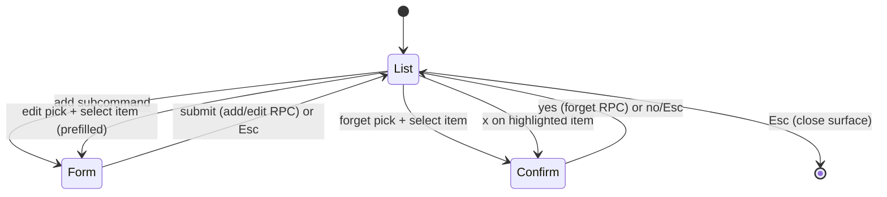

# feat: Slash subcommand autocomplete (/memory)

## Summary

Add inline subcommand autocomplete to the TUI slash menu and wire the `/memory` subcommands (`add`, `show`, `inbox`, `edit`, `forget`) to real behavior. The command registry gains a general subcommand model; the menu expands a parent into its subcommands on match, filters as you type, Tab-completes, Enter-runs. `add`/`edit` reuse a new minimal title+body form inside the memory surface, `forget` picks-then-confirms a removal (soft-deactivate or hard-remove per backend), gating the existing `x` key too, and `show`/`inbox` open the surface on the right tab. Research confirms the Rust backend, JSON-RPC protocol, and typed TS `BackendClient` methods already exist — this plan lands **entirely in the TUI layer** (`tui/`).

---

## Problem Frame

The TUI slash menu is flat: `/memory` opens a fullscreen surface, but the richer memory operations already specified and backend-supported are not discoverable from the composer, and `edit`/`add`/forget-confirmation have no interactive path. See origin for the full pain narrative (`docs/brainstorms/2026-07-10-slash-subcommand-autocomplete-requirements.md`).

---

## Requirements

**Subcommand autocomplete (menu mechanism)**
- R1. Registry models subcommands generally: a command may declare subcommands, each with a name and description; menu, filter, and help derive from this single source, and routing dispatches on the subcommand id. (origin R1)
- R2. When composer text matches a parent with subcommands, the menu lists that parent's subcommands as `/parent sub` + description. (origin R2)
- R3. Typing narrows subcommands by prefix; parent-only query shows all of them. (origin R3)
- R4. Tab completes the highlighted subcommand; Enter runs it; ↑/↓ move; Esc dismisses — matching today's top-level menu. (origin R4)
- R5. Commands with no subcommands keep today's flat behavior. (origin R5)

**`/memory` subcommand set and routing**
- R6. `/memory` declares `add`, `show`, `inbox`, `edit`, `forget`, each with a description; `reload` is not a composer subcommand. (origin R6)
- R7. `show` opens the surface on the Active list; `inbox` opens it on the Inbox tab. (origin R7)
- R8. Bare `/memory` + Enter opens the Active list (preserved); `show` is an explicit synonym. (origin R8)

**Add and edit form**
- R9. `add` opens a form with two fields (single-line title, multiline body); scope fixed to repo, type to project in v1, not user-editable. (origin R9)
- R10. Submitting add writes an active item via the existing add RPC; it appears in the Active list. (origin R10)
- R11. `edit` opens the Active list to pick an item, then the same form prefilled with the item's title+body; submit saves via the existing edit RPC. (origin R11)
- R12. The form can be cancelled (Esc) without writing. (origin R12)

**Forget confirmation**
- R13. `forget` opens the Active list to pick an item; confirming removes it via the existing forget RPC (soft-deactivate or hard-remove per backend) and it leaves the Active list. (origin R13)
- R14. Removal always passes an explicit confirmation step; cancelling leaves the item. (origin R14)
- R15. The in-surface `x` forget key routes through the same confirmation rather than removing instantly. (origin R15)

**Discoverability**
- R16. The Help COMMANDS section reflects subcommands (name + description), derived from the registry. (origin R16)
- R17. The Active-list empty-state hint referencing `/memory add` stays accurate. (origin R17)

**Origin flows:** F1 (discover+run a subcommand), F2 (add), F3 (edit), F4 (forget)
**Origin acceptance examples:** AE1 (covers R2, R3), AE2 (covers R4, R7), AE3 (covers R8), AE4 (covers R9, R10), AE5 (covers R11), AE6 (covers R13, R14, R15)

---

## Scope Boundaries

- No scope/type pickers in the form; v1 fixed to repo/project. Cross-scope and user-scoped manual add are deferred. (origin)
- No inline arguments (`/memory add <text>`). (origin)
- No new subcommands for other commands; only the general mechanism ships so they can adopt it later. (origin)
- `reload` is not a composer subcommand; the in-surface `r` reload key is unchanged. (origin)
- Editing an item's scope or type is out of scope (edit is title + body only). (origin)
- Auto-extraction / inbox candidate generation behavior is unchanged. (origin)
- No backend, JSON-RPC protocol, or `BackendClient` changes — those layers already exist and are tested.

### Deferred to Follow-Up Work

- `/ce-compound` write-ups for the two documented gaps (Ink interactive-form/focus pattern; render-level `lastFrame` testing) after the form lands.

---

## Context & Research

### Relevant Code and Patterns

- **Command registry (pure logic):** `tui/src/libs/commands/registry.ts` (single source of truth: id/name/description), `tui/src/libs/commands/filterCommands.ts`, `tui/src/libs/commands/matchCommand.ts` (`normalizeCommandQuery`, `commandMatchKey`, `exactCommandMatch`), `tui/src/libs/commands/executeCommand.ts` (`CommandActions`, id→action switch).
- **Menu state + view:** `tui/src/state/ui/commands/atoms.ts` (`commandMenuMatchesAtom`, `highlightedCommandAtom`, open/highlight atoms), `tui/src/components/SlashCommandMenu/index.tsx` (fixed-height panel, name-padded rows), `tui/src/components/SlashCommandMenu/handleMenuKey.ts` (↑/↓/Tab/Esc/Enter).
- **Submit-time resolution:** `tui/src/components/PromptComposer/input/handleSubmit.ts` (`exactCommandMatch`→`executeCommand`) and `CommandActions` assembly in `tui/src/components/PromptComposer/index.tsx` (`useMemo` over atom setters).
- **Interactive surface/form template (mirror this):** `tui/src/components/LoginSurface/` — `index.tsx` composes a step-enum view; `useLoginInput.ts` is a single `useInput` dispatching by step with an `editText` helper and `useLatest` refs; `CustomForm.tsx` renders active-field rows with a caret; `tui/src/components/MaskedInput/index.tsx` is a reusable local-state input; `tui/src/state/ui/login/atoms.ts` holds `LoginStep`, field/error atoms, a reset atom, and `clearConfirmAtom` (one-key y/n destructive confirm).
- **Memory surface + state + backend:** `tui/src/components/MemorySurface/index.tsx` (Active/Inbox/Detail views), `tui/src/components/MemorySurface/useMemoryInput.ts` (list/detail keys, `x` forgets instantly today), `tui/src/components/MemorySurface/useMemoryBackend.ts` (`refresh`, `showDetail`, `forgetItem`, inbox actions), `tui/src/state/ui/memory/atoms.ts` (`MemoryMode`, highlight/window/status atoms, reset), `tui/src/state/ui/surface/atoms.ts` (`openMemorySurfaceAtom`).
- **Existing backend seam (no changes needed):** `tui/src/contracts/backend/client.ts` already declares `addMemory`, `editMemory`, `forgetMemory`, `showMemory`, `listMemory`, inbox methods; implemented in `tui/src/backend/client/messageConnectionClient.ts` + `backendClient.ts`; Rust handlers in `src/backend/memory.rs` (`handle_memory_add`/`handle_memory_edit`/`handle_memory_forget`) dispatched from `src/backend/mod.rs`.
- **Help:** `tui/src/components/HelpScreen/helpContent.ts` (`buildCommandSection` derives COMMANDS from the registry).

### Institutional Learnings

- **State-vs-libs layering** (`docs/solutions/architecture-patterns/state-libs-layering-and-cycle-verification-in-the-ink-tui.md`): pure subcommand logic belongs in `tui/src/libs/commands/`, `state/` stays atoms-only, and `libs` must never import `@state`. No barrel `index.ts` in `libs/`; colocate `__tests__/`. Verify cycles with the repo's `detect-cycles.mjs`, not `madge`.
- **Terminal edge rendering** (`docs/solutions/architecture-patterns/terminal-edge-rendering-tradeoffs-in-the-ink-tui.md`): every new rendered row (autocomplete list, form fields, confirmation line) must use the shared safe content width (`safeChromeColumnsAtom`); a background `<Box>` must set `width={columns}` explicitly. `FULLSCREEN_GUARD_ROWS`↔`INK_CURSOR_ROW_ORIGIN_OFFSET` move in lockstep and cursor drift has **no unit test** — verify composer cursor placement visually if menu/composer height shifts.
- **Backend isolation** (`docs/solutions/architecture-patterns/backend-process-lifecycle-ownership-in-the-ink-tui.md`): state/components reach the backend only through the injected `BackendClient` seam; the guardrail `tui/src/__tests__/backendIsolation.test.ts` forbids process imports under `state/**` and `components/**`. Tests inject a fake via `store.set(backendClientAtom, fake)` on an isolated store — reuse `tui/src/test/backendMemoryStub.ts`.
- **Local memory semantics** (`docs/solutions/architecture-patterns/local-memory-file-truth-and-inbox-audit.md`): the backend owns validation/redaction/scoping — keep the form thin (submit intent). `forget` may hard-remove *or* soft-deactivate (distinct `MemoryForgetResult`); confirmation copy should not over-promise. Inbox is a review queue, not an edit list (unchanged here).

### External References

- None. Local patterns are strong (LoginSurface is a near-exact template) and no external contract surfaces are touched.

---

## Key Technical Decisions

- **Subcommand model lives in `libs/commands`, atoms stay thin:** extend `CommandDefinition` with an optional `subcommands` list and add a `MenuEntry` union + pure filter/match helpers in `libs/commands`; `state/ui/commands` atoms only call those helpers. Preserves the layering invariant and the "one registry entry drives menu + filter + help" property. (Execution routes through a small hardcoded memory-subcommand switch in `executeCommand.ts` — `SubcommandDefinition` carries no `action`; a future command adopting subcommands adds a router branch, deliberately kept simple for a single consumer today.)
- **Menu entries, not flat strings:** the menu match list becomes `MenuEntry[]` (top-level command OR parent+subcommand) so rendering, Tab-complete, Enter-run, and submit-time `exactCommandMatch` all share one representation across `handleMenuKey` and `handleSubmit`.
- **Parent entry only when no subprefix is typed:** bare `/memory` lists the parent entry first (highlighted → Enter opens the Active list, today's behavior) followed by its subcommands. Once a non-empty subprefix is typed (`/memory e`), the parent entry drops out so the index-0 highlight lands on a real subcommand and Enter runs it, not the parent. `show` also opens the Active list; the intentional redundancy keeps the current behavior while making the view action discoverable (origin decision).
- **Reuse the interactive-surface pattern for new flows:** model the add/edit form, forget confirmation, and item-pick as memory-surface state (a form atom, a `pendingItemAction` atom, a `forgetConfirm` atom) mirroring `LoginSurface`'s step/field/`clearConfirm` atoms and per-surface input hook — no new input abstraction.
- **No backend work:** route subcommands to the existing `BackendClient` memory methods; `useMemoryBackend` gains thin `addItem`/`editItem` wrappers alongside the existing `forgetItem`.
- **Multiline body reuses the composer input model, not append-only `editText`:** the body field supports full cursor movement and edits at any position (required to edit a prefilled body); Shift+Enter / `\`+Enter insert a newline, Enter submits, Esc cancels. Field navigation uses Tab/Shift+Tab (title↔body) so ↑/↓ stay free for line movement inside the body. Reuse the composer's newline classifier (export `classifyNewlineInput` from `handleNewline.ts` rather than re-implementing it).
- **Forget always confirms, and confirm requires an explicit `y`:** both `/memory forget` (pick→confirm) and the in-surface `x` key route through one confirmation step; at the confirm prompt only `y` removes, while Enter/`n`/Esc cancel — so a pick-mode select-Enter can't chain straight into a delete (mirrors the login clear-confirm, where Enter is a no-op). `forgetItem` runs only after `y`.

---

## Open Questions

### Resolved During Planning

- Pick-then-act modeling: a `pendingItemAction` atom (`'edit' | 'forget' | null`) puts the Active list into pick mode; selecting an item commits (edit → open prefilled form; forget → open confirm). Mirrors `LoginSurface` step state.
- Menu highlight/parent rule: bare `/memory` shows `[parent, ...subcommands]` with the parent highlighted (Enter → Active); once a non-empty subprefix is typed the parent entry drops so the highlight lands on a subcommand and Enter runs it. Tab on the bare-parent entry is a no-op (text is already `/memory`); users ↓ to a subcommand to complete.
- Query parse: the menu splits `parent <subprefix>` on the first internal space (`normalizeCommandQuery` only trims outer whitespace); collapse repeated internal spaces before matching the subprefix.
- Esc ownership: while a memory sub-state (`memoryForm`/`forgetConfirm`/`pendingItemAction`) is active, the surface hook owns Esc (→ back to List); the global `App.tsx` Esc-close must be gated off for `Surface.Memory` in those states, mirroring the existing `Surface.Login` exclusion (see U4).
- Input-hook exclusivity: the list hook (`useMemoryInput`) and the form hook (`useMemoryFormInput`) are mutually exclusive via `isActive` keyed on `memoryFormAtom` — Ink dispatches keys to every mounted `useInput`, so render-level gating is not enough (see U4).
- Surface initial mode: set the tab only in `openMemorySurfaceAtom` (always, incl. the Active default); `resetMemorySurfaceAtom`/`refresh` must not touch `memoryModeAtom`, so the mount-time `refresh()` can't clobber a just-opened Inbox (see U3).
- Multiline body: composer input model with full cursor movement (see Key Technical Decisions).
- Edit prefill source: list items carry no body, so edit fetches the body via `showMemory` before opening the form; on fetch failure the edit aborts with a visible error and the form does NOT open (never prefill/submit an empty body over a real one).

### Deferred to Implementation

- Whether any existing test asserts instant `x` forget and must be updated for the new confirmation (origin deferred; a grep of `tui/src/components/MemorySurface/__tests__/MemorySurface.test.tsx` found no such assertion, so this is likely a no-op — confirm during U6).
- Whether the backend `memory.add` service marks a manual repo/project item `active: true` so it appears in the Active list immediately (AE4/R10); the handler returns a `MemoryMutationResult` (not an inbox candidate), so this is expected — verify at implementation.
- Exact reset ordering when the surface closes mid-form/mid-confirm (extend `resetMemorySurfaceAtom`; verify no stale form/pending/confirm state on reopen).

---

## High-Level Technical Design

> *This illustrates the intended approach and is directional guidance for review, not implementation specification. The implementing agent should treat it as context, not code to reproduce.*

**Menu entry model (in `libs/commands`):**

    MenuEntry =
      | { kind: 'command';    command: CommandDefinition }
      | { kind: 'subcommand'; parent: CommandDefinition; sub: SubcommandDefinition }

    filter(query):                                 // query normalized; split parent vs subprefix on first internal space
      - query is exactly a parent w/ subcommands   -> [parent, ...all its subcommands]     // parent highlighted; Enter opens parent
      - query is `parent <non-empty subprefix>`    -> [...subcommands matching subprefix]   // NO parent entry; highlight lands on a subcommand
      - otherwise                                  -> top-level commands matched by prefix (today's behavior)
    fullName(entry): '/clear'  or  '/memory add'   // used for render + Tab-complete + exactCommandMatch

**Memory surface state machine (atoms mirror LoginSurface):**

`List` = today's Active/Inbox tabs (+ a "pick mode" hint when `pendingItemAction` is set). `Form` is driven by a `memoryForm` atom (`{ mode, itemId?, title, body, titleError }`); `Confirm` by a `forgetConfirm` atom (`MemoryItem | null`). While `Form`/`Confirm`/pick is active the surface's own hook owns Esc (→ List); the global `App.tsx` Esc-close is gated off for `Surface.Memory` in those states so Esc returns to the list instead of closing the surface (see U4).

---

## Implementation Units

### U1. Subcommand model + `/memory` subcommand definitions

**Goal:** Extend the registry with a general subcommand model and declare the `/memory` subcommands, plus pure helpers — no rendering or routing yet.

**Requirements:** R1, R6

**Dependencies:** None

**Files:**
- Modify: `tui/src/libs/commands/registry.ts`
- Create: `tui/src/libs/commands/subcommands.ts`
- Test: `tui/src/libs/commands/__tests__/subcommands.test.ts`

**Approach:**
- Add `SubcommandDefinition { id; name; description }` (name is the bare token, e.g. `add`) and an optional `subcommands?: readonly SubcommandDefinition[]` on `CommandDefinition`. Declare `add`, `show`, `inbox`, `edit`, `forget` under the Memory command with one-line descriptions; do not add `reload`.
- In `subcommands.ts`, define the `MenuEntry` union and helpers: `subcommandFullName(command, sub)` → `/memory add`, `entryFullName(entry)`, `commandSubcommands(command)`, and `hasSubcommands(command)`. Keep everything pure (no `@state` import, no barrel index).

**Patterns to follow:** `tui/src/libs/commands/registry.ts` docstring (one entry drives everything); `tui/src/libs/commands/matchCommand.ts` for helper style.

**Test scenarios:**
- Happy path: Memory declares exactly `add, show, inbox, edit, forget`, each with a non-empty description; `reload` is absent.
- Happy path: `subcommandFullName` / `entryFullName` produce `/memory inbox` for a subcommand entry and `/memory` for the parent.
- Edge case: `hasSubcommands`/`commandSubcommands` return empty for commands without subcommands (e.g. `/clear`).

**Verification:** New helpers and data compile and are covered; no other behavior changes.

---

### U2. Subcommand-aware slash menu (match, filter, render, complete, submit)

**Goal:** Make the menu understand subcommands end-to-end for discovery/navigation: expand a matched parent into its subcommands, filter as typed, render `/parent sub` + description, Tab-complete, and resolve full subcommand names at submit time. Enter routes through a new `executeMenuSelection` that, for memory subcommands, defaults to opening the memory surface (specific routing refined in U3–U6).

**Requirements:** R2, R3, R4, R5

**Dependencies:** U1

**Files:**
- Modify: `tui/src/libs/commands/filterCommands.ts`, `tui/src/libs/commands/matchCommand.ts`, `tui/src/libs/commands/executeCommand.ts`
- Modify: `tui/src/state/ui/commands/atoms.ts`, `tui/src/state/ui/composerCaret.ts` (highlighted-label consumer)
- Modify: `tui/src/components/SlashCommandMenu/index.tsx`, `tui/src/components/SlashCommandMenu/handleMenuKey.ts`, `tui/src/components/PromptComposer/input/handleSubmit.ts`
- Test: `tui/src/libs/commands/__tests__/filterCommands.test.ts`, `tui/src/libs/commands/__tests__/matchCommand.test.ts`, `tui/src/state/ui/commands/__tests__/atoms.test.ts`, `tui/src/components/SlashCommandMenu/__tests__/SlashCommandMenu.test.tsx`

**Approach:**
- `filterCommands` returns `MenuEntry[]`, splitting `parent <subprefix>` on the first internal space (`normalizeCommandQuery` only trims outer whitespace): bare parent → `[parentEntry, ...allSubcommands]` (parent highlighted, Enter opens the parent); `parent <non-empty subprefix>` → `[...matchingSubcommandEntries]` with NO parent entry, so the index-0 highlight lands on a subcommand and Enter runs it (not the parent). Otherwise the current top-level prefix behavior. Extend `exactCommandMatch` to resolve a full subcommand name (`/memory add`) to its `MenuEntry`.
- Rework the commands atoms to carry `MenuEntry[]` (`commandMenuMatchesAtom`) and a `highlightedEntryAtom`; keep highlight/clamp/reset logic. Update `composerCaret.ts` (`composerChromeSignatureAtom` reads `highlightedCommandAtom?.name` to re-assert the terminal caret when the highlighted item changes) — keep `highlightedCommandAtom` as a thin compatibility selector or switch the signature to `entryFullName(highlightedEntry)`, or the caret silently drops when the highlight changes (an untested failure class).
- `SlashCommandMenu` renders `entryFullName(entry)` padded to the widest entry + description, truncated to `safeChromeColumnsAtom` (unchanged panel height/scroll).
- `handleMenuKey`: Tab inserts `entryFullName(highlighted)`; Enter calls `executeMenuSelection(highlighted, actions)`. `handleSubmit`: use the extended `exactCommandMatch` + `executeMenuSelection`.
- `executeMenuSelection` (in `executeCommand.ts`): `kind==='command'` → today's `executeCommand`; `kind==='subcommand'` → a memory subcommand router that, for now, calls `actions.openMemory()` for every memory subcommand (safe default; refined next).

**Execution note:** Keep pure matching/filtering in `libs/commands`; atoms only call it (layering invariant).

**Patterns to follow:** existing `commandMenuMatchesAtom`/`highlightedCommandAtom`; `SlashCommandMenu` row padding + `safeChromeColumnsAtom` truncation.

**Test scenarios:**
- Covers AE1. Happy path: composer `/memory` yields the parent entry plus `add, show, inbox, edit, forget` rows with descriptions; typing `/memory e` narrows to only `/memory edit` (parent entry dropped).
- Covers AE1/AE3. Happy path: with bare `/memory` the parent entry is highlighted → Enter opens the Active list; with `/memory e`, `/memory edit` is highlighted → Enter runs edit (not the parent).
- Happy path: Tab on a highlighted subcommand fills the composer with its full name (`/memory inbox`); Tab on the bare-parent entry is a no-op.
- Edge case: `/cl` still resolves to `/clear` (commands without subcommands unchanged); `exactCommandMatch('/memory add')` returns the add subcommand entry and `exactCommandMatch('/memory')` the parent.
- Edge case: empty/whitespace and unknown `/xyz` behave as today (no matches row).

**Verification:** Typing a parent shows/filters subcommands with descriptions; Tab completes; every memory subcommand currently opens the memory surface; non-subcommand commands are unaffected.

---

### U3. Route show / inbox / bare `/memory` to the correct tab

**Goal:** Replace the safe default for navigation subcommands: `show` and bare `/memory` open the Active list; `inbox` opens the Inbox tab.

**Requirements:** R7, R8

**Dependencies:** U1, U2

**Files:**
- Modify: `tui/src/state/ui/surface/atoms.ts` (open with an initial mode), `tui/src/state/ui/memory/atoms.ts` (set mode on open only; keep reset/refresh from touching `memoryModeAtom`)
- Modify: `tui/src/libs/commands/executeCommand.ts` (router: show/inbox), `tui/src/components/PromptComposer/index.tsx` (`CommandActions`)
- Test: `tui/src/libs/commands/__tests__/executeCommand.test.ts`, `tui/src/state/ui/memory/__tests__/atoms.test.ts`

**Approach:**
- Give `openMemorySurfaceAtom` an optional initial `MemoryMode` and have it set `memoryModeAtom` on every open (including the Active default). Keep `resetMemorySurfaceAtom`/`refresh` from touching `memoryModeAtom`, otherwise the mount-time `refresh()` (which calls reset) runs after the open and clobbers a just-set Inbox back to Active. Extend `CommandActions` so the router can request Active vs Inbox.
- Router: `inbox` → open Inbox; `show` and the bare Memory command → open Active.

**Patterns to follow:** `openModelSurfaceAtom`/`openMemorySurfaceAtom` in `tui/src/state/ui/surface/atoms.ts`; `switchMemoryModeAtom` for mode+reset semantics.

**Test scenarios:**
- Covers AE2. Happy path: running `inbox` opens the surface with the Inbox tab active.
- Covers AE3. Happy path: bare `/memory` and `show` open the Active list.
- Edge case: opening on Inbox then closing and reopening via bare `/memory` returns to Active (open forces the mode); the mount-time `refresh()` does not reset the just-opened Inbox to Active.

**Verification:** `inbox`→Inbox tab, `show`/bare→Active; existing in-surface Tab switching still works.

---

### U4. Add form (create flow)

**Goal:** A minimal title + multiline body form inside the memory surface; `add` opens it and submitting writes an active repo/project item.

**Requirements:** R9, R10, R12

**Dependencies:** U1, U2

**Files:**
- Modify: `tui/src/state/ui/memory/atoms.ts` (form atoms + reset)
- Create: `tui/src/components/MemorySurface/MemoryForm.tsx`, `tui/src/components/MemorySurface/useMemoryFormInput.ts`
- Modify: `tui/src/components/MemorySurface/useMemoryBackend.ts` (`addItem`), `tui/src/components/MemorySurface/useMemoryInput.ts` (deactivate via `isActive` while the form is open), `tui/src/components/MemorySurface/index.tsx` (render form overlay), `tui/src/App.tsx` (gate the global Esc-close for `Surface.Memory` while a sub-state is active), `tui/src/libs/commands/executeCommand.ts` (add case), `tui/src/components/PromptComposer/index.tsx` (action)
- Test: `tui/src/components/MemorySurface/__tests__/MemorySurface.test.tsx`, `tui/src/state/ui/memory/__tests__/atoms.test.ts`, `tui/src/components/MemorySurface/__tests__/MemoryForm.test.tsx`

**Approach:**
- Add a `memoryFormAtom` (`null | { mode: 'add' | 'edit'; itemId?: string; scope?; title: string; body: string; titleError: string | null }`) and setters (open-add, edit title/body, set error, close); extend `resetMemorySurfaceAtom` to clear it.
- `MemoryForm` renders an active-field title row + multiline body at `safeChromeColumnsAtom`, mirroring `CustomForm` (caret, muted hint). `useMemoryFormInput` (a `use…Input` hook mirroring `useLoginInput`) edits title/body with full cursor movement (reuse the composer input model, not append-only `editText`); Tab/Shift+Tab move between title and body; in the body Shift+Enter / `\`+Enter insert a newline, ↑/↓ move within lines, Enter submits, Esc cancels. Export/reuse `classifyNewlineInput` from `handleNewline.ts` rather than re-implementing newline detection.
- Input exclusivity (critical — Ink dispatches every key to all mounted `useInput`): pass `{ isActive: memoryFormAtom === null }` to `useMemoryInput`'s `useInput` (or early-return) and `{ isActive: memoryFormAtom !== null }` to `useMemoryFormInput`, so exactly one hook is live. Render-level "hide the list" is not enough — the mounted list `useInput` would otherwise still fire (`x` forgets, `r` reloads, Enter opens detail, Tab switches tabs) while the user types in the body.
- Esc ownership: exclude `Surface.Memory` from the global `App.tsx` Esc-close while `memoryFormAtom`/`forgetConfirmAtom`/`pendingItemActionAtom` is set (mirror the existing `Surface.Login` exclusion; a derived `memorySurfaceConsumesEscAtom` keeps the check in one place), so Esc returns to the List instead of closing the surface.
- `useMemoryBackend.addItem({ title, body })` → `client.addMemory({ scope: 'repo', memoryType: 'project', title, body })` then `refresh()` (which closes the form via reset). Title required (non-empty trimmed) before submit. On RPC rejection, keep the form open with the user's input preserved and surface the error inline in the form (the form overlay hides the surface status line, so a `setMemoryFailure`-style status would be invisible).
- `MemorySurface` renders `MemoryForm` (overlay) whenever `memoryFormAtom !== null`, taking precedence over the `MemoryStatus` body message. Router `add` → open surface + open-add.

**Execution note:** Keep the form thin; the backend validates/scopes/redacts.

**Patterns to follow:** `tui/src/components/LoginSurface/CustomForm.tsx` (field rows); `tui/src/components/LoginSurface/useLoginInput.ts` (`useLatest`, `isActive`/early-return gating — note its `editText` is append-only, so the body uses the composer's cursor model instead); the composer input model in `tui/src/components/PromptComposer/`; the `Surface.Login` exclusion in `tui/src/App.tsx`; `useMemoryBackend.forgetItem` for the mutate→refresh shape.

**Test scenarios:**
- Covers AE4. Happy path: with a title + body entered, submit calls `addMemory` with `scope:'repo'`, `memoryType:'project'`, the entered title/body, then refreshes; the new item appears in the Active list (fake client via `store.set(backendClientAtom, …)`).
- Edge case: empty/whitespace title blocks submit (no RPC) and shows the inline title error.
- Error path: Esc closes the form (back to the List) without calling `addMemory` and without closing the whole surface; multiline body preserves newlines through submit.
- Error path: an `addMemory` rejection keeps the form open with the typed title/body preserved and shows the error inline.
- Integration: while the form is open, list keys are inert — typing `x`, `r`, ↑/↓, Tab, and Enter edit the form only and do NOT forget/reload/switch tabs/open detail (input-hook exclusivity).

**Verification:** `/memory add` → form → submit creates a repo/project item that appears; Esc cancels cleanly.

---

### U5. Edit flow (pick + prefilled form)

**Goal:** `edit` opens the Active list to pick an item, then reuses the form prefilled with that item's title+body; submitting updates the existing item.

**Requirements:** R11, R12

**Dependencies:** U1, U2, U4

**Files:**
- Modify: `tui/src/state/ui/memory/atoms.ts` (`pendingItemActionAtom` + reset), `tui/src/components/MemorySurface/useMemoryBackend.ts` (`editItem`, body fetch via `showMemory`), `tui/src/components/MemorySurface/useMemoryInput.ts` (pick-mode Enter commits edit), `tui/src/components/MemorySurface/index.tsx` (pick-mode hint), `tui/src/libs/commands/executeCommand.ts` (edit case), `tui/src/components/PromptComposer/index.tsx` (action)
- Test: `tui/src/components/MemorySurface/__tests__/MemorySurface.test.tsx`, `tui/src/state/ui/memory/__tests__/atoms.test.ts`

**Approach:**
- Add `pendingItemActionAtom` (`'edit' | 'forget' | null`). Router `edit` → open Active + set `pendingItemAction='edit'`. In `useMemoryInput`, when pending is `'edit'` and the user selects a highlighted item (Enter), fetch its body via `client.showMemory`, then open the form in edit mode prefilled with title+body and the item's scope/id. On `showMemory` rejection, abort the edit with a visible surface error and do NOT open the form — never open a prefilled edit form with an unverified/empty body, since submitting it would overwrite the real body.
- `useMemoryBackend.editItem(item, { title, body })` → `client.editMemory({ scope: item.scope, scopeId: item.scopeId ?? undefined, id: item.id, title, body })` then `refresh()`. Form submit dispatches to `editItem` when `mode==='edit'`, else `addItem`.
- Show a brief pick-mode hint on the Active list while pending is set; Esc cancels pick mode.

**Patterns to follow:** `useMemoryBackend.showDetail` (already fetches a body via `showMemory`); `handleActiveKey` in `useMemoryInput.ts`.

**Test scenarios:**
- Covers AE5. Happy path: `edit` → list pick → the form opens prefilled with the selected item's title+body; submit calls `editMemory` with that item's id (not `addMemory`) and refreshes.
- Edge case: with no items, `edit` shows the pick hint and does nothing on Enter; Esc exits pick mode back to the list.
- Error path: Esc in the prefilled form leaves the item unchanged (no `editMemory`).
- Error path: a `showMemory` fetch failure aborts the edit with a visible error and does not open the form (no empty-body overwrite).

**Verification:** `/memory edit` → pick → prefilled form → submit updates the existing item.

---

### U6. Forget confirmation + pick (and gate the `x` key)

**Goal:** `forget` picks an item then confirms a soft-remove; the in-surface `x` key routes through the same confirmation instead of removing instantly.

**Requirements:** R13, R14, R15

**Dependencies:** U1, U2, U5 (reuses `pendingItemAction`; the `x`-key confirmation gate itself depends only on `forgetConfirmAtom`, so it could land earlier if the edit flow slips)

**Files:**
- Modify: `tui/src/state/ui/memory/atoms.ts` (`forgetConfirmAtom` + reset), `tui/src/components/MemorySurface/useMemoryInput.ts` (`x`→confirm; pick-mode Enter→confirm; y/n handling), `tui/src/components/MemorySurface/index.tsx` (confirmation overlay row), `tui/src/libs/commands/executeCommand.ts` (forget case), `tui/src/components/PromptComposer/index.tsx` (action)
- Test: `tui/src/components/MemorySurface/__tests__/MemorySurface.test.tsx`, `tui/src/state/ui/memory/__tests__/atoms.test.ts`

**Approach:**
- Add `forgetConfirmAtom` (`MemoryItem | null`) mirroring `clearConfirmAtom`. Router `forget` → open Active + set `pendingItemAction='forget'`. In `useMemoryInput`: pending `'forget'` + Enter on a highlighted item → set `forgetConfirm`; the `x` key on a highlighted item → set `forgetConfirm` (no longer calls `forgetItem` directly). While `forgetConfirm` is set, ONLY `y` runs `forgetItem` + refresh; Enter, `n`, and Esc all cancel — Enter must NOT confirm, so a pick-mode select-Enter can't chain straight into a delete-Enter (mirrors `handleConnectedInput`, where Enter is a no-op in the clear-confirm state).
- Render a confirmation row at `safeChromeColumnsAtom` naming the item; copy states the user-visible effect (the item leaves the Active list) without over-promising the persistence mechanism (soft-deactivate or hard-remove per backend).

**Patterns to follow:** `clearConfirmAtom` + `handleConnectedInput` y/n flow in `tui/src/components/LoginSurface/useLoginInput.ts`; existing `forgetItem`.

**Test scenarios:**
- Covers AE6. Happy path: `forget` → pick → confirm → `forgetMemory` called + refresh; the item leaves the list.
- Happy path: `x` on a highlighted item shows the confirmation (does not remove instantly); pressing `y` calls `forgetMemory`.
- Error path: at the confirmation, Enter, `n`, and Esc all cancel and leave the item (no `forgetMemory`) — Enter is not a confirm key, so pick-Enter then confirm-Enter does not delete.
- Edge case: update/replace any existing test that asserted instant `x` removal.

**Verification:** neither `/memory forget` nor `x` removes without an explicit confirm; confirming soft-removes.

---

### U7. Subcommand-aware help + accurate empty-state hint

**Goal:** Surface subcommands in `/help` and keep the memory empty-state hint accurate now that `add` is interactive.

**Requirements:** R16, R17

**Dependencies:** U1

**Files:**
- Modify: `tui/src/components/HelpScreen/helpContent.ts`, `tui/src/components/MemorySurface/index.tsx` (empty-state hint wording)
- Test: `tui/src/components/HelpScreen/__tests__/helpContent.test.ts`

**Approach:**
- `buildCommandSection` emits each parent then its subcommands as `/memory add` (+ description) rows, derived from the registry (no hard-coded list). Keep the aligned two-column layout.
- Reword the Active-list empty-state hint so it points at the interactive `/memory add` command rather than a "backend command".

**Test scenarios:**
- Happy path: the COMMANDS help section includes `/memory add`, `/memory inbox`, etc. with their descriptions, derived from the registry.
- Edge case: `Test expectation: none` for the empty-state wording change beyond the render assertion already in `MemorySurface.test.tsx`.

**Verification:** `/help` documents the subcommands; the empty-state hint matches actual behavior.

---

## System-Wide Impact

- **Interaction graph:** slash menu (`SlashCommandMenu`, `handleMenuKey`), submit resolution (`handleSubmit` via `exactCommandMatch`/`executeMenuSelection`), `CommandActions` assembly in `PromptComposer`, `composerCaret.ts` (`composerChromeSignatureAtom` reads the highlighted label), memory surface input/render, and help content all read from the one registry — the `MenuEntry` change touches every slash-menu consumer, so keep the union the single representation and a `highlightedCommandAtom`-compatible label for the caret.
- **Input dispatch:** Ink delivers each key to every mounted `useInput`. The memory surface now has two input hooks (`useMemoryInput` for list/pick/confirm, `useMemoryFormInput` for the form); they must be mutually exclusive via `isActive` keyed on `memoryFormAtom`, or keys double-handle. The global `App.tsx` Esc-close must be gated for `Surface.Memory` while a sub-state is active (form/confirm/pick), like `Surface.Login`.
- **Error propagation:** forget/inbox mutations surface failures via `setMemoryFailureAtom` as today; add/edit form submit failures surface inline in the form (the form overlay hides the surface status line), and an edit body-fetch failure aborts before opening the form.
- **Render precedence:** the `MemoryForm` overlay takes precedence over the `MemoryStatus` (Loading/Busy/Failed) body message, so a submit failure does not hide the form or replace it with a "Failed to load memory" message.
- **State lifecycle risks:** new `memoryForm`/`pendingItemAction`/`forgetConfirm` atoms must be cleared by `resetMemorySurfaceAtom` so closing mid-flow leaves no stale state on reopen; `resetMemorySurfaceAtom` must NOT touch `memoryModeAtom` (open sets the tab).
- **API surface parity:** none — no backend/protocol/client change; the mechanism generalizes to other commands but no other command declares subcommands yet.
- **Rendering invariants:** autocomplete rows, form fields, and the confirmation row all route through `safeChromeColumnsAtom`; if composer/menu height shifts, re-verify the composer cursor row (no automated coverage).
- **Unchanged invariants:** top-level command behavior, in-surface Tab/`r` keys, inbox review semantics, and the backend seam are unchanged.

---

## Risks & Dependencies

| Risk | Mitigation |
|------|------------|
| `MenuEntry` refactor touches several slash-menu consumers at once | Land the model (U1) and menu (U2) first with the safe "open surface" default so discovery works before behavior; keep the union as the single representation. |
| Cursor drift if the menu/composer height changes, or the `MenuEntry` rename breaks the `composerCaret.ts` highlighted-label consumer (no unit test) | Keep a `highlightedCommandAtom`-compatible label; menu panel height/scroll is unchanged; verify composer cursor placement visually per the rendering learning. |
| Two mounted `useInput` hooks double-handle keys, or the global `App.tsx` Esc closes the surface mid-form | Gate the list hook via `isActive` on `memoryFormAtom`; exclude `Surface.Memory` from the global Esc-close while a sub-state is active (mirror `Surface.Login`); cover both with tests. |
| Add/edit RPC failure leaves the form ambiguous, or an edit body-fetch failure overwrites with empty | Keep the form open with inline error on submit failure; abort edit (no form) on fetch failure; test both. |
| Concurrent agent/IDE sessions on this branch editing the same files | Re-read shared types before moving code; commit units with explicit pathspecs. |
| Form/confirm state leaking across surface opens | Extend `resetMemorySurfaceAtom` and assert clean reopen in tests. |
| Backend `add`/`edit` behavior differs from assumptions | Backend handlers verified present (`src/backend/memory.rs`); treat failures via existing failure atoms, not new UI. |

---

## Sources & References

- **Origin document:** `docs/brainstorms/2026-07-10-slash-subcommand-autocomplete-requirements.md`
- Registry / menu: `tui/src/libs/commands/`, `tui/src/state/ui/commands/atoms.ts`, `tui/src/components/SlashCommandMenu/`
- Form/input template: `tui/src/components/LoginSurface/` (form + clear-confirm + the `Surface.Login` Esc exclusion in `tui/src/App.tsx`), composer input model in `tui/src/components/PromptComposer/`
- Memory surface/state/backend: `tui/src/components/MemorySurface/`, `tui/src/state/ui/memory/atoms.ts`, `tui/src/contracts/backend/client.ts`
- Backend handlers: `src/backend/memory.rs`, `src/backend/mod.rs`
- Learnings: `docs/solutions/architecture-patterns/{state-libs-layering-and-cycle-verification-in-the-ink-tui,terminal-edge-rendering-tradeoffs-in-the-ink-tui,backend-process-lifecycle-ownership-in-the-ink-tui,local-memory-file-truth-and-inbox-audit}.md`
