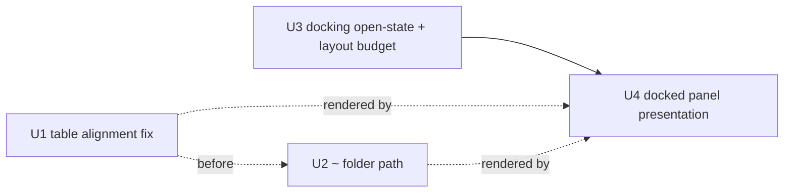

# feat: Resume picker bottom dock and table fixes

## Summary

Rework the `/resume` picker into a compact panel docked at the bottom of the Home screen (keeping the live conversation visible above it) and fix the session table's rendering. The docking mirrors the slash-command menu's bottom-stack pattern; the table fixes are a per-cell alignment repair and a new home-relative `~` folder formatter. The cap reuses the existing windowed-list rendering the model/help pickers already use.

---

## Problem Frame

`/resume` renders as a mutually-exclusive fullscreen surface that hides the conversation the user is deciding whether to leave, and its table is visibly broken: a whitespace-collapsing normalize runs over already-padded columns so nothing lines up, and the folder column shows a raw absolute path that end-truncates away the identifying leaf folder. See origin document for the full pain narrative.

---

## Requirements

- R1. `/resume` renders as a bottom-docked panel over the Home screen, conversation body still visible above (like the slash-command menu).
- R2. A full-width horizontal divider separates the conversation body from the panel.
- R3. The three header lines collapse to a single `Resume Session:` label.
- R4. Table columns align under their headers with padding preserved (remove the whole-row whitespace normalize; keep per-cell truncation).
- R5. The folder column renders home-relative (`~` for the home prefix) and middle-truncates to preserve the tail folder when it exceeds the column width.
- R6. The visible session list is capped at ~10 rows regardless of terminal height.
- R7. When more sessions exist than the cap, the list scrolls within the fixed window, keeping the highlight in view.
- R8. Loading / empty / failed / resuming feedback and the "current draft is not listed" hint survive in the compact panel.
- R9. While open, the panel owns navigation (`↑/↓` move, `enter` resume, `esc` close to conversation); the composer/cwd/status rows collapse to zero (the composer is unmounted, not shown-but-disabled), and `esc` stays live even during loading/resuming.

**Origin acceptance examples:** AE1 (covers R4), AE2 (covers R5), AE3 (covers R5), AE4 (covers R6, R7), AE5 (covers R1, R9)

---

## Scope Boundaries

- No `Type` column and no `All / Local / Remote` tabs (KQode is local-only).
- No new footer actions (search, delete, sort) — keep `↑/↓ · enter · esc`.
- No change to the `kqode.session.list` / `kqode.session.resume` backend contracts or session data shape.
- No change to resume semantics (which turns restore, compaction handling, blocking while a turn is active).
- The other fullscreen surfaces (Help, Login, Model, Memory) stay fullscreen — only `/resume` is converted.

---

## Context & Research

### Relevant Code and Patterns

- `tui/src/components/SlashCommandMenu/index.tsx` — the bottom-dock precedent: reads `safeChromeColumnsAtom`, renders a fixed-height panel with blank-fill rows, budgeted by `commandMenuRowsAtom`. The resume panel joins the same bottom chrome.
- `tui/src/state/ui/commands/atoms.ts` — `commandMenuOpenAtom` (open-state) and `commandMenuDesiredRowsAtom` (clamped desired height): the exact shape to mirror for a `resumePanelOpenAtom` + desired-rows atom.
- `tui/src/state/ui/atoms.ts` + `tui/src/libs/tui/layout.ts` — `cwdRowsAtom` collapses to 0 while the menu is open, `resolveHomeScreenLayout` subtracts bottom-stack rows from the body budget so the composer/status stay pinned. This is where the panel's rows must be budgeted.
- `tui/src/components/ModelSurface/ModelRows.tsx` + `ModelSurface/index.tsx` — windowed-list rendering with an offset/visible/total footer; the established pattern for the ~10-row cap and scroll (also `HelpScreen`).
- `tui/src/libs/resume/formatSessionRows.ts` — the table formatter to fix (R4) and extend (R5). `formatLine()` pads each cell correctly, then `truncate()` runs `text.replace(/\s+/g, ' ')` over the assembled row, collapsing the padding.
- `tui/src/libs/text/displayWidth.ts` — `displayWidth()` / `padEndToWidth()` measure terminal columns (CJK/emoji-aware); fixed-width columns must measure with these, not `.length` / `padEnd`.
- `tui/src/components/PromptComposer/ComposerFrame.tsx` — `ComposerHalfLine` shows the `glyph.repeat(Math.max(1, columns))` full-width rule pattern for the divider (R2).
- `tui/src/components/ResumeSurface/{ResumeRows,useResumeInput,useResumeBackend}.tsx` + `tui/src/state/ui/resume/atoms.ts` — existing table rows, input handling, backend load, and windowing atoms (`resumeVisibleRowsAtom`, `resumeWindowOffsetAtom`, `moveResumeHighlightAtom`) to reuse.
- `tui/src/libs/path/runtimePaths.ts` — path helpers home; currently has no home-relative helper (R5 adds one nearby).

### Institutional Learnings

- `docs/solutions/architecture-patterns/terminal-edge-rendering-tradeoffs-in-the-ink-tui.md` — all panel glyph content (label, rows, divider, hints) must route through `safeChromeColumnsAtom`, not raw `columnsAtom`. A bare full-width `<Text>` rule can drop its last glyph; render the divider as an explicitly-widthed `<Box width={safeChromeColumns}>` so Ink's `alignItems: stretch` does not paint into the reserved final column. Adding rows between body and composer shifts `composerTop` → cursor drift, and there is **no automated test** for live caret placement, so verify manually. Do not touch `FULLSCREEN_GUARD_ROWS` / `INK_CURSOR_ROW_ORIGIN_OFFSET` (guard↔offset lockstep).
- `docs/solutions/architecture-patterns/state-libs-layering-and-cycle-verification-in-the-ink-tui.md` — pure logic lives in `tui/src/libs/**`, never in `state/`; `libs` must never import `@state` (components → state → libs, one-way). Colocate unit tests under `libs/**/__tests__/`. Verify no cycles with the repo's `detect-cycles.mjs` (`madge --circular` gives a false pass here due to path aliases + `.ts` extensions).
- `docs/solutions/workflow-issues/recovering-from-concurrent-agent-session-edits.md` — this rework touches several overlapping TUI files; watch for `git status`/mtime changes from concurrent sessions and re-read shared atoms/types before moving code. (Note: "session" there means editor sessions, not the KQode conversation sessions the picker lists.)

---

## Key Technical Decisions

- **Convert `/resume` to a Home-docked open-state, retiring `Surface.Resume`**: the `Surface` model is mutually-exclusive fullscreen, so keeping the conversation visible requires rendering the panel *inside* Home gated by an open-state atom (mirroring `commandMenuOpenAtom`) rather than as a replacing surface (see origin: docs/brainstorms/2026-07-10-resume-picker-bottom-dock-requirements.md).
- **Home-relative `~` + middle-truncation done TUI-side**: it is a display concern; a pure `libs/` helper keeps the backend session contract untouched (resolves the origin's deferred backend-vs-TUI question).
- **Fix alignment by removing the whole-row normalize, not by switching to tab characters**: preserves fixed-width, terminal-safe rendering; per-cell content is normalized before padding.
- **Measure columns with `displayWidth`/`padEndToWidth`**: fixed-width columns misalign by a column per wide glyph if measured with `.length`.
- **Panel takes over the bottom region while open**: the composer is unmounted and cwd/status collapse to zero rows so the panel (a divider above the label + table + hints) claims the bottom; resume has no text query, so the composer has nothing to receive. Zeroing composer/status needs a resume-open branch in both `resolveHomeScreenLayout` (hardcodes `statusRows = 1`, floors composer rows at 1) and `bottomSpacerRowsAtom` (subtracts composer/status terms) — `cwdRowsAtom` collapse alone is insufficient.
- **Cap is a constant (~10) clamped to free rows**: reuses the windowed-list budget approach; a height fraction would complicate the row math for no product benefit. The ~10 counts session rows only — the `# Summary …` header renders above them and is not one of the capped rows, and the divider is part of the panel's row count (not a separate budget term).

---

## Open Questions

### Resolved During Planning

- Backend-side vs TUI-side `~` formatting: **TUI-side** pure helper.
- ~10-row cap as constant vs height fraction: **constant**, clamped to available rows above a 1-row body.
- Where loading/empty/failed feedback and the current-draft hint live now: **inline beside the `Resume Session:` label**, with the message replacing the table body for loading/empty/failed/resuming states.
- Composer while the panel is open: **unmounted** (not rendered at zero height), so the caret is cleanly released and re-asserted on close.
- `esc` stays live during loading/resuming (handled before `useResumeInput`'s status early-return).
- The ~10 cap counts session rows only; the column header is pinned above them and excluded from the cap.

### Deferred to Implementation

- Exact body-budget formula for the resume-open layout branch (how many rows the panel claims and how the body remainder is computed) — settle against real `resolveHomeScreenLayout` code and short-terminal behavior.
- Path separator normalization for `~` paths across platforms (Windows `\` vs POSIX `/`) — choose once the helper is written against `node:os` homedir output.
- Whether to physically rename `components/ResumeSurface/` to a `ResumePanel/` folder or repurpose in place — cosmetic; decide during U4.
- Whether `esc` pressed mid-resume aborts the in-flight resume or only closes the picker once the resume settles (default: close the picker immediately and let the dispatched resume complete).
- Highlight affordance for the docked rows: keep `ResumeRows`' full-row inverse video, or align to the marker + accent-color style the co-located slash/model menus use.
- Content-priority order when the panel is compressed on very short terminals (e.g. always preserve the label + ≥1 session row; drop hints, then header, then divider last).

---

## High-Level Technical Design

> *This illustrates the intended approach and is directional guidance for review, not implementation specification. The implementing agent should treat it as context, not code to reproduce.*

Layout, before vs after (Home screen bottom stack):

```text
BEFORE ( /resume = fullscreen Surface.Resume, replaces Home )   AFTER ( /resume = docked panel over Home )
┌───────────────────────────────┐                              ┌───────────────────────────────┐
│ /resume                       │                              │ header (product + version)    │
│ Resume a saved local session. │                              │ conversation body (shrunk)    │
│ Local sessions only · …       │                              │ …                             │
│                               │                              │ ─────────────── divider ──────│  <- full-width safe rule (R2)
│ # Summary Status … Folder     │                              │ Resume Session:               │  <- single label (R3)
│ 1. …                          │                              │ # Summary Status … Folder     │
│ (fills whole screen)          │                              │ 1. … (≤10 rows, scrolls) …    │  <- capped window (R6/R7)
│                               │                              │ ↑/↓ choose · enter · esc      │
└───────────────────────────────┘                              └───────────────────────────────┘
                                                                 composer unmounted; cwd/status zeroed while open (R9)
```

Unit dependency graph:



---

## Implementation Units

### U1. Fix session table column alignment

**Goal:** Rows align under their headers; the assembled row is no longer whitespace-collapsed.

**Requirements:** R4 (AE1)

**Dependencies:** None

**Files:**
- Modify: `tui/src/libs/resume/formatSessionRows.ts`
- Create: `tui/src/libs/resume/__tests__/formatSessionRows.test.ts`

**Approach:**
- Normalize/truncate each cell's content *before* padding; drop the `text.replace(/\s+/g, ' ')` collapse from the whole-row path. Final row truncation clips to the safe width without touching interior spaces.
- Measure widths with `displayWidth` / `padEndToWidth` from `libs/text/displayWidth.ts` so wide glyphs and CJK summaries keep columns aligned.

**Patterns to follow:**
- `tui/src/libs/text/displayWidth.ts` (`padEndToWidth`, `displayWidth`); `ComposerFrame.tsx` uses `padEndToWidth` for row fill.

**Test scenarios:**
- Covers AE1. Happy path: three rows of differing summary/folder lengths → each row's Status/Modified/Created/Folder cells start at the same column offset as the header.
- Edge case: a summary longer than its column → truncated with `…`, remaining columns still start at the correct offsets.
- Edge case: a summary containing wide/CJK glyphs → columns align by display width, not code-unit length.
- Edge case: narrow terminal width → row is clipped to the safe width while columns before the clip stay aligned.

**Verification:**
- Header and every row share identical column start offsets; TUI unit tests pass.

---

### U2. Home-relative `~` folder path with tail-preserving middle-truncation

**Goal:** The folder column shows a home-relative path, middle-truncated to keep the identifying tail folder.

**Requirements:** R5 (AE2, AE3)

**Dependencies:** U1 (soft — both modify `formatSessionRows.ts`; sequence after U1 to avoid a merge conflict)

**Files:**
- Create: `tui/src/libs/path/homeRelativePath.ts`
- Create: `tui/src/libs/path/__tests__/homeRelativePath.test.ts`
- Modify: `tui/src/libs/resume/formatSessionRows.ts` (use the helper for the folder cell)
- Modify: `tui/src/components/ResumeSurface/ResumeRows.tsx` (thread `os.homedir()` into the row-formatter call site)

**Approach:**
- Pure helper, no `@state` import: given an absolute path, a home directory, and a max display width, (1) replace a home-directory prefix with `~`, (2) if the result exceeds the width, middle-truncate preserving the tail segment (e.g. `~\...\blog-v0.1`). Display-width-aware via `libs/text/displayWidth.ts`.
- Inject the home directory as an argument for testability; the caller supplies `node:os` `homedir()`. Paths outside the home directory are left absolute (no `~`).
- Threading the home directory into the folder cell changes the `formatResumeRow` call site in `ResumeRows.tsx`; once U2 lands, U1's folder-cell assertions become home-directory-dependent (U1 runs first, so update those assertions here).

**Patterns to follow:**
- `formatSessionRows.ts` param style (widths passed in); `libs/text/displayWidth.ts` measurement; layering rule (pure `libs`, tests colocated).

**Test scenarios:**
- Covers AE2. Happy path: a folder under home + a narrow column → `~\...\<tail>` ending in the leaf folder.
- Covers AE3. Edge case: a folder outside the home directory → no `~`, path shown/truncated as absolute.
- Edge case: folder exactly equal to home → `~`.
- Edge case: a single tail segment wider than the column → tail itself truncated with `…`.
- Edge case: mixed/OS path separators → home prefix matched and rendered with the platform separator.

**Verification:**
- Helper unit tests pass and the row formatter returns `~…`-tail output for the covered cases. (In-panel display of the folder column is verified in U4.)

---

### U3. Convert `/resume` to a Home-docked open-state and budget its rows

**Goal:** Retire `Surface.Resume`; add a resume-panel open-state; rewire `/resume` and both close paths (`esc` + completed resume); budget the panel's rows out of the body; collapse cwd/status to zero and unmount the composer while open.

**Requirements:** R1, R9 (AE5 verified end-to-end in U4); advances R6 budgeting

**Dependencies:** None

**Files:**
- Modify: `tui/src/state/ui/surface/atoms.ts` (remove `Resume` from the `Surface` enum and `openResumeSurfaceAtom`)
- Modify: `tui/src/state/ui/resume/atoms.ts` (add `resumePanelOpenAtom` + a `resumePanelDesiredRowsAtom`; open resets/loads, close clears)
- Modify: `tui/src/state/ui/atoms.ts` (`cwdRowsAtom` collapses to 0 when resume is open; feed panel rows into the body budget; add a resume-open branch to `bottomSpacerRowsAtom` that drops the composer/status terms)
- Modify: `tui/src/libs/tui/layout.ts` (`resolveHomeScreenLayout` resume-open branch: overrides the hardcoded `statusRows`/composer terms so composer/cwd/status contribute 0; `panelRows` already includes the divider; body takes the remainder, ≥1 body row preserved)
- Modify: `tui/src/constants/ui.ts` (add a resume-panel height constant next to `COMMAND_MENU_PANEL_ROWS`)
- Modify: `tui/src/App.tsx` (remove the `Surface.Resume` case; App's `esc` handler no longer fires for resume — it is guarded by `activeSurface !== Home`)
- Modify: `tui/src/components/ResumeSurface/useResumeInput.ts` (add an `esc` branch that clears the open-state, evaluated before the loading/resuming early-return so `esc` always closes)
- Modify: `tui/src/components/ResumeSurface/useResumeBackend.ts` (on a completed resume, clear `resumePanelOpenAtom` instead of calling `closeActiveSurface()`)
- Modify: `tui/src/components/PromptComposer/index.tsx` (the `openResume` command action sets the open-state instead of a surface)
- Modify: `tui/src/state/ui/surface/__tests__/atoms.test.ts` (remove the `openResumeSurfaceAtom` / `Surface.Resume` assertions)
- Create/Modify: `tui/src/state/ui/resume/__tests__/atoms.test.ts` (open/close + budget + completed-resume clears open-state)

**Approach:**
- Add `resumePanelOpenAtom` mirroring `commandMenuOpenAtom`. The `/resume` command action opens it. Wire both close paths explicitly: an `esc` branch in `useResumeInput` clears the open-state (evaluated *before* the loading/resuming early-return so `esc` always backs out), and `useResumeBackend.resumeSelected` clears the open-state on success instead of calling `closeActiveSurface()`. `closeActiveSurfaceAtom` no longer owns resume, and App's `esc` handler (guarded by `activeSurface !== Home`) no longer fires for resume.
- Reuse the same body-budget slot as the slash menu, but note that slot cannot zero composer/status: `resolveHomeScreenLayout` hardcodes `statusRows = 1` and floors composer rows at 1, and `bottomSpacerRowsAtom` subtracts composer/status terms independently. Add an explicit resume-open branch to BOTH so composer and status contribute 0 while open. (The composer itself is unmounted in `HomeScreenView` in U4.)
- Keep the row math centralized in `resolveHomeScreenLayout` / the layout atoms; the exact formula is deferred to implementation (see Open Questions) but must satisfy: `bodyRows = rows − header − panelRows` (`panelRows` already includes the divider, label, header row, session rows, and hints — do not subtract the divider separately), composer/cwd/status = 0 while open, ≥1 body row preserved, total never exceeds the canvas.

**Execution note:** After wiring, manually verify the caret returns to the composer text row when the panel closes — there is no automated cursor-drift test.

**Patterns to follow:**
- `commandMenuOpenAtom` / `commandMenuDesiredRowsAtom` / `commandMenuRowsAtom`; `cwdRowsAtom` collapse; `resolveHomeScreenLayout`.

**Test scenarios:**
- Happy path: invoking the resume command sets the panel open; `esc` clears the open-state.
- Error path: `esc` clears the open-state even while status is loading or resuming (not swallowed by the status early-return).
- Integration: a completed resume clears `resumePanelOpenAtom` (the panel does not stay stuck over the hydrated transcript).
- Integration: while open, the active surface stays `Home` (no separate surface renders) and the conversation body is present.
- Edge case: `layoutAtom.bodyRows` equals `rows − header − panelRows`, with composer/cwd/status contributing 0 while open.
- Edge case: on a short terminal, panel rows clamp so the body keeps ≥1 row and the stack does not overflow.
- Edge case: the retired `Surface.Resume` / `openResumeSurfaceAtom` assertions in `surface/__tests__/atoms.test.ts` are updated to the open-state model and the suite is green.

**Verification:**
- `resumePanelOpenAtom` toggles on `/resume` and clears on `esc`/completed resume; body rows shrink by the budgeted panel height with composer/cwd/status at 0; typecheck, unit tests, and `detect-cycles.mjs` pass. (End-to-end "panel renders over the conversation" is verified in U4.)

---

### U4. Build the docked resume panel presentation

**Goal:** Render the compact panel in Home — divider, single `Resume Session:` label, capped table, hints, relocated state feedback — and retire the fullscreen chrome.

**Requirements:** R2, R3, R6, R7, R8 (AE4, AE5)

**Dependencies:** U3 (open-state + layout budget); renders U1 + U2 output

**Files:**
- Create: `tui/src/components/ResumePanel/index.tsx` (docked panel; may split a small `Divider` helper)
- Modify: `tui/src/components/HomeScreen/HomeScreenView.tsx` (render the panel in the bottom stack when open; unmount the composer and drop cwd/status while open)
- Modify/Retire: `tui/src/components/ResumeSurface/index.tsx` (fullscreen chrome removed; reuse `ResumeRows`, `useResumeInput`, `useResumeBackend`)
- Modify: `tui/src/components/ResumeSurface/ResumeRows.tsx` if needed for the capped/fixed-height window
- Modify: `tui/src/components/ResumeSurface/__tests__/ResumeSurface.test.tsx` → panel render/interaction tests
- Modify: `tui/src/App.tsx` only if the retired surface leaves dead references

**Approach:**
- Panel top→bottom: full-width divider (`<Box width={safeChromeColumns}><Text>{'─'.repeat(safeChromeColumns)}</Text></Box>`), `Resume Session:` label (with inline current-draft hint / status text), a pinned `# Summary …` header row, then up to 10 session rows via `ResumeRows`, and footer hints `↑/↓ choose · enter resume · esc close`. Everything routes through `safeChromeColumnsAtom`.
- Cap and windowing: the ~10 counts session rows; render the header pinned above them (so `ResumeRows` height = visible session count + 1) and keep `moveResumeHighlightAtom`'s `visible` count equal to the rendered session count — otherwise the reused windowing fetches one more session than it renders and the highlighted row scrolls off at the bottom boundary (R7/AE4). Feed `resumeVisibleRowsAtom` from `min(10, panel budget)`.
- Scroll affordance: when sessions exceed the window, show a position indicator (more-above / more-below), mirroring `ModelSurface`'s footer, so the ~10 cap does not silently hide sessions.
- State feedback (R8): loading / empty / failed / resuming replace the table body with the message; the "current draft is not listed" hint sits by the label (today's `hiddenCurrentDraft`).
- HomeScreenView: when open, render `[Header][Body][divider + ResumePanel]` bottom-pinned, unmount the composer, and drop cwd/status. Retire the `ResumeSurface` fullscreen render path.

**Patterns to follow:**
- `SlashCommandMenu/index.tsx` (docked fixed-height panel, `safeChromeColumns`, blank-fill); `ModelSurface/ModelRows.tsx` (windowed list); `ComposerFrame` `ComposerHalfLine` (full-width glyph rule); existing `ResumeRows`.

**Test scenarios:**
- Covers AE4/R7. Cap/scroll: 15 sessions → ≤10 session rows visible under the pinned header; navigating past the last visible row scrolls the window and the highlighted row stays on-screen at the boundary (no off-by-one drop).
- Covers AE5. Interaction: with an active conversation, opening `/resume` keeps the body visible above the divider; `esc` closes the panel and the composer is active again.
- Happy path: panel shows `Resume Session:`, a full-width divider, a pinned header, aligned rows, and the hints row.
- Edge case: a more-below indicator shows when sessions are hidden below the window (and more-above when scrolled down).
- Edge case: empty / failed / loading states render their message in the panel and the current-draft hint shows when applicable.
- Edge case: the divider spans the full safe width with no dropped last glyph.

**Verification:**
- Panel matches the reference shape (origin image 2); caret returns to the composer after `esc` (manual); typecheck and unit tests pass.

---

## System-Wide Impact

- **Interaction graph:** `Surface` enum consumers (App switch, `openResumeSurfaceAtom`), the composer command-action wiring, composer input gating, and the layout atoms (`cwdRowsAtom`, `resolveHomeScreenLayout`, `bottomSpacerRowsAtom`) are all touched by U3.
- **Error propagation:** backend load failures continue to surface through `setResumeFailureAtom` → the panel's failed-state message (R8); no change to the error path shape.
- **State lifecycle risks:** ensure the panel resets/refreshes sessions on open and clears open-state on close/resume; avoid leaving `resumePanelOpenAtom` true after a resume completes.
- **Residual input:** `HomeScreen`'s `useInput` (pageUp/pageDown/end, mouse wheel) stays mounted while the panel is open, so those keys still scroll the conversation body — intended (the panel owns arrows/enter/esc; body scroll stays available), but confirm no conflict.
- **API surface parity:** Help, Login, Model, and Memory remain fullscreen surfaces — only resume is converted; do not generalize the change to them.
- **Unchanged invariants:** the `kqode.session.*` backend contracts, resume semantics, the safe-width rendering policy, and the `FULLSCREEN_GUARD_ROWS`↔`INK_CURSOR_ROW_ORIGIN_OFFSET` lockstep are explicitly unchanged.

---

## Risks & Dependencies

| Risk | Mitigation |
|------|------------|
| Cursor drifts off the composer row after docking rows change `composerTop` | No automated test exists; manually verify caret placement on open and after `esc`; leave the guard↔offset pair untouched. |
| Bottom stack overflows / composer pushed off-screen on short terminals | Clamp panel rows to free space, preserve ≥1 body row, keep the math in `resolveHomeScreenLayout`. |
| Divider or rows clip the last glyph or paint the reserved column | Route all panel glyphs through `safeChromeColumnsAtom`; render the divider as an explicitly-widthed `<Box>`. |
| New `libs` helper introduces an import cycle | Keep helpers pure (no `@state` import); verify with `detect-cycles.mjs`, not `madge`. |
| Wide/CJK glyphs misalign fixed-width columns | Measure with `displayWidth` / `padEndToWidth`. |
| Concurrent agent-session edits to overlapping TUI files | Re-read shared atoms/types before moving code; watch `git status`/mtime. |
| Close paths (`esc`, completed resume) left unwired → panel stuck open | Wire `esc` in `useResumeInput` and open-state clear in `useResumeBackend`; test that a completed resume clears the state. |
| Reused windowing double-counts the header → highlight scrolls off at the boundary | Render the header above the cap; keep `moveResumeHighlight`'s `visible` equal to the rendered session count. |

---

## Sources & References

- **Origin document:** [docs/brainstorms/2026-07-10-resume-picker-bottom-dock-requirements.md](docs/brainstorms/2026-07-10-resume-picker-bottom-dock-requirements.md)
- Related code: `tui/src/components/SlashCommandMenu/index.tsx`, `tui/src/libs/resume/formatSessionRows.ts`, `tui/src/libs/tui/layout.ts`, `tui/src/state/ui/atoms.ts`, `tui/src/components/ModelSurface/ModelRows.tsx`
- Learnings: `docs/solutions/architecture-patterns/terminal-edge-rendering-tradeoffs-in-the-ink-tui.md`, `docs/solutions/architecture-patterns/state-libs-layering-and-cycle-verification-in-the-ink-tui.md`
