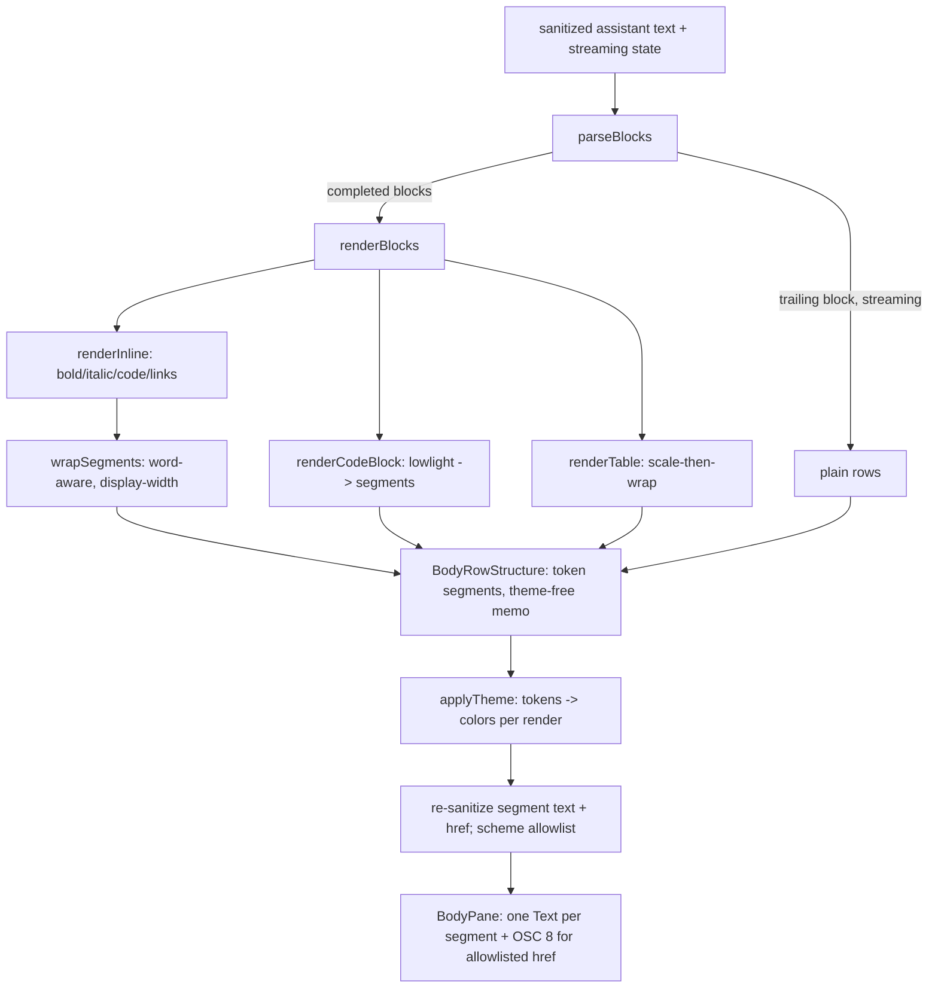

# feat: Render markdown in the TUI transcript

## Summary

Render assistant transcript output as formatted terminal text (headings, emphasis, inline code, lists, blockquotes, rules, syntax-highlighted fenced code blocks, GFM tables, OSC 8 links) instead of raw markdown. The approach plugs markdown parsing into the existing assistant-row path (`toAssistantRows` inside `resolveBodyRows`), evolves `BodyRow` to carry styled segments, and reuses the transcript's existing scroll/width/streaming machinery — mapping parsed tokens to Ink `<Text>` style props (never ANSI). Full Rich set ships in one plan.

---

## Problem Frame

The assistant transcript prints raw markdown source — literal `**bold**`, backtick code fences, `#` headings, `- ` list markers — making markdown-heavy agent replies hard to scan (see the Bayes'-theorem example in origin). The render path (`tui/src/libs/tui/bodyRows.ts`) character-wraps the raw string and paints it one foreground color per row with zero markdown awareness. See origin for the full pain narrative and constraints (ANSI-stripping sanitizer, one-color-per-row model, reserved final column, token streaming).

---

## Requirements

**Rendering scope**
- R1. Assistant output renders markdown for streaming, settled, and resume-hydrated entries.
- R2. Only assistant output is rendered; user/error/system/muted entries stay plain.

**Elements**
- R3. Block elements: headings, unordered/ordered lists, blockquotes, horizontal rules, paragraphs (hard breaks preserved).
- R4. Inline elements: bold, italic, bold-italic, inline code; styles compose; markers hidden.
- R5. Nested lists indent by depth.
- R6. Fenced/indented code blocks render set-off, exact content, no prose word-wrap.
- R7. Code blocks are syntax-highlighted by language; token classes map to theme colors.
- R8. Inline code is visually distinct; no backticks shown.
- R9. GFM tables render aligned bordered columns honoring alignment markers.
- R10. Over-wide tables scale-then-wrap rather than truncate or overflow the reserved column.
- R11. Links render styled; clickable via OSC 8 where supported, else `text (url)`.

**Streaming & integration**
- R12. Completed blocks format as they close; the trailing in-progress block stays plain until it closes.
- R13. An unclosed code fence renders as code-in-progress and finalizes on close/settle.
- R14. Only the active entry re-renders per token; committed blocks/entries do not flicker.
- R15. Parse after sanitization; emit structured styled text, never re-inject ANSI.
- R16. Respect the safe content width and the row-count model (scroll/scrollbar/resize/reserved column).
- R17. Copy-last-response yields raw markdown source, not rendered text.

**Security (plan-derived — see Key Technical Decisions)**
- R18. Re-sanitize rendered output at the render boundary: strip terminal-control bytes from every rendered segment's `text` and from link `href` before `BodyPane` writes them, because CommonMark decodes character references (e.g. `&#x1b;` → ESC) *after* the pre-parse sanitize, which can re-introduce raw control bytes.
- R19. Allowlist URL schemes (`http`, `https`, `mailto`) for OSC 8 hyperlinking; render other schemes (`javascript:`, `file:`, `data:`, …) as non-clickable `label (url)` so the true destination is visible.
- R20. Bound untrusted-parser cost: cap per-code-block size before highlighting (render oversized blocks plain) so a crafted block cannot hang the synchronous highlighter on the render loop.

**Origin actors:** A1 (TUI user), A2 (backend agent stream), A3 (TUI markdown renderer)
**Origin flows:** F1 (live streaming render), F2 (resume render)
**Origin acceptance examples:** AE1 (covers R12, R14), AE2 (covers R13), AE3 (covers R9, R10), AE4 (covers R11), AE5 (covers R2)

Advances product requirement **R64** (`docs/features/r064_syntax_highlighted_markdown_code_diffs_and_tool_output.md`) for the markdown + code-highlighting slice; diffs and tool-output rendering remain future work.

---

## Scope Boundaries

- Only assistant entries render markdown; user/error/system/muted entries unchanged (R2).
- Non-transcript surfaces (composer, login, model, memory, resume picker, help, slash menu) out of scope.
- Render-only: no markdown authoring/editing.
- Out for v1: GFM task-list checkboxes, footnotes, definition lists, raw-HTML passthrough, math/LaTeX.
- Image markdown is not rendered (terminals can't display rasters); at most alt text / link.
- Runtime theme switching and per-language highlight *themes* beyond mapping to the active theme.

### Deferred to Follow-Up Work

- Diff and tool-output syntax highlighting (rest of R64): separate plan/PR.
- Markdown in error/system entries, if ever needed: revisits R2 in a separate change.
- Code-language auto-detection for unlabeled fences: possible future enhancement (see Key Technical Decisions).

---

## Context & Research

### Relevant Code and Patterns

- `tui/src/libs/tui/bodyRows.ts` — `resolveBodyRows(entries, columns, visibleRows, theme)` → `structuralBodyRows` (theme-free, color *tokens*) mapped through `applyTheme(row, theme)`; `BodyRowStructure`/`BodyRow` types; `toAssistantRows`; per-entry×width `WeakMap` memo of structures. **Integration point.**
- `tui/src/components/BodyPane.tsx` — the *only* renderer; three `<Text>` per row (marker, content, scrollbar); `padEnd`-based padding.
- `tui/src/libs/text/displayWidth.ts` — `displayWidth`, `measureGraphemes`, `padEndToWidth` (grapheme/CJK/emoji aware). Canonical width util; `string-width` already a dep.
- `tui/src/libs/composer/wrapPromptText.ts` — display-width char wrapper (grapheme loop + width budget + source ranges) to model the new word-aware wrapper on.
- `tui/src/components/AppExitSummary/border.ts`, `formatExitSummaryCard.ts`, `tui/src/libs/text/maxWidth.ts` — box borders with a pluggable width measure (template for code-block/table borders).
- `tui/src/libs/text/sanitizeDisplayText.ts` — sanitize boundary; parse the already-sanitized text.
- `tui/src/libs/promptQueue/promptQueue.ts` (`buildItemEntries`), `transcriptReducer.ts` (`appendDelta`), `streamCoalescer.ts` — streaming feed, entry memo, delta rate-cap.
- `tui/src/state/ui/dimensions.ts` (`safeChromeColumnsAtom`, `columnsTestOverrideAtom`/`rowsTestOverrideAtom`), `tui/src/state/ui/atoms.ts` (`layoutAtom`, `maxBodyScrollOffsetRowsAtom` — the only `countBodyRows` consumers), `tui/src/libs/tui/safeCanvas.ts`.
- `tui/src/theme/themeTypes.ts` / `themeCatalog.ts` — `ThemeColors` (11 tokens; default Dracula; ~6 usable accents). `tui/src/state/global/theme.ts` — `activeThemeAtom`/`applyThemeAtom` (runtime `/theme` switching is live; `BodyPane` reads `activeThemeAtom`).
- Test patterns: `tui/src/libs/tui/__tests__/bodyRows.test.ts` (rows + memo identity), `tui/src/libs/text/__tests__/displayWidth.test.ts` (CJK/emoji), `tui/src/components/SlashCommandMenu/__tests__/SlashCommandMenu.test.tsx` + `tui/src/test/renderWithJotai.tsx` (frame assertions).

### Institutional Learnings

- `docs/solutions/architecture-patterns/terminal-edge-rendering-tradeoffs-in-the-ink-tui.md` — route *every* glyph row through the safe content width; only a background `<Box width={columns} backgroundColor>` may touch the physical last cell. Applies per-line to wrapped prose, code-block backgrounds, and table borders.
- `docs/solutions/architecture-patterns/state-libs-layering-and-cycle-verification-in-the-ink-tui.md` — the renderer belongs in `tui/src/libs/`; `libs` must not import `@state`; verify cycles with the committed custom detector, not `madge`.
- `docs/solutions/architecture-patterns/backend-process-lifecycle-ownership-in-the-ink-tui.md` — test streaming behavior with an injected fake `BackendClient`, not a real process.
- `docs/solutions/workflow-issues/recovering-from-concurrent-agent-session-edits.md` — re-read shared `BodyEntry`/`BodyRow` types before editing (concurrent sessions have renamed transcript types mid-refactor).

### External References

*(from the brainstorm's web research — carried forward; no new external research)*
- **Gemini CLI** (`google-gemini/gemini-cli`) — closest analog: Ink + streaming markdown via a custom parser, `lowlight` → nested `<Text color>` for code, a hand-written `TableRenderer` (scale-then-wrap), `<Static>` + `React.memo` for streaming.
- **lowlight / highlight.js** — hast-tree highlighting mapped to `<Text>` props (structured, not ANSI).
- **terminal-link** — OSC 8 escape + `text (url)` fallback + `supportsHyperlinks`.
- **Codex CLI / glamour** — block-level highlighting and ANSI renderers (context only; ANSI path is neutralized by KQode's sanitizer).

---

## Key Technical Decisions

- **Plug markdown into `toAssistantRows` inside the theme-free `structuralBodyRows` path, not `BodyPane`.** Inherits the scrollbar re-wrap (`columns-1`), the one-row-per-visual-row count invariant, and the streaming memo automatically. **Critical (corrected from stale research):** `bodyRows.ts` already stores rows as a **theme-free `BodyRowStructure`** carrying color *tokens* (`ThemeColorToken = keyof ThemeColors`), memoized per entry×width, and `resolveBodyRows(entries, columns, visibleRows, theme)` maps each structure through `applyTheme(row, theme)` per render. Runtime `/theme` switching **has already landed** (`activeThemeAtom`/`applyThemeAtom`, `ThemeSurface`), so markdown rows MUST stay token-based in the structural memo — resolved colors in the cache would serve stale colors after a theme switch.
- **`StyledSegment` carries color TOKENS, not resolved colors.** Shape: `{ text; colorToken?: keyof ThemeColors; backgroundColorToken?: keyof ThemeColors; bold?; italic?; underline?; dimColor?; href? }`. `parseBlocks`/`renderInline`/`renderCodeBlock`/`renderTable` all emit token-based segments inside the theme-free memo (so `countBodyRows` stays theme-free and correct); `applyTheme` is extended to **walk `segments`** and resolve each `colorToken`→color per render, mirroring how it resolves the top-level `colorToken` today. `BodyPane` renders the already-resolved segment colors.
- **Structured segments + Ink `<Text>` props, never ANSI.** `sanitizeDisplayText` rewrites ANSI to `\xNN`; the only render-layer escape is OSC 8, emitted after re-sanitization (see next).
- **Re-sanitize rendered output; do not trust post-parse data (R18/R19).** The pre-parse `sanitizeDisplayText` does **not** cover parser-decoded character references — CommonMark decodes `&#x1b;`/`&#7;` inside inline text, table cells, and link destinations *after* the boundary. So: (a) strip control bytes from every rendered `StyledSegment.text` and from `href` immediately before `BodyPane` writes them; (b) for OSC 8, allowlist schemes (`http`/`https`/`mailto`) and percent-encode/reject non-printables in the URL so it cannot contain a string terminator; non-allowlisted schemes degrade to plain `label (url)`. "Trusted render layer" means trusted *code*, not trusted *data*.
- **Bound untrusted-parser cost (R20).** `marked`/`highlight.js` parse untrusted model output synchronously on Ink's render loop and `highlight.js` has a ReDoS history; the fail-safe catches thrown errors, not non-termination. Cap per-code-block size before highlighting (oversized → plain), register a curated `lowlight` language set (not the full pack) to keep the Bun-compiled binary lean, and `bun audit` the new deps.
- **Map highlight token classes onto existing `ThemeColors` accents** via a static class→token map — consistent across all 6 themes, no theme expansion. *(User-confirmed.)*
- **Highlight only when a fence names a known language; plain fallback, no auto-detection in v1.** Determinism over polish. *(User-confirmed.)*
- **Add libraries (`marked` lexer, `lowlight` + `highlight.js`, `terminal-link`)** rather than hand-rolling — proven, maintained, matches the Gemini CLI stack.
- **Reuse `displayWidth`/`measureGraphemes` for all width math; build a new word-aware wrapper** (none exists) modeled on `wrapPromptText.ts`. **Scope `padEndToWidth` to segment (markdown) rows only; keep the existing `padEnd` for legacy single-color rows** so non-assistant CJK/emoji rows are not silently re-padded (preserves R2 "only assistant rows change").
- **Thread the assistant content width (`columns - ASSISTANT_MESSAGE_PREFIX.length`) into the block renderers.** Code-block backgrounds, table columns, and borders size to that reduced width (and inherit the `columns-1` scrollbar re-fit), so the `• ` marker + content never sum past the safe width and desync `countBodyRows`.
- **Derive streaming state from the entry, not a new `BodyEntry` field.** The in-flight entry is already a distinct `stream-${id}` (settle mints a different `result-${id}`); pass a `streaming` param into `computeBodyRows`/`toAssistantRows` derived from that identity rather than adding a mutable `BodyEntry.streaming` flag — avoids widening the concurrency-hazardous shared type and keeps the memo key honest.
- **Intra-message no-flicker is Ink reconciliation, not the memo.** The memo only spares *other* entries; the active streaming entry is a fresh identity every delta and recomputes. Earlier already-formatted blocks stay stable because `BodyPane` re-renders equal row content that Ink reconciles without repaint — plus a **content-keyed cache for highlighted completed blocks** (keyed by block text + language) so `lowlight` does not re-run over every committed block each delta.
- **Parsing fails safe to plain text** — any parser error renders the raw (sanitized) text; and any block type without a renderer yet (code/table before U4/U5) renders as **plain in-place rows**, not a whole-message fallback, so every unit is a net improvement.

---

## Open Questions

### Resolved During Planning

- **Theme handling:** segments carry color *tokens*; `applyTheme` walks segments and resolves per render; the memo/count path stays theme-free. (Corrects the stale "theme is static" assumption — runtime `/theme` switching is already live.)
- Syntax-highlight palette: map onto existing accents (user-confirmed).
- Language detection: hint-only, plain fallback (user-confirmed).
- **Output re-sanitization + URL scheme allowlist:** required regardless of which parser is chosen, since CommonMark decodes character references after the pre-parse sanitize (R18/R19).
- Heading levels: commit a per-level scheme within terminal limits (see U3) so R3 "each level distinct" holds.
- Code-block set-off: full-width background-fill using `messageBackground` (no border); box borders are reserved for tables (see U4/U5).
- `padEndToWidth` scope: segment rows only; legacy rows keep `padEnd`.
- Streaming state: derived from the `stream-`/`result-` entry identity, not a new `BodyEntry` field.
- Nested-list indent: fixed 2 columns/level, clamped to keep a minimum content width (see U3).
- Renderer location: new `tui/src/libs/markdown/` folder, files < ~200 lines, colocated `__tests__/`.
- Parser: `marked` lexer for block/inline tokens (`markdown-it` is an acceptable equivalent).

### Deferred to Implementation

- Exact highlight.js token-class → accent mapping table (tune against real highlighter output).
- **OSC 8 through Ink `<Text>`:** confirm Ink `^7.1.0` measures an OSC-8-wrapped `<Text>` at label width and keeps it on one visual row before enabling the raw-escape path; **default to the `label (url)` form until verified** (a miscount would wrap the row to two terminal lines and desync `countBodyRows`). [Needs verification]
- Code-line overflow handling (grapheme-wrap at content width vs clip) — confirm visually.
- Table min-column-width value and proportional-scaling thresholds — tune at implementation.
- Per-code-block size cap value and whether a highlight timeout guard is needed (R20) — measure against real replies.
- `supportsHyperlinks` capability-detection source and caching, and behavior in resume/non-TTY contexts.
- HTML passthrough: render `marked` `html` tokens as literal text (fail-safe) vs drop — pin behavior (HTML is deferred in Scope Boundaries).
- Highlight token collisions (e.g. keyword and number both → `warning`) — accept as low-fidelity or refine; confirm visually.
- Table row-count stability across the `columns` ↔ `columns-1` scrollbar re-fit toggle — verify no scrollbar-appearance oscillation (U5 integration test).

---

## High-Level Technical Design

> *This illustrates the intended approach and is directional guidance for review, not implementation specification. The implementing agent should treat it as context, not code to reproduce.*

Row model gains inline styles as a *theme-free structural* segment (color tokens, not resolved colors), one `<Text>` per segment, still exactly one visual terminal row. `applyTheme` resolves tokens per render:

```
StyledSegment(structural): { text; colorToken?: keyof ThemeColors; backgroundColorToken?: keyof ThemeColors; bold?; italic?; underline?; dimColor?; href? }
BodyRowStructure:          { ...existing token fields; segments?: StyledSegment[] }   // memoized theme-free
  --applyTheme(theme)-->   BodyRow with resolved colors (rendered by BodyPane)
```

Pipeline (all inside the existing `resolveBodyRows` → `toAssistantRows` path):



Streaming block-commit: split the buffer into blocks; render all but the last as markdown; render the trailing (unterminated) block plain (an open code fence renders as code-in-progress). On settle, all blocks are complete and fully format. **No-flicker (R14) mechanism:** the per-entry `WeakMap` memo spares *other* (committed) entries; the active streaming entry is a fresh identity every delta and recomputes. Earlier already-formatted blocks within the streaming message stay stable because `BodyPane` re-emits equal row content that Ink reconciles without repaint — backed by a content-keyed cache of highlighted completed blocks (keyed by block text + language) so `lowlight` does not re-run over committed blocks each delta.

---

## Implementation Units

### U1. Styled-segment row model + BodyPane segment rendering

**Goal:** Add theme-free token-based styled segments to `BodyRowStructure` and render them, with all existing behavior preserved (assistant text still renders as one foreground-token segment; non-assistant rows byte-for-byte unchanged). Extend `applyTheme` to resolve segment tokens. Re-sanitize segment text at the render boundary.

**Requirements:** R1, R2, R4, R15, R16, R17, R18

**Dependencies:** None

**Files:**
- Create: `tui/src/libs/markdown/types.ts` (`StyledSegment` with color *tokens*)
- Modify: `tui/src/libs/tui/bodyRows.ts` (`segments?: StyledSegment[]` on `BodyRowStructure` and resolved `BodyRow`; `applyTheme` walks `segments` resolving `colorToken`/`backgroundColorToken`; `toAssistantRows` emits a single token-segment row for now)
- Modify: `tui/src/components/BodyPane.tsx` (render `row.segments` as multiple `<Text>`; re-sanitize each segment's `text`; pad segment rows via `padEndToWidth`, legacy rows keep `padEnd`)
- Modify: `tui/src/libs/tui/__tests__/bodyRows.test.ts` (read segment/plain-text projection; keep memo-identity + theme-switch assertions)
- Create: `tui/src/components/__tests__/BodyPane.test.tsx`

**Approach:**
- `StyledSegment = { text; colorToken?: keyof ThemeColors; backgroundColorToken?: keyof ThemeColors; bold?; italic?; underline?; dimColor?; href? }` — **tokens, not resolved colors**, so segments live in the theme-free structural memo and survive theme switches.
- `applyTheme(row, theme)` resolves `row.segments[*].colorToken`→color (mirroring the existing top-level `colorToken` resolution), producing render-ready `BodyRow.segments`.
- `BodyPane`: when `segments` present, map each to its own `<Text>` (applying `bold`/`italic`/`underline`/`dimColor`), and **re-sanitize each segment's `text`** (strip control bytes) before writing — CommonMark can decode `&#x1b;` past the pre-parse sanitize (R18). When absent, keep the single `<Text color={row.color}>` path.
- Pad **segment rows** to width by summing segment display widths and using `padEndToWidth`; **legacy single-color rows keep `padEnd`** so non-assistant CJK/emoji rows are untouched (R2).
- Preserve `marker`/`markerColorToken`/`fillColumns`/`backgroundColorToken` and the scrollbar column; keep the `bodyRowsByEntry` structural memo.
- **R17 (copy = raw source):** verify `lastAssistantResponse` still reads stored entry text, not rendered segments — add a regression test.

**Patterns to follow:** existing `BodyPane` three-`<Text>` row structure; `applyTheme`/`BodyRowStructure` token pattern in `tui/src/libs/tui/bodyRows.ts`; `tui/src/libs/text/{displayWidth,sanitizeDisplayText}.ts`; `tui/src/test/renderWithJotai.tsx` with `columnsTestOverrideAtom`.

**Test scenarios:**
- Happy: a row with `[plain, bold]` token segments renders both on one line; visible line equals concatenated text; bold segment resolves via the active theme.
- Happy (theme switch): switching `activeThemeAtom` re-resolves segment colors from the cached structure (no stale colors), and `countBodyRows` is unchanged across the switch.
- Happy: a non-assistant single-color row renders identically to before, including a wide/CJK non-assistant row (legacy `padEnd` path unchanged) — R2 regression.
- Edge: a wide/CJK segment row pads to the correct display column; line display width ≤ safe width (no last-column drop).
- Error path (R18): a segment whose text contains a decoded ESC/BEL (`\u001b`, `\u0007`) is stripped before reaching `lastFrame()`.
- Integration (R17): copy-last-response returns the stored raw markdown source, not the rendered segment text.

**Verification:** updated `bodyRows` tests pass; multi-segment rows render and re-resolve on theme switch; non-assistant rows unchanged; control bytes never reach the frame; `cargo xtask tui-typecheck` clean.

---

### U2. Word-aware, display-width segment wrapper

**Goal:** Lay out a logical line of styled segments into visual rows at a content width, breaking at whitespace when possible, hard-splitting over-long words, and preserving per-segment styles across breaks — using grapheme/CJK-aware measurement.

**Requirements:** R3, R4, R16

**Dependencies:** U1

**Files:**
- Create: `tui/src/libs/markdown/wrapSegments.ts`
- Create: `tui/src/libs/markdown/__tests__/wrapSegments.test.ts`

**Approach:**
- Input `StyledSegment[]` + `columns`; output `StyledSegment[][]` (one inner array per visual row).
- Tokenize into words/whitespace; accumulate until display width would exceed `columns`, break at the last whitespace; hard-split words longer than `columns` at grapheme boundaries; carry each word's originating style.
- Build on `measureGraphemes`/`displayWidth`; model the width-budget loop on `wrapPromptText.ts`, adding whitespace-boundary breaking.

**Patterns to follow:** `tui/src/libs/composer/wrapPromptText.ts`; `tui/src/libs/text/displayWidth.ts`.

**Test scenarios:**
- Happy: a plain segment wraps at word boundaries (no mid-word break when a space is available).
- Happy: a bold word wrapped to a new row stays bold.
- Edge: a word longer than `columns` hard-splits at grapheme boundaries; every row width ≤ `columns`.
- Edge: CJK/wide chars counted as 2 columns; row display width ≤ `columns`.
- Edge: empty and whitespace-only input produce sensible rows without crashing.

**Verification:** no output row exceeds `columns` display width; styles preserved across breaks; unit tests pass.

---

### U3. Block + inline markdown rendering

**Goal:** Parse sanitized assistant text into blocks and inline styles, producing styled rows for headings, emphasis, inline code, lists, blockquotes, rules, and paragraphs, wired into `toAssistantRows`.

**Requirements:** R1, R3, R4, R5, R8, R15

**Dependencies:** U1, U2

**Files:**
- Create: `tui/src/libs/markdown/parseBlocks.ts` (typed block segmentation; code/table blocks handed to U4/U5)
- Create: `tui/src/libs/markdown/renderInline.ts` (emphasis/strong/codespan → token `StyledSegment[]`; links in U6)
- Create: `tui/src/libs/markdown/renderBlocks.ts` (block → token `BodyRowStructure[]` via `wrapSegments`)
- Modify: `tui/src/libs/tui/bodyRows.ts` (`toAssistantRows` calls the markdown renderer; wrap in fail-safe fallback to plain text)
- Modify: `tui/package.json` + `tui/bun.lock` (add `marked`)
- Create: `tui/src/libs/markdown/__tests__/{renderInline,parseBlocks,renderBlocks}.test.ts`
- Modify: `tui/src/libs/tui/__tests__/bodyRows.test.ts` (assistant rows now reflect markdown)

**Approach:**
- Use `marked`'s lexer for block/inline tokens. All segments are **token-based** (`colorToken`), never resolved colors. Inline: `strong`→bold, `em`→italic, nested→bold-italic, `codespan`→`colorToken`/`backgroundColorToken: 'messageBackground'`, markers hidden.
- **Headings differentiated per level** (R3, terminal-limited): H1 = bold `accentBlue` + a full-width underline rule row; H2 = bold `accentBlue`; H3 = bold `foreground`; H4–H6 = bold `muted`. Commit this scheme so all levels are distinguishable.
- Unordered lists: bullet glyph; ordered: `N.`; **nested lists indent 2 columns per level, clamped so a minimum content width (≈20 cols) always remains** (deeper indents collapse at the floor) to avoid narrow-width slivers. Blockquote: left marker (`border` token) + `muted`; `hr`: rule glyph across the content width (background-safe row).
- **Thread content width** = `columns - ASSISTANT_MESSAGE_PREFIX.length` into `renderBlocks`; keep the existing `• ` marker + continuation indent; everything wraps via U2 and re-fits at `columns-1` when scrollable (inherited from `resolveBodyRows`).
- **Interim for not-yet-supported blocks:** `parseBlocks` classifies code/table blocks, but until U4/U5 land `renderBlocks` renders them as **plain in-place rows** (not a whole-message fallback) so U3 is a strict improvement even on code/table-bearing replies.
- Parsing wrapped in try/fallback: on any error, emit the current plain-wrapped rows.

**Patterns to follow:** existing `toAssistantRows`/`applyTheme` in `tui/src/libs/tui/bodyRows.ts`; `marked` lexer token stream.

**Test scenarios:**
- Happy: `**bold**`, `*italic*`, `***both***`, `` `code` `` → styled token segments, markers removed.
- Happy: H1–H6 render with visibly distinct treatments per the scheme (assert differing token/bold/underline), no `#` shown.
- Happy: unordered/ordered lists render bullets/numbers with indent; nested lists indent 2 cols/level (R5).
- Edge: at narrow width, deep nesting clamps to the minimum content floor instead of producing 1–2-column slivers.
- Happy: blockquote renders quote marker + muted; `---` renders a rule spanning content width.
- Edge: inline code inside a heading and bold inside a list item compose (R4).
- Interim: a code block or table under U3-only renders as plain in-place rows (heading/list formatting around it is preserved; not the whole message dropped).
- Error path: malformed markdown (e.g., a lone `*`) renders as plain text (fail-safe), no crash.

**Verification:** Bayes-style input renders differentiated headings + clean lists with no literal `**`/`#`; code/table blocks degrade to plain in-place; unit + `bodyRows` tests pass.

---

### U4. Fenced code blocks + syntax highlighting

**Goal:** Render fenced/indented code blocks as visually set-off, syntax-highlighted blocks (theme-token mapped), preserving code exactly, without prose word-wrap, with untrusted-input cost bounded.

**Requirements:** R6, R7, R15, R20

**Dependencies:** U1, U3

**Files:**
- Create: `tui/src/libs/markdown/highlightCode.ts` (lowlight hast → token `StyledSegment[]` per line; content-keyed memo of highlighted blocks)
- Create: `tui/src/libs/markdown/highlightTheme.ts` (hljs class → `keyof ThemeColors` token map)
- Create: `tui/src/libs/markdown/renderCodeBlock.ts` (code lines → set-off token `BodyRowStructure[]`)
- Modify: `tui/src/libs/markdown/renderBlocks.ts` (dispatch code-fence blocks)
- Modify: `tui/package.json` + `tui/bun.lock` (add `lowlight`, `highlight.js`; register a curated language set, not the full pack)
- Create: `tui/src/libs/markdown/__tests__/{highlightCode,renderCodeBlock}.test.ts`

**Approach:**
- Walk lowlight's hast tree into token `StyledSegment[]` per line, mapping the hljs class to a `ThemeColorToken` (keyword→`warning`, string→`accentGreen`, comment→`muted`, title/function→`accentBlue`, number→`warning`, default→`foreground`).
- Language: `lowlight.highlight(lang, code)` when the fence names a known language; otherwise render plain `foreground` code (no auto-detect).
- **Set-off treatment (committed):** full-width **background-fill rows using the `messageBackground` token, no border** (box borders are reserved for tables — U5); this avoids extra border-column width math. Long code lines wrap at content width by grapheme (no horizontal scroll), preserving highlight tokens.
- **Size all code rows to content width** = `columns - ASSISTANT_MESSAGE_PREFIX.length` (and inherit the `columns-1` scrollbar re-fit), so the marker + code never exceed the safe width.
- **Bound untrusted cost (R20):** cap per-code-block character count before calling the highlighter; render oversized blocks plain. Memoize highlighted output by `(block text + language)` so the streaming path (U7) reuses completed-block renders instead of re-running lowlight each delta.

**Patterns to follow:** `tui/src/components/AppExitSummary/border.ts`; the safe-width edge-rendering learning; the `bodyRowsByEntry` memo shape for the block cache.

**Test scenarios:**
- Happy: a ```` ```js ```` block highlights keywords/strings/comments into distinct tokens; colors resolve via the active theme.
- Happy: unlabeled/unknown-language fence renders plain, background-filled, content/whitespace preserved exactly.
- Edge: a code line longer than content width grapheme-wraps without last-column drop; every row's display width (marker + code) ≤ content width.
- Edge (R20): a block exceeding the size cap renders plain (highlighter not called); an empty block and a language-tag-only fence render without crashing.
- Integration: a code block between prose blocks keeps `countBodyRows` consistent for a width; the block cache returns identical output for repeated `(text, lang)`.

**Verification:** code blocks visually distinct (background-fill) and colored; content exact; no last-column drop; oversized blocks bounded; tests pass.

---

### U5. GFM tables

**Goal:** Render GFM tables as aligned, bordered columns that fit the safe content width via scale-then-wrap, honoring column alignment.

**Requirements:** R9, R10, R16

**Dependencies:** U1, U2, U3

**Files:**
- Create: `tui/src/libs/markdown/renderTable.ts`
- Modify: `tui/src/libs/markdown/renderBlocks.ts` (dispatch table blocks)
- Create: `tui/src/libs/markdown/__tests__/renderTable.test.ts`

**Approach:**
- **Available width = content width** = `columns - ASSISTANT_MESSAGE_PREFIX.length` (and the inherited `columns-1` scrollbar re-fit) — subtract the marker indent, not just "safe width," so a table + marker never exceeds the safe columns.
- Compute per-column min (widest word) / max (longest cell) via `displayWidth`; subtract border+padding overhead; if total exceeds available width, scale columns down proportionally with a minimum floor; word-wrap cells via U2 so rows grow taller (never horizontal truncation).
- Draw Unicode box borders with the `border` token (model on `AppExitSummary/border.ts`); apply per-column alignment from the delimiter row. Emit token `BodyRowStructure[]`.

**Patterns to follow:** `tui/src/components/AppExitSummary/border.ts`; `tui/src/libs/text/maxWidth.ts`; Gemini CLI `TableRenderer` (external ref).

**Test scenarios:**
- Happy: a 3-column table renders aligned bordered columns; alignment markers respected (assert pad side).
- Edge (R10): a table wider than content width scales columns and wraps long cells; **every row's display width including the `• ` marker ≤ safe width**; nothing in the reserved final/scrollbar column.
- Edge: very narrow available width keeps a minimum column width and still renders (no negative widths / crash).
- Edge: ragged rows (missing cells) render without crashing (empty cells padded).
- Integration: table row count deterministic for a width (`countBodyRows` agreement), including across the `columns` ↔ `columns-1` scrollbar toggle.

**Verification:** tables fit the terminal (marker-inclusive) and stay readable at narrow widths; tests pass.

---

### U6. Links: OSC 8 + fallback

**Goal:** Render markdown links and autolinks with styled labels; clickable via OSC 8 for allowlisted schemes on supporting terminals, degrading safely to `label (url)` otherwise, with hrefs re-sanitized.

**Requirements:** R11, R15, R18, R19

**Dependencies:** U1, U3

**Files:**
- Create: `tui/src/libs/markdown/linkSegment.ts` (link token `StyledSegment`: styled label + `href`; scheme allowlist + href re-sanitize helper)
- Modify: `tui/src/libs/markdown/renderInline.ts` (map link/autolink tokens to link segments)
- Modify: `tui/src/components/BodyPane.tsx` (wrap an allowlisted `href` segment in OSC 8 when supported; else `label (url)`; measure width by label only)
- Modify: `tui/package.json` + `tui/bun.lock` (add `terminal-link`, or a small local OSC-8 helper + capability check)
- Create: `tui/src/libs/markdown/__tests__/linkSegment.test.ts`

**Approach:**
- `renderInline` maps a link token to `{ text: label, colorToken: 'accentBlue', underline: true, href: url }`.
- **Scheme allowlist (R19):** only `http`/`https`/`mailto` hrefs become clickable OSC 8; any other scheme (`javascript:`/`file:`/`data:`/…) renders as the plain, non-clickable `label (url)` form so the true destination is visible.
- **Re-sanitize href (R18):** strip control bytes from the parsed `href` and percent-encode/reject non-printables before it enters the OSC 8 sequence, so a decoded string-terminator can't break out of the escape.
- `BodyPane` emits OSC 8 around an allowlisted `href` when hyperlinks are supported (`supportsHyperlinks`); otherwise `label (url)`. **Autolink dedup:** when the label equals the href (bare URL), render just the styled URL — never `https://x (https://x)`.
- Display width uses label width only (OSC 8 escapes are zero-width). **Default to the `label (url)` form until the Ink OSC-8 width check passes** (see execution note) — a miscount would wrap the link row to two terminal lines and desync `countBodyRows`.

**Execution note:** Verify Ink `^7.1.0` measures an OSC-8-wrapped `<Text>` at label width and keeps it on one visual row. If it miscounts, keep the styled-label + `(url)` form (no raw escape) and revisit.

**Patterns to follow:** terminal-link OSC 8 + fallback (external ref); the re-sanitize/allowlist decision (Key Technical Decisions); `sanitizeDisplayText`.

**Test scenarios:**
- Happy: `[docs](https://x)` → token segment `docs`, accent, underline, `href` set; clickable when supported.
- Security (R19): `[x](javascript:alert(1))` and `[x](file:///etc/passwd)` render as non-clickable `x (javascript:…)` / `x (file:///…)`, never OSC 8.
- Security (R18): an href containing a decoded ESC/string-terminator is stripped/encoded so no raw control byte reaches `lastFrame()`.
- Happy (fallback): hyperlinks unsupported → visible text `docs (https://x)`.
- Happy (autolink dedup): a bare `https://x` renders once (styled), not `https://x (https://x)`.
- Edge: wrap width counts only the label; a link at a wrap boundary keeps its style.

**Verification:** only allowlisted, re-sanitized links are clickable; others show a visible non-clickable URL; autolinks not duplicated; wrapping unaffected; tests pass.

---

### U7. Streaming block-commit behavior

**Goal:** While streaming, format completed blocks and keep the trailing in-progress block plain until it closes; render an unclosed code fence as code-in-progress; finalize fully on settle. Keep earlier formatted blocks stable (no flicker) and avoid re-highlighting committed blocks each delta.

**Requirements:** R1, R12, R13, R14

**Dependencies:** U3, U4

**Files:**
- Modify: `tui/src/libs/tui/bodyRows.ts` (`computeBodyRows`/`toAssistantRows` take a `streaming` param **derived from the `stream-`/`result-` entry id**, not a new `BodyEntry` field; keep the trailing block plain when streaming)
- Modify: `tui/src/libs/markdown/parseBlocks.ts` (expose block boundaries + whether the last block is terminated)
- Modify: `tui/src/libs/markdown/highlightCode.ts` (consume the content-keyed completed-block cache from U4)
- Create: `tui/src/libs/markdown/__tests__/streamingBlocks.test.ts`
- Modify: `tui/src/libs/tui/__tests__/bodyRows.test.ts`

**Approach:**
- Derive `streaming` from the assistant entry identity (in-flight `stream-${id}` vs settled `result-${id}`) — **no new mutable `BodyEntry` field** (avoids widening the concurrency-hazardous shared type and keeps the memo key honest; settle already mints a fresh entry).
- When streaming, split the sanitized buffer into blocks; render all but the trailing block as markdown; render the trailing (unterminated) block plain; an open code fence renders as code-in-progress. On settle, render the full text as markdown.
- **No-flicker (R14) is Ink reconciliation, not the memo.** The active streaming entry is a fresh identity every delta and recomputes all its blocks; earlier formatted blocks stay stable because `BodyPane` re-emits equal row content Ink reconciles without repaint. `streamCoalescer` caps frame *rate*, not per-flush cost — so lean on the U4 **content-keyed block cache** so `lowlight` does not re-run over committed code blocks each delta.

**Patterns to follow:** `tui/src/libs/promptQueue/promptQueue.ts` `buildItemEntries` (stream vs result identity); `tui/src/libs/promptQueue/streamCoalescer.ts` (delta rate-cap).

**Test scenarios:**
- Covers AE1. Happy: `## Steps` + `1. First` + partial `2. Sec` with streaming → heading and first item formatted, trailing partial plain; settled → all formatted.
- Covers AE1. Integration (intra-message no-flicker): across successive tokens of the **same active streaming entry**, the rendered rows for already-completed earlier blocks are byte-identical (not merely a separate committed entry's object identity).
- Covers AE2. Edge: an open ```` ```rust ```` fence with no close renders as code-in-progress while streaming; with the close present or settled → finalized highlighted block.
- Perf: a completed code block is not re-highlighted on subsequent deltas (assert the block cache is hit, highlighter call count stable).
- Edge: a completed paragraph + blank line + partial next paragraph → completed formats, partial stays plain; a trailing partial table or link renders plain until it closes.

**Verification:** streaming formats block-by-block with a plain trailing block, earlier blocks stable and not re-highlighted; settles to full markdown; tests pass.

---

## System-Wide Impact

- **Interaction graph:** Only assistant rows change. `BodyPane` is the single renderer; `layoutAtom`/`maxBodyScrollOffsetRowsAtom` consume only `countBodyRows`, which counts the **theme-free structural** rows — unaffected while one structural row = one visual row.
- **Theme lifecycle:** Segments are token-based in the memo; `applyTheme` walks `segments` and resolves per render, so runtime `/theme` switching re-colors cached rows with no stale colors and no count change. `countBodyRows` stays theme-free.
- **Error propagation:** Markdown parsing must never throw into the render path — parse errors fall back to plain (sanitized) text; unsupported block types (pre-U4/U5) render plain in-place, not a whole-message fallback.
- **State lifecycle risks:** Preserve the `bodyRowsByEntry` (structural) and `entriesByItem` memo identities. Streaming state is derived from the `stream-`/`result-` entry identity, so no mutable field is added to the shared `BodyEntry`; settle mints a fresh entry, so trailing-block-plain rows are never served stale.
- **API surface parity:** User/error/system/muted entries unchanged (R2) — `padEndToWidth` is scoped to segment rows so legacy CJK/emoji padding is untouched. Copy-last-response reads stored source text (R17) — unaffected, with a regression test in U1.
- **Security boundary:** Rendered segment text and link hrefs are re-sanitized at the render boundary (R18); OSC 8 is restricted to allowlisted, re-sanitized schemes (R19). The pre-parse `sanitizeDisplayText` alone is insufficient because CommonMark decodes character references after it.
- **Integration coverage:** structural `resolveBodyRows`, `countBodyRows`, and `BodyPane` must agree on row counts for `(entries, columns, visibleRows)`, including the `columns` ↔ `columns-1` scrollbar toggle; assert via `countBodyRows`.
- **Unchanged invariants:** safe content width + reserved final column; scroll-offset semantics; non-assistant rendering; the theme-free structure/`applyTheme` split; the `BackendClient` seam; copy = raw source.

---

## Risks & Dependencies

| Risk | Mitigation |
|------|------------|
| **Theme switch serves stale segment colors** | Keep segments token-based in the theme-free memo; `applyTheme` resolves per render (U1) |
| **Parser-decoded control bytes / dangerous clickable schemes** (untrusted output) | Re-sanitize segment text + href at render; allowlist OSC 8 schemes (R18/R19, U1/U6) |
| **Highlighter ReDoS / non-terminating parse freezes the render loop** | Per-code-block size cap → plain; curated `lowlight` language set; `bun audit` (R20, U4) |
| OSC 8 escape miscounted by Ink → link row **wraps to two lines, desyncing `countBodyRows`** | Measure by label width; default to `label (url)` until the Ink `^7.1.0` width check passes (U6) |
| Markdown parse throws / unsupported block mid-stream → transcript break or blank block | Fail-safe to plain text; pre-U4/U5 code/table render plain in-place, not whole-message (U3) |
| Row-count divergence breaks scroll math | Keep expansion in the structural `resolveBodyRows` path; one structural row per visual row; assert `countBodyRows` incl. the `columns-1` toggle |
| Last-column glyph drop for code/table backgrounds/borders | Size to `columns - marker`; route glyph rows through safe width; only background boxes touch the last cell (learning) |
| Concurrent-session edits to shared `BodyEntry`/`BodyRow` types | Derive streaming from entry id (no new field); re-read shared types before editing (learning) |
| Re-parsing/re-highlighting the growing buffer every delta → jank | Content-keyed completed-block highlight cache (U4/U7) + `streamCoalescer` rate-cap; the per-entry memo does **not** spare the active entry |
| New deps bloat the Bun-compiled binary | Lean/curated imports; validate `bun scripts/buildPackaged.ts` / `cargo xtask tui-prod` still build and run |

**Dependency flow:** add deps via `bun add` in `tui/`, then `cargo xtask tui-install`; commit the updated `tui/bun.lock` (CI is `--frozen-lockfile`). Verify cycles with the committed custom detector, not `madge`.

---

## Documentation / Operational Notes

- Keep `tui/bun.lock` in sync when deps are added; install through `cargo xtask tui-install`.
- Post-landing, capture learnings via `/ce-compound` for: render-layer-escapes vs the ANSI sanitizer boundary, CJK/display-width wrapping, and the highlight-token→theme mapping — none are in the learnings KB yet.
- No end-user docs required beyond optional blog coverage.

---

## Sources & References

- **Origin document:** [docs/brainstorms/2026-07-10-tui-markdown-rendering-requirements.md](../brainstorms/2026-07-10-tui-markdown-rendering-requirements.md)
- Product requirement: `docs/features/r064_syntax_highlighted_markdown_code_diffs_and_tool_output.md`
- Related code: `tui/src/libs/tui/bodyRows.ts`, `tui/src/components/BodyPane.tsx`, `tui/src/libs/text/displayWidth.ts`
- Learnings: `docs/solutions/architecture-patterns/terminal-edge-rendering-tradeoffs-in-the-ink-tui.md`, `.../state-libs-layering-and-cycle-verification-in-the-ink-tui.md`, `.../backend-process-lifecycle-ownership-in-the-ink-tui.md`
- External: google-gemini/gemini-cli (Ink streaming markdown), lowlight/highlight.js, terminal-link
