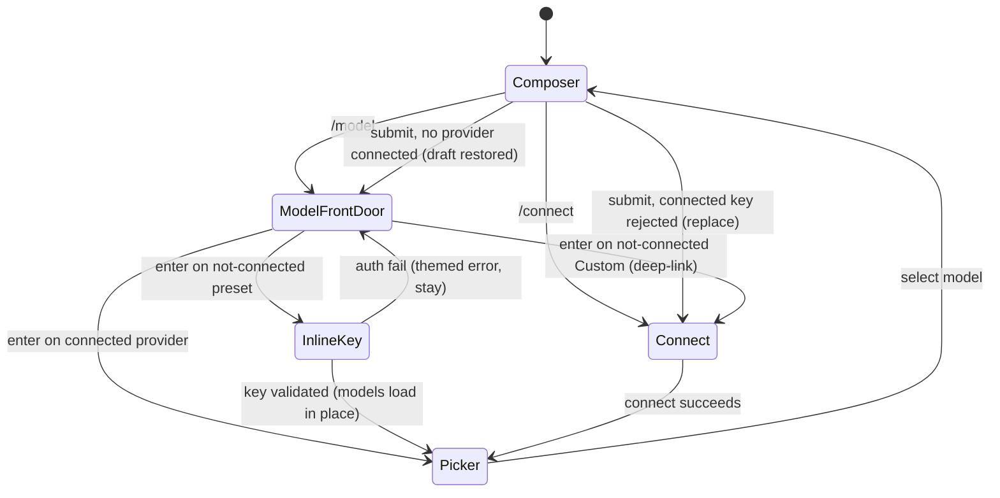

# feat: Fuse `/login` and `/model` into One Connect→Model Loop

## Summary

Make `/model` the single front door: it lists every provider (connected or not), and selecting a not-connected preset (Kimi) starts inline masked key entry that, on success, loads that provider's models in place to pick. Rename `/login` to `/connect` (both the TUI command/surface and the internal Rust `crate::login` module), keep it as the standalone add/replace/clear/Custom surface, and have a successful connect — standalone or via the Custom deep-link from `/model` — land the user in the model picker. This is a TUI-behavior + internal-rename change that reuses every existing backend JSON-RPC method unchanged.

---

## Problem Frame

`/login` and `/model` already lean on each other — `/model` bounces to `/login` when nothing is connected and renders an inert `(not connected — /login to add)` row — but the seam is a felt round-trip: two commands to know, a manual hop between "add a key" and "pick a model," and a new user must discover `/login` before `/model` is useful. The origin requirements doc (see Sources) resolved the product shape; this plan sequences the implementation.

---

## Requirements

**Front-door `/model`**
- R1. `/model` lists all providers (connected and not-connected) and no longer redirects to the credential surface when nothing is connected.
- R2. Not-connected provider rows in `/model` are keyboard-focusable and selectable.
- R3. Selecting a not-connected preset provider (Kimi) starts inline masked key entry within `/model`; an auth failure shows a themed error and leaves the provider not-connected without dropping the user out of the flow.
- R4. On a successful inline connect, the newly connected provider's models load in place and the picker highlights the auto-selected default, so the user can pick without leaving `/model`.
- R5. Selecting the not-connected Custom provider from `/model` deep-links into `/connect` for base URL + label + key; the multi-field Custom form is not embedded in `/model`.

**`/connect` surface (renamed from `/login`)**
- R6. Rename the `/login` command + surface to `/connect`, and the internal Rust `crate::login` module to `crate::connect`. Drop the `/login` name with no alias. `/connect` remains the standalone add/replace/clear/Custom surface.
- R7. After a successful connect from the standalone `/connect` surface (or the R5 deep-link), land the user in the model picker rather than the composer.
- R8. Update all user-facing wording referencing `/login`: the slash-command menu, help output, the surface's own rendered `/login` title, the not-connected model-row hint, and the "no provider configured" message in **both** copies — the Rust source (`src/conversation/mod.rs`) and the TUI fallback constant (`PROVIDER_NOT_CONFIGURED_MESSAGE` in `tui/src/libs/promptQueue/promptQueue.ts`).

**Routing for empty / unconfigured states**
- R9. Opening `/model` with no provider connected shows the front-door provider list with connectable rows, not a redirect.
- R10. On prompt submit with no connected provider, route the user to `/model`'s front door, preserving the restore-draft behavior. This is a **new** reroute for the `needsConfiguration` result (which today renders inline); the existing `auth`-key-rejection reroute is a separate path — see U6.

**Ownership and boundaries**
- R11. Inline connect in `/model` only adds a key to a not-connected provider; replace/clear and Custom reconfiguration stay in `/connect`; connected providers in `/model` show only their models.
- R12. TUI-only behavior change plus an internal Rust module rename; no wire-protocol method is renamed and no new secret material appears in any payload. Raw keys never enter Jotai atoms.

**Origin actors:** A1 User, A2 Ink TUI, A3 Rust backend
**Origin flows:** F1 (connect-and-pick from `/model`, preset), F2 (connect-and-pick for Custom via deep-link), F3 (standalone `/connect` management)
**Origin acceptance examples:** AE1 (covers R1, R9), AE2 (covers R3, R4), AE3 (covers R3 failure), AE4 (covers R5, R7), AE5 (covers R7), AE6 (covers R10)

---

## Scope Boundaries

- No new providers, OAuth/device-flow, or multiple custom providers.
- Inline replace/clear for already-connected providers is out — stays in `/connect`.
- Custom is not run inline in `/model`; it deep-links to `/connect`.
- No `/login` alias retained after the rename.
- No wire-protocol/JSON-RPC method renames; keychain/`.env` storage, the validate-on-entry rule, default-model auto-selection, and status-bar model resolution are unchanged.

### Deferred to Follow-Up Work

- Capturing the surface-merge navigation pattern and the "keys never in atoms" guardrail as a `docs/solutions/` learning once this lands (flagged by the learnings pass — neither is documented yet).

---

## Context & Research

### Relevant Code and Patterns

- **Command surface:** `tui/src/libs/commands/registry.ts` (`CommandId`/`CommandName`), `tui/src/libs/commands/executeCommand.ts` (`CommandActions`, `openLogin`), `tui/src/components/PromptComposer/index.tsx` (wires the actions).
- **Surface navigation:** `tui/src/state/ui/surface/atoms.ts` (`Surface` enum, `activeSurfaceAtom`, `openLoginSurfaceAtom`, `openModelSurfaceAtom` with its `surfaceNavigationVersion` guard), `tui/src/App.tsx` (surface switch + the `esc` guard that excludes `Surface.Login`).
- **Login surface:** `tui/src/components/LoginSurface/` (`index.tsx`, `useLoginBackend.ts` `submitKey`/`clearProvider`, `useLoginInput.ts`, `ProviderList.tsx`, `CustomForm.tsx`, `ConnectedActions.tsx`), `tui/src/state/ui/login/atoms.ts` (`LoginStep` machine), `tui/src/components/MaskedInput/`.
- **Model surface:** `tui/src/components/ModelSurface/` (`index.tsx`, `useModelBackend.ts` `refreshModels`/`selectModel`, `useModelInput.ts`, `ModelRow.tsx`, `ModelRows.tsx`), `tui/src/state/ui/model/atoms.ts`, `tui/src/state/ui/model/providerLoads.ts` (`isFocusableModelStatus`, `MODEL_LOAD_STATUS_NOT_CONNECTED`).
- **Submit reroute:** `tui/src/state/promptQueue/atoms.ts` (`rerouteToLogin` → `openLoginSurfaceAtom`, with `restoreComposerDraftAtom`); inline not-configured message mapped in `tui/src/libs/promptQueue/promptQueue.ts` (`turnResultToBackendResult`).
- **Rust module:** `src/lib.rs` (`pub mod login`), `src/login.rs` + `src/login/` (`selection.rs`, `http.rs`, `sanitize.rs`, `tests.rs`), `src/backend/login.rs`, `src/backend/mod.rs` (`mod login`, `login::handle_provider_set_key`/`handle_provider_models`), `src/backend/resolve.rs` (`crate::login::resolve_base_url`), and the user-facing string in `src/conversation/mod.rs`.

### Institutional Learnings

- **1. State-vs-libs layering** (`docs/solutions/architecture-patterns/state-libs-layering-and-cycle-verification-in-the-ink-tui.md`): `state/` is atoms-only; pure helpers/data live in `tui/src/libs/<domain>/` (no barrel `index.ts`; import the specific file). Enforce components → state → libs; `libs` must never import `@state`. Verify no import cycles with the repo's stdlib Tarjan detector — `madge --circular` gives a false pass here.
- **2. Terminal edge rendering** (`docs/solutions/architecture-patterns/terminal-edge-rendering-tradeoffs-in-the-ink-tui.md`): the inline masked-key field has a cursor — reuse `INK_CURSOR_ROW_ORIGIN_OFFSET` and `safeChromeColumnsAtom` (don't hardcode); render highlight/background rows as `<Box width={columns} backgroundColor>` with explicit width; no unit test catches live cursor drift, so visually verify.
- **3. Keys-never-in-atoms guardrail** (`docs/solutions/architecture-patterns/backend-process-lifecycle-ownership-in-the-ink-tui.md`): the repo makes layer boundaries executable via `tui/src/__tests__/backendIsolation.test.ts`. That test is a static *import* scanner, so the secret invariant needs its own mechanism (see U4) — the reusable principle is: the masked key flows local component/`useInput` state → connect action → wire client, never into an atom.
- **4. Concurrent-session rename safety** (`docs/solutions/workflow-issues/recovering-from-concurrent-agent-session-edits.md`): a large rename is the highest-collision case — probe `git status`/mtimes before batch edits, re-read fresh on collision, and finish with a residue grep proving no old `login`/`LoginSurface` shape survives.

### External References

- Reference design: opencode (`anomalyco/opencode`) `/connect` + `/models` fused loop (`packages/tui/src/component/dialog-provider.tsx`, `dialog-model.tsx`) — captured in the origin doc. No further external research needed; strong local patterns.

---

## Key Technical Decisions

- **Rename first as behavior-preserving commits, then layer new behavior.** Isolating the Rust rename (U1) and TUI rename (U2) keeps the later behavior units small and the residue-grep verification clean.
- **`/model` front door replaces the bounce-to-login.** `openModelSurfaceAtom` and `refreshModels` stop routing to the connect surface on zero-connected; the not-connected rows become the connect entry points (R1, R9).
- **Inline preset connect stays in-place; Custom deep-links.** Presets are key-only, so inline masked entry within `/model` reuses the existing set-key path and simply reloads that provider's models on success (no navigation). Custom's base-URL + label + key form is not embedded — selecting it navigates to `/connect` (R5).
- **Chaining is TUI-navigation-driven, not backend-driven.** A successful `/connect` set-key opens the model surface; the inline `/model` path just flips the provider to connected and loads its models. Reuse the existing `surfaceNavigationVersion` guard so the chain can't be clobbered by a stale async open.
- **Raw keys never enter atoms**, enforced by a dedicated secrets-in-atoms guardrail — a static rule that `state/ui/**` never imports the key setter/`MaskedInput`, and/or a runtime sentinel-key store-snapshot test. (Not an extension of `backendIsolation.test.ts`, which is a static import scanner and cannot assert a runtime value.)
- **Internal Rust rename is cosmetic and protocol-safe.** `crate::login` → `crate::connect` touches no wire method name (the protocol uses `kqode.provider.setKey`/`.models`), so R12 holds.

---

## Open Questions

### Resolved During Planning

- What actually reroutes on submit today? `transcriptReducer.ts` emits a reroute effect *only* for `errorKind === 'auth'` (a connected provider whose key was rejected), which `rerouteToLogin` sends to the login/connect surface with a draft stash. The *no-provider* case returns `needsConfiguration`, which emits no effect and renders inline. So R10/AE6 need a **new** `needsConfiguration` reroute (U6), not a retarget of the existing effect.
- Where should each path land? No-provider (`needsConfiguration`) → `/model` front door (R10/AE6). Auth-key-rejection (`auth`) → `/connect` (replace the rejected key). These are deliberately different destinations.
- Does a successful key *replace* chain to the picker? Yes — origin F3 says "add/replace flows straight into selecting a model," and `submitKey`'s single `connected` branch chains both; `clear` does not chain.
- Rust rename surface: `pub mod login` in `src/lib.rs`, the `src/login.rs`/`src/login/` tree, `src/backend/login.rs`, `mod login` + `login::` calls in `src/backend/mod.rs`, `crate::login::resolve_base_url` in `src/backend/resolve.rs`, and `crate::login::` in `src/login/selection.rs` + `src/login/tests.rs`.

### Deferred to Implementation

- Exact shared-component boundary for the reusable masked-key step (extracted from `ConnectSurface` vs. a thin shared `useInput` handler) — chosen while keeping both surfaces within the ~200-line guideline. Confirm it has **both** consumers (the `/connect` key step and the `/model` inline path) before landing it; if the inline path needs materially different behavior, keep it inline rather than shipping a one-consumer wrapper.
- Exact signature for the deep-link intent (`openConnectSurfaceAtom` target-provider arg + "return to picker" flag vs. a small surface-return atom) — settle when touching `surface/atoms.ts`.
- Whether the inline key field fits the fixed-height `ModelRows` body as an extra row or replaces the footer hint region — resolve against live layout, verifying cursor placement.

---

## High-Level Technical Design

> *This illustrates the intended approach and is directional guidance for review, not implementation specification. The implementing agent should treat it as context, not code to reproduce.*

---

## Implementation Units

### U1. Rename the internal Rust `login` module to `connect`

**Goal:** Behavior-preserving rename of `crate::login` → `crate::connect`, plus the user-facing `/login` → `/connect` string in the backend not-configured message.

**Requirements:** R6, R8, R12

**Dependencies:** None

**Files:**
- Rename: `src/login.rs` → `src/connect.rs`; `src/login/` → `src/connect/` (`selection.rs`, `http.rs`, `sanitize.rs`, `tests.rs`)
- Rename: `src/backend/login.rs` → `src/backend/connect.rs`
- Modify: `src/lib.rs` (`pub mod login` → `pub mod connect`), `src/backend/mod.rs` (`mod login`, `login::handle_provider_set_key`, `login::handle_provider_models`), `src/backend/resolve.rs` (`crate::login::resolve_base_url`), `src/connect/selection.rs` + `src/connect/tests.rs` (`crate::login::` → `crate::connect::`)
- Modify: `src/conversation/mod.rs` ("Use /login to add a provider…" → "Use /connect …"); comment touch-ups in `src/config.rs`, `src/provider/registry.rs`, `src/store/providers.rs`
- Test: existing `src/connect/tests.rs` (moved) continues to cover set-key/model-catalog behavior

**Approach:**
- Pure rename + path/reference update; no logic change. The wire protocol constants (`kqode.provider.setKey`/`.models`) are untouched — this is internal module naming only.
- Update the not-configured message constant so the inline "no provider configured" guidance says `/connect`.

**Execution note:** Behavior-preserving rename — probe `git status` for concurrent edits before the batch; finish with a residue grep for `crate::login`/`mod login`.

**Patterns to follow:** Existing module layout under `src/` (module file + sibling folder for submodules).

**Test scenarios:**
- Happy path: `cargo test` — the moved `connect::` tests (set-key validation, default-model selection, catalog sanitize) still pass unchanged.
- Edge case: `cargo build` + `cargo clippy --workspace --all-targets --all-features -- -D warnings` succeed with no lingering `crate::login` references.
- Happy path: the Rust not-configured message now reads `/connect` (this satisfies the R8 sub-item for the Rust copy; AE6 routing is covered by U6, not U1).

**Verification:** `cargo test --workspace`, `cargo clippy … -D warnings`, and `cargo fmt --check` pass; a grep for `crate::login`/`mod login`/`/login` in `src/` returns nothing except intentional history.

---

### U2. Rename the TUI `/login` command and surface to `/connect`

**Goal:** Behavior-preserving TUI rename: command id/name, `Surface`, open-atom, `LoginSurface`/`state/ui/login` folders, action wiring, and all tests — no functional change yet.

**Requirements:** R6, R8

**Dependencies:** None (independent of U1)

**Files:**
- Modify: `tui/src/libs/commands/registry.ts` (`CommandId.Login`→`Connect`, `CommandName.Login`→`/connect`, description), `tui/src/libs/commands/executeCommand.ts` (`CommandActions.openLogin`→`openConnect`, `CommandId.Connect` case)
- Modify: `tui/src/state/ui/surface/atoms.ts` (`Surface.Login`→`Connect`, `openLoginSurfaceAtom`→`openConnectSurfaceAtom`), `tui/src/state/ui/index.ts` re-exports
- Rename: `tui/src/components/LoginSurface/` → `tui/src/components/ConnectSurface/` (all files + `useLoginBackend`/`useLoginInput` → `useConnectBackend`/`useConnectInput`), `tui/src/state/ui/login/` → `tui/src/state/ui/connect/`
- Modify: `tui/src/App.tsx` (import + switch case + `esc` guard `Surface.Login`→`Surface.Connect`), `tui/src/components/PromptComposer/index.tsx` (`openLoginSurfaceAtom`→`openConnectSurfaceAtom`, action wiring), `tui/src/state/promptQueue/atoms.ts` import of the open-atom
- Test: rename/update `tui/src/components/ConnectSurface/__tests__/*`, `tui/src/state/ui/connect/__tests__/atoms.test.ts`, `tui/src/state/ui/surface/__tests__/atoms.test.ts`, `tui/src/libs/commands/__tests__/executeCommand.test.ts` + `filterCommands.test.ts`, and the `openLogin` mocks in PromptComposer tests

**Approach:**
- Mechanical rename preserving every behavior. Help output updates automatically (it derives from `COMMAND_REGISTRY`).
- Keep the `esc`-guard exclusion semantics: the surface still owns its own multi-step `esc`, so `App.tsx` continues to exclude it (now under the `Connect` name).

**Execution note:** Highest-blast-radius unit — probe `git status`/mtimes before the batch, re-read fresh on any collision, and finish with a residue grep for the identifiers `login`/`LoginSurface`/`openLoginSurfaceAtom` **and** the literal display string `/login` across both `src/` and `tui/src/`. The surface renders its own `/login` title (`<Text>/login</Text>` in the renamed `ConnectSurface/index.tsx`), which an identifier-only grep would miss.

**Patterns to follow:** Existing colocated-folder component structure; `state/` atoms-only, helpers in `libs/` (state-vs-libs layering learning).

**Test scenarios:**
- Happy path: `/connect` appears in the command menu/help and opens the (renamed) surface; `executeCommand` runs `openConnect` only for the connect command.
- Edge case: no import cycles introduced (run the repo's Tarjan detector, not `madge`); `bun run typecheck` clean.
- Covers AE-agnostic: residue grep finds no `/login`, `LoginSurface`, or `openLoginSurfaceAtom` identifiers.

**Verification:** `cargo xtask tui-typecheck` and `cargo xtask tui-test` pass; command menu shows `/connect`; grep for old identifiers is empty.

---

### U3. Make `/model` the front door (focusable not-connected rows, no bounce)

**Goal:** `/model` lists all providers including not-connected ones as focusable rows and stops redirecting to `/connect` when nothing is connected.

**Requirements:** R1, R2, R8, R9, R11

**Dependencies:** U2

**Files:**
- Modify: `tui/src/state/ui/model/providerLoads.ts` (`isFocusableModelStatus` — make `MODEL_LOAD_STATUS_NOT_CONNECTED` focusable)
- Modify: `tui/src/state/ui/surface/atoms.ts` (`openModelSurfaceAtom` — always open `Surface.Model`, drop the bounce-to-connect branch)
- Modify: `tui/src/components/ModelSurface/useModelBackend.ts` (`refreshModels` — do not call `openConnect` on zero-connected/undefined client; remove the early-return so `setModelProvidersLoadingAtom` still populates `modelProvidersAtom` with the not-connected rows, rendering the front-door list instead)
- Modify: `tui/src/components/ModelSurface/ModelRow.tsx` (restructure the not-connected branch so it no longer returns before the marker/color logic: render the `›` marker + `accentBlue` when highlighted, muted with a blank marker otherwise; wording `(not connected — enter to connect)`)
- Modify: `tui/src/components/ModelSurface/index.tsx` (front-door chrome: adapt the subtitle and footer legend so `enter` reads as select/connect when not-connected rows are present, e.g. `↑/↓ choose · enter select/connect · esc close`)
- Test: `tui/src/components/ModelSurface/__tests__/ModelSurface.test.tsx`, `tui/src/state/ui/model/__tests__/atoms.test.ts`, `tui/src/state/ui/surface/__tests__/atoms.test.ts`

**Approach:**
- Not-connected rows join the focusable set so `moveModelHighlight` can land on them; highlight math (`ensureHighlight`/`ensureVisible`) already keys off `modelFocusableRowsAtom`, so widening focusability is the primary change.
- `openModelSurfaceAtom` becomes a plain open (still guarded by `surfaceNavigationVersion`); the empty-list case now shows connectable rows rather than redirecting.
- Connected providers still render only their model rows (R11 — no inline management affordance added here).

**Patterns to follow:** Existing `modelFocusableRowsAtom`/`ensureHighlight` windowing; `ModelRow` marker/color conventions; safe-width rendering.

**Test scenarios:**
- Covers AE1. Happy path: with zero providers connected, opening `/model` shows the provider list with not-connected rows present and selectable (no surface redirect).
- Happy path: `↑/↓` moves the highlight onto and off a not-connected row.
- Edge case: a mix of connected + not-connected providers — connected rows show models, not-connected rows show the connect hint; highlight can traverse both.
- Edge case: all providers connected — behavior matches today (no not-connected rows, models listed).
- Happy path: a highlighted not-connected row shows the `›` marker + `accentBlue`, visibly distinct from its muted idle state, so a keyboard user can tell which provider `enter` will connect.

**Verification:** `cargo xtask tui-test` passes; manually, `/model` with no keys shows a navigable provider list instead of jumping to `/connect`.

---

### U4. Inline preset connect within `/model` (key entry → models load in place)

**Goal:** Selecting a not-connected preset provider (Kimi) in `/model` starts inline masked key entry; on success the provider flips to connected, its models load in place, and the default is highlighted; on failure a themed error keeps the user in the flow.

**Requirements:** R3, R4, R11, R12

**Dependencies:** U2, U3

**Files:**
- Create: shared masked-key entry piece extracted from the connect surface (e.g. `tui/src/components/ConnectSurface/KeyEntry.tsx` or a shared hook) reused by both surfaces
- Modify: `tui/src/components/ModelSurface/index.tsx` + `useModelInput.ts` (dispatch inline key entry when `enter` lands on a not-connected preset row)
- Create: `tui/src/components/ModelSurface/useInlineConnect.ts` (drives inline set-key for the highlighted preset, reusing the wire `setProviderKey` path; keeps the key in local state only)
- Modify: `tui/src/state/ui/model/atoms.ts` (transient "inline-connecting provider" UI state — never the key), `tui/src/components/ModelSurface/useModelBackend.ts` (reload that provider's models on success and highlight its default)
- Modify: `tui/src/App.tsx` (exclude `Surface.Model` from the global `esc`-close while inline entry is active — see Approach — so the surface owns `esc`)
- Create: a dedicated "secrets-never-in-atoms" guardrail test (e.g. `tui/src/__tests__/secretsNotInAtoms.test.ts`). The existing `backendIsolation.test.ts` is a static forbidden-*import* scanner and cannot assert that a runtime key value never lands in an atom — see Approach for the actual mechanism.
- Test: `tui/src/components/ModelSurface/__tests__/ModelSurface.test.tsx`, new `tui/src/components/ModelSurface/__tests__/inlineConnect.test.tsx`

**Approach:**
- Reuse `MaskedInput` + the existing `submitKey` semantics from `useConnectBackend`; the preset path needs only the key (fixed base URL), so no Custom form.
- Show a `Working…` validating state between submit and outcome (mirror the standalone surface's `inFlight`): set `MaskedInput` `isActive={false}` during validation and gate `useModelInput` ↑/↓/enter while inline entry or validation is active, so the highlight can't leave the row that owns the open field.
- **Esc is context-sensitive and owned by the surface.** `App.tsx`'s global handler today closes any surface except `Home`/`Login` (`Surface.Model` is *not* excluded), so without a change `esc` during inline entry tears down `/model` and fails AE3. Exclude `Surface.Model` from the global close while inline entry is active (or gate it on the inline-connecting atom), then: entering → `esc` returns to the row and clears any error; validating → `esc` is swallowed (or aborts the connect); error-shown → `esc` dismisses the error and returns to the row. Front-door list `esc` (no inline entry) still closes to `Home`.
- On a `connected` outcome, mark the provider connected and trigger `loadProviderModels(providerId)` so its rows replace the not-connected row in place, with the auto-selected default highlighted (R4). On `authFailed`/other, show the themed outcome and remain on the row for re-entry (R3), without interpolating the entered key into any outcome/error string.
- The raw key lives only in local component/`useInput` state and is handed to the wire client; **no atom stores it** (R12). Enforce this with a real mechanism, not the import scanner: (a) a static rule that `state/ui/**` modules never import the key-bearing wire setter or `MaskedInput` and never declare a field that receives `apiKey`; and/or (b) a runtime test that drives the inline submit with a sentinel key string, snapshots the Jotai store, and asserts the sentinel appears in no `state/ui/**` atom (catches an arbitrarily-named field like `pendingKey`/`draftKey`).

**Execution note:** Reuse `INK_CURSOR_ROW_ORIGIN_OFFSET` and `safeChromeColumnsAtom` for the inline field; visually verify the masked-key cursor lands on its row (no unit test catches live drift).

**Technical design:** *(directional, not implementation spec)* enter-on-not-connected-preset → set `inlineConnectProviderId` → render `MaskedInput` in the surface → submit → `setProviderKey({providerId, baseUrl: preset, apiKey})` → on `connected`, clear inline state + `loadProviderModels(providerId)` + highlight default; else set outcome, keep inline field.

**Patterns to follow:** `tui/src/components/ConnectSurface/useConnectBackend.ts` `submitKey` (keeps keys out of atoms; renamed from `LoginSurface/useLoginBackend.ts` in U2), the standalone surface's `inFlight`/`Working…` pattern, `MaskedInput` usage, `setProviderModelLoadAtom` in-place list replacement.

**Test scenarios:**
- Covers AE2. Happy path: not-connected Kimi + valid key → provider connected, models load in place, default highlighted, user selects without leaving `/model`.
- Covers AE3. Error path: not-connected Kimi + invalid key → themed auth-failed error, provider stays not-connected, inline field remains for re-entry.
- Integration: driving the inline submit with a sentinel key string leaves that string absent from every `state/ui/**` atom snapshot — including any prefill/retry field added for the auth-fail re-entry path.
- Edge case: `esc` while entering returns to the not-connected row without connecting; `esc` while validating does not close `/model`; `esc` on the front-door list (no inline entry) closes to `Home`.
- Edge case: with an inline field open, ↑/↓/enter do not move the highlight off the row that owns the field.

**Verification:** `cargo xtask tui-test` passes including the keys-out-of-atoms guardrail; manually, connecting Kimi from `/model` shows its models without a surface change.

---

### U5. Custom deep-link + connect→model chaining

**Goal:** Selecting the not-connected Custom provider from `/model` deep-links into `/connect` (pre-entering the Custom flow); a successful connect on `/connect` — standalone or deep-linked — lands the user in the model picker.

**Requirements:** R5, R7

**Dependencies:** U2, U3

**Files:**
- Modify: `tui/src/state/ui/surface/atoms.ts` (`openConnectSurfaceAtom` gains an optional target-provider arg and a "return to picker on success" intent; a small return-target atom or flag)
- Modify: `tui/src/components/ModelSurface/useModelInput.ts` (enter on the not-connected Custom row → open `/connect` targeting Custom with the return-to-picker intent)
- Modify: `tui/src/components/ConnectSurface/useConnectBackend.ts` (`submitKey` success: navigate to `Surface.Model` instead of `closeActiveSurface`), `tui/src/components/ConnectSurface/index.tsx` (honor a target provider to pre-select/enter Custom)
- Modify: `tui/src/state/ui/connect/atoms.ts` (`chooseSelectedProviderAtom`/reset to accept a pre-selected target)
- Test: `tui/src/components/ConnectSurface/__tests__/*`, `tui/src/state/ui/surface/__tests__/atoms.test.ts`, `tui/src/components/ModelSurface/__tests__/ModelSurface.test.tsx`

**Approach:**
- The deep-link opens `/connect` with the Custom provider pre-selected at the URL step; on a successful connect it chains to `/model` (which now shows the connected Custom + its models). The pre-selection must survive `/connect`'s mount reset (`resetLoginSurfaceAtom`) and its async `refreshProviders()` before an index-based select can land on Custom — thread the target through the reset rather than racing it.
- A successful set-key on `/connect` lands the user in `/model` (R7). Because `submitKey`'s `connected` branch is the single success path for both a fresh add **and** a key *replace* on an already-connected provider, retargeting it to open `/model` chains **both** — which matches origin flow F3 ("a successful add/replace flows straight into selecting a model"). So a successful replace also lands in the picker; `clear` (a separate action, not `submitKey`) still returns to the list.
- **Cancel/return path:** on `esc`/cancel of a *deep-linked* `/connect`, return to the `/model` front door (via the same return-to-picker intent), not `Home`; standalone `/connect` `esc` → `Home` is unchanged.
- Reuse the existing `surfaceNavigationVersion` guard so the chained open isn't clobbered by a stale async model open.

**Patterns to follow:** `openModelSurfaceAtom`'s navigation-version guard; `chooseSelectedProviderAtom` provider pre-selection; `useConnectBackend.submitKey` (renamed from `useLoginBackend` in U2) close-on-connect, retargeted to open Model.

**Test scenarios:**
- Covers AE4. Happy path: not-connected Custom in `/model` → `/connect` opens at the Custom URL step → base URL + label + valid key → lands in the model picker with Custom's models.
- Covers AE5. Happy path: standalone `/connect` (any provider) + valid key → lands in the model picker, not the composer.
- Happy path: a successful key *replace* on an already-connected provider also lands in the model picker (per origin F3), consistent with a fresh connect.
- Error path: connect fails in `/connect` → stays on `/connect` with the themed outcome (no navigation to `/model`).
- Edge case: `clear` on a connected provider returns to the provider list (clear is not a `submitKey` success and does not chain to the picker).
- Edge case: cancelling a deep-linked `/connect` returns to the `/model` front door; cancelling a standalone `/connect` returns to `Home`.

**Verification:** `cargo xtask tui-test` passes; manually, both Custom-from-`/model` and standalone `/connect` end in the model picker on success.

---

### U6. Reroute unconfigured submit to the `/model` front door

**Goal:** On prompt submit with no connected provider, route to `/model`'s front door (not `/connect`), preserving the restore-draft behavior.

**Requirements:** R10

**Dependencies:** U3

**Files:**
- Modify: `tui/src/libs/promptQueue/transcriptReducer.ts` (emit a reroute effect for the `needsConfiguration` settled result — today the reducer emits an effect only for `errorKind === 'auth'`; add a distinct effect type/discriminant for the no-provider case)
- Modify: `tui/src/state/promptQueue/atoms.ts` (route the new `needsConfiguration` effect to the `/model` front door via `openModelSurfaceAtom` with `restoreComposerDraftAtom`; keep the existing `auth` effect routing to `/connect` — see Approach)
- Modify: `tui/src/libs/promptQueue/promptQueue.ts` (`PROVIDER_NOT_CONFIGURED_MESSAGE`: `/login` → `/connect`)
- Test: `tui/src/state/promptQueue/__tests__/atoms.test.ts`, `tui/src/libs/promptQueue/__tests__/transcriptReducer.test.ts`, `tui/src/__tests__/App.submit.test.tsx`

**Approach:**
- **Correcting the mechanism:** today `rerouteToLogin` fires *only* on the `auth` effect that `transcriptReducer.ts` emits for `errorKind === 'auth'` — a *connected* provider whose key was rejected mid-turn. The no-provider case returns `needsConfiguration`, for which the reducer emits *no* effect, so it renders inline and never reroutes. Retargeting the existing effect alone would miss R10/AE6 entirely and mis-send the auth-rejection case.
- **No-provider path (R10/AE6):** add a `needsConfiguration` reroute effect in the reducer and route it in `atoms.ts` to the `/model` front door with the draft-restore guard, so submitting with nothing connected opens the connectable provider list (replacing the inline-only behavior for that case).
- **Auth-rejection path (kept separate):** the existing `auth` effect should continue routing to `/connect` (renamed from login in U2), because a *rejected* key is fixed by replacing it in `/connect`, not from the model picker. Do **not** retarget the `auth` effect to `/model`.
- The `PROVIDER_NOT_CONFIGURED_MESSAGE` TUI fallback constant is a separate copy from the Rust message (U1) and is updated here (R8).

**Patterns to follow:** The existing `auth`-effect emit in `transcriptReducer.ts` and the `rerouteToLogin`/`restoreComposerDraftAtom` handling in `atoms.ts` — mirror that shape for the new `needsConfiguration` effect.

**Test scenarios:**
- Covers AE6. Happy path: submit with **no provider connected** (`needsConfiguration`) → `/model` front door opens and the composer draft is restored.
- Error path: submit against a **connected** provider whose key is rejected (`errorKind === 'auth'`) → reroutes to `/connect` (to replace the key), not `/model`.
- Edge case: submit with a working connected provider → no reroute (turn proceeds).
- Edge case: draft-restore guard still prevents overwriting a non-empty restore draft.

**Verification:** `cargo xtask tui-test` passes; manually, submitting with no keys opens `/model`'s provider list with the typed prompt preserved, while a rejected-key turn opens `/connect`.

---

## System-Wide Impact

- **Interaction graph:** `activeSurfaceAtom` (mutually-exclusive surfaces) and the async `openModelSurfaceAtom` `surfaceNavigationVersion` guard now carry the connect→model chain; `useInput` handlers in `/model` gain a not-connected-row dispatch (preset inline vs. Custom deep-link); PromptComposer command actions rename `openLogin`→`openConnect`.
- **Error propagation:** inline-connect failures surface as themed outcomes within `/model` (no surface change); `/connect` failures keep the user on `/connect`; only a `connected` outcome navigates.
- **State lifecycle risks:** transient inline-connect UI state and the deep-link "return to picker" intent must reset on surface open/close so a stale intent can't hijack a later navigation; reuse reset-on-open atoms.
- **API surface parity:** no wire-protocol change — `kqode.provider.setKey`/`.models`/`.list`/`kqode.selection.set` are reused as-is; the Rust rename is internal module naming only.
- **Unchanged invariants:** raw API keys never enter Jotai atoms (guardrail test); keychain/`.env` precedence, validate-on-entry, and default-model auto-selection are unchanged; the status-bar model resolution is untouched.

---

## Risks & Dependencies

| Risk | Mitigation |
|------|------------|
| Large rename (U1/U2) collides with concurrent agent/IDE sessions on this shared branch | Probe `git status`/mtimes before batch edits; re-read fresh on collision; residue-grep for old identifiers after (learnings #4) |
| Raw key leaks into an atom via the new inline-connect path (e.g. a `pendingKey` retry field) | Key stays in local component/`useInput` state → wire client; dedicated secrets-in-atoms guardrail (static import rule + runtime sentinel store-snapshot), **not** the `backendIsolation.test.ts` import scanner (learnings #3) |
| Inline masked-key cursor drifts one row off | Reuse `INK_CURSOR_ROW_ORIGIN_OFFSET` + `safeChromeColumnsAtom`; visually verify (no unit test catches live drift) (learnings #2) |
| Reshuffled imports introduce a `libs → state` cycle | Verify with the repo's stdlib Tarjan detector, not `madge` (false pass) (learnings #1) |
| Chained `/connect`→`/model` open clobbered by a stale async model open | Reuse the existing `surfaceNavigationVersion` guard for the chained navigation |
| Concurrent `2026-07-10-003-refactor-remove-env-provider-config` plan shifts Custom `.env` status handling | Keep this loop UX orthogonal — it reads provider status/methods regardless of credential source; coordinate if the status labels change |
| Submit-reroute paths conflated (auth-rejection vs no-provider) | They are distinct effects with distinct destinations: `needsConfiguration` → `/model` front door; `auth` (rejected key) → `/connect`. U6 adds the former and leaves the latter routing to `/connect` |

---

## Sources & References

- **Origin document:** [docs/brainstorms/2026-07-10-connect-and-model-loop-requirements.md](docs/brainstorms/2026-07-10-connect-and-model-loop-requirements.md)
- Prior split this reverses: `docs/plans/2026-07-05-002-feat-provider-login-and-model-selection-plan.md`, `docs/brainstorms/2026-07-05-provider-login-and-model-selection-requirements.md`
- Adjacent concurrent plan (credential sourcing): `docs/plans/2026-07-10-003-refactor-remove-env-provider-config-plan.md`
- Reference design (opencode): `anomalyco/opencode` `packages/tui/src/component/dialog-provider.tsx`, `dialog-model.tsx`
- Learnings: `docs/solutions/architecture-patterns/state-libs-layering-and-cycle-verification-in-the-ink-tui.md`, `terminal-edge-rendering-tradeoffs-in-the-ink-tui.md`, `backend-process-lifecycle-ownership-in-the-ink-tui.md`, `docs/solutions/workflow-issues/recovering-from-concurrent-agent-session-edits.md`
