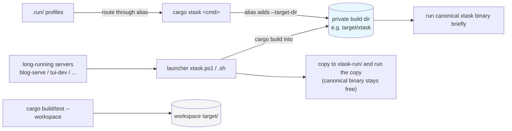

# fix: Parallel-Safe `cargo xtask` Invocation on Windows

## Summary

Give xtask a private build directory so ordinary `cargo xtask` commands never relink a binary another process is running, unify the copy-and-run launcher on that same directory, route the IDE run profiles and the scaffolding skill through the isolating alias, and rewrite the contributor/agent docs to one model — fast commands via `cargo xtask`, long-running servers via the launcher. No Rust source changes; the fix lives in the alias, the launcher scripts, the `.run/` profiles, the scaffolding skill, and docs.

---

## Problem Frame

`cargo xtask` is the alias `run -p xtask --`, so each call is *build* (may relink `target\debug\xtask.exe`) + *run* (holds it). On Windows a held binary cannot be relinked, so concurrent invocations collide (os error 32, or os error 5 on the remove step). xtask is a `[workspace]` member, so `cargo build/test --workspace` also relinks that binary, and long-running servers hold it for minutes — widening the window. The concrete pain is a background agent's plan validation blocking a foreground agent's concurrent validation. Full framing in the origin document.

---

## Requirements

- R1. `cargo xtask <cmd>` builds and runs xtask in a build directory dedicated to xtask, separate from the workspace `target/`, so ordinary invocations never relink a binary another process is running.
- R2. The isolation must not affect the main workspace / `kqode` build; packaging and release flows that read `target/release` keep working unchanged.
- R3. IDE `.run/` profiles inherit the same isolation rather than open-code the unsafe `run -p xtask` path, and the `kqode-new-xtask` scaffolding produces new commands and profiles that inherit it by default.
- R4. Long-running commands (`blog-serve`, `blog-serve-en`, `blog-preview`, `tui-dev`, `tui-prod`) do not hold the canonical xtask binary while running on the CLI/agent path — they run as a throwaway copy via the copy-and-run launcher.
- R5. When a long-running command is launched via the launcher, a concurrently issued xtask command that must relink still succeeds, unblocked by the running server.

> **Scope note (R4/R5):** these hold for the CLI/agent launcher path. The five long-running commands invoked from their IDE `.run/` profiles remain isolated cargo runs that still hold the canonical private-dir binary for the session (see Scope Boundaries → Deferred to Follow-Up Work), so a concurrent relink can still block against an IDE-launched server. Converting those profiles to launcher-invoking configs is deferred.
- R6. The alias and the launcher use the same private build directory, so there is one fresh xtask binary rather than two divergent copies.
- R7. Contributor docs (`AGENTS.md`, `CONTRIBUTING.md`, `CONTRIBUTING.zh-CN.md`) and agent instructions present a single safe model — `cargo xtask` for fast commands, the launcher for the long-running set.

**Origin actors:** A1 (foreground developer/agent), A2 (background coding agent), A3 (IDE `.run/` profiles), A4 (future xtask command author)
**Origin flows:** F1 (concurrent fast-command validation), F2 (long-running server alongside a concurrent command)
**Origin acceptance examples:** AE1 (concurrent fast commands, no relink failure — covers R1, R3), AE2 (edit xtask source while a server runs; new command relinks and runs — covers R4, R5), AE3 (packaging still lands in `target/release` — covers R2)

---

## Scope Boundaries

- Non-Windows platforms (Linux/macOS): no behavior change — the relink lock is Windows-specific.
- CI: unchanged — runs on Linux in separate runners.
- The launcher's core copy-and-run mechanism: reused as-is, not redesigned.
- A PATH-installed `cargo-xtask` shim: rejected for per-developer setup friction.
- Self-re-exec inside the xtask binary: rejected — a live Windows process locks its own image, so a self-copy-then-wait binary cannot release the lock while preserving interactive semantics.

### Deferred to Follow-Up Work

- Converting the five long-running IDE `.run/` profiles to launcher-invoking (shell-script) run configs: deferred. They remain isolated cargo runs; the launcher covers the CLI/agent path that drove this work. Platform-specific (`.ps1` vs `.sh`) with low incremental value.

---

## Context & Research

### Relevant Code and Patterns

- `.cargo/config.toml` — the alias `xtask = "run -p xtask --"`; the single injection point for isolation.
- `scripts/xtask.ps1`, `scripts/xtask.sh` — existing copy-and-run launcher: builds xtask once, then runs a per-invocation copy under `target/debug/xtask-run/`; honors `CARGO_TARGET_DIR`.
- `Cargo.toml` — `[workspace] members = [".", "xtask"]`; xtask has zero external dependencies, so a cold compile in a private dir is a few seconds.
- `.run/xtask_*.run.xml` (17 files) — `CargoCommandRunConfiguration` with command `run -p xtask -- <cmd>`.
- `xtask/src/support/paths.rs` — `repo_root()` via compile-time `CARGO_MANIFEST_DIR` (relocated/alt-dir binaries still resolve the repo); fixtures and test workspace are hard-coded to `repo_root/target/kqode-test-workspaces` (not the build dir), so `tui-dev`/`tui-prod`/`fixture-prepare` are unaffected by isolating xtask's build dir.
- `xtask/src/support/cargo.rs` (`build_release_bin`) — packaging shells `cargo build --release --bin kqode` as a child with `current_dir = repo_root` and no target-dir override, so a flag-scoped isolation does not leak into it (packaged binary stays in `target/release`).
- `xtask/src/commands/{blog/serve,blog/serve_en,blog/preview,tui/dev,tui/prod}.rs` — the long-running commands; each blocks on a child process via `.status()`, holding the binary for the whole session.
- `.agents/skills/kqode-new-xtask/SKILL.md` (step 8) — adds the `.run/` profile for new commands.
- `.github/workflows/ci.yml` — runs `cargo xtask tui-*` on `ubuntu-latest` (Linux, unaffected).

### Institutional Learnings

- `docs/solutions/workflow-issues/recovering-from-concurrent-agent-session-edits.md` — shared-branch concurrent sessions are a real, checkable state in this repo; reinforces why parallel-safe tooling matters (that learning is about file-edit collisions, not the build lock).

### External References

- JetBrains RustRover/CLion Cargo Command run configs execute a custom `.cargo/config.toml` alias typed in the command field (no completion, but it runs) — YouTrack RUST-6095. Confirms `.run/` profiles can route through the alias.

---

## High-Level Technical Design

> *This illustrates the intended approach and is directional guidance for review, not implementation specification. The implementing agent should treat it as context, not code to reproduce.*

The relink lock is a *replace-while-held* event: `cargo run` holds the binary while running, and something concurrently tries to relink it. Two changes remove both triggers — isolation stops workspace builds from touching xtask's binary, and the launcher keeps long-running commands off the canonical binary entirely.

Workspace builds touch `target/`; every xtask path touches the private dir — so they no longer contend. Long-running commands run a copy, leaving the private-dir binary relinkable even while a server runs.

---

## Key Technical Decisions

- **Private build dir via the alias flag, not a global `[build] target-dir`:** a global move would relocate the `kqode`/workspace build and break packaging's `target/release` expectation (R2). Isolation is scoped to the xtask invocation only.
- **`.run/` profiles route through the alias (`xtask <cmd>`), not a duplicated target-dir flag across 17 files:** single source of truth for the private dir; research-confirmed the IDE executes aliases.
- **Launcher builds into and copies from the same private dir as the alias (R6):** otherwise the launcher's build would touch the workspace `xtask.exe` that workspace builds also relink, reintroducing contention, and two divergent binaries waste a cold compile.
- **Launcher pins the private dir with a `--target-dir` flag, not an exported `CARGO_TARGET_DIR`:** the env var would be inherited by `tui-prod`'s child `cargo build --release --bin kqode` and write the backend to `<private-dir>/release/`, while `tui/scripts/buildPackaged.ts` reads a hard-coded `target/release` — breaking packaging. A flag is not inherited by that child, so it stays leak-safe and keeps the launcher on the alias's dir even when a developer has `CARGO_TARGET_DIR` set.
- **Long-running residual closed via the launcher, not self-re-exec:** on Windows a live process locks its own image, so a self-copy-then-wait xtask would still hold the canonical binary; the launcher runs a copy and leaves the canonical binary free.
- **Accept the narrow fast-command residual:** two fast commands racing a relink in the tiny window right after an xtask source edit can still collide; fast commands run briefly, and this was explicitly accepted in the brainstorm.

---

## Open Questions

### Resolved During Planning

- Does the JetBrains run config accept an alias? Yes (RUST-6095) — `.run/` profiles route through the alias.
- Which commands are "long-running"? The five that block on a child via `.status()`: `blog-serve`, `blog-serve-en`, `blog-preview`, `tui-dev`, `tui-prod`.
- Does isolating xtask's build dir break packaging or fixtures? No — packaging's child cargo uses the default dir; fixtures/workspace are hard-coded to `repo_root/target`.
- How does the launcher pin the private dir without breaking packaging? Via a `--target-dir` flag on its `cargo build -p xtask` step, never an exported `CARGO_TARGET_DIR` (which would leak into `tui-prod`'s child packaging build).

### Deferred to Implementation

- Exact private-dir name/location (`target/xtask` inside the gitignored tree vs. a gitignored sibling) and whether a `.gitignore` entry is needed if a sibling is chosen.

---

## Implementation Units

### U1. Isolate the xtask build directory via the cargo alias

**Goal:** `cargo xtask` builds and runs xtask in a dedicated directory so ordinary invocations don't relink a binary held by workspace builds or other xtask runs.

**Requirements:** R1, R2, R6

**Dependencies:** None

**Files:**
- Modify: `.cargo/config.toml`

**Approach:**
- Extend the alias to target a private build dir (e.g., `run -p xtask --target-dir target/xtask --`).
- Keep it a flag on the invocation, not a global `[build] target-dir`, so child cargo processes (packaging) and workspace builds are unaffected.
- A relative `--target-dir` resolves against the caller's cwd, so `cargo xtask` is expected to run from the repo root (the `.run/` profiles already pin their working directory); anchor the path if subdir invocations must share one dir.
- Treat the chosen dir name as the single reference the launcher (U2) mirrors.

**Patterns to follow:**
- The existing `[alias]` entry in `.cargo/config.toml`.

**Test scenarios:**
- Happy path: after the change, `cargo xtask help` runs and lists every command, building into the private dir.
- Integration: `cargo xtask tui-typecheck` still succeeds (the private-dir binary drives the same Bun work).
- Integration (Covers AE1): two concurrent `cargo xtask` fast commands — one issued after a `cargo build --workspace` — both complete on Windows without an os-error-32/os-error-5 relink failure.
- Edge (Covers AE3): `cargo xtask package` produces the packaged `kqode` in `target/release`, and the Bun packaging step finds it unchanged.

**Verification:**
- xtask commands run; a private build dir is created; `cargo xtask` no longer produces `target/debug/xtask.exe`.

---

### U2. Unify the launcher on the same private build dir

**Goal:** the launcher builds and copies the xtask binary from the same private dir as the alias, so there is one fresh binary and the launcher's build does not contend with workspace `target/`.

**Requirements:** R4, R5, R6

**Dependencies:** U1

**Files:**
- Modify: `scripts/xtask.ps1`
- Modify: `scripts/xtask.sh`

**Approach:**
- Build xtask with a `--target-dir <private-dir>` flag (mirroring the alias's dir) and copy the source exe from `<private-dir>/debug/xtask[.exe]`.
- Do **not** export `CARGO_TARGET_DIR` for the launched process: `tui-prod` runs `package::run` → a child `cargo build --release --bin kqode` that would inherit it and write the backend to `<private-dir>/release/`, while `tui/scripts/buildPackaged.ts` reads the hard-coded `target/release/kqode` — breaking packaging. A `--target-dir` flag is not inherited by that child, so it stays leak-safe.
- Preserve the existing per-invocation copy under `xtask-run/`.

**Patterns to follow:**
- The existing structure of `scripts/xtask.ps1` and `scripts/xtask.sh`.

**Test scenarios:**
- Happy path: `./scripts/xtask.ps1 blog-build` builds into the private dir and runs a copy from there.
- Integration (Covers AE2): with a long-running command started via the launcher, editing xtask source and running another `cargo xtask <cmd>` relinks the private-dir binary and succeeds while the server keeps running.
- Cross-platform: `scripts/xtask.sh` mirrors the same dir logic; macOS/Linux behavior is unchanged.

**Verification:**
- The launcher runs a copy from the private dir; the canonical private-dir binary is not held by the launched command.

---

### U3. Route the IDE run profiles through the isolating alias

**Goal:** all 17 `.run/` profiles inherit the private-dir isolation instead of open-coding the unsafe `run -p xtask` path.

**Requirements:** R3

**Dependencies:** U1

**Files:**
- Modify: `.run/xtask_*.run.xml` (all 17 profiles)

**Approach:**
- Change each profile's Cargo command from `run -p xtask -- <cmd>` to `xtask <cmd>` so it resolves the isolating alias.
- The five long-running profiles remain cargo runs (isolated) per the deferred follow-up; they are not converted to launcher-script configs in this plan.

**Patterns to follow:**
- The existing `.run/xtask_*.run.xml` files (`CargoCommandRunConfiguration`, display name `xtask: <command>`).

**Test scenarios:**
- Test expectation: none — IDE run-config XML with no automated test. Manual: running a representative profile executes `cargo xtask <cmd>` and builds into the private dir.

**Verification:**
- Each profile's command reads `xtask <cmd>`; a representative profile runs from the IDE and uses the private dir.

---

### U4. Update the kqode-new-xtask scaffolding to inherit isolation

**Goal:** new commands added via the skill get an isolated `.run/` profile and the long-running guidance by default, so the fix is not re-forgotten.

**Requirements:** R3, R7

**Dependencies:** U3

**Files:**
- Modify: `.agents/skills/kqode-new-xtask/SKILL.md`

**Approach:**
- Update step 8 (and the rules) so a new `.run/` profile uses the alias form (`xtask <command>`), keeping the `xtask: <command>` display-name convention.
- Add a note that long-running/server commands should be documented to run via the launcher, following the deferred-conversion guidance if a profile is added.

**Patterns to follow:**
- The existing SKILL.md workflow and rules sections.

**Test scenarios:**
- Test expectation: none — skill-instruction doc. Manual: step 8 now yields an alias-routed profile and references the long-running/launcher guidance.

**Verification:**
- SKILL.md step 8 specifies the alias form; the long-running note is present.

---

### U5. Rewrite contributor and agent docs to the single safe model

**Goal:** one documented model — fast commands via `cargo xtask`, long-running servers via the launcher — replacing the "opt-in workaround" framing, with the private dir documented.

**Requirements:** R7

**Dependencies:** U1, U2

**Files:**
- Modify: `AGENTS.md`
- Modify: `CONTRIBUTING.md`
- Modify: `CONTRIBUTING.zh-CN.md`

**Approach:**
- Update the xtask sections: describe the private build dir and that `cargo xtask` is now parallel-safe for fast commands; state that the five long-running servers run via the launcher; keep the launcher usage examples.
- Reframe the "relink-lock as an unavoidable gotcha" language into the single model, and ensure the agent-instruction xtask-concurrency guidance matches. Keep the English and Chinese contributor guides in parity.

**Patterns to follow:**
- The existing xtask sections in `AGENTS.md` and the launcher docs in `CONTRIBUTING.md`.

**Test scenarios:**
- Test expectation: none — documentation. Manual: the docs describe the single model with no default surface pointing at an unsafe path.

**Verification:**
- `AGENTS.md`, `CONTRIBUTING.md`, and `CONTRIBUTING.zh-CN.md` describe fast → `cargo xtask`, long-running → launcher, and document the private dir.

---

## System-Wide Impact

- **Interaction graph:** the alias is the single isolation injection point; the `.run/` profiles, the launcher, and the docs all reference the same private dir.
- **Error propagation:** none — no product runtime behavior changes.
- **State lifecycle risks:** a pre-existing `target/debug/xtask.exe` from earlier workspace builds remains but is now unused by `cargo xtask` (harmless); `cargo clean` still wipes the tree.
- **API surface parity:** the two launcher scripts (`.ps1`/`.sh`) must stay in sync; all 17 `.run/` profiles change uniformly.
- **Unchanged invariants:** product runtime, CI, and non-Windows behavior are unchanged; fixtures/workspace stay under `repo_root/target`; the packaged binary stays in `target/release`; `cargo test -p xtask` stays green (no Rust source changes).

---

## Risks & Dependencies

| Risk | Mitigation |
|------|------------|
| A nested `target/xtask` dir surprises cargo, or `cargo clean` wipes the warm xtask build | Nested target dirs are independent (own `.cargo-lock`); a clean-wipe just triggers a few-seconds cold recompile (zero deps). If undesirable, use a gitignored sibling dir (deferred detail). |
| A JetBrains version does not resolve the alias in a run config | Research-confirmed it executes aliases; fallback is a per-profile target-dir flag with the same outcome. |
| Fast-command relink race residual right after an xtask source edit | Accepted in the brainstorm; the window is tiny for fast commands, and the long-running case is closed by the launcher. |
| Launcher and alias private-dir drift | A single documented dir name is referenced by both; U2 explicitly mirrors U1's dir. |

---

## Sources & References

- **Origin document:** docs/brainstorms/2026-07-10-xtask-parallel-safe-invocation-requirements.md
- Related code: `.cargo/config.toml`, `scripts/xtask.ps1`, `scripts/xtask.sh`, `xtask/src/support/paths.rs`, `xtask/src/support/cargo.rs`, `.run/xtask_*.run.xml`, `.agents/skills/kqode-new-xtask/SKILL.md`
- External: JetBrains YouTrack RUST-6095 (custom cargo alias in run configuration)
