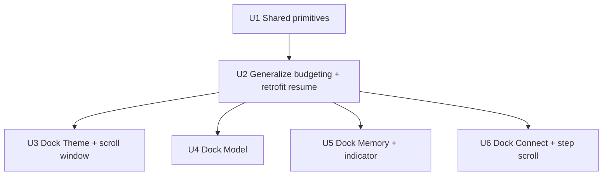

# feat: Dock TUI command surfaces at half height with a clear border

## Summary

Convert the four full-screen slash surfaces (`/theme`, `/model`, `/login`, `/memory`) into bottom-docked
popups rendered inside `HomeScreen`, so the transcript stays visible above them. Introduce a shared
half-height cap (`⌊rows/2⌋`), a shared accent-colored top separator, and internal scrolling on overflow,
and retrofit the existing resume panel through the same primitives. `/help` remains the only full-screen
surface. The implementation keeps the current `activeSurfaceAtom`/Esc wiring and unifies all popups behind
one derived "a popup is docked" selector, mirroring the landed resume-picker dock (see origin).

---

## Problem Frame

Opening `/theme`, `/model`, `/login`, or `/memory` today swaps the entire home screen for a full-screen
surface (`tui/src/App.tsx` renders the surface *instead of* `HomeScreen`), so the transcript disappears and
there is no visual boundary between the popup and the conversation. The resume panel already solves this
(docked, transcript visible, top divider) but it is uncapped and its divider is uncolored. See origin for
the full problem framing.

---

## Requirements

- R1. `/theme`, `/model`, `/login`, and `/memory` render as bottom-docked popups inside `HomeScreen`, keeping the transcript body visible above them.
- R2. Every command popup — `/theme`, `/model`, `/login`, `/memory`, and the resume panel — occupies at most `⌊rows/2⌋`, counting separator + content + footer together.
- R3. A popup sizes to its content up to the cap; it may be shorter than half when content fits.
- R4. `/help` is exempt and stays full-screen. **Covered by the unchanged App `Help` branch** — no code unit required; U2 adds a guard test asserting `/help` renders full-screen with `activeDockedPanelAtom` null.
- R5. Each docked popup renders an accent-colored top separator rule at the safe content width as the body/popup boundary.
- R6. When content exceeds the capped height, the popup scrolls internally so every item stays reachable, with a position indicator when content is clipped.
- R7. While a docked popup is open, the cwd/composer/status rows are hidden and the popup owns its footer; the transcript remains scrollable.
- R8. `tui/AGENTS.md` documents the convention (bottom-docked, ≤ half height, accent border, internal scroll, `/help` exempt). **Already satisfied** — the `## Command surfaces` section was added during brainstorming; no code unit required.

**Origin acceptance examples:** AE1 (covers R2, R4), AE2 (covers R6), AE3 (covers R2, R3).

---

## Scope Boundaries

- `/help` stays full-screen and otherwise unchanged.
- No change to the internal content, data, or flows of each surface (theme catalog, model/connect logic, memory modes and forms) beyond height, docking, border, and scrolling.
- The `/`-autocomplete command menu is out of scope — it is already a small, height-capped menu above the composer.
- No four-sided box border; the boundary is the accent top rule only.
- No new provider, model, theme, or memory capabilities.

### Deferred to Follow-Up Work

- Refactoring the three existing highlight/offset movers (`moveResumeHighlightAtom`, `moveMemoryHighlightAtom`, model `ensureVisible`) to consume the extracted offset helper. This plan extracts the helper and uses it for the *new* theme/connect windows; migrating the existing callers is a low-risk cleanup that can follow.
- Capturing the generalized "docked command surface" pattern in `docs/solutions/` via `/ce-compound` after this lands.

---

## Context & Research

### Relevant Code and Patterns

- **Dock composition to mirror:** `tui/src/components/ResumePanel/index.tsx` (divider → accent label → windowed rows → footer at `height={panelRows}`), `tui/src/components/HomeScreen/HomeScreenView.tsx` (`HomeBottomStack`, `HomeComposer`/`HomeStatusBar` null-returns, wheel/click `useInput` guards on `resumePanelOpenAtom`).
- **Row budgeting:** `tui/src/state/ui/atoms.ts` (`resumePanelRowsAtom`, `cwdRowsAtom`, `commandMenuRowsAtom`, `bottomSpacerRowsAtom`, `layoutAtom`) and `tui/src/libs/tui/layout.ts` (`resolveHomeScreenLayout` resume-open branch). Row budget is subtracted **in two places** (`resolveHomeScreenLayout` and `bottomSpacerRowsAtom`) — both must handle the docked state or a gap appears.
- **Half-cap primitive:** `COMPOSER_MAX_HEIGHT_DIVISOR = 2` in `tui/src/constants/ui.ts`, applied inline in `resolveHomeScreenLayout`. No reusable helper exists yet.
- **Surface routing / Esc:** `tui/src/App.tsx` `switch (activeSurface)`; Esc closes via `closeActiveSurfaceAtom`; `modelSurfaceConsumesEscAtom` / `memorySurfaceConsumesEscAtom` defer Esc; `ConnectSurface` self-owns Esc (already excluded from App's Esc branch). Openers in `tui/src/state/ui/surface/atoms.ts`.
- **Scroll windows (existing):** model (`tui/src/state/ui/model/atoms.ts`: `modelWindowOffsetAtom`, `visibleModelRowsAtom`, `ensureVisible`), memory (`tui/src/state/ui/memory/atoms.ts`: `memoryWindowOffsetAtom`, `visibleMemoryItemsAtom`), resume (`tui/src/state/ui/resume/atoms.ts`). Model and resume also render a `more`/`top`/`end` indicator; **memory has a window but no indicator.**
- **Scroll windows (net-new needed):** `ThemeSurface` — `ThemeRows` (`tui/src/components/ThemeSurface/ThemeRows.tsx`) renders `themes[index]` with no offset; `THEME_CATALOG` is 6 fixed entries (`tui/src/theme/themeCatalog.ts`) that clip under the cap at small heights. `ConnectSurface` — step-based (`ProviderList`, `CustomForm`, `ConnectedActions`), no window or height budget.
- **Safe width:** all glyph content must route through `safeChromeColumnsAtom` (the physical last column is a reserved gutter); background boxes need an explicit `width`.
- **Test harness:** `tui/src/test/renderWithJotai.tsx`; dimension seams `columnsTestOverrideAtom`/`rowsTestOverrideAtom` (`tui/src/state/ui/dimensions.ts`, clamps rows ≥ `MIN_ROWS` 15); per-surface `testUtils.tsx`; input keys `ARROW_DOWN='\u001B[B'`, `ARROW_UP='\u001B[A'`, `ENTER='\r'`; `flushInput`/`waitUntil`. Templates: `tui/src/state/ui/__tests__/layout.test.ts`, `tui/src/libs/tui/__tests__/layout.test.ts`, `tui/src/__tests__/components/HomeScreen.test.tsx`, `ModelSurface`/`ResumeSurface` scroll tests.

### Institutional Learnings

- `docs/plans/2026-07-04-001-feat-tui-composer-height-cap-scroll-plan.md` — the half-cap + internal-scroll pattern already built for the composer: cap the whole box via `min(bodyBudget, ⌊rows/2⌋ − chrome)` floored at 1; keep the resolver pure in `libs/`; do **not** reset scroll offset on resize, re-clamp the visible window every render.
- `docs/plans/2026-07-10-002-feat-resume-picker-bottom-dock-plan.md` — the docking composition: docked = open-state atom rendered inside `HomeScreen` (not an App switch); row budget zeroed in two atoms; the panel rows already include the divider (don't double-subtract); **no automated cursor test — manually verify the caret returns to the composer row on close.**
- `docs/solutions/architecture-patterns/terminal-edge-rendering-tradeoffs-in-the-ink-tui.md` — route all glyphs through `safeChromeColumnsAtom`; pin explicit `width` on any background band; the `FULLSCREEN_GUARD_ROWS ↔ INK_CURSOR_ROW_ORIGIN_OFFSET` pair is a coupled knob — do not touch it.
- `docs/solutions/architecture-patterns/state-libs-layering-and-cycle-verification-in-the-ink-tui.md` — pure math lives in `libs/` and must never import `@state`; the repo's custom cycle detector is authoritative (`madge --circular` gives a false pass here).

---

## Key Technical Decisions

- **Render docked inside `HomeScreen`, keep `activeSurfaceAtom`:** App renders `HomeScreen` for `Home` and the four docked surfaces, and full-screen only for `Help`. The four surfaces keep their `activeSurfaceAtom` value, existing openers, Esc handling, and `consumesEsc` atoms — all of which continue to work because `activeSurface` is non-`Home` for them. Rationale: lowest churn, reuses mature Esc/consumesEsc logic, avoids reworking resume's open/close wiring. *(Alternative considered: give each surface a resume-style `xPanelOpenAtom` triad and move Esc into each hook — fully mirrors resume but requires four new triads, relocating Esc, and rewiring openers; higher regression risk for no functional gain.)*
- **Unify via a derived selector, in a dedicated coordinator module:** `activeDockedPanelAtom` returns the docked panel id (`resume` | `theme` | `model` | `connect` | `memory`) or `null`. To avoid a `state/ui/surface` ↔ `state/ui/resume` import cycle (the selector needs `resumePanelOpenAtom`, and the mutual-exclusion openers need `closeActiveSurfaceAtom`), the selector, the `DockedPanel` id type, and the mutual-exclusion opener wiring live in a **new coordinator module `state/ui/dock/atoms.ts`** that imports both surface and resume; those two modules never import each other. Layout budgeting, bottom-stack rendering, composer/status suppression, and the `HomeScreenView` wheel/click guards all key off this single predicate. Mutual exclusion: opening a surface closes resume; opening resume resets `activeSurface` to `Home`; the `Help` opener also closes resume; the selector defines a precedence so at most one id is ever active.
- **Ownership split across units:** U1 scaffolds the `DockedPanel` id type and a selector returning `resume | null` (Home/Help → null) plus the coordinator skeleton; U3–U6 each add their own `activeSurface`→id branch (and desired-rows branch, below). U1's unit test asserts only the resume/Home/Help mappings it wires.
- **Per-surface desired height + one numeric budget:** `dockedPanelDesiredRowsAtom` dispatches on `activeDockedPanelAtom` to each panel's content-derived height (resume → `RESUME_PANEL_ROWS`; theme/model/memory/connect → their own `xDesiredRowsAtom`, added in U3–U6), and numeric `dockedPanelRowsAtom = resolveDockedPanelRows({ rows, desiredRows: dockedPanelDesiredRows })` is the single height source that `resumePanelRowsAtom`, `layoutAtom`, `bottomSpacerRowsAtom`, and each surface component read. This honors R3 (size to content) and prevents the 1-row under-reservation a resume-only desired-rows source would cause when another surface is docked.
- **Shared half-cap + offset helpers in `libs/tui`:** a `resolveDockedPanelRows({ rows, desiredRows })` cap helper (`clamp(min(desiredRows, ⌊rows/POPUP_MAX_HEIGHT_DIVISOR⌋), 1, rows − HOME_HEADER_ROWS − 1)`, where `HOME_HEADER_ROWS` is the home-screen header constant `= 1` in `libs/tui/layout.ts` — distinct from the per-surface header rows noted in Open Questions) and a `resolveWindowOffset` scroll helper (extracting the clamp expression duplicated across resume/memory/model). New constant `POPUP_MAX_HEIGHT_DIVISOR = 2`.
- **Shared accent `DockDivider` component:** one component renders `─` at `safeChromeColumns` width in `theme.colors.accentBlue`, used by all five popups (retrofitting resume's currently-uncolored divider).
- **One scroll-indicator vocabulary for all popups:** standardize on `more ↑` / `more ↓` / `more ↑↓`; U4 retrofits model's divergent `top`/`end`/`more ↓` to match, so all five popups show the same affordance (origin R6's "consistent affordance").
- **Form and inline sub-states render in place of the list, not stacked below it:** for the multi-field sub-states (memory add/edit form, model inline-connect, connect custom form + key entry), the popup shows the sub-state (active field + label + inline error + connect outcome) with compact chrome **instead of** the list, so the essentials stay visible within `⌊rows/2⌋` even at `MIN_ROWS`. Lists use the scroll window; forms are never list-windowed (which would push the active field/error off-screen).
- **Net-new scroll windows:** theme and connect (provider list) get list windows; model, memory, resume already window. Memory additionally gains a `more ↑↓` indicator **and a detail-view line-window + indicator** (its read-only detail body has no window today, so a long memory would clip under the cap — R6).
- **Layering:** new cap/offset math goes in `libs/tui` and must not import `@state`; docked-panel coordination lives in `state/ui/dock/atoms.ts`; per-surface window state lives in `state/ui/{theme,connect}/atoms.ts`.

---

## Open Questions

### Resolved During Planning

- Unify the four into a resume-style docked mechanism vs. keep the switch and render docked → **keep `activeSurfaceAtom`, render docked, unify via a derived selector** in a `state/ui/dock/` coordinator (see Key Technical Decisions).
- Does `/login` need a scroll window → **yes** (U6); theme needs one too (U3), a case unflagged by the origin doc.
- Exact half-cap rounding → `⌊rows/2⌋` via `POPUP_MAX_HEIGHT_DIVISOR`, applied as `min(desired, ⌊rows/2⌋)` and clamped to keep ≥ 1 body row.
- Where does `desiredRows` come from for the four surfaces → a per-surface content-derived `xDesiredRowsAtom` via `dockedPanelDesiredRowsAtom` (honors R3), never a fixed half.
- How do form/inline sub-states fit the cap at `MIN_ROWS` → they render **in place of** the list with compact chrome, pinning the active field + label + inline error + connect outcome (see Key Technical Decisions).
- `activeDockedPanelAtom` ownership + import cycle → coordinator module `state/ui/dock/atoms.ts`; U1 scaffolds `resume | null`, U3–U6 add branches.
- Scroll-indicator vocabulary → standardized to `more ↑`/`more ↓`/`more ↑↓` across all five popups.

### Deferred to Implementation

- Exact per-surface chrome trimming to hit the fit contract at `MIN_ROWS = 15` (cap = 7): which decorative rows each surface drops first (compression order from origin: preserve label + ≥ 1 content/input row, then drop hints → header → divider last). The per-surface local `HEADER_ROWS` (`ThemeSurface`/`ModelSurface` = 3, `MemorySurface` = 4) are distinct from the home-screen `HOME_HEADER_ROWS = 1` used in the cap formula.
- Connect provider-list window sizing vs. the collapse-list-while-in-a-form-step composition — settle the exact render output when touching the code.

---

## High-Level Technical Design

> *This illustrates the intended approach and is directional guidance for review, not implementation specification. The implementing agent should treat it as context, not code to reproduce.*

Render routing and row budget after the change:

```text
App
 ├─ terminalTooSmall            → TerminalTooSmall
 ├─ activeSurface === Help      → HelpScreen        (full-screen; the only exempt surface)
 └─ otherwise                   → HomeScreen
        Header
        Body (transcript — always visible)
        activeDockedPanel !== null ?
            DockDivider  (accent rule, safeChromeColumns)         │ replaces cwd + composer + status
            <docked panel: resume | theme | model | connect | memory>   (height = dockedPanelRows, scrolls)
          : cwd  +  slash-menu  +  composer  +  status

desiredRows     = dockedPanelDesiredRowsAtom     (dispatches on the active panel to its content-derived height)
dockedPanelRows = clamp( min(desiredRows, ⌊rows / POPUP_MAX_HEIGHT_DIVISOR⌋), 1, rows − HOME_HEADER_ROWS − 1 )
bodyRows        = rows − HOME_HEADER_ROWS − dockedPanelRows               (≥ 1, mirrored in bottomSpacerRowsAtom)
                                                 (HOME_HEADER_ROWS = home-screen header = 1, distinct from
                                                  per-surface header rows)
```

Unit dependency graph:



---

## Implementation Units

### U1. Shared docked-popup primitives

**Goal:** Add the shared primitives every popup will consume, with no visible behavior change yet.

**Requirements:** R2, R3, R5, R6

**Dependencies:** None

**Files:**
- Modify: `tui/src/constants/ui.ts` (add `POPUP_MAX_HEIGHT_DIVISOR = 2`)
- Modify: `tui/src/libs/tui/layout.ts` (add `resolveDockedPanelRows`, `resolveWindowOffset`; expose `HOME_HEADER_ROWS = 1`)
- Create: `tui/src/components/DockDivider.tsx` (accent top rule at `safeChromeColumns`)
- Create: `tui/src/state/ui/dock/atoms.ts` (coordinator: `DockedPanel` id type, `activeDockedPanelAtom` returning `resume | null` for now, mutual-exclusion opener wiring; imports both surface + resume so neither imports the other)
- Modify: `tui/src/state/ui/surface/atoms.ts` / `tui/src/state/ui/resume/atoms.ts` (route opens through the coordinator; must **not** import each other)
- Test: `tui/src/libs/tui/__tests__/layout.test.ts`, `tui/src/components/__tests__/DockDivider.test.tsx`, `tui/src/state/ui/dock/__tests__/atoms.test.ts`

**Approach:**
- `resolveDockedPanelRows` caps the whole panel box (`min(desired, ⌊rows/DIVISOR⌋)` clamped to `[1, rows − HOME_HEADER_ROWS − 1]`, where `HOME_HEADER_ROWS = 1`).
- `resolveWindowOffset` extracts the `clamp(next < offset ? next : max(offset, next − visible + 1), 0, maxOffset)` expression.
- `activeDockedPanelAtom` (in the new `state/ui/dock/` coordinator) returns the single active docked id or `null`; U1 wires only `resume | null`, and U3–U6 add each surface branch. The coordinator imports both `surface` and `resume` so those two modules never import each other (avoids the `@state`-internal cycle the repo's detector would fail on).

**Patterns to follow:** `resolveHomeScreenLayout` (co-locate helpers), `resumePanelDesiredRowsAtom`/`commandMenuOpenAtom` (selector shape), `ResumePanel` `Divider` (safe-width rule).

**Test scenarios:**
- Happy path: `resolveDockedPanelRows({ rows: 24, desiredRows: 14 })` → 12; `{ rows: 40, desiredRows: 6 }` → 6 (content shorter than cap, R3).
- Edge case: `{ rows: 15, desiredRows: 20 }` → `⌊15/2⌋ = 7` clamped so ≥ 1 body row remains (R2/AE3); `{ rows: 15, desiredRows: 1 }` → 1.
- Happy path: `resolveWindowOffset` keeps a visible index unchanged; scrolls minimally when the index is above/below the window; clamps to `[0, maxOffset]`.
- Happy path: `activeDockedPanelAtom` returns `resume` when the resume panel is open and `null` for `Home`/`Help` (surface branches are added and tested in U3–U6); opening resume then a surface leaves exactly one active id (mutual exclusion).
- Edge case: the repo's custom cycle detector passes — `state/ui/surface` and `state/ui/resume` do not import each other.
- Happy path: `DockDivider` renders a single row of `─` at `safeChromeColumns` width in the accent color.

**Verification:** New helpers/atoms exist and are unit-tested; the repo's custom cycle detector reports no new `@state` cycle; `cargo xtask tui-typecheck` and `cargo xtask tui-test` pass with no behavior change on screen.

---

### U2. Generalize home-screen budgeting/routing and retrofit the resume panel

**Goal:** Make the layout budget, bottom stack, and input routing treat "any docked panel" the way they treat resume today, and route the resume panel through the shared cap + accent divider — delivering resume's ≤ half height and accent border and proving the seam end-to-end.

**Requirements:** R2, R4, R5, R7

**Dependencies:** U1

**Files:**
- Modify: `tui/src/state/ui/dock/atoms.ts` (add `dockedPanelDesiredRowsAtom` dispatch — resume → `RESUME_PANEL_ROWS`, others added in U3–U6 — and numeric `dockedPanelRowsAtom = resolveDockedPanelRows({ rows, desiredRows })`)
- Modify: `tui/src/libs/tui/layout.ts` (`resolveHomeScreenLayout` docked branch keyed off a docked-panel-open flag, using the passed docked-panel rows; `HOME_HEADER_ROWS`)
- Modify: `tui/src/state/ui/atoms.ts` (`resumePanelRowsAtom` becomes a read of `dockedPanelRowsAtom`; `cwdRowsAtom`, `commandMenuRowsAtom`, `bottomSpacerRowsAtom`, `layoutAtom` key off `activeDockedPanelAtom`/`dockedPanelRowsAtom`)
- Modify: `tui/src/components/HomeScreen/HomeScreenView.tsx` (`HomeBottomStack`/`HomeComposer`/`HomeStatusBar` and the wheel/click `useInput` guards key off `activeDockedPanelAtom`)
- Modify: `tui/src/components/ResumePanel/index.tsx` (use shared `DockDivider`; read height from `dockedPanelRowsAtom`)
- Test: `tui/src/state/ui/__tests__/layout.test.ts`, `tui/src/libs/tui/__tests__/layout.test.ts`, `tui/src/__tests__/components/HomeScreen.test.tsx`, `tui/src/components/ResumeSurface/__tests__/ResumeSurface.test.tsx`

**Approach:**
- Generalize the resume-open branch to a docked-open branch; the panel rows come from the numeric `dockedPanelRowsAtom`, and `bottomSpacerRowsAtom` reads the same atom so the two subtractions agree.
- Because `layoutAtom`/`bottomSpacerRowsAtom` read the unified `dockedPanelRowsAtom` (fed by `dockedPanelDesiredRowsAtom`), U3–U6 wire a new surface only by adding a desired-rows branch + a selector branch — they do **not** re-edit `layoutAtom`/`resolveHomeScreenLayout`.
- Swap resume's uncolored divider for `DockDivider`.
- Only resume is docked at this point; the four surfaces still render full-screen via App (unchanged until U3–U6).

**Execution note:** Update the existing resume layout assertion — resume rows change from 14 to 12 at `rows=24`, so `bodyRows` becomes `rows − HOME_HEADER_ROWS − 12`.

**Patterns to follow:** the current resume branch in `resolveHomeScreenLayout` and the `resumePanelOpenAtom` guards in `HomeScreenView`.

**Test scenarios:**
- Happy path (Covers AE1): with resume open at `rows=24`, `layoutAtom.bodyRows === 24 − HOME_HEADER_ROWS − resolveDockedPanelRows({rows:24,desiredRows:RESUME_PANEL_ROWS})` (i.e. 12), `layout.cwdRows === 0`, `bottomSpacerRowsAtom === 0`.
- Edge case (Covers AE3): at `MIN_ROWS=15`, resume panel ≤ `⌊15/2⌋` with `bodyRows ≥ 1`; total rows never exceed the canvas.
- Integration: `<App/>` with resume open keeps the transcript body visible, hides the composer (`> ` absent) and cwd (R7).
- Happy path (R5): the resume panel's top rule renders at `safeChromeColumns` width in the accent color.
- Edge case: the transcript body still scrolls (wheel/PageUp) while resume is open.
- Happy path (Covers AE1, R4): with `activeSurface === Help` at `rows=24`, `HelpScreen` renders full-screen (all 24 rows), `activeDockedPanelAtom` is `null`, and composer/cwd/status are not suppressed.
- Invariant (caret guard): for resume open at `rows=24` and `MIN_ROWS`, `HOME_HEADER_ROWS + layout.bodyRows + dockedPanelRows === rows` — locks the row arithmetic that positions the caret (the drift-prone value with no cursor test).

**Verification:** Resume opens docked at ≤ half height with an accent top rule; transcript visible and scrollable; composer/status/cwd hidden; caret returns to the composer row on close (manual check).

---

### U3. Dock the theme surface with a scroll window

**Goal:** Render `/theme` as a docked half-height popup and give it an internal scroll window so its 6-entry catalog stays reachable under the cap.

**Requirements:** R1, R2, R3, R5, R6, R7

**Dependencies:** U1, U2

**Files:**
- Modify: `tui/src/App.tsx` (drop the `Theme` full-screen branch → falls through to `HomeScreen`)
- Modify: `tui/src/state/ui/dock/atoms.ts` (`activeDockedPanelAtom` + `dockedPanelDesiredRowsAtom` add the `theme` branch)
- Modify: `tui/src/components/HomeScreen/HomeScreenView.tsx` (render `ThemeSurface` docked when the active panel is `theme`)
- Modify: `tui/src/state/ui/theme/atoms.ts` (add `themeWindowOffsetAtom`, `themeVisibleRowsAtom`, `visibleThemesAtom`, and `themeDesiredRowsAtom` = catalog length + chrome; recompute offset via `resolveWindowOffset` in `moveThemeHighlightAtom`)
- Modify: `tui/src/components/ThemeSurface/index.tsx` (docked layout: `DockDivider` + capped body + footer with `more ↑↓`), `tui/src/components/ThemeSurface/ThemeRows.tsx` (render from the window offset)
- Test: `tui/src/components/ThemeSurface/__tests__/ThemeSurface.test.tsx`, `tui/src/state/ui/theme/__tests__/atoms.test.ts`

**Approach:**
- Replace the full-screen `<Box height={rows}>` wrapper with the docked shell; height from `resolveDockedPanelRows`; feed `themeVisibleRowsAtom` the capped body rows.
- `ThemeRows` renders `themes[offset + index]`; the footer shows the `more ↑↓` indicator when clipped.
- Esc already closes via App's Esc branch (`activeSurface === Theme` → `Home`); no Esc relocation needed.

**Patterns to follow:** model's window (`visibleModelRowsAtom`, `ensureVisible`) and footer indicator; resume's docked shell.

**Test scenarios:**
- Integration: opening `/theme` keeps the transcript visible and hides composer/cwd/status (R1/R7).
- Edge case (Covers AE3): at a small height the docked theme popup is ≤ `⌊rows/2⌋`; the highlighted theme below the fold scrolls into view and an off-screen theme is absent from the frame.
- Happy path (Covers AE2): navigating past the last visible theme shows `more ↑↓`.
- Happy path: arrow keys move the highlight without applying a theme; Enter still applies/persists/closes (existing behavior preserved).
- Happy path (R5): accent top rule present at `safeChromeColumns`.
- Edge case: Esc closes the popup and the caret returns to the composer row (manual caret check).

**Verification:** `/theme` docks at ≤ half height with the transcript above, scrolls through all 6 themes at `MIN_ROWS`, and closes cleanly with the caret back on the composer.

---

### U4. Dock the model surface

**Goal:** Render `/model` as a docked half-height popup, reusing its existing scroll window and keeping the inline-connect key entry within the cap.

**Requirements:** R1, R2, R3, R5, R6, R7

**Dependencies:** U1, U2

**Files:**
- Modify: `tui/src/App.tsx` (drop the `Model` full-screen branch)
- Modify: `tui/src/state/ui/dock/atoms.ts` (`activeDockedPanelAtom` + `dockedPanelDesiredRowsAtom` add the `model` branch)
- Modify: `tui/src/state/ui/model/atoms.ts` (add `modelDesiredRowsAtom` = row count + chrome, or the inline-connect essentials when inline connect is active)
- Modify: `tui/src/components/HomeScreen/HomeScreenView.tsx` (render `ModelSurface` docked)
- Modify: `tui/src/components/ModelSurface/index.tsx` (docked layout; feed `modelVisibleRowsAtom` the capped body rows; when inline connect is active, render the connect essentials **in place of** the list; standardize the footer indicator to `more ↑`/`more ↓`/`more ↑↓`)
- Test: `tui/src/components/ModelSurface/__tests__/ModelSurface.test.tsx`

**Approach:**
- Reuse `modelWindowOffsetAtom`/`visibleModelRowsAtom`; the height source is the capped `dockedPanelRowsAtom`.
- When inline connect is active, show the connect essentials (API-key row + outcome) **in place of** the model list so they fit within the cap at `MIN_ROWS` (list + inline-connect stacked would exceed `⌊15/2⌋`).
- Retrofit model's `top`/`end`/`more ↓` footer to the shared `more ↑`/`more ↓`/`more ↑↓` vocabulary.
- `modelSurfaceConsumesEscAtom` and App's deferred-Esc handling continue to work (activeSurface stays `Model` during inline connect).

**Patterns to follow:** U3's docked shell; the existing model window and footer indicator.

**Test scenarios:**
- Integration: opening `/model` keeps the transcript visible; composer/cwd/status hidden (R1/R7).
- Edge case (Covers AE1): at `rows=24` the popup is ≤ 12 rows; the active model is scrolled into view and a model above the fold is absent (reuse the existing small-height scroll test at the capped size).
- Edge case (Covers AE3): at `MIN_ROWS=15`, activating inline connect renders the API-key row + outcome in place of the list, all within `⌊15/2⌋`, with the footer visible; `Esc` cancels inline connect (does not close the popup).
- Happy path: the footer indicator uses the shared `more ↑`/`more ↓`/`more ↑↓` vocabulary (matching resume/theme/memory/connect).
- Happy path (R5): accent top rule at `safeChromeColumns`.
- Edge case: Esc from the list closes the popup; caret returns to the composer row (manual check).

**Verification:** `/model` docks at ≤ half height, scrolls its provider/model list, inline connect works within the cap, and it closes with the caret restored.

---

### U5. Dock the memory surface and add a scroll indicator

**Goal:** Render `/memory` as a docked half-height popup, reusing its window and adding the missing `more ↑↓` indicator, with tabs/forms/detail fitting within the cap.

**Requirements:** R1, R2, R3, R5, R6, R7

**Dependencies:** U1, U2

**Files:**
- Modify: `tui/src/App.tsx` (drop the `Memory` full-screen branch)
- Modify: `tui/src/state/ui/dock/atoms.ts` (`activeDockedPanelAtom` + `dockedPanelDesiredRowsAtom` add the `memory` branch)
- Modify: `tui/src/state/ui/memory/atoms.ts` (add `memoryDesiredRowsAtom`; add a detail-view line-window — `memoryDetailOffsetAtom` + visible slice — so long detail bodies scroll)
- Modify: `tui/src/components/HomeScreen/HomeScreenView.tsx` (render `MemorySurface` docked)
- Modify: `tui/src/components/MemorySurface/index.tsx` (docked layout; feed `memoryVisibleRowsAtom` the capped list rows; add `more ↑↓` indicator for both the list and the detail view; form/detail render in place of the list with compact chrome)
- Test: `tui/src/components/MemorySurface/__tests__/MemorySurface.test.tsx`

**Approach:**
- Reuse `memoryWindowOffsetAtom`/`visibleMemoryItemsAtom`/`visibleInboxEntriesAtom`; add the list position indicator memory currently lacks.
- Give the read-only detail view its own line-window + `more ↑↓` indicator so a long memory body is fully reachable under the cap (R6 — the detail body has no window today).
- The add/edit form and detail view already render in place of the list; keep that, dropping the `/memory` header + tabs while a sub-state is open so the active field + label + error fit the cap. `memorySurfaceConsumesEscAtom` + App's deferred-Esc continue to back out sub-state.

**Patterns to follow:** U3's docked shell; resume/model footer indicator; the existing memory window.

**Test scenarios:**
- Integration: opening `/memory` keeps the transcript visible; composer/cwd/status hidden (R1/R7).
- Edge case (Covers AE2, AE3): with more items than fit, the popup is ≤ `⌊rows/2⌋`, the highlight scrolls into view, an off-screen item is absent, and `more ↑↓` shows.
- Edge case (Covers AE3): at `MIN_ROWS=15`, the add/edit form renders in place of the list (compact chrome) with the active field + its inline error visible within `⌊15/2⌋`.
- Happy path (R6): a detail body longer than the capped body scrolls with a `more ↑↓` indicator and every line is reachable.
- Happy path: switching Active/Inbox tabs and backing out sub-states with `Esc` behaves as before (consumesEsc).
- Happy path (R5): accent top rule at `safeChromeColumns`.
- Edge case: Esc closes the popup from the list; caret returns to the composer row (manual check).

**Verification:** `/memory` docks at ≤ half height with a working scroll indicator; tabs/forms/detail render within the cap; closes with the caret restored.

---

### U6. Dock the connect (`/login`) surface with step-content scrolling

**Goal:** Render `/login` as a docked half-height popup and add overflow handling so its step-based content (provider list, connected actions, custom form, key entry) fits within the cap at small heights.

**Requirements:** R1, R2, R3, R5, R6, R7

**Dependencies:** U1, U2

**Files:**
- Modify: `tui/src/App.tsx` (drop the `Connect` full-screen branch)
- Modify: `tui/src/state/ui/dock/atoms.ts` (`activeDockedPanelAtom` + `dockedPanelDesiredRowsAtom` add the `connect` branch)
- Modify: `tui/src/components/HomeScreen/HomeScreenView.tsx` (render `ConnectSurface` docked)
- Modify: `tui/src/state/ui/connect/atoms.ts` (add `connectDesiredRowsAtom` per step; provider-list window offset/visible atoms via `resolveWindowOffset`)
- Modify: `tui/src/components/ConnectSurface/index.tsx` (docked layout; on a form/key step, render that step **in place of** the provider list, pinning Base URL/Label/API-key + inline error + connect outcome), `tui/src/components/ConnectSurface/ProviderList.tsx` (render from the window offset), footer `more ↑`/`more ↓`/`more ↑↓` where the list scrolls
- Test: `tui/src/components/ConnectSurface/__tests__/ConnectSurface.test.tsx`, `tui/src/state/ui/connect/__tests__/atoms.test.ts`

**Approach:**
- Add a provider-list window (mirroring theme/model). On a form or key step, render that step **in place of** the provider list (list + form stacked would exceed the cap today) so the active field + its inline error + the connect outcome stay visible within `⌊rows/2⌋`.
- `RequestErrorMessage`/`OutcomeMessage` rows are pinned above hints in the compression order so a failed connect is never silently clipped.
- Connect already self-owns Esc (`useConnectInput` → `closeActiveSurface`/`backConnectStep`); it is already excluded from App's Esc branch, so docking needs no Esc change.

**Patterns to follow:** U3's docked shell; the theme/model windows; `useConnectInput`'s existing step/Esc handling.

**Test scenarios:**
- Integration: opening `/login` keeps the transcript visible; composer/cwd/status hidden (R1/R7).
- Edge case (Covers AE3): at `MIN_ROWS=15` the popup is ≤ 7 rows; each step (provider list, connected actions, custom URL/label, key entry) renders in place with ≥ 1 usable input row; a failed connect's error/outcome row stays visible; a long provider list scrolls with `more ↑`/`more ↓`/`more ↑↓`.
- Happy path: navigating the provider list and each step still works; `Esc`/back navigation behaves as before.
- Happy path (R5): accent top rule at `safeChromeColumns`.
- Edge case: masked key entry stays within the cap; closing returns the caret to the composer row (manual check).

**Verification:** `/login` docks at ≤ half height, every step fits (scrolling where needed) down to `MIN_ROWS`, and it closes with the caret restored.

---

## System-Wide Impact

- **Interaction graph:** `activeSurfaceAtom`, `resumePanelOpenAtom`, and the new `activeDockedPanelAtom` now jointly drive `App` routing, `HomeScreenView` (bottom stack + wheel/click `useInput`), and the layout atoms. Two `useInput` owners (HomeScreen + the docked surface) are mounted at once — the generalized "any docked popup" guard keeps wheel routed to body-scroll and clicks ignored so they do not fight the surface's arrow-key nav.
- **Error propagation:** unchanged — surface backend loads/failures render inside the capped body exactly as before.
- **State lifecycle risks:** scroll offsets must re-clamp every render (not reset on resize); openers must keep resume and the four surfaces mutually exclusive so only one docked panel is active.
- **API surface parity:** the shared `resolveDockedPanelRows` + `DockDivider` are the single enforcement point for R2/R5 across all five popups — parity is the goal, not a risk.
- **Unchanged invariants:** `/help` stays full-screen; each surface's data/flows are unchanged; all glyphs route through `safeChromeColumnsAtom`; the `FULLSCREEN_GUARD_ROWS ↔ INK_CURSOR_ROW_ORIGIN_OFFSET` pair is untouched; exactly one blank row remains between body and cwd when no popup is open.

---

## Risks & Dependencies

| Risk | Mitigation |
|------|------------|
| Caret drifts off the composer row after a popup closes (no cursor test in the harness) | Manual caret check on open *and* close per surface, **plus** the numeric invariant `HOME_HEADER_ROWS + bodyRows + dockedPanelRows === rows` (U2) that regression-locks the row arithmetic; do not touch the guard-row/cursor-offset pair. |
| Docked surface reserves 1 row (desired-rows resolves to 0) → body/panel overlap | `dockedPanelDesiredRowsAtom` dispatches to each surface's content-derived height; layout tests assert numeric `bodyRows` + reserved rows for **each** docked surface at `rows=24` and `MIN_ROWS`. |
| Form/inline sub-states can't fit ≥ 1 input row at `MIN_ROWS` (memory form, model inline-connect, connect form) | Sub-states render in place of the list with compact chrome, pinning active field + label + inline error + outcome; per-sub-state fit tests at `rows=15..20` (U4–U6). |
| `state/ui/surface` ↔ `state/ui/resume` import cycle from the selector + mutual-exclusion openers | Put `activeDockedPanelAtom` + opener wiring in the `state/ui/dock/` coordinator that imports both; run the repo's custom cycle detector as a U1 verification step (`madge --circular` gives a false pass here). |
| Concurrent agent/IDE sessions editing hot files (`App.tsx`, `layout.ts`, `HomeScreenView.tsx`, `state/ui/*`) | Re-read files immediately before batch edits; commit each unit atomically. |

---

## Sources & References

- **Origin document:** [docs/brainstorms/2026-07-10-tui-command-surface-half-height-cap-requirements.md](docs/brainstorms/2026-07-10-tui-command-surface-half-height-cap-requirements.md)
- Precedent plans: `docs/plans/2026-07-04-001-feat-tui-composer-height-cap-scroll-plan.md`, `docs/plans/2026-07-10-002-feat-resume-picker-bottom-dock-plan.md`
- Learnings: `docs/solutions/architecture-patterns/terminal-edge-rendering-tradeoffs-in-the-ink-tui.md`, `docs/solutions/architecture-patterns/state-libs-layering-and-cycle-verification-in-the-ink-tui.md`
- Convention: `tui/AGENTS.md` (`## Command surfaces`)
