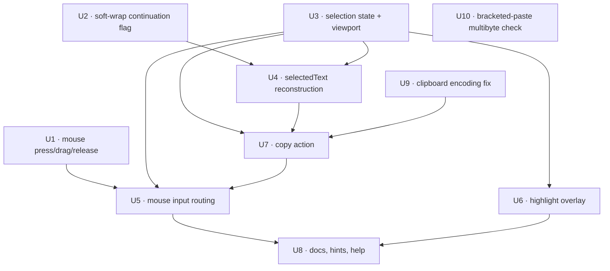

# feat: In-app text selection and lossless copy/paste round-trip in the TUI

## Summary

Replace the terminal-delegated Copy Mode with an in-app selection model: keep the mouse captured, track
press/drag/release, render KQode's own selection highlight over the transcript, and reconstruct **clean
logical text** (trailing whitespace trimmed, markers/gutter excluded, soft-wrapped rows rejoined) from
KQode's own body-row model + scroll offset, written through the existing injected clipboard seam. This
eliminates the bloated-copy / Windows-Terminal "text longer than 5 KiB" paste warning across the whole
transcript — including full-width themed rows, user-message bubbles, and composer — and reverses the
"delegate selection to the terminal via Copy Mode" decision from `docs/plans/2026-07-05-004-feat-tui-copy-paste-and-selection-plan.md`.

It also folds in the two round-trip fidelity defects from `docs/brainstorms/2026-07-11-tui-copy-paste-roundtrip-fidelity-requirements.md`,
because owning the copy is the natural home for both: reconstruction inherently excludes KQode's scrollbar chrome
(`│`/`┃`) — **Defect 1** — and a one-place fix to the shared clipboard helper makes non-ASCII (CJK / emoji /
box-drawing) round-trip losslessly on Windows in **both** copy and paste — **Defect 2**.

---

## Problem Frame

Today `Ctrl+R` Copy Mode disables SGR mouse tracking (`tui/src/components/HomeScreen/HomeScreenView.tsx:68`)
so the host terminal does native selection/copy. Because KQode paints a full-width themed background across
the root and every body row (`tui/src/components/BodyPane.tsx:97`, `HomeScreen/HomeScreenView.tsx:172`), the
terminal captures every trailing background-painted cell as untrimmed whitespace. A selection spanning ~30
wide rows exceeds 5 KiB, so Windows Terminal's `largePasteWarning` fires on paste even though the visible
text is small. Reference agents avoid this: Codex never captures the mouse and paints no full-screen
background; Gemini scopes backgrounds to elements; Claude Code owns selection and copies clean text via its
own screen model. KQode uniquely combines terminal-delegated copy with an edge-to-edge painted background,
so it is the only one that reproduces the bug.

Two follow-on round-trip defects (from the 2026-07-11 fidelity brainstorm) are folded in. **Defect 1:**
terminal-native drag-copy sweeps KQode's own scrollbar glyphs (`SCROLLBAR_TRACK '│'` / `SCROLLBAR_THUMB '┃'`,
rendered in `tui/src/components/BodyPane.tsx`) into the copied text — owning the copy removes this by
construction (the scrollbar is a separate render-time cell, never in `BodyRow.text`; see U4). **Defect 2:** the
shared clipboard helper `tui/src/libs/clipboard/systemClipboard.ts` pipes through `powershell`
(`Get-Clipboard -Raw` / `$input | Set-Clipboard`) with Node `encoding: 'utf8'`, but Windows PowerShell uses the
console code page (GBK), so non-ASCII corrupts to `�`/`��` on **both** read and write. That is an independent
encoding bug our copy path also hits; it is fixed once in the helper (see U9).

---

## Requirements

- R1. Selecting transcript text and copying must place **clean logical text** on the clipboard — trailing whitespace trimmed per logical line, gutter/scrollbar column and row markers excluded, soft-wrapped rows rejoined — so a normal selection never trips Windows Terminal's large-paste warning.
- R2. Selection is performed **in-app**: the mouse stays captured and KQode renders its own selection highlight rather than releasing the mouse to the terminal (reverses origin R6).
- R3. `Ctrl+R` toggles selection mode; while active, drag selects, release copies, `PageUp`/`PageDown`/`End` still scroll, and any non-scroll key exits.
- R4. The on-screen selection highlight and the copied text cover **exactly the same range**.
- R5. Selection is **scroll-stable**: scrolling the transcript while a selection exists keeps that selection intact.
- R6. Copy goes through the existing injected clipboard seam (`contracts/clipboard`); no second OS-clipboard path and no native/process clipboard mechanics leak into components or atoms.
- R7. `Ctrl+O` (copy last response) and every existing mouse behavior outside selection mode (wheel scroll, right-click paste, click-to-position caret) remain unchanged.
- R8. Rendering stays edge-safe: the highlight never depends on the reserved final column, and physical→logical row mapping respects the fullscreen cursor origin offset (`INK_CURSOR_ROW_ORIGIN_OFFSET`).
- R9. Copied selection text contains **no KQode-drawn chrome** — no scrollbar glyphs (`│`/`┃`) and no reserved-gutter column (Defect 1; 2026-07-11 brainstorm R1).
- R10. Non-ASCII characters (CJK, emoji, box-drawing, accented) **round-trip losslessly** through the system clipboard: copying writes them intact and pasting inserts them with no `�`/`��` (Defect 2; brainstorm R4–R6).
- R11. The clipboard encoding fix corrects the Windows PowerShell console-code-page mismatch in **both** read and write directions, holds across macOS/Linux/Windows, and degrades gracefully (no crash) where a mechanism cannot guarantee encoding (brainstorm R6–R8).

**Round-trip acceptance examples (2026-07-11 brainstorm):** AE1 → R9 (U4); AE3 → R10 paste (U9); AE4 → R10 copy (U9); AE5 → R11 graceful degrade (U9).

**Reverses origin decision:** `docs/plans/2026-07-05-004-feat-tui-copy-paste-and-selection-plan.md` — *"No custom in-app selection rendering or highlight — selection is delegated to the terminal via Copy Mode."* `Ctrl+O` (origin R10) is preserved.

---

## Scope Boundaries

- Selection applies to the **transcript body only** — not the composer input and not docked command popups (`/theme`, `/model`, `/login`, `/memory`, resume).
- Selection reaches **viewport-visible content**: scroll first, then select. No drag-to-auto-scroll.
- No change to the Rust backend, provider layer, themes' colors (a single new `selectionBackground` token is added), or composer text-editing behavior.
- No change to the *behavior* of `Ctrl+O`, right-click paste, or wheel scrolling outside selection mode — but the **shared clipboard helper's encoding is corrected** (U9, benefiting every consumer) and **bracketed-paste multibyte integrity is verified** (U10).

### Deferred to Follow-Up Work

- **OSC 52 clipboard path** for SSH/remote sessions — the native clipboard seam is used here; OSC 52 is a later enhancement.
- **Drag-to-auto-scroll** (extending the selection past the viewport by dragging to an edge), including scrolled-off-row capture like Claude Code's `captureScrolledRows`.
- **Removing the redundant double-painting** (per-row `bodyBackground` duplicating the OSC 11 `terminalBackground`). Once copy is owned, the duplicate no longer affects copy, so this becomes optional cleanup — a separate PR.
- **Precise sub-column highlight over markdown-segmented rows** — v1 may highlight segmented rows at row granularity; refine to per-segment column precision later. Until then, a partially selected markdown-segmented row is treated as fully selected in **both** the highlight and the copied text, so R4 (highlight = copied range) still holds.
- **Composer / docked-panel selection.**
- Capturing an in-app-selection/clean-copy learning in `docs/solutions/` via `/ce-compound` after this lands (none exists yet for copy/paste/selection).

---

## Context & Research

### Relevant Code and Patterns

- `tui/src/libs/terminal/mouse.ts` — `ENABLE_SGR_MOUSE_TRACKING` (`?1000h?1006h`, press/release only) and the SGR parsers (`parseMouseWheelEvent`, `parseMouseClickEvent`, `parseMouseRightClickEvent`, `isMouseInput`). Needs drag (`?1002h`) + a press/drag/release parser.
- `tui/src/components/HomeScreen/HomeScreenView.tsx` — the mouse-tracking effect (enables/disables on `copyModeActive`), the `useInput` router (wheel→scroll, click→caret, right-click→paste, PageUp/Down/End→scroll), and the vertical stack (`Header` → `HomeBody` → bottom stack → composer → status).
- `tui/src/components/BodyPane.tsx` — computes `allRows = resolveBodyRows(...)`, slices the visible window via `bodyScrollOffsetRowsAtom` (`start = allRows.length - scrollOffset - visibleRows`), renders each row as a full-width `<Box width={visibleColumns} backgroundColor>` with `<Text>` children.
- `tui/src/libs/tui/bodyRows.ts` — `BodyRow`/`BodyRowStructure` (`text`, `marker`, `segments`, `fillColumns`, `backgroundColor`) and the wrap step (`structuralBodyRows` → `toBodyRowsWithEntryGaps`). **No soft-wrap/continuation flag exists** — one must be added for rejoin.
- `tui/src/state/ui/atoms.ts` — `layoutAtom` (`bodyRows`), `maxBodyScrollOffsetRowsAtom`, `bodyScrollOffsetRowsAtom`, `scrollBodyByRowsAtom`, and `composerTopAtom` (`rows - 1 - composerRows`, the 0-based-cursor mapping pattern to mirror for `bodyTop`).
- `tui/src/components/PromptComposer/input/handleCopyLastResponse.ts` — **the closest template**: reconstructs response text and writes via the clipboard seam + transient hint.
- `tui/src/state/global/clipboard.ts` + `tui/src/contracts/clipboard/index.ts` + `tui/src/libs/clipboard/systemClipboard.ts` — the injected `clipboardClient.writeText` seam.
- `tui/src/libs/text/displayWidth.ts` — display-width/pad helpers for wide-char-aware column↔char-index mapping.
- `tui/src/useGlobalKeys.ts` — `Ctrl+R` toggle + the "any key exits copy mode" gate (must ignore SGR mouse input).

### Institutional Learnings

- `docs/solutions/architecture-patterns/terminal-edge-rendering-tradeoffs-in-the-ink-tui.md` — glyph content uses the shared safe width (`safeChromeColumnsAtom`); only background `<Box>`es reach the raw final column as a gutter. **Reconstruct clean text from the safe-width row model and skip the gutter column** (the in-app equivalent of trailing-space trimming), render the highlight as `<Box width>`-backed inner `<Text>` spans (never the risky final cell), and honor `INK_CURSOR_ROW_ORIGIN_OFFSET` (+1 fullscreen origin) in any row mapping.
- `docs/solutions/architecture-patterns/state-libs-layering-and-cycle-verification-in-the-ink-tui.md` — `state/` is atoms-only; pure helpers + types live in `libs/<domain>/` (new `libs/selection/`), colocated tests, **no barrel `index.ts`**. `libs` must **never** import `@state` — keep reconstruction pure (pass rows + selection in). Verify no cycles with the repo's `detect-cycles.mjs` (madge gives a false pass here).
- `docs/solutions/architecture-patterns/backend-process-lifecycle-ownership-in-the-ink-tui.md` — OS-backed deps go through a narrow injected seam guarded by an isolation test; reuse the existing clipboard seam, don't add a second path.

### External References

- Claude Code's in-app selection model (local reference tree): mouse stays captured; `getSelectedText`/`extractRowText` trim trailing whitespace (`line.replace(/\s+$/, '')`), skip gutter/`noSelect` cells, and rejoin soft-wrapped rows; copy via OSC 52. KQode adapts the *shape* (own the selection, reconstruct trimmed logical text) to its own `BodyRow` model and native clipboard seam — no source is copied.

---

## Key Technical Decisions

- **Own selection + copy via the native clipboard seam, not OSC 52.** KQode already ships `clipboardClient.writeText` (`systemClipboard.ts`); native write is simpler and satisfies R6. OSC 52 (SSH/remote) is deferred.
- **Selection coordinates live in absolute `allRows`-index space** (`{ rowIndex, column }` where `rowIndex` indexes the full wrapped-row list, `column` is a display column into the safe-width row). This makes selection scroll-stable (R5): the highlight and text re-derive from absolute indices each render, unaffected by which slice is visible.
- **Reconstruct from the safe-width body-row model**, excluding the marker/gutter columns and control chars, trimming trailing whitespace per logical line, and rejoining rows flagged `continuesPrevious`. This is the in-app equivalent of terminal trimming and is what actually fixes the bug (R1).
- **Keep `Ctrl+R` as the selection-mode entry**; repurpose `copyModeActiveAtom`'s semantics (mouse now stays captured; the mode routes drag→selection instead of releasing to the terminal). Keep the atom name to limit churn; update its docstring and the status hint.
- **Layering:** pure geometry/text/coordinate helpers in `libs/selection/` (atom-free), selection state in `state/ui/`, clipboard via the injected `contracts/clipboard` seam. A shared `visibleBodyRowsAtom` is the single source of the visible-slice mapping for both `BodyPane` render and selection, preventing drift. Verify with `detect-cycles.mjs`.
- **Highlight via inner `<Text backgroundColor={selectionBackground}>` spans inside the existing full-width `<Box>`**, never depending on the reserved final cell (R8). The highlight range and the copied range both derive from `bodySelectionAtom`, guaranteeing R4.
- **Selection is transcript-body-only and viewport-reachable** (scroll-then-select), bounding scope and matching origin R9.
- **Fix clipboard encoding once in the shared helper, not per-caller.** The `�`/`��` corruption is a Windows console-code-page mismatch in `systemClipboard.ts` (PowerShell stdin/stdout ≠ UTF-8), so it hits every consumer — paste, right-click paste, `Ctrl+O`, and this feature's copy. Force UTF-8 console encoding on the read and write PowerShell scripts (keep Node on `utf8`) and validate on a GBK console, rather than patching each call site.
- **Scrollbar chrome is excluded by construction, not suppressed.** Reconstruction reads `BodyRow.text` (the scrollbar is a separate render-time `<Text>` in the reserved column, never in the model), so Defect 1 is solved without the 2026-07-11 brainstorm's Approach A (de-chrome Copy Mode); that Approach-A work (its R1–R3) is superseded by owning the copy.

---

## High-Level Technical Design

> *This illustrates the intended approach and is directional guidance for review, not implementation specification. The implementing agent should treat it as context, not code to reproduce.*

Selection lifecycle (selection mode active):

```mermaid
sequenceDiagram
    participant Term as Terminal (SGR mouse)
    participant HSV as HomeScreenView.useInput
    participant Sel as bodySelectionAtom (state/ui)
    participant Body as BodyPane + highlightRow (libs)
    participant Copy as copySelection (components)
    participant Clip as clipboardClient (seam)

    Term->>HSV: left press ESC[<0;col;row M
    HSV->>Sel: startBodySelection(map row,col -> {rowIndex,column})
    Term->>HSV: drag ESC[<32;col;row M
    HSV->>Sel: updateBodySelection(focus)
    Sel-->>Body: re-render highlight over selected range
    Term->>HSV: release ESC[<0;col;row m
    HSV->>Copy: copySelection()
    Copy->>Body: selectedText(visibleRows, selection)  %% trim, skip gutter/marker, rejoin
    Copy->>Clip: writeText(cleanText)
    Copy-->>HSV: transient "copied" hint
```

Coordinate mapping (SGR 1-based → absolute `allRows` index):

```text
viewportRow = sgrRow - 1 - bodyTop          # bodyTop = HEADER_ROWS (0-based body top), mirrors composerTopAtom
allRowsIndex = visibleStartIndex + viewportRow   # visibleStartIndex from the shared visibleBodyRowsAtom slice
displayColumn = clamp(sgrCol - 1, 0, safeColumns) # then map display col -> char index via displayWidth (wide chars)
# reconstruction skips marker columns and the reserved gutter/scrollbar column
```

---

## Output Structure

    tui/src/
      libs/selection/
        bounds.ts              # normalize anchor/focus -> ordered {min,max} bounds (pure)
        coordinates.ts         # display-column <-> char-index via displayWidth (pure)
        selectedText.ts        # rows + bounds -> clean text (trim, skip marker/gutter, rejoin) (pure)
        highlightRow.ts        # row text + per-row selected [start,end) -> pre/sel/post spans (pure)
        __tests__/
      state/ui/
        selection.ts           # bodySelectionAtom + start/update/clear write helpers (atoms)
        bodyViewport.ts        # visibleBodyRowsAtom + bodyTopAtom (atoms/selectors)
      components/HomeScreen/
        selectionInput.ts      # routes press/drag/release -> selection atoms (keeps HomeScreenView <200 lines)
        copySelection.ts       # selection -> selectedText -> clipboard seam -> hint

---

## Implementation Units

**Dependency graph** (arrows point from prerequisite to dependent; `ce-work` executes by dependency, not doc order):



*(U9 feeds U7: the copy action is only lossless for non-ASCII once the shared clipboard helper is fixed. U10 is independent — it verifies the separate terminal bracketed-paste path.)*

### U1. SGR drag tracking + press/drag/release parsing

**Goal:** Report drag motion and parse left-button press/drag/release so the app can build a selection from the mouse.

**Requirements:** R2, R7

**Dependencies:** None

**Files:**
- Modify: `tui/src/libs/terminal/mouse.ts`
- Test: `tui/src/libs/terminal/__tests__/mouse.test.ts`

**Approach:**
- Change `ENABLE_SGR_MOUSE_TRACKING` to `\u001B[?1002h\u001B[?1006h` and `DISABLE_SGR_MOUSE_TRACKING` to `\u001B[?1006l\u001B[?1002l`. `?1002h` (button-event tracking) supersedes `?1000h` for press/release and adds drag-motion while a button is held; wheel and SGR encoding are unchanged.
- Add `parseMouseButtonEvent(input)` returning `{ kind: 'press' | 'drag' | 'release'; row; column } | null` for the **left** button: press = button code `0` with `M`; drag = code `32` (`0 | 32` motion bit) with `M`; release = code `0`/`3` with `m`. Mask modifier bits (shift `4`, meta `8`, ctrl `16`) before classifying; exclude wheel (`>= 64`) and right (`2`). Keep existing parsers.

**Patterns to follow:**
- Existing `SGR_MOUSE_INPUT_PATTERN` and the `parseMouse*Event` shape in `mouse.ts`.

**Test scenarios:**
- Happy path: `\u001B[<0;12;5M` → `{ kind: 'press', row: 5, column: 12 }`; `\u001B[<32;14;5M` → `{ kind: 'drag', ... }`; `\u001B[<0;20;7m` → `{ kind: 'release', ... }`.
- Edge case: modifier bits set (`\u001B[<20;12;5M`, ctrl+drag) still classify as `drag`.
- Error path: wheel `\u001B[<64;1;1M` → `null`; right press `\u001B[<2;1;1M` → `null`; non-mouse `hello` → `null`.
- Edge case: `ENABLE_SGR_MOUSE_TRACKING` contains `?1002h` and `?1006h`; update any test asserting the old `?1000h` literal.

**Verification:** Parser distinguishes press/drag/release for the left button and ignores wheel/right/non-mouse; the enable/disable constants toggle `?1002h`.

---

### U2. Soft-wrap continuation metadata on body rows

**Goal:** Mark wrapped continuation rows so reconstruction can rejoin them into logical lines.

**Requirements:** R1

**Dependencies:** None

**Files:**
- Modify: `tui/src/libs/tui/bodyRows.ts` (add `continuesPrevious?: boolean` to `BodyRow` + `BodyRowStructure`; set it in the wrap step)
- Modify: `tui/src/libs/markdown/renderBlocks.ts` and/or `tui/src/libs/markdown/types.ts` if markdown wrapping produces continuation rows
- Test: `tui/src/libs/tui/__tests__/bodyRows.test.ts` (or the existing bodyRows test file)

**Approach:**
- When a single logical line wraps into N rows, mark rows 2..N `continuesPrevious: true`; entry-first rows, markers, blank gap rows, and user-message border rows are `false`/absent. Purely metadata — rendering is unchanged.

**Patterns to follow:**
- The existing `structuralBodyRows`/`toBodyRowsWithEntryGaps` wrap flow and `applyTheme` mapping in `bodyRows.ts`.

**Test scenarios:**
- Happy path: a long assistant/user line wrapped into 3 rows → row 0 not continuation, rows 1–2 `continuesPrevious: true`.
- Edge case: two separate entries → each entry's first row is not a continuation.
- Edge case: blank entry-gap rows and user-message half-block border rows are not continuations.

**Verification:** `continuesPrevious` is present and correct on wrapped rows; render output is byte-identical to before (metadata-only change).

---

### U3. Selection state atoms + shared visible-row mapping

**Goal:** Hold the in-app selection and expose the single source of truth for which absolute rows are visible and where the body starts on screen.

**Requirements:** R2, R4, R5

**Dependencies:** None

**Files:**
- Create: `tui/src/state/ui/selection.ts` (`bodySelectionAtom: { anchor; focus } | null`; write helpers `startBodySelectionAtom`, `updateBodySelectionAtom`, `clearBodySelectionAtom`)
- Create: `tui/src/state/ui/bodyViewport.ts` (`visibleBodyRowsAtom` → `{ rows: BodyRow[]; startIndex; bodyRows }`; `bodyTopAtom`)
- Create: `tui/src/libs/selection/bounds.ts` (pure: normalize anchor/focus → ordered `{ min, max }`)
- Modify: `tui/src/state/ui/index.ts` (export new atoms)
- Test: `tui/src/state/ui/__tests__/selection.test.ts`, `tui/src/state/ui/__tests__/bodyViewport.test.ts`, `tui/src/libs/selection/__tests__/bounds.test.ts`

**Approach:**
- `anchor`/`focus` are `{ rowIndex, column }` in absolute `allRows` space. `visibleBodyRowsAtom` computes the same slice `BodyPane` uses (`start = length - scrollOffset - bodyRows`) so render and selection never diverge. `bodyTopAtom = HEADER_ROWS` (0-based body top), mirroring `composerTopAtom`'s 0-based-cursor reconciliation. `bounds.ts` stays atom-free.

**Patterns to follow:**
- `composerTopAtom` (`state/ui/atoms.ts:146`) for the 0-based mapping; `copyModeActiveAtom` colocated-atom style.

**Test scenarios:**
- Happy path: start→update→clear transitions produce the expected `bodySelectionAtom` values and `null` after clear.
- Integration: `visibleBodyRowsAtom.startIndex`/`rows` match `BodyPane`'s slice at scroll offsets `0`, mid, and max.
- Edge case: `bounds` normalizes a backward (focus-before-anchor) selection to ordered `{ min, max }`; empty (anchor === focus) yields an empty range.

**Verification:** Selection atoms drive a scroll-stable model; `visibleBodyRowsAtom` is the shared slice for render and selection.

---

### U4. Clean selected-text reconstruction (pure)

**Goal:** Turn a selection over visible rows into clean logical text.

**Requirements:** R1, R6, R9

**Dependencies:** U2, U3

**Files:**
- Create: `tui/src/libs/selection/selectedText.ts`, `tui/src/libs/selection/coordinates.ts`
- Test: `tui/src/libs/selection/__tests__/selectedText.test.ts`, `tui/src/libs/selection/__tests__/coordinates.test.ts`

**Approach:**
- `selectedText({ rows, startIndex, selection })`: for each absolute row in `[min.rowIndex, max.rowIndex]`, take the safe-width display text, slice `[startCol, endCol)` (full content width for middle rows), **exclude the marker prefix and the reserved gutter/scrollbar column**, strip control chars, **trim trailing whitespace** on the last fragment of each logical line, and **rejoin** rows with `continuesPrevious: true` (concatenate; no newline). `coordinates.ts` converts display columns ↔ char indices with `displayWidth` (wide/CJK chars). Atom-free — rows + selection are passed in.

**Patterns to follow:**
- `handleCopyLastResponse.ts` (clean-text extraction shape); Claude Code's `extractRowText` trim/skip/rejoin logic as a behavioral reference (not source).

**Test scenarios:**
- Happy path: single-row partial selection → trimmed substring; multi-row → middle rows at full content width, first/last clipped to columns.
- Edge case (**the bug**): selection over full-width themed rows → **no trailing padding** on any line (regression guard).
- Edge case: two visual rows with `continuesPrevious` → rejoined into one logical line; row markers `❯ `/`• ` excluded; empty selection → `''`.
- Edge case: wide-char (CJK) row → column→char-index mapping selects whole graphemes, no split double-width cell.
- Edge case (**Defect 1**): a selection over a **scrollable** transcript excludes the scrollbar column — no `│`/`┃` in the output (covers brainstorm AE1).

**Verification:** Reconstructed text is trimmed, marker/gutter-free, scrollbar-free, and rejoined; the full-width-row case produces no trailing whitespace.

---

### U5. Route mouse selection + keep tracking always-on

**Goal:** In selection mode, keep the mouse captured and turn press/drag/release into selection updates and a copy on release.

**Requirements:** R2, R3, R5, R7, R8

**Dependencies:** U1, U3, U7

**Files:**
- Modify: `tui/src/components/HomeScreen/HomeScreenView.tsx` (effect always enables `?1002h?1006h`; route left press/drag/release when `copyModeActive`)
- Create: `tui/src/components/HomeScreen/selectionInput.ts` (extract routing so `HomeScreenView` stays ≤ ~200 lines)
- Modify: `tui/src/useGlobalKeys.ts` (the "any key exits" gate must ignore SGR mouse input via `isMouseInput`)
- Modify: `tui/src/state/ui/copyMode.ts` (docstring: mode now keeps the mouse captured for in-app selection)
- Test: `tui/src/components/HomeScreen/__tests__/selectionInput.test.ts`, `tui/src/__tests__/components/HomeScreenMouseTracking.test.tsx`

**Approach:**
- Remove the `copyModeActive ? DISABLE : ENABLE` branch — always write `ENABLE_SGR_MOUSE_TRACKING` (cleanup still `DISABLE` on unmount). When `copyModeActive` and no docked panel: left press → `startBodySelection` (map SGR→absolute index/col via `bodyTopAtom` + `visibleBodyRowsAtom`), drag → `updateBodySelection`, release → invoke `copySelection` (U7) and keep the highlight. Scroll keys still scroll (selection survives via absolute indices). `useGlobalKeys` must not treat mouse SGR as the exit key; `Ctrl+C` clears selection/exits first.

**Patterns to follow:**
- Existing `useInput` mouse routing and `isInsideSafeChromeBounds` guard in `HomeScreenView.tsx`; the single-owner tracking effect.

**Test scenarios:**
- Happy path: press→drag→release in selection mode sets the selection and calls `clipboardClient.writeText` with clean text.
- Integration: entering selection mode writes `ENABLE_SGR_MOUSE_TRACKING` (not `DISABLE`); mouse stays captured.
- Edge case: `PageUp`/`End` during an active selection scrolls and keeps the selection; a printable/`Esc` key exits selection mode without inserting into the composer.
- Edge case: a mouse SGR sequence does not trigger the "any key exits" path in `useGlobalKeys`.

**Verification:** Drag selects and release copies while the mouse stays captured; scroll keys and mode-exit behave per R3; no stray composer input.

---

### U6. Selection highlight overlay + theme token

**Goal:** Draw the selection so it exactly matches the copied range, edge-safely.

**Requirements:** R4, R8

**Dependencies:** U3

**Files:**
- Modify: `tui/src/components/BodyPane.tsx` (consume `visibleBodyRowsAtom`; apply highlight to the selected column range per visible row)
- Create: `tui/src/libs/selection/highlightRow.ts` + `tui/src/libs/selection/__tests__/highlightRow.test.ts`
- Modify: `tui/src/theme/themeTypes.ts` (`selectionBackground`), `tui/src/theme/themeCatalog.ts` (all 6 themes), `tui/src/theme/__tests__/themeCatalog.test.ts` (token list)
- Test: existing `BodyPane` test (or add one) for highlight rendering

**Approach:**
- For each visible row, derive its selected `[startCol, endCol)` from `bodySelectionAtom` (absolute rowIndex → visible row). `highlightRow` splits the row's display text into pre/selected/post spans; the selected span renders `<Text backgroundColor={theme.colors.selectionBackground}>` inside the existing full-width `<Box>` — never depending on the reserved final cell. Highlight columns come from the same bounds as U4 (guarantees R4). For markdown-segmented rows, v1 may fall back to row-granular highlight **and** row-granular copy so the highlight and copied range stay identical (R4); per-segment column precision is deferred (see Deferred).

**Patterns to follow:**
- `BodyPane.renderSegments` span composition; the edge rule from the terminal-edge-rendering learning.

**Test scenarios:**
- Happy path: a fully selected row is highlighted end-to-end; a partially selected row splits pre/sel/post at the right columns.
- Integration: multi-row selection highlights middle rows at full content width and clips first/last rows to the exact copied range.
- Edge case: `bodySelectionAtom === null` → no highlight; `selectionBackground` present in all 6 themes.

**Verification:** The highlight matches the range `selectedText` copies; no glyph depends on the reserved final column.

---

### U7. Copy action wiring + status feedback

**Goal:** Reconstruct and write the selection to the clipboard with user feedback.

**Requirements:** R1, R6

**Dependencies:** U3, U4

**Files:**
- Create: `tui/src/components/HomeScreen/copySelection.ts` + `tui/src/components/HomeScreen/__tests__/copySelection.test.ts`
- Modify: `tui/src/constants/ui.ts` (`SELECTION_COPIED_HINT`)

**Approach:**
- `copySelection(store)`: read `bodySelectionAtom` + `visibleBodyRowsAtom` → `selectedText` (U4) → `clipboardClient.writeText` → transient "copied" hint. Empty selection → no-op. Missing/failed clipboard → the existing copy/paste-failed hint. Reuse the injected seam; no native mechanics here.

**Patterns to follow:**
- `handleCopyLastResponse.ts` (clipboard seam + `setTransientStatusHintAtom`).

**Test scenarios:**
- Happy path: non-empty selection writes the clean text and sets `SELECTION_COPIED_HINT`.
- Error path: `writeText` resolves `false` / seam undefined → failed hint, no throw.
- Edge case: empty selection → no `writeText` call.

**Verification:** Copy writes clean text via the seam and surfaces success/failure feedback.

---

### U8. Docs, hints, help, and superseded-decision note

**Goal:** Align user-facing strings and docs with the reversed behavior.

**Requirements:** R3, R7

**Dependencies:** U5, U6

**Files:**
- Modify: `tui/src/constants/ui.ts` (`COPY_MODE_HINT` wording → drag-to-select/copy; keep the key constant)
- Modify: `tui/src/components/HelpScreen/helpContent.ts` (`Ctrl+R` description; keep `Ctrl+O`)
- Modify: `tui/AGENTS.md` (document in-app selection, always-on mouse capture, safe-width/gutter-aware reconstruction, edge-safe highlight)
- Modify: `docs/plans/2026-07-05-004-feat-tui-copy-paste-and-selection-plan.md` (note the delegate-to-terminal decision is superseded by this plan)
- Test: `tui/src/components/HelpScreen/__tests__/helpContent.test.ts`, `tui/src/__tests__/components/StatusBar.test.tsx`

**Approach:**
- Reflect the new model in the status hint and help; record the reversal so future readers understand the change of direction.

**Test scenarios:**
- Happy path: help content documents `Ctrl+R` selection/copy and still lists `Ctrl+O`; `StatusBar` shows the new selection-mode hint.
- Test expectation: docs edits (`tui/AGENTS.md`, the superseded plan note) have no automated test.

**Verification:** Hints/help/docs describe in-app selection + copy; the origin plan records the reversal.

---

### U9. Fix Windows clipboard non-ASCII encoding (read + write)

**Goal:** Make the shared clipboard helper round-trip non-ASCII losslessly by correcting the Windows PowerShell console-code-page mismatch in both directions.

**Requirements:** R10, R11

**Dependencies:** None

**Files:**
- Modify: `tui/src/libs/clipboard/systemClipboard.ts`
- Test: `tui/src/libs/clipboard/__tests__/systemClipboard.test.ts`

**Approach:**
- The Windows `read`/`write` commands pipe through `powershell` while Node uses `encoding: 'utf8'`, but Windows PowerShell's stdin/stdout default to the console code page (GBK here). Force UTF-8 on the PowerShell side: prepend the read script so `Get-Clipboard -Raw` emits UTF-8 to stdout, and the write script so `$input | Set-Clipboard` reads UTF-8 from stdin — e.g. set `[Console]::OutputEncoding` / `[Console]::InputEncoding` to a BOM-less `UTF8Encoding` (or `chcp 65001`), keeping Node on `utf8`. macOS (`pbcopy`/`pbpaste`) and Linux (`wl-*`/`xclip`/`xsel`) are already UTF-8 — leave them unchanged. Reuse the existing `resolveClipboardCommand` shape (commands stay content-free; payload on stdin).

**Execution note:** Add a failing characterization test first (CJK/box-glyph round-trip through the Windows command set), then correct the scripts. Validate manually on a GBK/Chinese console.

**Patterns to follow:**
- `resolveClipboardCommand` + `runClipboardCommand` in `systemClipboard.ts`; the command-set assertions in the existing `systemClipboard.test.ts`.

**Test scenarios:**
- Happy path: the Windows `read`/`write` command scripts include a UTF-8 console-encoding directive; the mocked `execFile` still receives payload on stdin (never in argv).
- Integration (**Defect 2**): a `writeText` → `readText` round-trip of `均值 E[X]=3.5 │` preserves every character with no `�` (mock the code-page behavior, or gate a real round-trip behind a Windows-only test).
- Edge case: ASCII-only text is unchanged; the darwin/linux command sets are untouched.
- Error path: helper unavailable/failure → `readText` returns `null` / `writeText` returns `false` (existing graceful degrade — R11 / brainstorm AE5).

**Verification:** Non-ASCII survives a copy→paste round-trip on a GBK console; ASCII and non-Windows platforms are unaffected; failures still degrade gracefully.

---

### U10. Verify bracketed-paste multibyte integrity

**Goal:** Confirm the terminal bracketed-paste path (independent of the clipboard helper) does not corrupt large multibyte pastes at stdin chunk boundaries, and fix reassembly if it does.

**Requirements:** R10

**Dependencies:** None

**Files:**
- Test: `tui/src/components/PromptComposer/__tests__/usePasteInput.test.ts` (or the existing paste test)
- Modify (only if the test reveals corruption): `tui/src/components/PromptComposer/usePasteInput.ts`

**Approach:**
- Ink `usePaste` reads paste content from terminal stdin; a large multibyte payload can split a UTF-8 sequence across stdin chunks. Add a characterization test feeding a long CJK/emoji bracketed paste; if it corrupts, buffer bytes and decode once (or attach a UTF-8 stream decoder) before `sanitizePastedText`.

**Execution note:** Characterization-first — the fix lands only if the test proves corruption; otherwise the unit is the test plus a note that the path is verified clean.

**Patterns to follow:**
- `sanitizePastedText` (`tui/src/libs/composer/pastedText.ts`) already preserves multibyte glyphs; the existing paste-handling tests.

**Test scenarios:**
- Happy path: a long (multi-KB) bracketed paste of mixed CJK/emoji/box-drawing inserts into the composer intact — no `�`, no dropped graphemes.
- Edge case: a paste whose bytes would split a multibyte sequence across chunks still decodes correctly.

**Verification:** Large multibyte bracketed pastes insert verbatim; if a fix was needed, the characterization test now passes.

---

## System-Wide Impact

- **Interaction graph:** `HomeScreenView.useInput` (mouse press/drag/release + scroll), `useGlobalKeys` (Ctrl+R toggle, exit gate), `BodyPane` (highlight render), `StatusBar`/`HelpScreen` (hints). Three `useInput` sites must not double-handle mouse input.
- **State lifecycle risks:** mouse tracking is now always-on and must `DISABLE` on unmount (single-owner effect). Clear `bodySelectionAtom` on selection-mode exit and on new transcript submission; selection intentionally persists across scroll (R5).
- **Error propagation:** clipboard failures surface as transient hints, never throw (mirror `handleCopyLastResponse`).
- **API surface parity:** TUI-only; the headless CLI and Rust backend are unaffected. `Ctrl+O` remains the keyboard copy path.
- **Shared clipboard seam:** the U9 encoding fix lives in the one helper used by paste, right-click paste, `Ctrl+O`, and this feature's copy — so all clipboard consumers gain lossless non-ASCII at once (guarded by the existing clipboard isolation test).
- **Unchanged invariants:** composer editing, wheel scroll, and the full-width themed background stay as-is (the background's copy effect is neutralized by owning the copy, not by removing the paint). `Ctrl+O`, right-click paste, and bracketed paste keep their behavior; only their **encoding** is corrected (U9/U10).

---

## Risks & Dependencies

| Risk | Mitigation |
|------|------------|
| Terminal `?1002h` drag support varies | Windows Terminal (primary target) and most modern terminals support it; press/release still register without motion, so selection degrades to click-endpoints rather than breaking. Keep `?1006l?1002l` teardown symmetric. |
| Physical→logical row mapping drifts (fullscreen origin offset) | Derive `bodyTopAtom` by mirroring `composerTopAtom`; unit-test the SGR→absolute-index mapping at several scroll offsets. |
| Highlight and copied text diverge | Both derive from `bodySelectionAtom` + the shared `visibleBodyRowsAtom`; a test asserts the highlight range equals `selectedText` coverage. |
| Reconstruction re-derives rows differently from render | `visibleBodyRowsAtom` is the single slice source for both `BodyPane` and selection. |
| Wide-char (CJK) column mapping | `coordinates.ts` uses `displayWidth`; test CJK rows. |
| Import cycles from new state↔libs wiring | Keep `libs/selection/**` atom-free; verify with the repo's `detect-cycles.mjs` (not madge). |
| Concurrent-session edits to `HomeScreen`/`PromptComposer` files | Per the concurrent-edits learning, re-check `git status`/mtimes before committing shared TUI files. |
| Windows PowerShell UTF-8 encoding is version-sensitive (WinPS 5.1 vs pwsh 7) | Use a BOM-less `UTF8Encoding` on `[Console]::Input/OutputEncoding` (or `chcp 65001`) and validate on a real GBK console before relying on it; keep the existing try/catch graceful-degrade. |
| Bracketed-paste multibyte chunk-boundary corruption (unverified) | U10 characterizes it with a large CJK/emoji paste and adds a reassembly fix only if the test proves corruption. |

---

## Alternatives Considered

- **Keep delegate-to-terminal, drop the full-width body background (Gemini-style).** Cheapest, but leaves untrimmed padding on user-message bubbles/borders and the composer, and changes the edge-to-edge themed look documented in `tui/AGENTS.md`. Rejected in favor of clean-everywhere.
- **Fork Ink into a cell-buffer screen model (Claude Code exactly).** Robust but very invasive; KQode uses standard Ink and can reconstruct from its own `BodyRow` model instead, so a fork is unnecessary.
- **Remove only the redundant double-painting.** Insufficient — it doesn't address bubble/border glyphs or the composer, and (once copy is owned) isn't required at all.

---

## Documentation Plan

- `tui/AGENTS.md`: in-app selection model, always-on mouse capture, safe-width/gutter-aware reconstruction, edge-safe highlight rule.
- `docs/plans/2026-07-05-004-...`: record the superseded delegate-to-terminal decision.
- After landing: capture an in-app-selection/clean-copy learning under `docs/solutions/` via `/ce-compound`, including the Windows clipboard console-code-page fix (a reusable cross-project gotcha).

---

## Sources & References

- Round-trip fidelity defects: `docs/brainstorms/2026-07-11-tui-copy-paste-roundtrip-fidelity-requirements.md` (Defect 1 → U4 / R9; Defect 2 → U9–U10 / R10–R11). This plan takes that doc's held-in-reserve **Approach B** (own the copy) for Defect 1 instead of its recommended Approach A (de-chrome), so Approach A's R1–R3 are superseded.
- Superseded decision: `docs/plans/2026-07-05-004-feat-tui-copy-paste-and-selection-plan.md`; origin requirements `docs/brainstorms/2026-07-05-tui-copy-paste-and-selection-requirements.md`.
- Learnings: `docs/solutions/architecture-patterns/terminal-edge-rendering-tradeoffs-in-the-ink-tui.md`, `.../state-libs-layering-and-cycle-verification-in-the-ink-tui.md`, `.../backend-process-lifecycle-ownership-in-the-ink-tui.md`.
- Key code: `tui/src/libs/terminal/mouse.ts`, `tui/src/components/BodyPane.tsx`, `tui/src/components/HomeScreen/HomeScreenView.tsx`, `tui/src/libs/tui/bodyRows.ts`, `tui/src/state/ui/atoms.ts`, `tui/src/components/PromptComposer/input/handleCopyLastResponse.ts`, `tui/src/contracts/clipboard/index.ts`, `tui/src/libs/clipboard/systemClipboard.ts`.
- Validation: `cargo xtask tui-typecheck`, `cargo xtask tui-test` (or `npm run typecheck` / `npm test` in `tui/`), and the repo's `detect-cycles.mjs`.
