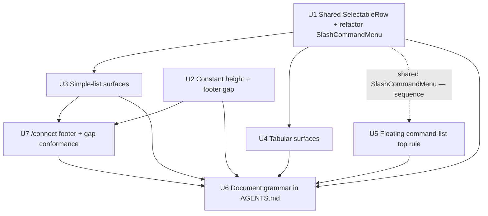

# refactor: Unify TUI command-surface visual grammar

## Summary

Give every KQode Ink TUI command surface one visual grammar so switching between them no longer
jars. Extract a single shared selection-row component (`❯` chevron + full-width highlight bar),
adopt it across the five docked popups and the floating `/` command list, give every docked popup
one constant total height, add the accent top rule to the floating command list, and keep a blank
gap row above every popup footer (with one `/memory`-only exception at the min terminal height). Purely visual/layout — no surface's content or backend behavior
changes. See origin: `docs/brainstorms/2026-07-11-tui-command-surface-visual-consistency-requirements.md`.

---

## Problem Frame

The TUI command surfaces were each built at a different time and drifted apart: four different
selection idioms (`❯`+bar in the floating `/` menu, `●` in `/theme`, `›`+active-`●` in `/model`,
`›` in `/connect`, reverse-video in `/memory` and resume), per-surface content-derived heights that
make popups jump when the user switches between them, and the accent top rule present on the five
docked popups but absent on the floating `/` list. Together they make the command layer feel like
unrelated screens. The full pain narrative and product decisions live in the origin requirements
doc; this plan is the HOW.

---

## Requirements

Carried from origin (`docs/brainstorms/2026-07-11-tui-command-surface-visual-consistency-requirements.md`):

- R1. Every selectable-list command surface renders the highlighted row with a `❯` chevron + full-width highlight bar, replacing `●` / `›` / reverse-video.
- R2. Non-highlighted rows render no marker and no bar, reserving a blank chevron-width gutter so columns stay aligned.
- R3. State indicators distinct from the selection cursor are preserved: `/model`'s active-model `●` dot and `/memory`'s `[Active]`/`[Inbox]` tabs.
- R4. The docked popups (`/theme`, `/model`, `/memory`, `/connect`, resume) all render at one shared constant total height.
- R5. That constant is a fixed size regardless of terminal size, capped to `⌊rows/2⌋` on terminals too short to fit it.
- R6. Content shorter than the constant pads blank; longer content scrolls internally with the existing position indicators.
- R7. Every command surface shows the accent top rule; the floating `/` command list gains one.
- R8. Every docked popup keeps exactly one blank gap row above its footer hint — always present, with one documented exception: `/memory` yields the gap only at the hard `⌊rows/2⌋` cap to preserve ≥1 data row (see Key Technical Decisions). So on sub-~18-row terminals `/memory` alone shows no gap — a known, accepted framing difference.
- R9. `tui/AGENTS.md` documents the unified grammar so future surfaces inherit it.

**Origin acceptance examples:** AE1 (switching → same height, covers R4/R5), AE2 (short terminal caps at half, covers R5), AE3 (pad blank / scroll, covers R6), AE4 (model chevron + active dot, covers R1/R3), AE5 (command list chevron+bar + top rule, covers R1/R7), AE6 (footer gap at capped height, covers R8).

---

## Scope Boundaries

- No change to any surface's content, data, or backend behavior (theme catalog, model/connect logic, memory modes/forms, resume list). Visual/layout only.
- `/help` stays fullscreen and unchanged (the standing docked-popup exception).
- The floating `/` command list is not resized — it keeps its own fixed height and stays autocomplete over the composer; it only gains the top rule (it already uses the `❯`+bar idiom).
- No palette or theme color changes; reuse existing `accentBlue` / `inputBackground` tokens.
- No new footer-hint copy beyond what consistency strictly requires.

### Deferred to Follow-Up Work

- Capture the unified selection idiom, top-rule, and popup-height/gap rationale via `/ce-compound` after the work lands — `docs/solutions/` has no learning for these today.

---

## Context & Research

### Relevant Code and Patterns

- **Reference idiom (already `❯`+bar):** `tui/src/components/SlashCommandMenu/index.tsx` — `HIGHLIGHT_MARKER = '\u276F '`, plain `'  '`, and the `padEnd(safeChromeColumns)` full-row `inputBackground` bar on a `<Text>`. This is the pattern to extract.
- **Shared rule:** `tui/src/components/DockDivider.tsx` — the accent `─` rule (`<Box width={columns}>`), already shared by the five docked popups; reuse for the floating menu.
- **Per-surface rows to migrate:** `ThemeSurface/ThemeRow.tsx` (`●`), `ModelSurface/ModelRow.tsx` (`›` + active `●`), `ConnectSurface/ProviderList.tsx` and `ConnectSurface/ConnectedActions.tsx` (`›`), `MemorySurface/MemoryRows.tsx` + `InboxRows.tsx` and `ResumeSurface/ResumeRows.tsx` (`inverse`).
- **Height machinery:** `tui/src/state/ui/dock/atoms.ts` (`dockedPanelDesiredRowsAtom`, `dockedPanelRowsAtom`), per-surface `*DesiredRowsAtom` (content-derived; resume fixed at `RESUME_PANEL_ROWS = 15`), `tui/src/libs/tui/layout.ts` (`resolveDockedPanelRows` half-cap, `resolveDockedFooterGap`), chrome constants in each `state/ui/<surface>/atoms.ts` and `constants/ui.ts`.
- **Bottom-stack / menu budget:** `tui/src/components/HomeScreen/HomeScreenView.tsx` (`HomeBottomStack`), `commandMenuDesiredRowsAtom` (`state/ui/commands/atoms.ts`), `commandMenuRowsAtom` (`state/ui/atoms.ts`), `resolveHomeScreenLayout` (`libs/tui/layout.ts`). The menu is rendered as exactly `menuRows` lines; its budget is subtracted in `resolveHomeScreenLayout` **and** `bottomSpacerRowsAtom`, both reading the same atom.
- **Tabular formatters:** `tui/src/libs/memory/formatMemoryRows.ts`, `formatInboxRows.ts`, `tui/src/libs/resume/formatSessionRows.ts` — share one `formatLine` for header + data; leading rank column (width 4); highlight applied outside via `inverse`.
- **Test harness:** Vitest + `ink-testing-library` via `tui/src/test/renderWithJotai.tsx`; per-surface `__tests__/testUtils.tsx` (theme/model/connect), inline helpers (memory/resume); geometry pinned via `columnsTestOverrideAtom`/`rowsTestOverrideAtom`; assertions are `lastFrame()` string `.toContain` and line-split height/blank-row checks; `state/ui/__tests__/layout.test.ts` is the canvas/caret guard; `components/__tests__/DockDivider.test.tsx` asserts rule width.

### Institutional Learnings

- **`docs/solutions/architecture-patterns/terminal-edge-rendering-tradeoffs-in-the-ink-tui.md`** — full-width bars: use the `padEnd(safeChromeColumns)`-on-`<Text>` idiom (or an explicitly width-set background `<Box>`); a background box with no explicit width stretches into the reserved final column (stray block until `ESC[K`). Glyph content routes through `safeChromeColumnsAtom`; only background boxes use raw `columns`. Cursor placement is manual and drifts when bottom-stack row math changes — verify visually; the offset now auto-derives from `FULLSCREEN_GUARD_ROWS`.
- **`docs/solutions/architecture-patterns/state-libs-layering-and-cycle-verification-in-the-ink-tui.md`** — layering is `components → state → libs`; `libs` must never import `@state`. Render helper → a shared component; pure math → `libs/tui/`. Verify no import cycles with the repo's Tarjan-style detector, not `madge` (false-passes here). Pin new boundaries with a committed guardrail test.
- **`docs/solutions/workflow-issues/recovering-from-concurrent-agent-session-edits.md`** — this branch has concurrent committers; for a wide multi-file change, re-read shared types right before editing and verify `git status` for foreign writes.

### External References

- None. Local patterns are strong (the reference idiom already exists in `SlashCommandMenu`); no external research was needed.

---

## Key Technical Decisions

- **One shared `SelectableRow` component, not per-surface duplication.** Resolves the origin's deferred "shared component vs per-surface" fork. It owns the chevron/gutter, the full-row highlight bar (`padEnd(safeChromeColumns)` + `inputBackground`), and the accent foreground, extracted from `SlashCommandMenu`'s inline logic. Rationale: single source prevents the exact drift this plan fixes; mirrors `DockDivider`'s shared-component pattern.
- **Constant popup height = a shared `DOCKED_PANEL_ROWS` constant, value 15.** `dockedPanelDesiredRowsAtom` returns the constant for all docked panels; `resolveDockedPanelRows` still caps to `⌊rows/2⌋`. 15 reuses the resume panel's current height, so resume is unchanged and popups never exceed 15 rows even on tall terminals (short surfaces show blank space). On terminals shorter than ~30 rows all popups land at `⌊rows/2⌋` — still identical to each other.
- **Highlight = themed `inputBackground` bar, replacing tabular reverse-video.** Matches the reference/`SlashCommandMenu`; `/memory` and resume move off `inverse`, which also makes their selection state directly assertable in frame tests.
- **Footer gap unconditional, with a `/memory`-only degenerate exception.** `resolveDockedFooterGap` currently drops the gap when a panel is capped; U2 makes the gap unconditional chrome per R8 — except in the one degenerate case below.
- **Tabular chevron via a leading gutter at reduced width.** The row components prepend `❯ `/`  ` (both header and data) and call the existing formatters with `columns − gutterWidth`, so alignment and safe-width bounds hold; formatter internals are untouched.
- **Floating-menu rule as the menu's first row + a single desired-rows bump.** Render the rule inside `SlashCommandMenu` (remaining matches fill `menuRows − 1`) and add `+1` to `commandMenuDesiredRowsAtom`, so the clamp and both budget subtractions stay coherent automatically.
- **`/memory`-only min-height gap-yield, keyed on the degenerate condition.** The gap yields only when keeping it would leave zero data rows — i.e. `panelRows − chromeWithGap ≤ 1` for a surface whose table header sits inside the content area. In practice that is only `/memory` at the hard `⌊rows/2⌋` cap (`bodyArea = 1` → the header consumes it). Resume counts its header in `RESUME_PANEL_CHROME_ROWS` and keeps ≥2 data rows with the gap, so it never yields; theme/model/connect have no in-content header row. Keying the yield on the condition (not a surface list) also settles how `resolveDockedFooterGap` decides to yield. [Resolves review finding]
- **`/connect` conforms rather than being exempted.** `/connect` has no bottom-pinned footer or gap today; it gains the uniform footer + gap (U7) so R8/AE6 apply to it like every other docked popup, matching the origin's "every docked popup" intent. [User decision]
- **Empty-state within the constant height.** Zero-item surfaces render their existing empty-state copy top-anchored in the content area (blank-padded below), never an all-blank panel.

---

## Open Questions

### Resolved During Planning

- Chevron in tabular surfaces (origin deferred): leading 2-col gutter prepended by the row components at reduced formatter width; header gets a blank gutter. Replaces `inverse` with the bar.
- Exact constant height (origin deferred): `DOCKED_PANEL_ROWS = 15`, reusing the resume value; tunable but chosen to leave resume unchanged.
- Shared component vs per-surface (origin deferred): one shared `SelectableRow` component.
- Floating menu rule placement (origin deferred): first row inside `SlashCommandMenu`, with a `+1` desired-rows bump.

### Deferred to Implementation

- Whether the marker constants (`SELECTION_CHEVRON`, gutter width) live in `constants/ui.ts` or a small `libs/tui/` module — a placement detail settled when the component is written, keeping `libs`-never-imports-`state`.
- Exact removal vs repointing of the now-unused per-surface `*DesiredRowsAtom` atoms once `dockedPanelDesiredRowsAtom` returns the constant and the footer gap is unconditional.
- Per-row treatment is binding guidance from U3's Approach — `/model` provider-header rows keep bespoke accent rendering with a blank gutter, while `/model` status + model rows and `/connect` provider + connected-action rows use `SelectableRow`; implementers only confirm the exact blank-gutter width for column alignment.

---

## High-Level Technical Design

> *This illustrates the intended approach and is directional guidance for review, not implementation specification. The implementing agent should treat it as context, not code to reproduce.*

Shared selection-row contract (the extracted primitive):

```text
SelectableRow({ highlighted, columns /* = safeChromeColumns */, color?, children }):
  gutter = highlighted ? "❯ " : "  "          // SELECTION_CHEVRON / SELECTION_GUTTER (2 cols)
  line   = truncate(gutter + renderContent(children), columns)
  if highlighted: line = padEnd(line, columns) // full-row bar within safe width
  <Text color={highlighted ? accentBlue : (color ?? foreground)}
        backgroundColor={highlighted ? inputBackground : undefined}>{line}</Text>

  // Tabular callers format their columnar content at (columns - GUTTER_WIDTH) and pass it as children.
  // Callers with a semantic state glyph (model active ●) render it inside content, after the gutter.
```

Unit dependency shape:



Marker unification (before → after):

| Surface | Selection today | After |
|---|---|---|
| Floating `/` list | `❯` + bar | unchanged (reference); gains top rule |
| `/theme` | `●` colored text | `❯` + bar |
| `/model` | `›` (+ active `●`) | `❯` + bar (keep active `●`) |
| `/connect` (providers + actions) | `›` | `❯` + bar |
| `/memory` (active + inbox) | reverse-video | `❯` gutter + bar |
| resume | reverse-video | `❯` gutter + bar |

---

## Implementation Units

### U1. Shared `SelectableRow` component

**Goal:** Extract the reference `❯`-chevron + full-width highlight-bar idiom into one shared component, and refactor `SlashCommandMenu` to consume it.

**Requirements:** R1, R2

**Dependencies:** None

**Files:**
- Create: `tui/src/components/SelectableRow/index.tsx`
- Create: `tui/src/components/SelectableRow/__tests__/SelectableRow.test.tsx`
- Modify: `tui/src/components/SlashCommandMenu/index.tsx`
- Modify: `tui/src/constants/ui.ts` (add `SELECTION_CHEVRON` / gutter constants, or a small `libs/tui/` module)
- Test: `tui/src/components/SlashCommandMenu/__tests__/SlashCommandMenu.test.tsx`

**Approach:**
- Component owns: the 2-col gutter (`❯ ` highlighted / `  ` plain), accent foreground on highlight, and the full-row `inputBackground` bar via `padEnd(safeChromeColumns)` on a `<Text>` (not a stretchable Box). Content routes through `safeChromeColumnsAtom`; the reserved final column is left to the root background.
- On a highlighted row, embedded semantic glyphs passed as content (e.g. `/model`'s active `●`) adopt the row's accent color under the bar; the glyph itself still distinguishes state, so no per-glyph color override is required (revisit only if legibility suffers).
- Expose enough surface for both plain-text callers (theme/model/connect) and pre-formatted columnar callers (memory/resume): a `gutterWidth` export so tabular callers can format at `columns − gutterWidth`.
- Refactor `SlashCommandMenu` to render each row through `SelectableRow`, preserving its exact fixed-height / blank-fill behavior.

**Technical design:** See the `SelectableRow` contract sketch in High-Level Technical Design (directional).

**Patterns to follow:**
- The existing inline logic in `tui/src/components/SlashCommandMenu/index.tsx` (marker + `padEnd(columns)` bar).
- `tui/src/components/DockDivider.tsx` as the shared-component shape.

**Test scenarios:**
- Happy path: highlighted row renders the `❯ ` gutter, accent color, and a background bar padded to `safeChromeColumns`; assert `frame.toContain('\u276F')` and that the highlighted line length equals the safe width.
- Happy path: plain row renders a 2-space gutter, no bar, foreground color; columns stay aligned with the highlighted row.
- Edge case: content longer than the safe width truncates to `safeChromeColumns`; no glyph reaches the reserved final column.
- Edge case: narrow terminal (small `columns`) — gutter + content still fit within `safeChromeColumns`.
- Guardrail: the chevron glyph is sourced only from the shared constant (single-source assertion).
- Regression (SlashCommandMenu): still renders exactly `commandMenuRowsAtom` lines with blank fillers, highlight on the matched entry (`toContain('\u276F')`), names/descriptions aligned.

**Verification:**
- `SlashCommandMenu` looks and behaves identically; a reusable `SelectableRow` exists and is the sole owner of the chevron/bar idiom.

---

### U2. Constant docked-panel height + always-on footer gap

**Goal:** Make every docked popup the same total height and keep the footer gap unconditional.

**Requirements:** R4, R5, R6, R8

**Dependencies:** None

**Files:**
- Modify: `tui/src/constants/ui.ts` (introduce `DOCKED_PANEL_ROWS = 15`; relate to `RESUME_PANEL_ROWS`)
- Modify: `tui/src/state/ui/dock/atoms.ts` (`dockedPanelDesiredRowsAtom` returns the constant for all docked panels)
- Modify: `tui/src/libs/tui/layout.ts` (`resolveDockedFooterGap` keeps the gap unconditionally, except the `/memory` hard-cap yield below)
- Modify: per-surface atoms retiring the content-derived `*DesiredRowsAtom` usage — `state/ui/{theme,model,memory,connect,resume}/atoms.ts` — and the existing footer-gap calls in `components/{ThemeSurface,ModelSurface,MemorySurface,ResumePanel}/index.tsx` (`/connect` has no footer-gap call today; its footer + gap are added in U7)
- Test: `tui/src/state/ui/dock/__tests__/atoms.test.ts`, `tui/src/libs/tui/__tests__/layout.test.ts`, `tui/src/state/ui/__tests__/layout.test.ts`

**Approach:**
- `dockedPanelDesiredRowsAtom` returns `DOCKED_PANEL_ROWS` for theme/model/memory/connect/resume; `resolveDockedPanelRows` still caps at `⌊rows/2⌋`, so every popup lands at `min(15, halfCap)` — identical across surfaces at any terminal size. `/connect` gets the constant height here, but it has no footer/gap/windowing today — that structural conformance is U7.
- Each surface keeps computing `listRows = panelRows − chromeRows` from its own chrome constant, so content areas differ by chrome while the total is constant. Short content pads (existing blank-fill); the list surfaces (theme/model/memory/resume) scroll longer content via their existing windows/indicators. Memory substates (form/detail/confirm) now render within the same constant total — a positive side effect (no resize on entering a form). Existing empty-state copy renders top-anchored within the content area, not as an all-blank panel.
- Make the footer gap unconditional: `resolveDockedFooterGap` returns `showFooterGap: true`, overriding the old half-cap gap-yield — **except** in the one degenerate case where keeping the gap would leave zero data rows (`panelRows − chromeWithGap ≤ 1` for a header-in-content surface), which in practice is only `/memory` at the hard `⌊rows/2⌋` cap. Key the yield on that condition, not a surface list (this also settles the new signature). Resume keeps the gap unconditionally — its header is counted in `RESUME_PANEL_CHROME_ROWS`, so it still shows ≥2 rows. Retire the now-unused `desiredRows` inputs and per-surface `*DesiredRowsAtom` atoms.

**Patterns to follow:**
- `resolveDockedPanelRows` and the uniform surface composition (`height={panelRows}` + `DockDivider` + title + rows + gap + footer).

**Test scenarios:**
- Covers AE1: with different content lengths injected for `/theme` vs `/model` vs `/memory`, `dockedPanelRowsAtom` returns the same value at a fixed `rows` — height does not vary by surface.
- Covers AE2: at `rows = 24`, every docked panel resolves to `min(15, 12) = 12`.
- Covers AE3: `/theme` with fewer items than the content area renders trailing blank rows to the constant; a surface with more items than fit shows the `more ↓`/`more ↑↓` indicator and scrolls.
- Covers AE6: at a capped (small-terminal) height, the blank gap row still sits directly above the footer for the non-degenerate case — assert `lines[footerIndex − 1].trim() === ''` where the old behavior dropped it.
- Edge case (min height, `/memory`): at `rows = 15` the panel caps at `⌊15/2⌋ = 7`; assert `/memory` still renders at least one selectable DATA row (an item line — not merely `bodyArea ≥ 1`, which the table header consumes), i.e. the gap yields only here.
- Edge case (min height, resume): at `rows = 15`, resume keeps its gap AND still shows ≥2 session rows (its header is counted in chrome), so it does not yield — assert both the gap row and a session line.
- Unit: `dockedPanelDesiredRowsAtom` returns `DOCKED_PANEL_ROWS` for each docked panel; `resolveDockedFooterGap` returns `showFooterGap: true` except when keeping the gap would leave zero data rows (`/memory` at the hard cap) — this inverts the committed "drops the gap when capped" assertion in `tui/src/libs/tui/__tests__/layout.test.ts`, so flip it explicitly.

**Verification:**
- Opening and switching among `/theme`, `/model`, `/memory`, `/connect`, and resume shows no height change at a given terminal size; every popup shows a gap row above its footer.

---

### U3. Unify selection in the simple-list surfaces (`/theme`, `/model`, `/connect`)

**Goal:** Adopt `SelectableRow` in the non-tabular surfaces, preserving `/model`'s active-model `●`.

**Requirements:** R1, R2, R3

**Dependencies:** U1

**Files:**
- Modify: `tui/src/components/ThemeSurface/ThemeRow.tsx`
- Modify: `tui/src/components/ModelSurface/ModelRow.tsx`
- Modify: `tui/src/components/ConnectSurface/ProviderList.tsx`, `tui/src/components/ConnectSurface/ConnectedActions.tsx`
- Test: `tui/src/components/ThemeSurface/__tests__/ThemeSurface.test.tsx`, `tui/src/components/ModelSurface/__tests__/ModelSurface.test.tsx`, `tui/src/components/ConnectSurface/__tests__/ConnectSurface.test.tsx`

**Approach:**
- `/theme`: highlighted row → `SelectableRow` (drop the `●` selection marker; live preview means highlighted = applied, so the chevron+bar suffices).
- `/model`: highlighted row → `SelectableRow`; the active-model `●` moves inside the row content (after the gutter), so a highlighted non-active model shows `❯` without `●`, and the active model keeps `●` whether or not highlighted. Provider header rows stay accent (blank gutter for alignment); status rows use the shared component.
- `/connect`: provider rows and the connected-action rows adopt `SelectableRow` in place of `›`; step forms/`MaskedInput` are unchanged.

**Test scenarios:**
- Happy path (theme): highlighted theme shows `\u276F` + bar; `frame.not.toContain('● ')` for the selection marker; highlight follows arrow-down.
- Covers AE4 (model): highlighted non-active model shows `\u276F` and no `●`; the active model row still shows `●`; assert both states in one frame.
- Happy path (model): provider header rows render without a chevron; a highlighted status row (e.g. `failed to load ↻`) shows `\u276F`.
- Happy path (connect): highlighted provider row shows `\u276F` + bar (not `›`); highlighted connected-action row shows `\u276F`.
- Integration: pressing enter on a highlighted row still selects that theme/model/provider (marker change does not break selection wiring).
- Edge case (model): the inline-connect API-key view is unaffected.

**Verification:**
- All three surfaces use the shared chevron+bar; `/model` still communicates which model is active.

---

### U4. Unify selection in the tabular surfaces (`/memory`, resume)

**Goal:** Give the columnar memory and resume rows the same chevron+bar, replacing reverse-video, without breaking alignment.

**Requirements:** R1, R2, R3

**Dependencies:** U1

**Files:**
- Modify: `tui/src/components/MemorySurface/MemoryRows.tsx`, `tui/src/components/MemorySurface/InboxRows.tsx`
- Modify: `tui/src/components/ResumeSurface/ResumeRows.tsx`
- Test: `tui/src/components/MemorySurface/__tests__/MemorySurface.test.tsx`, `tui/src/components/ResumeSurface/__tests__/ResumeSurface.test.tsx`

**Approach:**
- Data rows pass gutter-less columnar content (formatted at `columns − gutterWidth`) to `SelectableRow`, which owns the chevron/gutter and the highlight bar — matching the U1 contract, so the gutter is added exactly once (no doubling). The row component prepends only the header row's blank gutter; the header is not rendered through `SelectableRow` and is never highlighted.
- Preserve the existing header-row accounting (`memory dataRows = bodyArea − 1`, resume `visibleRows + 1`) — the gutter adds columns, not rows. `/memory` guarantees ≥1 data row at the hard cap via U2's `/memory`-only gap-yield; resume already keeps ≥2 session rows there (header counted in chrome) and needs no yield.
- Existing empty-state copy (e.g. "No memory yet…", "No saved sessions…") renders top-anchored within the content area, blank-padded below — never an all-blank panel.
- `/memory`'s `[Active]`/`[Inbox]` tabs and status line are untouched (R3).

**Test scenarios:**
- Happy path (memory active): highlighted row shows `\u276F` gutter + bar; header shows a blank gutter and stays column-aligned; `frame.toContain('\u276F')` (now directly assertable, unlike `inverse`).
- Happy path (memory inbox): same for `InboxRows`.
- Happy path (resume): highlighted session shows `\u276F` gutter + bar; header aligned; folder/summary columns still fit within `safeChromeColumns` (no overflow from the gutter).
- Edge case: scroll windowing still works — highlight past the last visible row scrolls and shows `more ↑↓`; header stays pinned.
- Integration: enter on a highlighted memory/resume row still triggers view/resume (selection wiring intact).
- Edge case (min height): at the hard half-cap, `/memory` renders ≥1 selectable DATA row (assert an item line, not just `bodyArea`) with the gap yielded; resume renders ≥1 session row AND keeps its gap. Assert the surface-specific behavior for each.
- Edge case (empty): a zero-item `/memory` renders its empty-state line within the content area, not an all-blank panel.
- Edge case: `/memory` tabs and status line unchanged after migration.

**Verification:**
- Memory and resume rows match the shared idiom; columns stay aligned and within safe width; selection is now visible in frame tests.

---

### U5. Accent top rule on the floating `/` command list

**Goal:** Add the accent top rule above the floating command list and reserve its row in the layout budget.

**Requirements:** R7

**Dependencies:** None functional, but U5 and U1 both edit `tui/src/components/SlashCommandMenu/index.tsx` and its test — land them in sequence and preserve each other's change (U1's `SelectableRow` row refactor beneath U5's new first-line rule). The five docked popups already satisfy R7 via `DockDivider`.

**Files:**
- Modify: `tui/src/components/SlashCommandMenu/index.tsx` (render the rule as the first row, matches fill `menuRows − 1`)
- Modify: `tui/src/state/ui/commands/atoms.ts` (`commandMenuDesiredRowsAtom` += 1 for the rule row)
- Test: `tui/src/components/SlashCommandMenu/__tests__/SlashCommandMenu.test.tsx`, `tui/src/state/ui/__tests__/layout.test.ts`, `tui/src/state/ui/commands/__tests__/atoms.test.ts`

**Approach:**
- Render a `DockDivider`-style accent `─` rule at `safeChromeColumns` as `SlashCommandMenu`'s first line when the menu is open; render the existing matches/blank-fill in the remaining `menuRows − 1` rows so the panel stays budget-driven and never over-subscribes the canvas.
- Bump the desired rows by 1 in `commandMenuDesiredRowsAtom`; the clamp (`commandMenuRowsAtom`) and both budget subtractions (`resolveHomeScreenLayout` + `bottomSpacerRowsAtom`) read the same atom, so one bump keeps them coherent.

**Execution note:** After this row-count change, re-verify the composer caret still lands on the composer row (the composer is visible while the menu is open, so bottom-stack row math affects `composerTop`).

**Patterns to follow:**
- `tui/src/components/DockDivider.tsx` (rule rendering); `SlashCommandMenu`'s existing fixed-height render loop.

**Test scenarios:**
- Covers AE5: with the menu open, the first rendered line is the accent rule (`frame.toContain('─'.repeat(width))`), and the selected command below it shows the `\u276F` chevron + bar (AE5's R1 clause, shared with U1's `SelectableRow` refactor).
- Happy path: the menu still renders exactly `commandMenuRowsAtom` lines total (rule + entries + blank fill); the composer does not shift.
- Canvas guard: `state/ui/__tests__/layout.test.ts` — total rendered rows (`HEADER + body + spacer + gap + cwd + menuRows + composer + 1`) stay ≤ `MIN_ROWS` with the menu open after the +1 bump.
- Caret guard: the layout test's caret assertions confirm the caret is on the composer row.
- Edge case: with the menu closed, no rule renders and the cwd line shows normally.

**Verification:**
- The floating `/` list shows the same accent top rule as the docked popups; the composer stays put and the caret is correct.

---

### U7. Make `/connect` a conforming docked popup

**Goal:** Give `/connect` the uniform bottom-pinned footer-hint line and always-on gap row it lacks today, so R8/AE6 apply to it like the other docked popups.

**Requirements:** R6, R8

**Dependencies:** U2, U3

**Files:**
- Modify: `tui/src/components/ConnectSurface/index.tsx` (add a bottom-pinned footer-hint row + the always-on gap row; size the content area to `panelRows − chromeRows`; hide the provider list while a step is active)
- Modify: `tui/src/components/ConnectSurface/CustomForm.tsx`, `tui/src/components/ConnectSurface/ConnectedActions.tsx` (strip their now-duplicated inline hints; keep the clear-confirm prompt as content)
- Modify: `tui/src/state/ui/connect/atoms.ts` (a `CONNECT_DOCK_CHROME_ROWS` counting divider + label + gap + footer, plus a reduced sub-state chrome analogous to `MEMORY_DOCK_SUBSTATE_CHROME_ROWS`)
- Modify: `tui/src/components/ConnectSurface/ProviderList.tsx` (collapse/hide during steps; window if it can exceed the content area)
- Test: `tui/src/components/ConnectSurface/__tests__/ConnectSurface.test.tsx`

**Approach:**
- Today `ConnectSurface` renders the divider, `/connect` label, provider list, and step content in one `flexShrink={0}` box with step hints inline and no bottom-pinned footer, gap, or `resolveDockedFooterGap` call. Restructure it to the uniform shape: `DockDivider` → label → content area (`height = panelRows − chromeRows`) → always-on gap row → bottom-pinned footer-hint line.
- The footer-hint text stays step-dependent (provider list vs key entry vs custom form vs connected actions) but renders in the uniform bottom-pinned footer slot. Strip the now-duplicated inline hints from `CustomForm`/`ConnectedActions`. The destructive clear-confirm prompt (`Press y to confirm clear…`) stays as prominent content in the content area, not a footer nav hint, so it is neither duplicated nor dropped.
- Protect step content at the cap: while a credential step is active (Key / CustomUrl / CustomLabel / ConnectedActions), hide the provider list — mirroring `/memory`'s `subStateActive ? null` list-hiding — and reduce the sub-state chrome, so `CustomForm`/`MaskedInput` and the transient `Working…`/`OutcomeMessage`/`RequestErrorMessage` line keep room and are pinned above the gap rather than clipped. The provider list renders (windowed) only on the List step.

**Patterns to follow:**
- The uniform composition in `ThemeSurface`/`ModelSurface` (`height={panelRows}` → `DockDivider` → label → content(`listRows`) → gap → footer, driven by `resolveDockedFooterGap`).

**Test scenarios:**
- Covers AE6: with `/connect` open, one blank gap row sits directly above a bottom-pinned footer-hint line (neither exists today).
- Happy path: each step's hint (provider list, key entry, custom form, connected actions) renders in the bottom footer slot, not inline mid-content.
- Edge case (min height, key step): at `rows = 15`, with the Kimi key step active, the provider list is hidden and the `MaskedInput` + any `Working…`/error line render (not clipped) above the pinned footer.
- Happy path: hints are not duplicated — a step's nav hint appears only in the footer, not inline; the clear-confirm prompt still shows as content.
- Integration: stepping through connect (select provider → enter key / fill form → connect) still works with the restructured layout.

**Verification:**
- `/connect` shows the same divider + gap + bottom-pinned footer as the other docked popups; switching to/from it shows no height change.

---

### U6. Document the unified grammar in `tui/AGENTS.md`

**Goal:** Record the unified command-surface grammar so future surfaces inherit it.

**Requirements:** R9

**Dependencies:** U1, U2, U3, U4, U5, U7

**Files:**
- Modify: `tui/AGENTS.md` (Command surfaces section)

**Approach:**
- Document: the `❯`-chevron + `inputBackground` highlight-bar selection idiom via the shared `SelectableRow` (with the reserved-final-column / `padEnd(safeChromeColumns)` note), the shared constant docked-panel height capped to half, the always-present footer gap row (with the `/memory`-only hard-cap yield that keeps ≥1 data row), the accent top rule on every command surface including the floating `/` list, and the uniform bottom-pinned footer that every docked popup — `/connect` included — renders. State that new command surfaces must use `SelectableRow`, the constant height, and the uniform divider/content/gap/footer composition.

**Test scenarios:**
- Test expectation: none — documentation-only update.

**Verification:**
- `tui/AGENTS.md` describes the grammar a contributor needs to add a conforming surface without re-deriving marker, height, divider, or footer-gap choices.

---

## System-Wide Impact

- **Interaction graph:** All slash-command surfaces plus the floating command menu render through the new `SelectableRow`; the dock height atoms (`dockedPanelDesiredRowsAtom` → `dockedPanelRowsAtom`) feed `layoutAtom` and `bottomSpacerRowsAtom`, and the command-menu budget feeds `resolveHomeScreenLayout` + `bottomSpacerRowsAtom`.
- **State lifecycle risks:** The command-menu row-budget is subtracted in two places; the +1 rule bump must flow through the shared atom so both agree. The constant-height switch retires per-surface `*DesiredRowsAtom` — ensure no consumer still reads a removed atom.
- **API surface parity:** `/model`'s active-`●` and `/memory`'s tabs are state indicators that must survive the marker unification (R3).
- **`/connect` conformance:** `/connect` alone lacks a bottom-pinned footer, gap, and windowing today; U7 restructures it to the uniform docked shape so R8/AE6 hold for it too.
- **Integration coverage:** Selection wiring (enter → action) on each migrated surface is unit-provable; the caret-on-composer behavior after U5 is only provable via the layout canvas/caret guard plus a manual visual check.
- **Unchanged invariants:** No surface content, backend calls, theme palette, scroll windows, or `/help` behavior change; `DockDivider` and `resolveDockedPanelRows` are reused as-is.

---

## Risks & Dependencies

| Risk | Mitigation |
|------|------------|
| Adding the menu rule row (U5) drifts the composer caret | Route the +1 through the shared desired-rows atom; rely on `layout.test.ts` caret/canvas guards and verify visually; the row-origin offset auto-derives from `FULLSCREEN_GUARD_ROWS`. |
| Full-width bar smears into the reserved final column | Use the `padEnd(safeChromeColumns)`-on-`<Text>` idiom (proven in `SlashCommandMenu`); do not introduce a stretchable background `<Box>`. |
| Always-on footer gap silently disappears at the half-cap | U2 keeps the gap unconditional above the cap, yielding it only for `/memory` at the hard cap; assert the gap row at a capped height (AE6). |
| `/memory` renders zero data rows at the hard min-height cap | The gap yields for `/memory` only (keyed on `panelRows − chromeWithGap ≤ 1`) so ≥1 data row renders; resume keeps its gap (header counted in chrome); assert a data-row line, not `bodyArea`. |
| `/connect` step input/feedback clipped at min height (U7) | Hide the provider list during an active step (like `/memory`'s sub-states) and pin the input + transient outcome/error line above the gap, so credentials/errors are never clipped; test each step at the capped height. |
| `/connect` lacks a footer/gap/windowing and needs restructuring (U7) | Mirror the uniform Theme/Model composition; move the step hints to the bottom-pinned footer slot and strip their inline duplicates; test each step. |
| Tabular gutter pushes columns past safe width | Prepend the gutter in the row component and format at `columns − gutterWidth`; assert no overflow. |
| New shared component introduces an import cycle | Component under `components/`, pure constants in `constants/ui.ts`/`libs/tui/`; `libs` never imports `@state`; verify with the repo's Tarjan-style detector, not `madge`. |
| Concurrent-session edits on this shared branch collide across the many touched files | Re-read shared types immediately before edits; commit with explicit pathspec; verify `git status` for foreign writes. |

---

## Documentation / Operational Notes

- U6 updates `tui/AGENTS.md`. After landing, capture the selection-idiom / top-rule / popup-height rationale via `/ce-compound` (no `docs/solutions/` learning covers it today).
- Validate with `cargo xtask tui-typecheck` and `cargo xtask tui-test` (or `bun run typecheck` / `bun run test` from `tui/`).

---

## Sources & References

- **Origin document:** [docs/brainstorms/2026-07-11-tui-command-surface-visual-consistency-requirements.md](docs/brainstorms/2026-07-11-tui-command-surface-visual-consistency-requirements.md)
- Related plan: [docs/plans/2026-07-10-... half-height cap](docs/brainstorms/2026-07-10-tui-command-surface-half-height-cap-requirements.md) (docked-popup architecture this builds on)
- Related code: `tui/src/components/SlashCommandMenu/index.tsx`, `tui/src/components/DockDivider.tsx`, `tui/src/state/ui/dock/atoms.ts`, `tui/src/libs/tui/layout.ts`
- Learnings: `docs/solutions/architecture-patterns/terminal-edge-rendering-tradeoffs-in-the-ink-tui.md`, `docs/solutions/architecture-patterns/state-libs-layering-and-cycle-verification-in-the-ink-tui.md`
