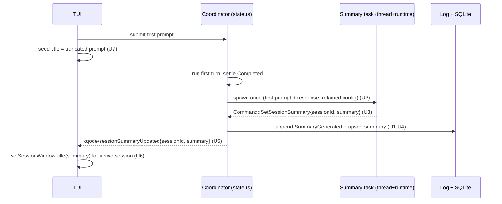

# feat: LLM Session Summary for Resume Label and Terminal Title

## Summary

Generate a short, LLM-written session summary in the Rust backend after a new session's first turn completes, persist it as durable truth, and push it to the TUI so the `/resume` label and terminal title upgrade from a truncated-first-prompt placeholder to the generated summary. The placeholder is seeded on first prompt and also serves as the silent fallback.

---

## Problem Frame

Today a session's stored "summary" is just the first user prompt with whitespace collapsed (`summary_from_prompt` in `src/conversation/persistence.rs`), reused for both the `/resume` Summary column and the terminal title. Long, multi-line, or paste-heavy first prompts make an unrecognizable label, and a fresh session's terminal title never changes from the product default during its first turn. See origin for the full pain narrative (Sources & References).

---

## Requirements

- R1. After the first turn of a new session completes successfully, generate a short summary in the background without blocking the next input or the assistant's response.
- R2. The summary is generated from the first user prompt together with the first assistant response.
- R3. Generate with a model call for every new session, regardless of first-prompt length (no gating).
- R4. The summary is a short, single-line phrase that fits the existing terminal-title length cap in the common case.
- R5. Produced once per session; not auto-regenerated as the session continues.
- R6. All session-title text — the generated summary **and** the first-prompt placeholder — passes through a shared session-title sanitizer before it is stored or written to the terminal title: strip C0/C1 control characters (including `LF`/`CR`/`TAB`), `ESC`, `DEL`, OSC terminators, and bidi/RTL isolate/override marks; collapse to a single line; hard-cap length. Sanitize at the sink so no caller can bypass it.
- R7. On first-prompt submit, seed the label/title from the truncated first prompt (today's text) until a generated summary is available.
- R8. On failure, timeout, or no provider configured, the placeholder remains and no user-facing error is surfaced.
- R9. When a fresh session's first prompt is sent, update the terminal title to reflect that session (seeded from the placeholder), replacing the product title.
- R10. When the generated summary becomes available for the active session, update the live terminal title to it.
- R11. On resume, set the terminal title from the session's stored summary.
- R12. The `/resume` list shows each session's stored summary.
- R13. Persist the generated summary durably so it survives a rebuild of the local session index; a rebuilt index must never revert it to the placeholder.
- R14. Once generated, the summary replaces the placeholder everywhere the session is shown.

**Origin actors:** A1 (KQode user), A2 (KQode TUI), A3 (KQode Rust backend), A4 (Local session store and durable log)
**Origin flows:** F1 (First-session titling), F2 (Resume titling), F3 (Degraded generation)
**Origin acceptance examples:** AE1 (covers R1, R2, R7, R9, R10), AE2 (covers R8), AE3 (covers R11, R12, R14), AE4 (covers R13), AE5 (covers R4, R6)

**Already satisfied by existing display code:** R11 is met by `setSessionWindowTitle(...)` in `tui/src/components/ResumeSurface/useResumeBackend.ts`; R12 by `formatResumeRow` in `tui/src/libs/resume/formatSessionRows.ts`. Both read `session.summary`, so upgrading the stored summary (U1, U4) satisfies them with no new display code — the implementer should verify, not rebuild, these paths.

---

## Scope Boundaries

- Manual `/rename` or user-set custom titles — deferred (origin).
- Refreshing or regenerating the summary as the session grows or after compaction — deferred (origin).
- A dedicated cheap/"small" model tier for the summary call — deferred; the active model is used (origin).
- Length-gating to skip the call for short prompts — rejected; always generate (origin).
- A status-only terminal title mode — out of scope (origin).
- Backfilling generated summaries for sessions created before this feature — out of scope (origin).

### Deferred to Follow-Up Work

- Renaming the `first_prompt_summary` column to a neutral `summary` — deferred; this plan reuses the existing column and evolves its meaning to avoid a migration (see Key Technical Decisions).

---

## Context & Research

### Relevant Code and Patterns

- `src/chat/summarize.rs` — the existing hidden-summarizer pattern (dedicated system prompt, stream + accumulate, empty-output error). The new title generator mirrors this shape.
- `src/chat/compaction.rs` (`run_compaction`) — injects the summarizer so decision logic is unit-tested without a provider; the trigger unit mirrors this injection seam.
- `src/chat/turn.rs` (`spawn_streaming_turn`) — detached thread + current-thread tokio runtime that reports back via `Command`; the background summary task mirrors this.
- `src/conversation/state.rs` (`settle`) — where a turn settles and a buffered compaction is adopted on a clean completed settle; the generation trigger hooks here.
- `src/conversation/mod.rs` — `Command` and `ConversationEvent` enums, `TurnJob` (carries `KimiConfig`).
- `src/conversation/session_log.rs` — `SessionLogEvent` append-only enum (`Compacted` is the closest precedent for a new durable event).
- `src/store/sessions.rs` — `parse_session_log`/`upsert_session`/`list_resumable_sessions`; `first_prompt_summary` column already flows to `SessionSummaryWire.summary`.
- `src/backend/mod.rs` (`notifications_for_event`) — event→notification mapping; `src/protocol/queue.rs` — notification method constants.
- `tui/src/contracts/backend/client.ts` (`TranscriptEvent`), `tui/src/backend/client/messageConnectionClient.ts` (`onNotification` wiring), `tui/src/contracts/backend/messages.ts` (method constants in lockstep with Rust).
- `tui/src/libs/terminal/windowTitle.ts` (`setSessionWindowTitle`, `formatSessionWindowTitle`, 72-char cap), `tui/src/state/promptQueue/atoms.ts` (submit action), `tui/src/backend/runtime/backendRuntime.ts` (`onReady` sessionId + `onTranscriptEvent`).
- `tui/src/libs/text/sanitizeDisplayText.ts` — existing display sanitizer reused for the title path.

### Institutional Learnings

- `docs/solutions/architecture-patterns/terminal-edge-rendering-tradeoffs-in-the-ink-tui.md` — terminal control-sequence handling context.
- `docs/solutions/architecture-patterns/backend-process-lifecycle-ownership-in-the-ink-tui.md` — backend/TUI ownership boundaries for notifications.

### External References

- `docs/research/2026-07-11-agent-session-title-summary-generation.md` — cross-agent evidence: small-model titles, background/fire-and-forget generation, first-prompt-truncation fallback, one-shot-no-refresh, OSC titles, and Codex's title sanitization (Trojan-Source) that motivates R6.

---

## Key Technical Decisions

- **Reuse the existing summary field; no migration.** The generated summary overwrites the same `first_prompt_summary` value the resume list and title already read. Its meaning evolves from "first-prompt summary" to "session summary (seeded from first prompt, upgraded by the model)." A rename is deferred to follow-up.
- **Durable log event is the source of truth.** A new append-only `SessionLogEvent` records the generated summary so a SQLite index rebuild (`reindex_sessions_from_logs`) restores it instead of reverting to the first-prompt placeholder (R13). This upholds the "JSONL is truth, SQLite is a rebuildable index" invariant.
- **Trigger after the first *completed* turn, once per session.** An in-memory per-session guard fires generation on the first `Completed` settle and never again; an errored/cancelled first turn naturally defers to the next completed turn. Resumed sessions mark the guard satisfied on attach, so they never regenerate (R5, R8).
- **Retain the active turn's resolved `KimiConfig`.** The coordinator stashes the config used for the active turn so the post-settle background task can reuse it; if none is retained (unconfigured), generation is skipped and the placeholder stands.
- **Single-writer preserved.** The background task reports its result back through a new `Command` so the coordinator remains the only writer of session state, persistence, and events — mirroring how turns report via `command_tx`.
- **Dedicated title prompt, separate from compaction.** The compaction summarizer emits a multi-section briefing unsuitable for a title; the new generator uses its own system prompt asking for one short sentence-case phrase and treats the conversation strictly as data.
- **Bounded timeout, no retry (v1); sanitize at the title sink.** The model call is time-bounded; on timeout/error the placeholder stands. All title text — generated summary and first-prompt placeholder — is sanitized by a shared session-title sanitizer applied at the `setSessionWindowTitle` sink (and in Rust before persist/emit). `sanitizeDisplayText` alone is insufficient — it preserves newlines/tabs and does not strip bidi/RTL marks — so the title sanitizer must additionally cover those (R6).
- **New notification `kqode/sessionSummaryUpdated { sessionId, summary }`** maps from a new `ConversationEvent::SummaryUpdated`; Rust and TS method constants stay in lockstep per the constants convention.
- **Injected generator for tests.** The trigger logic accepts an injected summary generator so the once-guard, completed-only, and skip-on-resume branches are unit-tested without a real provider (mirrors `run_compaction`).

---

## Open Questions

### Resolved During Planning

- Model-call shape: mirror `summarize.rs` (stream + accumulate, dedicated system prompt) rather than adding a new provider path.
- Fallback policy: single attempt, bounded timeout, no retry; placeholder stands on any failure (R8).
- Persistence: reuse the `first_prompt_summary` column + a new durable log event; reindex prefers the generated summary.
- First-turn error/cancel: generate after the next *completed* turn via the once-guard.
- Sanitizer: reuse `sanitizeDisplayText` on the TUI title path; strip control chars + bound length in Rust before persist/emit.

### Deferred to Implementation

- Exact timeout duration and the exact title system-prompt wording / max word count.
- Final module name for the generator (e.g., a new `src/chat/session_summary.rs`).
- Whether the live generated summary should also flow into any TUI session/transcript atoms beyond the terminal title.
- Exact serde field names for the new log event and notification params (kept camelCase per existing wire style).
- The narrow race where a summary generated for session A lands just after the user resumes to session B; v1 updates the active connection's title and keeps the payload `sessionId` for optional defensive matching.

---

## High-Level Technical Design

> *This illustrates the intended approach and is directional guidance for review, not implementation specification. The implementing agent should treat it as context, not code to reproduce.*

**Unit dependencies:** U1 and U2 are independent roots. U3 depends on U2; U4 on U1+U3; U5 on U4; U6 on U5. U7 is independent (TUI-only) and can land any time.

---

## Implementation Units

### U1. Durable `SummaryGenerated` log event + reindex read

**Goal:** Record a generated summary as append-only truth and make SQLite reindex honor it so it survives an index rebuild.

**Requirements:** R13, R14

**Dependencies:** None

**Files:**
- Modify: `src/conversation/session_log.rs` (add `SummaryGenerated { summary, at_ms }` variant)
- Modify: `src/store/sessions.rs` (`parse_session_log` reads the new event and sets the summary, latest wins over the first-prompt-derived value)
- Modify: `src/backend/sessions.rs` (`restore_turns` gains a no-op `SummaryGenerated { .. } => {}` arm so the durable-log match stays exhaustive)
- Test: `src/store/tests.rs`, `src/backend/sessions.rs` tests

**Approach:**
- Add the variant next to `Compacted`, same camelCase wire style.
- In `parse_session_log`, when a `SummaryGenerated` event is present, set the parsed summary to its value (last one wins); otherwise keep the first-`TurnEnqueued`-derived placeholder.
- Every `match` over `SessionLogEvent` must gain an arm: `restore_turns` in `src/backend/sessions.rs` (which replays the log for resume) ignores the metadata event (`=> {}`) so it stays exhaustive and resume/replay still compiles.

**Patterns to follow:**
- `SessionLogEvent::Compacted` and its handling in `parse_session_log`.

**Test scenarios:**
- Happy path: a log containing `SummaryGenerated` reindexes to the generated summary, not the first prompt.
- Edge case: multiple `SummaryGenerated` events → the latest wins.
- Edge case: no `SummaryGenerated` → the first-prompt placeholder is retained (no regression). *(Covers AE4.)*
- Integration: `restore_turns` replays a log containing `SummaryGenerated` without error (the match stays exhaustive; the event does not affect restored turns).

**Verification:**
- Rebuilding the index from a log with a generated summary yields that summary in `list_resumable_sessions`.

---

### U2. Backend session-summary generator (provider call + prompt + sanitize)

**Goal:** A dedicated async function that turns the first prompt + first response into a short, sanitized, single-line summary via the active model.

**Requirements:** R2, R3, R4, R6

**Dependencies:** None

**Files:**
- Create: `src/chat/session_summary.rs` (e.g., `generate_session_summary(first_prompt, first_response, config) -> Result<String, ProviderError>` + a sanitize helper)
- Modify: `src/chat/mod.rs` (module wiring / re-export)
- Test: colocated `#[cfg(test)]` in the new module

**Approach:**
- Mirror `summarize.rs`: dedicated `SESSION_SUMMARY_SYSTEM_PROMPT` asking for one short sentence-case phrase, conversation-as-data guard; build one user message from the first prompt + first response; stream + accumulate; error on empty output.
- Sanitize the result with the shared session-title contract (R6): strip C0/C1 controls, `ESC`, `DEL`, OSC terminators, and bidi/RTL marks; collapse to one line; hard-cap length to the title budget.
- Keep the module under the ~200-line file guideline.

**Patterns to follow:**
- `src/chat/summarize.rs` (`summarize`, `build_summary_messages`, empty-output `ProviderError::Decode`).

**Test scenarios:**
- Happy path: built messages include the title system prompt and both the first prompt and first response.
- Edge case: empty/whitespace model output → error (so the caller keeps the placeholder).
- Edge case: output with control chars / newlines / bidi-override / over-cap length → sanitized to a single line within the cap. *(Covers AE5.)*
- Test expectation: the live network call itself is not unit-tested (matches `summarize.rs`).

**Verification:**
- Given a stubbed model reply, the function returns a bounded single-line phrase; given empty output, it returns an error.

---

### U3. Coordinator: trigger generation after the first completed turn

**Goal:** After a fresh session's **first completed turn** (the first turn that settles `Completed`; an earlier errored/cancelled turn leaves the once-guard unset so the next completed turn triggers), and only when no summary has been generated yet, spawn a background task that runs U2 and reports back via a new `Command`.

**Requirements:** R1, R2, R3, R5, R8

**Dependencies:** U2

**Files:**
- Modify: `src/conversation/state.rs` (settle hook; retain active `KimiConfig`; once-guard; spawn)
- Modify: `src/conversation/mod.rs` (new `Command::SetSessionSummary { session_id, summary }`; accept an injected generator seam)
- Test: `src/conversation/tests.rs`

**Approach:**
- Stash the resolved config when a turn becomes active so it is available at settle.
- On a `Completed` settle where the current session has no generated summary yet, read the first prompt + first response from the transcript and spawn a detached thread (current-thread tokio runtime, like `spawn_streaming_turn`) that runs the generator and, on `Ok`, sends `Command::SetSessionSummary` via `command_tx`. On error/timeout/no-config, do nothing.
- Maintain an in-memory once-guard per session; set it satisfied on `ResumeSession` attach and reset on `Clear`/new session.

**Execution note:** Inject the generator so the once-guard, completed-only, skip-on-resume, and no-config branches are unit-tested without a real provider (mirror `run_compaction`).

**Test scenarios:**
- Happy path: a completed first turn produces one `SetSessionSummary` command carrying a summary derived from the first prompt + response. *(Covers AE1 trigger.)*
- Error path: a `needsConfiguration`/`error`/`cancelled` first turn produces no generation; a later completed turn then triggers it. *(Covers AE2.)*
- Edge case: only once per session — a second completed turn does not regenerate.
- Edge case: a resumed session never triggers generation.

**Verification:**
- With an injected generator, exactly one summary command is emitted per fresh session, only after a completed turn.

---

### U4. Coordinator: persist and emit the generated summary

**Goal:** Handle `Command::SetSessionSummary` by appending the durable log event, updating the stored summary, and emitting a `SummaryUpdated` event.

**Requirements:** R13, R14

**Dependencies:** U1, U3

**Files:**
- Modify: `src/conversation/persistence.rs` (`on_summary_generated(session_id, summary)` → append `SummaryGenerated` + upsert the session row's summary)
- Modify: `src/conversation/state.rs` (handle the command; call persistence; emit event)
- Modify: `src/conversation/mod.rs` (`ConversationEvent::SummaryUpdated { session_id, summary }`)
- Test: `src/conversation/tests.rs`, `src/conversation/persistence.rs` tests

**Approach:**
- Persist first (log event + `upsert_session` reusing the `first_prompt_summary` column), then emit `ConversationEvent::SummaryUpdated`. Persistence is best-effort: on a persistence error, log it like `on_settle`/`on_compacted` (`KQODE_SESSION_PERSISTENCE_ERROR`) and **still emit** `SummaryUpdated` so the live terminal title upgrades even when the durable write hiccups (a later run/reindex reconciles). Emission does not depend on persistence success.

**Patterns to follow:**
- `on_compacted` in `src/conversation/persistence.rs`; the compaction-adoption block in `settle`.

**Test scenarios:**
- Happy path: handling the command writes a `SummaryGenerated` log line, updates the stored summary, and emits `SummaryUpdated`. *(Covers AE3, AE4.)*
- Integration: after handling, `list_resumable_sessions` reflects the new summary.
- Error path: a persistence failure is logged and does not panic or block the coordinator.

**Verification:**
- The stored + logged summary and the emitted event all carry the generated text for the correct session.

---

### U5. Protocol + backend notification for summary updates

**Goal:** Map `ConversationEvent::SummaryUpdated` to a new JSON-RPC notification and keep the Rust/TS constants in lockstep.

**Requirements:** R10

**Dependencies:** U4

**Files:**
- Modify: `src/protocol/queue.rs` (add `SESSION_SUMMARY_UPDATED_METHOD` + params struct with `session_id`→`sessionId`, `summary`)
- Modify: `src/backend/mod.rs` (`notifications_for_event` arm)
- Modify: `tui/src/contracts/backend/messages.ts` (mirror the method constant + params type)
- Test: `src/backend/tests.rs`

**Approach:**
- Follow the `COMPACTION_STATUS_METHOD` precedent for constant + params + arm. Document the cross-language lockstep in both files.

**Patterns to follow:**
- `CompactionStatusParams` / `COMPACTION_STATUS_METHOD` and its `notifications_for_event` arm.

**Test scenarios:**
- Happy path: a `SummaryUpdated` event yields exactly one notification with the method and `{ sessionId, summary }`.

**Verification:**
- The backend emits the new notification with the expected method name and payload shape.

---

### U6. TUI: receive the notification and update the live terminal title

**Goal:** Handle the new notification client-side and set the live terminal title (for the active session) to the generated summary.

**Requirements:** R10

**Dependencies:** U5

**Files:**
- Modify: `tui/src/backend/protocol/messageProtocol.ts` (add the `NotificationType`)
- Modify: `tui/src/contracts/backend/client.ts` (add `{ type: 'sessionSummaryUpdated'; sessionId; summary }` to `TranscriptEvent`)
- Modify: `tui/src/backend/client/messageConnectionClient.ts` (`onNotification` → `emit`)
- Modify: `tui/src/backend/runtime/backendRuntime.ts` or a small atom-backed subscriber (call `setSessionWindowTitle` when `sessionId` is the active session)
- Modify: `tui/src/libs/promptQueue/transcriptReducer.ts` (no-op branch for the new event type to preserve exhaustiveness)
- Test: `tui/src/backend/client/__tests__/backendClient.test.ts`, subscriber/reducer tests

**Approach:**
- Add the event variant + wiring. A subscriber writes the OSC title via `setSessionWindowTitle(PRODUCT_NAME, summary)` (which sanitizes per R6). The transcript reducer ignores the event.
- **Active-session matching:** do NOT compare against the backend-ready `onReady` id — that is the per-spawn/log session id, not the durable conversation id carried by `SummaryUpdated` (minted lazily in `ensure_session`), so the two never match. The TUI's backend connection has exactly one active conversation and the backend only generates for its current session, so update the live title on any `SummaryUpdated` from the active connection; keep the payload `sessionId` for defensive matching against a later-resumed session.

**Patterns to follow:**
- The `compactionStatus` notification path end-to-end; `setSessionWindowTitle` usage in `useResumeBackend.ts`.

**Test scenarios:**
- Happy path: receiving the notification writes an OSC title from the sanitized summary for the active connection. *(Covers AE1 upgrade.)*
- Edge case: the update keys off the active connection, not the backend-ready `onReady` id (which differs from the durable conversation id).
- Edge case: the transcript reducer ignores the event (no state change, no throw).

**Verification:**
- After the notification, the terminal title reflects the generated summary for the active session.

---

### U7. TUI: seed the live title on first prompt of a fresh session

**Goal:** When the first prompt of a fresh (non-resumed) session is submitted, set the terminal title from the truncated first prompt, replacing the product title.

**Requirements:** R6, R7, R9

**Dependencies:** None

**Files:**
- Modify: `tui/src/state/promptQueue/atoms.ts` (submit action seeds the title on the first turn of a fresh session)
- Test: `tui/src/state/promptQueue/__tests__/atoms.test.ts`

**Approach:**
- On submit, when the transcript is empty (first turn) and the session was not resumed, set the title from the truncated first prompt. Route it through the shared session-title sanitizer (R6): a pasted first prompt can carry `ESC`/`BEL`/C1/newline/bidi characters, so the placeholder must be sanitized before the OSC write — not just the generated summary. Prefer sanitizing inside `setSessionWindowTitle` so the placeholder, generated-summary, and resume callers are all covered. Later upgraded by U6.

**Patterns to follow:**
- `setSessionWindowTitle` / `formatSessionWindowTitle` in `tui/src/libs/terminal/windowTitle.ts`.

**Test scenarios:**
- Happy path: the first submit of a fresh session writes an OSC title from the truncated prompt. *(Covers AE1 placeholder.)*
- Security: a first prompt containing `ESC`/`BEL`/C1/newline/bidi characters yields a sanitized single-line title with no raw control sequences in the OSC output. *(Covers R6.)*
- Edge case: subsequent submits do not re-seed the title.
- Edge case: a resumed session (already titled) is not overwritten by a new first submit.

**Verification:**
- Sending the first prompt of a fresh session changes the terminal title from the product default to the truncated prompt.

---

## System-Wide Impact

- **Interaction graph:** The `settle` path gains a spawn + a new `Command`; `notifications_for_event` gains an arm; the TUI `TranscriptEvent` union gains a variant consumed by a title subscriber and ignored by the transcript reducer. Every `match` over `SessionLogEvent` (notably `restore_turns` in `src/backend/sessions.rs`) gains a no-op arm for the new event. Session-title sanitization is centralized at the `setSessionWindowTitle` sink so the placeholder, generated-summary, and resume callers share one policy.
- **Error propagation:** Generation failures are swallowed (placeholder stands, R8); persistence failures are logged like `on_settle`/`on_compacted`, never surfaced.
- **State lifecycle risks:** The once-per-session guard must reset on `Clear`/new session and be pre-satisfied on `ResumeSession`; a fast second turn or session switch before the summary lands is handled by gating the title update on `sessionId`.
- **API surface parity:** The new notification method constant must stay identical in `src/protocol/queue.rs` and `tui/src/contracts/backend/messages.ts`.
- **Unchanged invariants:** Resume title (R11) and resume list (R12) code paths are unchanged — they read the upgraded stored summary; turn streaming, compaction, the single-writer coordinator, and exit-time title reset are unchanged.

---

## Risks & Dependencies

| Risk | Mitigation |
|------|------------|
| Extra active-model call per session adds cost/latency | Background, one-shot, bounded timeout; accepted product decision (origin) |
| Provider unconfigured or offline | Generation skipped; truncated-prompt placeholder stands (R8) |
| Model output **or the first-prompt placeholder** injects terminal escape/bidi sequences into the OSC title | Shared session-title sanitizer at the `setSessionWindowTitle` sink strips C0/C1, `ESC`, `DEL`, OSC terminators, and bidi/RTL marks before any OSC write or store (R6, U2, U7) |
| Summary lands after a session switch and retitles the wrong tab | Notification carries `sessionId`; the title updates only for the active session |
| Retained config missing at settle time | Skip generation when no config is retained; placeholder stands |

---

## Sources & References

- **Origin document:** `docs/brainstorms/2026-07-11-llm-session-summary-and-title-requirements.md`
- **Research:** `docs/research/2026-07-11-agent-session-title-summary-generation.md`
- Related code: `src/chat/summarize.rs`, `src/chat/compaction.rs`, `src/chat/turn.rs`, `src/conversation/state.rs`, `src/conversation/session_log.rs`, `src/store/sessions.rs`, `src/backend/mod.rs`, `tui/src/libs/terminal/windowTitle.ts`, `tui/src/backend/client/messageConnectionClient.ts`
