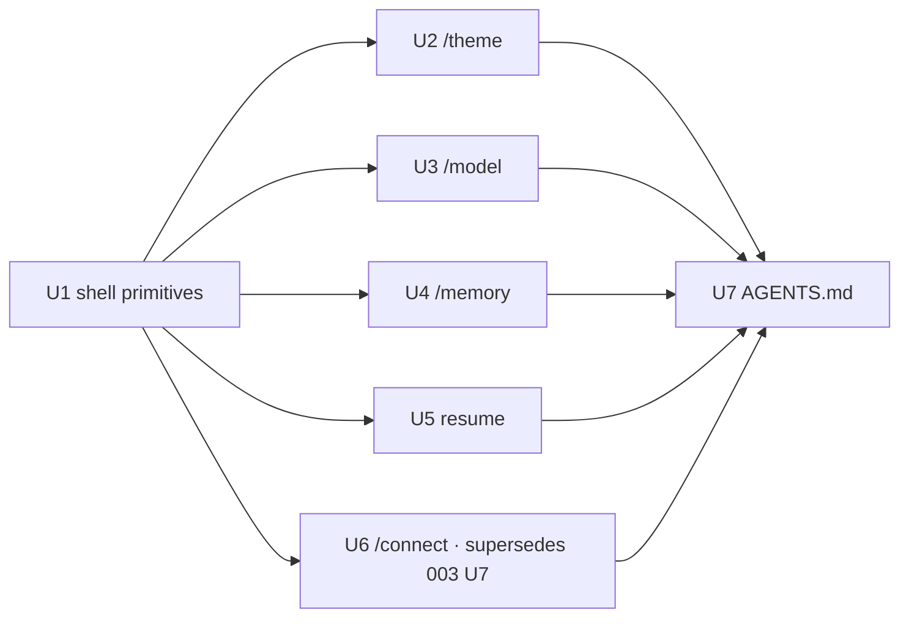

# refactor: Shared command-surface shell

## Summary

Extract a single shared `CommandSurface` shell that owns the docked command-popup frame — accent
top rule, `/label`, sized body region, always-on gap row, and bottom-pinned footer (hint + scroll
indicator) — plus the chrome/height math behind it, then refactor all five docked popups (`/theme`,
`/model`, `/memory`, `/connect`, resume) onto it so every surface shares one border/footer/body
structure and only its inner content differs. Adopting the shell is what finally gives `/connect`
its footer, gap, and hide-provider-list-during-steps behavior, so this **supersedes U7** of the
prior consistency plan (`docs/plans/2026-07-11-003-refactor-tui-command-surface-consistency-plan.md`).
Behavior-preserving for the four already-conforming surfaces; structural for `/connect`.

---

## Problem Frame

The prior plan (003) unified the *grammar* — one `❯` selection idiom, one constant popup height,
the accent top rule everywhere, and an always-on footer gap — and landed it across the surfaces
(U1–U6). But each docked surface still **hand-rolls its own frame**: the outer height-bounded box,
the `DockDivider`, the `/label` line, the `resolveDockedFooterGap` wiring, the `panelRows − chrome`
body math, the blank gap conditional, and a near-identical local `*Footer` component with the
scroll-position indicator copy-pasted four times. Because the frame is duplicated rather than shared,
it drifts: `/connect` never received the bottom-pinned footer or gap at all (003 U7 was deferred),
and it still renders everything in one `flexShrink` box with inline step hints. There is no single
interface a new command surface can adopt to inherit the shared chrome — the consistency lives in
convention, not in code. The user's goal is a shared command interface: the border, the bottom help
bar, and the body should come from one place, with only the inner content differing.

---

## Requirements

- R1. A single shared shell component owns the docked-popup frame: accent top rule, `/label` line, a
  sized body region, exactly one blank gap row, and a bottom-pinned footer (hint + right-aligned
  scroll indicator). (origin R7, R8)
- R2. The shell centralizes the chrome/height math (resolved body rows, footer-gap yield) and the
  scroll-position indicator, replacing the per-surface duplicates. (plan-local: DRY / drift-proofing)
- R3. All five docked popups render their frame through the shell; only their inner body content,
  label text, optional header rows, and footer-hint copy differ. (origin R4; user "all follow one interface")
- R4. `/connect` adopts the shell and thereby gains the bottom-pinned footer, always-on gap, and
  hide-provider-list-during-steps behavior, keeping the active provider identified while the list is
  hidden. At the minimum terminal height the primary (Kimi) credential flow fits without clipping; the
  multi-field custom flow prioritizes the active input, destination summary, and latest error above the
  gap, collapsing inactive fields rather than clipping the active input. This delivers origin R8/AE6 for
  `/connect` and **supersedes 003 U7**. (origin R6, R8)
- R5. The shell supports the two real structural variants without special-casing callers: optional
  header rows (`/memory`'s `[Active]`/`[Inbox]` tabs + status line) and a reserved in-body row
  (`/memory`'s table header) that feeds the gap-yield math. (origin R3, R8 exception)
- R6. No surface's content, data, backend behavior, selection idiom, constant height, top rule, or
  scroll windows change versus the post-003 state. The four conforming surfaces are refactored with
  identical rendered rows/content for their fixed-row bodies; variable-height bodies (`/model`'s
  inline-connect feedback) and every footer tone/color are pinned by explicit prop/branch assertions
  rather than by row-count parity alone (ink renders at chalk level 0, so color is not observable in
  `lastFrame`). Only `/connect` changes structure. (origin R1–R8, preservation)
- R7. `tui/AGENTS.md` documents the shell as the required frame for docked command surfaces, so new
  surfaces wrap it rather than re-deriving the chrome. (origin R9)

**Origin acceptance examples (preserved, re-verified post-refactor):** AE1 (switching → same height),
AE2 (short terminal caps at half), AE3 (pad blank / scroll), AE4 (`/model` chevron + active dot),
AE5 (command-list chevron+bar + top rule), AE6 (footer gap at capped height) — now extended to
`/connect` via R4.

---

## Scope Boundaries

- Behavior-preserving for `/theme`, `/model`, `/memory`, and resume: the migration must produce the
  same rendered rows, markers, and footer as today. No content, data, backend, palette, selection,
  height, or scroll-window changes.
- `/connect` is the only surface whose structure changes, and only to conform (footer + gap +
  hide-list-during-steps + no min-height clipping). Its provider/credential backend logic, steps, and
  validation are unchanged.
- The floating `/` command menu (`SlashCommandMenu`) is **not** a docked-shell adopter. It is a
  compact, content-sized autocomplete list floating above the composer — no half-height dock, no
  footer hint, no scroll indicator — so the docked shell's contract does not fit it. It already
  conforms to the shared selection idiom (`SelectableRow`) and gained the accent top rule in 003.
  Forcing it into the docked shell would be wrong, not consistent.
- `/help` stays fullscreen and unchanged (the standing docked-popup exception).
- No new footer-hint copy beyond relocating `/connect`'s existing inline step hints into the footer
  slot. No palette or theme-token changes; reuse `accentBlue` / `inputBackground` / `muted` / `warning`.

### Deferred to Follow-Up Work

- Removing the residual dead per-surface `*DesiredRowsAtom` (theme/model/memory/resume/connect), which
  003 already retired in favor of `dockedPanelDesiredRowsAtom` returning the shared constant. This
  cleanup is tangential to the shell and is only worth doing once all migrations confirm the atoms
  are unreferenced: a separate tidy-up PR.
- `/ce-compound` capture of the `CommandSurface` / `useCommandSurfaceLayout` / chrome-budget
  conventions as a durable `docs/solutions/` learning, once the shell has shipped.

---

## Context & Research

*Grounded in first-hand context from implementing 003 U1–U6 this session; no redundant repo-research
dispatched (strong local patterns, known shape — Phase 1.2 skip).*

### Relevant Code and Patterns

- The four conforming surfaces share an identical frame today and are the template the shell
  factors out: `tui/src/components/ThemeSurface/index.tsx`, `tui/src/components/ModelSurface/index.tsx`,
  `tui/src/components/MemorySurface/index.tsx`, `tui/src/components/ResumePanel/index.tsx`. Each is
  `Box(height=panelRows) → DockDivider → <Text>{label}</Text> → [header] → body(listRows) → gap →
  local *Footer`, driven by `resolveDockedFooterGap`.
- `tui/src/components/ConnectSurface/index.tsx` is the non-conformer: one `flexShrink={0}` box holding
  divider + label + always-visible `ProviderList` + step content with inline hints; no
  `resolveDockedFooterGap`, no gap, no bottom-pinned footer, no windowing.
- `tui/src/libs/tui/layout.ts` — `resolveDockedFooterGap({ panelRows, chromeWithGap, reservedContentRows })`
  and `resolveDockedPanelRows` (half-cap) are the pure math the hook wraps; `resolveWindowOffset`
  is the model for adding a pure `positionIndicator` helper here.
- `tui/src/components/DockDivider.tsx` — the accent top rule, already shared; the shell renders it.
- `tui/src/components/SelectableRow/index.tsx` — the row-level shared primitive from 003; the shell
  is its frame-level analog (rule/label/body/gap/footer vs a single selectable row).
- Chrome budgets (kept verbatim — see Key Technical Decisions): `THEME_DOCK_CHROME_ROWS = 4`
  (`tui/src/state/ui/theme/atoms.ts`), `MODEL_DOCK_CHROME_ROWS = 4`
  (`tui/src/state/ui/model/constants.ts`), `MEMORY_DOCK_LIST_CHROME_ROWS = 6` /
  `MEMORY_DOCK_SUBSTATE_CHROME_ROWS = 4` (`tui/src/state/ui/memory/atoms.ts`),
  `RESUME_PANEL_CHROME_ROWS = 5` + `RESUME_PANEL_SESSION_ROWS = 10` (`tui/src/constants/ui.ts`).
- `tui/src/test/renderWithJotai.tsx` — the render harness used by every surface test; ink renders at
  chalk level 0 (no ANSI) and strips trailing whitespace, so assert markers/content/row-positions,
  not colors or bar-padding.

### Institutional Learnings

- Terminal-edge rendering: render frame elements inside a width-bounded `Box` at `safeChromeColumns`
  and pad `<Text>` to that width (never a stretchable background `<Box>`), so nothing depends on the
  reserved final terminal column. `DockDivider` and `SelectableRow` already follow this; the shell must too.
- Layering: `components → state → libs`; `libs` never imports `@state`. The pure `positionIndicator`
  belongs in `libs/tui/layout.ts`; the `useCommandSurfaceLayout` hook (reads atoms) belongs under
  `components/CommandSurface/`.
- Cursor/layout guard (`tui/AGENTS.md`): docked popup heights feed `layoutAtom` /
  `bottomSpacerRowsAtom`; this refactor changes rendering, not the height atoms, so the composer
  caret math is unaffected — but re-verify the caret still lands on the composer row after the
  `/connect` restructure.

---

## Key Technical Decisions

- **Split the shell into a layout hook + a pure presentational component + a footer + a pure helper.**
  `useCommandSurfaceLayout` centralizes the chrome math and returns `bodyRows` (needed at the surface
  top level for the `setVisibleRows` effect *and* for render-time list windowing); `<CommandSurface>`
  is pure presentational; `<CommandFooter>` owns the footer shape; `positionIndicator` is pure math.
  Rationale: a render-prop-only component can't supply `bodyRows` to a `useEffect` (hooks can't live
  in callbacks), and the surface windows its list *before* handing content to the frame. The hook is
  the single source of the math; the component never recomputes it.
- **The shell takes each surface's `chromeWithGap` verbatim; it does not recompute chrome from a
  generic formula.** Every budget is `4 + headerRows` once resume's column-header is counted as a header
  row (theme/model/connect = 4, resume = 5, `/memory` = 6/4), but the shell still takes each surface's
  declared `chromeWithGap` constant rather than recomputing it — this keeps the budget explicit at each
  call site, avoids coupling the shell to counting header-slot rows, and lets each migration assert
  row-parity against a known number. The shell centralizes *rendering + math-wiring + the footer*, not
  the chrome numbers. `reservedContentRows` (`/memory`'s in-body table header = 1) passes through to the
  gap-yield.
- **The shell's footer is `/memory`'s complete footer promoted to the standard**: `wrap="truncate"`
  plus reserving room for the right-aligned indicator (`columns − position.length − 1`) so a long hint
  truncates instead of shrink-wrapping to a second row and over-subscribing the panel. All surfaces
  inherit this hardening. A `footerTone` prop covers `/theme`'s save-warning color swap.
- **`/connect`'s body becomes step-aware, with a compact min-height composition.** The `ProviderList`
  renders only on the `List` step (as the body); during a credential step (`Key` / `CustomUrl` /
  `CustomLabel` / `ConnectedActions`) the list is hidden and the step form is the body — mirroring
  `/memory`'s `subStateActive ? null`. The provider stays identified through a dynamic label
  (`/connect · <provider>`) rather than the hidden list. Hiding the list frees rows, but the custom flow
  still has more fields than the ~3-row body at `rows = 15` (`CustomForm` renders Base URL + destination
  host + Label, and today renders alongside the API-key block during the custom Key step). So at the min
  height the step body renders only the active field/input, a one-line destination summary, and at most
  one feedback line (`Working…` OR the latest outcome/error, not several) above the gap — collapsing
  filled/inactive fields rather than clipping the active input. The Kimi flow (base-URL line + key input +
  one feedback = 3 rows) fits without collapsing. The step hint moves to the footer slot; the destructive
  clear-confirm prompt stays as prominent body content with its own confirm hint.
- **The shell always sets `overflow="hidden"`** on the outer box and the body region, and the footer is
  pinned purely by the fixed body height — children stack in document order with no `justifyContent` or
  bottom spacer, so with a correct `chromeWithGap` every surface fills `panelRows` exactly. This
  guarantees the footer cannot be pushed off-canvas by body overflow. `/memory` and `/connect` already
  set overflow-hidden; extending it to all surfaces is a consistency hardening with no visible change
  when content fits.
- **Resume keeps its own `resumePanelRowsAtom` and `RESUME_PANEL_SESSION_ROWS` body cap, and its
  column-header moves into the shell `header` slot.** `ResumeRows` today renders `visibleRows + 1` rows —
  an internal column-header at index 0 plus the sessions — which is exactly why `RESUME_PANEL_CHROME_ROWS`
  is 5 (`= divider + label + column-header + gap + footer`, i.e. `4 + 1` header row). Rendering that
  header inside a fixed-height body box would clip the last session, so U5 moves the column-header into
  the shell `header` slot (like `/memory`'s tabs); `ResumeRows` then renders only sessions and the body
  holds exactly `min(RESUME_PANEL_SESSION_ROWS, layout.bodyRows)` rows. The surface resolves `panelRows`
  from its own atom and passes it into the shared hook. With the header counted in the slot, resume fills
  `panelRows` exactly (no trailing slack). This also makes every surface's budget a clean `4 + headerRows`
  (theme/model/connect = 4, resume = 5, `/memory` = 6/4), though the shell still takes each surface's
  `chromeWithGap` value rather than recomputing it — see the decision above."

---

## Output Structure

    tui/src/components/CommandSurface/
      index.tsx                       # <CommandSurface> — the shared frame (pure presentational)
      useCommandSurfaceLayout.ts      # hook: chrome/body/gap math (wraps resolveDockedFooterGap)
      CommandFooter.tsx               # footer: truncating hint + right-aligned scroll indicator + tone
      __tests__/
        CommandSurface.test.tsx       # frame composition + gap presence/absence
        useCommandSurfaceLayout.test.ts  # chrome math incl. hard-cap gap yield
    tui/src/libs/tui/layout.ts        # + positionIndicator(offset, maxOffset) pure helper

---

## High-Level Technical Design

> *This illustrates the intended approach and is directional guidance for review, not implementation
> specification. The implementing agent should treat it as context, not code to reproduce.*

```text
// Hook — the single source of docked chrome math (wraps resolveDockedFooterGap + panelRows − chrome).
useCommandSurfaceLayout({ panelRows, chromeWithGap, reservedContentRows? })
  -> { bodyRows, showFooterGap, columns }

// Component — the shared frame, pure presentational (no atom reads it can't get from props/DockDivider).
<CommandSurface
  panelRows                 // resolved from the surface's dock atom
  layout                    // the hook result { bodyRows, showFooterGap, columns }
  label                     // accentBlue text: "/theme" | dynamic "Resume Session: …" | "/connect · Kimi"
  header?                   // ReactNode: extra header rows (/memory tabs+status, resume column-header); counted in chromeWithGap
  bodyRows                  // fixed body height (usually layout.bodyRows; resume caps at SESSION_ROWS)
  footerHint                // step/mode-dependent hint string
  footerTone?               // 'muted' (default) | 'warning' (/theme save warning)
  position                  // "more ↑↓" | "" via shared positionIndicator
>
  {windowedBody}            // the surface has already windowed its list to bodyRows
</CommandSurface>

// Renders identically for every docked surface:
//   Box(flexDirection=column, height=panelRows, overflow=hidden)
//     DockDivider
//     Text(label, accentBlue)
//     header?
//     Box(flexDirection=column, height=bodyRows, overflow=hidden){ windowedBody }
//     showFooterGap ? Text(' ') : null
//     CommandFooter(columns, footerHint, footerTone, position)
//   The footer is pinned by the fixed body height — children stack in order, no justifyContent /
//   bottom spacer — so with a correct chromeWithGap every surface fills panelRows exactly.
```

**Migration dependency shape** (U1 unblocks the five migrations; the migrations are mutually
independent and may land in any order; docs come last):



**Sequencing note:** although the five migrations are order-independent as *dependencies*, they all rely
on U1's shell API being right. Migrate the hardest consumers first — `/memory` (header slot +
`reservedContentRows` + hard-cap gap yield) and `/connect` (dynamic label + compact min-height body) — so
any shell-API gap surfaces before the easy surfaces (theme/model/resume) adopt it. Treat U1's props as
provisional until `/memory` and `/connect` have landed on the shell.

---

## Implementation Units

### U1. Extract the shared `CommandSurface` shell, layout hook, footer, and position helper

**Goal:** Create the shared frame primitives — the presentational `CommandSurface`, the
`useCommandSurfaceLayout` chrome-math hook, the `CommandFooter`, and a pure `positionIndicator` — with
their own tests, before any surface consumes them.

**Requirements:** R1, R2, R5

**Dependencies:** None

**Files:**
- Create: `tui/src/components/CommandSurface/index.tsx`
- Create: `tui/src/components/CommandSurface/useCommandSurfaceLayout.ts`
- Create: `tui/src/components/CommandSurface/CommandFooter.tsx`
- Modify: `tui/src/libs/tui/layout.ts` (add pure `positionIndicator(offset, maxOffset)`)
- Test: `tui/src/components/CommandSurface/__tests__/CommandSurface.test.tsx`
- Test: `tui/src/components/CommandSurface/__tests__/useCommandSurfaceLayout.test.ts`
- Test: `tui/src/libs/tui/__tests__/layout.test.ts` (extend for `positionIndicator`)

**Approach:**
- `useCommandSurfaceLayout` wraps `resolveDockedFooterGap({ panelRows, chromeWithGap, reservedContentRows })`,
  reads `safeChromeColumnsAtom`, and returns `{ bodyRows: max(1, panelRows − chromeRows), showFooterGap,
  columns }`. It does not read a dock-rows atom — `panelRows` is an input so resume can pass its own.
- `<CommandSurface>` renders the frame in the fixed order above. It is pure: props in, frame out; it
  renders `DockDivider`, the label `<Text>`, the optional `header` node, a fixed-height body box, the
  conditional gap row, and `CommandFooter`. Keep it under ~120 lines.
- `<CommandFooter>` renders the truncating hint + right-aligned `positionIndicator` output, reserving
  `columns − position.length − 1` for the hint when a position shows (the `/memory` hardening), with a
  `tone` selecting `muted` vs `warning`.
- Promote `positionIndicator` (currently `/memory`'s local `positionIndicator`) to `libs/tui/layout.ts`
  as the single pure implementation: `maxOffset === 0 ? '' : offset <= 0 ? 'more ↓' : offset >= maxOffset ? 'more ↑' : 'more ↑↓'`.

**Patterns to follow:**
- `DockDivider` and `SelectableRow` for the width-bounded `Box` + padded-`<Text>` edge-safe idiom.
- `/memory`'s existing footer (`MemoryFooter`) for the truncate + hint-width-reservation logic that
  becomes the standard `CommandFooter`.
- `resolveWindowOffset` in `layout.ts` as the home for the new pure `positionIndicator`.

**Test scenarios:**
- Happy path: `<CommandSurface>` with a stub body renders, in order, the divider, the label, the body,
  a gap row, and the footer hint (assert row positions / content via `lastFrame()`).
- Happy path: passing a `header` node inserts it between the label and the body.
- Edge case: `showFooterGap = false` (via a `layout` where the yield fires) renders no blank gap row
  and the footer sits directly under the body.
- Happy path (footer): a `position` of `more ↑↓` renders right-aligned; the hint truncates rather than
  wrapping when `hint.length + position.length` exceeds `columns`.
- Happy path (tone): `footerTone: 'warning'` colors the hint with the warning token (assert via the
  chosen theme token; colors aren't observable in `lastFrame`, so assert through a prop/branch, not ANSI).
- Hook: `useCommandSurfaceLayout` returns `bodyRows = panelRows − chromeWithGap` and `showFooterGap = true`
  when `panelRows − chromeWithGap − reservedContentRows >= 1`.
- Hook (Covers AE6 mechanics): with `reservedContentRows = 1` at the boundary where
  `panelRows − chromeWithGap − 1 < 1`, `showFooterGap = false` and `bodyRows = panelRows − (chromeWithGap − 1)`
  (the `/memory` hard-cap yield).
- `positionIndicator`: `maxOffset = 0 → ''`; `offset = 0 → 'more ↓'`; `offset = maxOffset → 'more ↑'`;
  mid-range → `'more ↑↓'`.

**Verification:**
- The shell, hook, footer, and helper exist with green unit tests and no production consumer yet;
  typecheck passes; no import-cycle introduced (`libs` still free of `@state`). Treat the props as
  provisional until the hardest consumers (`/memory`, `/connect`) validate the API.

---

### U2. Migrate `/theme` onto the shell

**Goal:** Render `/theme` through `CommandSurface` + `useCommandSurfaceLayout`, deleting its local
frame boilerplate and `ThemeFooter`, with identical rendered output.

**Requirements:** R3, R6

**Dependencies:** U1

**Files:**
- Modify: `tui/src/components/ThemeSurface/index.tsx`
- Test: `tui/src/components/ThemeSurface/__tests__/ThemeSurface.test.tsx` (or the existing theme test file)

**Approach:**
- Replace the outer `Box` + `DockDivider` + `/theme` `<Text>` + gap conditional + local `ThemeFooter`
  with `<CommandSurface label="/theme" …>`. Call `useCommandSurfaceLayout({ panelRows, chromeWithGap:
  THEME_DOCK_CHROME_ROWS })`; keep the `setVisibleRows(listRows)` effect and the `revert-preview`
  lifecycle. Pass `ThemeRows` as the body at `layout.bodyRows`, the footer hint, `footerTone` =
  `warning` when a save-warning is present (else `muted`), and `position` from `positionIndicator`.
- `THEME_DOCK_CHROME_ROWS` stays as the surface's declared budget (passed to the hook). Header is `null`.

**Patterns to follow:**
- The shell contract from U1; the existing `ThemeSurface` behavior (save-warning-in-footer, preview
  revert on close) is preserved.

**Test scenarios:**
- Happy path (Covers AE1/AE3): `/theme` renders the divider, `/theme` label, the theme rows, a gap
  row, and the footer hint — same rows as before the migration.
- Happy path: a save warning renders in the footer with the warning tone instead of the hint.
- Edge case: the scroll indicator shows `more ↓` / `more ↑↓` / `more ↑` at top / middle / bottom of a
  catalog longer than the visible rows.
- Happy path (Covers AE... selection): the highlighted theme row still shows the `❯` chevron + bar via
  `SelectableRow` (unchanged), and `enter` still applies the theme.

**Verification:**
- `/theme` renders identically to the pre-migration surface (row-count + content parity) and its tests pass.

---

### U3. Migrate `/model` onto the shell

**Goal:** Render `/model` through the shell, including its inline-connect API-key body variant, with
the active-model `●` dot preserved.

**Requirements:** R3, R6

**Dependencies:** U1

**Files:**
- Modify: `tui/src/components/ModelSurface/index.tsx`
- Test: `tui/src/components/ModelSurface/__tests__/ModelSurface.test.tsx` (existing model test file)

**Approach:**
- Swap the local frame + `ModelFooter` for `<CommandSurface label="/model" …>` with
  `useCommandSurfaceLayout({ panelRows, chromeWithGap: MODEL_DOCK_CHROME_ROWS })`. The body is either
  `ModelRows` (windowed at `layout.bodyRows` via `windowProviderModelRows`) or the inline-connect
  API-key box (`MaskedInput` + `Working…` + `OutcomeMessage`/`RequestErrorMessage`), selected as
  today by `inlineProviderId`. Keep the `setVisibleRows` effect and `refreshModels` effect.
- Preserve the active-model `●` state dot inside `ModelRows` (a state indicator, not the cursor).

**Patterns to follow:**
- The `/theme` migration (U2); the existing inline-connect body layout stays, now inside the shell body.

**Test scenarios:**
- Happy path (Covers AE4): the `/model` list renders with the `❯` chevron on the highlighted row and the
  active-model `●` dot preserved, inside the shared frame with gap + footer.
- Happy path: entering inline-connect swaps the body to the API-key input; the footer hint and gap
  still render; the frame height is unchanged.
- Edge case (min height, inline-connect): at `rows = 15` the API-key input + at most one feedback line
  (`Working…` OR outcome/error) render without clipping the input under the shell's `overflow="hidden"`
  body (the variable-height body case R6 calls out).
- Edge case: scroll indicator reflects the windowed offset over the full provider/model row set.
- Integration: `enter` selects a model / starts connect; `esc` closes — unchanged through the shell.

**Verification:**
- `/model` renders identically (list and inline-connect states) and its tests pass.

---

### U4. Migrate `/memory` onto the shell

**Goal:** Render `/memory` through the shell using the `header` slot for its tabs+status and the
`reservedContentRows` path for its table header, preserving the hard-cap gap yield.

**Requirements:** R3, R5, R6

**Dependencies:** U1

**Files:**
- Modify: `tui/src/components/MemorySurface/index.tsx`
- Test: `tui/src/components/MemorySurface/__tests__/MemorySurface.test.tsx` (existing memory test file)

**Approach:**
- Pass the `[Active]`/`[Inbox]` tabs line and the status line as the shell's `header` in list mode, and
  `null` header in sub-states (form/detail/confirm) — matching today's `subStateActive ? null` chrome
  drop. Call `useCommandSurfaceLayout({ panelRows, chromeWithGap: subStateActive ?
  MEMORY_DOCK_SUBSTATE_CHROME_ROWS : MEMORY_DOCK_LIST_CHROME_ROWS, reservedContentRows: subStateActive ? 0 : 1 })`.
- The body is the existing switch (forget-confirm / form / detail / list); the in-body table header
  stays, and `dataRows = bodyRows − 1` in list mode. Keep both `setVisibleRows`/`setDetailVisibleRows`
  effects. Use the shared `positionIndicator` (delete the now-duplicated local one).

**Patterns to follow:**
- Today's `MemorySurface` chrome-mode switch and windowing; the shell's `header` + `reservedContentRows`
  are the seams that absorb the tabs/status and table-header rows.

**Test scenarios:**
- Happy path: list mode renders divider, `/memory` label, tabs line, status line, the table + data
  rows, a gap, and the footer — same rows as today.
- Edge case (documented `/memory` exception to AE6, from 003 R8): at the hard `⌊rows/2⌋` cap in list
  mode, the gap yields (no blank row) so at least one data row still renders (`reservedContentRows = 1`
  path). `/memory` is the one surface that intentionally drops the gap; assert the data row is present,
  not that the gap is.
- Happy path: entering a sub-state (add/edit form, detail, forget-confirm) drops the tabs+status header
  and renders the sub-state body; the footer hint switches to the sub-state hint.
- Edge case: detail view scroll indicator reflects the detail offset; list view reflects the list offset.
- Integration: `tab` toggles Active/Inbox, `x`/`a`/`j`/`s`/`u` actions and `enter` view still work through the shell.

**Verification:**
- `/memory` renders identically across list/inbox/form/detail/confirm states, including the hard-cap
  gap yield, and its tests pass.

---

### U5. Migrate resume onto the shell

**Goal:** Render the resume panel through the shell with its dynamic label and its
`RESUME_PANEL_SESSION_ROWS` body cap preserved, including its chrome budget of 5.

**Requirements:** R3, R6

**Dependencies:** U1

**Files:**
- Modify: `tui/src/components/ResumePanel/index.tsx`
- Modify: `tui/src/components/ResumeSurface/ResumeRows.tsx` (drop the internal index-0 column-header + the `+ 1`; render only the sessions)
- Test: `tui/src/components/ResumePanel/__tests__/ResumePanel.test.tsx` (existing resume test file)

**Approach:**
- Resolve `panelRows` from `resumePanelRowsAtom` and pass it to `useCommandSurfaceLayout({ panelRows,
  chromeWithGap: RESUME_PANEL_CHROME_ROWS })`. Cap the body at `min(RESUME_PANEL_SESSION_ROWS,
  layout.bodyRows)` and pass that as the shell's `bodyRows`. The label is the dynamic
  `labelText(status, error, hiddenCurrentDraft)` (truncated), passed as `label`. The body is
  `ResumeRows` (loaded) or `PanelMessage` (loading/empty/failed). Delete the local `ResumeFooter`.
- **Move `ResumeRows`' internal column-header into the shell `header` slot.** `ResumeRows` today renders
  `visibleRows + 1` rows (a `formatResumeHeader` column-header at index 0, then the sessions), and
  `RESUME_PANEL_CHROME_ROWS = 5` already excludes that header from `bodyRows`. Wrapping a `visibleRows +
  1`-tall `ResumeRows` in a `height = bodyRows` box would clip the last session. So pass
  `formatResumeHeader(...)` as the shell `header`, and change `ResumeRows` to render only the sessions
  (`visibleRows` rows, no index-0 header). Chrome stays 5 (now `divider + label + header-slot + gap +
  footer`); the body holds exactly `sessionRows` sessions and fills `panelRows` with no clip and no slack.
- Assert row-parity against today's rendered output (same header line, same session rows, same footer).

**Patterns to follow:**
- The `/theme` migration; resume differs only in the dynamic label, the `SESSION_ROWS` body cap, and
  passing its own `panelRows` atom into the hook.

**Test scenarios:**
- Happy path: loaded resume renders divider, dynamic `Resume Session:` label, the column-header row, the
  session rows, a gap, and the footer — same rows as today, at the same total height.
- Edge case (off-by-one guard): at `panelRows = 15` with ≥10 sessions, all `sessionRows` session rows
  render (the last one is not clipped) and the scroll indicator matches the windowed count.
- Edge case: the `hiddenCurrentDraft` label variant renders (truncated) without changing the row budget.
- Edge case: loading/empty/failed states render the `PanelMessage` body at the same height.
- Happy path: scroll indicator shows `more …` when sessions exceed the visible rows.
- Integration: `enter` resumes the highlighted session; `esc` closes — unchanged.

**Verification:**
- Resume renders identically to today (row-count + content parity, chrome budget 5 preserved, no session
  row clipped) and its tests pass.

---

### U6. Migrate `/connect` onto the shell — structural conformance (supersedes 003 U7)

**Goal:** Restructure `/connect` onto the shell so it gains the bottom-pinned footer, always-on gap,
and hide-provider-list-during-steps behavior, keeping the active provider identified and step
input/feedback prioritized (not clipping the active input) at the min height.

**Requirements:** R3, R4, R6

**Dependencies:** U1

**Files:**
- Modify: `tui/src/components/ConnectSurface/index.tsx`
- Modify: `tui/src/components/ConnectSurface/CustomForm.tsx` (strip the now-duplicated inline step hint; add a compact/collapsed variant for the min-height step body)
- Modify: `tui/src/components/ConnectSurface/ConnectedActions.tsx` (strip inline nav hint; keep the clear-confirm prompt as body content)
- Modify: `tui/src/components/ConnectSurface/ProviderList.tsx` (render only as the `List`-step body)
- Modify: `tui/src/state/ui/connect/atoms.ts` (add a new shell chrome constant `CONNECT_SHELL_CHROME_ROWS = 4` = divider+label+gap+footer; **leave** the existing `CONNECT_DOCK_CHROME_ROWS = 2` and `connectDesiredRowsAtom` in place — their removal is the deferred `*DesiredRowsAtom` cleanup, and deleting the constant now would break `connectDesiredRowsAtom` and its test)
- Test: `tui/src/components/ConnectSurface/__tests__/ConnectSurface.test.tsx`
- Test: `tui/src/components/ConnectSurface/__tests__/useConnectInput.test.tsx` (if step→footer hint changes touch input expectations)

**Approach:**
- Replace the single `flexShrink={0}` box with `<CommandSurface label={connectLabel} …>` +
  `useCommandSurfaceLayout({ panelRows, chromeWithGap: CONNECT_SHELL_CHROME_ROWS })`. The body is
  step-aware: on `ConnectStep.List` the body is `ProviderList`; on a credential step the list is hidden
  and the body is the step form (`CustomForm`, the Kimi base-URL + `MaskedInput` block, or
  `ConnectedActions`) — mirroring `/memory`'s `subStateActive ? null` list-hiding.
- **Keep the active provider identified while the list is hidden** via a dynamic label:
  `connectLabel = "/connect"` on the List step, `"/connect · <provider name/label>"` during a step. No
  extra chrome row (reuses the `label` string prop, as resume does).
- **Fit the step body to the min height.** At `rows = 15`, `panelRows = 7` and the body is ~3 rows, but
  today the custom Key step renders `CustomForm` (Base URL + destination host + Label) *and* the API-key
  block simultaneously (≥5 rows) because the `providerId === CUSTOM && step !== List && step !==
  ConnectedActions` branch overlaps the `step === Key` branch. So the step body must render only the
  active field/input, a one-line destination summary, and **at most one** feedback line (`Working…` OR the
  latest outcome/error) above the gap — collapsing filled/inactive fields, not clipping the active input.
  The Kimi flow already fits (base-URL line + key input + one feedback = 3 rows).
- Move each step's hint (`Enter submits · Esc back`, connected-actions nav, etc.) into the shell footer
  slot; compute the hint from the current step, **and** cover the non-step sub-modes: a confirm-specific
  hint (`y confirm · n cancel`) during clear-confirm and a neutral hint during `Working…`. `position = ''`:
  the provider list enumerates the fixed provider catalog (currently Kimi + Custom), which fits the body,
  so it is not windowed and shows no indicator. The destructive clear-confirm prompt stays as prominent
  body content.

**Execution note:** Start from a failing render test asserting the gap + bottom-pinned footer exist for
`/connect` (neither exists today), then restructure until it passes — this is the behavior-changing unit.

**Patterns to follow:**
- The uniform `/theme`/`/model` composition via the shell; `/memory`'s sub-state list-hiding + reduced
  chrome as the model for hiding `ProviderList` during steps.

**Test scenarios:**
- Happy path (Covers AE6): with `/connect` open, one blank gap row sits directly above a bottom-pinned
  footer-hint line (neither exists today).
- Happy path (provider identity): during a credential step the label reads `/connect · <provider>` so the
  user still sees which provider they are configuring while the list is hidden.
- Happy path: each step's hint (provider list, Kimi key entry, custom URL/label form, connected
  actions) renders in the footer slot, not inline mid-content; the clear-confirm and `Working…`
  sub-modes show their own footer hint.
- Edge case (min height, Kimi key step): at `rows = 15`, with the key step active, the provider list is
  hidden and the base-URL line + `MaskedInput` + one feedback line render (not clipped) above the pinned
  footer.
- Edge case (min height, custom step): at `rows = 15`, the active field/input + destination summary +
  latest error render without clipping the active input; inactive/filled fields collapse.
- Edge case (single feedback line): when both a `Working…`/stale outcome and an error could show, only
  one feedback line renders at the min height so nothing clips.
- Happy path: hints are not duplicated — a step's nav hint appears only in the footer; the clear-confirm
  prompt still shows as body content.
- Integration: stepping through connect (select provider → enter key / fill form → connect → connected
  actions → clear) still works with the restructured layout.

**Verification:**
- `/connect` shows the same divider + gap + bottom-pinned footer as the other docked popups; switching
  to/from it shows no height change; the active provider stays labeled during steps; and the active input
  is never clipped at the min height (inactive fields may collapse).

---

### U7. Document the shell as the required docked-surface frame in `tui/AGENTS.md`

**Goal:** Record that docked command surfaces render their frame through `CommandSurface` +
`useCommandSurfaceLayout`, so new surfaces inherit the chrome instead of re-deriving it.

**Requirements:** R7

**Dependencies:** U1, U2, U3, U4, U5, U6

**Files:**
- Modify: `tui/AGENTS.md` (Command surfaces / Selection and height grammar sections)

**Approach:**
- Document the shell contract: the frame (`DockDivider` → `/label` → optional `header` → sized body →
  always-on gap → bottom-pinned `CommandFooter`) comes from `<CommandSurface>`; the chrome/body/gap math
  comes from `useCommandSurfaceLayout` wrapping `resolveDockedFooterGap`; each surface passes its own
  `chromeWithGap` (which encodes real structural differences — header rows, resume's reserve) and, when
  it reserves an in-body header row, `reservedContentRows`. State that new docked command surfaces MUST
  wrap `CommandSurface` and MUST NOT hand-roll a divider/label/gap/footer. Note the floating `/` menu is
  intentionally exempt (compact floating list, not a docked half-height surface). Remove/replace any
  now-stale wording that described the per-surface frame as the pattern.

**Test scenarios:**
- Test expectation: none — documentation-only update.

**Verification:**
- `tui/AGENTS.md` describes the shell well enough that a contributor can add a conforming docked surface
  without re-deriving marker, height, divider, or footer-gap choices.

---

## System-Wide Impact

- **Interaction graph:** All five docked surfaces render their frame through `CommandSurface`; the
  height atoms (`dockedPanelRowsAtom` / `resumePanelRowsAtom`) that feed `layoutAtom` /
  `bottomSpacerRowsAtom` are unchanged — this refactor moves *rendering*, not the height budget. The
  composer-caret math is therefore unaffected, but re-verify the caret after the `/connect` restructure.
- **Error propagation:** `/connect`'s transient outcome/error line and `/model`'s inline-connect
  feedback move into the shell body; they must remain visible (pinned above the gap), not clipped.
- **State lifecycle risks:** The shared `positionIndicator` replaces three inline copies (`ThemeFooter`,
  `ModelFooter`, `ResumeFooter`) + `/memory`'s local `positionIndicator` — ensure all callers use the
  single helper and none keep a divergent copy. `/connect` has no scroll indicator today and adds none.
  `/connect`'s old `CONNECT_DOCK_CHROME_ROWS = 2` stays until the deferred cleanup removes its
  `connectDesiredRowsAtom` consumer; the shell uses a separate connect chrome constant.
- **API surface parity:** `/model`'s active-`●` dot and `/memory`'s `[Active]`/`[Inbox]` tabs are state
  indicators that must survive the migration unchanged (they live in the body / header, not the frame).
- **Integration coverage:** Selection→action wiring per surface is unit-provable; the caret-on-composer
  behavior after the `/connect` restructure is only provable via the layout caret guard plus a manual
  visual check.
- **Unchanged invariants:** No surface content, backend calls, theme palette, scroll windows, constant
  height, selection idiom, top rule, or `/help` behavior change; `DockDivider`, `SelectableRow`,
  `resolveDockedPanelRows`, and the dock-height atoms are reused as-is. The floating `/` menu is untouched.

---

## Risks & Dependencies

| Risk | Mitigation |
|------|------------|
| Resume's `ResumeRows` renders `visibleRows + 1` (an internal column-header), so a fixed-height body box would clip the last session | U5 moves the column-header into the shell `header` slot; `ResumeRows` renders only sessions; chrome stays 5 (`4 + 1` header); assert all session rows render at `panelRows = 15`. |
| `/memory` renders zero data rows at the hard min-height cap | Carry `reservedContentRows = 1` through the hook so the gap yields only there; U4 asserts a data-row line at the cap (AE6). |
| `/connect` custom step has more fields than the ~3-row body at `rows = 15` (`CustomForm` + API-key block ≥ 5 rows) | Hide the provider list during steps AND render only the active field/input + destination summary + one feedback line at min height (collapse inactive fields); R4 scopes the guarantee so the active input is never clipped; U6 tests each step at `rows = 15`. |
| Behavior-preserving migrations silently change rendered output | Treat U2–U5 as refactors with row-count + content parity assertions; the shell reproduces the exact frame order and per-surface chrome. Colors/tone are not observable in `lastFrame`, so each migration also asserts `footerTone`/color via the prop or branch (esp. U2's save-warning). |
| Long footer hint wraps to a second row and over-subscribes the panel | The standard `CommandFooter` truncates and reserves room for the right-aligned indicator (the `/memory` hardening), inherited by all surfaces. |
| Full-width bar / frame smears into the reserved final column | Reuse the `DockDivider` / `SelectableRow` width-bounded `Box` + padded-`<Text>` idiom in the shell; no stretchable background `<Box>`. |
| New shared component introduces an import cycle | Component + hook under `components/CommandSurface/`; the pure `positionIndicator` in `libs/tui/layout.ts`; `libs` never imports `@state`. Verify with the repo's cycle detector. |
| `/connect` restructure drifts the composer caret | The height atoms are unchanged; rely on the `layout.test.ts` caret/canvas guards and a manual visual check after U6. |
| Shell API gap discovered late forces rework of already-migrated surfaces | Migrate the hardest consumers (`/memory`, `/connect`) first to validate the shell API; treat U1's props as provisional until they land, before theme/model/resume adopt it. |
| Deleting `CONNECT_DOCK_CHROME_ROWS` in U6 breaks the deferred `connectDesiredRowsAtom` + its test | U6 adds a *separate* `CONNECT_SHELL_CHROME_ROWS = 4` and leaves the old constant/atom for the deferred `*DesiredRowsAtom` cleanup PR. |
| Concurrent-session edits on this shared branch collide across the many touched files | Re-read shared files immediately before edits; commit each unit with explicit pathspec; verify `git status` for foreign writes before committing. |

---

## Documentation / Operational Notes

- U7 updates `tui/AGENTS.md`. After the shell ships, capture the `CommandSurface` /
  `useCommandSurfaceLayout` / chrome-budget conventions as a `docs/solutions/` learning via
  `/ce-compound` (listed under Deferred to Follow-Up Work).
- Validate with `cargo xtask tui-typecheck` and `cargo xtask tui-test` (or, from `tui/`, `bun run
  typecheck` and `bun run test` / `bunx vitest run <file>` for targeted surface tests). No Rust,
  protocol, or backend changes are involved.

---

## Alternative Approaches Considered

- **A single render-prop `<CommandSurface>` that computes and injects `bodyRows` to its children.**
  Rejected: the surface needs `bodyRows` at its top level for the `setVisibleRows` effect and for
  render-time list windowing, and hooks cannot run inside a render-prop callback. The hook + pure
  component split gives the surface `bodyRows` once and keeps the component free of atom reads.
- **A generic chrome formula in the shell (`4 + headerRows`), retiring the per-surface chrome
  constants.** Once resume's column-header moves into the `header` slot, every budget is in fact
  `4 + headerRows` (theme/model/connect = 4, resume = 5, `/memory` = 6/4), so the formula is viable.
  Rejected anyway: keeping each surface's declared `chromeWithGap` constant is more explicit, avoids
  coupling the shell to reliably counting header-slot rows, and de-risks the migration by letting each
  surface assert row-parity against its own known budget. The formula can replace the constants in a
  later tidy-up if the duplication proves annoying.
- **Fold the dead `*DesiredRowsAtom` cleanup into this plan.** Rejected for scope: it is 003's leftover,
  tangential to the shell, and safer as a separate tidy-up once all migrations confirm the atoms are
  unreferenced (Deferred to Follow-Up Work).
- **Make the floating `/` command menu adopt the docked shell too.** Rejected: it is a compact,
  content-sized floating autocomplete with no footer hint, scroll indicator, or half-height dock — the
  docked shell's contract does not fit it, and it already shares the selection idiom + top rule.

---

## Sources & References

- **Origin document:** [docs/brainstorms/2026-07-11-tui-command-surface-visual-consistency-requirements.md](docs/brainstorms/2026-07-11-tui-command-surface-visual-consistency-requirements.md)
- **Prior plan (superseded U7):** [docs/plans/2026-07-11-003-refactor-tui-command-surface-consistency-plan.md](docs/plans/2026-07-11-003-refactor-tui-command-surface-consistency-plan.md)
- Related code: `tui/src/components/{ThemeSurface,ModelSurface,MemorySurface,ResumePanel,ConnectSurface}/index.tsx`, `tui/src/components/DockDivider.tsx`, `tui/src/components/SelectableRow/index.tsx`, `tui/src/libs/tui/layout.ts`
- Conventions: `tui/AGENTS.md` (Command surfaces / Selection and height grammar)
