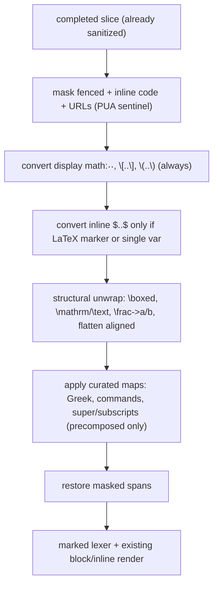

# feat: TUI LaTeX→Unicode Math Rendering and Broadened Code Highlighting

## Summary

Add a curated, zero-dependency LaTeX→Unicode converter to the TUI markdown pipeline and wire it in at the top of `renderMarkdownContentRows` (on the completed streaming slice, before tokenization) so assistant math renders as readable Unicode instead of raw `$…$`/`\boxed{}`/`\begin{aligned}`. Separately, switch the existing lowlight highlighter to highlight.js's `common` bundle and enrich the token-class→theme map. Both are display-only: the stored transcript keeps raw LaTeX, and no new runtime dependency is added.

---

## Problem Frame

KQode's markdown renderer formats headings, lists, tables, links, and syntax-highlighted code, but the 2026-07-10 markdown brainstorm explicitly deferred math, so LaTeX leaks through raw (`$\nabla_x(x^\top Ax)$`, `\begin{aligned}`, `\boxed{}`, bare `[`/`]`). It also registers only seven highlight languages, so `python`/`go`/`c` blocks render plain. See origin: `docs/brainstorms/2026-07-12-tui-math-and-code-block-rendering-requirements.md`.

---

## Requirements

**Math rendering (LaTeX → Unicode)**

- R1. Convert LaTeX math in assistant markdown to readable Unicode; display-only (transcript keeps raw LaTeX).
- R2. Cover Greek letters, common operators/relations/arrows/set-logic symbols, sub/superscripts where a Unicode form exists, and structural unwrapping (`\boxed`, `\mathrm`/`\text`, `\frac{a}{b}`→`a/b`, `\begin{aligned}` flattening) via an owned curated map plus a thin structural layer.
- R3. Precision-first `$` detection: display math always converts; inline `$…$` converts only on a LaTeX marker (`\command`, `_`, `^`) or single variable; currency/prose/shell vars stay literal.
- R4. Run after display sanitization, before markdown tokenization, masking code (fenced and inline) and URLs so their contents pass through verbatim.
- R5. Lossy-but-safe: unrecognized LaTeX and non-math backslash content left exactly as-is (never dropped or partially rewritten).
- R6. Bounded conversion: no catastrophic backtracking; oversized input capped.
**Code-block highlighting (extend existing)**

- R7. Broaden the lowlight/highlight.js registered language set toward the `common` bundle.
- R8. Extend the `hljs-*` class → theme-token map, honoring theme contrast gates.

**Origin acceptance examples:** AE1 (covers R2, R3), AE2 (covers R2), AE3/AE4/AE5 (cover R3), AE6 (covers R3), AE7 (covers R4), AE8 (covers R5), AE9 (covers R7). Preserved as constraints; enforced by the test scenarios below via `Covers AE<N>` links.

---

## Scope Boundaries

- No typeset/image math (Kitty/iTerm2/Sixel) — readable Unicode approximation only.
- No rewrite of the existing markdown renderer (headings, lists, blockquotes, tables, inline, links unchanged).
- Not the full ~190 highlight.js language set — target `common` (~37).
- Renderer-side only; no system-prompt/upstream nudge to the model.
- Display-only: the stored JSONL transcript and any future headless CLI surface keep raw LaTeX; no re-serialization.
- No copying/porting of Gemini CLI's `latexToUnicode` source — behavior/design reference only.
- No dedicated per-language code palettes or runtime highlight-theme switching (inherited from the 2026-07-10 doc).
- 2-D/exotic constructs (matrices, accent decorations such as `\hat`/`\vec`/`\bar`) are left literal in v1 rather than converted.

### Deferred to Follow-Up Work

- Upstream system-prompt nudge to have the model emit terminal-friendly Unicode math: possible later complement, separate change.
- Capture the new learnings (sanitizer ordering, LaTeX converter, streaming partial-block handling) via `/ce-compound` after this lands — the knowledge base currently has none.

---

## Context & Research

### Relevant Code and Patterns

- `tui/src/libs/markdown/renderBlocks.ts` — `renderMarkdownContentRows(markdown, columns, { streaming })`; streaming path splits `completed`/`trailing` via `splitStreamingMarkdown` and renders `trailing` plain. **Math conversion hooks in here.**
- `tui/src/libs/markdown/parseBlocks.ts` — `marked` lexer + `splitStreamingMarkdown`.
- `tui/src/libs/markdown/highlightCode.ts` — `createLowlight({ …7 langs })`, `hljs-` prefixed hast → `StyledSegment`s, 256-entry cache, `MAX_HIGHLIGHT_CODE_UNITS` cap.
- `tui/src/libs/markdown/highlightTheme.ts` — frozen `CLASS_TOKEN_MAP` (~11 `hljs-*` classes → theme tokens); mirror this frozen-map style for the symbol maps.
- `tui/src/libs/text/displayWidth.ts` — `measureGraphemes`/`displayWidth` (grapheme width); all rendered rows measure through this.
- `tui/src/libs/promptQueue/promptQueue.ts` — assistant text is `sanitizeDisplayText`-cleaned here (lines ~97/108) **before** it reaches rendering, confirming the "after sanitize, before tokenize" boundary.
- `tui/src/libs/tui/bodyRows.ts` — calls `renderMarkdownContentRows`; rows flow into `BodyPane` and the shared safe content width.
- Test convention: colocated `tui/src/libs/markdown/__tests__/*.test.ts` (vitest).

### Institutional Learnings

- `docs/solutions/architecture-patterns/terminal-edge-rendering-tradeoffs-in-the-ink-tui.md` — all body/transcript glyphs share one safe content width with a reserved final column; a mis-measured wide/ambiguous glyph reintroduces a documented last-column drop. **Emit precomposed Unicode, avoid combining marks, and width-test converted output.**
- `docs/solutions/architecture-patterns/state-libs-layering-and-cycle-verification-in-the-ink-tui.md` — `libs/` must not import `@state`, no barrel `index.ts`, colocate tests, and verify import cycles with the repo's **custom Tarjan-SCC detector** (`madge --circular` false-passes with the path-alias/`.ts` setup).
- Knowledge-base gap: no learning exists yet for sanitizer ordering, the LaTeX converter, lowlight setup, or streaming partial blocks — verify against source (done) and capture post-landing.

### External References

- `docs/research/2026-07-12-terminal-code-block-and-math-rendering.md` — Gemini CLI's `latexToUnicode` is the sole terminal precedent (precision-first `$`, convert-before-tokenize, mask code/URLs); design reference only, not to be copied. All other terminal agents render math raw; KaTeX appears only on web surfaces.
- npm inspection: `unicodeit@0.7.5` depends on `typeahead` (jQuery) and is CommonJS — unfit for the Bun/Ink app; `latex-to-unicode@0.1.0` is immature. Confirms the owned-map decision.

---

## Key Technical Decisions

- **Own a curated symbol map; no external library.** User-confirmed. The clean-fit library does not exist (`unicodeit` drags jQuery/`typeahead` + CJS; `latex-to-unicode` is v0.1.0), Gemini hand-rolls its maps, and KQode owns the precision detection, masking, and structural unwrapping regardless — a library would only replace the lookup table. Refines the origin's "symbol library" phrasing (see origin: R2).
- **Emit precomposed Unicode text only — never combining marks or ANSI.** Combining sequences mis-measure against the shared safe content width (reserved final column) and risk the documented last-column drop; `sanitizeDisplayText` rewrites ANSI to visible `\xNN`. Characters with no precomposed super/subscript form fall back to caret/underscore notation.
- **Convert at the top of `renderMarkdownContentRows`, on the completed slice.** Non-streaming: convert the whole string; streaming: convert only the `completed` slice (after `splitStreamingMarkdown`) and leave `trailing` plain — a half-arrived `$…` stays literal until it settles, so no separate streaming buffer is needed (resolves origin R4's streaming question).
- **Precision-first `$` detection with code/URL masking.** Mask fenced and inline code plus URLs first; the unambiguous `$$…$$`/`\[…\]`/`\(…\)` delimiters always convert; only bare `$…$` uses the marker-or-single-variable heuristic (origin R3/R4; validated by Gemini's shipped tests).
- **Broaden code coverage via lowlight `common` — zero new dependency.** `lowlight@^3.3.0` already exposes `common`; switch `createLowlight({…7})` to `createLowlight(common)`, keep aliases/cache/cap, and map the additional `hljs-*` classes onto existing theme tokens (not a new palette), honoring contrast gates (origin R7/R8; resolves the 2026-07-10 "extend vs map" deferral toward mapping).
- **New modules are pure `libs/` helpers.** No `@state` import, no barrel export, colocated tests; verify no import cycles with the repo's custom Tarjan detector, not `madge`.

---

## Open Questions

### Resolved During Planning

- Symbol table: own a curated map, no dependency.
- Insertion point: top of `renderMarkdownContentRows`, completed slice before `parseBlocks`; trailing stays plain.
- Language set: lowlight `common` (already installed).
- Theme-map approach: extend `CLASS_TOKEN_MAP` onto existing theme tokens.

### Deferred to Implementation

- Exact structural coverage beyond the origin's named set (e.g. `\sqrt`, `\overline`): start with the named set; add only if trivial and safe.
- Exact list of additional `hljs-*` classes to map: enumerate from `common` output during implementation, keeping WCAG contrast gates.
- Accent commands (`\hat`/`\vec`/`\bar`): left literal in v1 (no safe precomposed single-cell form) unless a width-safe treatment proves trivial.
- Whether to reuse `MAX_HIGHLIGHT_CODE_UNITS` or add a math-specific input cap for R6.
- Math-language fenced blocks (` ```latex `/` ```math `): default to verbatim like every other code block; revisit only if in-fence math rendering is later desired.

---

## High-Level Technical Design

> *This illustrates the intended approach and is directional guidance for review, not implementation specification. The implementing agent should treat it as context, not code to reproduce.*



Unknown `\command`, unmatched `$`, currency, and shell vars fall straight through unchanged (R5). All regexes use single-level brace classes (`[^{}]`) and the inline `$` matcher is single-line to avoid backtracking (R6).

---

## Implementation Units

### U1. Curated LaTeX symbol and script maps

**Goal:** A zero-dependency data module of frozen maps — Greek letters, named commands (operators, relations, arrows, set/logic, big operators), and super/subscript codepoints — plus helpers to look them up, emitting precomposed Unicode only.

**Requirements:** R2 (partial), R5, R6 (map side)

**Dependencies:** None

**Files:**
- Create: `tui/src/libs/markdown/latexSymbols.ts`
- Test: `tui/src/libs/markdown/__tests__/latexSymbols.test.ts`

**Approach:**
- Frozen `Record<string, string>` maps: `GREEK` (lower/upper + `var*`), `COMMANDS` (e.g. `nabla`→∇, `top`→⊤, `partial`→∂, `infty`→∞, `times`→×, `cdot`→·, `leq`→≤, `geq`→≥, `neq`→≠, `approx`→≈, `to`→→, `Rightarrow`→⇒, `in`→∈, `subseteq`→⊆, `cup`→∪, `cap`→∩, `forall`→∀, `exists`→∃, `sum`→Σ, `prod`→∏, `int`→∫, `sqrt`→√), `SUPERSCRIPTS`, `SUBSCRIPTS`.
- Helpers: `lookupCommand(name)` → glyph or `undefined`; `toSuperscript(str)`/`toSubscript(str)` → converted string, falling back to caret/underscore notation for characters with no precomposed form (never combining marks).
- Precomposed single-cell glyphs only — this is a display-width safety constraint, not a stylistic one.

**Patterns to follow:**
- Frozen-map + lookup style of `tui/src/libs/markdown/highlightTheme.ts`.

**Test scenarios:**
- Happy path: `\alpha`→α, `\nabla`→∇, `\top`→⊤, `\leq`→≤, `\sum`→Σ resolve correctly.
- Happy path: `toSuperscript('2')`→`²`, `toSuperscript('\top')`-equivalent→`ᵀ`, `toSubscript('i')`→`ᵢ`.
- Edge case: mixed convertible/unconvertible script content falls back to caret/underscore notation, not combining marks.
- Edge case: unknown command name returns `undefined` (caller leaves literal).
- Integration (width safety): every emitted glyph measured by `measureGraphemes` has its expected column width; no zero-width/combining characters are emitted.

**Verification:**
- Map lookups and script helpers behave per scenarios; the TUI typecheck and vitest suites pass; the emitted glyph set is width-safe.

---

### U2. LaTeX→Unicode converter (precision detection, masking, structural unwrap)

**Goal:** The core `convertLatexToUnicode(text)` — mask code/URLs, detect math spans precision-first, unwrap structural constructs, apply the U1 maps, restore masked spans; total and bounded.

**Requirements:** R2, R3, R4, R5, R6

**Dependencies:** U1

**Files:**
- Create: `tui/src/libs/markdown/latexToUnicode.ts`
- Test: `tui/src/libs/markdown/__tests__/latexToUnicode.test.ts`

**Approach:**
- `maskSpans`: replace fenced code blocks (```/~~~ delimiter runs and their multiline contents), inline-code spans (matched backtick runs), and bare URLs with private-use-area sentinels; restore after conversion. Fenced blocks are masked so `$…$`/`^`/`_` inside code — including ` ```latex ` and shell snippets like `a=$x_1; b=$y_2` — pass through verbatim.
- `stripMathDelimiters`: display `$$…$$`, `\[…\]`, `\(…\)` → always convert inner; inline `$…$` → convert only when inner matches `/\\[A-Za-z]|[\\_^]/` or is a single variable; else leave the literal match.
- `applyMathMode(inner)`: structural unwrap first (`\boxed{X}`→X; `\mathrm`/`\text`/`\mathbf`/`\mathit`/`\mathbb`/… `{X}`→X or `**X**`/`*X*`; `\frac{a}{b}`→`a/b`; flatten `\begin{aligned}…\end{aligned}` by stripping `&` and splitting on `\\`), then sub/superscripts (`^{…}`/`^x`, `_{…}`/`_x`) via U1, then `\command` via U1; unknown `\command` left literal.
- Total function: never throws; on any internal failure returns the original text. Bounded regexes (single-level `[^{}]` brace classes, single-line inline matcher). Cap input length (reuse `MAX_HIGHLIGHT_CODE_UNITS` or a sibling constant).

**Execution note:** Implement test-first — the origin Acceptance Examples are the specification for precision behavior.

**Technical design:** *(directional; see the High-Level Technical Design flow above — not implementation specification.)*

**Patterns to follow:**
- Reference behavior (not code) of Gemini's `latexToUnicode`/`markdownParsingUtils` from the research report.

**Test scenarios:**
- Covers AE1. Happy path: `$\nabla_x (x^\top A x) = (A + A^\top)x$` → Unicode with ∇ and superscript ⊤, no `$`/backslashes.
- Covers AE2. Happy path: `\[ \boxed{\nabla_x (x^\top A x) = 2Ax} \]` → unwrapped Unicode, no `\boxed`/`[`/`]`.
- Covers AE6. Happy path: `see $\alpha$ here` → `see α here`.
- Covers AE3/AE4/AE5. Edge case: `It costs $5.99 total`, `echo $USER $HOME`, `prices range $5 to $10` → returned unchanged.
- Covers AE7. Integration: inline code span `` `$\to$` `` → verbatim (masking).
- Edge case (fenced masking): a ` ```latex ` block containing `$x^2$` and a shell block containing `a=$x_1; b=$y_2` render unchanged — fenced code is masked before delimiter detection.
- Covers AE8. Edge case: `\alphabet` and `C:\Users\name\docs` → unchanged (word-boundary / unknown-command).
- Edge case: escaped `\$`, unmatched `$$`, empty `$$$$`, a URL containing `$`, and `\begin{aligned}` with multiple `\\` rows.
- Error/perf path: pathological brace/`$` input returns promptly (no catastrophic backtracking) and content is never dropped.

**Verification:**
- All acceptance-example scenarios pass; converter is total and bounded; vitest + typecheck pass.

---

### U3. Broaden code highlighting to `common` and enrich the theme-class map

**Goal:** Register highlight.js's `common` language bundle and map its additional token classes to existing theme tokens, so more languages render with color.

**Requirements:** R7, R8

**Dependencies:** None

**Files:**
- Modify: `tui/src/libs/markdown/highlightCode.ts`
- Modify: `tui/src/libs/markdown/highlightTheme.ts`
- Test: `tui/src/libs/markdown/__tests__/highlightCode.test.ts`
- Test: `tui/src/libs/markdown/__tests__/highlightTheme.test.ts` (create)

**Approach:**
- `highlightCode.ts`: import `{ common, createLowlight }` from `lowlight`; replace the curated 7-language object with `createLowlight(common)`. Keep the existing `registerAlias` calls, the 256-entry cache, and `MAX_HIGHLIGHT_CODE_UNITS`. No new dependency.
- `highlightTheme.ts`: extend `CLASS_TOKEN_MAP` with the additional `hljs-*` classes `common` produces (e.g. `function`, `class`, `property`, `operator`, `regexp`, `symbol`, `meta`, `tag`, `name`, `selector-*`), mapping onto existing theme tokens only (accentBlue/accentGreen/warning/muted/foreground). No new palette entries.

**Patterns to follow:**
- Existing `CLASS_TOKEN_MAP` and `tokenForHighlightClasses` in `highlightTheme.ts`.

**Test scenarios:**
- Covers AE9. Happy path: a `python` fenced block returns `highlighted: true` with colored segments (was plain before).
- Happy path: `go` and `c`/`java` blocks now highlight.
- Edge case: an unknown language still falls back to `plainResult`.
- Edge case: existing aliases (`ts`/`tsx`, `sh`/`shell`) still resolve.
- Integration: every new `CLASS_TOKEN_MAP` value is a valid `ThemeColorToken`; the highlight cache stays bounded at the cap.

**Verification:**
- Newly-covered languages colorize; unknown languages degrade to plain; typecheck + vitest pass; no new dependency in `tui/package.json`.

---

### U4. Wire the math pass into the render pipeline (streaming-aware)

**Goal:** Call `convertLatexToUnicode` inside `renderMarkdownContentRows` on the completed slice before tokenization, leaving the streaming trailing slice plain, so math renders end-to-end while the transcript stays raw.

**Requirements:** R1, R4

**Dependencies:** U2

**Files:**
- Modify: `tui/src/libs/markdown/renderBlocks.ts`
- Test: `tui/src/libs/markdown/__tests__/renderBlocks.test.ts`
- Test: `tui/src/libs/markdown/__tests__/streamingBlocks.test.ts`

**Approach:**
- Non-streaming: apply `convertLatexToUnicode(markdown)` at function entry before `parseBlocks`.
- Streaming: apply `convertLatexToUnicode` to the `completed` slice only (after `splitStreamingMarkdown`); leave `trailing` unconverted so a half-arrived `$…` stays literal until it settles.
- The conversion is local to rendering — the upstream `BodyEntry`/transcript is untouched (display-only, R1).

**Patterns to follow:**
- Existing streaming branch in `renderMarkdownContentRows`; existing `renderCodeBlock` width handling via `measureGraphemes`.

**Test scenarios:**
- Covers AE1/AE2/AE6. Integration: `renderMarkdownContentRows` renders inline and display math to Unicode rows end-to-end.
- Covers AE7. Integration: an inline code span containing `$\to$` renders verbatim through the full pipeline.
- Covers AE3. Edge case: a row containing `$5.99` renders unchanged.
- Integration (streaming): math inside a completed block converts, while math in an unclosed trailing block stays raw until the block closes.
- Integration (width safety): every rendered row's `displayWidth` ≤ `columns` even with wide glyphs (∇, Σ, ᵀ) — no last-column overflow.
- Integration: math inside a list item and a heading renders correctly (crosses block renderers).

**Verification:**
- Math renders through the transcript at the chosen width without overflow; streaming keeps incomplete math raw; typecheck + vitest pass; the repo's custom import-cycle detector reports no new cycles.

---

## System-Wide Impact

- **Interaction graph:** `renderMarkdownContentRows` (`renderBlocks.ts`) is the single entry, consumed by `bodyRows.ts` → `BodyPane`; converted math and broadened highlighting become body/transcript glyph content flowing through the shared safe content width (`safeChromeColumnsAtom`) and its reserved final column.
- **Error propagation:** the converter is total — unknown input is left literal and any internal failure returns the original text; content is never dropped.
- **State lifecycle risks:** display-only; no change to `BodyEntry`, the JSONL transcript, the backend, or the highlight cache's bounded behavior.
- **API surface parity:** TUI-only; a future headless CLI surface would need its own conversion pass (out of scope).
- **Integration coverage:** streaming completed-vs-trailing behavior and display-width measurement of wide/precomposed glyphs are the cross-layer scenarios unit-level map tests alone won't prove — covered in U4.
- **Unchanged invariants:** the `renderMarkdownContentRows` signature; existing rendering of headings/lists/tables/inline/links; the sanitize-before-render boundary; the safe-width model.

---

## Risks & Dependencies

| Risk | Mitigation |
|------|------------|
| Wide/ambiguous/combining Unicode glyph mis-measured → documented last-column glyph drop | Precomposed-only maps (U1); display-width tests (U1, U4); accents left literal. Ambiguous-width operators (∇, Σ, ≤, ⊤) measure width-1 like the box-drawing glyphs (│, ─) the app already ships; residual double-width-terminal risk accepted |
| Over-eager `$` conversion mangles code, currency, or shell vars | Precision-first detection + fenced/inline code + URL masking (U2); golden tests for AE3/AE4/AE5/AE7/AE8 plus fenced-code cases |
| Catastrophic regex backtracking on adversarial math | Single-level brace classes, single-line inline matcher, input cap (U2) |
| Streaming converts math split across chunks prematurely | Convert the completed slice only; trailing stays plain (U4) |
| `lowlight` `common` bundle size/startup under the packaged binary | `common` is ~37 languages (shipped by Gemini CLI); acceptable — measure only if startup regresses |
| Import cycle introduced by new `libs/markdown` modules | Pure helpers, no `@state` import, no barrel; verify with the repo's custom Tarjan detector (not `madge`) |

---

## Sources & References

- **Origin document:** `docs/brainstorms/2026-07-12-tui-math-and-code-block-rendering-requirements.md`
- **Research:** `docs/research/2026-07-12-terminal-code-block-and-math-rendering.md`
- **Prior markdown brainstorm:** `docs/brainstorms/2026-07-10-tui-markdown-rendering-requirements.md`
- **Learnings:** `docs/solutions/architecture-patterns/terminal-edge-rendering-tradeoffs-in-the-ink-tui.md`, `docs/solutions/architecture-patterns/state-libs-layering-and-cycle-verification-in-the-ink-tui.md`
- **Related code:** `tui/src/libs/markdown/` (`renderBlocks.ts`, `parseBlocks.ts`, `highlightCode.ts`, `highlightTheme.ts`), `tui/src/libs/tui/bodyRows.ts`, `tui/src/libs/promptQueue/promptQueue.ts`, `tui/src/libs/text/displayWidth.ts`
