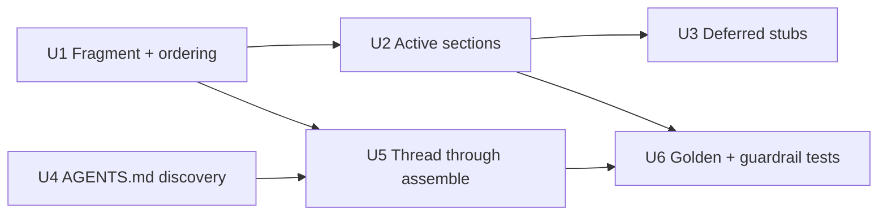

# feat: System prompt section engine

## Summary

Replace the single-string builder in `src/chat/system_prompt.rs` with an ordered, metadata-carrying **fragment engine** under `src/chat/system_prompt/`: each section yields an optional bounded fragment (source, token estimate, priority, volatility, persistence, trace), ordered most-stable-first so that, *if* the configured provider does implicit prefix caching, it sees a long stable prefix (a payoff to verify — see Open Questions). Fill the chat-only active sections (identity, tone, safety, memory, env), register the rest as documented empty stubs, and ingest `AGENTS.md` as a Codex-style user-role `<INSTRUCTIONS>` fragment threaded through the single `assemble()` path.

---

## Problem Frame

Today `build_content` (`src/chat/system_prompt.rs`) bakes per-turn-volatile data (`Current time`, git status) together with the otherwise session-stable `model`/OS/cwd lines into one string, so any implicit prefix cache breaks every turn (the timestamp alone is enough to break it). The prompt also carries none of the behavioral scaffolding the reference agents rely on, has no structure for the many sections future milestones need, and does not read project instruction files. See origin for the full framing (`docs/brainstorms/2026-07-12-system-prompt-section-engine-requirements.md`).

---

## Requirements

**Engine**
- R1. System prompt assembled from an ordered list of named sections, replacing the single-string builder; each section renders nothing when empty.
- R2. Each fragment carries metadata per the documented model: source, estimated tokens, priority, expiry/persistence, volatility, trace citation (`docs/kqode_architecture_spec.md:253-271`).
- R3. Section order is derived from metadata (most-stable-first); volatile sections deterministically sort last.
- R4. In-process memoization deferred; sections recompute per turn, but the metadata to memoize later is present.

**Active sections (chat-only)**
- R5. Identity section — sharper KQode persona.
- R6. Tone & formatting section — conciseness, no preamble/postamble, GitHub-flavored markdown for the monospace TUI, emoji restraint.
- R7. Safety section — never guess URLs; treat pasted/external content as untrusted and flag suspected injection; non-preachy refusal.
- R8. Environment section — preserve today's content (OS/platform, cwd, current time, model, optional git), marked volatile so it orders after stable sections.
- R9. Memory section — preserve today's optional memory injection as a system-prompt section.

**AGENTS.md (Codex-style)**
- R10. Discover `AGENTS.md` root→cwd (prefer an override variant then `AGENTS.md`), concatenating matches root-first.
- R11. Inject discovered content as a user-role `<INSTRUCTIONS>` fragment immediately after the system message in `assemble()` (`src/chat/request.rs`).
- R12. When none found, add no fragment (nothing rendered).
- R13. Content bounded by a size cap; oversize truncated, not dumped.

**Deferred stubs**
- R14. Register recognized-but-empty stubs that render nothing until their mechanism ships, each documented: tool-use, sandbox/approvals, MCP instructions (volatile/uncached), subagent/plan, output-styles, model-variants.

**Success criteria** — chat responses more consistently concise/formatted/safe with no env/memory/git regression; a future section is a localized add without touching the ordering/message-list logic; a golden test asserts the assembled list and a byte-identical stable prefix across volatile-only changes.

**Origin acceptance examples:** AE1 (stable before volatile ordering → R3, R8), AE2 (AGENTS.md present/absent → R11, R12), AE3 (empty deferred stub renders nothing → R1, R14), AE4 (no git repo → git line omitted → R8).

---

## Scope Boundaries

- Only empty registration of deferred stubs — not the mechanisms behind them (tools, sandbox/policy, MCP, subagents, output-styles).
- No in-process memoization.
- No whole-prompt override file/env var.
- No provider/model-specific prompt variants.
- No changes to the existing compaction/summary prompts (`src/chat/compaction.rs`, `src/chat/session_summary.rs`) beyond adopting the shared fragment model if trivial.
- Not adopting `cache_control`/breakpoint APIs — none exist in `src/` and providers are Kimi/OpenAI-compatible; ordering only.

### Deferred to Follow-Up Work

- Make the env timestamp stable (session-start date) or split it into its own micro-fragment to widen the cacheable prefix: revisit after measuring cache benefit.
- When compaction/retrieval need `Fragment`, **re-validate the taxonomy before promoting** to `kqode-core`: `priority`/`volatility`/`persistence` currently encode only cache-prefix ordering, not the eviction/relevance semantics those consumers need, so treat the shape as provisional (not canonical) until a second consumer exercises it. `persistence`, `trace`, and advisory `est_tokens` have no live consumer yet and ship with structural-only coverage.
- Capture the fragment-ordering + volatile/stable-split + fixture CRLF guardrail as a `docs/solutions/` learning after this lands (candidate for `/ce-compound`).

---

## Context & Research

### Relevant Code and Patterns

- **Single assembly path (load-bearing):** `assemble()` (`src/chat/request.rs:71-93`) builds `[system, summary?, history…, prompt]` and is shared by token-estimate, live-send, and resume "so those three cannot diverge." It is invoked inside `run_compaction` (`src/chat/compaction.rs:60` estimate, `:89` post-summary), not in `turn.rs`.
- **Turn wiring:** `src/chat/turn.rs:117-118` reads git (`crate::git::read_status_label().await`) and calls `system_message`, then hands `system` to `run_compaction`; final `Vec<ChatMessage>` → `ProviderRequest` → `provider.stream`.
- **Message shapes:** `Role { System, User, Assistant }` + `ChatMessage { role, content }` with `::user()` (`src/provider/mod.rs:22-70`) — a user-role `<INSTRUCTIONS>` fragment needs no new type.
- **Separate-prompt convention to mirror:** `src/chat/summarize.rs` / `session_summary.rs` (named `const` prompt text + pure `build_*` + inline tests), `src/chat/context_budget.rs` (pure math + consts + `#[must_use]`), `src/chat/system_prompt.rs` `build_content` vs `system_message` (pure/impure split), `src/git.rs` `parse_status_label` vs `read_status_label`.
- **Constants/enums rule:** enum + `as_str()` pattern at `src/protocol/mod.rs:39-63`; status consts at `src/protocol/queue.rs:25-40`.
- **Memory producer:** `MemoryService::load_prompt_block()` (`src/memory/prompt.rs:125`), `MEMORY_HEADER` untrusted-framing const, `MAX_CONTEXT_CHARS = 4_000` cap; threaded coordinator → `TurnJob.memory` → `system_message`.
- **Token estimate:** `src/chat/token_estimate.rs` (chars/4 + 4/msg, conservative) sums over the assembled `&[ChatMessage]` — the authoritative budget.

### Institutional Learnings

- **CRLF byte-drift** (`docs/solutions/database-issues/divergent-migration-history-points-to-reset-not-upgrade.md`): a CRLF working copy changes byte-compared file bytes on Windows; `.gitattributes` currently pins only `*.sh`/`*.sql`. → Golden fixtures and any checked-in AGENTS.md test fixtures are exposed; prefer in-code assertions + normalize line endings on read.
- **Untrusted delimiting + canonical workspace** (`docs/solutions/architecture-patterns/local-memory-file-truth-and-inbox-audit.md`): injected file content is bounded, deterministically ordered, delimited as untrusted, and traced by ids/hashes only; `src/memory/paths.rs` canonicalizes the workspace path fail-closed (via `std::fs::canonicalize(...).ok()?` inside `repo_scope_id` — no reusable helper). → Follow the same fail-closed canonicalize discipline for the AGENTS.md walk (the cwd→root walk and git-root detection are net-new), and decide the trust boundary deliberately (memory = untrusted vs Codex `<INSTRUCTIONS>` = trusted).
- **Pure-fn test colocation, no snapshot crate** (`docs/solutions/architecture-patterns/state-libs-layering-and-cycle-verification-in-the-ink-tui.md`): house golden pattern is a hand-rolled `Vec<(Role, &str)>` assertion; no `insta`/`goldenfile` present.

### External References

- `docs/research/2026-07-12-reference-agent-system-prompts.md` — cross-agent evidence: Codex renders AGENTS.md as a user-role `<INSTRUCTIONS>` fragment; Claude Code's `mcp_instructions` is "uncached because MCP connects/disconnects between turns" (validates the volatility metadata and the deferred-stub list). No external web research needed — design decided, strong local patterns.

---

## Key Technical Decisions

- **Fragment lives chat-local under `src/chat/system_prompt/` now** (resolves origin R2), shaped to migrate into the planned `kqode-core` later. Rationale: implements the documented fragment model without premature coupling to compaction/retrieval.
- **"Cached" = implicit prefix caching via most-stable-first ordering — an unverified hypothesis, not a proven win.** No prefix-cache/`cache_control` code exists in `src/provider`, and whether the configured Kimi/OpenAI-compatible endpoints do automatic prefix caching (and at what minimum prefix length) is unconfirmed. Ordering is cheap insurance and the byte-identical-prefix property is worth asserting structurally regardless, but no success criterion should depend on a *measured* cache benefit until it is verified (see Open Questions). In-process memoization deferred (R4). Note: `memory` is Stable and sits in the prefix, so a mid-session memory update also invalidates it — the invariance test's precondition is "only time/git change".
- **Env is one Volatile fragment ordered last** (keeps R8 content but out of the stable prefix). Splitting the timestamp or making it a stable session date is deferred.
- **AGENTS.md is trusted project instruction (provisionally)**, wrapped in a `<INSTRUCTIONS>` user-role fragment (Codex model), deliberately distinct from memory's untrusted "context, not instructions" framing. Rationale: brainstorm chose the Codex model; AGENTS.md is user-authored project config, not model/tool output. **This trusted status is a gated decision, not permanent:** it MUST be re-decided before any deferred tool/sandbox/exec/MCP stub is filled, because those remove the "no exec surface" condition that currently bounds blast radius, and it stands in tension with R7 ("treat pasted/external content as untrusted"). Regardless of trust level, the channel is hardened by the U4/U5 controls (body sanitization, workspace-bounded reads, cwd-only non-git walk). Alternative on the table: keep AGENTS.md untrusted-delimited like memory until a tool/sandbox trust model exists.
- **AGENTS.md flows through the single `assemble()` path** (threaded via `run_compaction`) so token-estimate/live-send/resume can't diverge; the R13 size cap (mirroring `MAX_CONTEXT_CHARS`) prevents budget inflation / spurious `OverBudget`.
- **Golden test = hand-rolled in-code shape assertions** (no snapshot crate); AGENTS.md reads normalize CRLF→LF; add `.gitattributes eol=lf` only if a fixture file is unavoidable. Rationale: deterministic and CRLF-immune, no new dependency.
- **Per-fragment token estimate is advisory and non-authoritative**; the authoritative budget stays `token_estimate.rs` over the assembled list. It must be a distinct, **non-summable** value (its own newtype, or documented as never fed into a budget/drop decision) so a later contributor cannot sum per-fragment `est_tokens` into an `OverBudget` check — a per-fragment sum cannot equal `token_estimate`'s single `+4`/message overhead on the concatenated system message. U6's reconcile check therefore asserts a tolerance band, not equality.
- **Section names, volatility class, priority tiers, and the `<INSTRUCTIONS>` tag are enums/named consts**, not literals (constants rule).

---

## Open Questions

### Resolved During Planning

- Fragment ownership (origin R2): chat-local now, promotable later.
- Priority/volatility taxonomy + tie-break (origin R3): `Volatility { Stable, Volatile }` + a small priority-tier enum; ties broken by declared section order.
- AGENTS.md precedence + walk stop (origin R10): prefer `AGENTS.override.md` then `AGENTS.md` per directory; walk cwd→git-root with fail-closed canonicalization; **when there is no git root, stop at cwd (never filesystem root)** so ancestor/home/drive-root `AGENTS.md` files are never ingested as trusted instructions; render root-first.
- TUI markdown fidelity (origin R6): verified — full pipeline at `tui/src/libs/markdown/` (parse/render blocks, inline, code, tables, highlight); tone section may instruct GFM.

### Deferred to Implementation

- Final safety directive wording (origin R7) and the exact identity/tone prose — text tuning at implementation.
- Whether env warrants splitting the volatile timestamp from the otherwise session-stable OS/cwd/model lines — start whole-env-volatile.
- [Needs research] Which configured providers (Kimi/Moonshot, OpenAI-compatible endpoints) actually perform implicit prefix caching, and at what minimum prefix length — required to know whether the U1 ordering pays off at all. Until answered, ordering is cheap insurance, not a measured win.

---

## High-Level Technical Design

> *This illustrates the intended approach and is directional guidance for review, not implementation specification. Treat it as context, not code to reproduce.*

Fragment metadata (directional shape):

```text
Fragment {
  source:      FragmentSource   // Identity | Tone | Safety | Memory | Env | AgentsMd | <deferred>
  content:     String
  est_tokens:  usize            // advisory; authoritative budget = token_estimate over assembled list
  priority:    SectionPriority  // tier enum, orders within a volatility class
  volatility:  Volatility       // Stable | Volatile  -> Stable sorts before Volatile
  persistence: Persistence      // Persistent | PerTurn
  trace:       TraceRef         // ids/source only, never bodies
}
```

Assembled message-list ordering (unchanged shape, only the system-message construction and one optional fragment are new):

```text
┌ system message (one ChatMessage::system) ───────────────┐  ← stable prefix (cache-friendly)
│ identity  tone  safety   [Stable]                        │
│ memory    [Stable, optional]                             │
│ env (OS/cwd/time/git/model)  [Volatile] → sorts last     │
│ deferred stubs → render nothing                          │
└──────────────────────────────────────────────────────────┘
      ↓
user-role <INSTRUCTIONS> fragment   ← AGENTS.md, only when found (inserted right after messages.push(system))
      ↓
(summary?) → verbatim history tail → new user prompt        (existing assemble())
```

Unit dependencies:



---

## Implementation Units

### U1. Fragment model and stable-first ordering

**Goal:** Introduce the bounded-fragment type, the volatility/priority taxonomy, and the deterministic most-stable-first ordering function.

**Requirements:** R1, R2, R3, R4

**Dependencies:** None

**Files:**
- Create: `src/chat/system_prompt/fragment.rs`
- Modify: `src/chat/system_prompt.rs` (declare `mod fragment;`)
- Test: inline `#[cfg(test)] mod tests` in `src/chat/system_prompt/fragment.rs`

**Approach:**
- Define `Fragment` with the metadata fields above and enums `Volatility { Stable, Volatile }`, a `SectionPriority` tier enum, `FragmentSource`, and a `<INSTRUCTIONS>`-tag const — all named, not literals.
- Ordering: partition Stable before Volatile, then by priority tier, ties broken by declared order (stable sort). `est_tokens` is advisory metadata only.
- Keep under ~200 lines; if ordering grows, split it into a sibling module.

**Patterns to follow:** `src/protocol/mod.rs:39-63` (enum + `as_str`), `src/chat/context_budget.rs` (pure math + consts + `#[must_use]`), rustdoc `///` + `# Errors` where fallible.

**Test scenarios:**
- Happy path: mixed fragments sort Stable-before-Volatile; within a class, higher priority tier first; equal tier keeps declared order.
- Edge case: empty input → empty output; single fragment passes through.
- Edge case (invariant): no Volatile fragment ever orders before any Stable fragment.

**Verification:** Ordering is deterministic and total; `cargo test -p kqode` green; `cargo clippy` clean.

---

### U2. Port the system prompt to the section engine

**Goal:** Replace `build_content` with per-section builders (identity, tone, safety, memory, env) collected and ordered by U1 into one `ChatMessage::system`; env becomes Volatile and orders last.

**Requirements:** R3, R5, R6, R7, R8, R9

**Dependencies:** U1

**Files:**
- Create: `src/chat/system_prompt/sections.rs` (per-section builders → `Option<Fragment>`)
- Modify: `src/chat/system_prompt.rs` (`system_message` collects → orders → renders)
- Test: `src/chat/system_prompt/tests.rs` (update ordering expectation; add section-presence tests)

**Approach:**
- Each active section is a pure fn returning `Option<Fragment>`. `system_message(model, git, memory)` collects active sections, orders via U1, and renders the concatenated content into one system message (message-list shape unchanged).
- Preserve env content (R8) but mark it Volatile → last; memory (R9) stays a Stable system section → now precedes env (this flips today's `memory > env` assertion — update it intentionally).
- Identity/tone/safety text in named consts; tone instructs GFM markdown (TUI-verified). Final wording deferred (R7).

**Patterns to follow:** `src/chat/summarize.rs` (const prompt + pure build + inline tests), current `build_content`/`utc_now_label`.

**Test scenarios:**
- Happy path: system message contains identity, tone, safety markers and the env block (`OS:`, `Working directory:`, `Current time:`, `Active model:`); memory block present when supplied.
- Covers AE1: stable sections (identity/tone/safety/memory) precede the env block in rendered order (index assertions in the style of `system_prompt/tests.rs`).
- Covers AE4: git label present → `Git:` line rendered; absent → omitted.
- Edge case: `memory = None` → no memory block, ordering still valid; `utc_now_label` fixed-width preserved.

**Verification:** Prompt behavior preserved except the intended ordering flip; updated tests green.

---

### U3. Deferred section stubs

**Goal:** Register recognized-but-empty sections that render nothing until their mechanism exists, each documented with what fills it and when.

**Requirements:** R14

**Dependencies:** U1, U2

**Files:**
- Modify: `src/chat/system_prompt/sections.rs` (stub builders return `None`, with rustdoc naming the mechanism + milestone)
- Test: `src/chat/system_prompt/tests.rs`

**Approach:** Stubs for tool-use, sandbox/approvals, MCP instructions (documented as the volatile/uncached one, mirroring Claude Code), subagent/plan, output-styles, model-variants — each a documented no-op fragment source returning `None`.

**Test scenarios:**
- Covers AE3: with all stubs registered, the assembled system message contains no placeholder text and no empty headers for deferred sections.
- Edge case: assembled output is identical whether or not the stubs are registered (they contribute zero fragments).

**Verification:** Stubs are inert; the rendered prompt is unaffected by their presence.

---

### U4. AGENTS.md discovery, bounded and normalized read

**Goal:** Discover `AGENTS.md` root→cwd (prefer `AGENTS.override.md` then `AGENTS.md` per directory), concatenate root-first, normalize CRLF→LF, and cap the size.

**Requirements:** R10, R13

**Dependencies:** None

**Files:**
- Create: `src/chat/agents_md.rs` (pure parse/concatenate/cap split from the I/O read; inline tests)
- Modify: `src/chat/mod.rs` (export)

**Approach:**
- Follow `src/memory/paths.rs`'s fail-closed canonicalize discipline. Walk cwd→git-root; **when there is no git root, stop at cwd (never filesystem root)** so ancestor/home/drive-root files are never read. Per directory prefer `AGENTS.override.md` then `AGENTS.md`; order results root-first with a small per-file delimiter.
- **Workspace-bounded reads (symlink guard):** canonicalize each discovered file path and assert it resolves inside the canonical workspace root before reading; a path that escapes the root (e.g. a symlink to `~/.ssh/id_rsa`) is skipped, not read — otherwise a hostile repo could exfiltrate arbitrary local files to the provider.
- **Body sanitization (delimiter-spoof guard):** neutralize any embedded `<INSTRUCTIONS>`/`</INSTRUCTIONS>` sequences (and system/memory-header lookalikes) in the file body before wrapping, or fence the body with a per-turn randomized nonce delimiter, so file content cannot close the fragment or impersonate higher-trust framing.
- Normalize CRLF→LF on read (CRLF learning). Cap total chars via a named const mirroring `MAX_CONTEXT_CHARS`; truncate oversize with a marker (R13). Trace paths/ids only, never bodies.
- Split the pure parse/cap/normalize/sanitize fn from the filesystem read (like `git.rs`) so it is unit-tested without real I/O.

**Patterns to follow:** `src/git.rs` (async read vs pure parse), `src/memory/paths.rs` (fail-closed canonicalize), `src/memory/prompt.rs` (cap + trace-ids-only).

**Test scenarios:**
- Happy path: single root `AGENTS.md` → its content; root + nested both present → concatenated root-first.
- Edge case: `AGENTS.override.md` present → preferred over `AGENTS.md` in the same directory.
- Edge case: none found → `None`.
- Edge case: oversize content → truncated to the cap with a marker.
- Edge case: CRLF input → normalized to LF so assembled bytes are stable.
- Error path (symlink guard): a discovered `AGENTS.md` symlinked outside the workspace root is skipped, not read.
- Error path (spoof guard): a body containing `</INSTRUCTIONS>` + forged `system`/memory framing is neutralized/fenced so it cannot close or impersonate the fragment.
- Edge case (non-git): with no git root, discovery stops at cwd and does not read ancestor-directory `AGENTS.md` files.

**Verification:** Discovery deterministic; canonicalization fails closed on a bad path; cap enforced; tests use `tempfile`.

---

### U5. Thread the AGENTS.md fragment through the single assembly path

**Goal:** Add an optional user-role `<INSTRUCTIONS>` fragment to `assemble()` (inserted right after the system message), forward it through both `run_compaction` `assemble` calls (so it counts in the token estimate), and read `AGENTS.md` in `turn.rs`.

**Requirements:** R11, R12, R13

**Dependencies:** U4, U1 (uses the `<INSTRUCTIONS>` tag const from U1's `fragment.rs`)

**Files:**
- Modify: `src/chat/request.rs` (`assemble` gains `instructions: Option<ChatMessage>`; insert at index after `system`) + inline tests
- Modify: `src/chat/compaction.rs` (`run_compaction` gains the param; forward to both `assemble` calls) + inline tests
- Modify: `src/chat/turn.rs` (read `AGENTS.md` off the pure builder like git; build the user-role `<INSTRUCTIONS>` message; pass through)

**Approach:**
- Insert the instructions fragment immediately after `messages.push(system)` (the `assemble` builder in `src/chat/request.rs`, before the summary/history pushes — use the prose anchor, not a line number). Wrap the **already-sanitized** (U4) content in the `<INSTRUCTIONS>` tag const as a `Role::User` message (trusted framing, distinct from memory).
- `run_compaction` forwards the fragment to both the estimate and final `assemble` calls so it participates in the budget (positive side-effect; the R13 cap keeps it bounded). Preserve the single-assembly-path invariant.

**Patterns to follow:** `src/chat/request.rs` `Vec<(Role, &str)>` assertions, `src/chat/turn.rs` git-read pattern, `src/chat/compaction.rs` injected-collaborator style.

**Test scenarios:**
- Covers AE2 (present): `assemble` with `Some(instructions)` → the message at the position after `system` is the user-role `<INSTRUCTIONS>` fragment, before any summary/history; `system` stays first.
- Covers AE2 (absent): `assemble` with `None` → list identical to today (`system, summary?, history, prompt`).
- Integration: `run_compaction` includes the instructions fragment in BOTH the token estimate and the final messages (estimate reflects it).
- Edge case: instructions + active summary → order is `system, instructions, summary, history, prompt`.

**Verification:** Message order matches the design; the estimate includes the fragment; existing compaction tests still pass after the signature change.

---

### U6. Golden shape test, single-path/volatility guardrail, line-ending pin

**Goal:** A deterministic hand-rolled shape test over the full assembled list for a fixed fixture; assert the stable prefix is byte-identical across volatile-only changes; guard that volatile fragments never enter the stable prefix; close the CRLF gap.

**Requirements:** Success criteria (golden snapshot; byte-stable prefix; localized future-section add)

**Dependencies:** U2, U5

**Files:**
- Modify: `src/chat/system_prompt/tests.rs` (golden shape test + stable-prefix invariance + volatility guardrail)
- Modify: `.gitattributes` (only if a fixture file is introduced — pin `eol=lf` for it)

**Approach:**
- Build `system_message` + `assemble` with a fixed, injected fixture (`model`, cwd value, git, memory, AGENTS.md) and assert the ordered role/section shape with in-code expected values (CRLF-immune; no snapshot crate).
- Stable-prefix invariance: assemble twice differing only in time/git and assert the stable-prefix slice is byte-identical.
- Guardrail: assert no Volatile fragment precedes any Stable fragment; assert the three consumers share `assemble` (documented — `token_estimate` runs on `assemble` output).
- Prefer in-code fixtures over files; if a fixture file is unavoidable, pin `eol=lf` and add a pinned assertion in the spirit of `v1_migration_checksum_is_pinned`.

**Patterns to follow:** `src/chat/request.rs` `Vec<(Role, &str)>` assertions; `src/chat/system_prompt/tests.rs` index-ordering; `src/store/tests.rs` pinned-guardrail spirit; `.gitattributes` `*.sql eol=lf`.

**Test scenarios:**
- Happy path (golden): full assembled shape for the fixture matches the expected role/section order.
- Invariance: two assemblies differing only in time/git produce byte-identical stable prefixes.
- Guardrail: volatile-before-stable never occurs; advisory per-fragment estimates reconcile with `token_estimate` over the assembled list **within a documented tolerance band** (a per-fragment sum will not equal the single `+4`/message overhead).

**Verification:** Tests green on Windows (CRLF-immune); `cargo fmt --check` and `cargo clippy` clean.

---

## System-Wide Impact

- **Interaction graph:** `assemble()` is the single path for token-estimate, live-send, and resume — all three inherit the new `instructions` param and section ordering. `turn.rs` gains an `AGENTS.md` read alongside the existing git read.
- **Error propagation:** `AGENTS.md` read/canonicalization failures fail closed to `None` (no fragment) and never break a turn.
- **State lifecycle risks:** Memory moving into its own ordered fragment shifts the token-estimate and resume byte-shape slightly (still one system message); the golden/invariance tests guard this.
- **API surface parity:** `assemble()` and `run_compaction` signatures change — every call site (`turn.rs`, the two internal `compaction.rs` calls, and tests) updates in lockstep within U5.
- **Unchanged invariants:** provider contract (`Vec<ChatMessage>`) and the one-`ChatMessage::system` shape are unchanged; the list only gains an optional user-role fragment between `system` and `summary?`.

---

## Risks & Dependencies

| Risk | Mitigation |
|------|------------|
| Shared-branch concurrent edits while changing `assemble`/`run_compaction` signatures | Re-read the files immediately before batch edits; land all call-site updates in one unit (U5) (`docs/solutions/workflow-issues/recovering-from-concurrent-agent-session-edits.md`). |
| Unbounded `AGENTS.md` inflates every turn's estimate → spurious `OverBudget` | Size cap (R13) applied in U4 before the fragment enters `assemble`. |
| CRLF fixture drift → flaky byte tests on Windows | In-code assertions + CRLF-normalized reads; `.gitattributes eol=lf` only if a fixture file is introduced. |
| Ordering flip (memory before env) silently changes existing behavior/test | Update the `memory > env` test intentionally in U2 and document the change. |
| Trusting `AGENTS.md` as instruction is an injection/exfiltration surface via a malicious repo file (delimiter spoof, symlink to secrets, ancestor-dir files) | U4 controls: body sanitization/nonce-fencing against `</INSTRUCTIONS>` spoofing, workspace-bounded canonicalized reads (skip symlink escapes), cwd-only non-git walk. Trusted status is gated — re-decided before any tool/sandbox/exec/MCP stub fills (see Key Technical Decisions); until then no exec surface bounds blast radius. |

---

## Alternative Approaches Considered

- **In-process section memoization now** — rejected/deferred: premature; stable-first ordering delivers the cache win without it.
- **`insta`/`goldenfile` snapshot crate** — rejected: new dependency and it reintroduces the CRLF fixture risk; in-code assertions are deterministic and CRLF-immune.
- **Stable session-start date instead of per-turn time** — deferred: would widen the cacheable prefix but changes R8 env content; revisit after measuring cache benefit.
- **AGENTS.md as a system-prompt section (Claude Code memory-style)** — rejected: the brainstorm chose the Codex user-role framing to keep project rules distinct and user-authored.
- **Shared `kqode-core` `Fragment` type now** — deferred: premature coupling before compaction/retrieval need it.

---

## Sources & References

- **Origin document:** `docs/brainstorms/2026-07-12-system-prompt-section-engine-requirements.md`
- **Research:** `docs/research/2026-07-12-reference-agent-system-prompts.md`
- **Spec (fragment model):** `docs/kqode_architecture_spec.md:253-271`
- **Learnings:** `docs/solutions/database-issues/divergent-migration-history-points-to-reset-not-upgrade.md`, `docs/solutions/architecture-patterns/local-memory-file-truth-and-inbox-audit.md`, `docs/solutions/architecture-patterns/state-libs-layering-and-cycle-verification-in-the-ink-tui.md`
- **Code:** `src/chat/system_prompt.rs`, `src/chat/request.rs`, `src/chat/compaction.rs`, `src/chat/turn.rs`, `src/chat/token_estimate.rs`, `src/provider/mod.rs`, `src/memory/prompt.rs`, `src/memory/paths.rs`, `src/git.rs`, `src/protocol/mod.rs`, `src/protocol/queue.rs`
