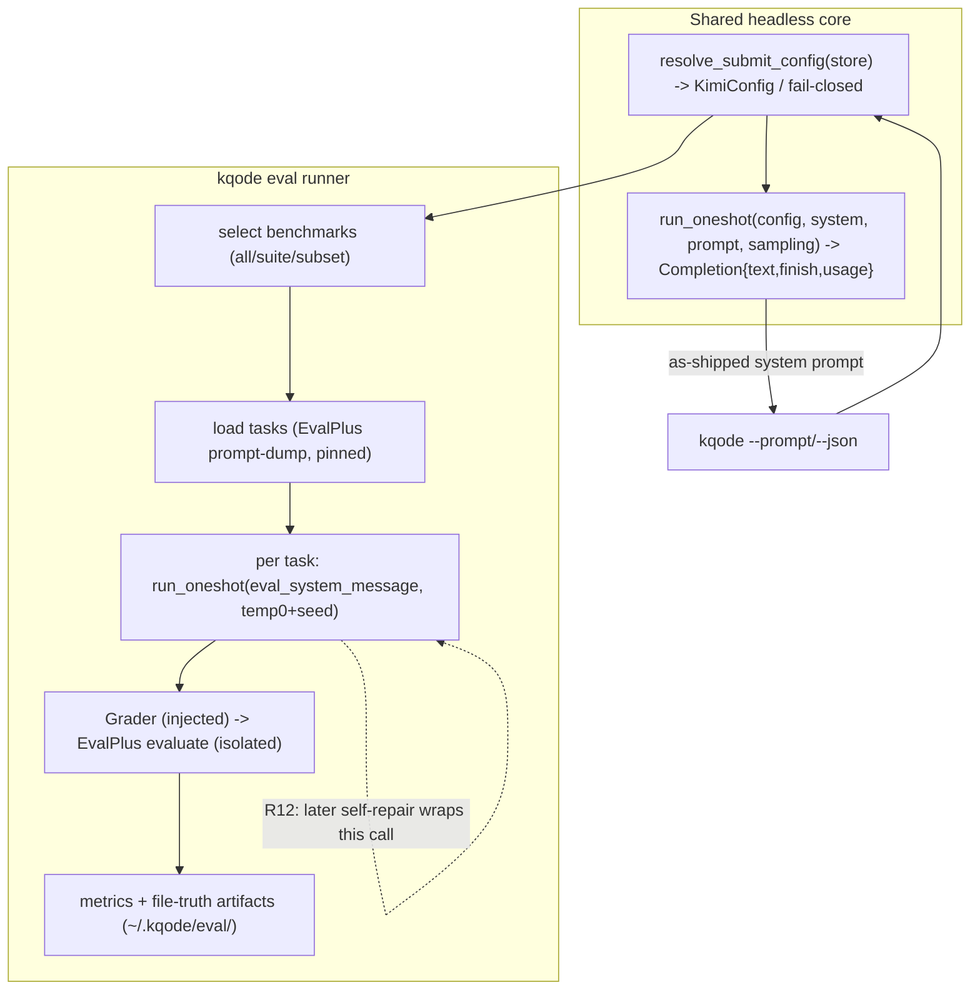
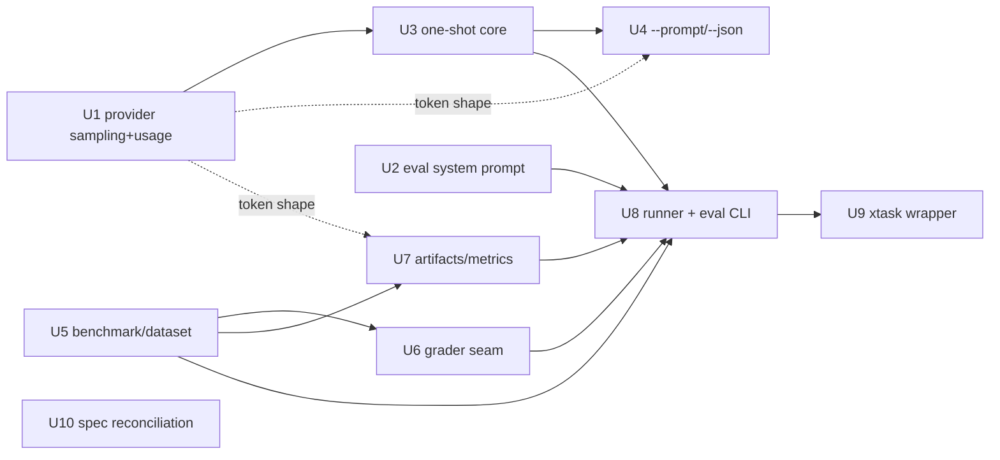

# feat: Evaluation baseline on public no-tool benchmarks

## Summary

Add a non-interactive headless mode (`kqode --prompt`/`--json`) and a native `kqode eval` runner in a new `src/eval/` module that scores KQode against public no-tool benchmarks — first vertical EvalPlus (HumanEval+/MBPP+) — driving the model through a shared one-shot core with an env-noise-free system prompt and deterministic sampling, grading via the pinned official EvalPlus harness in isolation, and persisting reproducible file-truth run reports. Delivered in three phases: headless foundation, eval runner + EvalPlus vertical, then dev ergonomics + spec reconciliation.

---

## Problem Frame

KQode has no way to measure its own quality and no baseline to prove improvement as tools/sandbox/plugins land; the only binary mode is the JSON-RPC backend (`main.rs` accepts only `--backend`). See origin: [requirements doc](docs/brainstorms/2026-07-12-evaluation-baseline-public-benchmarks-requirements.md). This plan implements the first vertical of that baseline.

---

## Requirements

- R1. Headless one-shot mode `--prompt <text>` (+ stdin) prints the completion; no TUI.
- R2. `--json` output carries text, finish reason, model/provider, and token usage.
- R3. Missing provider/model/key → fail closed (non-zero exit, clear stderr, no interactive prompt).
- R4. Headless mode reuses the single-turn machinery; no TUI/JSON-RPC-backend dependency.
- R5. `kqode eval` runs one or more benchmarks and produces a saved, reproducible run report.
- R6. Benchmark selection: run all in a named suite, or an explicit subset by name.
- R7. Each run writes machine-readable metrics + human-readable evidence in the eval-spec run-artifact shape (pass rate, per-task pass/fail, runtime, tokens).
- R8. Record exact run config (provider, model, sampling, dataset version, KQode commit, prompt mode) for reproducibility.
- R9. Thin developer entrypoint (xtask + `.run` profile) so "run the eval suite" is first-class.
- R10. First vertical: EvalPlus (HumanEval+/MBPP+) end-to-end (drive → collect → grade pass@1 → report).
- R12. Growth-carrier readiness: the per-task drive is structured so a later execution-feedback step is an in-loop addition.
- R13. Record the deferred tool-requiring backlog (SWE-bench Verified = graduation target) + vision/long-context out-of-reach set.
- R14. Eval drives the model with KQode's system prompt minus environment noise (git/cwd/time/memory/compaction).
- R15. Deterministic, recorded sampling; support for multi-sample benchmarks later.
- R16. Grading treats model-written code as untrusted → isolated/sandboxed execution.
- R17. Portfolio-facing per-run report, comparable across KQode runs over time.
- R18. Reconcile `docs/kqode_evaluation_spec.md`: general no-tool benchmarks as an early provider/model baseline layer.

<!-- R11 (broader general no-tool benchmark set) is deferred (see Scope Boundaries); U5 provides only enum/loader scaffolding that later PRs extend. -->

**Origin actors:** A1 (developer/portfolio owner), A2 (`kqode eval` runner), A3 (external EvalPlus grader), A4 (LLM provider).
**Origin flows:** F1 (run a benchmark end-to-end), F2 (headless one-shot).
**Origin acceptance examples:** AE1 (fail closed, no provider — U4), AE2 (`--prompt --json` shape — U4), AE3 (EvalPlus run → report + per-task pass/fail — U8), AE4 (eval prompt excludes env noise — U2), AE5 (reproducible re-run at same config — U7).

---

## Scope Boundaries

- Only the EvalPlus (HumanEval+/MBPP+) vertical is built end-to-end. No tool/agent harness.
- No vision or 256K+-context benchmarks (text-only KQode can't run them).
- No OpenAI-compatible server (Approach C) — the deferred breadth accelerator.
- No execution-feedback/self-repair loop now — only structural readiness (R12).
- No new SQLite tables/migrations — run artifacts are file-truth.
- No parallel task execution — sequential first.

### Deferred to Follow-Up Work

- Broader general no-tool benchmarks (GPQA Diamond, MMLU-Pro, MATH-500, AIME, GSM8K, IFEval, LiveCodeBench, BigCodeBench, SimpleQA, Aider Polyglot): subsequent PRs reusing this runner (origin R11).
- USD cost reporting: pending a per-`(provider, model)` price table (tokens + runtime ship now).
- `V5__eval_runs.sql` queryable run index: only if list/query over runs is needed.
- Provider/model/key CLI override flags (run eval store-free): follow-up.
- Tool-requiring benchmarks (SWE-bench family, Terminal-Bench, τ-bench, Commit0…): after VFS + sandbox; SWE-bench Verified is the graduation target (origin R13).

---

## Context & Research

### Relevant Code and Patterns

- Config resolution: `src/backend/resolve.rs::resolve_submit_config(&Store) -> Option<KimiConfig>` — the fail-closed non-interactive path both `--prompt` and `kqode eval` reuse (`None` = needs configuration).
- Message assembly: `src/chat/request.rs::assemble(system, instructions, history, compaction, prompt)` — call with empty history + default compaction for a single-shot.
- Turn drive to mirror (stripped): `src/chat/turn.rs::run_streaming_turn` (tokio current-thread runtime + stream accumulation loop).
- System prompt: `src/chat/system_prompt.rs::system_message(model, git, memory)` assembles `identity → tone → safety → memory → environment(cwd/OS/time/git)`; the eval variant drops `environment` + `memory` (the environment block embeds current time → also breaks reproducibility).
- Provider surface: `src/provider/mod.rs` (`ProviderRequest { model, messages }`, `StreamEvent`), `src/provider/kimi.rs::stream` (body `{model, stream:true, messages}` — no sampling, no usage today).
- CLI parsing: `main.rs` hand-rolled `match` over `env::args_os()`, `CliError` enum with `exit_code()`/`stderr_line()`, `STORE_FAILURE_EXIT_CODE` const; wire tokens as `pub const` in `src/protocol/mod.rs` (e.g. `BACKEND_MODE_ARG`) — no `clap` in the dependency graph.
- Enum-with-string pattern: `src/protocol/mod.rs::RpcMethod` (`as_str()`/`from_method()`) — the model for `EvalBenchmark`.
- Paths: `src/paths.rs` (`kqode_home()`, `memory_dir()`) — add `eval_dir()` mirroring `memory_dir()`.
- xtask: `xtask/src/commands/mod.rs` registry (`CommandSpec`, `COMMAND_GROUPS`, `command_names_are_unique`), `set_version.rs` (positional args via `env::args().nth(2)`), `.run/xtask_*.run.xml` fast-alias profiles, `.cargo/config.toml` `xtask` alias.
- Test seams: `src/git.rs` (thin `tokio::process::Command` I/O fn + pure parse fns tested on canned strings), `src/conversation/coordinator.rs::start_with_runner` (injected runner), `tests/cli_invocation.rs` + `tests/common/cli.rs::run_cli` (whole-binary tests sandboxing `HOME`/`USERPROFILE` to a tempdir), `src/test_env.rs::lock()` (env-mutation serialization).

### Institutional Learnings

- `docs/solutions/database-issues/divergent-migration-history-points-to-reset-not-upgrade.md`: the store is **fail-closed at boot** and provider selection lives in SQLite + OS keychain (`com.nincere.kqode.providers`); refinery hashes working-tree migration bytes (Windows CRLF hazard). Takeaway: **add no eval migration** — persist artifacts as files; eval opens the store only to resolve config.
- `docs/solutions/architecture-patterns/backend-process-lifecycle-ownership-in-the-ink-tui.md`: own process-backed deps at the composition root behind a **narrow injected seam**; eager start, deterministic teardown; a boundary test keeps spawn code out of pure logic. Applies to the grader child + provider client.
- `docs/solutions/architecture-patterns/local-memory-file-truth-and-inbox-audit.md`: **untrusted-content posture is codified** (model-loaded content is untrusted) → justifies sandboxed grading of model-written code; **SQLite is never source of truth** → run artifacts are file-truth (atomic temp-write+rename, content hashes, deterministic ordering).

### External References

- EvalPlus: `github.com/evalplus/evalplus` (pip `evalplus`, augmented HumanEval+/MBPP+ tests, Docker isolation). Reused for dataset provisioning + grading; pin the version.
- Benchmark catalog (NOW/DEFER, harness/dataset URLs, frontier-card lists): captured in the origin requirements doc.

---

## Key Technical Decisions

- **Hand-rolled CLI parsing (no `clap`)**, tokens as `src/protocol/mod.rs` consts, new `CliError` variants with dedicated exit codes — matches the deliberate small-dependency norm.
- **File-truth run artifacts under `~/.kqode/eval/<run-id>/`; no DB table** — matches "SQLite is never source of truth"; sidesteps the migration-checksum hazard. `--out <dir>` override lets a run land in-repo for publishing.
- **Reuse the pinned official EvalPlus harness** for both dataset provisioning (a small Python prompt-dump adapter) and grading; Rust orchestrates. Avoids vendoring datasets; pins reproducibility to the evalplus version (recorded in run config). **Pin the grader container image by immutable digest (sha256), not a floating tag, and record the digest in run config** alongside `evalplus_version` — reproducibility and supply-chain provenance both rest on the image that executes untrusted code and emits the authoritative grades.
- **Shared one-shot completion core** reused by `--prompt` and eval; **injected model + grader seams** so unit tests use pure accumulation/parse fns and `#[ignore]`-gate anything needing real Python or a live provider.
- **One shared stream event-fold primitive, extracted only if it earns its keep.** Both paths share the message `assemble`. The pure `StreamEvent` fold is promoted to a shared primitive **only if U1's usage-merge proves a real divergence risk** across `oneshot.rs` and `turn.rs`; otherwise `oneshot.rs` keeps a small local accumulator and the live `turn.rs` path — whose `Delta` arm interleaves accumulation with `emit` inside `select!` — stays untouched (the avoided duplication is ~6 lines on the hot path).
- **Relocate `resolve_submit_config` to a neutral module** (`config`/`connect`, not `backend`) before `headless` and `eval` reuse it, so the future `kqode-eval`/`kqode-cli` split doesn't inherit a wrong-direction `eval → backend` dependency.
- **The eval number is a persona baseline (environment-independent), not literally "as-shipped."** The eval prompt is identity/tone/safety only (no env block); what it guarantees is **run-over-run comparability**, not shipped-behavior fidelity (the headless `--prompt` path sends the full env-bearing prompt). This assumes the stripped environment block is roughly behaviorally inert for these benchmarks — stated as an explicit assumption, and required for determinism regardless.
- **Deterministic sampling** (temperature 0 + fixed seed) recorded per run; extends the shared provider request additively (default `None` preserves current TUI behavior). **Token usage rides on `StreamEvent::Done { finish_reason, usage }` (not a new `Usage` variant)** so the change touches only `src/chat/turn.rs`; `summarize.rs`/`session_summary.rs` match `Done { .. }` and stay untouched. Temperature 0 is not truly deterministic (batching/MoE/load-balancing) and the provider may ignore `seed`, so AE5's "documented sampling variance" band must be **measured empirically** (run a fixed subset K times, report pass-rate stddev); treat run-over-run deltas below the band as noise, not harness progress, and prefer avg@k for small sets.
- **Untrusted grading is a specified control set, not a slogan.** Model-written code is untrusted *executable* — quarantined to a **container-only** grader (the EvalPlus local/in-process mode is rejected: its `reliability_guard` is explicitly not a sandbox and is Unix-only). Required isolation properties: network egress disabled; non-root; read-only root FS with a single ephemeral workdir; per-task CPU/memory/PID/file-size/wall-clock limits; `no-new-privileges` + capabilities dropped; no privileged flag; **no host bind-mounts** of `~/.kqode`, `$HOME`, or the repo.
- **Secret + container hygiene at the grader boundary**: the grader `Command` is spawned with `env_clear()` + a minimal allowlist (never the provider key — Rust inherits the full parent env by default, and `dotenvy` loads `.env` into it); grader containers use a stable name and are torn down idempotently on success/failure/**cancel** (not via `kill_on_drop`, which reaps only the direct child, not the daemon-managed container).
- **Sequential task execution first**; parallelism deferred.

---

## Open Questions

### Resolved During Planning

- Runner location: a self-contained `src/eval/` module (the future `kqode-eval` crate boundary, still one crate today).
- Artifact persistence: file-truth under `~/.kqode/eval` (no migration).
- Dataset source: EvalPlus-provisioned (pinned), not vendored.
- System-prompt stripping: a dedicated `eval_system_message`.
- Sampling: extend `ProviderRequest` + Kimi body.

### Deferred to Implementation

- Exact EvalPlus CLI/module surface + the precise container-isolation flag spelling (network, caps, ro-fs, resource limits) — validate against the pinned release.
- Windows/Docker grader specifics — no prior art; validate: process-tree/container teardown on cancel/crash (no SIGKILL/process groups on Windows); Docker Desktop/WSL2 bind-mounts surfacing as root-owned/`0777` in the Linux VM (can undermine the read-only/non-root guarantees); and `samples.jsonl` CRLF/BOM for the Linux Python reader (the same CRLF class as the migration-checksum hazard). Extra test attention + a `ce-compound` capture afterward.
- Exact per-benchmark prompt-template wording — validate against EvalPlus's expected solution format.
- Usage-chunk parsing exactness and whether Kimi/custom endpoints honor `seed` (fallback: temperature-0 determinism).
- Grader container image selection — datasets baked in vs pre-staged into the read-only mount — and its immutable digest; validate offline grading actually works under `--network none`.
- Empirical run-to-run pass-rate variance band at the pinned config (sets AE5's "documented sampling variance"; decide whether avg@k is the default for small sets from the start).

---

## Output Structure

    src/eval/
      mod.rs           # module wiring + public entry (kqode::eval::run)
      benchmark.rs     # EvalBenchmark enum + Task model + dataset load/templating
      grader.rs        # Grader trait + EvalPlus adapter (thin process fn + pure parse)
      artifacts.rs     # file-truth run dir writer (atomic temp+rename)
      metrics.rs       # pass rate / tokens / runtime (+ best-effort cost)
      runner.rs        # pipeline orchestration + selection
      tests.rs         # (or per-submodule sibling tests)
    src/chat/oneshot.rs   # shared single-shot completion core
    evaluation/
      requirements.txt      # evalplus pinned
      adapters/
        evalplus_prompts.py # prompt-dump helper (evalplus.data -> task_id+prompt JSONL)
    xtask/src/commands/eval.rs
    .run/xtask_eval.run.xml

Modifies: `main.rs`, `src/protocol/mod.rs`, `src/provider/mod.rs`, `src/provider/kimi.rs`, `src/provider/kimi/streaming.rs`, `src/chat/system_prompt.rs`, `src/chat/mod.rs`, `src/chat/turn.rs`, `src/paths.rs`, `src/lib.rs`, `xtask/src/commands/mod.rs`, `docs/kqode_evaluation_spec.md`, `tests/cli_invocation.rs`. (Structure is directional; the implementer may adjust.)

---

## High-Level Technical Design

> *This illustrates the intended approach and is directional guidance for review, not implementation specification. The implementing agent should treat it as context, not code to reproduce.*

Unit dependency graph:

---

## Implementation Units

### U1. Provider sampling + usage capture

**Goal:** Extend the normalized provider request to carry deterministic sampling (temperature, optional seed) and capture token usage from the stream, so eval can pin sampling + record tokens and `--json` can report usage.

**Requirements:** R2, R8, R15

**Dependencies:** None

**Files:**
- Modify: `src/provider/mod.rs` (add sampling fields to `ProviderRequest`; add a `usage: Option<Usage>` field to `StreamEvent::Done` + a `Usage { input, output }` type)
- Modify: `src/provider/kimi.rs` (send sampling + `stream_options.include_usage`)
- Modify: `src/provider/kimi/streaming.rs` (map the choiceless usage chunk to `Done { finish_reason: None, usage: Some(..) }`)
- Modify: `src/chat/turn.rs` (capture `Done.usage` via a symmetric `if usage.is_some()` merge, mirroring the existing `finish_reason` merge)
- Test: `src/provider/kimi/tests.rs`

**Approach:**
- Add an optional `sampling` (temperature, seed, optional top_p) to `ProviderRequest`; default `None` keeps the current body byte-identical.
- **Usage rides on `Done`, not a new variant.** Adding a `StreamEvent::Usage` variant would break all three exhaustive match sites (`turn.rs`, `summarize.rs`, `session_summary.rs`); putting `usage` on `Done` leaves the two summary matchers (`Done { .. }`) untouched and edits only `turn.rs`. Pin the field names `Usage { input, output }` and a single serialization mapping here; **U4's `--json` and U7's metrics both consume this one shape** (no divergent token field names).
- Kimi body includes sampling when set + `stream_options: {include_usage: true}`. With that option the usage chunk arrives *after* the finish-reason chunk and before `[DONE]`; ordering is irrelevant to the accumulator, which is a further reason it is a `Done` field, not an ordered event. The per-event capture lives in the shared fold primitive (see U3), so this lands in exactly one place.

**Patterns to follow:** `json!({...})` body build + `StreamEvent` enum in `src/provider/`, `map_event` in `src/provider/kimi/streaming.rs`.

**Test scenarios:**
- Happy path: request with temperature 0 + seed serializes those fields (assert on built body JSON).
- Happy path: a canned usage chunk yields `Done.usage = Some(Usage { input, output })`.
- Edge case: no usage chunk → `Done.usage = None`, `Done` still emitted (back-compat).
- Edge case: sampling `None` → body omits sampling + `stream_options` (current shape unchanged).

**Verification:** provider tests pass; `summarize.rs`/`session_summary.rs` compile unchanged (they match `Done { .. }`); sampling + usage present when configured.

---

### U2. Eval-mode system prompt (env-noise-free)

**Goal:** Assemble KQode's persona (identity, tone, safety) without the volatile environment block (cwd/OS/time/git) or memory, so eval reflects KQode as-shipped with no benchmark-irrelevant noise or non-determinism.

**Requirements:** R14

**Dependencies:** None

**Files:**
- Modify: `src/chat/system_prompt.rs` (add `eval_system_message(model)`)
- Test: `src/chat/system_prompt/tests.rs`

**Approach:**
- New assembly reusing `identity`/`tone`/`safety` fragments and the existing ordering/render, omitting `sections::environment` and memory. No cwd/OS/time/git.

**Patterns to follow:** `system_message()` fragment assembly + `sections` module.

**Test scenarios:**
- Covers AE4. Happy path: output contains identity/tone/safety markers but NOT cwd, OS, a git label, or a timestamp.
- Edge case: two invocations are byte-identical (determinism — proves the time line is gone).

**Verification:** eval prompt carries the persona, excludes env noise, and is stable across calls.

---

### U3. Shared one-shot completion core

**Goal:** A headless single-shot drive: given a resolved config, a system message, a prompt, and sampling, stream one completion and return accumulated text + finish reason + usage — no coordinator, compaction, or history. Shared by `--prompt` and the eval runner.

**Requirements:** R1, R4, R15

**Dependencies:** U1

**Files:**
- Create: `src/chat/oneshot.rs` (+ the shared `fold`/`accumulate` primitive, or a sibling `src/chat/fold.rs`)
- Modify: `src/chat/mod.rs` (module + re-export), `src/chat/turn.rs` (delegate its per-event state update to the shared fold)
- Test: `src/chat/oneshot.rs` sibling tests

**Approach:**
- `run_oneshot(config, system, prompt, sampling) -> Result<Completion, ProviderError>`, `Completion { text, finish_reason, usage }`. Build messages via `request::assemble(system, None, &[], &default, prompt)`; stream via `KimiProvider`; accumulate `Delta` text + `Done { finish_reason, usage }`. Runs on a tokio current-thread runtime like `run_streaming_turn`.
- **Reuse boundary (share only if it earns its keep):** `oneshot.rs` owns a **pure** `accumulate(events) -> Completion` (unit-tested on canned events). Always share the message `assemble`. Promote the per-event fold to a shared `fold_stream_event` used by `turn.rs` too **only if U1's usage-merge proves a real divergence risk** — `turn.rs`'s `Delta` arm interleaves accumulation with live `emit` inside `select!`, so extracting it saves ~6 lines on the hot path and adds coupling; default to leaving the live turn path untouched. Keep the live network call thin and `#[ignore]`-gate any real-provider test (mirrors `git.rs` thin-I/O + pure-parse).
- **Bound accumulated output:** cap the accumulated completion size (max output / `max_tokens`); on overflow, abort/truncate the drive with a recorded reason. Model output is untrusted and runs sequentially over hundreds of tasks, so an unbounded generation must not exhaust host memory/disk.

**Patterns to follow:** `src/chat/turn.rs` stream loop; `src/chat/request.rs::assemble`; `src/git.rs` I/O-vs-pure split.

**Test scenarios:**
- Happy path: a scripted event stream (deltas + usage + done) accumulates into the expected `Completion`.
- Error path: a provider stream error surfaces as `Err`.
- Edge case: no deltas → empty text + finish reason still returned.

**Verification:** `run_oneshot` returns a full `Completion` from canned events; no network in default tests.

---

### U4. `--prompt` / `--json` headless CLI

**Goal:** Wire the non-interactive one-shot: `kqode --prompt <text>` (+ stdin) prints the completion; `--json` prints a machine-readable object; fail closed when unconfigured.

**Requirements:** R1, R2, R3, R4

**Dependencies:** U3

**Files:**
- Modify: `main.rs` (`--prompt`/`--json` arm + new `CliError` variant/exit code)
- Modify: `src/protocol/mod.rs` (`PROMPT_FLAG`, `JSON_FLAG` consts), the neutral resolver module (relocate `resolve_submit_config` out of `backend`)
- Create: `src/headless.rs` (resolve config → build as-shipped system prompt → `run_oneshot` → format output); pure `format_json(&Completion, ...)` fn
- Modify: `src/lib.rs` (module)
- Test: `tests/cli_invocation.rs` (+ `tests/common/cli.rs`), plus `src/headless.rs` unit tests

**Approach:**
- Parse `--prompt <text>` (read stdin when the value is `-` or omitted with piped stdin) and optional `--json`. Resolve via the relocated `resolve_submit_config` (neutral `config`/`connect` module, not `backend::` — see Key Decisions); `None` → fail closed with a clear stderr line + dedicated non-zero exit code (new `CliError` variant, following `STORE_FAILURE_EXIT_CODE`).
- Use the normal as-shipped system prompt (`system_message` with git+memory) for general scripting; default sampling. `--json` emits `{text, finishReason, model, provider, usage:{inputTokens,outputTokens}}` (camelCase; the usage fields map from U1's `Usage { input, output }`, the single token shape shared with U7); it **excludes the provider api_key**. Otherwise print text.

**Patterns to follow:** `main.rs` match + `CliError`; `src/protocol/mod.rs` consts; `tests/common/cli.rs::run_cli` with tempdir `HOME`.

**Test scenarios:**
- Covers AE1. Error path: no provider connected (empty tempdir `HOME`) → non-zero exit + clear stderr, no interactive prompt.
- Covers AE2. Happy path: `format_json` on a canned `Completion` yields a single object with text/finishReason/model/usage (arg-parse + fail-closed tested deterministically; live end-to-end `#[ignore]`).
- Security: `format_json` output never contains the provider api_key (substring scan on a canned `Completion` + config).
- Edge case: `--prompt` with no value + piped stdin reads the prompt from stdin.
- Edge case: unknown extra flag → clear error + non-zero exit.

**Verification:** `kqode --prompt` works headlessly; fails closed unconfigured; `--json` shape correct.

---

### U5. Eval module scaffold + benchmark/dataset model

**Goal:** Establish `src/eval/` and model the first benchmarks: an `EvalBenchmark` enum (HumanEval+, MBPP+) with task loading + per-benchmark prompt templating sourced from the pinned EvalPlus dataset.

**Requirements:** R5, R10, R11 (scaffolding only)

**Dependencies:** None (structural)

**Files:**
- Create: `src/eval/mod.rs`, `src/eval/benchmark.rs`
- Modify: `src/lib.rs` (`pub mod eval;`), `src/paths.rs` (`eval_dir()`)
- Create: `evaluation/adapters/evalplus_prompts.py`, `evaluation/requirements.txt` (pin `evalplus`)
- Test: `src/eval/benchmark.rs` sibling tests, `src/paths.rs` tests (`eval_dir`)

**Approach:**
- `EvalBenchmark` enum with `as_str()`/`from_str()` (mirror `RpcMethod`); `Task { id, prompt }`.
- Task loading: thin process fn shells to `evaluation/adapters/evalplus_prompts.py` (uses `evalplus.data.get_human_eval_plus()/get_mbpp_plus()`) emitting task_id+prompt JSONL; a **pure** parse fn turns JSONL → `Vec<Task>`.
- Prompt templating: a benchmark-specific wrapper around the task prompt (directional; validate exact format vs EvalPlus at impl). `paths::eval_dir()` = `~/.kqode/eval`.
- **Safe path derivation:** EvalPlus task ids contain `/` (`HumanEval/0`, `Mbpp/2`). Provide a `safe_filename(task_id)` encoder (slug/percent-encode; reject `..` and separators) used for **any** on-disk path component (U6/U7); keep the raw id only inside JSON *values*. Hard rule: **no filesystem path is ever derived from model output.**
- **Egress scoping:** the dataset-dump adapter (`evalplus_prompts.py`) needs network egress on first provision — distinct from the grader, which runs with egress disabled (U6). Because it is the **one egress-enabled child**, it is spawned with the same `env_clear()` + minimal allowlist as the grader (never the provider key) — a compromised pinned package or MITM'd download must not be able to exfiltrate the key over that egress.

**Patterns to follow:** `RpcMethod` enum; `paths::memory_dir()`; `git.rs` thin-I/O + pure-parse.

**Test scenarios:**
- Happy path: `EvalBenchmark::from_str("humaneval+"/"mbpp+")` round-trips with `as_str()`.
- Happy path: parsing a canned prompts JSONL yields the expected `Task`s.
- Security/Edge case: `safe_filename("HumanEval/0")` produces a single safe path component (no created/escaped directory); a `..`-bearing id is rejected.
- Edge case: unknown benchmark name → `None`/error.
- Edge case: malformed JSONL line → error surfaced, not a panic.

**Verification:** enum + task parsing covered on canned data; `eval_dir` resolves under `~/.kqode`.

---

### U6. Grader seam (EvalPlus adapter)

**Goal:** A grader abstraction + EvalPlus implementation: write the completions samples file, invoke the EvalPlus grader in isolation, and parse per-task pass/fail — behind an injected seam so tests don't run Python.

**Requirements:** R10, R16

**Dependencies:** U5

**Files:**
- Create: `src/eval/grader.rs`
- Test: `src/eval/grader.rs` sibling tests (canned results JSON)

**Approach:**
- A `Grader` trait: `grade(benchmark, samples) -> Result<GradeReport>` (`GradeReport` = per-task `{task_id, passed}` + totals). The runner injects a `Grader` (fake in tests). A **pure** parse fn maps EvalPlus results JSON → `GradeReport`; a thin process fn isolates the `Command`.
- **Untrusted-executable posture:** model-generated code is untrusted *executable* — never run in-process, never granted host filesystem, network, or credentials (extends the repo's codified untrusted-content posture).
- **Container-only isolation (required properties), not "sandbox" as a label.** Reject the EvalPlus local/in-process mode (its `reliability_guard` is explicitly not a sandbox and imports the Unix-only `resource` module). The grader container MUST run with: network egress disabled; non-root; read-only root FS + a single ephemeral workdir; per-task CPU/memory/PID/file-size/**wall-clock** limits (bound like the existing `GIT_STATUS_TIMEOUT`); `no-new-privileges` + capabilities dropped; **no** privileged flag; **no** host bind-mounts of `~/.kqode`, `$HOME`, or the repo (only the ephemeral run/task subdir; inputs read-only).
- **Secret hygiene:** spawn the grader `Command` with `env_clear()` + a minimal allowlist (e.g. `PATH`, `DOCKER_HOST`) — **never** the provider key (Rust `Command` inherits the full parent env by default, and `dotenvy` populates it). The provider call itself is in-process over HTTPS, so the key never crosses a process boundary.
- **Deterministic teardown:** give each grader run a stable container name/label; tear it down idempotently (auto-remove + explicit stop/remove) on success, failure, **and cancel** — not via `kill_on_drop` (which reaps only the direct `docker` client, not the daemon-managed container).
- **Path safety:** write `samples.jsonl` and read results only within the ephemeral workdir; on-disk names use `safe_filename` (U5); never derive a path from a raw task id or model output.
- **Offline test-data staging:** the egress-disabled grader still needs EvalPlus's augmented HumanEval+/MBPP+ test suites present in the container. Either pin a grader image with the datasets baked in, or pre-stage them into the read-only mount **before** egress is disabled. This is distinct from (and not covered by) the prompt-dump adapter's first-provision egress.
- **Output sanitization:** grader subprocess output is influenced by executed untrusted code — sanitize/escape control + ANSI escape sequences before it reaches diagnostics, `trajectory.jsonl`, or the terminal (in addition to key scrubbing), so untrusted bytes can't spoof logs or manipulate the terminal.

**Execution note:** Front-load a **grading feasibility spike** as the first step of Phase 2 — on the author's actual Windows/Docker (Desktop/WSL2) host, run the pinned EvalPlus image on a 1-task sample with the *full required isolation property set* AND confirm the persona eval prompt (U2) yields completions EvalPlus's extractor accepts. Third-party grader images often assume root + writable root FS, and a chat-persona prompt can emit commentary the sanitizer misparses; either would otherwise surface only after U5–U7 are built. If the isolation properties conflict with the image, decide the isolation-vs-feasibility tradeoff explicitly (minimal writable workdir, or gate grading to Linux/CI) before building the dependent units.

**Patterns to follow:** `git.rs` thin-I/O + pure-parse; injected-seam (`Coordinator::start_with_runner`); status strings hoisted to consts; `KimiConfig` redacting `Debug` + `ApiKey` zeroize/no-`Serialize` (`src/secrets/`) as the secret invariants to preserve.

**Test scenarios:**
- Happy path: parsing a canned EvalPlus results JSON yields correct per-task `passed` + pass rate.
- Security: the grader `Command` env contains no provider key (assert on the constructed command's env — `env_clear` + allowlist).
- Security/Edge case: a `/`-bearing task id resolves to a path inside the ephemeral workdir (no escape).
- Edge case: a task missing from results → treated as failed/unresolved (documented).
- Error path: grader subprocess non-zero exit / unparseable output → `Err` (diagnostic scrubbed of the key).
- Integration (`#[ignore]`): real EvalPlus (container-only) on a 1-task sample resolves and the container is removed afterward (needs Docker).

**Verification:** grader parsing covered on canned data; real grading `#[ignore]`-gated; no default test spawns Python.

---

### U7. Run artifacts + metrics (file-truth)

**Goal:** Persist each run as file-truth (summary + per-task results + trajectory) under the eval dir, compute metrics (pass rate, per-task pass/fail, runtime, tokens; best-effort USD cost), and record the full run config for reproducibility.

**Requirements:** R7, R8, R17

**Dependencies:** U5 (and U1 for the shared `Usage` token shape)

**Files:**
- Create: `src/eval/artifacts.rs`, `src/eval/metrics.rs`
- Test: `src/eval/artifacts.rs` + `src/eval/metrics.rs` sibling tests

**Approach:**
- Run dir `eval_dir()/<run-id>/` with `summary.json` + `summary.md` + per-task `result.json` + `trajectory.jsonl`, mirroring `docs/kqode_evaluation_spec.md`. **Atomic** temp-write+rename. Per-task filenames use `safe_filename` (U5) so `/`-bearing task ids can't escape the run dir.
- `RunConfig { kqode_commit, provider, model, sampling, benchmark, evalplus_version, grader_image_digest, prompt_mode }` recorded in the summary — **no api_key field**; the key is excluded from `summary`, `result`, `trajectory`, and any error diagnostic (a test asserts no artifact contains it). Preserves the `KimiConfig` redacting `Debug` + `ApiKey` no-`Serialize` invariants.
- Metrics: `pass_rate` (= `tasks_succeeded / tasks_attempted`), `tasks_total/attempted/succeeded/errored` (errored = drive failed, a bucket distinct from graded-fail, so the denominator is unambiguous), `runtime_seconds`, tokens from U1's `Usage { input, output }` (the same shape `--json` emits — one naming, no divergence); `cost_usd` best-effort via an optional per-`(provider, model)` price const (omitted when unknown). `run-id` = timestamp + short random (deterministic ordering).

**Patterns to follow:** `src/paths.rs`; memory file-truth atomic write; eval-spec run-artifact schema; filenames as consts.

**Test scenarios:**
- Covers AE5. Happy path: recorded `RunConfig` round-trips so a re-run at the same config is comparable.
- Happy path: metrics compute the correct `pass_rate` from a `GradeReport`.
- Happy path: writing a run produces the expected files with the config.
- Security: no written artifact contains the provider api_key (substring scan across summary/result/trajectory).
- Edge case: unknown model price → `cost_usd` omitted (not zero).
- Edge case: simulated write failure leaves no partial artifact.

**Verification:** run dir contains summary + per-task + config; metrics correct on canned `GradeReport`.

---

### U8. Eval runner + `kqode eval` CLI

**Goal:** Orchestrate the pipeline end-to-end and expose `kqode eval <names|suite>`: select benchmarks, load tasks, drive the model per task with the eval prompt + deterministic sampling, collect completions, grade (isolated), write artifacts + metrics. Owns the model client + grader at the composition root behind injected seams.

**Requirements:** R5, R6, R10, R12, R14

**Dependencies:** U2, U3, U6, U7 (and U1, U5 transitively; the `resolve_submit_config` relocation lands in U4)

**Files:**
- Create: `src/eval/runner.rs`
- Modify: `main.rs` (`eval` subcommand arm), `src/protocol/mod.rs` (`EVAL_SUBCOMMAND` + suite/selection consts), `src/eval/mod.rs` (wire)
- Test: `src/eval/runner.rs` sibling tests, `tests/cli_invocation.rs` (eval arg parsing)

**Approach:**
- Runner: resolve config (fail closed, via the relocated `resolve_submit_config`); for each selected benchmark, load `Task`s (U5); per task, `run_oneshot` (U3) with `eval_system_message` (U2) + deterministic sampling (temperature 0, fixed seed) → the solution; assemble samples; grade via the injected `Grader` (U6); compute + write metrics/artifacts (U7).
- Selection: `kqode eval evalplus` / `kqode eval humaneval+,mbpp+` / `--suite general` (first slice = the two EvalPlus benchmarks; suite names extensible). Optional `--limit N`, `--out <dir>`.
- **Per-task drive errors (a run of ~540 tasks against a live provider will hit transient 429/network):** on `run_oneshot` `Err`, record the task as **errored** (distinct from graded-fail), continue to the next task, and reflect it in metrics (U7) so `pass_rate`'s denominator is unambiguous; optionally add a bounded retry for `RateLimit`/network before marking errored. A single task's failure must not abort the whole run (discarding prior work/tokens) or silently vanish.
- **R12 hook — name the loop boundary, don't just gesture at it.** The per-task drive is a `drive_task(task, config) -> Attempt` seam. State explicitly that a future execution-feedback loop *additionally* needs a **per-task execution/check seam distinct from the batch `Grader`** (which returns pass/fail only after all drives, without per-task failure detail): that is an *additive* seam, not a grader rewrite. `EvalPlusGrader` may later grow a per-task variant; the batch path ships now. This keeps R12 honest. Note EvalPlus is near-ceiling (saturated), so its self-repair headroom is small — treat it as the "it works / provider floor" number, and bring **LiveCodeBench** (contamination-free, non-saturated) forward as the truer growth carrier once the feedback loop lands.
- Composition root owns the real provider + grader (grader spawned with `env_clear` + deterministic teardown); the runner **core is generic over `Grader`** and never names `EvalPlusGrader`/`Command`/process types — a structural boundary guard (à la the backend-isolation test) so the seam can't silently erode. Sequential execution.

**Patterns to follow:** `main.rs` match + protocol consts; composition-root ownership (backend-lifecycle learning); injected runner; `EvalBenchmark`.

**Test scenarios:**
- Covers AE3. Happy path: a run with an injected model + injected grader writes a run dir with a summary (pass rate) and one result per task.
- Happy path: selection parses `evalplus` and a comma list into the right benchmark set.
- Happy path: the system message handed to the (fake) model excludes git/cwd/time (asserts U2 wiring).
- Structural: the runner core is generic over `Grader` (never references `EvalPlusGrader`/process types) — boundary guard.
- Edge case: unknown benchmark name → clear error + non-zero exit.
- Error path: grader failure → a failed run with a diagnostic (scrubbed of the key); artifacts still record the attempt.
- Error path: one task's drive fails (provider `Err`) → the run continues and the task is recorded as `errored` (not counted as graded-fail).
- Integration (`#[ignore]`): real EvalPlus on a small `--limit` end-to-end.

**Verification:** `kqode eval` with injected seams produces a complete run report; selection works; eval prompt is env-noise-free; no default test hits Python/provider.

---

### U9. `xtask: eval` dev wrapper + `.run` profile

**Goal:** A thin developer entrypoint so "run the eval suite" is first-class: `cargo xtask eval <args>` + a matching IDE run profile.

**Requirements:** R9

**Dependencies:** U8

**Files:**
- Create: `xtask/src/commands/eval.rs`, `.run/xtask_eval.run.xml`
- Modify: `xtask/src/commands/mod.rs` (register)

**Approach:**
- `eval::COMMAND` (`CommandSpec`) thin wrapper: build/invoke the `kqode` binary with `eval` + forwarded args (`env::args().nth(2..)`, like `set_version.rs`); reusable logic in `xtask/src/support/`. Register in a new `EVAL_COMMANDS` group appended to `COMMAND_GROUPS`. `.run/xtask_eval.run.xml` in fast-alias style (`command value="xtask eval"`).

**Patterns to follow:** `xtask/src/commands/set_version.rs` (positional args), `tui/dev.rs` (`Command::status`), `.run/xtask_help.run.xml`, AGENTS.md thin-wrapper rule.

**Test scenarios:**
- Test expectation: none beyond the existing `command_names_are_unique` registry guard — this is a thin wrapper; real behavior is `kqode eval`, covered in U8.

**Verification:** `cargo xtask eval ...` forwards to `kqode eval`; `.run` profile present; `cargo test -p xtask` passes.

---

### U10. Reconcile eval spec + record deferred backlog

**Goal:** Update `docs/kqode_evaluation_spec.md` so general no-tool public benchmarks appear as an early provider/model capability baseline layer (before the harness-focused layers), and record the deferred tool-requiring/vision/long-context backlog with SWE-bench Verified as the graduation target.

**Requirements:** R13, R18

**Dependencies:** None

**Files:**
- Modify: `docs/kqode_evaluation_spec.md`

**Approach:**
- Add a provider/model baseline layer describing the no-tool public-benchmark baseline + the `kqode eval` runner; cross-reference the NOW/DEFER catalog; note the reordering rationale (baseline now, agentic later). Keep the existing harness-first layers intact; clarify sequencing. Record the deferred backlog + graduation target.

**Patterns to follow:** existing eval-spec structure.

**Test scenarios:**
- Test expectation: none (documentation change).

**Verification:** the spec no longer contradicts the early-baseline approach; deferred backlog + graduation target recorded.

---

## System-Wide Impact

- **Interaction graph:** the provider change touches the live TUI turn path only at `src/chat/turn.rs` — usage rides on `StreamEvent::Done { .. }`, so `summarize.rs`/`session_summary.rs` (which match `Done { .. }`) compile unchanged; sampling fields default `None` (no behavior change). The stream-fold logic is shared (U3), so `turn.rs` and `oneshot.rs` can't diverge.
- **Error propagation:** headless/eval fail closed on missing config; grader/subprocess errors surface as failed runs with diagnostics that are **scrubbed of the provider key**; artifacts still record the attempt.
- **State lifecycle risks:** grader **containers** torn down by stable name on success/failure/**cancel** (not `kill_on_drop`, which misses the daemon-managed container); partial artifact writes avoided via atomic temp+rename.
- **Secret hygiene:** the provider key stays in-process (HTTPS `bearer_auth`); grader spawn uses `env_clear` + allowlist; no artifact, `--json` payload, or diagnostic contains it (test-asserted).
- **Path safety:** every on-disk path component is `safe_filename`-encoded; no path is derived from raw task ids or model output; grader writes are confined to the ephemeral workdir.
- **API surface parity:** `main.rs` gains a new arg surface; `kqode eval` is Rust-only, so no Rust↔TS protocol mirroring expected (add the mirror note only if a const crosses the boundary).
- **Integration coverage:** end-to-end eval `#[ignore]`-gated (real Python/Docker/model); the hermetic path uses injected seams.
- **Unchanged invariants:** `--backend` JSON-RPC mode unchanged; store schema unchanged (no migration); existing provider/turn behavior preserved when sampling is unset.

---

## Risks & Dependencies

| Risk | Likelihood | Impact | Mitigation |
|------|-----------|--------|------------|
| Untrusted model-written code in grader | High | High | container-only isolation with a required property set (no egress, non-root, ro-fs + ephemeral workdir, cpu/mem/pid/wall-clock limits, caps dropped, no host mounts); EvalPlus local mode rejected; never in-process (R16) |
| Orphaned grader containers on cancel/crash | Med | Med | stable container name/label + idempotent teardown on success/failure/cancel (not `kill_on_drop`); add to the `#[ignore]` integration test |
| Provider key leaks into grader env or artifacts | Med | High | grader spawn `env_clear` + allowlist (never the key); key excluded from all artifacts/`--json`/diagnostics; substring-scan tests |
| Path injection from task ids (`HumanEval/0`) | Med | Med | `safe_filename` for every on-disk component; never derive a path from model output; grader writes confined to the ephemeral workdir |
| Provider ignores `seed` → non-determinism | Med | Med | temperature 0 + record config; accept residual variance (avg@k for tiny sets later) |
| Shared provider request/`Done` change regresses TUI | Low | Med | usage-on-`Done` keeps the blast radius to `turn.rs` (summary matchers unaffected); sampling defaults `None`; provider/turn tests stay green |
| Windows/Docker isolation specifics | Med | Med | container-only (EvalPlus local mode uses Unix-only `resource`); validate WSL2 bind-mount ownership (`0777`/root) and `samples.jsonl` CRLF/BOM; `#[ignore]` integration test + `ce-compound` capture |
| EvalPlus version drift changes dataset/format | Med | Med | pin `evalplus` in `evaluation/requirements.txt`; record version in run config |
| Store fail-closed aborts eval on a divergent local DB | Low | Med | accepted (consistent with backend); override flags are a documented follow-up |

**External prerequisites:** Python + pinned `evalplus`; a container runtime (Docker) for isolated grading; a connected provider within context limits.

---

## Alternative Approaches Considered

- **Thin `--prompt` + external Python orchestrator (brainstorm Approach A):** rejected as primary — eval wouldn't be a KQode surface with native reports — but its `--prompt` core is adopted as the shared foundation.
- **KQode-as-OpenAI-server + `lm-evaluation-harness` (Approach C):** deferred as the breadth accelerator; too much surface for the first slice.
- **Vendoring datasets vs EvalPlus-provisioned:** chose EvalPlus-provisioned (pinned) to reuse official methodology and avoid vendoring/sync.
- **SQLite `eval_runs` table vs files:** chose files-first (convention, less risk); a queryable index is a documented follow-up.

---

## Phased Delivery

### Phase 1 — Non-interactive foundation (U1, U2, U3, U4)
Ships `kqode --prompt`/`--json` and the shared one-shot core + eval prompt; de-risks the drive before eval builds on it.

### Phase 2 — Eval runner + EvalPlus vertical (U5, U6, U7, U8)
**First step: the grading feasibility spike (U6 Execution note)** — prove the pinned EvalPlus image runs under the full isolation property set on the author's Windows/Docker host and that the persona prompt yields extractor-acceptable completions, before building the dependent units. Then ships `kqode eval evalplus` end-to-end with file-truth reports — the first baseline number.

### Phase 3 — Dev ergonomics + spec (U9, U10)
Ships the `xtask: eval` wrapper + `.run` profile and reconciles the evaluation spec.

---

## Documentation / Operational Notes

- Add a short "running evals" note (prereqs: Python + pinned `evalplus` + a Docker runtime for container-only isolation; how to select benchmarks; where reports land).
- After landing, run `ce-compound` to capture the now-undocumented areas the learnings researcher flagged: eval-runner shape, deterministic sampling, the Python-adapter contract, headless CLI arg handling, the **untrusted-code-execution posture** (a sibling to the untrusted-content solution doc), and especially Windows/Docker grader teardown behavior.

---

## Sources & References

- **Origin document:** [docs/brainstorms/2026-07-12-evaluation-baseline-public-benchmarks-requirements.md](docs/brainstorms/2026-07-12-evaluation-baseline-public-benchmarks-requirements.md)
- Eval spec: `docs/kqode_evaluation_spec.md`
- Learnings: `docs/solutions/database-issues/divergent-migration-history-points-to-reset-not-upgrade.md`, `docs/solutions/architecture-patterns/backend-process-lifecycle-ownership-in-the-ink-tui.md`, `docs/solutions/architecture-patterns/local-memory-file-truth-and-inbox-audit.md`
- Key code: `main.rs`, `src/backend/resolve.rs`, `src/chat/turn.rs`, `src/chat/request.rs`, `src/chat/system_prompt.rs`, `src/provider/kimi.rs`, `src/protocol/mod.rs`, `src/paths.rs`, `xtask/src/commands/mod.rs`
- External: EvalPlus `github.com/evalplus/evalplus`
