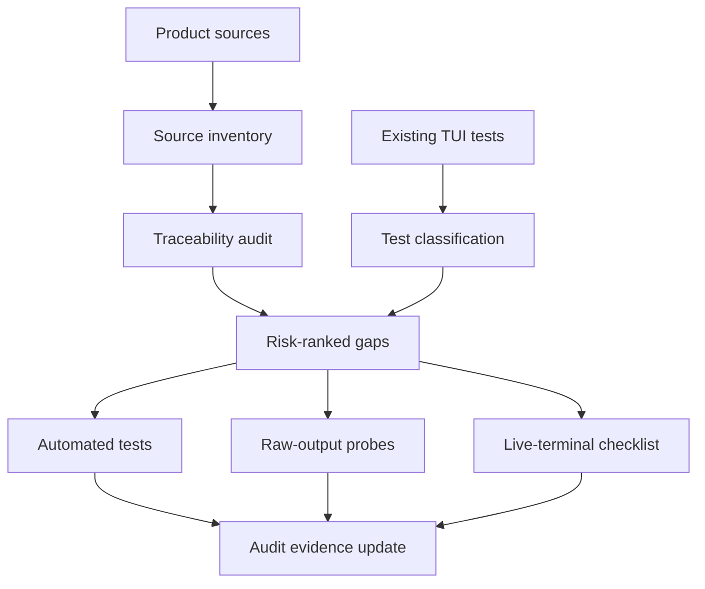

# test: Redesign TUI product UX regression coverage

## Summary

Build a traceability-first TUI test redesign: create a committed audit that maps shipped TUI product behavior to evidence, then use that map to tighten high-risk tests and live-terminal checks. The plan treats git history, current behavior, and product docs as sources, with raw-output evidence added where it can catch terminal-update regressions before live checks.

---

## Problem Frame

The composer trailing-space cursor bug passed the existing suite because helper-coordinate tests and rendered-frame snapshots did not observe Ink's cursor-only terminal update path. KQode has broad TUI coverage, but product promises now live across brainstorms, plans, commit history, current `tui/AGENTS.md`, tests, and ad-hoc fixes.

The work needs a reviewable audit before broad test cleanup. Without source-to-evidence traceability, adding tests risks polishing low-value assertions while missing user-visible regressions in cursor placement, safe-edge rendering, selection, command surfaces, provider flows, and terminal input.

---

## Requirements

**Traceability audit**

- R1. Create a committed Markdown audit under `docs/audits/` that maps shipped TUI behavior to evidence status. (origin R1, R5)
- R2. Include source type for each behavior: brainstorm, plan, commit history, issue/bug report, current product contract, or current code behavior. (origin R2)
- R3. Treat full commit subjects and bodies as the first git-history source, and inspect path-filtered diffs only when the message is ambiguous. (origin key decision)
- R4. Record missing coverage as a user-visible regression risk, not merely as a source/test gap. (origin R3)
- R5. Support a partial-evidence status when automated tests prove state or frames but live/raw terminal behavior remains unproven. (origin R4, AE2)

**Test-suite hardening**

- R6. Classify existing TUI tests as product behavior, implementation mechanics, architecture guardrail, or regression badcase before changing them. (origin R6-R8)
- R7. Strengthen tests that over-claim product/UX coverage through helper-only, state-only, or snapshot-only assertions. (origin R7, AE3)
- R8. Preserve implementation-level and architecture-guardrail tests when they are honest about what they protect. (origin R8)
- R9. Consolidate overlapping tests only when the traceability audit still shows the same product promise as covered. (origin R9, AE4)

**Terminal evidence and badcases**

- R10. Add a raw-output evidence lane for Ink escape/update behavior where automation can observe the failure class. (origin R4, R10, R14)
- R11. Keep live-terminal checks for cursor landing, stale final cells, flicker, and hover-boundary behavior that raw tests cannot prove. (origin R4, R14)
- R12. Encode recently fixed user-visible bugs as automated tests or live checks with trigger, prior failure, and expected behavior. (origin R10-R12)

**Workflow and documentation**

- R13. Update stale comments or help copy when they would mislead future coverage audits about current product behavior. (origin R15)
- R14. Document the rule that changed TUI user experience requires matching automated, raw-output, or live-terminal evidence. (origin R13-R16)
- R15. Keep validation guidance on `cargo xtask tui-typecheck` and `cargo xtask tui-test` for TUI work. (origin R16)

**Evidence hygiene and secret guardrails**

- R16. Committed audit and raw-output evidence use synthetic or redacted values and never preserve credential-shaped strings, raw provider keys, env dumps, clipboard payloads, or secret-bearing terminal/RPC frames.
- R17. Provider-key secret isolation remains a protected evidence category, and test consolidation may remove secret guardrails only when equivalent non-leakage coverage remains.

---

## Key Technical Decisions

- **Audit before edits:** Build the source-to-evidence audit first, then change tests only where the audit shows high-risk missing or weak coverage.
- **Current shipped behavior wins over stale plans:** Resolve conflicts by checking current code/tests and git history, then mark older docs as historical rather than forcing tests to match superseded behavior.
- **Evidence status is multi-valued:** Use statuses such as automated, partial automated plus live required, live/manual, deferred, missing, and implementation-only; a binary covered/missing status would hide the exact failure mode that caused the cursor bug.
- **Raw-output probes complement, not replace, live checks:** A controlled raw-stream test can catch cursor-only update regressions, while real terminals remain authoritative for physical cursor landing and stale-cell rendering.
- **High-risk categories drive the first pass:** Prioritize layout/cursor/safe canvas, command surfaces, selection/clipboard, mouse/wheel, markdown/theme, and provider/model/connect/resume flows before low-risk assertion cleanup.
- **Small drift fixes are in scope:** Fix comments/help copy that contradict current behavior when that contradiction would pollute the audit; defer unrelated documentation polish.
- **Evidence hygiene is part of the audit:** Cite commits, files, and test names instead of copying secret-bearing snippets; redact credential-shaped values before committing audit or raw-output evidence.

---

## High-Level Technical Design

The audit is the coordination point. Product sources establish what behavior must be preserved, test classification establishes what current tests prove, and only the risk-ranked gaps drive code/test edits.

---

## Implementation Units

### U1. Create the TUI traceability audit scaffold

- **Goal:** Add the durable audit artifact and define its evidence vocabulary before inspecting or changing tests.
- **Requirements:** R1, R2, R4, R5, R15, R16
- **Dependencies:** None
- **Files:**
  - Create: `docs/audits/2026-07-13-tui-product-ux-test-traceability-audit.md`
  - Reference: `docs/audits/2026-07-12-brainstorms-and-plans-shipped-audit.md`
  - Reference: `docs/brainstorms/2026-07-13-tui-product-ux-test-redesign-requirements.md`
- **Approach:** Follow the existing audit frontmatter and narrative style. Define a status legend that includes automated, partial automated plus live required, live/manual, deferred, missing, and implementation-only. Add a method section stating that plan `status:` is not trusted as shipped truth, that current behavior and git history resolve conflicts, and that evidence snippets must be synthetic or redacted when they could contain credentials.
- **Execution note:** Characterization-first: write the audit skeleton and status semantics before adding or editing tests.
- **Patterns to follow:** Existing shipped-status audit uses frontmatter plus `Headline`, `Method`, and a full map table.
- **Test scenarios:** Test expectation: none -- this unit creates a documentation audit scaffold and does not change behavior.
- **Verification:** The audit has stable frontmatter, an evidence legend, a source method, and no absolute paths.

### U2. Build the shipped-behavior source inventory

- **Goal:** Populate the audit with the product sources that define shipped TUI behavior.
- **Requirements:** R1, R2, R3, R4, R16
- **Dependencies:** U1
- **Files:**
  - Modify: `docs/audits/2026-07-13-tui-product-ux-test-traceability-audit.md`
  - Reference: `tui/AGENTS.md`
  - Reference: `docs/brainstorms/`
  - Reference: `docs/plans/`
  - Reference: `docs/solutions/architecture-patterns/terminal-edge-rendering-tradeoffs-in-the-ink-tui.md`
- **Approach:** Inventory TUI behavior from current `tui/AGENTS.md`, recent brainstorms/plans, current code behavior, and git history. Use the shipped-status audit as a navigation and method aid, not as a behavior source type. Record open issues such as issue #2 only as open risks unless current code or shipped commits prove the behavior already exists. Use full commit subjects and bodies first; inspect path-filtered diffs only for ambiguous commits. Mark superseded docs when current behavior or later commits changed the product contract, and cite evidence without copying secret-bearing diffs or raw payloads.
- **Patterns to follow:** The shipped-status audit records why plan metadata is unreliable and uses code plus git history as evidence.
- **Test scenarios:** Test expectation: none -- this unit records source evidence in the audit.
- **Verification:** The audit includes source rows for layout/cursor/safe canvas, command surfaces, selection/clipboard, mouse/wheel, markdown/theme, provider/model/connect/resume, and known recent bug fixes.

### U3. Map source behaviors to existing evidence

- **Goal:** Connect each high-risk behavior to current automated tests, raw-output coverage, live checks, or missing evidence.
- **Requirements:** R4, R5, R6, R8, R9, R11
- **Dependencies:** U2
- **Files:**
  - Modify: `docs/audits/2026-07-13-tui-product-ux-test-traceability-audit.md`
  - Reference: `tui/src/**/*.test.ts`
  - Reference: `tui/src/**/*.test.tsx`
  - Reference: `tui/src/__tests__/App.test.tsx`
  - Reference: `tui/src/__tests__/components/HomeScreen.test.tsx`
  - Reference: `tui/src/__tests__/components/PromptComposer.test.tsx`
  - Reference: `tui/src/components/PromptComposer/__tests__/caretDuringLoad.test.tsx`
  - Reference: `tui/src/components/PromptComposer/__tests__/ComposerFrame.test.ts`
  - Reference: `tui/src/components/HomeScreen/__tests__/wheelScroll.test.ts`
  - Reference: `tui/src/components/ConnectSurface/__tests__/ConnectSurface.test.tsx`
  - Reference: `tui/src/components/ModelSurface/__tests__/ModelSurface.test.tsx`
  - Reference: `tui/src/components/MemorySurface/__tests__/MemorySurface.test.tsx`
  - Reference: `tui/src/components/ThemeSurface/__tests__/ThemeSurface.test.tsx`
- **Approach:** Build a complete inventory table for every TUI test file before marking product evidence. Classify each file by evidence strength and scope, with product behavior, implementation mechanics, architecture guardrail, regression badcase, or explicit out-of-scope reason. For product-facing surfaces, record state coverage for entry, empty, loading/pending, validation/error, success, cancel/escape, scroll boundary, and focus/selection states where those states apply. Mark helper-coordinate tests as partial when they prove math but not terminal output. Mark component frame tests as partial when `lastFrame()` cannot observe color, raw cursor movement, or physical stale cells. Preserve architecture guardrails as implementation-only evidence instead of forcing them into product coverage.
- **Patterns to follow:** Existing tests use `renderWithJotai`, viewport override atoms, `flushInput`, backend stubs, and focused pure-helper assertions.
- **Test scenarios:** Test expectation: none -- this unit audits existing tests without changing them.
- **Verification:** Every TUI test file appears in the inventory table, and every high-risk source row has an evidence status with a user-visible regression risk when missing or partial.

### U4. Add raw-output regression coverage for terminal-update traps

- **Goal:** Add automated coverage for Ink/raw-stream behavior that the current helper and `lastFrame()` tests can miss.
- **Requirements:** R7, R10, R12, R16
- **Dependencies:** U3
- **Files:**
  - Create: `tui/src/components/PromptComposer/__tests__/terminalOutput.test.tsx`
  - Modify: `tui/src/components/PromptComposer/__tests__/ComposerFrame.test.ts`
  - Modify: `docs/audits/2026-07-13-tui-product-ux-test-traceability-audit.md`
- **Approach:** Add raw-stream setup inside the targeted terminal-output test so it does not become a shared abstraction before a second consumer exists. Use direct Ink rendering in incremental, interactive mode instead of `ink-testing-library` debug rendering so the test exercises the raw cursor-only update path. Use it for the composer terminal-output badcase, not broad component snapshots, and never persist raw frames from secret-entry flows. The target is the composer trailing-space failure class: an authored trailing-space edit must produce a composer-line repaint or equivalent non-cursor-only output. Record any remaining live-only part in the audit.
- **Execution note:** Test-first for each high-risk badcase: capture the prior failure trigger before changing or extending production code.
- **Patterns to follow:** Mirror existing test harness isolation and avoid importing Node process APIs into components/state. The raw test should keep `debug` off, keep incremental rendering on, force interactive TTY-like streams, and wait for Ink render flushes after input writes. Extract a shared `tui/src/test/` helper only if a second raw-output consumer lands in the same work.
- **Test scenarios:**
  - Covers AE2. Given the composer receives `a` then a trailing space, the raw write for the space includes a composer-line repaint or equivalent non-cursor-only output, not only cursor movement.
  - Covers AE2. Given repeated trailing spaces, raw writes do not accumulate cursor-up movement without a corresponding frame update.
  - Given a normal character edit, the raw helper still observes the expected frame rewrite.
  - Given a non-TTY or mocked stdout path, existing no-mouse-tracking behavior remains covered by the existing mouse-tracking test.
- **Verification:** The new raw-output test fails against the prior cursor-only failure class and passes with the current composer text/padding split; audit status updates from missing/partial to automated plus live required where appropriate.

### U5. Audit and harden high-risk product tests

- **Goal:** Update only the tests that over-claim or miss high-risk TUI product behavior after the audit identifies them.
- **Requirements:** R6, R7, R8, R9, R12, R16, R17
- **Dependencies:** U3, U4
- **Files:**
  - Modify: `docs/audits/2026-07-13-tui-product-ux-test-traceability-audit.md`
  - Modify: `tui/src/__tests__/components/HomeScreen.test.tsx`
  - Modify: `tui/src/__tests__/components/PromptComposer.test.tsx`
  - Modify: `tui/src/components/HomeScreen/__tests__/selectionInput.test.ts`
  - Modify: `tui/src/components/HomeScreen/__tests__/wheelScroll.test.ts`
  - Modify: `tui/src/components/CommandSurface/__tests__/CommandSurface.test.tsx`
  - Modify: `tui/src/components/ConnectSurface/__tests__/ConnectSurface.test.tsx`
  - Modify: `tui/src/components/ModelSurface/__tests__/ModelSurface.test.tsx`
  - Modify: `tui/src/components/MemorySurface/__tests__/MemorySurface.test.tsx`
  - Modify: `tui/src/components/ThemeSurface/__tests__/ThemeSurface.test.tsx`
  - Reference: `tui/src/__tests__/secretsNotInAtoms.test.ts`
  - Reference: `tui/src/components/MaskedInput/__tests__/MaskedInput.test.tsx`
  - Reference: `src/connect/tests.rs`
- **Approach:** Use the audit to select the smallest high-value set of test edits. Strengthen tests whose names imply user-visible coverage but only assert internal state. Add badcase tests for shipped regressions when automation can observe the trigger. Do not rewrite helper-only or architecture-guardrail tests unless their names or assertions misrepresent their scope.
- **Execution note:** Work risk-ranked and commit-sized; avoid broad formatting or assertion rewrites that the audit did not justify.
- **Patterns to follow:** Keep component tests user-flow oriented with `stdin.write`, `lastFrame()`, and store assertions only when the store is the product state being verified.
- **Test scenarios:**
  - Covers AE3. Given a test whose title promises product behavior but asserts only helper state, the updated test observes the rendered flow or is renamed to implementation scope.
  - Given two overlapping command-surface tests, consolidation leaves one clear product-flow assertion and the audit still marks the behavior covered.
  - Given current right-click selection copy behavior, tests assert drag/release highlights without copying and right-click copies/clears.
  - Given batched wheel input and mixed input chunks, the existing wheel-wins behavior is either documented as intentional in the audit or marked as deferred ambiguity.
  - Given provider/connect surfaces, tests continue to prove masked key handling and secret non-leakage across rendering, atoms, protocol/debug behavior, persistent sinks, and logs.
- **Verification:** Updated tests are traceable to audit gaps, and the audit distinguishes product coverage from implementation mechanics after edits.

### U6. Add the live-terminal checklist and fix drifted product evidence

- **Goal:** Preserve the behaviors automation cannot honestly prove and remove stale comments/docs that would mislead future audits.
- **Requirements:** R11, R13, R14, R15
- **Dependencies:** U3, U4, U5
- **Files:**
  - Modify: `docs/audits/2026-07-13-tui-product-ux-test-traceability-audit.md`
  - Modify: `tui/src/components/HomeScreen/useHomeScreenInput.ts`
  - Modify: `tui/AGENTS.md`
- **Approach:** Add a live-terminal checklist section with terminal app/version, OS, dimensions, commit/build, steps, expected visual result, observed result, pass/fail status, tester/date, and notes or artifact link. Include cursor landing, stale final-cell rendering, flicker, first typed character, trailing-space typing, Help/surface round trip, resize at wrap boundary, wheel hover boundary, and final-column safe-width checks. Fix stale comments that still describe superseded copy behavior, and update `tui/AGENTS.md` only if the evidence-gate rule is not already covered by the new audit.
- **Patterns to follow:** `tui/AGENTS.md` already documents live cursor verification expectations and TUI product invariants; keep changes targeted.
- **Test scenarios:** Test expectation: none -- this unit updates documentation and comments; behavior is covered by U4/U5 and live checklist evidence.
- **Verification:** Live-only behaviors are not marked fully automated in the audit; stale product-evidence comments no longer contradict current right-click copy behavior; validation guidance names `cargo xtask tui-typecheck` and `cargo xtask tui-test`.

---

## Acceptance Examples

- AE1. **Covers R1-R5.** Given a shipped behavior found only in a commit message, when the audit is complete, then the row names the commit source, coverage status, and user-visible regression risk.
- AE2. **Covers R5, R10, R11.** Given cursor behavior that helper math proves only partially, when the audit is complete, then the behavior is marked partial automated plus live required unless a raw-output test proves the missing layer.
- AE3. **Covers R6-R9.** Given an existing implementation-level test, when it is audited, then it is preserved as implementation evidence and not counted as product/UX coverage unless it observes a user-visible outcome.
- AE4. **Covers R12-R14.** Given a future TUI feature changes user behavior, when reviewers inspect the audit and tests, then they can see the matching automated/raw/live evidence requirement.
- AE5. **Covers R16, R17.** Given audit or raw-output evidence touches provider/connect behavior, when it is committed, then credential-shaped values are synthetic or redacted and secret-isolation guardrails remain covered.
- AE6. **Covers R15.** Given a contributor reads the audit or related TUI evidence guidance, when they look for validation commands, then they see `cargo xtask tui-typecheck` and `cargo xtask tui-test`.

---

## Scope Boundaries

- First pass covers TUI product/UX only; Rust harness, provider benchmarks, and agentic eval strategy stay out of scope.
- Broad assertion cleanup is deferred unless the traceability audit identifies product risk.
- Live-terminal evidence is allowed and expected; the plan does not require faking every terminal behavior into unit tests.
- A raw-output helper is scoped to targeted terminal-update regressions, not a replacement for `ink-testing-library`.
- Superseded docs are not rewritten wholesale; the audit records the current behavior and fixes only misleading comments/help copy that affect product evidence.

### Deferred to Follow-Up Work

- Expand the same traceability model to Rust core, provider/runtime, and eval suites.
- Build a machine-readable traceability manifest if the Markdown audit becomes hard to maintain.
- Add a stronger terminal-emulation harness if raw-output probes and live checks leave recurring blind spots.

---

## Risks & Dependencies

| Risk | Mitigation |
| --- | --- |
| Commit-history extraction becomes a whole-repo archaeology project | Start with TUI-related commit subjects and bodies, bucket superseded behavior, and inspect diffs only when messages are ambiguous. |
| Audit rows become stale after tests are added | Update the audit in the same unit that adds or changes evidence. |
| Raw-output tests overfit Ink internals | Use them only for failure classes involving raw writes; keep live-terminal checks for physical rendering. |
| Existing implementation tests get rewritten unnecessarily | Classify them honestly and preserve them unless they over-claim product coverage. |
| Concurrent sessions change docs/tests while this work is underway | Re-check `git status` and commit with explicit pathspecs for each unit. |

---

## Documentation / Operational Notes

- The audit file is the primary handoff artifact for reviewers deciding whether TUI product promises are protected.
- Any future TUI plan that changes layout, cursor placement, mouse input, command surfaces, clipboard, or provider/model UX should reference or update the audit.
- Validation remains Cargo-facing: `cargo xtask tui-typecheck` and `cargo xtask tui-test` for TUI changes.

---

## Sources / Research

- `docs/brainstorms/2026-07-13-tui-product-ux-test-redesign-requirements.md` is the origin document.
- `docs/audits/2026-07-12-brainstorms-and-plans-shipped-audit.md` provides the audit style and the rule not to trust plan status as shipped truth.
- `tui/AGENTS.md` is the current TUI product contract for layout, cursor placement, command surfaces, selection, safe width, and validation commands.
- `docs/solutions/architecture-patterns/terminal-edge-rendering-tradeoffs-in-the-ink-tui.md` explains why cursor and final-cell behavior need live/raw evidence beyond frame snapshots.
- `docs/solutions/architecture-patterns/state-libs-layering-and-cycle-verification-in-the-ink-tui.md` and `docs/solutions/architecture-patterns/backend-process-lifecycle-ownership-in-the-ink-tui.md` justify preserving implementation and architecture guardrail tests as separate evidence classes.
- `docs/kqode_evaluation_spec.md` frames deterministic tests and behavioral regressions as first-class, model-independent quality layers.
