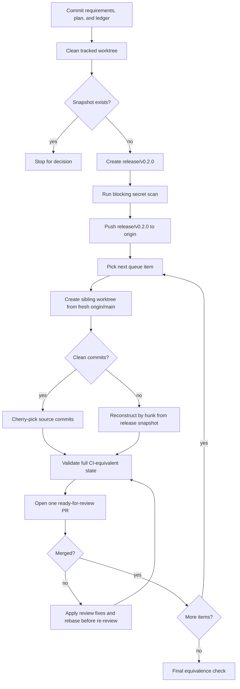
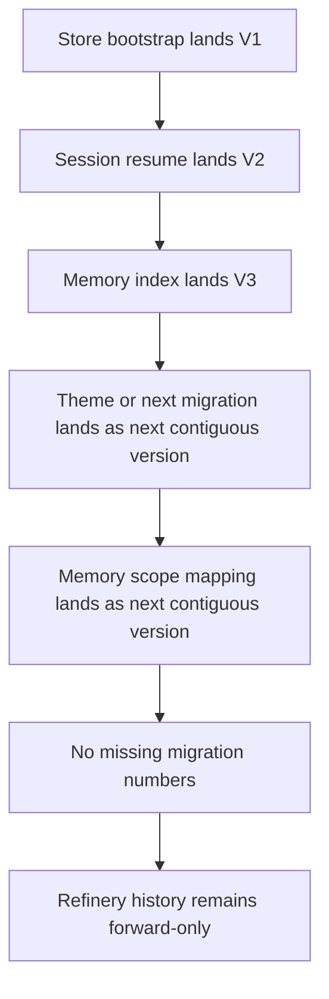

# chore: Split v0.2.0 release branch into rolling PR queue

## Summary

Commit the split requirements, plan, and initial queue ledger; freeze the current release candidate as `release/v0.2.0`; scan the release delta for secrets before pushing the snapshot; then reconstruct the candidate as a rolling queue of main-based PRs. Each PR is prepared in a sibling worktree from fresh `origin/main`, validated as an intermediate state, and opened only when fully ready for review.

---

## Problem Frame

`feat/tui-composer-scroll` is a 335-commit release-candidate branch that spans many product and infrastructure concerns. A single PR would be too large to review, while a stacked queue would make GitHub diffs and merge order hard for manual reviewers.

The split must preserve the full candidate, make each review unit coherent, and avoid accidental release automation. It also has to account for mixed early WIP commits, cross-cutting fixes, and migration numbering that was safe on one branch but unsafe if memory and theme changes land in separate PRs.

---

## Requirements

**Snapshot and branch lifecycle**

- R1. Commit the requirements doc, this plan, and the initial queue ledger before creating `release/v0.2.0`.
- R2. Create `release/v0.2.0` from the current `feat/tui-composer-scroll` head only after confirming the tracked worktree and index are clean.
- R3. Run a blocking secret scan over the `origin/main..release/v0.2.0` delta before pushing the snapshot branch.
- R4. Push `release/v0.2.0` to `origin` for durability, without creating any `v*` tag or version bump.
- R5. Stop for a human decision if `release/v0.2.0` already exists locally or remotely.
- R6. Treat both `release/v0.2.0` and `origin/feat/tui-composer-scroll` as read-only references after the freeze.

**Rolling PR queue**

- R7. Create each feature PR branch on demand from freshly fetched `origin/main`.
- R8. Use `release/v0.2.0` as the read-only source for cherry-picks, hunk extraction, and equivalence checks.
- R9. Use sibling worktrees outside the repository root for extraction branches so the split process is portable across machines and does not depend on repo-local ignore state.
- R10. Open exactly one PR at a time, only after the branch passes full CI-equivalent checks and is ready for review.
- R11. Re-extract unopened branches after earlier PRs merge; rebase open branches before requesting review or re-review, and record the current base SHA in the PR body.
- R12. Keep each PR focused on one feature, infrastructure unit, or tightly coupled fix set.

**Extraction quality**

- R13. Fold review fixes, docs, and tests into the earliest PR that introduces the behavior they protect.
- R14. Split mixed commits by hunk when a whole-commit cherry-pick would pollute a PR boundary.
- R15. List the weak-message WIP commit hashes up front, and define hunk ownership before PR 01 is opened for review.
- R16. Call out unavoidable mixed bootstrap content in the bootstrap PR description.
- R17. Assign plan-marker and research-only documentation before opening each PR so docs do not accumulate in vague late work.
- R18. Do not open a PR that intentionally exposes a temporary behavior that a later PR removes; review branches present the final intended state for that feature.
- R19. Any queue-order or PR-boundary change requires explicit approval before extraction continues.

**Migration and validation safety**

- R20. Preserve forward-only migration ordering when splitting memory and theme work into separate PRs; migration numbers may change, but the embedded sequence must always be contiguous with no gaps.
- R21. The bootstrap PR must not introduce provider credential reads from workspace `.env` or other plaintext workspace files before keychain-only provider configuration lands.
- R22. Validate each PR as an independently buildable state before opening it for review; no PR is opened with failing CI-equivalent checks.
- R23. If a planned PR cannot pass full checks as a standalone state, stop and revise the queue/ledger before opening any PR.
- R24. After the queue lands, compare the final `main` state against `release/v0.2.0` for production/tooling behavior equivalence and document any intentional residual delta.

---

## Key Technical Decisions

- **Durable remote snapshot.** Push the release branch to `origin` after local creation because branch pushes do not trigger the tag-only release workflow, while local-only snapshots are fragile.
- **Secret scan before publication.** Treat branch push as a publication event even though it is not a release event; scan the candidate delta before the remote snapshot is created.
- **On-demand branch creation.** Do not pre-create the feature branches; building each branch from current `origin/main` keeps review diffs small and avoids stale dependency assumptions.
- **Re-extract unopened work, rebase open work.** Unopened items are recreated from the release snapshot after each merge, while branches already in review are rebased only when they need to stay open.
- **Migration order is a release-split constraint.** Migration files may be renumbered during extraction, but only to the next contiguous version on `main`; no gap is allowed.
- **Bootstrap may be mixed, later PRs should not be.** The earliest numbered commits can be reviewed as one documented bootstrap boundary, but later mixed commits should be hunk-split or folded into parent PRs.
- **Final-state PRs only.** Do not land intermediate behavior such as temporary workspace `.env` credential reads just to remove it in a later PR.
- **Queue progress lives outside the plan.** Track state in `docs/release/v0.2.0-pr-queue.md`; keep this plan as the decision artifact.
- **Sibling worktrees for portability.** Put extraction worktrees outside the repo root so the process works across machines without relying on local ignore files.
- **Validation is required at PR boundaries.** Full CI-equivalent checks are the default bar before opening every PR.
- **No catch-all polish PR.** Any remaining late item becomes a single-purpose PR or is folded into its parent; there is no generic PR 24.

---

## High-Level Technical Design

The split uses the release branch as a frozen source of truth and `origin/main` as the only PR base.

Migration sequencing is checked before extracting the memory and theme PRs.

---

## Phased PR Queue

The branch names and titles below come from the origin requirements. The extraction plan may update dependencies or split an item when a hunk-level review proves a better seam, but any queue-map edit must update downstream dependencies in the same change.

| # | Branch | Boundary | Extraction note |
|---|---|---|---|
| 01 | `feat/v0.2.0-tui-composer-scroll-bootstrap` | Composer scroll, backend core, git-status foundation, and weak-message WIP commits. | Reconstruct carefully; include `.worktrees` ignore if worktrees are used. |
| 02 | `ci/v0.2.0-winget-dispatch-only` | Winget manual workflow. | Direct cherry-pick of the clean CI commit even though it sits inside the WIP cluster. |
| 03 | `fix/v0.2.0-xtask-parallel-safe` | Parallel-safe xtask and TUI dev launchers. | Extract after bootstrap so run profiles reference landed tooling shape. |
| 04 | `feat/v0.2.0-session-logging` | Backend and TUI session logging. | Keep lifecycle log tests with this PR. |
| 05 | `feat/v0.2.0-persistence-keychain-migrations` | Store bootstrap, keychain, refinery, fail-closed startup. | Split the second weak-message `2` commit by hunk. |
| 06 | `feat/v0.2.0-provider-management` | Provider abstraction and keychain-only configuration. | Fold provider error and keychain test fixes here. |
| 07 | `feat/v0.2.0-queue-lifecycle-conversation` | Queue lifecycle, transcript coordinator, clear/cancel, submit recall. | Establish protocol surface before TUI surfaces depend on it. |
| 08 | `feat/v0.2.0-tui-provider-surfaces` | `/connect`, `/model`, masked input, provider status. | Extract after provider and queue protocol land. |
| 09 | `fix/v0.2.0-tui-safe-rendering` | Safe canvas, CJK widths, wheel scroll, edge rendering. | Include TUI cursor-visibility hunks from mixed commits. |
| 10 | `feat/v0.2.0-clipboard-primitives` | Clipboard seam, paste, copy-last-response. | Serves as base for later selection work. |
| 11 | `feat/v0.2.0-session-resume` | Local resume, docked picker, `--resume`. | Lands session migration before compaction and summary features. |
| 12 | `feat/v0.2.0-conversation-history-compaction` | Full history and auto-compaction. | Depends on resume persistence. |
| 13 | `feat/v0.2.0-local-memory-system` | Memory corpus, index, backend service, TUI surface, scheduler. | Land memory index migration first; assign scope-mapping migration to the next contiguous migration number when extracted. |
| 14 | `feat/v0.2.0-theme-system` | Theme catalog, persistence, picker, packaging notices. | Must land theme migration before later memory scope mapping. |
| 15 | `feat/v0.2.0-tui-markdown-rendering` | Markdown transcript pipeline and syntax highlighting. | Depends on transcript rows and layout stability. |
| 16 | `feat/v0.2.0-slash-subcommands-memory-tui` | Slash subcommands and memory forms. | Depends on memory backend and markdown rendering. |
| 17 | `refactor/v0.2.0-docked-popup-infrastructure` | Docked CommandSurface shell and shared selection primitives. | Large but coherent TUI chrome refactor. |
| 18 | `feat/v0.2.0-session-summary-title` | LLM summaries and terminal title. | Depends on provider, resume, and command-surface shell. |
| 19 | `feat/v0.2.0-in-app-transcript-selection` | Mouse selection, modeless copy, keyboard copy. | Fold selection and right-click fixes here. |
| 20 | `feat/v0.2.0-latex-math-rendering` | LaTeX to Unicode math rendering. | Post-processing stage after markdown rendering. |
| 21 | `feat/v0.2.0-system-prompt-engine` | Ordered system-prompt sections and `AGENTS.md` ingest. | Refines the prompt metadata path from compaction. |
| 22 | `feat/v0.2.0-eval-baseline` | Headless one-shot, EvalPlus runner, eval CLI. | Depends on provider controls and system-prompt engine. |
| 23 | `feat/v0.2.0-ctrl-c-turn-stop` | Ctrl+C turn stop and backend/TUI stop seam. | Depends on queue lifecycle. |
| 24+ | `fix/v0.2.0-<exact-item>` | Late leftovers only when they cannot be folded into a parent PR. | No catch-all: each leftover is a single-purpose PR with explicit approval. |

---

## PR Description Contract

Every PR in the queue should use the same review scaffold:

- **Boundary:** The feature, infrastructure unit, or fix set included in this PR.
- **Representative commits:** Source commit hashes or ranges from `release/v0.2.0`.
- **Dependencies:** Prior queue items that must already be on `main`.
- **Base SHA:** The `origin/main` commit used to create or rebase this branch.
- **Folded fixes:** Review fixes, docs, or tests intentionally included here.
- **Extraction notes:** Any hunk-level reconstruction, mixed WIP content, or migration renumbering.
- **Validation:** Checks run, skipped checks if any, and why a skip is temporary.
- **Queue approval:** Link or note explicit approval for any queue-order or PR-boundary change.

---

## Implementation Units

### U1. Freeze the release snapshot

- **Goal:** Preserve the full release candidate as a durable reference branch before extraction starts.
- **Requirements:** R1, R2, R3, R4, R5, R6.
- **Dependencies:** None.
- **Files:** `docs/brainstorms/2026-07-14-v0-2-0-release-pr-split-requirements.md`, `docs/plans/2026-07-14-001-chore-v0-2-0-release-pr-split-plan.md`, `docs/release/v0.2.0-pr-queue.md`.
- **Approach:** Commit the requirements doc, this plan, and the initial ledger before the freeze. Confirm the current branch and tracked worktree state, create the local release branch from the current head, run a blocking secret scan over the candidate delta, then push the branch to `origin`. Do not create tags or run version synchronization.
- **Patterns to follow:** `CONTRIBUTING.md` for main-based PRs; `.github/workflows/release.yml` for tag-trigger boundaries.
- **Test scenarios:** Test expectation: none -- this unit mutates git refs, not product code. Verify by inspecting branch refs, confirming the secret scan is clean or triaged, and confirming no `v0.2.0` tag exists.
- **Verification:** `release/v0.2.0` and `origin/release/v0.2.0` point at the same source commit, the docs and initial ledger are in the snapshot, release automation has not run, and `feat/tui-composer-scroll` is treated as read-only.

### U2. Build the extraction ledger and PR template

- **Goal:** Turn the queue map into an execution ledger that each PR can follow without rediscovering boundaries.
- **Requirements:** R7, R8, R9, R10, R11, R12, R13, R14, R15, R16, R17, R18, R19.
- **Dependencies:** U1.
- **Files:** `docs/brainstorms/2026-07-14-v0-2-0-release-pr-split-requirements.md`, `docs/plans/2026-07-14-001-chore-v0-2-0-release-pr-split-plan.md`, `docs/release/v0.2.0-pr-queue.md`.
- **Approach:** For each queue item, record status, branch, base SHA, source commits, dependencies, PR URL, validation, reviewer notes, expected file clusters, docs ownership, folded fixes, and dependency assumptions. List the weak-message WIP commit hashes up front; define hunk ownership before PR 01 is opened. Record explicit approval before any queue-order or PR-boundary change.
- **Patterns to follow:** The queue table in the origin requirements; the repository memory that shared branches may receive concurrent staged changes.
- **Test scenarios:** Test expectation: none -- this is planning metadata and PR-body preparation. Review the ledger for every queue item before opening PR 01.
- **Verification:** Every queue item has a PR description outline using the PR Description Contract fields, with feature boundary, representative commits, dependencies, folded fixes, validation outcome, and review notes.

### U3. Extract the bootstrap PR

- **Goal:** Create the first main-based PR that establishes the minimal code foundation required by later queue items.
- **Requirements:** R7, R8, R9, R10, R12, R14, R15, R16, R18, R21, R22, R23.
- **Dependencies:** U1, U2.
- **Files:** `Cargo.toml`, `Cargo.lock`, `src/backend.rs`, `src/protocol.rs`, `src/config.rs`, `src/git.rs`, `src/chat/`, `tui/src/`, `tests/git_status.rs`, `tests/json_rpc_errors.rs`, `tests/message_submit.rs`, `tui/src/**/*.test.ts`.
- **Approach:** Reconstruct from the weak-message WIP commits rather than blindly preserving their commit boundaries. Include only the backend core, protocol/client foundation, composer-scroll support, git status, shared helpers, and docs/tests needed for a buildable base. Do not introduce workspace `.env` provider credential reads or any temporary credential behavior that later PRs remove.
- **Execution note:** Use characterization-first validation around any behavior introduced by the WIP commits because the original commit messages do not describe intent.
- **Patterns to follow:** Conventional Commit PR descriptions from `CONTRIBUTING.md`; protocol lockstep convention from `AGENTS.md`.
- **Test scenarios:** Given a mixed WIP commit touches backend, TUI, docs, and dependencies, extract only the bootstrap-compatible hunks and document the mixed boundary. Given bootstrap contains provider-adjacent setup, no workspace plaintext credential read path is introduced. Given a bootstrap branch is built, full CI-equivalent checks pass before the PR is opened.
- **Verification:** PR 01 targets `main`, explains the bootstrap mixture, and leaves later provider, store, memory, theme, eval, and selection features out unless required for compilation.

### U4. Land early observability, workflow, and tooling PRs

- **Goal:** Land independent or low-dependency observability and workflow changes early so the split environment is safer.
- **Requirements:** R7, R9, R12, R17, R22.
- **Dependencies:** U3 for session logging and xtask work.
- **Files:** `.github/workflows/winget-publish.yml`, `docs/release/kqode_distribution_registration.md`, `.cargo/config.toml`, `.run/`, `scripts/xtask.sh`, `scripts/xtask.ps1`, `xtask/src/`, `src/debug_log.rs`, `src/debug_log/`, `tui/src/backend/log/sessionLogger.ts`, `tui/src/backend/log/__tests__/sessionLogger.test.ts`, `tui/package.json`, `tui/bun.lock`.
- **Approach:** Extract the CI-only winget change as a clean cherry-pick after PR 01 merges; do not open it in parallel. Extract session logging after bootstrap so lifecycle events have a stable backend/TUI seam, then extract xtask isolation and TUI dev launchers after bootstrap so the run profiles and launcher scripts match the landed project shape.
- **Patterns to follow:** Existing xtask thin-wrapper convention in `AGENTS.md`; CI commands in `.github/workflows/ci.yml`.
- **Test scenarios:** Given the winget PR changes only release workflow/docs files, it can pass CI without source changes. Given session logging is extracted, backend lifecycle events and TUI log buffering are covered by lifecycle/log tests. Covers AE2. Given bootstrap has merged, the xtask branch starts from fresh `origin/main` and does not show bootstrap diffs. Given xtask run profiles are extracted, fast xtask commands use the private build directory and long-running profiles route through launchers.
- **Verification:** PRs 02-04 have no feature-code diff outside their boundaries and pass the relevant Rust/TUI automation checks.

### U5. Land the persistence, provider, and conversation backbone

- **Goal:** Establish the durable backend services and protocol contracts that user-facing PRs depend on.
- **Requirements:** R7, R8, R11, R13, R14, R20, R22, R23.
- **Dependencies:** U3.
- **Files:** `src/paths.rs`, `src/store/`, `migrations/`, `src/secrets/`, `src/provider/`, `src/connect/`, `src/backend/`, `src/conversation/`, `src/protocol/`, `tests/`, `tui/src/contracts/backend/`, `tui/src/backend/`.
- **Approach:** Extract store/keychain/refinery first, provider management second, conversation queue lifecycle third, and TUI provider surfaces after the Rust/TS contracts exist. Split the second weak-message `2` commit across store/provider/TUI units instead of assigning it wholesale.
- **Patterns to follow:** Rust/TS protocol names and shapes must change in lockstep; store startup fails closed and does not auto-delete the database.
- **Test scenarios:** Given provider credentials are configured, the provider settings persist without key material entering SQLite or JSONL. Covers AE4. Given the second weak-message `2` commit contains store/provider/TUI hunks, persistence and provider hunks travel here while rendering hunks remain for the safe-rendering PR. Given queue lifecycle events flow from backend to TUI, submitted prompts enqueue, activate, settle, clear, and cancel without the legacy drain-loop behavior. Given store startup fails, the backend reports a store-fatal remedy and does not emit ready.
- **Verification:** PRs 05-08 each compile independently, carry their own protocol contract tests, and leave downstream TUI surfaces disabled or absent until their prerequisites land.

### U6. Land session, memory, theme, and rendering features with migration order fixed

- **Goal:** Land the middle queue without breaking SQLite migration history or TUI rendering invariants.
- **Requirements:** R7, R8, R10, R11, R13, R20, R22, R23.
- **Dependencies:** U5.
- **Files:** `src/conversation/`, `src/chat/`, `src/memory/`, `src/backend/sessions.rs`, `src/backend/memory.rs`, `src/backend/themes.rs`, `src/store/tests.rs`, `migrations/V2__session_resume_index.sql`, `migrations/V3__memory_index.sql`, `migrations/V4__theme_preferences.sql`, `migrations/V5__memory_scope_mappings.sql`, `tui/src/components/`, `tui/src/state/`, `tui/src/libs/terminal/`, `tui/src/libs/text/`, `tests/session_resume.rs`, `tests/memory_backend.rs`, `tui/src/**/*.test.ts`.
- **Approach:** Land session resume and compaction before memory. For memory/theme, assign each extracted migration to the next contiguous version on `main`; never leave a missing migration number. Hunk-split `src/store/tests.rs` with the migration it verifies so each intermediate PR asserts only the versions embedded in that PR.
- **Execution note:** Treat migration extraction as test-first: before opening the affected PRs, add or preserve migration-history tests that fail if versions are out of order.
- **Patterns to follow:** Existing `refinery` migration embed and checksum tests; terminal rendering helpers under `tui/src/libs/terminal/` are TTY-guarded with pure sequence builders.
- **Test scenarios:** Given a database has applied session resume and memory index migrations, applying theme and later memory scope mapping succeeds without a divergent-history error. Given memory entries are activated, the durable item and inbox link survive index rebuild. Given markdown and rendering features land, selection/copy and CJK display-width cases keep existing transcript content stable.
- **Verification:** PRs 09-17 pass repository checks on their own and the migration sequence is valid on a fresh database and an upgraded database.

### U7. Land late feature PRs and fold remaining fixes

- **Goal:** Finish the user-visible release features and prevent the final polish PR from becoming a second mixed bootstrap.
- **Requirements:** R7, R8, R10, R11, R13, R14, R17, R19, R22, R23.
- **Dependencies:** U6.
- **Files:** `src/chat/`, `src/eval/`, `src/headless.rs`, `src/provider/`, `src/protocol/`, `src/backend/`, `xtask/src/`, `evaluation/`, `scripts/eval-grade.sh`, `scripts/eval-grade.ps1`, `tui/src/components/`, `tui/src/state/`, `tui/src/libs/text/`, `docs/research/`, `docs/solutions/`.
- **Approach:** Extract session summary, transcript selection, LaTeX math, system-prompt engine, eval baseline, Ctrl+C turn stop, and any late exact-item fixes in dependency order. There is no generic polish PR; every leftover is either folded into its parent feature PR or opened as a single-purpose PR after explicit approval.
- **Patterns to follow:** System-prompt fragments are bounded and traceable; eval work starts with deterministic harness tests; interrupt protocol changes mirror Rust and TS contracts.
- **Test scenarios:** Given transcript selection is active while content is highlighted, copy preserves selected text and syntax colors. Given LaTeX-like math appears in assistant markdown, conversion is linear-time and does not regress normal markdown. Given a turn is streaming, Ctrl+C cancels the running turn without triggering idle exit behavior. Given eval runs, artifacts and metrics are written to a deterministic run directory.
- **Verification:** PRs 18-23 and any approved exact-item PRs each have a coherent PR body, pass full CI-equivalent checks, and leave no unexplained production-code diff behind for the final equivalence check.

### U8. Verify final equivalence and close the split

- **Goal:** Prove the merged queue reproduces the release candidate's intended production behavior.
- **Requirements:** R11, R17, R24.
- **Dependencies:** U7.
- **Files:** `src/`, `tui/src/`, `migrations/`, `xtask/`, `.github/workflows/`, `packaging/`, `evaluation/`, `docs/brainstorms/2026-07-14-v0-2-0-release-pr-split-requirements.md`.
- **Approach:** Compare final `main` against `release/v0.2.0` by production and tooling behavior first, then explain intentional docs, ledger, lockfile, PR-description, or migration-renumbering deltas. Do not treat commit hash differences as a failure; compare behavior and file content.
- **Patterns to follow:** Release automation remains tag-driven; version synchronization is reserved for the actual v0.2.0 release cut.
- **Test scenarios:** Covers AE6. Given all queue PRs have merged, no later branch contains already-merged prerequisite diffs. Given final `main` differs from `release/v0.2.0`, every residual production-code delta has an intentional explanation.
- **Verification:** The final equivalence note states whether production code is identical or explains each intentional residual delta, and no tag or release workflow has been triggered.

---

## Acceptance Examples

- AE1. Given branch setup starts with `feat/tui-composer-scroll` checked out and tracked changes are clean, when the docs and ledger are committed, the secret scan passes, and the snapshot is created, then local and remote `release/v0.2.0` point at the same candidate commit and no `v0.2.0` tag exists.
- AE2. Given PR 01 has merged, when PR 03 is prepared, then it starts from fresh `origin/main` and its GitHub diff does not show PR 01's already-merged changes.
- AE3. Given a review-fix commit only protects provider credential handling, when extracting provider work, then that fix is folded into the provider PR rather than placed in late polish.
- AE4. Given the second weak-message `2` commit contains store and TUI hunks, when extracting persistence and safe-rendering PRs, then each PR receives only the hunks that belong to its boundary.
- AE5. Given memory and theme migrations are split into separate PRs, when the PRs merge in queue order, then refinery sees a contiguous forward-only version sequence with no missing migration number.
- AE6. Given all queue PRs have merged, when final equivalence is checked, then production/tooling-code behavior differences from `release/v0.2.0` are either absent or documented as intentional reconstruction deltas.
- AE7. Given a late fix cannot be folded into its parent feature PR, when it is approved for separate review, then it becomes a single-purpose exact-item PR rather than part of a catch-all polish PR.

---

## Scope Boundaries

### In scope

- Creating and pushing the `release/v0.2.0` branch.
- Preparing the rolling queue and PR branch strategy.
- Creating and updating `docs/release/v0.2.0-pr-queue.md` as the queue progress ledger.
- Extracting PR branches from `release/v0.2.0` into main-based review branches.
- Renumbering or resequencing migrations only when the resulting migration sequence remains contiguous.
- Opening PRs one at a time with clear review descriptions.

### Deferred to Follow-Up Work

- Bumping manifests to `0.2.0` in any form.
- Pushing a `v0.2.0` tag.
- Publishing GitHub Release, npm, Homebrew, or winget artifacts.
- Deleting or archiving `origin/feat/tui-composer-scroll` after the split.

### Out of scope

- Rewriting already-pushed public history.
- Preserving every original commit as an individual commit in the final main history.
- Opening all feature PRs immediately or opening draft PRs before validation is complete.
- Using a stacked-PR toolchain not already present in the repository.

---

## Risks and Dependencies

| Risk | Mitigation |
|---|---|
| Dirty tracked work sneaks into the snapshot. | U1 requires a clean tracked worktree and explicit handling of untracked planning docs. |
| Candidate branch push exposes an accidental secret. | U1 requires a blocking secret scan before pushing `release/v0.2.0`. |
| Migration numbering breaks after splitting memory and theme. | U6 requires the next contiguous migration version and hunk-splits migration tests with each PR. |
| Bootstrap PR is too mixed to review. | U3 names the unavoidable WIP mixing and keeps later PRs stricter. |
| Later PRs show duplicated prerequisite diffs. | U2 and U8 enforce on-demand branch creation and final equivalence checks. |
| Concurrent sessions stage or edit files during branch work. | U1 and U2 require status checks and explicit pathspec-aware commits when committing generated docs or fixes. |
| Late fixes become a catch-all PR. | U7 eliminates the catch-all; each leftover is folded into its parent or approved as a single-purpose PR. |

---

## Documentation and Operational Notes

- The requirements doc, this plan, and the initial queue ledger are committed before `release/v0.2.0` is frozen so the snapshot contains its audit trail.
- Release automation is safe as long as no `v*` tag is created or pushed.
- The local `main` branch is divergent in this checkout; extraction should use fresh `origin/main` rather than assuming local `main` is current.
- Extraction worktrees live outside the repository root, preferably in a sibling directory such as `../KQode.release-split-worktrees/`.
- If any queue item is split, reordered, or renumbered, stop for explicit approval and update every downstream dependency reference in the queue ledger before opening the next PR.
- Future follow-up automation can be split into two skills: one skill to generate/review release split plans from a branch diff, and one skill to run and track the approved rolling queue.

---

## Sources and Research

- Origin requirements: `docs/brainstorms/2026-07-14-v0-2-0-release-pr-split-requirements.md`.
- Repository guidance: `AGENTS.md`, `CONTRIBUTING.md`.
- Release workflow: `.github/workflows/release.yml`.
- Version sync tooling: `xtask/src/commands/set_version.rs`.
- CI gates: `.github/workflows/ci.yml`.
- Prior learning: `docs/solutions/workflow-issues/recovering-from-concurrent-agent-session-edits.md`.
- Prior learning: `docs/solutions/database-issues/divergent-migration-history-points-to-reset-not-upgrade.md`.
